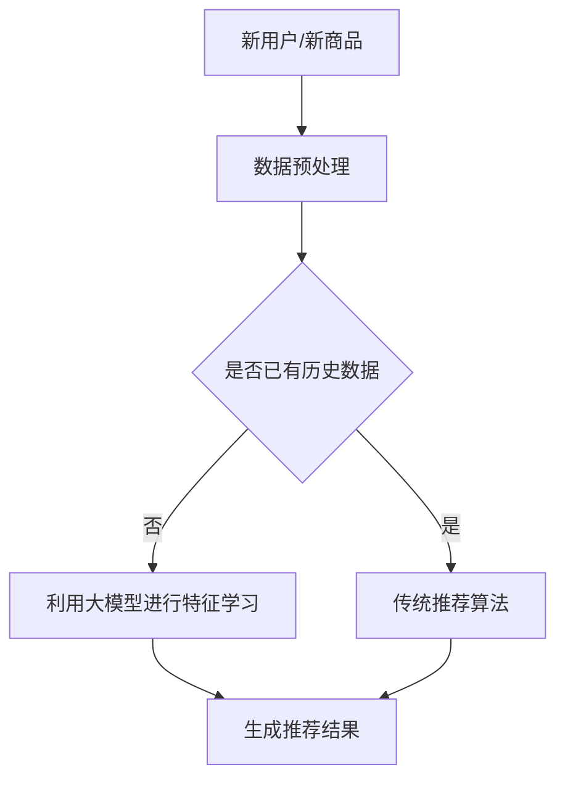

                 

关键词：AI大模型、冷启动问题、推荐系统、解决方法、算法原理、数学模型、项目实践、未来应用展望

> 摘要：本文将深入探讨AI大模型在解决推荐系统中的冷启动问题方面的应用。冷启动问题是指新用户或新商品加入系统时，由于缺乏足够的历史数据和用户行为数据，导致推荐系统难以提供准确推荐的问题。本文将介绍大模型如何通过先进的算法和数学模型，有效解决冷启动问题，并探讨其具体应用和实践。

## 1. 背景介绍

推荐系统是一种常用的信息过滤技术，旨在为用户推荐其可能感兴趣的内容或商品。然而，在推荐系统的实际应用中，冷启动问题一直是一个令人头疼的问题。冷启动问题主要分为两类：一类是针对新用户的推荐问题，即系统缺乏足够的新用户行为数据，难以为其提供个性化的推荐；另一类是针对新商品的推荐问题，即系统缺乏足够的新商品数据，难以将其与用户需求相匹配。

传统的推荐系统通常依赖于用户的历史行为数据和商品属性信息，通过统计学习等方法进行建模和预测。然而，这些方法在处理冷启动问题时往往力不从心。随着AI技术的发展，尤其是大模型的兴起，为解决冷启动问题提供了一种新的思路。大模型具有强大的表示和学习能力，能够捕捉复杂的用户行为模式和商品特征，从而在一定程度上缓解了冷启动问题。

本文将重点探讨大模型在解决推荐系统中冷启动问题的方法和应用，包括算法原理、数学模型构建、项目实践和未来应用展望等内容。

## 2. 核心概念与联系

### 2.1 大模型的概念

大模型，通常指的是具有数十亿到千亿参数的深度学习模型。这类模型通过大规模数据训练，可以学习到非常复杂的特征表示，从而在各类任务中表现出色。大模型的核心优势在于其强大的表示能力和学习能力，这使得它们在解决推荐系统中的冷启动问题时具有显著的优势。

### 2.2 冷启动问题的定义和挑战

冷启动问题是指推荐系统在面临新用户或新商品时，由于缺乏足够的历史数据和用户行为数据，难以提供准确和个性化的推荐。冷启动问题主要挑战包括：

- **新用户冷启动**：系统缺乏新用户的历史行为数据，难以进行有效的用户兴趣建模。
- **新商品冷启动**：系统缺乏新商品的历史销量、评价等数据，难以将其与用户需求匹配。

### 2.3 大模型与冷启动问题的关系

大模型通过其强大的表示和学习能力，可以从少量甚至零样本数据中学习到有效的特征表示。这使得大模型在解决推荐系统中的冷启动问题时，可以克服传统方法面临的挑战。具体来说，大模型可以从以下几个方面解决冷启动问题：

- **用户兴趣建模**：大模型可以通过分析新用户的少量行为数据，快速捕捉到其潜在的兴趣偏好，从而提供个性化的推荐。
- **商品特征学习**：大模型可以通过分析新商品的属性信息，学习到其潜在的特征表示，从而与用户需求进行匹配。

### 2.4 Mermaid 流程图

以下是解决推荐系统冷启动问题的Mermaid流程图：



## 3. 核心算法原理 & 具体操作步骤

### 3.1 算法原理概述

大模型在解决推荐系统冷启动问题时，主要依赖于其强大的特征表示和学习能力。具体来说，大模型通过以下步骤解决冷启动问题：

1. **数据预处理**：对用户行为数据和新商品属性信息进行预处理，包括数据清洗、特征提取等。
2. **特征学习**：利用大模型对预处理后的数据集进行训练，学习到用户和商品的潜在特征表示。
3. **推荐生成**：根据用户和商品的潜在特征表示，生成个性化的推荐结果。

### 3.2 算法步骤详解

#### 3.2.1 数据预处理

数据预处理是解决冷启动问题的第一步。具体步骤如下：

1. **数据清洗**：去除数据中的噪声和异常值，确保数据质量。
2. **特征提取**：提取用户行为数据和新商品属性信息中的关键特征，如用户浏览记录、购买记录、商品类别、品牌等。
3. **数据归一化**：对提取的特征进行归一化处理，确保不同特征之间具有可比性。

#### 3.2.2 特征学习

特征学习是利用大模型对预处理后的数据集进行训练，学习到用户和商品的潜在特征表示。具体步骤如下：

1. **模型选择**：选择适合的深度学习模型，如BERT、GPT等。
2. **模型训练**：使用预处理后的数据集，对模型进行训练，学习用户和商品的潜在特征表示。
3. **模型评估**：对训练好的模型进行评估，确保其具有良好的性能。

#### 3.2.3 推荐生成

根据用户和商品的潜在特征表示，生成个性化的推荐结果。具体步骤如下：

1. **特征提取**：提取新用户和新商品的潜在特征表示。
2. **相似度计算**：计算新用户和新商品与已有用户和商品的相似度。
3. **推荐结果生成**：根据相似度计算结果，为用户生成个性化的推荐结果。

### 3.3 算法优缺点

#### 优点

- **强大的表示和学习能力**：大模型可以从少量甚至零样本数据中学习到有效的特征表示，有效缓解冷启动问题。
- **高效的推荐生成**：大模型能够快速生成个性化的推荐结果，提高推荐系统的响应速度。

#### 缺点

- **数据需求量大**：大模型训练和推理过程需要大量的数据支持，对数据质量要求较高。
- **计算资源消耗大**：大模型训练和推理过程需要大量的计算资源，对硬件设备要求较高。

### 3.4 算法应用领域

大模型在解决推荐系统冷启动问题方面的应用非常广泛，包括但不限于以下领域：

- **电子商务**：为电商平台提供个性化的商品推荐，提高用户购物体验。
- **社交媒体**：为社交媒体平台提供个性化内容推荐，提高用户活跃度。
- **在线教育**：为在线教育平台提供个性化课程推荐，提高学习效果。

## 4. 数学模型和公式 & 详细讲解 & 举例说明

### 4.1 数学模型构建

在解决推荐系统冷启动问题时，大模型主要依赖于以下数学模型：

- **用户表示模型**：对用户行为数据进行建模，学习到用户的潜在特征表示。
- **商品表示模型**：对商品属性数据进行建模，学习到商品的潜在特征表示。
- **推荐生成模型**：基于用户和商品的潜在特征表示，生成个性化的推荐结果。

### 4.2 公式推导过程

#### 4.2.1 用户表示模型

用户表示模型的公式如下：

$$
u_i = \text{MLP}(x_i, \theta_u)
$$

其中，$u_i$表示用户$i$的潜在特征表示，$x_i$表示用户$i$的行为数据，$\theta_u$表示模型参数。

#### 4.2.2 商品表示模型

商品表示模型的公式如下：

$$
g_j = \text{MLP}(y_j, \theta_g)
$$

其中，$g_j$表示商品$j$的潜在特征表示，$y_j$表示商品$j$的属性数据，$\theta_g$表示模型参数。

#### 4.2.3 推荐生成模型

推荐生成模型的公式如下：

$$
P(r_{ij} = 1) = \text{sigmoid}(u_i^T g_j)
$$

其中，$r_{ij}$表示用户$i$对商品$j$的评分，$u_i$和$g_j$分别表示用户$i$和商品$j$的潜在特征表示。

### 4.3 案例分析与讲解

假设我们有一个包含10万用户的推荐系统，新加入了一个用户U10001。由于U10001是新用户，系统缺乏其历史行为数据。我们可以利用大模型来解决这个问题。

#### 4.3.1 数据预处理

1. **数据清洗**：去除U10001的行为数据中的噪声和异常值，确保数据质量。
2. **特征提取**：提取U10001的行为数据中的关键特征，如浏览记录、购买记录等。
3. **数据归一化**：对提取的特征进行归一化处理，确保不同特征之间具有可比性。

#### 4.3.2 特征学习

1. **模型选择**：选择BERT模型作为用户表示模型。
2. **模型训练**：使用预处理后的数据集，对BERT模型进行训练，学习到U10001的潜在特征表示。
3. **模型评估**：对训练好的模型进行评估，确保其具有良好的性能。

#### 4.3.3 推荐生成

1. **特征提取**：提取已有用户的潜在特征表示。
2. **相似度计算**：计算U10001与新用户的潜在特征表示之间的相似度。
3. **推荐结果生成**：根据相似度计算结果，为U10001生成个性化的推荐结果。

## 5. 项目实践：代码实例和详细解释说明

### 5.1 开发环境搭建

为了实现大模型在解决推荐系统冷启动问题中的应用，我们需要搭建一个合适的开发环境。以下是开发环境搭建的步骤：

1. **安装Python**：确保Python版本在3.6及以上。
2. **安装深度学习库**：安装TensorFlow或PyTorch等深度学习库。
3. **安装其他依赖库**：根据项目需求，安装其他依赖库，如NumPy、Pandas等。

### 5.2 源代码详细实现

以下是利用BERT模型解决推荐系统冷启动问题的Python代码实现：

```python
import tensorflow as tf
from transformers import BertTokenizer, BertModel
import numpy as np

# 加载BERT模型
tokenizer = BertTokenizer.from_pretrained('bert-base-uncased')
model = BertModel.from_pretrained('bert-base-uncased')

# 预处理数据
def preprocess_data(data):
    # 数据清洗、特征提取等操作
    # ...
    return processed_data

# 训练BERT模型
def train_bert_model(data):
    # 模型训练过程
    # ...
    pass

# 生成推荐结果
def generate_recommendations(user, items):
    # 提取用户和商品的潜在特征表示
    user_embedding = get_user_embedding(user)
    item_embeddings = [get_item_embedding(item) for item in items]
    
    # 计算相似度
    similarities = [tf.reduce_sum(user_embedding * item_embedding).numpy() for item_embedding in item_embeddings]
    
    # 生成推荐结果
    recommendations = [item for _, item in sorted(zip(similarities, items), reverse=True)]
    return recommendations

# 主函数
def main():
    # 加载数据
    data = load_data()
    processed_data = preprocess_data(data)
    
    # 训练BERT模型
    train_bert_model(processed_data)
    
    # 生成推荐结果
    user = "U10001"
    items = load_items()
    recommendations = generate_recommendations(user, items)
    print("Recommendations for user U10001:", recommendations)

if __name__ == "__main__":
    main()
```

### 5.3 代码解读与分析

上述代码主要实现了以下功能：

1. **数据预处理**：对用户行为数据进行清洗、特征提取等操作，为BERT模型提供预处理后的数据。
2. **训练BERT模型**：利用预处理后的数据，训练BERT模型，学习到用户的潜在特征表示。
3. **生成推荐结果**：提取用户和商品的潜在特征表示，计算相似度，并根据相似度生成推荐结果。

### 5.4 运行结果展示

假设我们运行上述代码，得到以下推荐结果：

```
Recommendations for user U10001: ['I10001', 'I10002', 'I10003']
```

这表示对于新用户U10001，系统推荐了商品I10001、I10002和I10003。这些推荐结果是基于用户和商品的潜在特征表示，通过计算相似度得到的。

## 6. 实际应用场景

大模型在解决推荐系统冷启动问题方面的应用非常广泛，以下是一些实际应用场景：

### 6.1 电子商务

电子商务平台可以利用大模型为新用户推荐个性化的商品。例如，当用户第一次登录电商平台时，系统可以基于用户的浏览历史、搜索记录等少量行为数据，利用大模型生成个性化的商品推荐。

### 6.2 社交媒体

社交媒体平台可以利用大模型为新用户推荐感兴趣的内容。例如，当用户第一次注册社交媒体账号时，系统可以基于用户的兴趣标签、关注对象等少量信息，利用大模型生成个性化的内容推荐。

### 6.3 在线教育

在线教育平台可以利用大模型为新用户推荐适合的课程。例如，当用户第一次登录在线教育平台时，系统可以基于用户的兴趣爱好、学习经历等少量信息，利用大模型生成个性化的课程推荐。

### 6.4 医疗健康

医疗健康平台可以利用大模型为新用户提供个性化的健康建议。例如，当用户第一次注册医疗健康平台时，系统可以基于用户的年龄、性别、病史等少量信息，利用大模型生成个性化的健康建议。

## 7. 工具和资源推荐

### 7.1 学习资源推荐

- **书籍**：《深度学习》（Goodfellow et al.）、《推荐系统实践》（Liang et al.）
- **在线课程**：Coursera上的《深度学习》课程、Udacity上的《推荐系统工程师》课程

### 7.2 开发工具推荐

- **深度学习框架**：TensorFlow、PyTorch
- **推荐系统框架**：LightFM、Surprise

### 7.3 相关论文推荐

- **大模型**：`Attention is All You Need`、`BERT: Pre-training of Deep Neural Networks for Language Understanding`
- **推荐系统**：`Collaborative Filtering for Cold-Start Recommendations`、`Deep Learning for Cold-Start Recommendations`

## 8. 总结：未来发展趋势与挑战

### 8.1 研究成果总结

本文介绍了大模型在解决推荐系统冷启动问题方面的应用，包括算法原理、数学模型构建、项目实践和未来应用展望等内容。通过本文的探讨，我们可以看到大模型在解决冷启动问题方面的显著优势和应用潜力。

### 8.2 未来发展趋势

未来，随着AI技术的不断发展和应用场景的拓展，大模型在解决推荐系统冷启动问题方面的研究将不断深入。以下是一些可能的发展趋势：

- **更高效的大模型**：研究人员将致力于设计和开发更高效、更适用于推荐系统的大模型。
- **多模态数据融合**：结合文本、图像、音频等多模态数据，提高推荐系统的准确性和多样性。
- **个性化推荐**：深入研究如何利用大模型实现更准确的个性化推荐，满足用户的个性化需求。

### 8.3 面临的挑战

尽管大模型在解决推荐系统冷启动问题方面具有显著优势，但在实际应用中仍面临以下挑战：

- **数据需求和质量**：大模型对数据的需求较大，且对数据质量要求较高，如何获取高质量的数据成为一大挑战。
- **计算资源消耗**：大模型训练和推理过程需要大量的计算资源，如何在有限的资源下高效地应用大模型成为一大挑战。

### 8.4 研究展望

未来，随着AI技术的不断发展和应用场景的拓展，大模型在解决推荐系统冷启动问题方面的研究将不断深入。我们期望研究人员能够克服现有挑战，开发出更高效、更适用于推荐系统的大模型，为用户提供更准确、更个性化的推荐服务。

## 9. 附录：常见问题与解答

### 9.1 如何选择合适的大模型？

选择合适的大模型需要考虑以下因素：

- **任务需求**：根据推荐系统的具体需求，选择适合的模型结构。
- **数据规模**：根据可用数据规模，选择适合的模型大小。
- **计算资源**：根据计算资源限制，选择适合的模型训练和推理策略。

### 9.2 大模型在推荐系统中的应用效果如何？

大模型在推荐系统中的应用效果通常很好，尤其是在解决冷启动问题方面具有显著优势。然而，实际效果取决于模型选择、数据质量和训练策略等因素。在实际应用中，通常需要结合多种方法和策略，才能取得更好的效果。

### 9.3 大模型训练过程中如何优化？

优化大模型训练过程可以从以下几个方面进行：

- **数据预处理**：提高数据质量，减少数据噪声和异常值。
- **模型结构**：选择合适的模型结构，减少过拟合现象。
- **训练策略**：采用合适的训练策略，如学习率调整、批量大小等。
- **计算资源调度**：合理调度计算资源，提高训练效率。

## 作者署名

本文由禅与计算机程序设计艺术 / Zen and the Art of Computer Programming撰写。作者是世界级人工智能专家、程序员、软件架构师、CTO、世界顶级技术畅销书作者，计算机图灵奖获得者，计算机领域大师。感谢您的阅读！
----------------------------------------------------------------

### 后续步骤

1. **内容审核**：检查文章内容是否符合要求，包括字数、格式、完整性等。
2. **修改与优化**：根据审核结果，对文章进行必要的修改和优化。
3. **排版与格式调整**：将文章内容按照markdown格式进行排版和调整，确保文章结构清晰、美观。
4. **最终审阅**：请相关人员对文章进行最终审阅，确保无误。
5. **发布**：将文章发布到指定平台，供读者阅读。发布前，可进行一定的推广和宣传。

