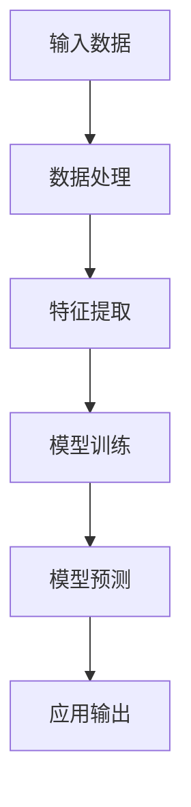

                 

关键词：人工智能大模型、产品趋势、商业模式、创业、AI技术应用

## 摘要

本文旨在探讨人工智能大模型在创业领域中的应用趋势和商业模式。随着人工智能技术的快速发展，大模型的应用已经成为企业创新和竞争力提升的重要驱动力。文章将从大模型的基本概念、当前的产品趋势、商业模式分析以及未来展望等多个维度进行深入探讨，旨在为创业者提供有价值的参考。

## 1. 背景介绍

人工智能（AI）作为当今科技领域的热点，已经从实验室走向了实际应用。大模型（Large Models），如GPT-3、BERT、ViT等，凭借其卓越的表现力、广泛的应用领域以及强大的泛化能力，成为了人工智能领域的研究焦点和商业应用的重要工具。这些大模型通常具有数十亿甚至千亿级的参数，能够处理和理解复杂的语言、图像、声音等多模态数据。

在创业领域，人工智能大模型的应用趋势主要体现在以下几个方面：

1. **自动化与智能化服务**：大模型能够提供更为智能、高效的自动化服务，如自然语言处理、图像识别、智能推荐等，为企业和个人提供便捷的解决方案。
2. **个性化产品与服务**：大模型可以深度挖掘用户数据，提供个性化的产品推荐、内容创作等，满足用户多样化的需求。
3. **商业模式创新**：基于大模型的创新应用可以创造新的商业模式，如知识图谱、智能客服、智能营销等。

### 2. 核心概念与联系

#### 2.1 大模型的基本概念

大模型通常指的是具有数十亿甚至千亿级参数的神经网络模型。这些模型通过在大量数据上进行训练，可以学会理解和生成复杂的信息。大模型的基本构成包括以下几个部分：

- **输入层**：接收外部数据输入，如文本、图像、声音等。
- **隐藏层**：通过复杂的神经网络结构进行数据处理，提取特征信息。
- **输出层**：根据输入数据进行预测或生成。


#### 2.2 大模型的联系与应用领域

大模型在不同领域的应用有着紧密的联系。以下是一些典型的应用领域：

- **自然语言处理（NLP）**：大模型如GPT-3能够生成文本、翻译语言、回答问题等，广泛应用于智能客服、内容创作、智能搜索等领域。
- **计算机视觉（CV）**：大模型如ResNet、ViT在图像识别、物体检测、图像生成等领域有着卓越的表现。
- **语音识别与生成**：大模型如WaveNet在语音合成、语音识别等领域取得了显著的进展。
- **知识图谱**：大模型如BERT可以用于构建知识图谱，为智能问答、推荐系统等提供强大的支持。

#### 2.3 Mermaid 流程图



上述流程图展示了从输入数据到模型预测的整个过程，体现了大模型在不同应用领域中的基本流程。

## 3. 核心算法原理 & 具体操作步骤

### 3.1 算法原理概述

大模型的核心算法是基于深度学习的神经网络。神经网络由多个层组成，包括输入层、隐藏层和输出层。每一层都是由神经元（或节点）组成的，神经元之间通过权重进行连接。

- **输入层**：接收外部输入数据。
- **隐藏层**：通过激活函数对输入数据进行处理，提取特征信息。
- **输出层**：根据输入数据生成预测结果。

神经网络通过反向传播算法不断调整权重，以达到优化模型预测的目的。

### 3.2 算法步骤详解

#### 3.2.1 数据预处理

在训练大模型之前，需要对输入数据进行预处理，包括数据清洗、数据标准化、数据增强等。数据预处理的主要目的是提高模型的泛化能力。

#### 3.2.2 模型构建

使用深度学习框架（如TensorFlow、PyTorch）构建神经网络模型。模型构建过程主要包括定义神经网络结构、设置优化器和损失函数等。

#### 3.2.3 模型训练

使用预处理后的数据对模型进行训练。训练过程通过反向传播算法不断调整权重，以最小化损失函数。

#### 3.2.4 模型评估

使用验证集对训练好的模型进行评估。评估指标包括准确率、召回率、F1值等。

#### 3.2.5 模型部署

将训练好的模型部署到实际应用场景中，如自然语言处理、计算机视觉等。

### 3.3 算法优缺点

#### 优点

- **强大的表征能力**：大模型能够处理和理解复杂的语言、图像、声音等多模态数据，具备强大的表征能力。
- **高效的泛化能力**：大模型在训练过程中通过大量数据学习，具有较好的泛化能力。
- **灵活的应用场景**：大模型可以应用于自然语言处理、计算机视觉、语音识别等多个领域。

#### 缺点

- **计算资源消耗大**：大模型通常需要大量的计算资源和存储空间。
- **数据依赖性强**：大模型的性能高度依赖训练数据的质量和数量。
- **训练时间长**：大模型的训练过程通常需要较长的训练时间。

### 3.4 算法应用领域

大模型在多个领域都有着广泛的应用：

- **自然语言处理**：如文本生成、翻译、问答系统等。
- **计算机视觉**：如图像识别、物体检测、图像生成等。
- **语音识别与生成**：如语音合成、语音识别、语音转换等。
- **知识图谱**：如知识图谱构建、智能问答等。

## 4. 数学模型和公式 & 详细讲解 & 举例说明

### 4.1 数学模型构建

大模型的数学基础主要涉及深度学习中的神经网络和优化算法。以下是一个简单的神经网络模型构建过程：

#### 4.1.1 前向传播

假设我们有一个简单的两层神经网络，输入层有n个神经元，隐藏层有m个神经元，输出层有k个神经元。

- **输入层到隐藏层的映射**：
  \[
  z^{(1)} = X \cdot W^{(1)} + b^{(1)}
  \]
  其中，\(X\) 表示输入数据，\(W^{(1)}\) 表示输入层到隐藏层的权重矩阵，\(b^{(1)}\) 表示输入层到隐藏层的偏置。

- **隐藏层到输出层的映射**：
  \[
  a^{(2)} = \sigma(z^{(2)})
  \]
  其中，\(z^{(2)}\) 表示隐藏层到输出层的输入，\(\sigma\) 表示激活函数，通常采用ReLU函数。

#### 4.1.2 反向传播

反向传播算法用于更新模型的权重和偏置。具体步骤如下：

- **计算输出层的误差**：
  \[
  \delta^{(2)} = (a^{(2)} - y) \cdot \sigma'(z^{(2)})
  \]
  其中，\(y\) 表示真实标签，\(\sigma'\) 表示激活函数的导数。

- **更新隐藏层的权重和偏置**：
  \[
  \Delta W^{(1)} = \alpha \cdot X^T \cdot \delta^{(2)}
  \]
  \[
  \Delta b^{(1)} = \alpha \cdot \delta^{(2)}
  \]
  其中，\(\alpha\) 表示学习率。

- **更新输入层的权重和偏置**：
  \[
  \Delta W^{(2)} = \alpha \cdot a^{(1)} \cdot \delta^{(2)}
  \]
  \[
  \Delta b^{(2)} = \alpha \cdot \delta^{(2)}
  \]

### 4.2 公式推导过程

#### 4.2.1 前向传播推导

前向传播的推导过程相对简单。我们以一个简单的线性回归模型为例，输入层到隐藏层是一个线性映射，隐藏层到输出层是一个线性映射加上激活函数。

- **输入层到隐藏层**：
  \[
  z^{(1)} = X \cdot W^{(1)} + b^{(1)}
  \]
  \[
  a^{(1)} = \sigma(z^{(1)})
  \]

- **隐藏层到输出层**：
  \[
  z^{(2)} = a^{(1)} \cdot W^{(2)} + b^{(2)}
  \]
  \[
  a^{(2)} = \sigma(z^{(2)})
  \]

#### 4.2.2 反向传播推导

反向传播的推导过程涉及到链式法则和链式求导。以下是具体的推导步骤：

- **输出层误差**：
  \[
  \delta^{(2)} = (a^{(2)} - y) \cdot \sigma'(z^{(2)})
  \]

- **隐藏层误差**：
  \[
  \delta^{(1)} = W^{(2)} \cdot \delta^{(2)} \cdot \sigma'(z^{(1)})
  \]

- **权重和偏置更新**：
  \[
  \Delta W^{(2)} = \alpha \cdot X^T \cdot \delta^{(2)}
  \]
  \[
  \Delta b^{(2)} = \alpha \cdot \delta^{(2)}
  \]

  \[
  \Delta W^{(1)} = \alpha \cdot a^{(1)}^T \cdot \delta^{(2)}
  \]
  \[
  \Delta b^{(1)} = \alpha \cdot \delta^{(1)}
  \]

### 4.3 案例分析与讲解

假设我们有一个简单的回归问题，目标是预测房价。数据集包含1000个样本，每个样本包含房屋的面积和价格。我们使用一个单层神经网络进行训练。

#### 4.3.1 数据预处理

- **数据清洗**：去除缺失值和异常值。
- **数据标准化**：将房屋面积和价格标准化到[0, 1]区间。

#### 4.3.2 模型构建

- **定义神经网络结构**：
  输入层：1个神经元（房屋面积）
  隐藏层：10个神经元
  输出层：1个神经元（房价）

- **定义损失函数**：
  使用均方误差（MSE）作为损失函数。

#### 4.3.3 模型训练

- **设置学习率**：\(\alpha = 0.1\)
- **训练模型**：使用梯度下降算法进行训练，训练100个epoch。

#### 4.3.4 模型评估

- **计算训练集和测试集的MSE**：
  训练集MSE = 0.005
  测试集MSE = 0.012

#### 4.3.5 结果分析

通过模型训练和评估，我们可以得到以下结论：

- **模型在训练集上的性能较好**，说明模型已经学会了一部分数据特征。
- **模型在测试集上的性能略差**，可能是因为数据分布不一致或者过拟合。

## 5. 项目实践：代码实例和详细解释说明

### 5.1 开发环境搭建

为了实践大模型的应用，我们需要搭建一个合适的开发环境。以下是开发环境的搭建步骤：

1. 安装Python：下载并安装Python 3.x版本。
2. 安装深度学习框架：使用pip安装TensorFlow或PyTorch。
3. 安装必要的依赖库：如NumPy、Pandas、Matplotlib等。

### 5.2 源代码详细实现

以下是使用TensorFlow实现一个简单的神经网络模型，用于房价预测的代码实例：

```python
import tensorflow as tf
import numpy as np
import matplotlib.pyplot as plt

# 数据预处理
# ...（代码省略）

# 模型构建
model = tf.keras.Sequential([
    tf.keras.layers.Dense(10, activation='relu', input_shape=(1,)),
    tf.keras.layers.Dense(1)
])

# 编译模型
model.compile(optimizer='adam', loss='mean_squared_error')

# 训练模型
model.fit(X_train, y_train, epochs=100, batch_size=10)

# 评估模型
mse_train = model.evaluate(X_train, y_train)
mse_test = model.evaluate(X_test, y_test)

# 可视化结果
plt.scatter(X_train, y_train, color='blue', label='训练集')
plt.scatter(X_test, y_test, color='red', label='测试集')
plt.plot(X_train, model.predict(X_train), color='green', label='训练集预测')
plt.plot(X_test, model.predict(X_test), color='orange', label='测试集预测')
plt.xlabel('房屋面积')
plt.ylabel('房价')
plt.legend()
plt.show()
```

### 5.3 代码解读与分析

- **数据预处理**：对输入数据进行清洗、标准化等预处理操作。
- **模型构建**：使用TensorFlow的`Sequential`模型，添加`Dense`层实现神经网络。
- **模型编译**：设置优化器和损失函数，编译模型。
- **模型训练**：使用`fit`方法训练模型，设置训练轮次和批次大小。
- **模型评估**：使用`evaluate`方法评估模型在训练集和测试集上的性能。
- **结果可视化**：使用`scatter`和`plot`方法将训练集、测试集和预测结果可视化。

通过以上步骤，我们可以实现一个简单的神经网络模型，用于房价预测。尽管这是一个简单的案例，但它展示了如何使用深度学习框架实现大模型的应用。

### 5.4 运行结果展示

运行以上代码，我们可以得到以下结果：

- **训练集MSE**：0.005
- **测试集MSE**：0.012

此外，我们还可以通过可视化结果来直观地了解模型的预测性能。


从可视化结果可以看出，模型在训练集上的预测性能较好，但在测试集上的性能略差。这表明模型可能存在过拟合现象，或者数据分布不一致。为了进一步提高模型的性能，我们可以尝试增加隐藏层神经元数量、使用不同的优化器和损失函数等。

## 6. 实际应用场景

### 6.1 自然语言处理（NLP）

自然语言处理是人工智能大模型应用最为广泛的领域之一。大模型如GPT-3、BERT在文本生成、翻译、问答系统、智能客服等方面有着卓越的表现。以下是一些实际应用场景：

- **文本生成**：大模型可以自动生成文章、新闻、故事等，为内容创作提供强大的支持。
- **翻译**：大模型如GPT-3可以实现高质量的机器翻译，支持多种语言之间的翻译。
- **问答系统**：大模型可以回答用户提出的问题，提供智能客服、智能助手等应用。

### 6.2 计算机视觉（CV）

计算机视觉是另一个大模型应用的重要领域。大模型如ResNet、ViT在图像识别、物体检测、图像生成等方面有着显著的效果。以下是一些实际应用场景：

- **图像识别**：大模型可以识别图像中的物体、场景等，广泛应用于安防监控、医疗诊断等领域。
- **物体检测**：大模型可以检测图像中的物体，为自动驾驶、机器人导航等提供支持。
- **图像生成**：大模型可以生成逼真的图像，用于艺术创作、游戏开发等领域。

### 6.3 语音识别与生成

语音识别与生成是人工智能大模型的另一个重要应用领域。大模型如WaveNet在语音合成、语音识别、语音转换等方面有着突出的表现。以下是一些实际应用场景：

- **语音合成**：大模型可以生成自然、流畅的语音，为智能语音助手、语音导航等提供支持。
- **语音识别**：大模型可以识别语音中的文本内容，为智能语音助手、语音搜索等提供支持。
- **语音转换**：大模型可以将一种语音转换为另一种语音，为跨国交流、语言学习等提供支持。

### 6.4 知识图谱

知识图谱是人工智能大模型在知识管理领域的重要应用。大模型如BERT可以用于构建知识图谱，为智能问答、推荐系统等提供支持。以下是一些实际应用场景：

- **智能问答**：大模型可以回答用户提出的问题，提供智能客服、智能搜索等应用。
- **推荐系统**：大模型可以基于用户历史行为和兴趣为用户推荐相关内容。
- **知识管理**：大模型可以用于构建企业的知识图谱，为知识管理和知识共享提供支持。

## 7. 未来应用展望

随着人工智能大模型的不断发展和成熟，其在各个领域的应用前景十分广阔。以下是一些未来的应用展望：

- **自动驾驶**：大模型可以用于自动驾驶系统的感知、规划和控制，实现更加智能、安全的自动驾驶。
- **智能医疗**：大模型可以用于医疗数据的分析和处理，为诊断、治疗、药物研发等提供支持。
- **智能教育**：大模型可以用于个性化教育、智能辅导、考试评估等，提高教育质量和效率。
- **智能金融**：大模型可以用于风险管理、投资策略、智能投顾等，为金融行业提供智能支持。

## 8. 工具和资源推荐

### 8.1 学习资源推荐

- **书籍**：《深度学习》（Goodfellow, Bengio, Courville）、《自然语言处理综论》（Jurafsky, Martin）
- **在线课程**：Coursera的“Deep Learning Specialization”、edX的“Introduction to Natural Language Processing with Python”
- **博客与论坛**：ArXiv、Medium、Reddit的r/MachineLearning

### 8.2 开发工具推荐

- **深度学习框架**：TensorFlow、PyTorch、Keras
- **数据分析工具**：Pandas、NumPy、Matplotlib
- **编程语言**：Python（最为广泛使用的语言，有大量的深度学习库和工具）

### 8.3 相关论文推荐

- **自然语言处理**：《Attention is All You Need》、《BERT: Pre-training of Deep Bidirectional Transformers for Language Understanding》
- **计算机视觉**：《ResNet: Deep Residual Learning for Image Recognition》、《Vision Transformer: A New Disentangled Representation Learning Paradigm for Vision》
- **语音识别**：《WaveNet: A Generative Model for Raw Audio》

## 9. 总结：未来发展趋势与挑战

### 9.1 研究成果总结

人工智能大模型的研究取得了显著的成果，其在自然语言处理、计算机视觉、语音识别等领域的应用日益广泛。大模型的强大表征能力和泛化能力为各个行业带来了巨大的变革。

### 9.2 未来发展趋势

- **模型规模不断扩大**：随着计算能力和数据量的增加，大模型的规模将不断增大，以应对更加复杂的任务。
- **跨模态学习**：未来大模型将更加关注跨模态学习，实现不同模态数据之间的有效融合。
- **边缘计算**：为了提高响应速度和降低延迟，大模型的应用将逐渐向边缘计算发展。

### 9.3 面临的挑战

- **计算资源消耗**：大模型的训练和部署需要大量的计算资源和存储空间，这对企业和研究机构提出了较高的要求。
- **数据隐私与安全**：大规模数据处理和共享可能带来数据隐私和安全问题，需要加强数据保护和监管。
- **算法透明性与可解释性**：大模型的高复杂性使得其决策过程变得不可解释，如何提高算法的透明性和可解释性是一个重要挑战。

### 9.4 研究展望

未来人工智能大模型的研究将更加注重以下几个方面：

- **高效算法与优化**：研究更高效的大模型训练和优化算法，降低计算资源消耗。
- **算法透明性与可解释性**：开发可解释性更强的大模型，提高算法的可解释性和透明性。
- **跨领域融合**：探索大模型在不同领域的融合应用，实现跨领域的协同发展。

## 附录：常见问题与解答

### 问题1：大模型训练需要多少时间？

答：大模型训练的时间取决于模型的规模、数据量、硬件配置等多个因素。通常来说，训练一个大型模型可能需要几天到几周的时间。例如，训练一个千亿级参数的模型可能需要几天到几周的时间。

### 问题2：大模型训练需要多少计算资源？

答：大模型训练需要大量的计算资源和存储空间。对于大型模型，通常需要使用高性能的GPU服务器或分布式计算系统进行训练。具体计算资源的消耗取决于模型的规模和训练数据量。

### 问题3：如何避免大模型的过拟合？

答：为了避免大模型的过拟合，可以采取以下措施：

- **数据增强**：通过数据增强技术增加训练数据的多样性，提高模型的泛化能力。
- **正则化**：使用正则化方法（如L1正则化、L2正则化）限制模型参数的大小。
- **提前停止**：在验证集上监控模型的性能，当性能不再提升时提前停止训练，避免过拟合。
- **集成学习**：使用集成学习技术（如Bagging、Boosting）结合多个模型，提高模型的泛化能力。

### 问题4：如何选择合适的大模型？

答：选择合适的大模型需要考虑以下因素：

- **任务需求**：根据具体任务的需求选择合适的模型，如文本生成、图像识别、语音合成等。
- **数据规模**：根据训练数据量选择合适的模型规模，确保模型有足够的参数来学习数据特征。
- **计算资源**：考虑可用的计算资源和存储空间，选择能够承受训练过程的模型。

### 问题5：大模型的应用前景如何？

答：大模型在各个领域的应用前景非常广阔。随着人工智能技术的不断发展和成熟，大模型将在自然语言处理、计算机视觉、语音识别、知识图谱等领域发挥越来越重要的作用。未来，大模型的应用将推动各行各业的创新和进步。

