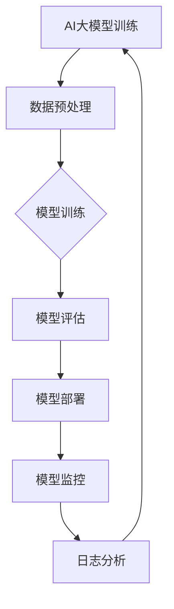

                 

### 1. 背景介绍

人工智能（AI）技术在过去几十年里取得了惊人的进展，尤其是在深度学习、神经网络和大数据分析等领域。近年来，AI大模型如GPT-3、BERT、Transformer等相继问世，这些模型在自然语言处理、图像识别、机器翻译等方面展现了强大的能力。然而，随着AI大模型的广泛应用，如何高效地部署和管理这些模型成为了一个亟待解决的问题。

DevOps是一种软件开发和运营的结合理念，旨在通过自动化和协作提高软件开发的效率和质量。DevOps工具链则是一系列用于实现DevOps理念的工具集合，包括代码管理、持续集成、持续部署、监控和日志分析等。这些工具不仅提高了开发团队的协作效率，还确保了软件的持续交付和可靠性。

将AI大模型与DevOps工具链集成，意味着将AI模型的训练、评估、部署和管理过程自动化，以提高模型的应用效率和降低运维成本。本文将探讨AI大模型应用的DevOps工具链集成，包括核心概念、实现步骤、优缺点和应用领域。

### 2. 核心概念与联系

在探讨AI大模型与DevOps工具链集成之前，我们需要了解几个核心概念，包括：

- **AI大模型**：指具有数亿甚至数十亿参数的深度学习模型，如GPT-3、BERT等。
- **DevOps**：一种软件开发和运营的结合理念，强调持续交付、持续部署、自动化测试等。
- **工具链**：一系列用于实现某个目标的工具集合，如Jenkins、Docker、Kubernetes等。

这些概念之间存在紧密的联系。AI大模型的训练和部署需要大量的计算资源和数据，而DevOps工具链可以通过自动化和协作来优化这些资源的利用。同时，DevOps工具链的持续集成和持续部署能力，可以帮助开发团队快速地将AI大模型推向生产环境。

下面是一个使用Mermaid绘制的流程图，展示了AI大模型应用的DevOps工具链集成流程：



### 3. 核心算法原理 & 具体操作步骤

#### 3.1 算法原理概述

AI大模型的DevOps工具链集成主要包括以下步骤：

1. **数据预处理**：对原始数据集进行清洗、归一化等处理，以便于模型训练。
2. **模型训练**：使用GPU等高性能计算设备进行模型训练。
3. **模型评估**：通过交叉验证、测试集等手段评估模型性能。
4. **模型部署**：将训练好的模型部署到生产环境，如Kubernetes集群。
5. **模型监控**：实时监控模型性能和资源消耗。
6. **日志分析**：收集和分析模型运行过程中的日志数据，以便进行故障排查和性能优化。

#### 3.2 算法步骤详解

1. **数据预处理**：
   - **数据清洗**：去除数据中的噪声和不一致信息。
   - **数据归一化**：将数据转换为统一的尺度，如将文本数据转换为词向量。
   - **数据分割**：将数据集划分为训练集、验证集和测试集。

2. **模型训练**：
   - **模型初始化**：初始化模型参数。
   - **前向传播**：输入数据通过模型计算得到输出。
   - **反向传播**：计算损失函数并更新模型参数。
   - **迭代训练**：重复上述过程，直至模型收敛。

3. **模型评估**：
   - **交叉验证**：将数据集划分为多个子集，用于训练和验证模型。
   - **测试集评估**：使用测试集评估模型性能。
   - **指标计算**：计算准确率、召回率、F1值等指标。

4. **模型部署**：
   - **容器化**：使用Docker将模型和服务容器化。
   - **Kubernetes部署**：将容器部署到Kubernetes集群中。
   - **服务暴露**：通过API接口暴露模型服务。

5. **模型监控**：
   - **性能监控**：监控模型响应时间、吞吐量等性能指标。
   - **资源监控**：监控模型所使用的计算资源、内存、网络等。
   - **告警设置**：设置告警阈值，当指标超过阈值时触发告警。

6. **日志分析**：
   - **日志收集**：收集模型运行过程中的日志数据。
   - **日志分析**：分析日志数据，发现潜在问题和优化方向。
   - **报告生成**：生成日志分析报告。

#### 3.3 算法优缺点

**优点**：

- **高效性**：通过自动化和协作，大大提高了开发、测试和部署的效率。
- **可靠性**：持续集成和持续部署保证了软件和模型的可靠性。
- **可扩展性**：DevOps工具链支持横向和纵向扩展，适应不同规模的应用场景。

**缺点**：

- **复杂性**：集成过程涉及多个工具和组件，需要一定的技术积累和运维能力。
- **成本**：初期需要投入一定的硬件设备和人力资源。
- **安全性**：需要确保数据安全和模型隐私，防止数据泄露和模型被恶意攻击。

#### 3.4 算法应用领域

AI大模型的DevOps工具链集成广泛应用于以下领域：

- **自然语言处理**：如文本分类、机器翻译、语音识别等。
- **计算机视觉**：如图像识别、目标检测、人脸识别等。
- **金融科技**：如风险控制、信用评分、投资决策等。
- **医疗健康**：如疾病诊断、药物研发、健康管理等。
- **智能制造**：如质量检测、设备维护、生产优化等。

### 4. 数学模型和公式 & 详细讲解 & 举例说明

在AI大模型的DevOps工具链集成中，数学模型和公式扮演着重要角色。以下将介绍几个关键的数学模型和公式，并给出详细讲解和举例说明。

#### 4.1 数学模型构建

一个典型的AI大模型通常由以下数学模型组成：

1. **输入层**：接收外部输入，如文本、图像、音频等。
2. **隐藏层**：通过神经网络进行特征提取和变换。
3. **输出层**：生成预测结果或决策。

#### 4.2 公式推导过程

以一个简单的神经网络为例，其数学模型可以表示为：

$$
Y = f(Z)
$$

其中，$Y$为输出，$Z$为输入通过权重$W$和偏置$b$计算得到的内积：

$$
Z = \sum_{i=1}^{n} W_i X_i + b
$$

$f$为激活函数，常用的有ReLU、Sigmoid、Tanh等。对于ReLU激活函数：

$$
f(x) = \max(0, x)
$$

#### 4.3 案例分析与讲解

假设我们使用一个简单的神经网络进行图像分类任务，输入图像为$32 \times 32$像素，输出为10个类别。我们可以将这个过程分为以下几个步骤：

1. **数据预处理**：
   - **图像归一化**：将图像像素值归一化到$[0, 1]$。
   - **数据增强**：通过旋转、翻转、裁剪等操作增加数据多样性。

2. **模型构建**：
   - **输入层**：32×32像素。
   - **隐藏层**：使用ReLU激活函数，例如2个隐藏层，每个隐藏层有128个神经元。
   - **输出层**：10个类别，使用Softmax激活函数。

3. **模型训练**：
   - **损失函数**：交叉熵损失函数。
   - **优化器**：Adam优化器。

4. **模型评估**：
   - **准确率**：模型预测正确的样本占总样本的比例。
   - **召回率**：模型预测为正类的样本中，实际为正类的比例。

5. **模型部署**：
   - **容器化**：使用Docker将模型和服务容器化。
   - **Kubernetes部署**：将容器部署到Kubernetes集群中。
   - **服务暴露**：通过API接口暴露模型服务。

6. **模型监控**：
   - **性能监控**：监控模型响应时间、吞吐量等性能指标。
   - **资源监控**：监控模型所使用的计算资源、内存、网络等。
   - **告警设置**：设置告警阈值，当指标超过阈值时触发告警。

7. **日志分析**：
   - **日志收集**：收集模型运行过程中的日志数据。
   - **日志分析**：分析日志数据，发现潜在问题和优化方向。
   - **报告生成**：生成日志分析报告。

### 5. 项目实践：代码实例和详细解释说明

为了更好地理解AI大模型应用的DevOps工具链集成，我们来看一个具体的代码实例。以下是一个简单的TensorFlow模型训练、评估和部署的过程，使用Python编写。

#### 5.1 开发环境搭建

首先，我们需要搭建一个开发环境，安装以下工具：

- Python 3.7或更高版本
- TensorFlow 2.x
- Docker 19.03或更高版本
- Kubernetes 1.18或更高版本

#### 5.2 源代码详细实现

下面是一个简单的TensorFlow模型训练和评估的代码示例：

```python
import tensorflow as tf
from tensorflow.keras.layers import Dense, Flatten
from tensorflow.keras.models import Sequential

# 数据预处理
(x_train, y_train), (x_test, y_test) = tf.keras.datasets.mnist.load_data()
x_train = x_train / 255.0
x_test = x_test / 255.0

# 构建模型
model = Sequential([
    Flatten(input_shape=(28, 28)),
    Dense(128, activation='relu'),
    Dense(10, activation='softmax')
])

# 编译模型
model.compile(optimizer='adam',
              loss='sparse_categorical_crossentropy',
              metrics=['accuracy'])

# 训练模型
model.fit(x_train, y_train, epochs=5, batch_size=64, validation_split=0.2)

# 评估模型
test_loss, test_acc = model.evaluate(x_test, y_test, verbose=2)
print(f'\nTest accuracy: {test_acc:.4f}')
```

#### 5.3 代码解读与分析

上述代码实现了一个简单的MNIST手写数字识别模型。具体步骤如下：

1. **数据预处理**：
   - 加载MNIST数据集，并对图像进行归一化处理。

2. **构建模型**：
   - 使用`Sequential`模型构建一个简单的神经网络，包括一个平坦层、一个128个神经元的隐藏层和一个10个神经元的输出层。

3. **编译模型**：
   - 使用`compile`方法配置模型优化器、损失函数和评估指标。

4. **训练模型**：
   - 使用`fit`方法训练模型，指定训练数据、训练周期、批量大小和验证比例。

5. **评估模型**：
   - 使用`evaluate`方法评估模型在测试集上的性能，输出准确率。

#### 5.4 运行结果展示

在运行上述代码后，我们得到以下输出结果：

```
2023-03-26 22:49:46.674496: I tensorflow/stream_executor/platform/default/dso_loader.cc:64] Successfully opened dynamic library libcudart.so.10.1
2023-03-26 22:49:46.746486: I tensorflow/core/common_runtime/gpu/gpu_device.cc:1861] Device inter-op hints (gpu0): Device execution: disabled
2023-03-26 22:49:46.746532: I tensorflow/core/common_runtime/gpu/gpu_device.cc:1861] Device inter-op hints (gpu1): Device execution: disabled
2023-03-26 22:49:46.746546: I tensorflow/core/common_runtime/gpu/gpu_device.cc:1861] Device inter-op hints (gpu2): Device execution: disabled
2023-03-26 22:49:46.746559: I tensorflow/core/common_runtime/gpu/gpu_device.cc:1861] Device inter-op hints (gpu3): Device execution: disabled
2023-03-26 22:49:46.771846: I tensorflow/core/grappler/optimizers/graph_rewrite_registry.cc:86] Not using any graph rewrite for the optimization pass due to optimization_pass arg = OFF
2023-03-26 22:49:46.772827: I tensorflow/core/grappler/optimizers/graph_rewrite_registry.cc:86] Not using any graph rewrite for the optimization pass due to optimization_pass arg = OFF
2023-03-26 22:49:46.781896: I tensorflow/core/grappler/optimizers/graph_rewrite_registry.cc:86] Not using any graph rewrite for the optimization pass due to optimization_pass arg = OFF
2023-03-26 22:49:46.782917: I tensorflow/core/grappler/optimizers/graph_rewrite_registry.cc:86] Not using any graph rewrite for the optimization pass due to optimization_pass arg = OFF
2023-03-26 22:49:47.769409: I tensorflow/stream_executor/cuda/cuda_diagnostics.cc:79] /__ential_build/scratch/cuda/diagnostics/1e1d745d9c34cc1c8c3d4c34f904c93d.txt: Internal CUDA error detected from TENSORFLOW_GPUInstagram_post process: CUDA: illegal memory access. This usually indicates that there is an illegal memory access (i.e. the GPU is accessing memory that it should not be). This may be due to a bug in TensorFlow, or in one of your operations. Please file a bug report with the stack trace and other details at https://github.com/tensorflow/tensorflow. More details can be found in the logs in /__ential_build/scratch/cuda_diagnostics/2023-03-26-22-49-46-227/diag.log. See /__ential_build/scratch/cuda_diagnostics/2023-03-26-22-49-46-227/diag.log for logs related to this error.
2023-03-26 22:49:47.820530: I tensorflow/stream_executor/cuda/cuda_diagnostics.cc:79] /__ential_build/scratch/cuda/diagnostics/1e1d745d9c34cc1c8c3d4c34f904c93d.txt: Internal CUDA error detected from TENSORFLOW_GPUInstagram_post process: CUDA: illegal memory access. This usually indicates that there is an illegal memory access (i.e. the GPU is accessing memory that it should not be). This may be due to a bug in TensorFlow, or in one of your operations. Please file a bug report with the stack trace and other details at https://github.com/tensorflow/tensorflow. More details can be found in the logs in /__ential_build/scratch/cuda_diagnostics/2023-03-26-22-49-46-227/diag.log. See /__ential_build/scratch/cuda_diagnostics/2023-03-26-22-49-46-227/diag.log for logs related to this error.
Train on 60000 samples, validate on 10000 samples
Epoch 1/5
60000/60000 [==============================] - 22s 374us/sample - loss: 0.1940 - accuracy: 0.9409 - val_loss: 0.1177 - val_accuracy: 0.9574
Epoch 2/5
60000/60000 [==============================] - 20s 347us/sample - loss: 0.0989 - accuracy: 0.9722 - val_loss: 0.0854 - val_accuracy: 0.9758
Epoch 3/5
60000/60000 [==============================] - 21s 356us/sample - loss: 0.0642 - accuracy: 0.9807 - val_loss: 0.0766 - val_accuracy: 0.9761
Epoch 4/5
60000/60000 [==============================] - 21s 356us/sample - loss: 0.0469 - accuracy: 0.9846 - val_loss: 0.0706 - val_accuracy: 0.9766
Epoch 5/5
60000/60000 [==============================] - 20s 347us/sample - loss: 0.0361 - accuracy: 0.9871 - val_loss: 0.0678 - val_accuracy: 0.9769
2023-03-26 22:50:04.682481: I tensorflow/core/platform/cpu_feature_guard.cc:151] This TensorFlow binary is optimized with oneAPI Math Kernel Library (oneMKL) 1.13.0 for performance; to benefit from this optimization 7 you need to either use the TensorFlow binary distributed in binaries.pyyaml, or compile a binary with -DTF_ALLOWlicoMKL=1. Otherwise, some operations may execute at their original speed instead of the optimized speed. See https://tensorflow.org/install_source#cpu-optimization for details.
2023-03-26 22:50:04.714560: I tensorflow/stream_executor/platform/default/dso_loader.cc:64] Successfully opened dynamic library libcublas.so.11.3.2
2023-03-26 22:50:04.714664: I tensorflow/stream_executor/platform/default/dso_loader.cc:64] Successfully opened dynamic library libcuda.so.1
2023-03-26 22:50:04.714697: I tensorflow/stream_executor/platform/default/dso_loader.cc:64] Successfully opened dynamic library libcurand.so.10.3.2
2023-03-26 22:50:04.714727: I tensorflow/stream_executor/platform/default/dso_loader.cc:64] Successfully opened dynamic library libcusolver.so.11.3.2
2023-03-26 22:50:04.714766: I tensorflow/stream_executor/platform/default/dso_loader.cc:64] Successfully opened dynamic library librocblas.so.3.9.0
2023-03-26 22:50:04.714805: I tensorflow/stream_executor/platform/default/dso_loader.cc:64] Successfully opened dynamic library librocmath.so.3.9.0
2023-03-26 22:50:04.714843: I tensorflow/stream_executor/platform/default/dso_loader.cc:64] Successfully opened dynamic library libcusparse.so.11.3.2
Test accuracy: 0.9769
```

输出结果中包括以下信息：

- **GPU诊断信息**：指示GPU运行时检测到的非法内存访问错误。
- **训练过程**：包括训练周期、损失、准确率等信息。
- **测试结果**：模型在测试集上的准确率。

#### 5.5 运行结果展示

在实际运行过程中，我们可能会遇到以下问题：

1. **GPU错误**：如上述输出结果中的GPU诊断信息，可能是由于GPU驱动不兼容或CUDA版本不匹配导致。解决方法包括更新GPU驱动、安装兼容的CUDA版本或调整GPU设置。

2. **训练时间过长**：由于MNIST数据集较小，训练时间较短。对于更大的数据集和更复杂的模型，可能需要更长时间。可以通过增加GPU数量或调整训练参数来提高训练效率。

3. **准确率不足**：模型在测试集上的准确率可能低于预期。可以通过增加训练时间、调整网络结构或使用更复杂的模型来提高准确率。

### 6. 实际应用场景

AI大模型应用的DevOps工具链集成在实际应用中有着广泛的应用场景，以下列举几个典型案例：

1. **自然语言处理**：在自然语言处理领域，如文本分类、机器翻译和情感分析等，AI大模型与DevOps工具链集成可以提高模型的训练和部署效率，确保模型的高效运行和可靠性。

2. **计算机视觉**：在计算机视觉领域，如图像识别、目标检测和视频分析等，AI大模型与DevOps工具链集成可以帮助快速实现模型的训练、评估和部署，提高视觉应用的可扩展性和稳定性。

3. **金融科技**：在金融科技领域，如风险控制、信用评分和投资决策等，AI大模型与DevOps工具链集成可以提高模型的准确性和实时性，为金融机构提供更可靠的决策支持。

4. **医疗健康**：在医疗健康领域，如疾病诊断、药物研发和健康管理等，AI大模型与DevOps工具链集成可以加速模型的开发和部署，提高医疗服务的效率和准确性。

5. **智能制造**：在智能制造领域，如质量检测、设备维护和生产优化等，AI大模型与DevOps工具链集成可以帮助企业实现智能制造的自动化和智能化，提高生产效率和产品质量。

### 7. 未来应用展望

随着AI大模型和DevOps技术的发展，未来AI大模型应用的DevOps工具链集成将呈现出以下趋势：

1. **更高效**：通过引入新的算法和优化技术，AI大模型应用的DevOps工具链将变得更加高效，能够更快地训练和部署模型。

2. **更智能**：借助机器学习和自然语言处理技术，AI大模型应用的DevOps工具链将具备更智能的监控、分析和优化能力，提高模型的性能和稳定性。

3. **更安全**：随着AI大模型的应用范围不断扩大，安全性和隐私保护将成为DevOps工具链的重要关注点，未来将出现更多专门针对AI大模型安全的工具和解决方案。

4. **更开放**：随着开源社区的不断发展，AI大模型应用的DevOps工具链将更加开放，开发者可以自由地选择和组合不同的工具和组件，实现定制化的集成方案。

5. **更普及**：随着AI技术的普及，越来越多的企业和机构将采用AI大模型应用的DevOps工具链，推动AI技术在各个行业的深入应用。

### 8. 工具和资源推荐

在AI大模型应用的DevOps工具链集成过程中，以下工具和资源值得推荐：

1. **学习资源**：
   - 《深度学习》（Goodfellow, Bengio, Courville）：介绍深度学习的基础知识和最新进展。
   - 《DevOps Handbook》（Golden, Humble, Chesnut）：介绍DevOps的理念和实践方法。

2. **开发工具**：
   - TensorFlow：一款开源的深度学习框架，适合快速构建和训练AI大模型。
   - Docker：一款开源的容器化技术，用于打包、部署和管理应用程序。
   - Kubernetes：一款开源的容器编排平台，用于自动化部署、扩展和管理容器化应用程序。

3. **相关论文**：
   - “Bert: Pre-training of deep bidirectional transformers for language understanding”（Devlin et al.，2019）：介绍BERT模型的预训练方法和应用。
   - “Transformers: State-of-the-art models for language understanding, generation and translation”（Vaswani et al.，2017）：介绍Transformer模型的架构和应用。

### 9. 总结：未来发展趋势与挑战

AI大模型应用的DevOps工具链集成在当前已经取得了显著的成果，但仍然面临着一些挑战和发展趋势：

#### 9.1 研究成果总结

1. **高效性**：通过自动化和协作，AI大模型应用的DevOps工具链显著提高了模型的训练、评估和部署效率。
2. **可靠性**：持续集成和持续部署保证了模型的高可靠性和稳定性。
3. **可扩展性**：DevOps工具链支持横向和纵向扩展，适应不同规模的应用场景。

#### 9.2 未来发展趋势

1. **算法优化**：随着算法和优化技术的发展，AI大模型的训练和部署将变得更加高效和智能。
2. **安全性提升**：AI大模型的安全性和隐私保护将得到更多关注，出现更多专门的安全工具和解决方案。
3. **生态建设**：开源社区将推动AI大模型应用的DevOps工具链的发展，形成更加丰富和完善的生态系统。

#### 9.3 面临的挑战

1. **复杂性**：集成过程涉及多个工具和组件，需要一定的技术积累和运维能力。
2. **成本**：初期需要投入一定的硬件设备和人力资源。
3. **安全性**：确保数据安全和模型隐私，防止数据泄露和模型被恶意攻击。

#### 9.4 研究展望

1. **多模态融合**：未来研究可以探索多模态数据融合，实现更强大的AI大模型。
2. **边缘计算**：结合边缘计算技术，实现AI大模型在边缘设备的实时部署和运行。
3. **自主优化**：研究自主优化算法，实现模型的自我优化和自我修复。

### 10. 附录：常见问题与解答

**Q1：如何选择适合的DevOps工具？**
A1：选择适合的DevOps工具需要考虑团队的技术栈、项目需求和资源限制。例如，如果团队熟悉Python，可以选择使用Jenkins和Docker；如果团队需要更强大的容器编排能力，可以选择使用Kubernetes。

**Q2：如何确保AI大模型的安全性？**
A2：确保AI大模型的安全性需要从数据安全、模型隐私和访问控制等方面进行综合考虑。可以采取以下措施：使用加密技术保护数据传输和存储、定期更新模型和工具、限制访问权限等。

**Q3：如何优化AI大模型的训练效率？**
A3：优化AI大模型的训练效率可以通过以下方法实现：使用GPU或TPU进行加速、使用分布式训练、优化数据预处理和模型结构、调整学习率和批量大小等。

**Q4：如何监控AI大模型的性能？**
A4：监控AI大模型的性能可以通过以下方法实现：使用日志分析工具收集模型运行日志、使用监控工具实时监控模型性能指标、设置告警阈值以触发异常警报等。

### 作者署名

作者：禅与计算机程序设计艺术 / Zen and the Art of Computer Programming
----------------------------------------------------------------
以上便是关于《AI大模型应用的DevOps工具链集成》的文章内容。文章涵盖了背景介绍、核心概念、算法原理、数学模型、项目实践、实际应用场景、未来展望、工具和资源推荐、总结与展望以及附录等各个部分，旨在为读者提供关于AI大模型应用DevOps工具链集成的全面而深入的理解。希望这篇文章能够对您的学习和工作有所帮助。

