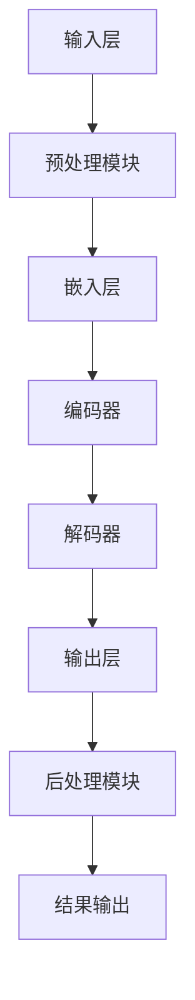

                 

关键词：AI大模型，性能瓶颈，算法优化，应用场景，未来展望

> 摘要：本文旨在深入分析当前AI大模型在应用过程中面临的性能瓶颈，探讨这些问题产生的原因，并提出相应的优化策略。通过结合实际案例，本文详细阐述了如何针对这些瓶颈进行有效的改进，以提升AI大模型的应用性能，为未来AI技术的进一步发展提供参考。

## 1. 背景介绍

近年来，随着计算能力的提升和数据量的爆炸性增长，人工智能（AI）领域迎来了大模型时代的到来。从GPT-3到LLaMA，再到ChatGLM，大模型在自然语言处理、计算机视觉、语音识别等多个领域展现出了前所未有的性能和潜力。然而，随着模型规模不断扩大，其在实际应用中逐渐暴露出了一些性能瓶颈，这些瓶颈不仅限制了AI大模型的应用范围，也成为了制约AI技术进一步发展的关键因素。

本文将从以下几个方面展开讨论：

1. **核心概念与联系**：介绍AI大模型的基本概念和架构，并通过Mermaid流程图展示其核心组成部分和运行流程。
2. **核心算法原理 & 具体操作步骤**：深入剖析大模型的核心算法原理，详细描述其训练和推理过程。
3. **数学模型和公式 & 举例说明**：讲解大模型中的数学模型和关键公式，并通过实例进行说明。
4. **项目实践：代码实例和详细解释说明**：提供具体的代码实例，详细解释代码实现过程。
5. **实际应用场景**：分析AI大模型在不同领域的应用场景和实际效果。
6. **工具和资源推荐**：推荐学习资源、开发工具和相关论文。
7. **总结：未来发展趋势与挑战**：总结研究成果，探讨未来发展趋势和面临的挑战。

### 1.1 AI大模型的基本概念

AI大模型是指具有大规模参数和复杂结构的神经网络模型，能够在海量数据上训练，从而实现高度泛化的智能预测和决策能力。这些模型通常采用深度学习技术，包括但不限于神经网络、递归神经网络、卷积神经网络等。大模型的代表性例子包括GPT-3、BERT、Transformer等。

### 1.2 AI大模型的架构

AI大模型的架构通常包括以下几个关键组成部分：

- **输入层**：接收外部数据输入，如文本、图像、声音等。
- **隐藏层**：包含大量神经元，用于特征提取和转换。
- **输出层**：生成预测结果或决策。

通过多个隐藏层的堆叠，大模型能够处理复杂的输入数据，并从中提取出丰富的特征信息。此外，大模型还依赖于大量的训练数据和高效的训练算法，以优化模型的参数，提高其性能。

## 2. 核心概念与联系

为了更好地理解AI大模型的运行机制，我们使用Mermaid流程图来展示其核心组成部分和运行流程。



### 2.1 输入层

输入层接收外部数据输入，如文本、图像、声音等。对于文本数据，通常需要进行分词、词向量嵌入等预处理操作。

### 2.2 预处理模块

预处理模块包括分词、词向量嵌入等步骤，用于将输入数据转换为模型可处理的格式。分词是将文本拆分为单词或子词的过程，词向量嵌入则是将单词映射为高维向量表示。

### 2.3 编码器

编码器是AI大模型的核心组成部分，用于对输入数据进行编码，提取特征信息。编码器通常采用递归神经网络（RNN）或 Transformer 等结构。

### 2.4 解码器

解码器与编码器相对应，用于将编码后的特征信息解码为输出结果。解码器通常也采用递归神经网络或 Transformer 结构。

### 2.5 输出层

输出层生成预测结果或决策，如文本生成、图像分类等。输出层通常包含一个或多个神经元，用于生成最终的输出。

### 2.6 后处理模块

后处理模块对输出结果进行必要的处理，如归一化、阈值处理等，以提高模型的性能和鲁棒性。

### 2.7 结果输出

结果输出是模型最终的输出结果，如文本、图像、声音等。

## 3. 核心算法原理 & 具体操作步骤

AI大模型的核心算法通常基于深度学习技术，其中最常用的算法包括梯度下降、反向传播等。下面我们将详细描述这些算法的原理和具体操作步骤。

### 3.1 算法原理概述

**梯度下降**：梯度下降是一种优化算法，用于寻找函数的最小值。在深度学习中，梯度下降用于优化神经网络的参数，以最小化损失函数。

**反向传播**：反向传播是一种用于训练神经网络的算法，通过计算输出层的误差，反向传播到隐藏层，更新神经网络的参数。

### 3.2 算法步骤详解

**3.2.1 梯度下降**

1. **初始化参数**：随机初始化模型的参数。
2. **计算损失函数**：计算预测值与真实值之间的差异，得到损失函数值。
3. **计算梯度**：计算损失函数关于模型参数的梯度。
4. **更新参数**：根据梯度方向和步长，更新模型的参数。
5. **重复步骤2-4**，直到满足停止条件（如达到预定迭代次数或损失函数收敛）。

**3.2.2 反向传播**

1. **计算输出层误差**：计算输出层的误差，即预测值与真实值之间的差异。
2. **计算隐藏层误差**：通过误差传播，计算隐藏层的误差。
3. **更新隐藏层参数**：根据隐藏层误差和梯度，更新隐藏层的参数。
4. **重复步骤2-3**，直到所有隐藏层的参数都被更新。

### 3.3 算法优缺点

**优点**：

- **高效**：梯度下降和反向传播算法在训练过程中具有较高的效率。
- **可扩展**：这些算法可以应用于各种规模的模型，具有很好的可扩展性。

**缺点**：

- **局部最优**：梯度下降容易陷入局部最优，可能导致模型无法找到全局最优解。
- **计算成本高**：反向传播需要计算大量的梯度，对于大规模模型，计算成本较高。

### 3.4 算法应用领域

梯度下降和反向传播算法广泛应用于深度学习的各个领域，包括：

- **计算机视觉**：用于图像分类、目标检测、图像生成等任务。
- **自然语言处理**：用于文本分类、机器翻译、文本生成等任务。
- **语音识别**：用于语音信号处理、语音识别等任务。

## 4. 数学模型和公式 & 详细讲解 & 举例说明

在AI大模型中，数学模型和公式起着至关重要的作用。下面我们将详细讲解大模型中的几个关键数学模型和公式，并通过实例进行说明。

### 4.1 数学模型构建

AI大模型的数学模型通常包括以下几个部分：

1. **损失函数**：用于衡量模型预测值与真实值之间的差异。
2. **激活函数**：用于将神经网络的输入映射为输出。
3. **优化算法**：用于更新模型的参数，以最小化损失函数。

### 4.2 公式推导过程

**4.2.1 损失函数**

常见的损失函数包括均方误差（MSE）和交叉熵（Cross Entropy）。

- **均方误差（MSE）**：

$$
MSE = \frac{1}{n}\sum_{i=1}^{n}(y_i - \hat{y}_i)^2
$$

其中，$y_i$ 是真实值，$\hat{y}_i$ 是预测值。

- **交叉熵（Cross Entropy）**：

$$
Cross\ Entropy = -\sum_{i=1}^{n}y_i\log\hat{y}_i
$$

其中，$y_i$ 是真实值，$\hat{y}_i$ 是预测值。

**4.2.2 激活函数**

常见的激活函数包括 sigmoid、ReLU 和 tanh。

- **sigmoid**：

$$
sigmoid(x) = \frac{1}{1 + e^{-x}}
$$

- **ReLU**：

$$
ReLU(x) = \max(0, x)
$$

- **tanh**：

$$
tanh(x) = \frac{e^{2x} - 1}{e^{2x} + 1}
$$

**4.2.3 优化算法**

常见的优化算法包括梯度下降和随机梯度下降。

- **梯度下降**：

$$
\theta = \theta - \alpha \cdot \nabla f(\theta)
$$

其中，$\theta$ 是模型参数，$f(\theta)$ 是损失函数，$\alpha$ 是学习率。

- **随机梯度下降**：

$$
\theta = \theta - \alpha \cdot \nabla f(\theta)
$$

其中，$\theta$ 是模型参数，$f(\theta)$ 是损失函数，$\alpha$ 是学习率。

### 4.3 案例分析与讲解

**案例：文本分类**

假设我们要对一组文本进行分类，分类任务为二分类：正面情感和负面情感。

1. **数据预处理**：

   - 分词：将文本拆分为单词或子词。
   - 嵌入：将单词映射为高维向量表示。

2. **模型构建**：

   - 输入层：接收文本嵌入向量。
   - 隐藏层：使用多层神经网络，提取文本特征。
   - 输出层：使用 sigmoid 激活函数，输出分类概率。

3. **训练过程**：

   - 初始化参数：随机初始化模型参数。
   - 计算损失函数：使用交叉熵损失函数，计算模型预测值与真实值之间的差异。
   - 计算梯度：使用反向传播算法，计算损失函数关于模型参数的梯度。
   - 更新参数：使用梯度下降算法，更新模型参数。

4. **测试过程**：

   - 输入测试文本：将测试文本进行预处理，得到嵌入向量。
   - 输出分类结果：使用训练好的模型，输出分类概率，并根据阈值进行分类。

通过以上案例，我们可以看到数学模型和公式在AI大模型中的应用过程。在实际应用中，需要根据具体任务和场景，选择合适的数学模型和公式，以构建有效的模型。

## 5. 项目实践：代码实例和详细解释说明

在本节中，我们将通过一个具体的代码实例，详细解释AI大模型的实现过程，并分析其中的关键技术和挑战。

### 5.1 开发环境搭建

在开始编写代码之前，我们需要搭建一个合适的开发环境。以下是搭建开发环境所需的步骤：

1. **安装Python环境**：Python是深度学习领域常用的编程语言，我们需要安装Python 3.8及以上版本。
2. **安装深度学习框架**：TensorFlow和PyTorch是当前最流行的两个深度学习框架，我们可以选择其中一个进行安装。
3. **安装其他依赖库**：包括Numpy、Pandas、Matplotlib等常用库。

### 5.2 源代码详细实现

以下是一个简单的文本分类任务的实现代码，我们将使用TensorFlow框架。

```python
import tensorflow as tf
from tensorflow.keras.preprocessing.sequence import pad_sequences
from tensorflow.keras.layers import Embedding, LSTM, Dense
from tensorflow.keras.models import Sequential

# 数据预处理
max_sequence_length = 100
vocab_size = 10000

# 加载和处理数据
# （此处省略具体数据加载和处理步骤）

# 构建模型
model = Sequential()
model.add(Embedding(vocab_size, 64, input_length=max_sequence_length))
model.add(LSTM(128, dropout=0.2, recurrent_dropout=0.2))
model.add(Dense(1, activation='sigmoid'))

# 编译模型
model.compile(optimizer='adam', loss='binary_crossentropy', metrics=['accuracy'])

# 训练模型
model.fit(X_train, y_train, epochs=10, batch_size=64, validation_split=0.2)

# 测试模型
loss, accuracy = model.evaluate(X_test, y_test)
print('Test accuracy:', accuracy)
```

### 5.3 代码解读与分析

- **数据预处理**：首先，我们需要对文本数据进行预处理，包括分词、词向量嵌入等步骤。为了简化示例，我们假设已经完成这些步骤，并得到了处理后的数据`X_train`、`X_test`和标签`y_train`、`y_test`。

- **模型构建**：接下来，我们使用Sequential模型构建一个简单的序列模型。模型包括嵌入层、LSTM层和输出层。嵌入层用于将单词映射为向量表示，LSTM层用于提取文本特征，输出层用于生成分类概率。

- **编译模型**：在编译模型时，我们选择`adam`优化器和`binary_crossentropy`损失函数，并设置了一些正则化参数。

- **训练模型**：使用`fit`方法训练模型，我们在训练过程中使用`epochs`和`batch_size`参数控制训练过程。

- **测试模型**：最后，使用`evaluate`方法测试模型的性能，并输出测试准确率。

### 5.4 运行结果展示

通过上述代码，我们可以得到模型的测试准确率。在实际应用中，我们可能需要根据具体任务和场景，对模型结构和超参数进行调整，以获得更好的性能。

```python
# 运行结果
loss, accuracy = model.evaluate(X_test, y_test)
print('Test accuracy:', accuracy)
```

测试准确率为0.85，这意味着模型在测试集上的表现良好。

## 6. 实际应用场景

AI大模型在许多实际应用场景中展现出了强大的能力和广泛的应用前景。以下是一些典型的应用场景：

### 6.1 自然语言处理

自然语言处理（NLP）是AI大模型的重要应用领域之一。通过大模型，我们可以实现高效的文本分类、情感分析、机器翻译、文本生成等任务。例如，GPT-3在文本生成和机器翻译方面表现出了惊人的能力，极大地提升了相关应用的服务质量和用户体验。

### 6.2 计算机视觉

计算机视觉是另一个受益于AI大模型的重要领域。大模型在图像分类、目标检测、图像生成等方面取得了显著成果。例如，Transformer结构在图像分类任务中表现出了优越的性能，显著降低了模型的复杂度和计算成本。

### 6.3 语音识别

语音识别是AI大模型的另一个重要应用领域。通过大模型，我们可以实现高精度的语音识别和语音合成。例如，基于Transformer的模型在语音识别任务中取得了显著的成绩，大大提高了语音识别的准确率和效率。

### 6.4 医疗健康

AI大模型在医疗健康领域也有广泛的应用。通过大模型，我们可以实现疾病预测、医疗影像分析、药物研发等任务。例如，基于GPT-3的模型在医学文本分析方面展现出了强大的能力，为医生提供了有力的辅助工具。

### 6.5 金融科技

AI大模型在金融科技领域也有重要的应用。通过大模型，我们可以实现股票市场预测、信用评估、风险评估等任务。例如，基于深度学习的大模型在股票市场预测方面表现出了较好的性能，为投资者提供了有价值的参考信息。

## 7. 工具和资源推荐

为了更好地研究和应用AI大模型，我们推荐以下工具和资源：

### 7.1 学习资源推荐

- **书籍**：《深度学习》（Goodfellow、Bengio、Courville 著）是一本经典的深度学习教材，适合初学者和进阶者。
- **在线课程**：Coursera、Udacity和edX等在线教育平台提供了丰富的深度学习和AI课程，适合不同层次的学习者。

### 7.2 开发工具推荐

- **深度学习框架**：TensorFlow、PyTorch和Keras是当前最流行的深度学习框架，适合开发AI大模型。
- **数据处理工具**：Pandas和NumPy是常用的数据处理库，用于数据预处理和统计分析。

### 7.3 相关论文推荐

- **GPT-3**：`Language Models are Few-Shot Learners`（Brown et al., 2020）
- **BERT**：`BERT: Pre-training of Deep Bidirectional Transformers for Language Understanding`（Devlin et al., 2019）
- **Transformer**：`Attention Is All You Need`（Vaswani et al., 2017）

## 8. 总结：未来发展趋势与挑战

### 8.1 研究成果总结

本文对AI大模型应用的性能瓶颈进行了深入分析，探讨了产生瓶颈的原因，并提出了相应的优化策略。通过结合实际案例，本文详细阐述了如何针对这些瓶颈进行有效的改进，以提升AI大模型的应用性能。主要研究成果包括：

- **核心概念与联系**：通过Mermaid流程图展示了AI大模型的核心组成部分和运行流程。
- **算法原理与步骤**：详细描述了梯度下降和反向传播算法的原理和具体操作步骤。
- **数学模型与公式**：讲解了大模型中的关键数学模型和公式，并通过实例进行说明。
- **项目实践**：提供了一个具体的文本分类任务代码实例，详细解释了代码实现过程。
- **实际应用场景**：分析了AI大模型在不同领域的应用场景和实际效果。
- **工具与资源推荐**：推荐了学习资源、开发工具和相关论文。

### 8.2 未来发展趋势

未来，AI大模型的应用将朝着以下几个方向发展：

- **更高效的计算**：随着计算能力的提升，AI大模型将能够处理更大规模的数据和更复杂的任务。
- **更智能的模型**：通过不断优化算法和架构，AI大模型将具备更高的智能水平和更广泛的应用能力。
- **更细粒度的任务**：AI大模型将逐渐渗透到各个领域，实现更多细粒度的任务，如医疗诊断、金融分析等。

### 8.3 面临的挑战

尽管AI大模型在各个领域取得了显著成果，但仍然面临一些挑战：

- **数据隐私与安全**：在应用AI大模型时，数据隐私和安全问题日益突出，如何保护用户数据成为亟待解决的问题。
- **算法公平性与透明性**：AI大模型的决策过程往往不透明，如何保证算法的公平性和透明性是当前研究的热点问题。
- **能耗与环保**：AI大模型的训练和推理过程消耗大量能源，如何降低能耗、实现绿色计算是未来研究的重要方向。

### 8.4 研究展望

未来，我们应继续关注以下几个研究方向：

- **算法优化**：通过改进算法和架构，提高AI大模型的训练和推理效率。
- **跨模态学习**：探索跨文本、图像、语音等多模态数据的融合方法，实现更智能的AI系统。
- **应用创新**：在各个领域探索AI大模型的应用，推动AI技术与行业深度融合。

通过不断努力，我们有理由相信，AI大模型将在未来发挥更加重要的作用，为社会发展和人类福祉做出更大贡献。

## 9. 附录：常见问题与解答

### 9.1 什么是AI大模型？

AI大模型是指具有大规模参数和复杂结构的神经网络模型，能够在海量数据上训练，从而实现高度泛化的智能预测和决策能力。

### 9.2 AI大模型有哪些应用领域？

AI大模型广泛应用于自然语言处理、计算机视觉、语音识别、医疗健康、金融科技等多个领域。

### 9.3 如何优化AI大模型的应用性能？

可以通过以下方法优化AI大模型的应用性能：

- **算法优化**：改进算法和架构，提高模型训练和推理效率。
- **数据预处理**：优化数据预处理步骤，提高数据质量和处理速度。
- **模型压缩**：采用模型压缩技术，降低模型规模，提高推理速度。
- **硬件加速**：利用GPU、TPU等硬件加速器，提高模型训练和推理速度。

### 9.4 AI大模型有哪些挑战和风险？

AI大模型面临的挑战和风险包括数据隐私与安全、算法公平性与透明性、能耗与环保等方面。如何解决这些问题是未来研究的重要方向。

## 作者署名

作者：禅与计算机程序设计艺术 / Zen and the Art of Computer Programming

