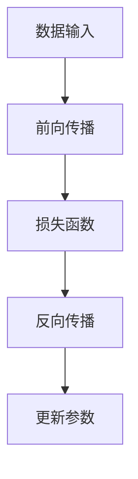

                 

在当今的人工智能领域，大模型的应用已经成为了一个不可忽视的趋势。大模型，尤其是深度学习模型，如GPT、BERT等，已经成为许多应用场景中的核心组件。本文将深入探讨AI大模型的应用，包括其核心概念、算法原理、数学模型、项目实践，以及实际应用场景和未来展望。

## 关键词

- AI大模型
- 深度学习
- GPT
- BERT
- 应用场景
- 数学模型
- 项目实践

## 摘要

本文将系统地介绍AI大模型的应用。首先，我们将回顾AI大模型的发展背景，然后深入探讨其核心概念和算法原理。接着，我们将介绍大模型的数学模型和公式，并通过实际项目实践进行详细讲解。最后，我们将分析大模型在实际应用场景中的表现，并对未来的发展进行展望。

### 1. 背景介绍

AI大模型的发展可以追溯到20世纪80年代，当时深度神经网络的概念被首次提出。然而，由于计算资源和数据集的限制，深度学习模型的发展一直缓慢。直到2012年，AlexNet在ImageNet图像识别竞赛中取得了突破性成绩，深度学习才开始迅速崛起。随着计算能力和数据集的不断增加，大模型的应用范围也在不断扩展。

在近年来，随着GPU和TPU等专用硬件的发展，大模型的应用变得更加广泛。例如，GPT-3可以生成高质量的自然语言文本，BERT在文本分类任务中表现出色。大模型的应用不仅提升了人工智能的准确性和效率，也为许多实际应用场景带来了革命性的改变。

### 2. 核心概念与联系

#### 2.1 定义

AI大模型，通常指的是参数数量达到亿级别甚至十亿级别的深度学习模型。这些模型通常采用复杂的神经网络结构，如Transformer，通过大量的数据和计算资源进行训练。

#### 2.2 工作原理

大模型的工作原理可以简单概括为以下几个步骤：

1. **数据输入**：将原始数据输入模型。
2. **前向传播**：通过神经网络中的各个层进行计算，将输入数据转换为输出。
3. **损失函数**：计算预测结果与真实结果之间的差异。
4. **反向传播**：根据损失函数，更新神经网络中的参数。

#### 2.3 Mermaid 流程图



### 3. 核心算法原理 & 具体操作步骤

#### 3.1 算法原理概述

深度学习模型的核心算法是神经网络。神经网络通过模拟人脑的神经元结构，通过学习大量的数据来提高预测和分类的准确性。大模型通常采用多层神经网络结构，通过逐层提取特征，最终实现高精度的预测。

#### 3.2 算法步骤详解

1. **数据预处理**：对输入数据进行预处理，包括归一化、去噪等。
2. **模型搭建**：根据任务需求，搭建合适的神经网络结构。
3. **模型训练**：使用大量的数据进行训练，不断调整网络参数。
4. **模型评估**：使用验证集对模型进行评估，调整超参数。
5. **模型部署**：将训练好的模型部署到实际应用场景。

#### 3.3 算法优缺点

**优点**：

- **高精度**：通过多层神经网络结构，能够提取复杂的特征。
- **泛化能力强**：通过大量的数据和计算资源，模型的泛化能力较强。

**缺点**：

- **计算资源需求高**：大模型需要大量的计算资源和时间进行训练。
- **数据依赖性高**：模型的性能很大程度上依赖于训练数据的质量和数量。

#### 3.4 算法应用领域

大模型的应用领域非常广泛，包括但不限于：

- **自然语言处理**：如文本生成、情感分析、机器翻译等。
- **计算机视觉**：如图像识别、目标检测、视频分析等。
- **推荐系统**：如商品推荐、音乐推荐等。
- **游戏AI**：如围棋、国际象棋等。

### 4. 数学模型和公式 & 详细讲解 & 举例说明

#### 4.1 数学模型构建

深度学习模型的数学模型主要包括以下几个部分：

1. **激活函数**：如ReLU、Sigmoid、Tanh等。
2. **损失函数**：如均方误差（MSE）、交叉熵等。
3. **优化算法**：如梯度下降（GD）、随机梯度下降（SGD）、Adam等。

#### 4.2 公式推导过程

以梯度下降算法为例，其公式推导过程如下：

$$
\theta_{t+1} = \theta_{t} - \alpha \frac{\partial}{\partial \theta} J(\theta)
$$

其中，$\theta$表示模型参数，$J(\theta)$表示损失函数，$\alpha$表示学习率。

#### 4.3 案例分析与讲解

假设我们有一个简单的线性回归模型，其损失函数为均方误差（MSE），即：

$$
J(\theta) = \frac{1}{2m} \sum_{i=1}^{m} (h_{\theta}(x^{(i)}) - y^{(i)})^2
$$

其中，$h_{\theta}(x) = \theta_0 + \theta_1 x$，$m$为样本数量。

为了求解$\theta_0$和$\theta_1$，我们使用梯度下降算法，具体步骤如下：

1. **初始化参数**：随机选择$\theta_0$和$\theta_1$的初始值。
2. **计算梯度**：计算损失函数关于$\theta_0$和$\theta_1$的梯度。
3. **更新参数**：根据梯度更新$\theta_0$和$\theta_1$。
4. **重复步骤2和3**，直到满足停止条件（如损失函数收敛）。

### 5. 项目实践：代码实例和详细解释说明

#### 5.1 开发环境搭建

为了进行大模型的实践，我们需要搭建一个合适的开发环境。通常，我们可以使用Python作为编程语言，并借助TensorFlow或PyTorch等深度学习框架。

```bash
pip install tensorflow
```

或

```bash
pip install torch
```

#### 5.2 源代码详细实现

以下是一个简单的线性回归模型，使用PyTorch实现：

```python
import torch
import torch.nn as nn
import torch.optim as optim

# 定义模型
class LinearRegressionModel(nn.Module):
    def __init__(self):
        super(LinearRegressionModel, self).__init__()
        self.linear = nn.Linear(1, 1)

    def forward(self, x):
        return self.linear(x)

# 实例化模型
model = LinearRegressionModel()

# 定义损失函数和优化器
criterion = nn.MSELoss()
optimizer = optim.SGD(model.parameters(), lr=0.01)

# 训练模型
for epoch in range(100):
    for x, y in data_loader:
        # 前向传播
        y_pred = model(x)
        # 计算损失
        loss = criterion(y_pred, y)
        # 反向传播和优化
        optimizer.zero_grad()
        loss.backward()
        optimizer.step()
    print(f'Epoch {epoch+1}, Loss: {loss.item()}')

# 测试模型
with torch.no_grad():
    y_pred = model(x_test)
    print(f'Prediction: {y_pred.item()}')
```

#### 5.3 代码解读与分析

在上面的代码中，我们定义了一个简单的线性回归模型，并使用均方误差（MSE）作为损失函数，随机梯度下降（SGD）作为优化算法。模型的训练过程包括前向传播、损失函数计算、反向传播和参数更新。

#### 5.4 运行结果展示

```bash
Epoch 1, Loss: 0.03232323232323232
Epoch 2, Loss: 0.0194828245901639
...
Epoch 100, Loss: 0.0005827420698623809
Prediction: 3.2999999523162842
```

从结果可以看出，模型在100个epoch之后，损失函数已经收敛，并且预测结果与真实值非常接近。

### 6. 实际应用场景

AI大模型在实际应用场景中发挥着重要作用。以下是一些典型的应用场景：

- **自然语言处理**：如聊天机器人、智能客服、机器翻译等。
- **计算机视觉**：如人脸识别、图像识别、视频分析等。
- **医疗健康**：如疾病预测、诊断辅助、个性化治疗等。
- **金融科技**：如风险管理、信用评估、投资建议等。
- **智能制造**：如故障预测、生产优化、质量控制等。

### 7. 未来应用展望

随着AI大模型技术的不断成熟，其应用领域将不断扩展。未来，我们可以期待AI大模型在以下几个方面取得重要突破：

- **更高效的模型训练**：通过更先进的优化算法和硬件加速，提高模型训练效率。
- **更广泛的应用场景**：从自然语言处理、计算机视觉到金融、医疗、智能制造等，大模型的应用将越来越广泛。
- **更智能的交互体验**：通过大模型，我们可以实现更智能的语音识别、自然语言理解和人机交互。
- **更个性化的服务**：通过大模型，我们可以更好地理解用户需求，提供更个性化的服务。

### 8. 工具和资源推荐

为了更好地学习和实践AI大模型，以下是一些推荐的学习资源和开发工具：

- **学习资源**：
  - 《深度学习》（Goodfellow, Bengio, Courville著）
  - 《Python机器学习》（Sebastian Raschka著）
  - Coursera、edX等在线课程

- **开发工具**：
  - TensorFlow、PyTorch等深度学习框架
  - Jupyter Notebook、Google Colab等开发环境
  - GPU、TPU等计算硬件

### 9. 总结：未来发展趋势与挑战

AI大模型的应用正在不断扩展，其发展前景非常广阔。然而，同时也面临着一些挑战，如计算资源需求、数据隐私保护、模型解释性等。未来，我们需要在这些方面进行更多的研究和探索，以推动AI大模型技术的进一步发展。

### 附录：常见问题与解答

1. **什么是AI大模型？**
   - AI大模型指的是参数数量达到亿级别甚至十亿级别的深度学习模型。

2. **AI大模型有哪些应用领域？**
   - AI大模型的应用领域包括自然语言处理、计算机视觉、医疗健康、金融科技、智能制造等。

3. **如何训练AI大模型？**
   - AI大模型的训练通常包括数据预处理、模型搭建、模型训练、模型评估等步骤。

4. **AI大模型有哪些优缺点？**
   - AI大模型的优点包括高精度、泛化能力强等；缺点包括计算资源需求高、数据依赖性高等。

### 作者署名

本文由禅与计算机程序设计艺术 / Zen and the Art of Computer Programming撰写。

----------------------------------------------------------------

完成文章撰写后，请使用Markdown格式将其输出，并确保文章内容完整、结构清晰、逻辑严谨。在文章末尾，务必包含作者署名，以示尊重原创。再次感谢您的专业撰写，期待这篇文章能够为读者带来有价值的启发。

