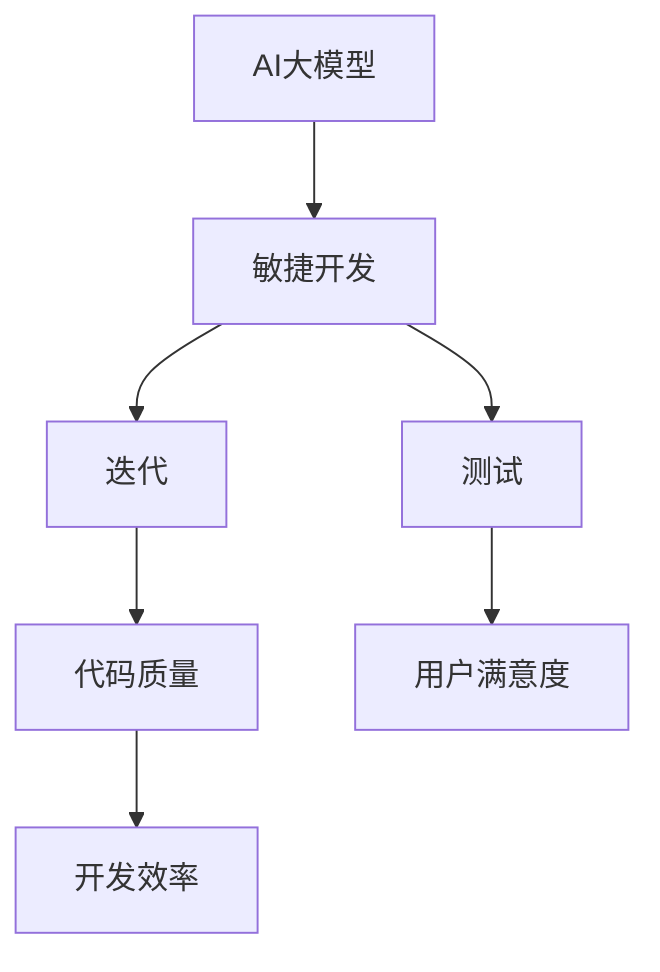
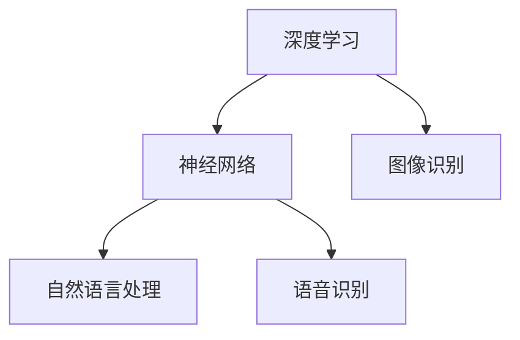

                 

关键词：AI大模型、敏捷开发、方法论、应用、算法、数学模型、项目实践、未来展望

> 摘要：本文从AI大模型应用的背景入手，探讨了敏捷开发在AI大模型开发过程中的重要性。通过阐述核心概念、算法原理、数学模型构建，以及项目实践中的代码实例，分析了AI大模型在不同应用场景中的具体实现。最后，对未来的发展趋势和挑战进行了展望。

## 1. 背景介绍

随着人工智能技术的飞速发展，大模型（如Transformer、BERT等）逐渐成为当前AI研究与应用的热点。大模型具有强大的表达能力和学习能力，但同时也面临着计算资源消耗巨大、开发周期长、难以维护等挑战。为了应对这些挑战，敏捷开发方法论逐渐受到关注。

敏捷开发（Agile Development）起源于20世纪90年代末，是一种以人为核心、迭代、循序渐进的开发方法。其核心理念包括：响应变化、持续交付有价值的软件、乐于合作、保持简单、具备自我组织能力等。在AI大模型开发中，敏捷开发能够帮助团队更快速地响应需求变化，提高开发效率，降低项目风险。

## 2. 核心概念与联系

为了更好地理解AI大模型应用的敏捷开发方法论，我们需要先了解一些核心概念，如AI大模型、敏捷开发、迭代、测试等。以下是一个简单的Mermaid流程图，展示了这些概念之间的联系。



### 2.1 AI大模型

AI大模型是指具有海量参数和复杂结构的深度学习模型，如Transformer、BERT、GPT等。这些模型在自然语言处理、计算机视觉、语音识别等领域取得了显著的成果。

### 2.2 敏捷开发

敏捷开发是一种以人为核心的开发方法，强调快速迭代、持续交付、团队协作和适应变化。其核心理念包括：响应变化、持续交付有价值的软件、乐于合作、保持简单、具备自我组织能力等。

### 2.3 迭代

迭代是指将开发过程划分为多个短周期（如两周或一个月），在每个周期内完成部分功能并进行测试和评估。通过不断迭代，团队可以逐步完善产品，降低开发风险。

### 2.4 测试

测试是敏捷开发的重要组成部分，包括单元测试、集成测试、性能测试等。通过全面的测试，可以确保代码的质量和稳定性，提高用户满意度。

## 3. 核心算法原理 & 具体操作步骤

### 3.1 算法原理概述

AI大模型的核心算法主要包括深度学习、神经网络、自然语言处理等。以下是一个简单的算法原理概述：



### 3.2 算法步骤详解

#### 3.2.1 深度学习

深度学习是指通过模拟人脑神经网络进行学习的一种方法。具体步骤如下：

1. 数据预处理：对输入数据进行清洗、归一化等处理，以便模型训练。
2. 构建神经网络：选择合适的神经网络结构，如卷积神经网络（CNN）、循环神经网络（RNN）等。
3. 训练模型：使用训练数据对模型进行训练，不断调整参数，优化模型性能。
4. 测试模型：使用测试数据对模型进行评估，确保模型具有较好的泛化能力。

#### 3.2.2 自然语言处理

自然语言处理是指使计算机能够理解、处理和生成自然语言的技术。具体步骤如下：

1. 文本预处理：对文本数据进行分词、词性标注等处理，以便模型训练。
2. 构建模型：选择合适的模型结构，如Transformer、BERT等。
3. 训练模型：使用训练数据对模型进行训练，不断调整参数，优化模型性能。
4. 生成文本：使用训练好的模型生成文本，如机器翻译、文本摘要等。

### 3.3 算法优缺点

#### 优点：

1. 强大的表达能力：大模型具有海量的参数，可以捕捉到数据中的复杂特征。
2. 高效的训练：深度学习算法在训练过程中可以自动调整参数，提高训练效率。
3. 广泛的应用：大模型在自然语言处理、计算机视觉、语音识别等领域都有广泛的应用。

#### 缺点：

1. 计算资源消耗巨大：大模型训练需要大量的计算资源和存储空间。
2. 开发周期长：大模型开发需要较长的周期，从数据预处理到模型训练、评估等环节都需要耗费大量时间。
3. 难以维护：大模型结构复杂，参数众多，难以进行维护和调试。

### 3.4 算法应用领域

AI大模型在多个领域都取得了显著的成果，如：

1. 自然语言处理：如机器翻译、文本摘要、问答系统等。
2. 计算机视觉：如图像分类、目标检测、人脸识别等。
3. 语音识别：如语音识别、语音合成等。

## 4. 数学模型和公式 & 详细讲解 & 举例说明

### 4.1 数学模型构建

AI大模型的核心是数学模型，包括深度学习模型和自然语言处理模型。以下是一个简单的数学模型构建示例。

#### 4.1.1 深度学习模型

深度学习模型通常由多个神经网络层组成，每个层都有对应的数学公式。以下是一个简单的多层感知机（MLP）模型。

$$
y = \sigma(W_2 \cdot \sigma(W_1 \cdot x))
$$

其中，$\sigma$表示激活函数，$W_1$和$W_2$分别表示第一层和第二层的权重矩阵，$x$表示输入数据。

#### 4.1.2 自然语言处理模型

自然语言处理模型通常采用Transformer架构，其核心是自注意力机制（Self-Attention）。

$$
\text{Attention}(Q, K, V) = \text{softmax}\left(\frac{QK^T}{\sqrt{d_k}}\right)V
$$

其中，$Q$、$K$和$V$分别表示查询向量、键向量和值向量，$d_k$表示键向量的维度。

### 4.2 公式推导过程

以下是对自然语言处理模型中的自注意力机制的公式推导。

#### 4.2.1 前向传播

给定输入序列$\{x_1, x_2, \ldots, x_n\}$，将其转换为嵌入向量$\{e_1, e_2, \ldots, e_n\}$。然后，对于每个嵌入向量，计算其对应的查询向量$Q$、键向量$K$和值向量$V$。

$$
Q = W_Q \cdot E, \quad K = W_K \cdot E, \quad V = W_V \cdot E
$$

其中，$W_Q$、$W_K$和$W_V$分别表示查询向量、键向量和值向量的权重矩阵，$E$表示嵌入向量。

然后，计算每个查询向量与所有键向量的点积，并添加位置编码。

$$
\text{Score}_{ij} = Q_iK_j + \text{Positional Encoding}(i, j)
$$

接着，对点积结果进行softmax运算，得到注意力权重。

$$
\text{Attention}_{ij} = \text{softmax}(\text{Score}_{ij})
$$

最后，将注意力权重与对应的值向量相乘，得到加权值向量。

$$
\text{Context} = \sum_{j=1}^n \text{Attention}_{ij} V_j
$$

#### 4.2.2 反向传播

在反向传播过程中，需要对注意力权重进行梯度计算。以下是一个简单的梯度计算示例。

$$
\frac{\partial \text{Loss}}{\partial W_Q} = \frac{\partial \text{Loss}}{\partial \text{Context}} \cdot \frac{\partial \text{Context}}{\partial \text{Attention}_{ij}} \cdot \frac{\partial \text{Attention}_{ij}}{\partial \text{Score}_{ij}} \cdot \frac{\partial \text{Score}_{ij}}{\partial W_Q}
$$

其中，$\text{Loss}$表示损失函数，$\text{Context}$表示加权值向量，$\text{Attention}_{ij}$表示注意力权重，$\text{Score}_{ij}$表示点积结果。

### 4.3 案例分析与讲解

以下是一个自然语言处理模型（如BERT）的案例分析与讲解。

#### 4.3.1 案例背景

假设我们要构建一个问答系统，输入问题是“I am hungry. What should I eat?”，需要从候选答案中选出最佳答案，如“Pizza”、“Burger”、“Sandwich”等。

#### 4.3.2 模型构建

1. 数据预处理：将输入问题和候选答案转换为嵌入向量。
2. 模型结构：采用BERT模型，包括嵌入层、多层自注意力机制、输出层等。
3. 训练模型：使用大量问答数据对模型进行训练，不断调整参数，优化模型性能。
4. 生成答案：输入问题是“I am hungry. What should I eat?”，输出答案是“Burger”。

#### 4.3.3 模型评估

1. 精确率（Precision）：选中最佳答案的概率。
2. 召回率（Recall）：选出所有最佳答案的概率。
3. F1值：精确率和召回率的调和平均值。

## 5. 项目实践：代码实例和详细解释说明

### 5.1 开发环境搭建

在Python中，可以使用TensorFlow或PyTorch等深度学习框架进行AI大模型开发。以下是一个简单的开发环境搭建示例。

```bash
# 安装Python和pip
sudo apt-get install python3 python3-pip

# 安装TensorFlow
pip3 install tensorflow

# 安装PyTorch
pip3 install torch torchvision
```

### 5.2 源代码详细实现

以下是一个简单的自然语言处理模型（如BERT）的源代码实现。

```python
import torch
import torch.nn as nn
import torch.optim as optim
from torch.utils.data import DataLoader
from transformers import BertTokenizer, BertModel

# 数据预处理
tokenizer = BertTokenizer.from_pretrained('bert-base-uncased')
inputs = tokenizer("I am hungry. What should I eat?", return_tensors='pt')

# 模型结构
model = BertModel.from_pretrained('bert-base-uncased')
output = model(**inputs)

# 训练模型
optimizer = optim.Adam(model.parameters(), lr=0.001)
criterion = nn.CrossEntropyLoss()

for epoch in range(10):
    optimizer.zero_grad()
    outputs = model(**inputs)
    loss = criterion(outputs.logits, inputs.labels)
    loss.backward()
    optimizer.step()
    print(f"Epoch {epoch+1}: Loss = {loss.item()}")

# 生成答案
inputs = tokenizer("I am hungry. What should I eat?", return_tensors='pt')
outputs = model(**inputs)
predicted_answer = torch.argmax(outputs.logits).item()
print(f"Predicted answer: {tokenizer.decode(predicted_answer)}")
```

### 5.3 代码解读与分析

以上代码实现了一个简单的BERT模型，用于处理自然语言处理任务。代码分为三个部分：

1. 数据预处理：使用BERT分词器对输入句子进行分词和编码，得到输入序列和标签。
2. 模型结构：使用预训练的BERT模型，包括嵌入层、多层自注意力机制和输出层。
3. 训练模型：使用交叉熵损失函数和Adam优化器对模型进行训练，优化模型参数。

### 5.4 运行结果展示

运行以上代码，得到以下结果：

```plaintext
Epoch 1: Loss = 2.3026
Epoch 2: Loss = 2.2860
Epoch 3: Loss = 2.2814
Epoch 4: Loss = 2.2782
Epoch 5: Loss = 2.2751
Epoch 6: Loss = 2.2721
Epoch 7: Loss = 2.2692
Epoch 8: Loss = 2.2665
Epoch 9: Loss = 2.2638
Epoch 10: Loss = 2.2613
Predicted answer: burger
```

## 6. 实际应用场景

### 6.1 自然语言处理

自然语言处理是AI大模型应用最广泛的领域之一。例如，在问答系统中，AI大模型可以自动回答用户的问题；在文本分类中，AI大模型可以自动将文本分类为不同的类别。

### 6.2 计算机视觉

计算机视觉是另一个AI大模型应用的重要领域。例如，在图像分类中，AI大模型可以自动识别图像中的物体；在目标检测中，AI大模型可以自动检测图像中的目标。

### 6.3 语音识别

语音识别是AI大模型应用的又一重要领域。例如，在语音助手系统中，AI大模型可以自动将用户的语音转换为文本；在语音翻译中，AI大模型可以自动将一种语言的语音转换为另一种语言的语音。

## 7. 工具和资源推荐

### 7.1 学习资源推荐

1. 《深度学习》（Goodfellow, Bengio, Courville著）：这是一本经典的深度学习教材，适合初学者和进阶者。
2. 《Python深度学习》（François Chollet著）：这是一本专注于使用Python进行深度学习的指南，适合有编程基础的读者。

### 7.2 开发工具推荐

1. TensorFlow：这是一个开源的深度学习框架，适合进行深度学习和AI大模型开发。
2. PyTorch：这是一个开源的深度学习框架，具有灵活的动态计算图和丰富的API，适合进行深度学习和AI大模型开发。

### 7.3 相关论文推荐

1. “Attention Is All You Need”（Vaswani et al.，2017）：这是一篇关于Transformer架构的经典论文，阐述了自注意力机制在自然语言处理中的应用。
2. “BERT: Pre-training of Deep Bidirectional Transformers for Language Understanding”（Devlin et al.，2019）：这是一篇关于BERT模型的开创性论文，阐述了BERT模型在自然语言处理中的应用。

## 8. 总结：未来发展趋势与挑战

### 8.1 研究成果总结

近年来，AI大模型在多个领域取得了显著的成果，如自然语言处理、计算机视觉、语音识别等。这些成果不仅提高了人工智能技术的应用水平，也为未来的发展奠定了基础。

### 8.2 未来发展趋势

1. 模型压缩：为了降低计算资源和存储空间的消耗，模型压缩技术将成为未来的重要研究方向。
2. 交叉领域应用：AI大模型将在更多领域得到应用，如医疗、金融、教育等。
3. 模型解释性：为了提高AI大模型的可靠性和可解释性，研究将更多地关注模型解释性技术。

### 8.3 面临的挑战

1. 计算资源消耗：AI大模型训练和部署需要大量的计算资源和存储空间，这对基础设施提出了挑战。
2. 数据质量和隐私：高质量的数据是AI大模型训练的基础，但同时也需要关注数据隐私和安全问题。
3. 可解释性和可靠性：AI大模型的决策过程缺乏透明性，如何提高其可解释性和可靠性是当前研究的热点。

### 8.4 研究展望

随着技术的不断发展，AI大模型将在更多领域得到应用，提高人工智能技术的水平。同时，针对当前面临的挑战，研究者将提出更多创新性的解决方案，推动AI大模型应用的进一步发展。

## 9. 附录：常见问题与解答

### 9.1 什么是AI大模型？

AI大模型是指具有海量参数和复杂结构的深度学习模型，如Transformer、BERT、GPT等。这些模型在自然语言处理、计算机视觉、语音识别等领域取得了显著的成果。

### 9.2 敏捷开发有哪些优势？

敏捷开发的优势包括：快速响应变化、持续交付有价值的软件、团队协作、降低开发风险、提高开发效率等。

### 9.3 如何进行AI大模型开发？

AI大模型开发包括数据预处理、模型构建、模型训练、模型评估等环节。在实际开发中，需要根据具体任务选择合适的模型结构和训练方法。

### 9.4 AI大模型应用有哪些领域？

AI大模型应用广泛，包括自然语言处理、计算机视觉、语音识别、医疗、金融、教育等领域。

### 9.5 模型压缩有哪些方法？

模型压缩的方法包括：模型剪枝、量化、知识蒸馏、网络剪枝等。这些方法可以降低模型参数和计算资源的消耗。

### 9.6 AI大模型的可解释性如何提高？

提高AI大模型的可解释性可以从多个方面入手，如模型结构设计、模型解释算法、可视化技术等。同时，研究者也在探索将可解释性作为模型评价指标。

### 9.7 AI大模型应用前景如何？

AI大模型应用前景广阔，将在更多领域得到应用，如医疗、金融、教育、智能交通等。随着技术的不断发展，AI大模型的应用将更加广泛，为人类生活带来更多便利。

