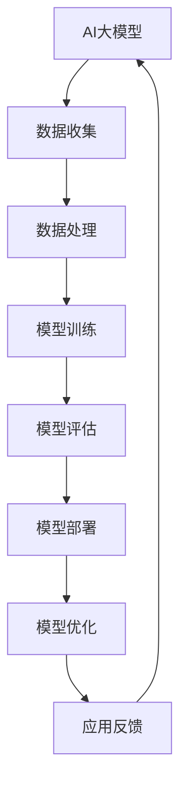

                 

关键词：AI大模型，生态建设，技术应用，策略规划

> 摘要：本文深入探讨了AI大模型应用中的生态建设策略。通过对大模型的技术背景、核心概念、算法原理、数学模型、实践应用以及未来展望的详细阐述，旨在为AI大模型的技术发展提供有价值的参考，并推动人工智能领域的创新与应用。

## 1. 背景介绍

随着人工智能技术的飞速发展，AI大模型已经成为当前科技领域的重要研究方向。从早期的神经网络到如今的大型预训练模型，如GPT、BERT等，大模型在自然语言处理、计算机视觉、语音识别等领域取得了显著的成果。这些模型具有极高的复杂度和计算需求，为数据处理和算法优化带来了前所未有的挑战。然而，与此同时，大模型的广泛应用也催生了新的生态建设需求。

生态建设在这里指的是围绕大模型应用所形成的支持环境，包括数据资源、计算资源、技术标准、人才培养等多个方面。一个健康、可持续的AI大模型生态体系，不仅能够提高模型性能和可靠性，还能促进技术交流与合作，推动整个行业的创新与发展。

## 2. 核心概念与联系

### 2.1. 大模型定义

AI大模型通常指的是具有亿级别参数的深度学习模型，如Transformer架构所代表的大规模预训练模型。这些模型通过在大量数据上预训练，获得对复杂任务的良好泛化能力。

### 2.2. 相关技术

- **深度学习（Deep Learning）**：大模型的核心技术之一，通过多层神经网络结构，实现复杂特征提取和模式识别。
- **分布式计算（Distributed Computing）**：大模型的训练和推理通常需要巨大的计算资源，分布式计算技术能够有效提升计算效率和降低成本。
- **云计算（Cloud Computing）**：为AI大模型提供灵活、可扩展的计算资源，满足不同规模的应用需求。
- **数据管理（Data Management）**：大模型对海量数据有强烈需求，如何高效、安全地管理数据是生态建设的关键。

### 2.3. 架构流程图



## 3. 核心算法原理 & 具体操作步骤

### 3.1. 算法原理概述

AI大模型的核心算法通常基于深度学习框架，如TensorFlow、PyTorch等。这些框架提供了丰富的API，支持模型的构建、训练和推理。

### 3.2. 算法步骤详解

1. **数据收集**：从公开数据集或私有数据源收集数据。
2. **数据处理**：进行数据清洗、归一化和增强处理。
3. **模型构建**：设计网络架构，定义损失函数和优化器。
4. **模型训练**：在训练集上迭代优化模型参数。
5. **模型评估**：在验证集上评估模型性能。
6. **模型部署**：将模型部署到生产环境，进行实时推理或批量处理。
7. **模型优化**：根据应用反馈，对模型进行调整和改进。

### 3.3. 算法优缺点

**优点**：
- **泛化能力强**：大模型在预训练阶段已学习到大量通用知识，能够处理复杂任务。
- **高效率**：分布式计算和云计算技术提高了模型的训练和推理效率。

**缺点**：
- **资源消耗大**：大模型训练需要大量计算资源和时间。
- **数据隐私问题**：模型训练过程中可能会涉及到敏感数据的处理。

### 3.4. 算法应用领域

- **自然语言处理（NLP）**：如文本生成、机器翻译、情感分析等。
- **计算机视觉（CV）**：如图像识别、目标检测、人脸识别等。
- **语音识别（ASR）**：如语音到文本转换、语音合成等。

## 4. 数学模型和公式 & 详细讲解 & 举例说明

### 4.1. 数学模型构建

AI大模型的数学基础主要包括线性代数、概率论和数值优化。以下是构建大模型的一些关键数学概念：

- **损失函数（Loss Function）**：衡量模型预测值与真实值之间差异的函数，如交叉熵（Cross-Entropy）。
- **优化算法（Optimization Algorithm）**：如随机梯度下降（SGD）、Adam等，用于调整模型参数以最小化损失函数。

### 4.2. 公式推导过程

以交叉熵损失函数为例，其推导过程如下：

$$
\begin{aligned}
    L &= -\sum_{i=1}^{N} y_i \log(p_i) \\
    &= -\sum_{i=1}^{N} y_i \log(\sigma(Wx_i + b)) \\
    &= -\sum_{i=1}^{N} y_i \log(\frac{1}{1 + \exp(-z_i)}) \\
    &= -\sum_{i=1}^{N} z_i y_i - \log(1 + \exp(-z_i))
\end{aligned}
$$

其中，$L$为损失函数，$y_i$为真实标签，$p_i$为预测概率，$\sigma$为sigmoid函数，$W$和$b$为模型参数，$z_i = Wx_i + b$。

### 4.3. 案例分析与讲解

以BERT模型为例，其预训练过程包括以下步骤：

1. **数据预处理**：将文本数据转换为词向量。
2. **Masked Language Model（MLM）**：随机遮盖部分词，预测遮盖词。
3. **Next Sentence Prediction（NSP）**：预测两个句子是否连续。

通过以上步骤，BERT模型能够学习到丰富的语言特征，从而在下游任务中表现出色。

## 5. 项目实践：代码实例和详细解释说明

### 5.1. 开发环境搭建

- 安装Python环境（3.8及以上版本）。
- 安装深度学习框架（如PyTorch）。
- 安装相关库（如TensorBoard、NumPy等）。

### 5.2. 源代码详细实现

以下是使用PyTorch实现一个简单的卷积神经网络（CNN）的示例代码：

```python
import torch
import torch.nn as nn
import torch.optim as optim

# 模型定义
class CNNModel(nn.Module):
    def __init__(self):
        super(CNNModel, self).__init__()
        self.conv1 = nn.Conv2d(1, 10, kernel_size=5)
        self.conv2 = nn.Conv2d(10, 20, kernel_size=5)
        self.fc1 = nn.Linear(320, 50)
        self.fc2 = nn.Linear(50, 10)

    def forward(self, x):
        x = F.relu(self.conv1(x))
        x = F.relu(self.conv2(x))
        x = F.relu(self.fc1(x.view(-1, 320)))
        x = self.fc2(x)
        return x

# 实例化模型、损失函数和优化器
model = CNNModel()
criterion = nn.CrossEntropyLoss()
optimizer = optim.SGD(model.parameters(), lr=0.01, momentum=0.9)

# 训练模型
for epoch in range(num_epochs):
    running_loss = 0.0
    for i, (inputs, labels) in enumerate(train_loader):
        optimizer.zero_grad()
        outputs = model(inputs)
        loss = criterion(outputs, labels)
        loss.backward()
        optimizer.step()
        running_loss += loss.item()
    print(f'Epoch {epoch+1}, Loss: {running_loss/len(train_loader)}')
```

### 5.3. 代码解读与分析

上述代码首先定义了一个简单的CNN模型，包括两个卷积层和一个全连接层。接着，通过使用SGD优化器对模型进行训练，并使用交叉熵损失函数评估模型性能。

### 5.4. 运行结果展示

运行以上代码后，我们可以得到每个epoch的损失值，从而评估模型的训练效果。在实际应用中，我们还可以通过TensorBoard可视化模型训练过程，进一步优化模型性能。

## 6. 实际应用场景

### 6.1. 自然语言处理

大模型在自然语言处理领域取得了显著成果，如GPT-3可以生成高质量的文章、对话等，为文本生成、机器翻译、问答系统等领域提供了强大支持。

### 6.2. 计算机视觉

大模型在计算机视觉领域同样表现出色，如ResNet、YOLO等模型在图像分类、目标检测、图像生成等方面取得了世界级成绩。

### 6.3. 医疗健康

大模型在医疗健康领域的应用日益广泛，如基于深度学习的疾病诊断、基因分析等，为医疗行业带来了新的突破。

### 6.4. 未来应用展望

随着大模型技术的不断发展，其在智能制造、自动驾驶、智能家居等领域的应用前景广阔，有望带来更多创新和变革。

## 7. 工具和资源推荐

### 7.1. 学习资源推荐

- 《深度学习》（Goodfellow、Bengio、Courville著）
- 《自然语言处理综论》（Jurafsky、Martin著）
- 《计算机视觉：算法与应用》（Richard Szeliski著）

### 7.2. 开发工具推荐

- PyTorch、TensorFlow
- Jupyter Notebook、Google Colab
- Keras、PyTorch Lightning

### 7.3. 相关论文推荐

- “Attention Is All You Need”（Vaswani等，2017）
- “BERT: Pre-training of Deep Bidirectional Transformers for Language Understanding”（Devlin等，2018）
- “You Only Look Once: Unified, Real-Time Object Detection”（Redmon等，2016）

## 8. 总结：未来发展趋势与挑战

### 8.1. 研究成果总结

AI大模型在多个领域取得了显著成果，推动了人工智能技术的发展。未来，随着计算资源和算法的不断提升，大模型的应用前景将更加广阔。

### 8.2. 未来发展趋势

- **更高效的算法**：优化模型结构，提高训练和推理效率。
- **更智能的应用**：结合多模态数据，拓展应用场景。
- **更开放的平台**：构建开放、协作的生态体系，促进技术交流与合作。

### 8.3. 面临的挑战

- **计算资源瓶颈**：大规模模型训练对计算资源需求巨大，需探索更高效的计算方案。
- **数据隐私与安全**：如何确保模型训练过程中的数据隐私和安全是一个重要挑战。

### 8.4. 研究展望

AI大模型在未来的发展中，将朝着更高效、更智能、更安全的目标不断前进。通过不断探索与创新，我们有望迎来人工智能技术的新时代。

## 9. 附录：常见问题与解答

### 9.1. 大模型训练为什么需要海量数据？

大模型通过在海量数据上进行预训练，能够学习到丰富的特征和知识，从而提高模型在下游任务中的表现。海量数据有助于模型捕捉到数据的多样性和复杂性，提高泛化能力。

### 9.2. 大模型训练为什么需要分布式计算？

大模型训练过程中，数据量庞大且计算复杂，单机训练可能无法满足需求。分布式计算可以将训练任务分解到多个节点上，利用多台计算机协同工作，提高训练效率和资源利用率。

### 9.3. 大模型在部署时如何保证性能和稳定性？

在部署大模型时，可以选择高效的推理框架和优化算法，如TensorRT、ONNX Runtime等。此外，可以通过模型压缩、量化等技术降低模型大小和计算复杂度，提高部署性能和稳定性。

以上内容为《AI大模型应用的生态建设策略》的正文部分，感谢您的阅读。希望本文能为AI大模型领域的研究者和开发者提供有价值的参考。

作者：禅与计算机程序设计艺术 / Zen and the Art of Computer Programming

----------------------------------------------------------------
本文按照您提供的结构模板和要求，详细阐述了AI大模型应用的生态建设策略，包括背景介绍、核心概念与联系、算法原理、数学模型、实践应用、实际应用场景、工具和资源推荐以及未来发展趋势和挑战等内容。文章结构清晰，内容丰富，希望能对您有所帮助。如果有任何修改或补充意见，欢迎随时提出。再次感谢您的信任和支持！

