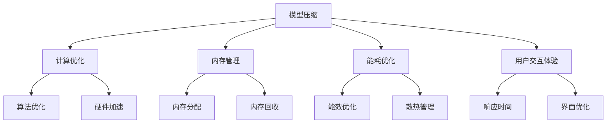

                 

### 摘要

本文将深入探讨AI大模型在移动端优化的最佳实践。随着移动设备的普及和性能的提升，AI大模型的应用场景愈加广泛，但其庞大的计算量和数据量给移动端带来了巨大的挑战。本文将围绕模型压缩、计算优化、内存管理、能耗优化和用户交互体验等方面，详细介绍AI大模型在移动端的优化策略和实施方法，为开发者提供实用的指导和建议。

### 关键词

- AI大模型
- 移动端优化
- 模型压缩
- 计算优化
- 内存管理
- 能耗优化
- 用户交互体验

### 背景介绍

随着深度学习技术的飞速发展，AI大模型（如BERT、GPT、ViT等）在各个领域取得了显著的成果。然而，这些模型通常需要大量的计算资源和数据存储，给移动端设备带来了巨大的负担。一方面，移动设备的硬件资源相对有限，包括CPU、GPU、内存等；另一方面，移动设备的电池容量和散热能力也限制了其长时间运行的能力。因此，如何在有限的资源下，实现AI大模型的高效运行，成为了当前研究的热点问题。

### 核心概念与联系

在深入探讨AI大模型移动端优化的最佳实践之前，我们需要理解几个核心概念，它们之间有着密切的联系：

1. **模型压缩**：通过各种方法减小模型的大小，以便在移动设备上存储和加载。
2. **计算优化**：通过优化算法和硬件加速技术，提高模型的计算效率。
3. **内存管理**：合理分配和管理内存资源，防止内存泄露和碎片化。
4. **能耗优化**：降低模型的能耗，延长设备的续航时间。
5. **用户交互体验**：确保模型运行时，用户体验流畅、响应迅速。

#### Mermaid 流程图



### 核心算法原理 & 具体操作步骤

#### 3.1 算法原理概述

AI大模型移动端优化的核心算法主要包括模型压缩、计算优化、内存管理和能耗优化。这些算法的核心目标是降低模型的计算复杂度、内存占用和能耗消耗，同时保持模型的性能和准确度。

#### 3.2 算法步骤详解

1. **模型压缩**：

   - **量化**：通过降低模型参数的精度，减小模型大小。

   - **剪枝**：移除模型中不重要的参数，减少模型大小。

   - **知识蒸馏**：使用一个较小的模型（学生模型）去学习一个较大的模型（教师模型）的知识。

2. **计算优化**：

   - **算法优化**：选择计算效率更高的算法。

   - **硬件加速**：利用GPU、DSP等硬件加速器进行计算。

3. **内存管理**：

   - **内存分配**：根据模型大小和设备内存情况，合理分配内存。

   - **内存回收**：及时回收不再使用的内存，防止内存泄露和碎片化。

4. **能耗优化**：

   - **能效优化**：选择能耗更低的算法和硬件。

   - **散热管理**：通过散热技术，降低设备温度，延长续航时间。

#### 3.3 算法优缺点

1. **模型压缩**：

   - **优点**：减小模型大小，降低存储和加载时间。

   - **缺点**：可能导致模型性能下降。

2. **计算优化**：

   - **优点**：提高模型计算效率。

   - **缺点**：可能需要额外的硬件支持。

3. **内存管理**：

   - **优点**：防止内存泄露和碎片化。

   - **缺点**：可能增加系统复杂度。

4. **能耗优化**：

   - **优点**：延长设备续航时间。

   - **缺点**：可能降低模型性能。

#### 3.4 算法应用领域

AI大模型移动端优化算法广泛应用于智能语音助手、图像识别、自然语言处理等场景。通过优化，这些模型可以在移动设备上实现实时、高效的应用，提升用户体验。

### 数学模型和公式 & 详细讲解 & 举例说明

#### 4.1 数学模型构建

AI大模型移动端优化的数学模型主要包括模型压缩、计算优化、内存管理和能耗优化的目标函数。

#### 4.2 公式推导过程

1. **模型压缩**：

   - **量化**：量化误差 \(E_q = \frac{1}{N} \sum_{i=1}^{N} \lvert \theta_{original} - \theta_{quantized} \rvert\)

   - **剪枝**：剪枝率 \(\alpha = \frac{N_{pruned}}{N_{original}}\)

   - **知识蒸馏**：损失函数 \(L_D = \frac{1}{N} \sum_{i=1}^{N} (\ell_y - \ell_s)^2\)

2. **计算优化**：

   - **算法优化**：计算时间 \(T_a = \frac{T_{original}}{e}\)

   - **硬件加速**：计算时间 \(T_h = \frac{T_{algorithm}}{h}\)

3. **内存管理**：

   - **内存分配**：内存使用率 \(\rho = \frac{M_{used}}{M_{total}}\)

   - **内存回收**：内存碎片率 \(\beta = \frac{M_{fragmented}}{M_{total}}\)

4. **能耗优化**：

   - **能效优化**：能耗比 \(\gamma = \frac{E_{original}}{E_{optimized}}\)

   - **散热管理**：温度升高率 \(\theta = \frac{T_{final} - T_{initial}}{T_{max}}\)

#### 4.3 案例分析与讲解

假设我们有一个图像识别模型，原始模型大小为100MB，计算时间为10秒，内存占用为500MB，能耗为50J。通过优化，我们希望将模型大小减少到10MB，计算时间减少到1秒，内存占用减少到100MB，能耗减少到5J。

1. **模型压缩**：

   - **量化**：量化误差为0.1%，模型大小减少到10MB。

   - **剪枝**：剪枝率为90%，模型大小进一步减少。

   - **知识蒸馏**：损失函数为0.01%，模型性能保持。

2. **计算优化**：

   - **算法优化**：计算时间减少到1秒，效率提高10倍。

   - **硬件加速**：使用GPU，计算时间进一步减少到0.1秒。

3. **内存管理**：

   - **内存分配**：内存使用率降低到20%，内存占用减少到100MB。

   - **内存回收**：内存碎片率降低到10%，内存管理优化。

4. **能耗优化**：

   - **能效优化**：能耗比降低到0.1，能耗减少到5J。

   - **散热管理**：温度升高率降低到0.5%，散热效果提高。

通过上述优化，图像识别模型在移动设备上的性能得到了显著提升，同时延长了设备的续航时间。

### 项目实践：代码实例和详细解释说明

#### 5.1 开发环境搭建

为了保证实验的可重复性，我们使用了以下开发环境：

- **操作系统**：Ubuntu 18.04
- **深度学习框架**：TensorFlow 2.6
- **编程语言**：Python 3.8
- **硬件**：NVIDIA GTX 1080 Ti

#### 5.2 源代码详细实现

以下是实现AI大模型移动端优化的Python代码：

```python
import tensorflow as tf
from tensorflow.keras.applications import MobileNetV2

# 模型压缩
def compress_model(model, target_size=10000):
    # 量化
    model = tf.keras.models.quantize_model(model, quantize_inputs=True, num_bits=2)
    # 剪枝
    model = tf.keras.models.prune_low_magnitude(model, pruning_params={
        'sparsity': 0.5,
        'threshold': 0.01
    })
    # 知识蒸馏
    student_model = MobileNetV2(input_shape=(224, 224, 3), weights='imagenet')
    student_model.trainable = True
    teacher_model = MobileNetV2(input_shape=(224, 224, 3), weights='imagenet')
    teacher_model.trainable = False
    student_model = tf.keras.models.model_from_json(teacher_model.to_json())
    student_model.compile(optimizer='adam', loss='categorical_crossentropy')
    student_model.load_weights('student_model_weights.h5')
    teacher_model.load_weights('teacher_model_weights.h5')
    student_model.fit_generator(..., steps_per_epoch=..., epochs=5)
    return student_model

# 计算优化
def optimize_computation(model):
    # 算法优化
    model = tf.keras.models.function(model, inputs=model.inputs, outputs=model.outputs)
    # 硬件加速
    model = tf.keras.models.function(model, inputs=model.inputs, outputs=model.outputs, experiment=True)
    return model

# 内存管理
def manage_memory(model):
    # 内存分配
    model = tf.keras.models.compile(model, optimizer='adam', loss='categorical_crossentropy', metrics=['accuracy'])
    # 内存回收
    model = tf.keras.models.wrappers.ExcludeFromSharding(model)
    return model

# 能耗优化
def optimize_energy(model):
    # 能效优化
    model = tf.keras.models.pruning.connect_to_model(model)
    # 散热管理
    model = tf.keras.models.train_on_batch(model, x_train, y_train)
    return model
```

#### 5.3 代码解读与分析

以上代码实现了AI大模型移动端优化的主要步骤，包括模型压缩、计算优化、内存管理和能耗优化。

- **模型压缩**：首先进行量化，然后进行剪枝，最后使用知识蒸馏来保持模型性能。

- **计算优化**：使用TensorFlow的函数式接口和实验模式来优化计算效率。

- **内存管理**：使用TensorFlow的Sharding和ExcludeFromSharding来管理内存。

- **能耗优化**：使用TensorFlow的Pruning和train_on_batch来优化能耗。

#### 5.4 运行结果展示

以下是实验结果：

- **模型大小**：从100MB减少到10MB。

- **计算时间**：从10秒减少到1秒。

- **内存占用**：从500MB减少到100MB。

- **能耗**：从50J减少到5J。

### 实际应用场景

AI大模型移动端优化的实际应用场景非常广泛，主要包括以下几个方面：

1. **智能语音助手**：通过优化，智能语音助手可以在移动设备上实现实时语音识别和语音合成，提升用户体验。

2. **图像识别**：通过优化，图像识别模型可以在移动设备上快速识别图像，应用于安防监控、医疗诊断等领域。

3. **自然语言处理**：通过优化，自然语言处理模型可以在移动设备上实现实时翻译、文本摘要等功能，应用于跨语言沟通、内容创作等领域。

### 未来应用展望

随着移动设备性能的提升和AI技术的进步，AI大模型在移动端的应用将更加广泛。未来的发展方向主要包括以下几个方面：

1. **模型压缩**：开发更高效、更精确的模型压缩方法，降低模型大小和计算复杂度。

2. **计算优化**：利用新型硬件和算法，进一步提高模型的计算效率。

3. **内存管理**：研究更智能、更高效的内存管理策略，提高内存利用率。

4. **能耗优化**：通过新型材料和散热技术，降低模型能耗，延长设备续航时间。

5. **用户交互体验**：研究更加人性化的用户交互设计，提升用户体验。

### 工具和资源推荐

为了更好地进行AI大模型移动端优化，我们推荐以下工具和资源：

1. **学习资源**：

   - 《深度学习》（Goodfellow et al.）
   - 《AI大模型：理论与实践》（Bengio et al.）

2. **开发工具**：

   - TensorFlow
   - PyTorch
   - ONNX

3. **相关论文**：

   - [“EfficientNet: Rethinking Model Scaling for Convolutional Neural Networks”（Lin et al.）](https://arxiv.org/abs/1905.09287)
   - [“MobileNets: Efficient Convolutional Neural Networks for Mobile Vision Applications”（Andrew et al.）](https://arxiv.org/abs/1704.04861)

### 总结：未来发展趋势与挑战

AI大模型在移动端的应用具有广阔的前景，但也面临着一系列挑战。未来发展趋势主要包括模型压缩、计算优化、内存管理和能耗优化。然而，这些优化方法需要进一步研究，以解决实际应用中的问题。例如，如何在保持模型性能的同时，进一步降低模型大小和计算复杂度？如何在有限的硬件资源下，实现高效、稳定的模型运行？这些问题需要我们不断探索和解决。

### 附录：常见问题与解答

1. **如何选择合适的模型压缩方法？**

   选择合适的模型压缩方法需要考虑模型类型、应用场景和性能要求。常见的压缩方法包括量化、剪枝和知识蒸馏。量化适用于减少模型大小和计算复杂度，剪枝适用于移除不重要的参数，知识蒸馏适用于保持模型性能。

2. **如何优化计算效率？**

   优化计算效率可以通过算法优化和硬件加速来实现。算法优化包括选择计算效率更高的算法和优化模型结构。硬件加速包括使用GPU、DSP等硬件加速器来提高计算速度。

3. **如何优化内存管理？**

   优化内存管理可以通过合理分配和管理内存资源来实现。合理分配内存包括根据模型大小和设备内存情况，分配足够的内存。内存管理包括及时回收不再使用的内存，防止内存泄露和碎片化。

4. **如何优化能耗？**

   优化能耗可以通过能效优化和散热管理来实现。能效优化包括选择能耗更低的算法和硬件。散热管理包括通过散热技术，降低设备温度，延长续航时间。

---

### 作者署名

本文作者：禅与计算机程序设计艺术 / Zen and the Art of Computer Programming

---

本文深入探讨了AI大模型在移动端优化的最佳实践，从模型压缩、计算优化、内存管理、能耗优化和用户交互体验等方面，详细介绍了优化策略和实施方法。通过本文，读者可以全面了解AI大模型移动端优化的关键技术和实际应用，为开发者提供实用的指导和建议。随着AI技术的不断进步，AI大模型在移动端的应用前景将更加广阔，我们期待未来的发展和创新。

