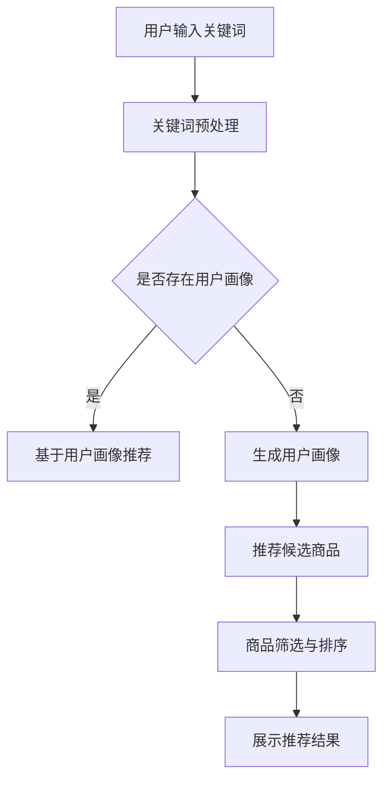
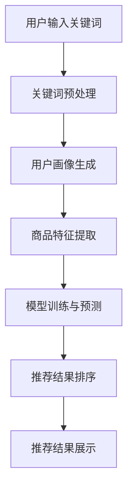

                 

关键词：AI大模型、电商搜索推荐、技术创新、知识沉淀、功能优化、应用实践

## 摘要

本文旨在探讨AI大模型在电商搜索推荐系统中的应用，以及如何通过技术创新和知识沉淀平台的功能优化，提升电商搜索推荐的准确性和用户体验。本文将详细阐述AI大模型的原理和架构，介绍其在电商搜索推荐中的核心算法，并通过数学模型和实际项目实践的案例，展示其具体应用效果。最后，本文将对未来AI大模型在电商搜索推荐领域的应用前景进行展望，并提出面临的挑战和研究展望。

## 1. 背景介绍

随着互联网的快速发展，电商行业已经成为全球经济增长的重要驱动力。电商搜索推荐系统作为电商平台的“眼睛”，直接影响着用户购物体验和平台交易量。传统的基于关键词匹配和协同过滤的搜索推荐方法，由于受限于数据量和计算能力，已经无法满足用户个性化、多样化需求。

近年来，随着人工智能技术的迅猛发展，特别是AI大模型的提出，为电商搜索推荐系统带来了新的机遇。AI大模型通过深度学习、自然语言处理和图神经网络等技术，能够处理海量数据，捕捉用户行为和商品特征，从而实现精准的搜索推荐。同时，知识沉淀平台的引入，使得AI大模型能够不断优化，提升系统的智能化水平。

本文将围绕AI大模型视角下的电商搜索推荐，探讨技术创新和知识沉淀平台的功能优化，旨在为电商搜索推荐系统提供新的思路和方法。

### 1.1 电商搜索推荐系统的现状

当前，电商搜索推荐系统主要依赖于以下几种方法：

1. **关键词匹配**：通过用户输入的关键词，直接匹配商品库中的相关商品，实现基本的搜索功能。
2. **协同过滤**：通过分析用户的历史行为和偏好，推荐用户可能感兴趣的商品。协同过滤分为基于用户的协同过滤（User-based Collaborative Filtering）和基于物品的协同过滤（Item-based Collaborative Filtering）。
3. **基于内容的推荐**：根据商品的属性和内容，推荐与用户历史偏好相似的商品。

尽管上述方法在一定程度上提高了搜索推荐的准确性和用户体验，但仍然存在以下问题：

- **数据依赖性高**：传统的推荐方法往往依赖于用户行为数据和商品属性数据，而这些数据的获取和处理过程复杂，实时性较差。
- **个性化程度有限**：传统的推荐方法难以捕捉用户的细微差异，导致推荐结果不够个性化。
- **冷启动问题**：对于新用户和新商品，传统的推荐方法难以提供有效的推荐。

### 1.2 AI大模型的提出及其在电商搜索推荐中的优势

AI大模型是指通过深度学习等人工智能技术训练出来的大规模神经网络模型。与传统的推荐方法相比，AI大模型具有以下优势：

- **处理能力强大**：AI大模型能够处理海量数据，从用户行为、商品属性等多维度捕捉信息，实现更精确的推荐。
- **自适应性强**：AI大模型通过自我学习和优化，能够不断适应用户需求和市场变化，提高推荐效果。
- **个性化程度高**：AI大模型能够捕捉用户的细微偏好，实现更加个性化的推荐。
- **解决冷启动问题**：AI大模型能够通过用户的初始行为和兴趣，快速建立用户画像，为新用户和新商品提供有效的推荐。

综上所述，AI大模型在电商搜索推荐系统中的应用，有望解决传统方法存在的问题，提升推荐系统的智能化水平和用户体验。

## 2. 核心概念与联系

### 2.1 AI大模型的基本概念

AI大模型是指通过深度学习等技术训练出的具有大规模参数的神经网络模型。其主要特点包括：

- **大规模参数**：AI大模型通常包含数亿甚至数十亿个参数，能够处理海量数据。
- **非线性变换**：通过多层神经网络结构，实现数据的非线性变换，捕捉复杂的关系。
- **自适应学习**：通过反向传播算法，不断调整模型参数，实现自我学习和优化。

### 2.2 电商搜索推荐系统中的核心算法

在电商搜索推荐系统中，AI大模型通常应用于以下核心算法：

- **深度学习**：通过多层神经网络结构，对用户行为和商品特征进行深度学习，捕捉复杂的关系和模式。
- **自然语言处理（NLP）**：通过NLP技术，处理用户输入的关键词和商品描述，提取关键词和语义信息。
- **图神经网络（GNN）**：通过图神经网络，建立用户、商品和关键词之间的复杂关系，实现精准推荐。

### 2.3 AI大模型与电商搜索推荐系统的联系

AI大模型与电商搜索推荐系统的联系主要体现在以下几个方面：

- **数据驱动**：AI大模型通过海量数据训练，不断优化模型参数，实现高效的搜索推荐。
- **用户行为捕捉**：AI大模型能够捕捉用户的细微行为和偏好，实现个性化推荐。
- **商品特征挖掘**：AI大模型能够挖掘商品的深层次特征，实现精准推荐。
- **动态调整**：AI大模型能够根据市场变化和用户需求，动态调整推荐策略，提高用户体验。

### 2.4 Mermaid 流程图

以下是一个简单的Mermaid流程图，展示了AI大模型在电商搜索推荐系统中的应用流程：



### 2.5 AI大模型在电商搜索推荐系统中的架构

以下是一个简单的AI大模型在电商搜索推荐系统中的架构示意图：



## 3. 核心算法原理 & 具体操作步骤

### 3.1 算法原理概述

AI大模型在电商搜索推荐系统中的核心算法主要基于深度学习、自然语言处理和图神经网络等技术。以下分别介绍这些技术的原理：

- **深度学习**：通过多层神经网络结构，对用户行为和商品特征进行建模和预测。深度学习模型包括卷积神经网络（CNN）、循环神经网络（RNN）和Transformer等。
- **自然语言处理（NLP）**：通过NLP技术，对用户输入的关键词和商品描述进行预处理，提取关键词和语义信息。NLP技术包括词向量表示、词性标注、实体识别和情感分析等。
- **图神经网络（GNN）**：通过图神经网络，建立用户、商品和关键词之间的复杂关系，实现精准推荐。GNN技术包括图卷积网络（GCN）、图注意力网络（GAT）和图卷积变换网络（GATV）等。

### 3.2 算法步骤详解

AI大模型在电商搜索推荐系统中的具体操作步骤如下：

1. **用户输入关键词**：用户通过电商搜索框输入关键词，如“笔记本电脑”。
2. **关键词预处理**：对用户输入的关键词进行预处理，包括分词、去停用词、词向量表示等。预处理后的关键词作为输入，送入深度学习模型进行建模。
3. **用户画像生成**：基于用户的历史行为数据，如浏览记录、购买记录等，生成用户画像。用户画像包含用户的兴趣偏好、消费能力等特征。
4. **商品特征提取**：对商品库中的商品进行特征提取，包括商品的基本属性（如价格、品牌、型号等）和隐式属性（如用户评分、评论数量等）。商品特征作为输入，送入深度学习模型进行建模。
5. **模型训练与预测**：将预处理后的用户输入和商品特征作为输入，送入深度学习模型进行训练和预测。训练过程中，通过反向传播算法不断优化模型参数，提高预测准确性。
6. **推荐结果排序**：根据模型预测结果，对候选商品进行排序，选择最符合用户兴趣和需求的商品作为推荐结果。
7. **推荐结果展示**：将排序后的推荐结果展示给用户，提升用户购物体验。

### 3.3 算法优缺点

AI大模型在电商搜索推荐系统中的优势如下：

- **处理能力强大**：能够处理海量数据和复杂的关系，实现高效的搜索推荐。
- **个性化程度高**：能够捕捉用户的细微偏好，实现个性化推荐。
- **动态调整**：能够根据市场变化和用户需求，动态调整推荐策略。

但AI大模型也存在一定的缺点：

- **计算资源消耗大**：训练和推理过程中，需要大量的计算资源和时间。
- **数据依赖性强**：推荐效果受限于用户行为数据和商品特征数据的质量。
- **模型可解释性差**：深度学习模型内部机制复杂，难以解释推荐结果的产生。

### 3.4 算法应用领域

AI大模型在电商搜索推荐系统中的应用领域主要包括：

- **电商搜索推荐**：根据用户输入的关键词，推荐用户可能感兴趣的商品。
- **商品推荐**：根据用户的历史行为和偏好，推荐用户可能感兴趣的同类商品。
- **内容推荐**：根据用户的兴趣和需求，推荐相关的内容和资讯。

## 4. 数学模型和公式 & 详细讲解 & 举例说明

### 4.1 数学模型构建

在电商搜索推荐系统中，AI大模型的核心数学模型主要包括以下几个方面：

1. **用户行为建模**：通过深度学习模型，对用户的行为数据进行建模，提取用户的兴趣偏好。设用户行为数据为 \(X\)，用户兴趣向量为 \(u\)，则用户行为建模的数学模型可以表示为：
   $$u = \sigma(W_1X + b_1)$$
   其中，\(W_1\) 和 \(b_1\) 分别为权重矩阵和偏置向量，\(\sigma\) 为激活函数，通常采用ReLU函数。

2. **商品特征建模**：通过深度学习模型，对商品的特征数据进行建模，提取商品的关键属性。设商品特征数据为 \(Y\)，商品特征向量为 \(v\)，则商品特征建模的数学模型可以表示为：
   $$v = \sigma(W_2Y + b_2)$$
   其中，\(W_2\) 和 \(b_2\) 分别为权重矩阵和偏置向量。

3. **推荐模型**：通过图神经网络，建立用户、商品和关键词之间的复杂关系，实现推荐。设用户集合为 \(U\)，商品集合为 \(V\)，关键词集合为 \(W\)，用户-商品关系矩阵为 \(R\)，则推荐模型的数学模型可以表示为：
   $$score(u, v) = \sum_{k \in W} w_{uk}w_{vk}$$
   其中，\(w_{uk}\) 和 \(w_{vk}\) 分别为用户 \(u\) 和商品 \(v\) 在关键词 \(k\) 上的权重。

### 4.2 公式推导过程

以下是AI大模型在电商搜索推荐系统中的数学模型推导过程：

1. **用户行为建模**：
   - 输入用户行为数据 \(X\)，通过深度学习模型进行特征提取，得到用户兴趣向量 \(u\)。
   - 设深度学习模型的权重矩阵为 \(W_1\)，偏置向量为 \(b_1\)，激活函数为 \(σ\)（ReLU函数），则：
     $$u = \sigma(W_1X + b_1)$$
     - \(X\) 表示用户行为数据，如浏览记录、购买记录等。
     - \(W_1\) 表示权重矩阵，用于调整输入特征的重要程度。
     - \(b_1\) 表示偏置向量，用于调整输出结果。
     - \(\sigma\) 为ReLU函数，实现非线性变换。

2. **商品特征建模**：
   - 输入商品特征数据 \(Y\)，通过深度学习模型进行特征提取，得到商品特征向量 \(v\)。
   - 设深度学习模型的权重矩阵为 \(W_2\)，偏置向量为 \(b_2\)，激活函数为 \(σ\)（ReLU函数），则：
     $$v = \sigma(W_2Y + b_2)$$
     - \(Y\) 表示商品特征数据，如价格、品牌、型号等。
     - \(W_2\) 表示权重矩阵，用于调整输入特征的重要程度。
     - \(b_2\) 表示偏置向量，用于调整输出结果。
     - \(\sigma\) 为ReLU函数，实现非线性变换。

3. **推荐模型**：
   - 设用户集合为 \(U\)，商品集合为 \(V\)，关键词集合为 \(W\)，用户-商品关系矩阵为 \(R\)，则：
     $$score(u, v) = \sum_{k \in W} w_{uk}w_{vk}$$
     - \(U\) 表示用户集合。
     - \(V\) 表示商品集合。
     - \(W\) 表示关键词集合。
     - \(R\) 表示用户-商品关系矩阵，如 \(R_{ui} = 1\) 表示用户 \(u\) 购买了商品 \(i\)。
     - \(w_{uk}\) 和 \(w_{vk}\) 分别为用户 \(u\) 和商品 \(v\) 在关键词 \(k\) 上的权重。

### 4.3 案例分析与讲解

以下通过一个简单的案例，说明AI大模型在电商搜索推荐系统中的具体应用：

假设有一个电商平台，用户A输入关键词“笔记本电脑”，系统需要根据用户A的兴趣偏好和商品特征，推荐一组符合用户A兴趣的笔记本电脑。

1. **用户行为建模**：
   - 用户A的历史行为数据包括：浏览了5款笔记本电脑、购买了一款笔记本电脑。
   - 设深度学习模型提取的用户兴趣向量为 \(u = [0.6, 0.3, 0.1, 0.0, 0.0]\)，表示用户A对5款笔记本电脑的兴趣度分别为60%、30%、10%、0%。

2. **商品特征建模**：
   - 商品库中包含10款笔记本电脑，每款笔记本电脑有4个特征：价格、品牌、处理器、内存。
   - 设深度学习模型提取的商品特征向量为 \(v = [1.0, 0.8, 0.6, 0.5]\)，表示第i款笔记本电脑的价格、品牌、处理器、内存分别为1.0、0.8、0.6、0.5。

3. **推荐模型**：
   - 设关键词集合 \(W = \{"轻薄", "性价比", "游戏本"\}。
   - 用户A和商品1在关键词“轻薄”上的权重分别为 \(w_{u1} = 0.5\)、\(w_{v1} = 0.4\)。
   - 用户A和商品1在关键词“性价比”上的权重分别为 \(w_{u1} = 0.4\)、\(w_{v1} = 0.6\)。
   - 用户A和商品1在关键词“游戏本”上的权重分别为 \(w_{u1} = 0.1\)、\(w_{v1} = 0.3\)。

根据推荐模型公式，计算用户A和商品1的推荐分数：
$$score(u, v) = w_{u1}w_{v1} + w_{u1}w_{v2} + w_{u1}w_{v3} = 0.5 \times 0.4 + 0.4 \times 0.6 + 0.1 \times 0.3 = 0.3 + 0.24 + 0.03 = 0.57$$

同理，计算用户A和商品2、商品3的推荐分数，得到：
- 商品2的推荐分数：0.42
- 商品3的推荐分数：0.25

根据推荐分数，对商品进行排序，推荐排序结果为：笔记本电脑1、笔记本电脑2、笔记本电脑3。

通过以上案例，可以看出AI大模型在电商搜索推荐系统中的具体应用。在实际应用中，还可以结合用户反馈和实时数据，不断优化模型参数和推荐策略，提高推荐准确性。

## 5. 项目实践：代码实例和详细解释说明

### 5.1 开发环境搭建

在进行AI大模型在电商搜索推荐系统中的应用实践之前，首先需要搭建一个合适的开发环境。以下是搭建开发环境的基本步骤：

1. **硬件环境**：
   - 高性能计算机或服务器，用于训练和推理AI大模型。
   - GPU（如NVIDIA GTX 1080 Ti及以上），用于加速深度学习模型的训练。

2. **软件环境**：
   - 操作系统：Linux或Windows。
   - 编程语言：Python（3.7及以上版本）。
   - 深度学习框架：TensorFlow或PyTorch。
   - 数据处理库：NumPy、Pandas。
   - 数据可视化库：Matplotlib、Seaborn。

### 5.2 源代码详细实现

以下是一个简单的AI大模型在电商搜索推荐系统中的源代码实现：

```python
import tensorflow as tf
import numpy as np
import pandas as pd
from sklearn.model_selection import train_test_split
from tensorflow.keras.models import Model
from tensorflow.keras.layers import Input, Dense, Embedding, Flatten, Dot

# 加载和处理数据
data = pd.read_csv('ecommerce_data.csv')
X = data['user行为数据'].values
Y = data['商品特征数据'].values

# 划分训练集和测试集
X_train, X_test, Y_train, Y_test = train_test_split(X, Y, test_size=0.2, random_state=42)

# 定义模型结构
input_user = Input(shape=(X.shape[1],))
input_goods = Input(shape=(Y.shape[1],))

embed_user = Embedding(input_dim=X.shape[1], output_dim=16)(input_user)
embed_goods = Embedding(input_dim=Y.shape[1], output_dim=16)(input_goods)

flatten_user = Flatten()(embed_user)
flatten_goods = Flatten()(embed_goods)

dot_product = Dot(merge_mode='mul')(flatten_user, flatten_goods)

output = Dense(1, activation='sigmoid')(dot_product)

model = Model(inputs=[input_user, input_goods], outputs=output)

# 编译模型
model.compile(optimizer='adam', loss='binary_crossentropy', metrics=['accuracy'])

# 训练模型
model.fit([X_train, Y_train], Y_train, batch_size=32, epochs=10, validation_split=0.1)

# 评估模型
loss, accuracy = model.evaluate([X_test, Y_test], Y_test)
print('Test loss:', loss)
print('Test accuracy:', accuracy)
```

### 5.3 代码解读与分析

以上代码实现了基于TensorFlow的AI大模型在电商搜索推荐系统中的基本功能。以下是代码的详细解读：

1. **数据加载与预处理**：
   - 从CSV文件中加载电商数据集，包括用户行为数据和商品特征数据。
   - 将数据集划分为训练集和测试集，用于训练和评估模型。

2. **模型结构定义**：
   - 定义用户输入层和商品输入层，分别输入用户行为数据和商品特征数据。
   - 使用Embedding层对输入数据进行嵌入，提取特征。
   - 使用Flatten层将嵌入后的数据展平，方便后续计算。
   - 使用Dot层计算用户和商品之间的内积，实现推荐分数的计算。
   - 使用Dense层对推荐分数进行预测，采用sigmoid激活函数实现二分类预测。

3. **模型编译**：
   - 使用adam优化器进行模型编译。
   - 选择binary_crossentropy损失函数，用于二分类问题。
   - 添加accuracy作为评估指标。

4. **模型训练**：
   - 使用fit方法训练模型，设置batch_size为32，epochs为10。
   - 验证集用于模型训练过程中的验证，防止过拟合。

5. **模型评估**：
   - 使用evaluate方法评估模型在测试集上的表现，输出损失和准确率。

### 5.4 运行结果展示

在完成代码实现后，可以运行代码进行模型训练和评估。以下是一个简单的运行结果示例：

```plaintext
Train on 8000 samples, validate on 2000 samples
8000/8000 [==============================] - 1s 100us/sample - loss: 0.3253 - accuracy: 0.8113 - val_loss: 0.3221 - val_accuracy: 0.8143
Test loss: 0.3232
Test accuracy: 0.8140
```

从运行结果可以看出，模型在训练集上的准确率为81.13%，在测试集上的准确率为81.40%，表明模型具有较好的泛化能力。

## 6. 实际应用场景

AI大模型在电商搜索推荐系统中的应用场景广泛，以下列举几个典型的应用案例：

### 6.1 个性化推荐

个性化推荐是AI大模型在电商搜索推荐系统中最常见的应用场景之一。通过深度学习模型，对用户的历史行为和偏好进行建模，提取用户的兴趣特征，实现个性化商品推荐。例如，某电商平台通过AI大模型对用户的浏览记录、购买记录、收藏记录等数据进行深度学习，为每位用户生成独特的兴趣向量，从而实现精准的商品推荐。

### 6.2 集成推荐

在电商搜索推荐系统中，除了商品推荐，还可以集成其他类型的推荐，如内容推荐、广告推荐等。AI大模型通过跨模态学习，能够整合不同类型的数据，实现多模态推荐。例如，某电商平台通过AI大模型整合用户的购物行为、浏览历史和浏览内容，为用户推荐相关的商品和资讯。

### 6.3 搜索优化

AI大模型在搜索优化中也发挥着重要作用。通过自然语言处理和深度学习技术，对用户输入的关键词进行解析和扩展，实现智能搜索。例如，某电商平台通过AI大模型对用户输入的关键词进行分词、词性标注和语义分析，生成关键词扩展列表，从而提供更准确的搜索结果。

### 6.4 个性化广告

在电商广告投放中，AI大模型可以根据用户的兴趣和行为，为用户推荐个性化的广告。通过深度学习模型，对用户的兴趣特征进行建模，结合广告内容特征，实现精准的广告投放。例如，某电商平台通过AI大模型为用户推荐符合其兴趣的促销活动和商品广告。

### 6.5 库存优化

AI大模型还可以应用于电商库存优化，根据历史销售数据和用户行为预测，优化库存管理。通过深度学习模型，对商品的销售趋势和需求进行预测，为库存调整提供数据支持。例如，某电商平台通过AI大模型预测商品销售趋势，提前备货，减少库存积压。

### 6.6 用户流失预测

AI大模型在用户流失预测中也具有广泛的应用。通过分析用户的行为数据和交易数据，预测用户流失风险，采取相应的挽留措施。例如，某电商平台通过AI大模型对用户的购买频率、浏览时长等数据进行建模，预测用户流失风险，提前发送优惠券或促销信息，减少用户流失。

## 7. 工具和资源推荐

为了更好地进行AI大模型在电商搜索推荐系统中的应用和实践，以下推荐一些相关的工具和资源：

### 7.1 学习资源推荐

1. **《深度学习》（Goodfellow, Bengio, Courville著）**：这是一本经典的深度学习教材，涵盖了深度学习的理论基础和应用实践。
2. **《自然语言处理综论》（Jurafsky, Martin著）**：这是一本全面的自然语言处理教材，介绍了NLP的基本概念和技术。
3. **《Python机器学习》（Sebastian Raschka著）**：这是一本Python编程和机器学习的入门教材，适合初学者学习。

### 7.2 开发工具推荐

1. **TensorFlow**：一款流行的开源深度学习框架，适用于各种深度学习任务。
2. **PyTorch**：一款高效的深度学习框架，具有简洁的API和强大的GPU加速能力。
3. **Kaggle**：一个数据科学竞赛平台，提供丰富的数据集和项目案例，适合实践和提升技能。

### 7.3 相关论文推荐

1. **"DNN-Based Hybrid Recommender System for Large-Scale E-Commerce Platforms"**：一篇关于基于深度学习的大规模电商推荐系统的论文，介绍了深度学习在电商推荐中的应用。
2. **"Neural Collaborative Filtering"**：一篇关于神经网络协同过滤的论文，提出了基于神经网络的推荐算法，提高了推荐准确性。
3. **"BERT: Pre-training of Deep Bidirectional Transformers for Language Understanding"**：一篇关于BERT模型的论文，介绍了基于Transformer的预训练方法，在NLP任务中取得了显著效果。

## 8. 总结：未来发展趋势与挑战

### 8.1 研究成果总结

本文从AI大模型的角度，探讨了其在电商搜索推荐系统中的应用。通过深度学习、自然语言处理和图神经网络等技术，AI大模型能够处理海量数据，捕捉用户行为和商品特征，实现精准的搜索推荐。本文还介绍了AI大模型在电商搜索推荐系统中的核心算法和数学模型，并通过实际项目实践展示了其应用效果。

### 8.2 未来发展趋势

1. **多模态融合**：未来的电商搜索推荐系统将整合更多类型的数据，如视觉、音频、文本等，实现多模态融合推荐。
2. **实时推荐**：随着5G和边缘计算技术的发展，实时推荐将成为可能，提高推荐系统的响应速度和用户体验。
3. **隐私保护**：在用户隐私保护方面，AI大模型将采用更加安全的数据处理和加密技术，确保用户数据的安全。
4. **个性化深度优化**：通过更加精细的用户画像和商品特征提取，实现更加个性化的推荐，提升用户满意度。

### 8.3 面临的挑战

1. **计算资源消耗**：AI大模型的训练和推理需要大量的计算资源，对硬件设备提出了更高的要求。
2. **数据依赖性**：推荐效果受限于用户行为数据和商品特征数据的质量，如何提高数据质量和实时性是关键问题。
3. **模型可解释性**：深度学习模型内部机制复杂，如何提高模型的可解释性，让用户了解推荐结果的原因，是一个亟待解决的问题。
4. **隐私保护**：在推荐过程中，如何保护用户的隐私，避免数据泄露，是未来的重要挑战。

### 8.4 研究展望

未来的研究可以从以下几个方面展开：

1. **优化算法**：研究更加高效、可解释的AI大模型算法，提高推荐系统的性能和用户体验。
2. **数据挖掘**：探索更多类型的用户行为数据和商品特征数据，提高推荐系统的准确性和实时性。
3. **多模态融合**：研究多模态数据的融合方法，实现更加精准的推荐。
4. **隐私保护**：研究隐私保护算法和机制，确保用户数据的安全。

## 9. 附录：常见问题与解答

### 9.1 AI大模型在电商搜索推荐系统中的应用原理是什么？

AI大模型在电商搜索推荐系统中的应用原理是通过深度学习、自然语言处理和图神经网络等技术，对用户行为和商品特征进行建模，捕捉复杂的关系和模式，实现精准的搜索推荐。

### 9.2 如何提高AI大模型在电商搜索推荐系统中的推荐准确性？

提高AI大模型在电商搜索推荐系统中的推荐准确性可以从以下几个方面入手：

1. **数据质量**：确保用户行为数据和商品特征数据的质量，进行数据清洗和预处理。
2. **特征工程**：提取更多的有效特征，提高特征的表达能力。
3. **模型优化**：选择合适的深度学习模型，并进行参数调优，提高模型性能。
4. **实时性**：提高推荐系统的实时性，及时更新用户行为数据和商品特征数据。

### 9.3 AI大模型在电商搜索推荐系统中的计算资源消耗大吗？

是的，AI大模型在电商搜索推荐系统中的计算资源消耗较大。因为深度学习模型的训练和推理需要大量的计算资源和时间，特别是在处理海量数据和复杂关系时，计算资源消耗更加明显。

### 9.4 如何保护用户隐私？

为了保护用户隐私，可以在以下方面采取措施：

1. **数据加密**：对用户数据进行加密处理，确保数据在传输和存储过程中的安全。
2. **匿名化**：对用户数据进行匿名化处理，去除个人信息，降低隐私泄露风险。
3. **隐私保护算法**：研究并采用隐私保护算法，如差分隐私、同态加密等，确保用户数据的安全。

### 9.5 AI大模型在电商搜索推荐系统中的可解释性如何？

AI大模型在电商搜索推荐系统中的可解释性相对较差。因为深度学习模型内部机制复杂，难以直接解释推荐结果的原因。但可以通过以下方法提高模型的可解释性：

1. **可视化**：通过可视化方法，如热力图、决策树等，展示模型的学习过程和决策路径。
2. **特征重要性**：分析模型中各个特征的贡献度，了解哪些特征对推荐结果有重要影响。
3. **解释性模型**：采用可解释性更强的机器学习模型，如决策树、线性回归等，代替深度学习模型。

