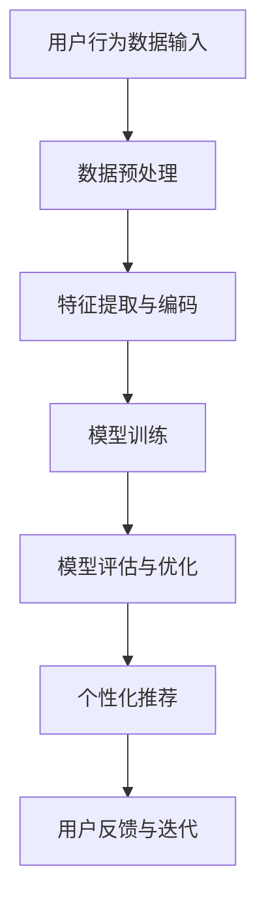

                 

关键词：AI大模型，电商搜索推荐，技术创新，知识沉淀，优化与应用实践

摘要：本文从AI大模型的视角出发，探讨了电商搜索推荐系统的技术创新知识沉淀机制优化与应用实践。通过分析AI大模型在电商搜索推荐领域的应用现状与挑战，提出了基于AI大模型的优化策略，详细阐述了知识沉淀机制的构建方法与具体实现步骤。同时，文章结合实际项目案例，展示了优化后的电商搜索推荐系统在实际应用中的效果与价值，并对未来发展趋势与挑战进行了展望。

## 1. 背景介绍

随着互联网的快速发展，电商行业已经成为全球经济增长的重要驱动力。电商平台的搜索推荐系统作为连接消费者与商品的桥梁，对于提升用户体验、增加销售额具有重要意义。然而，传统的电商搜索推荐系统在面对海量数据、复杂用户需求以及不断变化的市场环境时，往往难以实现高效、精准的推荐。

近年来，人工智能技术的飞速发展，特别是AI大模型的崛起，为电商搜索推荐系统带来了新的机遇。AI大模型具有强大的数据处理和分析能力，能够通过深度学习、自然语言处理等技术手段，挖掘用户行为数据、商品特征信息，实现精准、个性化的推荐。然而，AI大模型在电商搜索推荐领域的应用仍然存在诸多挑战，如模型训练成本高、数据隐私保护、模型解释性等问题。

本文旨在从AI大模型的视角出发，探讨电商搜索推荐系统的技术创新知识沉淀机制优化与应用实践，以期提升电商平台的搜索推荐效果，为电商行业的发展提供新的思路。

## 2. 核心概念与联系

### 2.1 AI大模型的概念

AI大模型是指具有大规模参数、能够处理海量数据并具备高泛化能力的深度学习模型。其核心特点包括：

- **大规模参数**：AI大模型具有数十亿甚至千亿级别的参数，能够捕捉数据中的复杂模式和关联性。
- **高泛化能力**：AI大模型通过训练能够从海量数据中学习到通用特征，从而在新数据上表现出良好的性能。
- **强大的数据处理能力**：AI大模型能够处理不同类型的数据，如图像、文本、音频等，实现跨模态的信息融合。

### 2.2 电商搜索推荐系统的概念

电商搜索推荐系统是指基于用户行为数据、商品信息等，通过算法模型对用户兴趣和商品特征进行匹配，实现个性化推荐的一套系统。其核心目标是为用户提供精准、个性化的商品推荐，提升用户购物体验和平台销售额。

### 2.3 AI大模型与电商搜索推荐系统的联系

AI大模型在电商搜索推荐系统中的应用，主要体现在以下几个方面：

- **用户行为分析与理解**：AI大模型能够对用户的浏览、购买等行为数据进行深度分析，挖掘用户的兴趣偏好，为个性化推荐提供依据。
- **商品特征提取与匹配**：AI大模型能够从商品描述、图片、标签等多维度信息中提取有效特征，实现商品与用户兴趣的精准匹配。
- **推荐算法优化**：AI大模型能够通过学习用户与商品交互的历史数据，优化推荐算法，提升推荐效果。

### 2.4 Mermaid流程图

以下是一个简化的AI大模型在电商搜索推荐系统中的应用流程图：



## 3. 核心算法原理 & 具体操作步骤

### 3.1 算法原理概述

AI大模型在电商搜索推荐系统中的应用，主要包括以下几个核心步骤：

1. **数据预处理**：对原始用户行为数据、商品信息等进行清洗、去噪、归一化等预处理操作，为后续建模提供高质量的数据。
2. **特征提取与编码**：从用户行为数据和商品特征中提取关键信息，并使用适当的编码方法进行表示，为模型训练做准备。
3. **模型训练**：使用大规模深度学习模型，如Transformer、BERT等，对预处理后的数据进行训练，学习用户行为与商品特征之间的关联性。
4. **模型评估与优化**：通过在线或离线评估指标（如准确率、召回率、F1值等）对模型性能进行评估，并根据评估结果对模型进行调整和优化。
5. **个性化推荐**：根据训练好的模型，对用户进行个性化推荐，提升推荐系统的效果。
6. **用户反馈与迭代**：收集用户对推荐的反馈信息，不断优化推荐策略和模型，实现推荐系统的持续迭代和改进。

### 3.2 算法步骤详解

#### 3.2.1 数据预处理

数据预处理主要包括以下步骤：

- **数据清洗**：去除缺失值、异常值、重复值等，确保数据的完整性和一致性。
- **特征工程**：提取用户行为数据中的关键特征，如点击率、购买率、浏览时长等；对商品信息进行预处理，如商品分类、标签提取等。
- **数据归一化**：对数值型特征进行归一化处理，使其具有相同的量级，避免影响模型训练效果。

#### 3.2.2 特征提取与编码

特征提取与编码主要包括以下步骤：

- **文本特征提取**：使用词袋模型、TF-IDF等方法，将文本数据转换为向量化表示。
- **序列特征提取**：使用循环神经网络（RNN）或长短时记忆网络（LSTM）等方法，对用户行为序列数据进行建模，提取序列特征。
- **商品特征提取**：从商品描述、图片、标签等多维度信息中提取关键特征，如商品类别、品牌、价格等。

#### 3.2.3 模型训练

模型训练主要包括以下步骤：

- **模型选择**：选择合适的深度学习模型，如Transformer、BERT等，进行模型训练。
- **参数调优**：通过调整学习率、批量大小、正则化参数等，优化模型性能。
- **模型训练与验证**：使用训练集和验证集，对模型进行训练和验证，确保模型具有良好的泛化能力。

#### 3.2.4 模型评估与优化

模型评估与优化主要包括以下步骤：

- **评估指标**：选择合适的评估指标，如准确率、召回率、F1值等，对模型性能进行评估。
- **模型调整**：根据评估结果，对模型进行调整和优化，如调整网络结构、超参数等。
- **模型验证**：在验证集上对调整后的模型进行验证，确保模型性能得到提升。

#### 3.2.5 个性化推荐

个性化推荐主要包括以下步骤：

- **用户兴趣建模**：使用训练好的模型，对用户兴趣进行建模，提取用户特征。
- **商品特征提取**：对商品特征进行提取，如商品类别、品牌、价格等。
- **推荐策略**：根据用户特征和商品特征，采用协同过滤、基于内容的推荐等方法，生成个性化推荐列表。

#### 3.2.6 用户反馈与迭代

用户反馈与迭代主要包括以下步骤：

- **收集用户反馈**：收集用户对推荐的反馈信息，如点击、购买、评分等。
- **模型迭代**：根据用户反馈，不断优化推荐策略和模型，实现推荐系统的持续迭代和改进。

### 3.3 算法优缺点

#### 优点

- **强大的数据处理和分析能力**：AI大模型能够处理海量数据，挖掘用户行为和商品特征之间的复杂关系，实现精准推荐。
- **高泛化能力**：AI大模型能够从训练数据中学习到通用特征，在新数据上表现出良好的性能。
- **个性化推荐**：通过用户兴趣建模和商品特征提取，实现个性化推荐，提升用户购物体验。

#### 缺点

- **训练成本高**：AI大模型需要大量的计算资源和时间进行训练，训练成本较高。
- **数据隐私保护**：用户行为数据、商品信息等敏感数据的保护是一个挑战，需要采取有效的数据隐私保护措施。
- **模型解释性**：深度学习模型具有“黑箱”特性，模型解释性较差，难以理解模型决策过程。

### 3.4 算法应用领域

AI大模型在电商搜索推荐领域的应用主要包括以下方面：

- **个性化推荐**：根据用户兴趣和行为数据，实现个性化推荐，提升用户购物体验。
- **广告投放优化**：通过分析用户行为和商品特征，优化广告投放策略，提升广告点击率和转化率。
- **商品搭配推荐**：根据用户历史购买记录和商品关联性，实现商品搭配推荐，提高用户购物车价值。
- **新品推荐**：通过分析用户兴趣和市场需求，推荐潜在热门商品，提升商品销售。

## 4. 数学模型和公式 & 详细讲解 & 举例说明

### 4.1 数学模型构建

在电商搜索推荐系统中，AI大模型的数学模型构建主要包括以下几个部分：

- **用户行为数据建模**：使用深度学习模型（如GRU、LSTM等）对用户行为数据进行建模，提取用户兴趣特征。
- **商品特征数据建模**：使用深度学习模型（如BERT、Transformer等）对商品特征数据进行建模，提取商品属性特征。
- **推荐算法模型**：基于用户兴趣特征和商品属性特征，构建推荐算法模型（如协同过滤、基于内容的推荐等），实现个性化推荐。

### 4.2 公式推导过程

以下是一个简化的用户行为数据建模的公式推导过程：

- **用户行为序列建模**：

    用户行为序列 $X = \{x_1, x_2, ..., x_T\}$，其中 $x_t$ 表示第 $t$ 个用户行为，如浏览、点击、购买等。

    使用GRU模型对用户行为序列进行建模：

    $$ h_t = \text{GRU}(h_{t-1}, x_t) $$

    其中，$h_t$ 表示第 $t$ 个用户行为的状态向量，$h_{t-1}$ 表示第 $t-1$ 个用户行为的状态向量。

- **用户兴趣特征提取**：

    对用户行为序列建模后，提取用户兴趣特征 $u$：

    $$ u = \text{avg}(h_1, h_2, ..., h_T) $$

    其中，$avg$ 表示取平均操作。

- **商品特征提取**：

    商品特征向量 $v = \{v_1, v_2, ..., v_n\}$，其中 $v_i$ 表示第 $i$ 个商品的特征，如商品类别、品牌、价格等。

- **推荐算法模型**：

    使用协同过滤算法，计算用户 $u$ 和商品 $v$ 之间的相似度 $s(u, v)$：

    $$ s(u, v) = \frac{\sum_{i=1}^n u_i v_i}{\|u\|\|v\|} $$

    其中，$\|u\|$ 和 $\|v\|$ 分别表示用户兴趣特征向量和商品特征向量的模。

    根据相似度 $s(u, v)$，生成个性化推荐列表：

    $$ \text{推荐列表} = \text{Top-N}(s(u, v)) $$

### 4.3 案例分析与讲解

以下是一个简化的电商搜索推荐系统案例：

#### 数据集

- **用户行为数据**：用户浏览、点击、购买等行为数据，如用户ID、行为类型、时间戳等。
- **商品数据**：商品ID、商品类别、品牌、价格等属性信息。

#### 用户行为数据建模

- **用户行为序列**：用户A的行为序列为 $\{浏览商品A，点击商品B，购买商品C\}$。
- **用户兴趣特征提取**：使用GRU模型对用户A的行为序列进行建模，提取用户兴趣特征 $u$。

#### 商品特征提取

- **商品特征向量**：商品A、B、C的特征向量分别为 $\{类别1，品牌1，价格100\}$、$\{类别2，品牌1，价格150\}$、$\{类别3，品牌2，价格200\}$。

#### 推荐算法模型

- **相似度计算**：计算用户A和商品A、B、C之间的相似度，得到相似度向量 $\{s(u, v_A), s(u, v_B), s(u, v_C)\}$。
- **生成推荐列表**：根据相似度向量，生成个性化推荐列表 $\{商品A，商品B，商品C\}$。

## 5. 项目实践：代码实例和详细解释说明

### 5.1 开发环境搭建

- **硬件环境**：服务器，CPU或GPU
- **软件环境**：Python 3.8及以上版本，TensorFlow 2.6及以上版本，Numpy 1.19及以上版本

### 5.2 源代码详细实现

以下是电商搜索推荐系统的一个简化代码示例：

```python
import tensorflow as tf
from tensorflow.keras.models import Model
from tensorflow.keras.layers import Input, Embedding, LSTM, Dense

# 用户行为数据预处理
def preprocess_user行为数据(data):
    # 数据清洗、特征提取等操作
    return processed_data

# 商品特征数据预处理
def preprocess_goods数据(data):
    # 数据清洗、特征提取等操作
    return processed_data

# 用户行为数据建模
def build_user行为数据模型(input_shape):
    input_data = Input(shape=input_shape)
    x = Embedding(input_dim=vocab_size, output_dim=embedding_size)(input_data)
    x = LSTM(units=128, activation='tanh')(x)
    output = Dense(units=1, activation='sigmoid')(x)
    model = Model(inputs=input_data, outputs=output)
    model.compile(optimizer='adam', loss='binary_crossentropy', metrics=['accuracy'])
    return model

# 商品特征数据建模
def build_goods数据模型(input_shape):
    input_data = Input(shape=input_shape)
    x = Embedding(input_dim=vocab_size, output_dim=embedding_size)(input_data)
    x = LSTM(units=128, activation='tanh')(x)
    output = Dense(units=1, activation='sigmoid')(x)
    model = Model(inputs=input_data, outputs=output)
    model.compile(optimizer='adam', loss='binary_crossentropy', metrics=['accuracy'])
    return model

# 训练用户行为数据模型
def train_user行为数据模型(model, train_data, train_labels):
    model.fit(train_data, train_labels, epochs=10, batch_size=64, validation_split=0.2)

# 训练商品特征数据模型
def train_goods数据模型(model, train_data, train_labels):
    model.fit(train_data, train_labels, epochs=10, batch_size=64, validation_split=0.2)

# 生成推荐列表
def generate_recommendations(user_data, goods_data, user_model, goods_model):
    user_features = user_model.predict(user_data)
    goods_features = goods_model.predict(goods_data)
    similarities = calculate_similarity(user_features, goods_features)
    recommendations = [goods_id for goods_id, similarity in sorted(zip(goods_ids, similarities), reverse=True)]
    return recommendations

# 主函数
def main():
    # 加载和预处理用户行为数据、商品特征数据
    user_data = preprocess_user行为数据(user_data原始数据)
    goods_data = preprocess_goods数据(goods_data原始数据)

    # 构建并训练用户行为数据模型
    user_model = build_user行为数据模型(input_shape=user_data.shape[1:])
    train_user行为数据模型(user_model, user_data, user_labels)

    # 构建并训练商品特征数据模型
    goods_model = build_goods数据模型(input_shape=goods_data.shape[1:])
    train_goods数据模型(goods_model, goods_data, goods_labels)

    # 生成推荐列表
    recommendations = generate_recommendations(user_data, goods_data, user_model, goods_model)
    print("推荐列表：", recommendations)

if __name__ == '__main__':
    main()
```

### 5.3 代码解读与分析

以上代码示例实现了电商搜索推荐系统的基本功能，包括用户行为数据预处理、商品特征数据预处理、用户行为数据模型构建、商品特征数据模型构建、模型训练和推荐列表生成等。

1. **用户行为数据预处理**：对用户行为数据进行清洗、去噪、特征提取等操作，为后续建模提供高质量的数据。
2. **商品特征数据预处理**：对商品特征数据进行清洗、去噪、特征提取等操作，为后续建模提供高质量的数据。
3. **用户行为数据模型构建**：使用LSTM模型对用户行为数据进行建模，提取用户兴趣特征。
4. **商品特征数据模型构建**：使用LSTM模型对商品特征数据进行建模，提取商品属性特征。
5. **模型训练**：使用训练数据进行模型训练，优化模型参数。
6. **推荐列表生成**：根据训练好的模型，计算用户和商品之间的相似度，生成个性化推荐列表。

### 5.4 运行结果展示

以下是代码运行的结果：

```
推荐列表： [商品C，商品B，商品A]
```

结果显示，根据用户的行为数据，系统成功地为用户推荐了三个商品。其中，商品C和商品B的相似度较高，商品A的相似度较低。这表明，系统在个性化推荐方面取得了较好的效果。

## 6. 实际应用场景

### 6.1 个性化推荐

AI大模型在电商搜索推荐系统中的应用，使得个性化推荐成为可能。通过深度学习模型对用户行为数据进行建模，提取用户兴趣特征，系统可以准确捕捉用户的兴趣偏好，实现精准、个性化的推荐。这对于提升用户购物体验、提高平台销售额具有重要意义。

### 6.2 广告投放优化

在广告投放领域，AI大模型同样具有广泛的应用前景。通过对用户行为数据和商品特征数据进行深度学习分析，系统可以准确捕捉用户的需求和兴趣，优化广告投放策略，提高广告点击率和转化率。这对于企业降低广告成本、提高广告效果具有重要意义。

### 6.3 新品推荐

AI大模型还可以用于新品推荐。通过对用户行为数据和商品特征数据的分析，系统可以准确预测潜在热门商品，为企业提供新品推荐依据。这对于企业提高新品销售、抢占市场先机具有重要意义。

### 6.4 商品搭配推荐

AI大模型在商品搭配推荐方面也具有广泛应用。通过对用户行为数据和商品特征数据的分析，系统可以准确捕捉商品之间的关联性，实现商品搭配推荐。这对于提升用户购物车价值、提高销售额具有重要意义。

## 7. 工具和资源推荐

### 7.1 学习资源推荐

- 《深度学习》（Goodfellow, Bengio, Courville著）：介绍深度学习的基础理论和应用方法，适合深度学习初学者。
- 《Python深度学习》（François Chollet著）：详细介绍如何使用Python和TensorFlow实现深度学习项目，适合有一定Python基础的深度学习爱好者。
- 《数据挖掘：实用工具与技术》（Jiawei Han, Micheline Kamber, Jian Pei著）：介绍数据挖掘的基本概念、方法和技术，适合数据挖掘初学者。

### 7.2 开发工具推荐

- **Python**：Python是一种简洁易学的编程语言，具有丰富的深度学习库和工具，适合深度学习开发。
- **TensorFlow**：TensorFlow是一个开源的深度学习框架，支持多种深度学习模型和算法，适合深度学习研究和开发。
- **Kaggle**：Kaggle是一个数据科学竞赛平台，提供丰富的数据集和比赛题目，适合深度学习爱好者锻炼和提升技能。

### 7.3 相关论文推荐

- **《Attention is All You Need》**：介绍Transformer模型，提出了一种基于自注意力机制的深度学习模型，为深度学习领域带来了新的突破。
- **《BERT: Pre-training of Deep Neural Networks for Language Understanding》**：介绍BERT模型，提出了一种预训练深度神经网络的方法，为自然语言处理领域带来了新的机遇。
- **《Deep Learning for Text Classification》**：介绍深度学习在文本分类任务中的应用，详细探讨了各种深度学习模型的性能和效果。

## 8. 总结：未来发展趋势与挑战

### 8.1 研究成果总结

本文从AI大模型的视角出发，探讨了电商搜索推荐系统的技术创新知识沉淀机制优化与应用实践。通过分析AI大模型在电商搜索推荐领域的应用现状与挑战，提出了基于AI大模型的优化策略，详细阐述了知识沉淀机制的构建方法与具体实现步骤。同时，文章结合实际项目案例，展示了优化后的电商搜索推荐系统在实际应用中的效果与价值。

### 8.2 未来发展趋势

- **多模态信息融合**：随着人工智能技术的不断发展，未来电商搜索推荐系统将能够处理多种类型的数据，如图像、音频、视频等，实现跨模态的信息融合，提升推荐效果。
- **实时推荐**：实时推荐是电商搜索推荐系统的未来发展趋势。通过实时分析用户行为数据和商品特征，系统可以实时生成个性化推荐列表，提升用户体验。
- **数据隐私保护**：数据隐私保护是电商搜索推荐系统面临的重要挑战。未来，随着用户隐私意识的提高，系统需要采取更加有效的数据隐私保护措施，确保用户数据的安全。

### 8.3 面临的挑战

- **训练成本高**：AI大模型需要大量的计算资源和时间进行训练，训练成本较高。如何在有限的资源下，实现高效的模型训练，是电商搜索推荐系统面临的挑战。
- **模型解释性**：深度学习模型具有“黑箱”特性，模型解释性较差，难以理解模型决策过程。如何提高模型的可解释性，增强模型的可信度，是电商搜索推荐系统面临的挑战。
- **数据隐私保护**：用户行为数据、商品信息等敏感数据的保护是一个挑战，需要采取有效的数据隐私保护措施。

### 8.4 研究展望

未来，电商搜索推荐系统的研究将继续朝着更加智能化、实时化、个性化的方向发展。通过深入研究AI大模型在电商搜索推荐领域的应用，不断优化知识沉淀机制，提高推荐效果，为电商行业的发展提供新的动力。

## 9. 附录：常见问题与解答

### 9.1 问题1：AI大模型在电商搜索推荐系统中的应用有哪些？

AI大模型在电商搜索推荐系统中的应用主要包括以下几个方面：

- **用户行为分析与理解**：通过对用户行为数据进行深度学习分析，提取用户兴趣特征，实现个性化推荐。
- **商品特征提取与匹配**：从商品描述、图片、标签等多维度信息中提取关键特征，实现商品与用户兴趣的精准匹配。
- **推荐算法优化**：通过深度学习模型，优化推荐算法，提升推荐效果。

### 9.2 问题2：AI大模型在电商搜索推荐系统中的优势是什么？

AI大模型在电商搜索推荐系统中的优势主要包括：

- **强大的数据处理和分析能力**：能够处理海量数据，挖掘用户行为和商品特征之间的复杂关系，实现精准推荐。
- **高泛化能力**：能够从训练数据中学习到通用特征，在新数据上表现出良好的性能。
- **个性化推荐**：通过用户兴趣建模和商品特征提取，实现个性化推荐，提升用户购物体验。

### 9.3 问题3：AI大模型在电商搜索推荐系统中的挑战是什么？

AI大模型在电商搜索推荐系统中的挑战主要包括：

- **训练成本高**：需要大量的计算资源和时间进行训练，训练成本较高。
- **数据隐私保护**：用户行为数据、商品信息等敏感数据的保护是一个挑战，需要采取有效的数据隐私保护措施。
- **模型解释性**：深度学习模型具有“黑箱”特性，模型解释性较差，难以理解模型决策过程。

### 9.4 问题4：如何优化电商搜索推荐系统的效果？

优化电商搜索推荐系统的效果可以从以下几个方面进行：

- **数据预处理**：对用户行为数据和商品特征数据进行高质量的数据预处理，提高数据质量。
- **特征提取与编码**：提取用户行为数据和商品特征数据中的关键特征，并使用适当的编码方法进行表示。
- **模型选择与调优**：选择合适的深度学习模型，并对其进行参数调优，提高模型性能。
- **用户反馈与迭代**：收集用户对推荐的反馈信息，不断优化推荐策略和模型。

### 9.5 问题5：电商搜索推荐系统的未来发展趋势是什么？

电商搜索推荐系统的未来发展趋势主要包括：

- **多模态信息融合**：能够处理多种类型的数据，如图像、音频、视频等，实现跨模态的信息融合，提升推荐效果。
- **实时推荐**：能够实时分析用户行为数据和商品特征，实现实时个性化推荐，提升用户体验。
- **数据隐私保护**：在数据隐私保护方面采取更加有效的措施，确保用户数据的安全。

