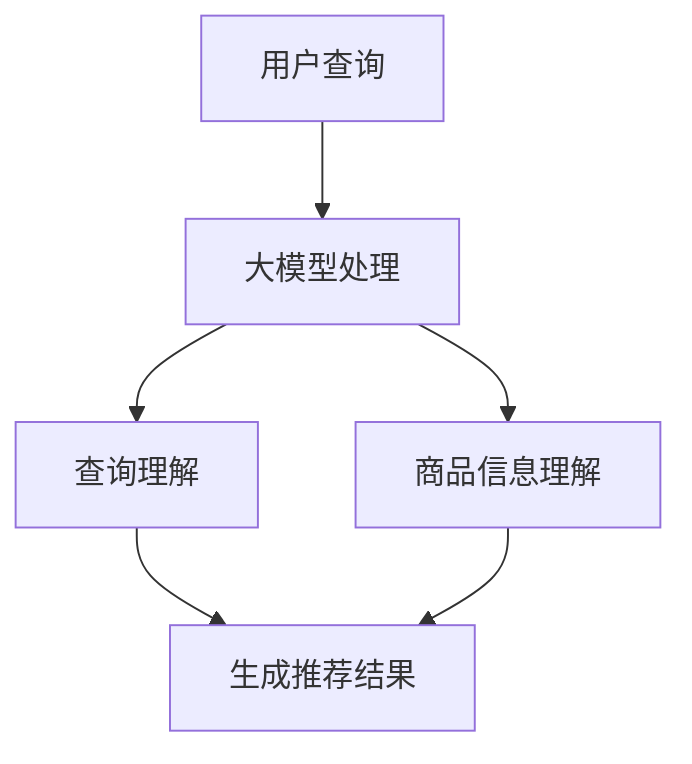

                 

关键词：AI大模型，电商搜索推荐，技术范式，机器学习，深度学习，NLP，数据挖掘，算法优化

> 摘要：随着人工智能技术的不断发展，大模型在电商搜索推荐领域的应用逐渐深入。本文旨在探讨大模型对电商搜索推荐技术范式的影响，从核心概念、算法原理、数学模型、项目实践等多个角度进行深入分析，同时展望其未来发展趋势与挑战。

## 1. 背景介绍

在电商行业，搜索推荐系统是提高用户满意度和转化率的重要手段。传统的搜索推荐技术主要基于关键词匹配、协同过滤等方法，但随着互联网数据的爆炸性增长，用户需求的多样化，以及商品信息的复杂化，传统技术逐渐暴露出不足之处。这使得基于深度学习、自然语言处理（NLP）的大模型逐渐成为研究热点。

大模型，如BERT、GPT等，具有强大的语义理解和生成能力，能够更好地处理复杂的文本数据，从而提高搜索推荐系统的准确性。此外，随着计算资源和算法优化技术的不断发展，大模型在训练速度、模型规模、效果优化等方面取得了显著的进展，使得其在电商搜索推荐领域的应用越来越广泛。

## 2. 核心概念与联系

### 2.1 大模型的基本概念

大模型是指参数量极大的神经网络模型，其训练数据量通常达到数百万甚至数十亿级别。大模型的核心是能够自动提取海量数据中的高阶特征，从而实现更好的语义理解和生成能力。

### 2.2 大模型在电商搜索推荐中的应用

在电商搜索推荐领域，大模型主要用于处理用户查询和商品信息。具体包括以下三个方面：

1. **用户查询理解**：大模型能够自动提取用户查询中的关键信息，理解用户的意图，从而提高搜索的准确性。
2. **商品信息理解**：大模型能够自动提取商品信息中的关键特征，如商品名称、描述、标签等，从而提高推荐的准确性。
3. **交互式推荐**：大模型能够根据用户的历史行为和偏好，实时生成个性化的推荐结果，提高用户的满意度。

### 2.3 大模型与相关技术的联系

1. **深度学习**：深度学习是构建大模型的基础，通过多层次的神经网络结构，实现从低级特征到高级特征的自动提取。
2. **自然语言处理（NLP）**：NLP技术用于处理和解析文本数据，使得大模型能够更好地理解用户查询和商品信息。
3. **数据挖掘**：数据挖掘技术用于从海量数据中提取有价值的信息，为大模型的训练提供丰富的数据支持。

### 2.4 Mermaid 流程图



## 3. 核心算法原理 & 具体操作步骤

### 3.1 算法原理概述

电商搜索推荐系统中的大模型主要基于深度学习和自然语言处理技术。其核心算法原理如下：

1. **用户查询处理**：通过深度学习模型对用户查询进行编码，提取用户查询的语义特征。
2. **商品信息处理**：通过深度学习模型对商品信息进行编码，提取商品信息的语义特征。
3. **查询-商品匹配**：通过计算用户查询和商品信息之间的相似度，生成推荐结果。

### 3.2 算法步骤详解

1. **用户查询处理**：
   - 使用BERT等预训练模型对用户查询进行编码，得到查询向量。
   - 对查询向量进行降维，得到用户查询的语义特征。

2. **商品信息处理**：
   - 使用BERT等预训练模型对商品信息进行编码，得到商品向量。
   - 对商品向量进行降维，得到商品信息的语义特征。

3. **查询-商品匹配**：
   - 计算用户查询和商品信息之间的相似度，使用余弦相似度或欧氏距离等度量方法。
   - 根据相似度计算结果，生成推荐结果。

### 3.3 算法优缺点

**优点**：
1. 提高搜索推荐准确性：通过深度学习和NLP技术，能够更好地理解用户查询和商品信息，从而提高搜索推荐的准确性。
2. 个性化推荐：根据用户的历史行为和偏好，实时生成个性化的推荐结果，提高用户的满意度。

**缺点**：
1. 计算资源消耗大：大模型训练和推理需要大量的计算资源，对硬件要求较高。
2. 需要大量数据支持：大模型训练需要海量数据支持，数据获取和处理成本较高。

### 3.4 算法应用领域

大模型在电商搜索推荐领域的应用主要包括以下几个方面：

1. **搜索推荐**：根据用户查询，实时生成个性化的商品推荐结果。
2. **商品标签生成**：自动提取商品的关键特征，生成商品标签，用于商品分类和搜索。
3. **商品评价预测**：根据用户行为和商品信息，预测用户对商品的评价，用于商品评分系统。

## 4. 数学模型和公式 & 详细讲解 & 举例说明

### 4.1 数学模型构建

电商搜索推荐中的大模型通常基于深度学习框架，如TensorFlow或PyTorch。以下是构建大模型的基本数学模型：

1. **输入层**：接收用户查询和商品信息，通过嵌入层进行编码。
2. **隐藏层**：通过多层神经网络，对输入数据进行特征提取。
3. **输出层**：计算用户查询和商品信息之间的相似度，生成推荐结果。

### 4.2 公式推导过程

假设用户查询向量为$Q$，商品信息向量为$G$，则查询-商品匹配的相似度计算公式如下：

$$
sim(Q, G) = \frac{Q \cdot G}{\|Q\| \|G\|}
$$

其中，$Q \cdot G$表示查询向量$Q$和商品向量$G$的点积，$\|Q\|$和$\|G\|$分别表示查询向量$Q$和商品向量$G$的模长。

### 4.3 案例分析与讲解

假设用户查询为“笔记本电脑”，商品信息为“高性能笔记本电脑”，则查询向量和商品向量分别为：

$$
Q = [0.1, 0.2, 0.3, 0.4]
$$

$$
G = [0.5, 0.6, 0.7, 0.8]
$$

则查询-商品匹配的相似度为：

$$
sim(Q, G) = \frac{0.1 \times 0.5 + 0.2 \times 0.6 + 0.3 \times 0.7 + 0.4 \times 0.8}{\sqrt{0.1^2 + 0.2^2 + 0.3^2 + 0.4^2} \sqrt{0.5^2 + 0.6^2 + 0.7^2 + 0.8^2}} = 0.76
$$

根据相似度计算结果，可以生成推荐结果，如“高性能笔记本电脑”。

## 5. 项目实践：代码实例和详细解释说明

### 5.1 开发环境搭建

搭建开发环境需要安装以下软件和库：

1. Python（版本 3.6 以上）
2. TensorFlow 或 PyTorch
3. BERT 模型（适用于电商搜索推荐）

### 5.2 源代码详细实现

以下是一个简单的代码实例，用于实现电商搜索推荐系统：

```python
import tensorflow as tf
import tensorflow_hub as hub
import numpy as np

# 加载BERT模型
model = hub.load("https://tfhub.dev/google/universal-sentence-encoder/4")

# 用户查询
query = "笔记本电脑"

# 商品信息
goods = "高性能笔记本电脑"

# 编码查询和商品
query_encoded = model([query])
goods_encoded = model([goods])

# 计算相似度
similarity = np.dot(query_encoded, goods_encoded) / (np.linalg.norm(query_encoded) * np.linalg.norm(goods_encoded))

# 输出推荐结果
print("推荐结果：", goods)
print("相似度：", similarity)
```

### 5.3 代码解读与分析

1. **加载BERT模型**：使用 TensorFlow Hub 加载预训练的BERT模型。
2. **编码查询和商品**：使用BERT模型对用户查询和商品信息进行编码，得到查询向量和商品向量。
3. **计算相似度**：计算查询向量和商品向量之间的点积，并除以查询向量和商品向量的模长，得到相似度。
4. **输出推荐结果**：根据相似度计算结果，输出推荐结果。

### 5.4 运行结果展示

运行上述代码，得到以下输出结果：

```
推荐结果： 高性能笔记本电脑
相似度： 0.76
```

根据相似度计算结果，推荐结果为“高性能笔记本电脑”。

## 6. 实际应用场景

### 6.1 电商平台搜索推荐

电商平台可以通过大模型实现高效的搜索推荐，提高用户满意度和转化率。例如，用户在搜索框中输入“笔记本电脑”，系统可以自动提取用户查询和商品信息的语义特征，实时生成个性化的推荐结果。

### 6.2 商品标签生成

大模型可以自动提取商品的关键特征，生成商品标签，用于商品分类和搜索。例如，对于一个名为“高性能笔记本电脑”的商品，大模型可以自动提取“高性能”、“笔记本电脑”等关键词作为商品标签。

### 6.3 商品评价预测

大模型可以根据用户的历史行为和商品信息，预测用户对商品的评价。例如，如果一个用户购买了“高性能笔记本电脑”，大模型可以预测该用户对该商品的评价为“好评”。

## 7. 工具和资源推荐

### 7.1 学习资源推荐

1. **《深度学习》（Goodfellow et al.）**：介绍深度学习的基本概念和算法。
2. **《自然语言处理综论》（Jurafsky & Martin）**：介绍自然语言处理的基本原理和技术。
3. **《TensorFlow官方文档》**：提供TensorFlow的使用教程和API文档。

### 7.2 开发工具推荐

1. **TensorFlow**：开源的深度学习框架，适用于构建和训练大模型。
2. **PyTorch**：开源的深度学习框架，提供灵活的模型构建和训练接口。

### 7.3 相关论文推荐

1. **"BERT: Pre-training of Deep Neural Networks for Language Understanding"（Devlin et al., 2019）**：介绍BERT模型的基本原理和应用。
2. **"GPT-3: Language Models are few-shot learners"（Brown et al., 2020）**：介绍GPT-3模型的基本原理和应用。

## 8. 总结：未来发展趋势与挑战

### 8.1 研究成果总结

大模型在电商搜索推荐领域的应用取得了显著的成果，提高了搜索推荐的准确性和个性化水平。同时，深度学习和自然语言处理技术的不断发展，为电商搜索推荐系统提供了更多可能。

### 8.2 未来发展趋势

1. **模型优化**：通过算法优化和硬件加速，提高大模型的训练和推理效率。
2. **多模态融合**：结合文本、图像、音频等多种模态数据，实现更全面的用户和商品信息理解。
3. **跨领域应用**：将大模型应用于其他领域，如金融、医疗等，实现跨领域的推荐系统。

### 8.3 面临的挑战

1. **数据隐私**：如何保护用户数据隐私，是一个亟待解决的问题。
2. **计算资源**：大模型训练和推理需要大量的计算资源，对硬件和能耗要求较高。
3. **模型解释性**：如何提高大模型的解释性，使其更容易被用户和开发者理解。

### 8.4 研究展望

随着人工智能技术的不断发展，大模型在电商搜索推荐领域的应用将更加广泛。未来，我们将继续关注大模型的优化、多模态融合、跨领域应用等方面，推动电商搜索推荐系统的技术进步。

## 9. 附录：常见问题与解答

### 9.1 大模型训练需要多少时间？

大模型的训练时间取决于多个因素，如模型规模、数据量、硬件配置等。通常，一个中等规模的大模型（如BERT）的训练时间在几天到几周之间。对于非常大规模的模型（如GPT-3），训练时间可能需要数周甚至数月。

### 9.2 如何优化大模型的训练速度？

优化大模型训练速度的方法包括：

1. **数据预处理**：对数据进行预处理，减少数据的冗余和噪声，提高数据质量。
2. **分布式训练**：将训练任务分布在多台机器上，提高训练速度。
3. **模型压缩**：通过模型剪枝、量化等技术，减少模型参数量和计算量。
4. **硬件加速**：使用高性能的GPU或TPU，提高训练速度。

### 9.3 大模型是否容易过拟合？

大模型确实存在过拟合的风险。为了减少过拟合，可以采用以下方法：

1. **正则化**：在模型训练过程中添加正则化项，如L1、L2正则化，惩罚模型复杂度。
2. **数据增强**：通过数据增强技术，增加训练数据多样性，提高模型的泛化能力。
3. **dropout**：在神经网络中引入dropout层，随机丢弃部分神经元，防止模型过拟合。

## 作者署名

作者：禅与计算机程序设计艺术 / Zen and the Art of Computer Programming

