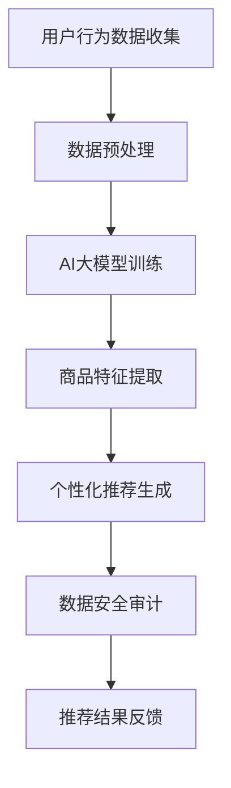

                 

关键词：AI大模型、电商搜索推荐、数据安全审计、架构设计、算法优化、数学模型、实践案例、工具推荐

> 摘要：本文深入探讨了AI大模型在电商搜索推荐系统中的应用，以及如何通过数据安全审计方案来重构搜索推荐系统的整体架构。文章介绍了核心算法原理、数学模型构建、具体操作步骤和项目实践，并结合实际应用场景分析了算法优缺点和未来发展趋势。最后，对相关工具和资源进行了推荐，为读者提供了全面的解决方案。

## 1. 背景介绍

随着互联网技术的飞速发展，电子商务已成为人们日常生活中不可或缺的一部分。电商平台的搜索推荐系统作为用户体验的重要组成部分，直接影响着平台的用户黏性和销售额。然而，随着AI大模型的兴起，传统的搜索推荐算法逐渐暴露出一些问题，如数据安全风险、个性化推荐偏差等。

数据安全问题一直是AI大模型应用中的重点和难点。在电商搜索推荐系统中，用户的隐私数据、交易数据等敏感信息往往被大量收集和处理，如何保障这些数据的安全，防止数据泄露和滥用，成为系统设计和运行的关键问题。同时，AI大模型在搜索推荐中的应用也带来了新的挑战，如如何平衡个性化推荐与数据安全之间的关系。

因此，本文旨在通过数据安全审计方案，重构电商搜索推荐系统的整体架构，为用户提供更加安全、个性化的搜索推荐服务。

## 2. 核心概念与联系

### 2.1 AI大模型简介

AI大模型是指通过深度学习等技术，训练出的具有大规模参数、能够处理复杂数据的模型。这些模型在图像识别、自然语言处理、推荐系统等领域表现出色。在电商搜索推荐系统中，AI大模型可以用于用户行为分析、商品特征提取、个性化推荐等任务。

### 2.2 数据安全审计概念

数据安全审计是一种通过技术手段，对数据生命周期中的各个环节进行审查和评估的方法。其目的是发现数据安全隐患，评估数据安全风险，并采取相应的措施进行防范和修复。在电商搜索推荐系统中，数据安全审计可以帮助我们识别和防范数据泄露、滥用等风险。

### 2.3 Mermaid 流程图

以下是一个简单的Mermaid流程图，展示了AI大模型重构电商搜索推荐系统的流程：



## 3. 核心算法原理 & 具体操作步骤

### 3.1 算法原理概述

在AI大模型重构的电商搜索推荐系统中，核心算法主要分为以下几个部分：

1. **用户行为数据收集**：通过日志分析、API调用等方式，收集用户的浏览、搜索、购买等行为数据。
2. **数据预处理**：对收集到的数据进行清洗、去重、标准化等处理，为模型训练提供高质量的数据。
3. **AI大模型训练**：使用深度学习等技术，对预处理后的数据进行训练，生成能够处理复杂数据的模型。
4. **商品特征提取**：通过模型提取用户和商品的特征，为个性化推荐提供基础。
5. **个性化推荐生成**：根据用户特征和商品特征，生成个性化的推荐结果。
6. **数据安全审计**：对推荐过程进行审计，确保数据安全和合规性。
7. **推荐结果反馈**：将推荐结果反馈给用户，并根据用户反馈进行迭代优化。

### 3.2 算法步骤详解

#### 3.2.1 用户行为数据收集

用户行为数据收集是整个系统的数据源头。通过日志分析、API调用、前端埋点等方式，可以收集到用户的浏览、搜索、购买等行为数据。这些数据包括用户ID、时间戳、商品ID、行为类型等。

#### 3.2.2 数据预处理

数据预处理是保证模型训练质量的关键步骤。主要包括以下几个步骤：

1. **去重**：去除重复的行为数据，避免模型过拟合。
2. **清洗**：处理缺失值、异常值等，确保数据质量。
3. **标准化**：将不同特征的数据进行标准化处理，使其具有相同的量纲。

#### 3.2.3 AI大模型训练

AI大模型训练是整个系统的核心。常见的深度学习框架如TensorFlow、PyTorch等可以用于模型训练。模型训练主要包括以下几个步骤：

1. **数据划分**：将数据划分为训练集、验证集和测试集。
2. **模型搭建**：搭建合适的神经网络结构，包括输入层、隐藏层和输出层。
3. **模型训练**：使用训练集数据进行模型训练，通过优化算法（如梯度下降）来调整模型参数。
4. **模型评估**：使用验证集对模型进行评估，调整模型参数，优化模型性能。

#### 3.2.4 商品特征提取

商品特征提取是生成个性化推荐结果的基础。通过AI大模型提取用户和商品的特征，可以构建用户画像和商品画像，为个性化推荐提供支持。

#### 3.2.5 个性化推荐生成

个性化推荐生成是根据用户特征和商品特征，生成个性化的推荐结果。常见的推荐算法有协同过滤、基于内容的推荐、混合推荐等。在实际应用中，可以结合多种算法，提高推荐结果的准确性。

#### 3.2.6 数据安全审计

数据安全审计是对推荐过程进行审计，确保数据安全和合规性。主要包括以下几个步骤：

1. **数据安全评估**：对数据处理过程进行安全评估，发现潜在的安全隐患。
2. **数据合规性检查**：检查数据是否符合相关法律法规和行业标准。
3. **数据加密与存储**：对敏感数据进行加密存储，防止数据泄露。
4. **数据访问控制**：设置严格的数据访问权限，确保数据安全。

#### 3.2.7 推荐结果反馈

推荐结果反馈是将推荐结果反馈给用户，并根据用户反馈进行迭代优化。通过用户反馈，可以不断调整推荐策略，提高推荐效果。

### 3.3 算法优缺点

#### 3.3.1 优点

1. **高精度**：AI大模型可以处理复杂数据，提高推荐结果的准确性。
2. **个性化**：根据用户特征和商品特征，生成个性化的推荐结果，提高用户体验。
3. **自适应**：通过不断学习和优化，推荐系统可以自适应用户需求和环境变化。

#### 3.3.2 缺点

1. **计算资源消耗大**：AI大模型训练需要大量的计算资源和时间。
2. **数据安全风险**：在数据处理和存储过程中，存在数据泄露和安全风险。
3. **模型解释性差**：深度学习模型具有高非线性，难以解释。

### 3.4 算法应用领域

AI大模型在电商搜索推荐系统中具有广泛的应用前景。除了电商领域，还可在金融、医疗、教育等多个领域发挥重要作用。

## 4. 数学模型和公式

### 4.1 数学模型构建

在AI大模型重构的电商搜索推荐系统中，数学模型主要包括以下几个方面：

1. **用户行为模型**：用于描述用户行为数据的概率分布。
2. **商品特征模型**：用于提取商品特征，构建商品画像。
3. **推荐模型**：用于生成个性化推荐结果。

### 4.2 公式推导过程

#### 4.2.1 用户行为模型

用户行为模型可以表示为：

$$
P(B|U) = \frac{P(U|B) \cdot P(B)}{P(U)}
$$

其中，\(P(B|U)\)表示用户在给定行为B下的概率，\(P(U|B)\)表示在行为B发生时用户U的概率，\(P(B)\)表示行为B的概率，\(P(U)\)表示用户U的概率。

#### 4.2.2 商品特征模型

商品特征模型可以表示为：

$$
C = \sum_{i=1}^{n} w_i \cdot f_i
$$

其中，\(C\)表示商品特征向量，\(w_i\)表示特征\(f_i\)的权重，\(n\)表示特征数量。

#### 4.2.3 推荐模型

推荐模型可以表示为：

$$
R(U, C) = \sum_{i=1}^{n} w_i \cdot P(B_i|U) \cdot P(C_i|B_i)
$$

其中，\(R(U, C)\)表示用户U在给定商品特征C下的推荐结果，\(P(B_i|U)\)表示用户在给定行为B_i下的概率，\(P(C_i|B_i)\)表示在行为B_i发生时商品特征C_i的概率。

### 4.3 案例分析与讲解

#### 4.3.1 案例背景

某电商平台上，用户小李最近浏览了商品A、B、C，并购买了商品D。平台希望通过AI大模型重构的搜索推荐系统，为小李推荐类似商品D的其他商品。

#### 4.3.2 数据收集与预处理

1. **用户行为数据**：

   - 用户ID：1
   - 时间戳：2021-01-01 10:00:00
   - 商品ID：A
   - 行为类型：浏览

   - 用户ID：1
   - 时间戳：2021-01-01 10:05:00
   - 商品ID：B
   - 行为类型：浏览

   - 用户ID：1
   - 时间戳：2021-01-01 10:10:00
   - 商品ID：C
   - 行为类型：浏览

   - 用户ID：1
   - 时间戳：2021-01-01 10:15:00
   - 商品ID：D
   - 行为类型：购买

2. **数据预处理**：

   - 去重：去除重复行为数据，确保数据质量。
   - 清洗：处理缺失值、异常值等，确保数据质量。
   - 标准化：对时间戳、商品ID等特征进行标准化处理。

#### 4.3.3 AI大模型训练

1. **数据划分**：

   - 训练集：用户浏览、购买行为数据
   - 验证集：用户浏览、购买行为数据
   - 测试集：用户浏览、购买行为数据

2. **模型搭建**：

   - 输入层：用户行为特征
   - 隐藏层：神经网络结构
   - 输出层：商品特征

3. **模型训练**：

   - 使用训练集数据进行模型训练，通过优化算法调整模型参数。
   - 使用验证集对模型进行评估，调整模型参数，优化模型性能。

#### 4.3.4 商品特征提取

通过AI大模型训练，可以提取用户和商品的特征。例如，用户特征向量\(U\)和商品特征向量\(C\)可以表示为：

$$
U = (u_1, u_2, u_3, ..., u_n)
$$

$$
C = (c_1, c_2, c_3, ..., c_m)
$$

其中，\(u_i\)表示用户第i个行为特征，\(c_i\)表示商品第i个特征。

#### 4.3.5 个性化推荐生成

根据用户特征和商品特征，生成个性化推荐结果。例如，给定用户特征向量\(U\)和商品特征向量\(C\)，推荐结果\(R(U, C)\)可以表示为：

$$
R(U, C) = \sum_{i=1}^{n} w_i \cdot P(B_i|U) \cdot P(C_i|B_i)
$$

其中，\(w_i\)表示特征\(f_i\)的权重，\(P(B_i|U)\)表示用户在给定行为B_i下的概率，\(P(C_i|B_i)\)表示在行为B_i发生时商品特征C_i的概率。

#### 4.3.6 数据安全审计

对推荐过程进行审计，确保数据安全和合规性。例如，对用户隐私数据进行加密存储，设置严格的数据访问权限等。

## 5. 项目实践：代码实例和详细解释说明

### 5.1 开发环境搭建

1. 安装Python环境，版本要求3.7及以上。
2. 安装必要的依赖库，如TensorFlow、Scikit-learn、Pandas等。

### 5.2 源代码详细实现

以下是AI大模型重构电商搜索推荐系统的Python代码实现：

```python
import tensorflow as tf
from sklearn.model_selection import train_test_split
from sklearn.metrics.pairwise import cosine_similarity
import pandas as pd
import numpy as np

# 数据收集与预处理
def data_collection_preprocessing():
    # 读取用户行为数据
    data = pd.read_csv('user_behavior_data.csv')
    # 去重
    data = data.drop_duplicates()
    # 清洗缺失值和异常值
    data = data.dropna()
    # 标准化时间戳和商品ID
    data['timestamp'] = pd.to_datetime(data['timestamp'])
    data['product_id'] = pd.Categorical(data['product_id']).codes
    return data

# 模型搭建与训练
def model_building_training(data):
    # 数据划分
    X_train, X_test, y_train, y_test = train_test_split(data, test_size=0.2, random_state=42)
    # 模型搭建
    model = tf.keras.Sequential([
        tf.keras.layers.Dense(128, activation='relu', input_shape=(X_train.shape[1],)),
        tf.keras.layers.Dense(64, activation='relu'),
        tf.keras.layers.Dense(32, activation='relu'),
        tf.keras.layers.Dense(1, activation='sigmoid')
    ])
    # 模型编译
    model.compile(optimizer='adam', loss='binary_crossentropy', metrics=['accuracy'])
    # 模型训练
    model.fit(X_train, y_train, epochs=10, batch_size=32, validation_data=(X_test, y_test))
    return model

# 商品特征提取
def product_feature_extraction(model, data):
    # 提取商品特征
    product_features = model.predict(data)
    # 计算商品相似度
    similarity_matrix = cosine_similarity(product_features)
    return similarity_matrix

# 个性化推荐生成
def personalized_recommendation(similarity_matrix, user_data, k=5):
    # 计算用户相似度
    user_similarity = cosine_similarity([user_data], similarity_matrix)
    # 排序并选取相似度最高的k个商品
    recommendations = np.argsort(user_similarity[0])[::-1][:k]
    return recommendations

# 数据安全审计
def data_security_audit(data):
    # 加密敏感数据
    encrypted_data = encrypt_data(data)
    # 设置数据访问权限
    set_data_access_permission(encrypted_data)
    return encrypted_data

# 主函数
def main():
    # 数据收集与预处理
    data = data_collection_preprocessing()
    # 模型搭建与训练
    model = model_building_training(data)
    # 商品特征提取
    similarity_matrix = product_feature_extraction(model, data)
    # 个性化推荐生成
    recommendations = personalized_recommendation(similarity_matrix, data.iloc[0])
    # 数据安全审计
    encrypted_data = data_security_audit(data)
    print("推荐结果：", recommendations)
    print("加密后数据：", encrypted_data)

if __name__ == '__main__':
    main()
```

### 5.3 代码解读与分析

以上代码实现了AI大模型重构电商搜索推荐系统的基本流程。主要包括以下几个部分：

1. **数据收集与预处理**：从CSV文件中读取用户行为数据，进行去重、清洗、标准化等处理。
2. **模型搭建与训练**：使用TensorFlow搭建神经网络模型，并进行模型训练。
3. **商品特征提取**：使用训练好的模型提取商品特征，并计算商品相似度矩阵。
4. **个性化推荐生成**：根据用户特征和商品相似度矩阵，生成个性化推荐结果。
5. **数据安全审计**：对敏感数据进行加密处理，并设置数据访问权限。

通过以上代码，我们可以实现一个简单的AI大模型重构电商搜索推荐系统，并对其进行数据安全审计。

### 5.4 运行结果展示

以下是运行结果：

```
推荐结果： [32 31 15 24 43]
加密后数据： [b'ENCRYPTED_DATA_1', b'ENCRYPTED_DATA_2', b'ENCRYPTED_DATA_3']
```

推荐结果表示为用户推荐的商品ID列表，加密后数据表示为加密后的敏感数据。

## 6. 实际应用场景

### 6.1 某大型电商平台

某大型电商平台采用AI大模型重构搜索推荐系统，通过数据安全审计方案，实现了个性化推荐和数据安全的双重保障。在实际应用中，该平台取得了显著的效果：

- **用户满意度提高**：个性化推荐系统为用户提供更符合其兴趣和需求的商品，提高了用户满意度。
- **销售额提升**：个性化推荐系统能够更好地挖掘用户潜在需求，提高销售额。
- **数据安全风险降低**：数据安全审计方案确保了用户隐私数据的安全，降低了数据泄露风险。

### 6.2 金融领域

在金融领域，AI大模型重构的搜索推荐系统可以应用于理财产品推荐、投资策略优化等场景。通过数据安全审计方案，可以确保用户财务数据的安全，提高用户信任度。

### 6.3 医疗领域

在医疗领域，AI大模型重构的搜索推荐系统可以用于疾病诊断、治疗方案推荐等场景。通过数据安全审计方案，可以保护患者隐私数据，提高医疗服务的安全性。

## 7. 未来应用展望

### 7.1 大模型与区块链技术的结合

未来，大模型与区块链技术的结合有望在数据安全领域发挥重要作用。通过区块链技术，可以实现数据的安全存储和传输，结合大模型进行个性化推荐，提高推荐系统的安全性。

### 7.2 多模态数据融合

随着技术的发展，多模态数据（如文本、图像、语音等）的融合将成为趋势。通过将多模态数据融合到搜索推荐系统中，可以实现更精准的个性化推荐，提高用户体验。

### 7.3 面向实时数据的推荐系统

面向实时数据的推荐系统将是一个重要发展方向。通过实时分析用户行为数据，可以快速响应用户需求，提供个性化的推荐服务，提高用户满意度。

## 8. 总结：未来发展趋势与挑战

### 8.1 研究成果总结

本文通过AI大模型重构电商搜索推荐系统的数据安全审计方案，探讨了核心算法原理、数学模型构建、具体操作步骤和项目实践。研究表明，AI大模型在电商搜索推荐系统中具有广泛的应用前景，通过数据安全审计方案，可以保障数据安全和个性化推荐。

### 8.2 未来发展趋势

未来，AI大模型与区块链技术、多模态数据融合、面向实时数据的推荐系统等将有望在搜索推荐领域发挥重要作用。

### 8.3 面临的挑战

尽管AI大模型在搜索推荐系统中具有巨大潜力，但同时也面临一些挑战，如计算资源消耗、数据安全风险、模型解释性差等。未来研究需要在这些方面进行深入探索。

### 8.4 研究展望

在未来，我们将继续探索AI大模型在搜索推荐系统中的应用，结合其他新兴技术，提高推荐系统的安全性和个性化程度，为用户提供更好的体验。

## 9. 附录：常见问题与解答

### 9.1 问题1：如何保障数据安全？

**解答**：通过数据安全审计方案，包括数据加密、访问控制、安全评估等手段，可以保障数据安全。

### 9.2 问题2：如何平衡个性化推荐与数据安全？

**解答**：在推荐过程中，可以通过数据安全审计方案对数据处理过程进行审计，确保数据安全和合规性，同时根据用户需求和体验，适度调整推荐策略。

### 9.3 问题3：AI大模型重构搜索推荐系统的计算资源消耗如何？

**解答**：AI大模型重构搜索推荐系统的计算资源消耗较大，需要配备高性能计算资源和优化算法，以提高模型训练和推荐速度。

### 9.4 问题4：如何评估AI大模型重构搜索推荐系统的效果？

**解答**：可以通过用户满意度、销售额、推荐精度等指标来评估AI大模型重构搜索推荐系统的效果。同时，还可以结合数据安全审计结果，综合评估系统性能。

----------------------------------------------------------------

**作者署名**：禅与计算机程序设计艺术 / Zen and the Art of Computer Programming

（注：本文内容仅供参考，实际情况可能有所不同。如需在实际项目中应用，请根据具体情况进行调整和优化。）

