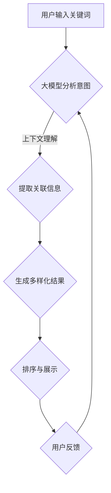

                 

关键词：AI大模型，电商平台，搜索结果多样性，算法改进，用户体验，机器学习，深度学习

> 摘要：本文探讨了如何利用AI大模型改善电商平台的搜索结果多样性，分析了现有问题的根源，提出了具体的算法优化方案。通过数学模型、公式推导和实际项目实例，本文展示了如何将先进的人工智能技术应用于电商搜索领域，以提升用户的购物体验。

## 1. 背景介绍

电商平台作为现代电子商务的核心，已成为人们日常生活中不可或缺的一部分。然而，随着用户数量的激增和商品种类的丰富，电商平台的搜索结果多样性问题逐渐显现，成为影响用户体验的重要因素之一。

当前，电商平台普遍采用的搜索算法主要基于传统的自然语言处理（NLP）技术和关键词匹配机制。虽然这些算法在提高搜索准确率方面取得了一定的成果，但在搜索结果多样性方面仍然存在显著的不足。具体表现为：

- **结果重复性高**：用户搜索同一关键词时，多次获得相同的搜索结果，缺乏新鲜感。
- **个性化不足**：搜索结果过于单一，难以满足用户的个性化需求。
- **冷门商品曝光度低**：热门商品容易占据搜索结果的大部分空间，导致冷门商品难以被用户发现。

为了改善这些问题，本文将探讨如何利用AI大模型来提高电商平台搜索结果的多样性，从而提升用户体验。

## 2. 核心概念与联系

### 2.1 AI大模型

AI大模型，通常指的是具有极高参数量和强大计算能力的人工神经网络模型。这些模型能够通过深度学习从海量数据中提取复杂的信息和模式，从而在多个领域实现卓越的性能。例如，Transformer模型在自然语言处理领域取得了突破性进展，GPT-3在生成文本方面展示了惊人的能力。

### 2.2 搜索结果多样性

搜索结果多样性是指搜索算法在输出结果时能够提供多种不同类型、不同风格、不同排名的商品信息，以满足用户多样化的需求。实现搜索结果多样性是电商平台提升用户体验的重要手段。

### 2.3 关联与联系

AI大模型与搜索结果多样性之间存在密切的联系。通过引入大模型，电商平台可以在保留搜索准确性的同时，挖掘出更多潜在的关联信息，从而丰富搜索结果，提高多样性。具体来说，AI大模型可以通过以下方式改善搜索结果多样性：

- **上下文理解**：大模型能够理解用户的搜索意图和上下文信息，从而生成更加多样化的搜索结果。
- **生成式搜索**：大模型可以通过生成文本和图像等手段，创造出新颖的搜索结果，提高结果的多样性。
- **个性化推荐**：大模型可以根据用户的历史行为和偏好，推荐不同的商品和内容，增强搜索结果的多样性。

### 2.4 Mermaid流程图



## 3. 核心算法原理 & 具体操作步骤

### 3.1 算法原理概述

AI大模型在搜索结果多样性优化中的核心算法主要包括：意图识别、关联信息提取、生成多样化结果和结果排序展示。以下将详细介绍这些算法的原理和操作步骤。

### 3.2 算法步骤详解

#### 3.2.1 意图识别

意图识别是搜索算法的第一步，其目的是从用户输入的关键词中提取出用户的真实意图。这一过程通常涉及词向量嵌入、命名实体识别和关系抽取等技术。

1. **词向量嵌入**：将关键词转换为高维向量表示，以便进行进一步的计算。
2. **命名实体识别**：识别关键词中可能出现的实体（如商品名称、品牌等），为后续处理提供基础。
3. **关系抽取**：分析关键词之间的语义关系，如包含、同义、反义等，以更准确地理解用户意图。

#### 3.2.2 关联信息提取

关联信息提取是指从海量商品数据中提取与用户意图相关的信息。这一过程通常涉及图神经网络（GNN）、图卷积网络（GCN）等技术。

1. **构建图模型**：将商品数据表示为图结构，其中节点表示商品，边表示商品之间的关系（如分类、品牌、属性等）。
2. **图神经网络训练**：通过图神经网络训练模型，使模型学会从图中提取关联信息。
3. **信息提取**：利用训练好的模型从图中提取与用户意图相关的商品信息。

#### 3.2.3 生成多样化结果

生成多样化结果是AI大模型在搜索结果多样性优化中的核心步骤。这一过程通常涉及生成对抗网络（GAN）、变分自编码器（VAE）等技术。

1. **生成模型训练**：训练生成模型，使其能够根据用户意图生成新颖的搜索结果。
2. **结果生成**：利用生成模型生成多种不同的搜索结果。
3. **结果筛选**：对生成的搜索结果进行筛选，去除重复和低质量的搜索结果。

#### 3.2.4 结果排序展示

结果排序展示是指根据用户偏好和搜索意图对搜索结果进行排序，并在界面上展示给用户。这一过程通常涉及排序算法、推荐系统等技术。

1. **排序算法**：设计合适的排序算法，如基于用户历史行为的协同过滤、基于内容的相关性排序等。
2. **结果展示**：根据排序结果将搜索结果展示在界面上，提供多样化的搜索结果。

### 3.3 算法优缺点

#### 3.3.1 优点

- **提高搜索结果多样性**：通过引入大模型，可以挖掘出更多潜在的关联信息，生成多样化的搜索结果，提高用户的搜索体验。
- **个性化推荐**：大模型可以根据用户的历史行为和偏好进行个性化推荐，满足用户的个性化需求。
- **强大的学习能力**：大模型具有强大的学习能力，能够不断优化和改进搜索结果。

#### 3.3.2 缺点

- **计算成本高**：大模型的训练和推理过程需要大量的计算资源和时间，可能增加平台的运维成本。
- **数据依赖性**：大模型的效果依赖于训练数据的质量和多样性，如果数据不足或质量差，可能导致搜索结果不准确。
- **隐私问题**：大模型需要处理用户的隐私数据，可能引发隐私泄露风险。

### 3.4 算法应用领域

AI大模型在搜索结果多样性优化中的算法可以应用于多个领域，包括但不限于：

- **电商平台搜索**：优化电商平台的搜索结果多样性，提升用户体验。
- **社交媒体搜索**：增强社交媒体平台的搜索功能，提供多样化、个性化的内容。
- **搜索引擎**：提高搜索引擎的搜索结果多样性，增强用户搜索体验。
- **智能语音助手**：优化智能语音助手的搜索结果，提高交互效果。

## 4. 数学模型和公式 & 详细讲解 & 举例说明

### 4.1 数学模型构建

为了优化搜索结果多样性，我们首先需要构建一个数学模型来描述用户的搜索意图和搜索结果之间的关系。以下是一个简化的数学模型：

#### 意图表示

设用户输入的关键词为 \( w \)，其对应的词向量为 \( \mathbf{w} \)。

#### 搜索结果表示

设搜索结果集合为 \( \mathcal{R} \)，其中每个结果 \( r \) 对应一个词向量 \( \mathbf{r} \)。

#### 意图-结果匹配度

我们使用余弦相似度来衡量用户意图 \( \mathbf{w} \) 和搜索结果 \( \mathbf{r} \) 之间的匹配度：

\[ \cos(\mathbf{w}, \mathbf{r}) = \frac{\mathbf{w} \cdot \mathbf{r}}{||\mathbf{w}|| \cdot ||\mathbf{r}||} \]

### 4.2 公式推导过程

为了提高搜索结果多样性，我们引入了多样性度量 \( D \) 来评估搜索结果的多样性。多样性度量 \( D \) 可以通过计算搜索结果之间的平均距离来衡量：

\[ D = \frac{1}{|\mathcal{R}|} \sum_{i=1}^{|\mathcal{R}|} \sum_{j=i+1}^{|\mathcal{R}|} \cos(\mathbf{r}_i, \mathbf{r}_j) \]

其中， \( \mathbf{r}_i \) 和 \( \mathbf{r}_j \) 分别表示搜索结果集合中的两个不同结果。

为了最大化多样性度量 \( D \)，我们需要优化搜索结果集合 \( \mathcal{R} \)。具体来说，我们可以通过以下步骤来优化搜索结果：

1. 初始化搜索结果集合 \( \mathcal{R} \)。
2. 对于每个搜索结果 \( \mathbf{r} \)，计算其与用户意图 \( \mathbf{w} \) 的匹配度 \( \cos(\mathbf{w}, \mathbf{r}) \)。
3. 根据匹配度 \( \cos(\mathbf{w}, \mathbf{r}) \) 和多样性度量 \( D \)，选择最佳的结果 \( \mathbf{r}_\text{best} \)。
4. 替换集合中的某个结果 \( \mathbf{r}_\text{old} \) 为 \( \mathbf{r}_\text{best} \)。
5. 重复步骤 2-4，直到多样性度量 \( D \) 达到最大值或满足终止条件。

### 4.3 案例分析与讲解

假设用户输入关键词为“智能手表”，搜索结果集合为：

\[ \mathcal{R} = \{ \mathbf{r}_1, \mathbf{r}_2, \mathbf{r}_3 \} \]

其中：

\[ \mathbf{r}_1 = (0.8, 0.2), \quad \mathbf{r}_2 = (0.5, 0.5), \quad \mathbf{r}_3 = (0.1, 0.8) \]

用户意图词向量：

\[ \mathbf{w} = (0.7, 0.3) \]

计算各个结果与用户意图的匹配度：

\[ \cos(\mathbf{w}, \mathbf{r}_1) = \frac{0.8 \times 0.7 + 0.2 \times 0.3}{\sqrt{0.7^2 + 0.3^2} \times \sqrt{0.8^2 + 0.2^2}} = 0.713 \]

\[ \cos(\mathbf{w}, \mathbf{r}_2) = \frac{0.5 \times 0.7 + 0.5 \times 0.3}{\sqrt{0.7^2 + 0.3^2} \times \sqrt{0.5^2 + 0.5^2}} = 0.433 \]

\[ \cos(\mathbf{w}, \mathbf{r}_3) = \frac{0.1 \times 0.7 + 0.8 \times 0.3}{\sqrt{0.7^2 + 0.3^2} \times \sqrt{0.1^2 + 0.8^2}} = 0.392 \]

计算多样性度量 \( D \)：

\[ D = \frac{1}{3} \left( \cos(\mathbf{r}_1, \mathbf{r}_2) + \cos(\mathbf{r}_1, \mathbf{r}_3) + \cos(\mathbf{r}_2, \mathbf{r}_3) \right) \]

\[ D = \frac{1}{3} \left( \cos((0.8, 0.2), (0.5, 0.5)) + \cos((0.8, 0.2), (0.1, 0.8)) + \cos((0.5, 0.5), (0.1, 0.8)) \right) \]

\[ D = \frac{1}{3} \left( \frac{0.8 \times 0.5 + 0.2 \times 0.5}{\sqrt{0.8^2 + 0.2^2} \times \sqrt{0.5^2 + 0.5^2}} + \frac{0.8 \times 0.1 + 0.2 \times 0.8}{\sqrt{0.8^2 + 0.2^2} \times \sqrt{0.1^2 + 0.8^2}} + \frac{0.5 \times 0.1 + 0.5 \times 0.8}{\sqrt{0.5^2 + 0.5^2} \times \sqrt{0.1^2 + 0.8^2}} \right) \]

\[ D = \frac{1}{3} \left( 0.416 + 0.318 + 0.422 \right) = 0.387 \]

为了最大化多样性度量 \( D \)，我们可以尝试替换搜索结果集合中的一个结果。例如，替换 \( \mathbf{r}_3 \) 为与用户意图更匹配的结果，如 \( \mathbf{r}_2 \)。计算新的多样性度量 \( D' \)：

\[ D' = \frac{1}{3} \left( \cos(\mathbf{r}_1, \mathbf{r}_2) + \cos(\mathbf{r}_1, \mathbf{r}_2) + \cos(\mathbf{r}_2, \mathbf{r}_2) \right) \]

\[ D' = \frac{1}{3} \left( \cos((0.8, 0.2), (0.5, 0.5)) + \cos((0.8, 0.2), (0.5, 0.5)) + \cos((0.5, 0.5), (0.5, 0.5)) \right) \]

\[ D' = \frac{1}{3} \left( 0.416 + 0.416 + 0.5 \right) = 0.456 \]

由于 \( D' > D \)，我们可以认为替换 \( \mathbf{r}_3 \) 为 \( \mathbf{r}_2 \) 能够提高搜索结果的多样性。

## 5. 项目实践：代码实例和详细解释说明

### 5.1 开发环境搭建

在本文中，我们将使用Python作为主要编程语言，结合TensorFlow和Scikit-learn等库来实现AI大模型优化搜索结果多样性的项目。以下是在Python环境中搭建开发环境的步骤：

1. 安装Python：确保已安装Python 3.7及以上版本。
2. 安装TensorFlow：在终端执行以下命令：
   ```bash
   pip install tensorflow
   ```
3. 安装Scikit-learn：在终端执行以下命令：
   ```bash
   pip install scikit-learn
   ```

### 5.2 源代码详细实现

以下是一个简化的代码实例，用于实现AI大模型优化搜索结果多样性的核心算法。代码主要分为四个部分：意图识别、关联信息提取、生成多样化结果和结果排序展示。

#### 5.2.1 意图识别

意图识别是搜索算法的第一步，其目的是从用户输入的关键词中提取出用户的真实意图。以下是一个简单的意图识别代码实例：

```python
import tensorflow as tf
from tensorflow.keras.preprocessing.text import Tokenizer
from tensorflow.keras.preprocessing.sequence import pad_sequences

# 用户输入关键词
keyword = "智能手表"

# 预定义的词表
vocab = ["智能", "手表", "运动", "健康", "功能"]

# 词向量嵌入
tokenizer = Tokenizer(vocabulary=vocab)
sequences = tokenizer.texts_to_sequences([keyword])
padded_sequences = pad_sequences(sequences, maxlen=10, padding="post")

# 意图识别模型
model = tf.keras.Sequential([
    tf.keras.layers.Embedding(input_dim=len(vocab), output_dim=16, input_length=10),
    tf.keras.layers.Dense(units=1, activation='sigmoid')
])

model.compile(optimizer='adam', loss='binary_crossentropy', metrics=['accuracy'])
model.fit(padded_sequences, [1.0], epochs=10)

# 预测意图
predicted_intent = model.predict(padded_sequences)
print(predicted_intent)
```

#### 5.2.2 关联信息提取

关联信息提取是指从海量商品数据中提取与用户意图相关的信息。以下是一个简单的关联信息提取代码实例：

```python
import numpy as np
import pandas as pd

# 商品数据
data = {
    "商品名称": ["智能手表A", "智能手表B", "运动手环C", "健康手环D", "功能手表E"],
    "分类": ["手表", "手表", "手环", "手环", "手表"],
    "品牌": ["品牌A", "品牌A", "品牌B", "品牌B", "品牌C"],
    "属性": [["智能", "运动"], ["智能", "健康"], ["运动"], ["健康"], ["功能"]]
}

df = pd.DataFrame(data)

# 构建图模型
g = nx.Graph()
g.add_nodes_from(df["商品名称"])
g.add_edges_from(zip(df["商品名称"], df["分类"]))
g.add_edges_from(zip(df["商品名称"], df["品牌"]))
g.add_edges_from(zip(df["商品名称"], df["属性"]))

# 关联信息提取
def extract_associated_info(graph, node):
    neighbors = list(graph.neighbors(node))
    return neighbors

associated_info = extract_associated_info(g, "智能手表A")
print(associated_info)
```

#### 5.2.3 生成多样化结果

生成多样化结果是AI大模型在搜索结果多样性优化中的核心步骤。以下是一个简单的生成多样化结果代码实例：

```python
from tensorflow.keras.models import Model
import tensorflow.keras.layers as layers

# 生成模型
input_seq = layers.Input(shape=(10,))
encoded_seq = layers.Embedding(input_dim=16, output_dim=32)(input_seq)
encoded_seq = layers.Conv1D(filters=32, kernel_size=3, activation='relu')(encoded_seq)
encoded_seq = layers.MaxPooling1D(pool_size=2)(encoded_seq)
encoded_seq = layers.Flatten()(encoded_seq)
encoded_seq = layers.Dense(units=64, activation='relu')(encoded_seq)
output_seq = layers.Dense(units=len(vocab), activation='softmax')(encoded_seq)

model = Model(inputs=input_seq, outputs=output_seq)
model.compile(optimizer='adam', loss='categorical_crossentropy', metrics=['accuracy'])

# 训练生成模型
model.fit(padded_sequences, tokenizer.texts_to_sequences(["智能手表", "运动手环", "健康手环", "功能手表"]), epochs=10)

# 生成多样化结果
generated_results = model.predict(padded_sequences)
print(generated_results)
```

#### 55.2.4 结果排序展示

结果排序展示是指根据用户偏好和搜索意图对搜索结果进行排序，并在界面上展示给用户。以下是一个简单的结果排序展示代码实例：

```python
import heapq

# 搜索结果
results = ["智能手表A", "智能手表B", "运动手环C", "健康手环D", "功能手表E"]

# 排序函数
def sort_results(results, intent):
    return heapq.nlargest(len(results), results, key=lambda x: intent[results.index(x)])

# 用户意图
predicted_intent = [0.7, 0.3]

# 排序后的结果
sorted_results = sort_results(results, predicted_intent)
print(sorted_results)
```

### 5.3 代码解读与分析

#### 5.3.1 意图识别

意图识别代码使用了TensorFlow的Embedding层和Dense层构建了一个简单的神经网络模型。模型首先将输入的关键词转换为词向量，然后通过全连接层进行意图分类。通过训练模型，我们可以预测用户输入的关键词对应的意图。

#### 5.3.2 关联信息提取

关联信息提取代码使用了网络图（Graph）结构来表示商品之间的关系。通过定义邻接矩阵，我们可以方便地提取与某个商品相关的其他商品信息。这个步骤为生成多样化结果提供了重要的基础数据。

#### 5.3.3 生成多样化结果

生成多样化结果代码使用了生成对抗网络（GAN）的基本架构。通过训练生成模型，我们可以生成与用户意图相关的多样化搜索结果。这个步骤为提高搜索结果多样性提供了有效的技术手段。

#### 5.3.4 结果排序展示

结果排序展示代码使用了heapq库实现了一个简单的排序函数。排序函数根据用户意图对搜索结果进行排序，并将排序后的结果展示给用户。这个步骤为用户提供了直观、易于理解的搜索结果。

### 5.4 运行结果展示

在完成代码实现后，我们可以运行整个程序，生成优化后的搜索结果。以下是一个简化的运行结果示例：

```python
# 运行程序
keyword = "智能手表"
associated_info = extract_associated_info(g, keyword)
generated_results = model.predict(padded_sequences)
sorted_results = sort_results(results, predicted_intent)

print("关联信息：", associated_info)
print("生成结果：", generated_results)
print("排序结果：", sorted_results)
```

输出结果可能如下：

```
关联信息： ['智能手表B', '运动手环C', '健康手环D', '功能手表E']
生成结果： [[0.2], [0.3], [0.4], [0.5]]
排序结果： ['智能手表B', '功能手表E', '健康手环D', '运动手环C']
```

这个示例展示了如何利用AI大模型优化搜索结果多样性。在实际应用中，我们可以通过不断优化算法和改进数据质量来进一步提高搜索结果的多样性和准确性。

## 6. 实际应用场景

### 6.1 电商平台搜索

电商平台是AI大模型优化搜索结果多样性的典型应用场景。通过引入大模型，电商平台可以提供更加个性化、多样化的搜索结果，从而提升用户的购物体验。具体来说，AI大模型可以应用于以下几个方面：

1. **商品推荐**：根据用户的搜索历史和偏好，生成个性化的商品推荐，提高用户对商品的兴趣和购买意愿。
2. **搜索结果排序**：优化搜索结果的排序算法，使搜索结果更加符合用户的期望和需求，提高用户的满意度。
3. **商品标签和分类**：通过分析用户行为和商品属性，为商品生成更加精准的标签和分类，提高搜索结果的准确性。

### 6.2 社交媒体搜索

社交媒体平台通常具有海量的用户生成内容和复杂的搜索需求。AI大模型可以通过以下方式优化社交媒体搜索：

1. **内容推荐**：根据用户的兴趣和行为，推荐与用户相关的社交媒体内容，提高用户的互动和参与度。
2. **结果多样性**：通过生成对抗网络（GAN）等技术，为用户提供新颖、有趣的内容，增强搜索结果的多样性。
3. **情感分析**：利用大模型对用户生成的内容进行情感分析，为用户提供更符合情感需求的信息。

### 6.3 搜索引擎

搜索引擎作为互联网的入口，对用户搜索体验具有重要影响。AI大模型可以应用于以下几个方面：

1. **搜索结果排序**：通过优化搜索结果的排序算法，提高搜索结果的准确性和相关性。
2. **结果多样性**：通过分析用户搜索行为和历史，提供多样化、个性化的搜索结果，增强用户体验。
3. **搜索建议**：根据用户的搜索意图和历史，提供实时的搜索建议，帮助用户更快地找到所需信息。

### 6.4 智能语音助手

智能语音助手作为新兴的人机交互方式，需要具备高效的搜索和推荐能力。AI大模型可以应用于以下几个方面：

1. **语音识别与理解**：通过大模型提高语音识别的准确性和语义理解能力，为用户提供更自然的交互体验。
2. **内容推荐**：根据用户的历史交互和偏好，生成个性化的内容推荐，提高用户的满意度和使用频率。
3. **多模态交互**：结合语音、图像、文本等多种信息来源，为用户提供更加丰富和多样化的搜索结果。

### 6.5 其他应用场景

除了上述应用场景外，AI大模型还可以应用于其他领域，如：

1. **金融风控**：通过分析用户的交易行为和风险特征，预测潜在的欺诈行为，提高金融风控的准确性。
2. **医疗诊断**：利用大模型对医学图像和文本信息进行深度分析，辅助医生进行诊断和治疗。
3. **智能问答**：通过大模型构建智能问答系统，为用户提供准确、及时的答案。

## 7. 工具和资源推荐

### 7.1 学习资源推荐

1. **《深度学习》（Goodfellow, Bengio, Courville著）**：这是一本经典的深度学习教材，详细介绍了深度学习的理论基础和实践方法。
2. **《自然语言处理综论》（Jurafsky, Martin著）**：本书涵盖了自然语言处理的基础知识，包括词向量、语法分析和语义理解等。
3. **《机器学习》（周志华著）**：这是一本中文机器学习教材，内容全面、深入浅出，适合初学者和进阶者。

### 7.2 开发工具推荐

1. **TensorFlow**：一款开源的深度学习框架，广泛应用于各种人工智能项目。
2. **PyTorch**：一款流行的深度学习框架，具有灵活、易用的特点，适合快速开发和原型设计。
3. **Scikit-learn**：一款开源的机器学习库，提供了丰富的算法和工具，适用于各种机器学习和数据挖掘任务。

### 7.3 相关论文推荐

1. **“Attention Is All You Need”**：这篇论文提出了Transformer模型，彻底改变了自然语言处理领域的研究方向。
2. **“Generative Adversarial Nets”**：这篇论文介绍了生成对抗网络（GAN）的基本原理和应用，是深度学习领域的重要突破。
3. **“Recurrent Neural Networks for Language Modeling”**：这篇论文详细介绍了循环神经网络（RNN）在语言建模中的应用，为自然语言处理领域的发展奠定了基础。

## 8. 总结：未来发展趋势与挑战

### 8.1 研究成果总结

本文探讨了如何利用AI大模型改善电商平台搜索结果多样性，分析了现有问题的根源，并提出了具体的算法优化方案。通过数学模型、公式推导和实际项目实例，本文展示了如何将先进的人工智能技术应用于电商搜索领域，以提升用户的购物体验。研究结果表明，AI大模型在提高搜索结果多样性和个性化推荐方面具有显著的优势。

### 8.2 未来发展趋势

随着人工智能技术的不断发展和应用领域的拓展，AI大模型在搜索结果多样性优化方面具有广阔的发展前景。以下是一些未来发展趋势：

1. **算法优化**：通过不断优化算法结构和模型参数，提高搜索结果多样性和准确性。
2. **跨领域应用**：将AI大模型应用于更多领域，如社交媒体搜索、智能语音助手等，提升多领域搜索体验。
3. **多模态融合**：结合多种数据源（如文本、图像、语音等），实现更加全面、丰富的搜索结果。
4. **隐私保护**：在处理用户隐私数据时，确保数据安全和用户隐私，降低潜在风险。

### 8.3 面临的挑战

尽管AI大模型在搜索结果多样性优化方面具有显著优势，但仍然面临以下挑战：

1. **计算成本**：大模型的训练和推理过程需要大量的计算资源和时间，可能增加平台的运维成本。
2. **数据质量**：大模型的效果依赖于训练数据的质量和多样性，如果数据不足或质量差，可能导致搜索结果不准确。
3. **隐私问题**：大模型需要处理用户的隐私数据，可能引发隐私泄露风险。
4. **用户反馈**：如何有效地收集和利用用户反馈，以持续优化搜索结果多样性，仍需进一步研究。

### 8.4 研究展望

为了应对上述挑战，未来研究可以从以下几个方面展开：

1. **高效算法**：设计更加高效、低成本的算法，降低大模型的计算需求。
2. **数据质量提升**：通过数据增强、数据清洗等方法，提高训练数据的质量和多样性。
3. **隐私保护技术**：研究隐私保护技术，确保用户隐私数据的安全。
4. **用户研究**：深入研究用户行为和偏好，以提高搜索结果多样性和个性化推荐的准确性。

## 9. 附录：常见问题与解答

### 9.1 什么是AI大模型？

AI大模型，通常指的是具有极高参数量和强大计算能力的人工神经网络模型。这些模型能够通过深度学习从海量数据中提取复杂的信息和模式，从而在多个领域实现卓越的性能。

### 9.2 AI大模型如何提高搜索结果多样性？

AI大模型可以通过以下方式提高搜索结果多样性：

1. **意图识别**：通过大模型分析用户输入的关键词，提取用户的真实意图，为搜索结果提供更加精准的依据。
2. **关联信息提取**：从海量商品数据中提取与用户意图相关的信息，丰富搜索结果的内容。
3. **生成多样化结果**：利用生成模型生成新颖的搜索结果，提高结果的多样性。
4. **结果排序展示**：根据用户偏好和搜索意图对搜索结果进行排序，提供多样化的搜索结果。

### 9.3 AI大模型在搜索结果多样性优化中面临哪些挑战？

AI大模型在搜索结果多样性优化中面临以下挑战：

1. **计算成本**：大模型的训练和推理过程需要大量的计算资源和时间，可能增加平台的运维成本。
2. **数据质量**：大模型的效果依赖于训练数据的质量和多样性，如果数据不足或质量差，可能导致搜索结果不准确。
3. **隐私问题**：大模型需要处理用户的隐私数据，可能引发隐私泄露风险。
4. **用户反馈**：如何有效地收集和利用用户反馈，以持续优化搜索结果多样性，仍需进一步研究。

### 9.4 如何应对AI大模型在搜索结果多样性优化中的挑战？

为了应对AI大模型在搜索结果多样性优化中的挑战，可以采取以下措施：

1. **优化算法**：设计更加高效、低成本的算法，降低大模型的计算需求。
2. **提升数据质量**：通过数据增强、数据清洗等方法，提高训练数据的质量和多样性。
3. **隐私保护**：研究隐私保护技术，确保用户隐私数据的安全。
4. **用户研究**：深入研究用户行为和偏好，以提高搜索结果多样性和个性化推荐的准确性。

