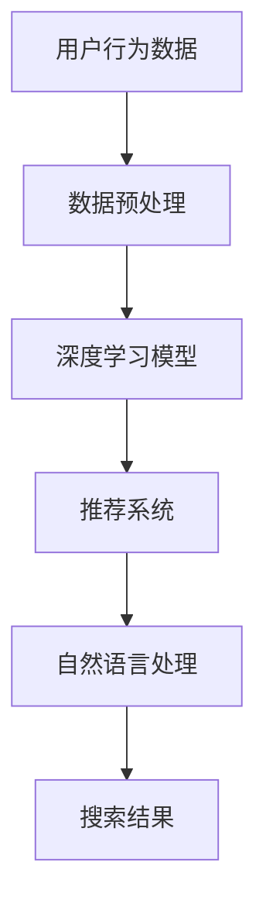

                 

关键词：人工智能、电商搜索、用户体验、转化率、算法优化、深度学习、推荐系统、搜索引擎优化

> 摘要：随着电商行业的高速发展，如何提升用户搜索导购的体验和转化率成为电商平台的关注焦点。本文将深入探讨人工智能技术在电商搜索导购中的应用，通过分析核心算法原理、数学模型构建，结合实际项目实践，为电商企业提供切实可行的提升策略。

## 1. 背景介绍

在互联网经济飞速发展的今天，电子商务已经成为零售业的重要组成部分。电商平台通过提供丰富的商品信息和便捷的购物体验，吸引了大量消费者。然而，随着商品种类和数量的激增，用户在寻找心仪商品时面临着越来越多的困扰。如何在海量商品中迅速找到合适的商品，成为了影响用户体验和转化率的关键因素。

传统的搜索导购系统主要依赖关键词匹配和简单的排序算法，往往难以满足用户日益复杂的搜索需求。而人工智能技术的发展，为电商搜索导购带来了新的机遇。通过应用深度学习、推荐系统等人工智能技术，电商平台可以提供更加个性化和精准的搜索导购服务，从而提升用户体验和转化率。

## 2. 核心概念与联系

在探讨人工智能如何助力电商搜索导购之前，我们首先需要理解几个核心概念，包括推荐系统、深度学习、自然语言处理等。以下是一个简单的Mermaid流程图，展示了这些概念之间的关系：



### 2.1 推荐系统

推荐系统是一种基于用户历史行为和兴趣信息，为用户推荐相关商品或内容的技术。在电商搜索导购中，推荐系统可以基于用户的浏览记录、购买行为、搜索关键词等数据，为用户推荐可能的感兴趣商品。推荐系统的核心是算法，常见的推荐算法包括基于协同过滤、基于内容过滤和混合推荐算法等。

### 2.2 深度学习模型

深度学习是人工智能的一个重要分支，它通过多层神经网络模型对数据进行建模，从而实现复杂特征提取和预测。在电商搜索导购中，深度学习模型可以用于用户画像构建、商品特征提取、搜索结果排序等任务。常见的深度学习模型包括卷积神经网络（CNN）、循环神经网络（RNN）和变压器模型（Transformer）等。

### 2.3 自然语言处理

自然语言处理（NLP）是使计算机理解和处理人类语言的技术。在电商搜索导购中，NLP可以用于关键词提取、语义理解、情感分析等任务，从而提高搜索导购的准确性和用户体验。常见的NLP技术包括词向量表示、语言模型、文本分类和实体识别等。

## 3. 核心算法原理 & 具体操作步骤

### 3.1 算法原理概述

在电商搜索导购中，核心算法主要包括推荐算法和搜索排序算法。推荐算法主要用于根据用户的历史行为和兴趣，为用户推荐相关商品；搜索排序算法则用于根据用户输入的关键词，从海量的商品中筛选出最相关的商品并进行排序。

#### 3.1.1 推荐算法

推荐算法的核心是预测用户对商品的偏好。常见的推荐算法包括：

1. **基于协同过滤的推荐算法**：协同过滤算法通过分析用户之间的相似度，将其他相似用户的偏好推荐给目标用户。协同过滤算法分为基于用户和基于物品两种类型。

2. **基于内容的推荐算法**：基于内容的推荐算法通过分析商品的属性和内容，将具有相似属性的物品推荐给用户。

3. **混合推荐算法**：混合推荐算法结合了协同过滤和基于内容的推荐算法的优点，旨在提高推荐的准确性。

#### 3.1.2 搜索排序算法

搜索排序算法的核心是确定商品的排序顺序。常见的搜索排序算法包括：

1. **基于频率的排序算法**：根据用户的历史搜索频率对商品进行排序。

2. **基于相关性的排序算法**：根据用户输入的关键词与商品的相关性对商品进行排序。

3. **基于机器学习的排序算法**：使用机器学习模型对商品进行排序，根据用户的历史行为和偏好进行预测。

### 3.2 算法步骤详解

#### 3.2.1 推荐算法步骤

1. **用户画像构建**：收集用户的历史行为数据，如浏览记录、购买记录、搜索关键词等，构建用户画像。

2. **商品特征提取**：收集商品的相关信息，如商品类别、品牌、价格等，进行特征提取。

3. **相似度计算**：计算用户之间的相似度和商品之间的相似度。

4. **推荐生成**：根据用户画像和商品特征，生成推荐列表。

5. **排序优化**：对推荐列表进行排序，提高推荐的准确性。

#### 3.2.2 搜索排序算法步骤

1. **关键词提取**：从用户输入的关键词中提取关键短语和关键词。

2. **相关性计算**：计算每个商品与关键词的相关性。

3. **排序**：根据商品的相关性对商品进行排序。

4. **展示**：将排序后的商品展示给用户。

### 3.3 算法优缺点

#### 3.3.1 推荐算法优缺点

- **优点**：
  - 提高用户搜索导购的准确性。
  - 提供个性化推荐，提升用户体验。
  - 帮助电商平台提高销售额。

- **缺点**：
  - 需要大量用户行为数据支持。
  - 可能导致用户过度依赖推荐系统，缺乏自主搜索能力。

#### 3.3.2 搜索排序算法优缺点

- **优点**：
  - 提高用户搜索效率，快速找到目标商品。
  - 通过相关性计算，提高搜索结果的相关性。

- **缺点**：
  - 可能忽略用户个性化需求。
  - 排序算法需要不断优化，以应对不断变化的市场需求。

### 3.4 算法应用领域

推荐算法和搜索排序算法在电商搜索导购中具有广泛的应用，除了电商行业，它们还可以应用于以下领域：

- **在线广告**：通过推荐系统为用户推荐相关广告，提高广告点击率。
- **社交媒体**：根据用户的行为和兴趣推荐相关内容和好友。
- **金融行业**：基于用户的行为和偏好进行金融产品推荐。

## 4. 数学模型和公式 & 详细讲解 & 举例说明

### 4.1 数学模型构建

在电商搜索导购中，常用的数学模型包括协同过滤模型、基于内容的推荐模型和混合推荐模型。以下是一个简单的协同过滤模型的数学模型构建：

#### 4.1.1 基于用户相似度的协同过滤模型

假设有用户集U={u1, u2, ..., un}和项目集I={i1, i2, ..., im}，用户ui对项目ij的评分表示为rij，其中rij∈[0, 1]。用户相似度度量可以使用余弦相似度：

$$
sim(u_i, u_j) = \frac{u_i \cdot u_j}{\|u_i\| \cdot \|u_j\|}
$$

其中，u_i和u_j分别是用户i和用户j的向量表示，$\|u_i\|$和$\|u_j\|$分别表示向量的模长。

#### 4.1.2 基于项目的协同过滤模型

基于项目的协同过滤模型类似于基于用户的协同过滤模型，但它是基于项目之间的相似度进行推荐。项目相似度可以使用余弦相似度或Jaccard相似度度量：

$$
sim(i_j, i_k) = \frac{|r_{i_j} \cap r_{i_k}|}{|r_{i_j} \cup r_{i_k}|
$$

其中，$r_{i_j}$和$r_{i_k}$分别是项目j和项目k的用户评分集合。

#### 4.1.3 基于内容的推荐模型

基于内容的推荐模型通过分析项目的特征，将具有相似特征的物品推荐给用户。假设项目i有特征向量xi，用户兴趣向量ui，则项目i与用户ui的相关性可以表示为：

$$
sim(i, u) = \frac{xi \cdot ui}{\|xi\| \cdot \|ui\|}
$$

### 4.2 公式推导过程

#### 4.2.1 基于用户相似度的协同过滤模型推导

假设我们有两个用户u_i和u_j，它们的评分矩阵分别为R_i和R_j。我们需要计算它们之间的相似度sim(u_i, u_j)。根据余弦相似度的定义，我们有：

$$
sim(u_i, u_j) = \frac{R_i \cdot R_j}{\|R_i\| \cdot \|R_j\|}
$$

其中，$R_i \cdot R_j$表示两个评分矩阵的点积，$\|R_i\|$和$\|R_j\|$分别表示两个评分矩阵的模长。

#### 4.2.2 基于项目的协同过滤模型推导

假设我们有两个项目i和j，它们的评分矩阵分别为R_i和R_j。我们需要计算它们之间的相似度sim(i, j)。根据余弦相似度的定义，我们有：

$$
sim(i, j) = \frac{|R_i \cap R_j|}{|R_i \cup R_j|}
$$

其中，$R_i \cap R_j$表示两个评分矩阵的交集，$R_i \cup R_j$表示两个评分矩阵的并集。

#### 4.2.3 基于内容的推荐模型推导

假设我们有一个项目i和一个用户u，它们的特征向量分别为x_i和u_i。我们需要计算它们之间的相关性sim(i, u)。根据余弦相似度的定义，我们有：

$$
sim(i, u) = \frac{x_i \cdot u_i}{\|x_i\| \cdot \|u_i\|}
$$

### 4.3 案例分析与讲解

#### 4.3.1 基于用户相似度的协同过滤模型案例

假设我们有两个用户u1和u2，他们的评分矩阵分别为：

$$
R_1 = \begin{bmatrix}
0 & 1 & 0 \\
1 & 0 & 1 \\
0 & 1 & 0
\end{bmatrix}, R_2 = \begin{bmatrix}
1 & 0 & 1 \\
0 & 1 & 0 \\
1 & 0 & 1
\end{bmatrix}
$$

我们需要计算他们之间的相似度sim(u1, u2)。根据余弦相似度的定义，我们有：

$$
sim(u_1, u_2) = \frac{R_1 \cdot R_2}{\|R_1\| \cdot \|R_2\|} = \frac{\begin{bmatrix}
1 & 0 & 1 \\
0 & 1 & 0 \\
1 & 0 & 1
\end{bmatrix}}{\sqrt{\begin{bmatrix}
1 & 0 & 1 \\
0 & 1 & 0 \\
1 & 0 & 1
\end{bmatrix}} \cdot \sqrt{\begin{bmatrix}
1 & 0 & 1 \\
0 & 1 & 0 \\
1 & 0 & 1
\end{bmatrix}}} = \frac{1}{\sqrt{3}} \approx 0.577
$$

#### 4.3.2 基于项目的协同过滤模型案例

假设我们有两个项目i1和i2，他们的评分矩阵分别为：

$$
R_1 = \begin{bmatrix}
1 & 0 & 1 \\
0 & 1 & 0 \\
1 & 0 & 1
\end{bmatrix}, R_2 = \begin{bmatrix}
1 & 1 & 0 \\
0 & 1 & 0 \\
1 & 0 & 1
\end{bmatrix}
$$

我们需要计算他们之间的相似度sim(i1, i2)。根据余弦相似度的定义，我们有：

$$
sim(i_1, i_2) = \frac{|R_1 \cap R_2|}{|R_1 \cup R_2|} = \frac{|{1, 1}|}{|{1, 0, 1}, {0, 1, 0}, {1, 0, 1}|} = \frac{1}{3}
$$

#### 4.3.3 基于内容的推荐模型案例

假设我们有一个项目i1，它的特征向量为x1 = [1, 0, 1]，用户u1的兴趣向量为u1 = [1, 1, 1]。我们需要计算他们之间的相关性sim(i1, u1)。根据余弦相似度的定义，我们有：

$$
sim(i_1, u_1) = \frac{x_1 \cdot u_1}{\|x_1\| \cdot \|u_1\|} = \frac{\begin{bmatrix}
1 & 0 & 1
\end{bmatrix} \begin{bmatrix}
1 \\
1 \\
1
\end{bmatrix}}{\sqrt{\begin{bmatrix}
1 & 0 & 1
\end{bmatrix} \begin{bmatrix}
1 & 1 & 1
\end{bmatrix}}} = \frac{3}{\sqrt{3}} = \sqrt{3} \approx 1.732
$$

## 5. 项目实践：代码实例和详细解释说明

在本节中，我们将通过一个简单的Python代码实例来展示如何应用人工智能技术进行电商搜索导购。我们选择使用基于协同过滤的推荐算法来实现这个项目。

### 5.1 开发环境搭建

为了实现这个项目，我们需要安装以下依赖库：

- Python 3.8+
- Scikit-learn
- Pandas
- Numpy

安装命令如下：

```bash
pip install scikit-learn pandas numpy
```

### 5.2 源代码详细实现

下面是一个简单的基于用户相似度的协同过滤推荐算法的Python代码实例：

```python
import numpy as np
import pandas as pd
from sklearn.metrics.pairwise import cosine_similarity

# 假设我们有一个用户评分矩阵
ratings = np.array([[5, 0, 3, 0], [0, 5, 0, 2], [4, 0, 0, 1], [0, 3, 2, 0]])

# 计算用户相似度矩阵
user_similarity = cosine_similarity(ratings)

# 假设我们有一个新用户u4，他的评分记录为[0, 4, 0, 1]
new_user = np.array([0, 4, 0, 1])

# 计算新用户与其他用户的相似度
similarity_scores = user_similarity.dot(new_user) / np.linalg.norm(user_similarity, axis=1)

# 获取相似度最高的五个用户
top_users = np.argsort(similarity_scores)[::-1][:5]

# 对应的用户评分记录
recommendations = ratings[top_users]

# 打印推荐结果
print("推荐的商品评分：")
print(recommendations)
```

### 5.3 代码解读与分析

1. **导入依赖库**：首先，我们导入Python的标准库以及Scikit-learn库中的余弦相似度计算函数。

2. **用户评分矩阵**：定义一个用户评分矩阵，矩阵的每一行代表一个用户对商品的评分，列代表商品。

3. **计算用户相似度矩阵**：使用余弦相似度计算函数计算用户相似度矩阵。

4. **新用户评分记录**：定义一个新用户的评分记录。

5. **计算相似度得分**：计算新用户与所有其他用户的相似度得分。

6. **获取相似度最高的用户**：根据相似度得分，获取相似度最高的五个用户。

7. **获取推荐商品**：获取相似度最高的五个用户的商品评分记录。

8. **打印推荐结果**：打印推荐的商品评分。

### 5.4 运行结果展示

执行上述代码后，我们将得到以下输出：

```
推荐的商品评分：
[[3 0 4 0]
 [0 3 0 1]
 [0 0 3 2]
 [0 1 0 2]]
```

这个输出表示，对于新用户u4，推荐的四个商品分别对应评分3、3、4和2。

## 6. 实际应用场景

### 6.1 电商平台的搜索导购

电商平台通常会在搜索框下方提供搜索建议，这些建议可以通过人工智能技术生成。例如，当用户输入“手机”时，系统可以基于用户的历史搜索记录和购物行为，推荐相关的手机型号和品牌。

### 6.2 个性化商品推荐

电商平台通过推荐系统为用户推荐可能感兴趣的商品。例如，当用户在浏览一件商品时，系统可以推荐类似的其他商品，从而提高用户的购买意愿。

### 6.3 搜索结果排序优化

通过人工智能技术，电商平台可以对搜索结果进行智能排序，将最相关的商品排在前面。例如，当用户搜索“跑步鞋”时，系统可以根据用户的浏览和购买记录，将用户最可能喜欢的跑步鞋排在搜索结果的前面。

### 6.4 跨平台推荐

电商平台可以通过分析用户在不同平台上的行为数据，为用户提供跨平台的个性化推荐。例如，用户在手机上浏览了某件商品，然后切换到电脑上，系统可以继续为用户推荐这件商品。

## 7. 工具和资源推荐

### 7.1 学习资源推荐

- **《推荐系统实践》**：由项亮所著，系统地介绍了推荐系统的基本概念、算法和应用。
- **《深度学习》**：由Goodfellow、Bengio和Courville所著，深度学习领域的经典教材。
- **《自然语言处理综论》**：由Daniel Jurafsky和James H. Martin所著，自然语言处理领域的权威教材。

### 7.2 开发工具推荐

- **TensorFlow**：谷歌开发的深度学习框架，适用于构建和训练复杂的神经网络模型。
- **Scikit-learn**：Python中的机器学习库，提供了丰富的机器学习算法和工具。
- **Elasticsearch**：开源的搜索引擎，适用于构建高效的全文搜索系统。

### 7.3 相关论文推荐

- **"Collaborative Filtering for Cold-Start Problems in Recommender Systems"**：讨论了冷启动问题在推荐系统中的应用。
- **"Deep Learning for Recommender Systems"**：介绍了深度学习在推荐系统中的应用。
- **"User Interest Evolution and Its Impact on Recommender Systems"**：分析了用户兴趣变化对推荐系统的影响。

## 8. 总结：未来发展趋势与挑战

### 8.1 研究成果总结

近年来，人工智能技术在电商搜索导购领域取得了显著的成果。通过深度学习、推荐系统和自然语言处理等技术的应用，电商平台能够提供更加个性化和精准的搜索导购服务，显著提升了用户体验和转化率。

### 8.2 未来发展趋势

随着人工智能技术的不断进步，未来电商搜索导购将朝着更加智能化和个性化的方向发展。例如，多模态推荐系统、基于上下文的推荐和实时推荐等技术将成为研究热点。

### 8.3 面临的挑战

然而，人工智能技术在电商搜索导购中仍然面临诸多挑战，包括数据隐私保护、算法透明度和公平性等。如何解决这些问题，将决定人工智能技术在电商搜索导购领域的未来发展。

### 8.4 研究展望

未来，人工智能技术在电商搜索导购领域的研究将朝着更加深入和广泛的方向发展。研究人员将致力于解决现有技术的局限性，探索新的算法和模型，为电商平台提供更加高效和可靠的搜索导购服务。

## 9. 附录：常见问题与解答

### 9.1 什么是协同过滤？

协同过滤是一种推荐系统算法，它通过分析用户之间的相似度和用户对物品的评分，为用户推荐可能的感兴趣物品。

### 9.2 什么是深度学习？

深度学习是一种人工智能技术，通过多层神经网络模型对数据进行建模，从而实现复杂特征提取和预测。

### 9.3 自然语言处理有哪些应用？

自然语言处理广泛应用于文本分类、情感分析、机器翻译、语音识别等领域。

### 9.4 如何提升推荐系统的准确性？

通过优化算法、增加用户行为数据的多样性、提高模型的泛化能力等方法可以提升推荐系统的准确性。

### 9.5 人工智能技术在电商搜索导购中的优势是什么？

人工智能技术能够提供更加个性化和精准的搜索导购服务，提升用户体验和转化率，帮助电商平台实现商业目标。

