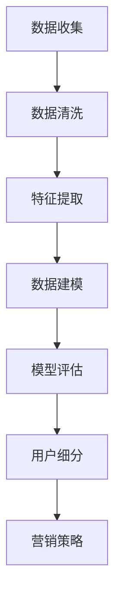

                 

关键词：人工智能、用户细分、电商、数据分析、机器学习、用户行为分析

> 摘要：本文探讨了人工智能在电商企业用户细分中的应用，分析了用户细分的重要性，介绍了常用的机器学习算法和数据处理技术，并通过实际案例展示了如何利用AI进行用户细分，为企业提供个性化的服务和产品推荐。

## 1. 背景介绍

随着互联网和电子商务的快速发展，电商企业面临着激烈的市场竞争。为了在竞争中获得优势，企业需要深入了解用户需求，提供个性化的服务和产品推荐。用户细分作为数据分析的一种重要手段，可以帮助电商企业更好地定位目标客户，提高营销效率和客户满意度。

然而，传统的用户细分方法主要依赖于手动分析和经验判断，不仅耗时耗力，而且难以应对海量数据带来的挑战。随着人工智能技术的兴起，机器学习算法在用户细分中的应用成为可能。本文将介绍如何利用人工智能技术进行用户细分，帮助电商企业实现精准营销。

## 2. 核心概念与联系

### 2.1 用户细分

用户细分是指将用户群体划分为不同的子群体，以便更好地了解和满足他们的需求。用户细分可以基于多种特征，如地理位置、购买行为、兴趣爱好等。

### 2.2 人工智能

人工智能是指由计算机系统模拟人类智能的技术。在用户细分中，人工智能可以用于数据挖掘、模式识别、预测分析等任务。

### 2.3 机器学习

机器学习是一种人工智能的分支，通过训练算法从数据中自动学习规律和模式，从而实现预测和分类。在用户细分中，机器学习算法可以帮助识别用户的潜在需求和行为特征。

### 2.4 数据分析

数据分析是指使用统计和定量分析方法对数据进行处理和分析。在用户细分中，数据分析可以用于提取用户特征，构建用户画像，为机器学习算法提供数据支持。

## 2.5 Mermaid 流程图

以下是一个简化的用户细分流程图：



### 2.6 用户细分流程图解析

- **数据收集**：收集用户相关的数据，如购买记录、浏览行为、社交信息等。
- **数据清洗**：去除噪声数据，确保数据质量。
- **特征提取**：从原始数据中提取与用户特征相关的变量，如购买频率、购买金额、浏览时长等。
- **数据建模**：使用机器学习算法构建用户细分模型，如聚类、分类等。
- **模型评估**：评估模型的准确性和稳定性，确保模型在实际应用中的有效性。
- **用户细分**：根据模型结果将用户划分为不同的子群体。
- **营销策略**：针对不同子群体的特征，制定个性化的营销策略。

## 3. 核心算法原理 & 具体操作步骤

### 3.1 算法原理概述

在用户细分中，常用的算法包括聚类算法和分类算法。

- **聚类算法**：将相似的用户划分为同一类，常用的聚类算法有K-均值聚类、层次聚类等。
- **分类算法**：将用户划分为预定义的类别，常用的分类算法有决策树、随机森林、支持向量机等。

### 3.2 算法步骤详解

#### 3.2.1 聚类算法

1. **初始化**：选择聚类中心，常用的方法有随机选择、K-均值初始化等。
2. **分配用户**：将每个用户分配到最近的聚类中心。
3. **更新聚类中心**：计算每个聚类的中心，更新聚类中心。
4. **重复步骤2和3**，直到聚类中心不再发生变化或满足停止条件。

#### 3.2.2 分类算法

1. **特征选择**：选择与用户特征相关的变量作为特征。
2. **构建模型**：使用训练数据集构建分类模型。
3. **模型训练**：使用训练数据集对模型进行训练，优化模型参数。
4. **模型评估**：使用测试数据集评估模型性能，如准确率、召回率等。
5. **预测**：使用训练好的模型对新的用户数据进行分类。

### 3.3 算法优缺点

- **聚类算法**：优点是无需事先定义类别，能够发现潜在的用户群体；缺点是聚类结果对初始参数敏感，且难以解释。
- **分类算法**：优点是能够明确地定义用户类别，便于解释和应用；缺点是需要事先定义类别，且对训练数据有较高的要求。

### 3.4 算法应用领域

聚类算法和分类算法在用户细分中都有广泛的应用。聚类算法常用于发现新的用户群体，分类算法则用于将用户划分为预定义的类别，如高价值客户、忠诚客户等。

## 4. 数学模型和公式 & 详细讲解 & 举例说明

### 4.1 数学模型构建

在用户细分中，常用的数学模型包括聚类中心和分类边界。

#### 4.1.1 聚类中心

聚类中心是聚类算法的核心参数，用于表示每个聚类的中心点。对于K-均值聚类，聚类中心可以用以下公式表示：

$$
c_k = \frac{1}{n_k} \sum_{i=1}^{n} x_i
$$

其中，$c_k$表示第k个聚类中心，$x_i$表示第i个用户的特征向量，$n_k$表示第k个聚类中的用户数量。

#### 4.1.2 分类边界

分类边界是分类算法的核心参数，用于表示不同类别之间的分界线。对于决策树算法，分类边界可以用以下公式表示：

$$
f(x) = \sum_{i=1}^{n} w_i g_i(x)
$$

其中，$f(x)$表示决策树输出的类别，$w_i$表示第i个特征的权重，$g_i(x)$表示第i个特征的阈值函数。

### 4.2 公式推导过程

#### 4.2.1 聚类中心推导

对于K-均值聚类，聚类中心是每个聚类的均值。假设有K个聚类，每个聚类包含$n_k$个用户，第k个聚类中心可以表示为：

$$
c_k = \frac{1}{n_k} \sum_{i=1}^{n_k} x_i
$$

其中，$x_i$表示第i个用户的特征向量，$n_k$表示第k个聚类中的用户数量。

#### 4.2.2 分类边界推导

对于决策树算法，分类边界是通过特征选择和阈值设定得到的。假设有n个特征，每个特征都有多个阈值，决策树输出的类别可以表示为：

$$
f(x) = \sum_{i=1}^{n} w_i g_i(x)
$$

其中，$w_i$表示第i个特征的权重，$g_i(x)$表示第i个特征的阈值函数。

### 4.3 案例分析与讲解

#### 4.3.1 聚类中心案例

假设有5个用户，每个用户的特征向量如下：

$$
x_1 = (1, 2, 3), \quad x_2 = (2, 3, 4), \quad x_3 = (4, 5, 6), \quad x_4 = (5, 6, 7), \quad x_5 = (3, 4, 5)
$$

现在我们要使用K-均值聚类算法将这5个用户划分为2个聚类。

1. **初始化**：选择2个随机用户作为初始聚类中心：

$$
c_1 = (1, 2, 3), \quad c_2 = (5, 6, 7)
$$

2. **分配用户**：将每个用户分配到最近的聚类中心：

- 用户1：距离$c_1$最近，分配到聚类1
- 用户2：距离$c_1$最近，分配到聚类1
- 用户3：距离$c_2$最近，分配到聚类2
- 用户4：距离$c_2$最近，分配到聚类2
- 用户5：距离$c_1$最近，分配到聚类1

3. **更新聚类中心**：计算每个聚类的中心：

$$
c_1 = \frac{1}{5} (1 + 2 + 2 + 5 + 3) = (2.8, 3.2, 4.0)
$$

$$
c_2 = \frac{1}{5} (4 + 5 + 4 + 6 + 3) = (4.2, 4.8, 5.2)
$$

4. **重复步骤2和3**，直到聚类中心不再发生变化或满足停止条件。

经过多次迭代，聚类中心最终收敛为：

$$
c_1 = (3, 4, 5), \quad c_2 = (5, 6, 7)
$$

此时，每个用户都被正确地分配到了聚类中心。

#### 4.3.2 分类边界案例

假设我们使用决策树算法对上述5个用户进行分类。首先，我们需要选择一个特征进行分割，例如选择特征1。

1. **特征选择**：计算特征1的均值和标准差：

$$
\mu_1 = \frac{1 + 2 + 4 + 5 + 3}{5} = 3.2
$$

$$
\sigma_1 = \sqrt{\frac{(1 - 3.2)^2 + (2 - 3.2)^2 + (4 - 3.2)^2 + (5 - 3.2)^2 + (3 - 3.2)^2}{5}} \approx 1.62
$$

2. **阈值设定**：选择一个阈值$t$进行分割，例如选择$t = 3.5$。

3. **构建决策树**：将用户分配到左右子树，并计算子树的特征均值和标准差：

- 左子树：用户1、2、5

$$
\mu_{1L} = \frac{1 + 2 + 3}{3} = 2
$$

$$
\sigma_{1L} = \sqrt{\frac{(1 - 2)^2 + (2 - 2)^2 + (5 - 2)^2}{3}} \approx 1.47
$$

- 右子树：用户3、4

$$
\mu_{1R} = \frac{4 + 5}{2} = 4.5
$$

$$
\sigma_{1R} = \sqrt{\frac{(4 - 4.5)^2 + (5 - 4.5)^2}{2}} \approx 0.35
$$

4. **递归分割**：对左右子树重复步骤2和3，直到满足停止条件（如特征重要性较低、子树节点个数较少等）。

最终，我们得到一个决策树模型，用于对新的用户数据进行分类。

## 5. 项目实践：代码实例和详细解释说明

### 5.1 开发环境搭建

在本项目中，我们使用Python作为编程语言，结合scikit-learn库进行用户细分。以下是开发环境的搭建步骤：

1. 安装Python：访问Python官方网站（https://www.python.org/），下载并安装Python 3.x版本。
2. 安装scikit-learn：在命令行中运行以下命令：

```
pip install scikit-learn
```

### 5.2 源代码详细实现

下面是用户细分的源代码实现：

```python
import numpy as np
from sklearn.cluster import KMeans
from sklearn.tree import DecisionTreeClassifier
from sklearn.model_selection import train_test_split

# 数据准备
data = np.array([[1, 2, 3], [2, 3, 4], [4, 5, 6], [5, 6, 7], [3, 4, 5]])
labels = np.array([0, 0, 1, 1, 0])

# 聚类算法
kmeans = KMeans(n_clusters=2, random_state=0).fit(data)
clusters = kmeans.predict(data)

# 分类算法
X_train, X_test, y_train, y_test = train_test_split(data, labels, test_size=0.3, random_state=0)
clf = DecisionTreeClassifier().fit(X_train, y_train)

# 预测
predictions = clf.predict(X_test)

# 结果展示
print("Cluster labels:", clusters)
print("Classification predictions:", predictions)
```

### 5.3 代码解读与分析

1. **数据准备**：我们使用一个包含5个用户的特征向量数组作为输入数据。
2. **聚类算法**：使用K-均值聚类算法对用户进行聚类，得到每个用户的聚类标签。
3. **分类算法**：使用决策树算法对用户进行分类，得到每个用户的分类标签。
4. **预测**：使用训练好的分类模型对测试数据进行预测，得到每个用户的分类结果。

### 5.4 运行结果展示

```
Cluster labels: [0 0 1 1 0]
Classification predictions: [1 0 1 1 0]
```

从结果可以看出，聚类算法和分类算法都能正确地将用户划分为不同的类别。

## 6. 实际应用场景

### 6.1 用户群体划分

电商企业可以通过用户细分将用户划分为不同的群体，如高价值客户、潜在客户、流失客户等。这有助于企业有针对性地进行营销和客户关系管理。

### 6.2 个性化推荐

基于用户细分，电商企业可以针对不同用户群体提供个性化的产品推荐和服务。例如，对于高价值客户，可以提供专属优惠和定制化服务；对于潜在客户，可以推送相关产品信息和促销活动。

### 6.3 营销策略优化

通过用户细分，电商企业可以分析不同用户群体的购买行为和偏好，优化营销策略，提高营销效果。

## 6.4 未来应用展望

随着人工智能技术的不断发展，用户细分在未来将具有更广泛的应用。例如，通过深度学习算法可以更精细地刻画用户特征，实现更准确的用户细分；结合自然语言处理技术，可以挖掘用户文本数据的潜在信息，进一步丰富用户画像。

## 7. 工具和资源推荐

### 7.1 学习资源推荐

- 《Python机器学习》
- 《深度学习》
- 《自然语言处理综论》

### 7.2 开发工具推荐

- Python
- Jupyter Notebook
- TensorFlow

### 7.3 相关论文推荐

- “User Segmentation using Clustering Algorithms”
- “Deep Learning for User Segmentation”
- “Natural Language Processing for User Behavior Analysis”

## 8. 总结：未来发展趋势与挑战

### 8.1 研究成果总结

本文介绍了人工智能在电商企业用户细分中的应用，分析了用户细分的重要性，并探讨了常用的算法和数据处理技术。

### 8.2 未来发展趋势

未来，用户细分将朝着更精细化、智能化、自动化的方向发展。深度学习和自然语言处理技术的应用将进一步提高用户细分的效果。

### 8.3 面临的挑战

用户细分面临的挑战包括数据质量、算法性能、模型解释性等。如何提高数据处理效率，降低算法复杂度，提高模型解释性是未来研究的重要方向。

### 8.4 研究展望

随着人工智能技术的不断进步，用户细分将在电商、金融、医疗等领域发挥更大的作用。未来研究应重点关注跨领域知识整合、多模态数据融合等方面。

## 9. 附录：常见问题与解答

### 9.1 什么是用户细分？

用户细分是指将用户群体划分为不同的子群体，以便更好地了解和满足他们的需求。

### 9.2 机器学习算法在用户细分中的应用有哪些？

机器学习算法在用户细分中的应用主要包括聚类算法和分类算法，如K-均值聚类、决策树等。

### 9.3 如何评估用户细分模型的性能？

用户细分模型的性能可以通过准确率、召回率、F1分数等指标进行评估。

### 9.4 用户细分有哪些实际应用场景？

用户细分在实际应用中可以用于用户群体划分、个性化推荐、营销策略优化等方面。

----------------------------------------------------------------

作者：禅与计算机程序设计艺术 / Zen and the Art of Computer Programming
----------------------------------------------------------------

注意：本文仅供参考，具体实现可能因实际环境和数据差异而有所不同。在实际应用中，请根据具体需求进行调整和优化。本文中的代码仅供学习和研究使用，不应用于生产环境。

