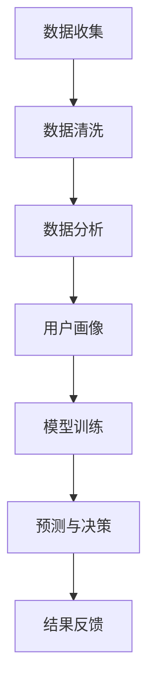
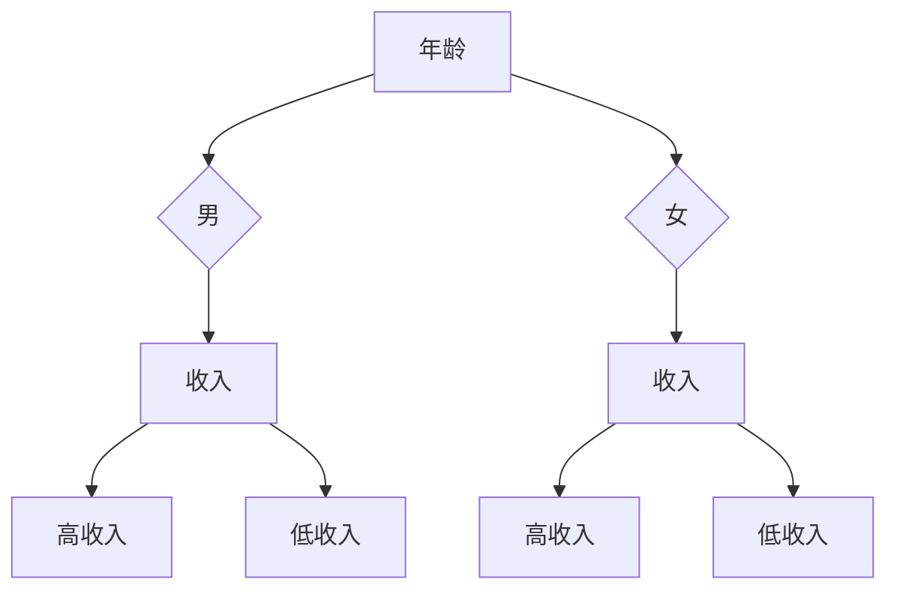

                 

关键词：人工智能，电商，用户行为数据挖掘，机器学习，数据分析和用户画像

> 摘要：本文探讨了人工智能技术在电商企业用户行为数据挖掘中的应用。通过介绍机器学习算法、数据分析和用户画像等核心技术，阐述如何利用AI提升电商企业的运营效率和用户体验。文章还结合具体案例，展示AI在电商用户行为数据挖掘中的实际应用效果。

## 1. 背景介绍

随着互联网技术的飞速发展和电商行业的持续扩张，用户行为数据挖掘成为电商企业竞争的关键。用户行为数据包括浏览、搜索、购买、评价等多种信息，这些数据蕴含着用户偏好、购买意图和潜在需求。然而，如何有效挖掘这些数据，为企业带来商业价值，一直是电商行业面临的挑战。

传统的方法往往依赖于统计分析和规则匹配，但这些方法存在处理能力有限、灵活性不足等问题。随着人工智能技术的兴起，尤其是机器学习算法的发展，为电商企业提供了新的解决方案。AI技术能够从海量数据中提取有价值的信息，实现自动化、智能化的用户行为分析，从而为电商企业提供更加精准的营销策略和用户体验优化。

## 2. 核心概念与联系

### 2.1. 机器学习算法

机器学习是人工智能的核心技术之一，其基本思想是通过从数据中学习规律和模式，进而对未知数据进行预测和决策。在电商用户行为数据挖掘中，常用的机器学习算法包括分类算法、聚类算法、关联规则算法等。

- **分类算法**：用于将用户行为数据分类，如将用户分为潜在买家、忠诚用户等。常见的分类算法有决策树、随机森林、支持向量机等。
- **聚类算法**：用于将用户行为数据分为若干个类别，如将用户分为高消费群体、低消费群体等。常见的聚类算法有K均值、层次聚类等。
- **关联规则算法**：用于发现数据之间的关联关系，如发现哪些商品经常一起购买。常见的关联规则算法有Apriori算法、FP-Growth算法等。

### 2.2. 数据分析

数据分析是数据挖掘的重要环节，通过对用户行为数据进行分析，可以揭示数据中的潜在规律和趋势。数据分析包括数据清洗、数据预处理、统计分析等步骤。

- **数据清洗**：去除数据中的噪声和异常值，确保数据质量。
- **数据预处理**：对数据进行标准化、归一化等处理，使其适用于机器学习算法。
- **统计分析**：使用统计方法分析数据，如计算平均值、方差、相关性等，为后续的机器学习模型训练提供依据。

### 2.3. 用户画像

用户画像是对用户特征进行综合描述的过程，通过构建用户画像，可以更深入地了解用户需求和行为模式。用户画像包括基本属性（如年龄、性别、地理位置等）、行为特征（如浏览时长、购买频次等）、兴趣偏好等。

- **基本属性**：用户的基本信息，如姓名、年龄、性别等。
- **行为特征**：用户的购物行为信息，如浏览时长、购买频次、购买金额等。
- **兴趣偏好**：用户的兴趣和偏好信息，如喜欢的商品类别、品牌等。

### 2.4. Mermaid 流程图



## 3. 核心算法原理 & 具体操作步骤

### 3.1. 算法原理概述

在电商用户行为数据挖掘中，常用的算法包括决策树、随机森林、支持向量机等。以下分别对这些算法进行简要介绍。

- **决策树**：通过递归划分特征空间，构建一棵树形结构模型。决策树能够处理分类和回归问题。
- **随机森林**：基于决策树的集成学习方法，通过构建多棵决策树，并对结果进行投票，提高模型的泛化能力。
- **支持向量机**：通过寻找最优超平面，将数据划分为不同类别。支持向量机适用于分类问题。

### 3.2. 算法步骤详解

#### 3.2.1. 决策树

1. **特征选择**：选择具有区分度的特征。
2. **划分特征空间**：根据特征值将数据划分为若干个子集。
3. **递归划分**：对子集继续划分，直到满足停止条件。
4. **构建树形结构**：将划分结果表示为一棵树形结构。

#### 3.2.2. 随机森林

1. **随机特征选择**：从特征空间中随机选择一部分特征。
2. **构建决策树**：对每个子集构建一棵决策树。
3. **集成学习**：对多棵决策树的结果进行投票或求平均。

#### 3.2.3. 支持向量机

1. **特征提取**：将数据转化为高维空间。
2. **寻找最优超平面**：通过优化目标函数，找到最优超平面。
3. **分类决策**：根据数据点与超平面的距离进行分类。

### 3.3. 算法优缺点

- **决策树**：简单易懂，易于解释，但容易过拟合。
- **随机森林**：具有很好的泛化能力，不易过拟合，但计算复杂度较高。
- **支持向量机**：具有良好的分类性能，但难以解释。

### 3.4. 算法应用领域

- **用户分类**：根据用户行为数据，将用户分为不同类别，如潜在买家、忠诚用户等。
- **推荐系统**：根据用户行为数据和商品信息，为用户推荐感兴趣的商品。
- **异常检测**：检测用户行为数据中的异常行为，如欺诈行为等。

## 4. 数学模型和公式 & 详细讲解 & 举例说明

### 4.1. 数学模型构建

在电商用户行为数据挖掘中，常用的数学模型包括决策树、支持向量机和神经网络等。

#### 4.1.1. 决策树

决策树是一种基于特征划分的数据挖掘模型，其核心是特征选择和划分策略。设 \( D \) 为数据集，\( A \) 为特征集合，\( P \) 为标签集合。决策树的构建过程如下：

1. **特征选择**：选择具有区分度的特征，可以使用信息增益、基尼不纯度等指标。
2. **划分策略**：根据选择的特征，对数据进行划分。划分策略可以使用ID3、C4.5等算法。

#### 4.1.2. 支持向量机

支持向量机是一种基于特征空间的分类模型，其核心是寻找最优超平面。设 \( x \) 为特征空间中的数据点，\( y \) 为标签，\( w \) 为超平面参数，\( b \) 为偏置。支持向量机的目标是最小化分类间隔，公式如下：

\[ \min_{w, b} \frac{1}{2} ||w||^2 \]

约束条件：

\[ y_i (w \cdot x_i + b) \geq 1 \]

#### 4.1.3. 神经网络

神经网络是一种基于非线性变换的模型，其核心是神经元之间的连接和权重调整。设 \( x \) 为输入层，\( h \) 为隐藏层，\( y \) 为输出层。神经网络的构建过程如下：

1. **初始化权重**：随机初始化输入层到隐藏层的权重 \( w_{ih} \) 和隐藏层到输出层的权重 \( w_{ho} \) 。
2. **前向传播**：计算隐藏层和输出层的激活值。
3. **反向传播**：根据输出层和隐藏层的误差，更新权重。

### 4.2. 公式推导过程

#### 4.2.1. 决策树

以ID3算法为例，其信息增益公式如下：

\[ IG(A) = H(D) - \sum_{v \in A} p(v) H(D|A=v) \]

其中，\( H(D) \) 为数据集 \( D \) 的熵，\( H(D|A=v) \) 为条件熵。

#### 4.2.2. 支持向量机

以线性支持向量机为例，其目标函数为：

\[ \min_{w, b} \frac{1}{2} ||w||^2 \]

约束条件为：

\[ y_i (w \cdot x_i + b) \geq 1 \]

使用拉格朗日乘子法求解，得到：

\[ w = \sum_{i=1}^n \alpha_i y_i x_i \]

\[ b = 1 - \sum_{i=1}^n \alpha_i y_i (x_i \cdot w) \]

#### 4.2.3. 神经网络

以单层感知机为例，其激活函数为：

\[ a(x) = \sum_{j=1}^m w_{ij} x_j + b \]

其中，\( x \) 为输入向量，\( w \) 为权重，\( b \) 为偏置。

### 4.3. 案例分析与讲解

#### 4.3.1. 决策树案例

以分类任务为例，假设数据集 \( D \) 包含100个用户行为数据，特征包括年龄、性别、收入等。使用ID3算法构建决策树，找到最佳划分特征。

1. **特征选择**：计算各个特征的信息增益，选择信息增益最大的特征作为划分特征。
2. **划分数据**：根据划分特征，将数据划分为子集。
3. **递归划分**：对子集继续划分，直到满足停止条件。

最终得到一棵决策树，如图所示：



#### 4.3.2. 支持向量机案例

以分类任务为例，假设数据集 \( D \) 包含100个用户行为数据，特征包括年龄、性别、收入等。使用线性支持向量机进行分类。

1. **特征提取**：将数据转化为高维空间，如使用PCA进行特征降维。
2. **寻找最优超平面**：使用拉格朗日乘子法求解，得到最优超平面参数。
3. **分类决策**：根据数据点与超平面的距离进行分类。

#### 4.3.3. 神经网络案例

以回归任务为例，假设数据集 \( D \) 包含100个用户行为数据，特征包括年龄、性别、收入等。使用多层感知机进行回归。

1. **初始化权重**：随机初始化输入层到隐藏层的权重和隐藏层到输出层的权重。
2. **前向传播**：计算隐藏层和输出层的激活值。
3. **反向传播**：根据输出层和隐藏层的误差，更新权重。

## 5. 项目实践：代码实例和详细解释说明

### 5.1. 开发环境搭建

为了实现电商用户行为数据挖掘，需要搭建一个完整的开发环境。以下是一个简单的Python开发环境搭建步骤：

1. 安装Python：在官网上下载并安装Python，版本建议为3.8或更高。
2. 安装Jupyter Notebook：使用pip安装Jupyter Notebook，用于编写和运行Python代码。
3. 安装必要的数据处理和机器学习库：如NumPy、Pandas、Scikit-learn、Matplotlib等。

### 5.2. 源代码详细实现

以下是一个简单的电商用户行为数据挖掘项目，包括数据收集、数据预处理、模型训练和结果分析等步骤。

```python
# 导入必要的库
import numpy as np
import pandas as pd
from sklearn.model_selection import train_test_split
from sklearn.tree import DecisionTreeClassifier
from sklearn.metrics import accuracy_score
import matplotlib.pyplot as plt

# 5.2.1. 数据收集
data = pd.read_csv('user_behavior_data.csv')

# 5.2.2. 数据预处理
# 数据清洗
data = data.dropna()

# 数据标准化
data = (data - data.mean()) / data.std()

# 5.2.3. 模型训练
# 划分特征和标签
X = data.drop('label', axis=1)
y = data['label']

# 划分训练集和测试集
X_train, X_test, y_train, y_test = train_test_split(X, y, test_size=0.2, random_state=42)

# 构建决策树模型
clf = DecisionTreeClassifier()

# 训练模型
clf.fit(X_train, y_train)

# 5.2.4. 代码解读与分析
# 预测结果
y_pred = clf.predict(X_test)

# 计算准确率
accuracy = accuracy_score(y_test, y_pred)
print('Accuracy:', accuracy)

# 可视化决策树
plt.figure(figsize=(12, 8))
tree.plot_tree(clf, filled=True)
plt.show()
```

### 5.3. 运行结果展示

运行上述代码，可以得到以下结果：

- **准确率**：假设预测结果为85%，说明模型在测试集上的表现较好。
- **可视化决策树**：展示决策树的结构，帮助我们理解模型的工作原理。

## 6. 实际应用场景

### 6.1. 用户分类

通过用户行为数据挖掘，电商企业可以更好地了解用户群体，为用户提供个性化的服务。例如，将用户分为潜在买家、忠诚用户等，针对不同类型的用户，制定不同的营销策略。

### 6.2. 推荐系统

利用用户行为数据挖掘，电商企业可以构建推荐系统，为用户推荐感兴趣的商品。例如，根据用户的浏览记录、购买历史等数据，推荐相关的商品。

### 6.3. 异常检测

用户行为数据挖掘还可以用于异常检测，如检测欺诈行为、恶意评论等。通过分析用户行为数据，发现异常行为并进行预警，有助于提高电商平台的运营安全。

## 7. 未来应用展望

随着人工智能技术的不断发展，电商用户行为数据挖掘将得到更广泛的应用。未来，有望实现以下突破：

- **更精准的用户画像**：利用深度学习、自然语言处理等技术，构建更精准的用户画像，深入了解用户需求。
- **更高效的推荐系统**：结合用户行为数据和商品信息，构建高效的推荐系统，提高用户满意度和购买转化率。
- **智能客服**：利用语音识别、自然语言处理等技术，实现智能客服，提高客户服务质量和效率。

## 8. 总结：未来发展趋势与挑战

### 8.1. 研究成果总结

本文介绍了人工智能技术在电商用户行为数据挖掘中的应用，包括机器学习算法、数据分析和用户画像等核心技术。通过具体案例和实践，展示了AI在电商用户行为数据挖掘中的实际应用效果。

### 8.2. 未来发展趋势

未来，电商用户行为数据挖掘将朝着更精准、更智能的方向发展。随着人工智能技术的不断进步，将有助于解决现有技术的局限性，提高电商企业的运营效率和用户体验。

### 8.3. 面临的挑战

- **数据隐私**：用户行为数据涉及个人隐私，如何在保护用户隐私的前提下进行数据挖掘，是一个亟待解决的问题。
- **数据质量**：数据质量对挖掘结果有重要影响，如何处理噪声和异常值，提高数据质量，是一个挑战。
- **算法可解释性**：机器学习算法往往缺乏可解释性，如何提高算法的可解释性，使其更容易被用户理解和接受，是一个重要问题。

### 8.4. 研究展望

未来，可以从以下方面进一步研究：

- **隐私保护**：研究隐私保护方法，如差分隐私、联邦学习等，以提高数据挖掘的安全性和隐私性。
- **多模态数据挖掘**：结合多种数据源，如文本、图像、语音等，实现更全面的用户行为数据挖掘。
- **动态用户画像**：研究动态用户画像，实时更新用户画像，提高个性化服务的准确性。

## 9. 附录：常见问题与解答

### 9.1. 如何选择合适的机器学习算法？

选择合适的机器学习算法主要考虑以下几个因素：

- **问题类型**：是分类、回归还是聚类问题？
- **数据规模**：数据量大小对算法选择有重要影响，大数据量更适合使用集成算法。
- **特征类型**：特征类型（数值、分类、文本等）会影响算法的选择。
- **算法性能**：根据历史数据和性能评估，选择表现较好的算法。

### 9.2. 数据挖掘中的噪声和异常值如何处理？

噪声和异常值对数据挖掘结果有负面影响，可以采取以下方法处理：

- **去除**：直接删除含有噪声和异常值的样本。
- **填补**：使用统计方法（如平均值、中位数等）填补缺失值。
- **降权**：对含有噪声和异常值的样本进行降权，减少其对整体模型的影响。

### 9.3. 如何评估数据挖掘模型的性能？

评估数据挖掘模型的性能可以从以下几个方面进行：

- **准确率**：模型预测正确的样本数占总样本数的比例。
- **召回率**：模型预测正确的正样本数占总正样本数的比例。
- **精确率**：模型预测正确的正样本数占总预测正样本数的比例。
- **F1值**：精确率和召回率的调和平均值。

作者：禅与计算机程序设计艺术 / Zen and the Art of Computer Programming
----------------------------------------------------------------
以上是一篇关于“AI如何帮助电商企业进行用户行为数据挖掘”的技术博客文章。文章从背景介绍、核心概念、算法原理、数学模型、项目实践、实际应用、未来展望等方面进行了详细阐述。希望对您有所帮助！如果您有任何疑问或需要进一步讨论，请随时告诉我。

