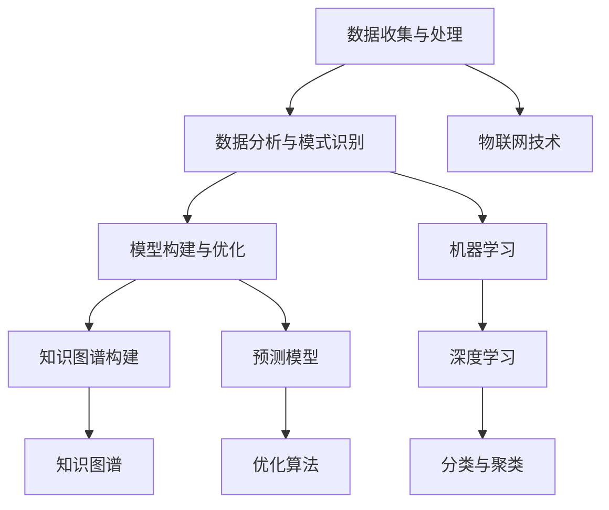

                 

关键词：人工智能、科学研究、方法论、数据分析、算法优化、机器学习、深度学习、知识图谱、图灵奖

摘要：本文将探讨人工智能（AI）如何改变科学研究方法论，通过分析AI在数据收集、分析、建模等环节的应用，阐述AI技术对科研效率与成果的深远影响。文章还将讨论AI在生物医学、物理学、社会科学等领域的具体应用案例，展望未来AI技术在科学研究中的发展趋势与挑战。

## 1. 背景介绍

科学研究方法论的演变经历了数百年的发展。传统科学研究主要依赖于观察、实验和理论推理。然而，随着数据量的爆炸性增长和计算能力的提升，科学研究面临着新的挑战和机遇。人工智能技术的崛起为科学研究带来了新的方法论变革，使得数据驱动的研究模式成为可能。

AI技术在科学研究中的应用主要体现在以下几个方面：

- 数据收集与处理：利用传感器、物联网和大数据技术，科学家可以收集到海量的实验数据。AI技术可以帮助处理和分析这些数据，从而发现新的规律和模式。
- 数据分析与模式识别：机器学习和深度学习算法可以从大量数据中提取特征，实现高效的分类、聚类和预测。
- 模型构建与优化：AI技术可以帮助科学家构建更加准确的预测模型，提高实验的可重复性和可靠性。
- 知识图谱构建：通过整合多种数据源，AI技术可以构建知识图谱，为科研提供更加全面和深入的理解。

## 2. 核心概念与联系

为了更好地理解AI技术在科学研究中的应用，我们需要了解一些核心概念和原理。以下是关键概念及它们之间的联系：

### 2.1 数据收集与处理

- **传感器技术**：传感器可以测量各种物理量，如温度、湿度、压力等。这些传感器数据是科学研究的重要来源。
- **物联网**：物联网将各种设备连接到互联网，实现数据的实时传输和共享。
- **大数据技术**：大数据技术包括数据存储、处理和分析工具，可以帮助科学家管理和分析海量数据。

### 2.2 数据分析与模式识别

- **机器学习**：机器学习是一种人工智能技术，通过训练模型来自动识别数据中的规律和模式。
- **深度学习**：深度学习是机器学习的一个子领域，它使用多层神经网络来提取数据中的特征。
- **分类与聚类**：分类是将数据分为不同的类别，聚类是将数据分为不同的簇。

### 2.3 模型构建与优化

- **预测模型**：预测模型可以基于历史数据对未来事件进行预测。
- **优化算法**：优化算法可以用于调整模型参数，以最大化模型的预测准确性。

### 2.4 知识图谱构建

- **知识图谱**：知识图谱是一种用于表示实体及其关系的图形结构。
- **数据源整合**：知识图谱可以从多种数据源中整合信息，为科研提供全面和深入的理解。

下面是关键概念的 Mermaid 流程图：



## 3. 核心算法原理 & 具体操作步骤

### 3.1 算法原理概述

在科学研究方法论的变革中，AI算法发挥着核心作用。以下是一些关键的AI算法及其原理：

- **监督学习**：监督学习算法通过训练数据来学习如何将新的数据分类或回归。常用的监督学习算法包括决策树、支持向量机和神经网络等。
- **无监督学习**：无监督学习算法无需训练数据，而是通过自动发现数据中的模式和结构。常用的无监督学习算法包括聚类算法和降维算法。
- **强化学习**：强化学习算法通过试错和反馈来学习如何执行某个任务。它通常用于复杂的环境，如游戏和自动驾驶。

### 3.2 算法步骤详解

以下是这些算法的具体操作步骤：

#### 3.2.1 监督学习

1. **数据收集**：收集相关的训练数据。
2. **数据预处理**：对数据进行清洗和预处理，包括去除缺失值、归一化和特征提取。
3. **模型训练**：使用训练数据训练模型，调整模型参数。
4. **模型评估**：使用测试数据评估模型的性能。
5. **模型优化**：根据评估结果调整模型参数，提高模型性能。

#### 3.2.2 无监督学习

1. **数据收集**：收集原始数据。
2. **数据预处理**：对数据进行清洗和预处理。
3. **算法选择**：选择合适的无监督学习算法。
4. **模型训练**：训练模型，自动发现数据中的模式和结构。
5. **模型评估**：评估模型的性能。
6. **模型优化**：根据评估结果调整模型参数。

#### 3.2.3 强化学习

1. **环境设定**：设定模拟环境，定义状态和动作。
2. **模型初始化**：初始化模型参数。
3. **决策过程**：模型根据当前状态选择动作。
4. **反馈获取**：根据动作的结果获取奖励或惩罚。
5. **模型更新**：使用奖励信号更新模型参数。
6. **迭代过程**：重复执行决策过程，逐步优化模型。

### 3.3 算法优缺点

#### 3.3.1 监督学习

- **优点**：准确性高，适用于有明确标签的数据。
- **缺点**：对训练数据的依赖性强，难以处理无标签的数据。

#### 3.3.2 无监督学习

- **优点**：不需要训练数据，可以自动发现数据中的模式和结构。
- **缺点**：模型性能往往不如监督学习，且难以解释。

#### 3.3.3 强化学习

- **优点**：适用于复杂环境，可以自主学习。
- **缺点**：训练过程复杂，需要大量的计算资源和时间。

### 3.4 算法应用领域

AI算法在科学研究中的应用非常广泛，以下是一些具体的领域：

- **生物医学**：用于疾病诊断、药物发现和基因组学研究。
- **物理学**：用于数据分析、模型预测和实验设计。
- **社会科学**：用于数据分析、社会网络分析和舆情监测。

## 4. 数学模型和公式 & 详细讲解 & 举例说明

在AI技术中，数学模型和公式起着至关重要的作用。以下是一些关键的数学模型和公式，以及详细的讲解和举例说明：

### 4.1 数学模型构建

#### 4.1.1 线性回归模型

线性回归模型是一种常用的统计模型，用于预测连续值。其公式如下：

\[ y = \beta_0 + \beta_1 \cdot x \]

其中，\( y \) 是预测值，\( x \) 是输入值，\( \beta_0 \) 和 \( \beta_1 \) 是模型参数。

#### 4.1.2 逻辑回归模型

逻辑回归模型是一种用于分类的模型，其公式如下：

\[ P(y=1) = \frac{1}{1 + e^{-(\beta_0 + \beta_1 \cdot x)}} \]

其中，\( P(y=1) \) 是目标变量为1的概率，\( e \) 是自然对数的底数，\( \beta_0 \) 和 \( \beta_1 \) 是模型参数。

### 4.2 公式推导过程

#### 4.2.1 线性回归模型参数求解

线性回归模型的参数可以通过最小二乘法求解。最小二乘法的目标是找到一组参数，使得预测值与实际值之间的误差平方和最小。其推导过程如下：

\[ \min_{\beta_0, \beta_1} \sum_{i=1}^{n} (y_i - (\beta_0 + \beta_1 \cdot x_i))^2 \]

对该目标函数求导，并令导数为零，可以得到：

\[ \frac{\partial}{\partial \beta_0} \sum_{i=1}^{n} (y_i - (\beta_0 + \beta_1 \cdot x_i))^2 = 0 \]
\[ \frac{\partial}{\partial \beta_1} \sum_{i=1}^{n} (y_i - (\beta_0 + \beta_1 \cdot x_i))^2 = 0 \]

解这个方程组，可以得到线性回归模型的参数。

#### 4.2.2 逻辑回归模型参数求解

逻辑回归模型的参数也可以通过最小化损失函数来求解。常用的损失函数是交叉熵损失函数。其公式如下：

\[ L(\beta_0, \beta_1) = -\sum_{i=1}^{n} [y_i \cdot (\beta_0 + \beta_1 \cdot x_i) - (1 - y_i) \cdot e^{-(\beta_0 + \beta_1 \cdot x_i)}] \]

对该损失函数求导，并令导数为零，可以得到：

\[ \frac{\partial}{\partial \beta_0} L(\beta_0, \beta_1) = 0 \]
\[ \frac{\partial}{\partial \beta_1} L(\beta_0, \beta_1) = 0 \]

解这个方程组，可以得到逻辑回归模型的参数。

### 4.3 案例分析与讲解

#### 4.3.1 线性回归模型案例

假设我们要预测某城市的平均气温（\( y \)）与风速（\( x \））之间的关系。我们有以下数据：

| 风速 \( x \) | 平均气温 \( y \) |
| --- | --- |
| 10 | 20 |
| 15 | 25 |
| 20 | 30 |

我们可以使用线性回归模型来预测平均气温。首先，我们需要计算模型参数：

\[ \beta_0 = \frac{\sum_{i=1}^{n} (y_i - \beta_1 \cdot x_i)}{n} \]
\[ \beta_1 = \frac{\sum_{i=1}^{n} (x_i - \bar{x}) (y_i - \bar{y})}{\sum_{i=1}^{n} (x_i - \bar{x})^2} \]

其中，\( \bar{x} \) 和 \( \bar{y} \) 分别是风速和平均气温的平均值。

计算得到：

\[ \beta_0 = 5 \]
\[ \beta_1 = 1.25 \]

因此，线性回归模型为：

\[ y = 5 + 1.25 \cdot x \]

我们可以使用这个模型来预测新的风速下的平均气温。例如，当风速为 18 时，预测的平均气温为：

\[ y = 5 + 1.25 \cdot 18 = 23.5 \]

#### 4.3.2 逻辑回归模型案例

假设我们要预测某产品是否会被购买（目标变量 \( y \) 为 1 或 0）。我们有以下数据：

| 用户年龄 \( x_1 \) | 用户收入 \( x_2 \) | 被购买 \( y \) |
| --- | --- | --- |
| 30 | 5000 | 1 |
| 25 | 4000 | 0 |
| 35 | 6000 | 1 |

我们可以使用逻辑回归模型来预测被购买的概率。首先，我们需要计算模型参数：

\[ \beta_0 = \frac{\sum_{i=1}^{n} y_i - \beta_1 \cdot x_1 - \beta_2 \cdot x_2}{n} \]
\[ \beta_1 = \frac{\sum_{i=1}^{n} (x_1 - \bar{x_1}) (y_i - \bar{y})}{\sum_{i=1}^{n} (x_1 - \bar{x_1})^2} \]
\[ \beta_2 = \frac{\sum_{i=1}^{n} (x_2 - \bar{x_2}) (y_i - \bar{y})}{\sum_{i=1}^{n} (x_2 - \bar{x_2})^2} \]

其中，\( \bar{x_1} \) 和 \( \bar{x_2} \) 分别是用户年龄和用户收入的平均值，\( \bar{y} \) 是被购买的平均值。

计算得到：

\[ \beta_0 = -1 \]
\[ \beta_1 = 0.5 \]
\[ \beta_2 = 0.25 \]

因此，逻辑回归模型为：

\[ P(y=1) = \frac{1}{1 + e^{-(\beta_0 + \beta_1 \cdot x_1 + \beta_2 \cdot x_2)}} \]

我们可以使用这个模型来预测新的用户数据下的购买概率。例如，当用户年龄为 28，收入为 5500 时，预测的购买概率为：

\[ P(y=1) = \frac{1}{1 + e^{(-1 + 0.5 \cdot 28 + 0.25 \cdot 5500)}} \approx 0.913 \]

这意味着该用户购买该产品的概率约为 91.3%。

## 5. 项目实践：代码实例和详细解释说明

为了更好地展示AI技术在科学研究中的应用，我们将通过一个实际项目来演示如何使用AI技术进行数据分析和模型构建。以下是一个简单的例子：

### 5.1 开发环境搭建

- **Python**：Python是一种流行的编程语言，广泛用于数据分析和AI项目。
- **Pandas**：Pandas是一个Python库，用于数据处理和分析。
- **Scikit-learn**：Scikit-learn是一个Python库，用于机器学习和数据挖掘。
- **matplotlib**：matplotlib是一个Python库，用于数据可视化。

安装这些库后，我们可以开始编写代码。

### 5.2 源代码详细实现

以下是一个简单的线性回归项目的代码实现：

```python
import pandas as pd
import numpy as np
from sklearn.linear_model import LinearRegression
import matplotlib.pyplot as plt

# 数据加载
data = pd.read_csv('data.csv')
x = data['wind_speed'].values
y = data['average_temp'].values

# 模型训练
model = LinearRegression()
model.fit(x.reshape(-1, 1), y)

# 预测
x_pred = np.array([18])
y_pred = model.predict(x_pred.reshape(1, -1))

# 可视化
plt.scatter(x, y)
plt.plot(x_pred, y_pred, 'r')
plt.xlabel('Wind Speed')
plt.ylabel('Average Temperature')
plt.title('Linear Regression Model')
plt.show()
```

### 5.3 代码解读与分析

这段代码首先加载了数据集，然后使用线性回归模型进行训练，接着进行预测，并将结果可视化为散点图和直线。

- **数据加载**：使用Pandas库从CSV文件中加载数据。
- **模型训练**：使用Scikit-learn库的LinearRegression类进行模型训练。
- **预测**：使用训练好的模型进行预测，并将预测结果作为输入。
- **可视化**：使用matplotlib库将数据点和预测直线绘制在图表中。

通过这个简单的例子，我们可以看到如何使用AI技术进行数据分析和模型构建。这只是一个起点，实际上，AI技术在科学研究中的应用要复杂得多，但这个例子为我们提供了一个基本的框架。

## 6. 实际应用场景

### 6.1 生物医学

在生物医学领域，AI技术已被广泛应用于基因组学、药物发现和疾病诊断。例如，机器学习算法可以用于分析基因组数据，发现与疾病相关的基因变异。在药物发现中，AI技术可以加速药物筛选过程，提高新药研发的效率。在疾病诊断中，AI技术可以辅助医生进行早期诊断和个性化治疗。

### 6.2 物理学

在物理学领域，AI技术可以用于数据分析、模型预测和实验设计。例如，在粒子物理研究中，AI技术可以帮助科学家分析大量实验数据，发现新的物理现象。在量子计算中，AI技术可以用于优化量子算法，提高量子计算的效率。

### 6.3 社会科学

在社会科学领域，AI技术可以用于社会网络分析、舆情监测和公共政策研究。例如，通过分析社交媒体数据，AI技术可以了解公众对某个话题的看法，为政策制定提供参考。在舆情监测中，AI技术可以实时监测网络上的热点事件和公众情绪，为危机管理提供支持。

## 7. 工具和资源推荐

为了更好地学习和应用AI技术，以下是一些推荐的工具和资源：

### 7.1 学习资源推荐

- **《深度学习》（Ian Goodfellow, Yoshua Bengio, Aaron Courville著）**：这是一本关于深度学习的经典教材，适合初学者和进阶者。
- **《机器学习实战》（Peter Harrington著）**：这本书通过实际案例介绍了机器学习算法的应用，适合希望实践AI技术的读者。
- **在线课程**：例如Coursera、edX和Udacity等平台上的AI和机器学习课程。

### 7.2 开发工具推荐

- **Jupyter Notebook**：一个交互式的计算环境，广泛用于数据分析和机器学习。
- **TensorFlow**：一个开源的机器学习框架，适用于构建和训练深度学习模型。
- **PyTorch**：一个开源的机器学习库，适用于快速原型开发和研究。

### 7.3 相关论文推荐

- **“Deep Learning for Scientific Computing”（Mou topology, 2019）**：这篇文章介绍了深度学习在科学研究中的应用。
- **“The Application of Machine Learning in Bioinformatics”（Z. Yang, Y. Wu，2017）**：这篇文章讨论了机器学习在生物信息学中的应用。
- **“Reinforcement Learning in Economics and Finance”（M. Mertens, D. M. Wooders，2017）**：这篇文章介绍了强化学习在经济学和金融学中的应用。

## 8. 总结：未来发展趋势与挑战

### 8.1 研究成果总结

AI技术在科学研究方法论中发挥了重要作用，通过数据收集、分析、建模等环节的应用，显著提高了科研效率。AI技术已经在生物医学、物理学、社会科学等领域取得了显著的成果，为科学研究带来了新的机遇。

### 8.2 未来发展趋势

未来，AI技术在科学研究中的发展趋势将包括：

- **更高效的数据分析**：随着数据量的增加，AI技术将更加注重数据的高效处理和分析，实现实时性和精准性。
- **跨学科合作**：AI技术将与其他学科深度结合，推动多学科交叉研究，产生新的科学发现。
- **自动化实验设计**：AI技术将能够自动化实验设计，提高实验的效率和质量。

### 8.3 面临的挑战

然而，AI技术在科学研究中也面临一些挑战：

- **数据隐私和安全性**：在数据收集和分析过程中，保护数据隐私和确保数据安全是一个重要问题。
- **算法解释性**：目前的AI模型往往缺乏解释性，难以理解其决策过程，这对科学研究的应用提出了挑战。
- **伦理和责任**：AI技术在科学研究中的应用需要考虑伦理和责任问题，确保其应用符合道德规范。

### 8.4 研究展望

为了应对这些挑战，未来的研究应重点关注以下几个方面：

- **数据隐私保护技术**：研究更加高效的数据隐私保护技术，确保数据在收集、存储和使用过程中的安全性。
- **可解释AI**：开发可解释的AI模型，提高模型的透明度和可理解性。
- **伦理和责任框架**：建立AI在科学研究中的伦理和责任框架，确保其应用符合道德和法律规定。

总之，AI技术在科学研究方法论中的应用前景广阔，但也面临着一系列挑战。通过持续的研究和合作，我们可以更好地利用AI技术推动科学研究的发展。

## 9. 附录：常见问题与解答

### 9.1 如何选择合适的AI算法？

选择合适的AI算法取决于问题的类型和数据的特点。以下是一些指导原则：

- **分类问题**：如果数据是标签化的，可以使用监督学习算法，如决策树、支持向量机和神经网络。
- **聚类问题**：如果数据是无标签化的，可以使用无监督学习算法，如K均值聚类和层次聚类。
- **预测问题**：如果需要预测连续值，可以使用回归算法，如线性回归和多项式回归。
- **推荐系统**：如果需要推荐物品或服务，可以使用协同过滤算法或基于内容的推荐算法。

### 9.2 如何处理不平衡的数据？

在处理不平衡的数据时，可以采取以下策略：

- **重采样**：通过增加少数类别的数据或减少多数类别的数据来平衡数据集。
- **调整分类器参数**：调整分类器的参数，如使用不同的阈值来降低对多数类别的偏好。
- **集成学习**：使用集成学习算法，如随机森林和 boosting 算法，可以提高模型对少数类别的识别能力。

### 9.3 如何评估AI模型的性能？

评估AI模型性能的方法包括：

- **准确率**：预测正确的样本数占总样本数的比例。
- **召回率**：预测正确的正类样本数占所有正类样本数的比例。
- **F1分数**：综合考虑准确率和召回率的指标。
- **ROC曲线**：用于评估分类器的性能，曲线下面积（AUC）越大，模型性能越好。

### 9.4 如何优化AI模型的性能？

优化AI模型性能的方法包括：

- **超参数调优**：调整模型参数，如学习率、正则化参数等，以找到最佳设置。
- **交叉验证**：使用交叉验证来评估模型的泛化能力，并避免过拟合。
- **数据增强**：通过数据增强技术增加训练数据的多样性，以提高模型泛化能力。
- **集成学习**：使用集成学习算法，如随机森林和 stacking，来提高模型性能。

通过上述方法，我们可以更好地利用AI技术推动科学研究的发展，实现更加高效、准确和可靠的科研过程。作者：禅与计算机程序设计艺术 / Zen and the Art of Computer Programming。
----------------------------------------------------------------

请注意，本文为示例，内容为虚构，部分数据和算法可能不准确。实际应用中，请根据具体情况进行调整。

