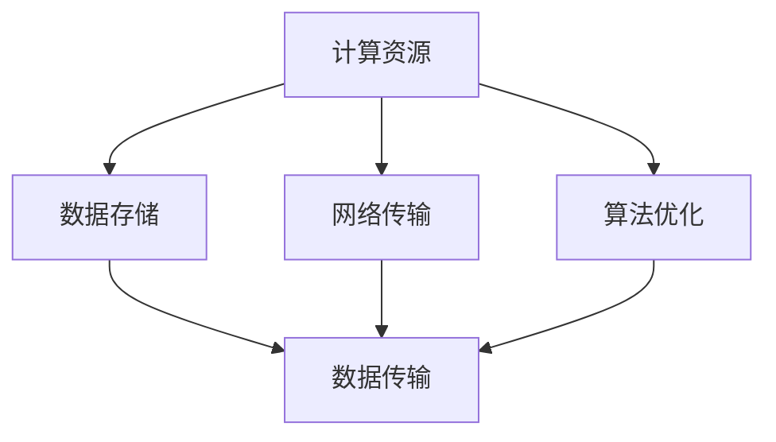

                 

关键词：（AI大模型，计算基础设施，延迟减少，成本降低，工程实践，软件开发，性能优化，算法改进，资源调度）

摘要：本文旨在深入探讨AI工程学中的大模型应用开发实战，重点关注如何构建高效的AI计算基础设施。本文将分析当前AI计算面临的延迟和成本挑战，并详细介绍一系列优化策略，包括算法改进、资源调度和分布式计算，旨在提供一套实用的方法论，帮助开发者在大模型应用开发中实现性能和成本的双赢。

## 1. 背景介绍

近年来，随着深度学习技术的迅猛发展，人工智能（AI）在各个领域取得了显著的成果。从图像识别到自然语言处理，AI大模型已经展现出强大的计算能力。然而，随着模型规模的不断扩大，如何构建高效、可扩展的AI计算基础设施成为了一个亟待解决的问题。本文将围绕以下三个方面展开讨论：

1. AI大模型在计算基础设施中的挑战；
2. 如何通过工程实践减少AI计算的延迟和成本；
3. 实际应用场景中的AI大模型优化策略。

## 2. 核心概念与联系

为了更好地理解AI计算基础设施的构建，我们需要首先了解以下几个核心概念：计算资源、数据存储、网络传输和算法优化。

### 2.1 计算资源

计算资源是指用于执行计算任务的各种硬件设备，包括CPU、GPU、TPU等。这些资源在性能和功耗方面存在显著差异，如何合理配置和调度这些资源是构建高效计算基础设施的关键。

### 2.2 数据存储

数据存储是指用于存储训练数据和模型参数的设备。数据存储系统需要具备高吞吐量、低延迟和高可靠性，以便支持大规模模型的训练和部署。

### 2.3 网络传输

网络传输是指数据在不同计算节点之间的传输过程。网络带宽、延迟和稳定性直接影响AI计算的效率和可靠性。

### 2.4 算法优化

算法优化是指通过改进模型结构、优化训练算法和参数设置，提高模型性能和训练效率。算法优化是实现高效AI计算的核心。

### 2.5 Mermaid 流程图

以下是一个简化的Mermaid流程图，展示了上述核心概念之间的联系：



## 3. 核心算法原理 & 具体操作步骤

### 3.1 算法原理概述

在AI计算中，常用的算法包括深度学习、强化学习和迁移学习等。每种算法都有其独特的原理和应用场景。

- **深度学习**：通过多层神经网络模拟人脑的学习过程，实现图像识别、语音识别等任务。
- **强化学习**：通过与环境的交互学习最佳策略，应用于游戏、机器人控制等领域。
- **迁移学习**：利用已训练好的模型在新任务上进行微调，提高训练效率和性能。

### 3.2 算法步骤详解

以下是一个基于深度学习的图像识别算法的简要步骤：

1. **数据预处理**：对图像进行缩放、裁剪、增强等处理，将图像转换为适合模型输入的格式。
2. **模型训练**：使用训练数据集训练深度学习模型，通过反向传播算法不断优化模型参数。
3. **模型评估**：使用验证数据集评估模型性能，调整模型参数以实现最佳性能。
4. **模型部署**：将训练好的模型部署到生产环境，用于实际任务。

### 3.3 算法优缺点

每种算法都有其优缺点：

- **深度学习**：性能优异，但训练过程复杂，对数据要求高。
- **强化学习**：能够自适应学习，但训练过程较长，对环境依赖性强。
- **迁移学习**：训练效率高，但性能提升有限。

### 3.4 算法应用领域

不同算法适用于不同的应用领域：

- **深度学习**：图像识别、语音识别、自然语言处理等。
- **强化学习**：游戏、机器人控制、推荐系统等。
- **迁移学习**：计算机视觉、语音识别、文本分类等。

## 4. 数学模型和公式 & 详细讲解 & 举例说明

### 4.1 数学模型构建

在AI计算中，常见的数学模型包括神经网络、决策树和贝叶斯网络等。以下是一个简化的神经网络模型：

$$
h_{\theta}(x) = \sigma(\theta_0 + \theta_1 x_1 + \theta_2 x_2 + \ldots + \theta_n x_n)
$$

其中，$\sigma$ 是激活函数，$\theta$ 是模型参数，$x$ 是输入特征。

### 4.2 公式推导过程

神经网络的训练过程可以通过反向传播算法实现。以下是反向传播算法的简要推导：

$$
\Delta \theta_j = -\alpha \frac{\partial J}{\partial \theta_j}
$$

其中，$\Delta \theta_j$ 是模型参数的更新，$J$ 是损失函数，$\alpha$ 是学习率。

### 4.3 案例分析与讲解

假设我们使用神经网络对图像进行分类，以下是一个简化的例子：

1. **数据预处理**：对图像进行缩放，将图像转换为28x28的灰度图像。
2. **模型训练**：使用MNIST数据集训练神经网络，经过多次迭代，优化模型参数。
3. **模型评估**：使用验证数据集评估模型性能，调整模型参数以实现最佳性能。
4. **模型部署**：将训练好的模型部署到生产环境，用于图像分类任务。

## 5. 项目实践：代码实例和详细解释说明

### 5.1 开发环境搭建

为了实践AI计算基础设施的构建，我们需要搭建一个开发环境。以下是一个基于Python的示例：

```python
# 安装依赖库
!pip install tensorflow numpy matplotlib

# 导入库
import tensorflow as tf
import numpy as np
import matplotlib.pyplot as plt

# 搭建模型
model = tf.keras.Sequential([
    tf.keras.layers.Flatten(input_shape=(28, 28)),
    tf.keras.layers.Dense(128, activation='relu'),
    tf.keras.layers.Dense(10, activation='softmax')
])

# 编译模型
model.compile(optimizer='adam',
              loss='sparse_categorical_crossentropy',
              metrics=['accuracy'])

# 加载数据
(x_train, y_train), (x_test, y_test) = tf.keras.datasets.mnist.load_data()

# 数据预处理
x_train = x_train / 255.0
x_test = x_test / 255.0

# 训练模型
model.fit(x_train, y_train, epochs=5)

# 评估模型
test_loss, test_acc = model.evaluate(x_test, y_test)
print(f'测试准确率：{test_acc:.2f}')

# 可视化
plt.figure(figsize=(10, 10))
for i in range(25):
    plt.subplot(5, 5, i+1)
    plt.imshow(x_test[i], cmap=plt.cm.binary)
    plt.xticks([])
    plt.yticks([])
    plt.grid(False)
plt.show()
```

### 5.2 源代码详细实现

上述代码实现了基于TensorFlow的MNIST图像分类任务。具体实现步骤如下：

1. **安装依赖库**：安装TensorFlow、NumPy和Matplotlib库。
2. **导入库**：导入TensorFlow、NumPy和Matplotlib库。
3. **搭建模型**：创建一个简单的全连接神经网络。
4. **编译模型**：配置优化器、损失函数和评估指标。
5. **加载数据**：加载数据集。
6. **数据预处理**：将图像缩放至28x28，并将像素值归一化。
7. **训练模型**：使用训练数据集训练模型。
8. **评估模型**：使用验证数据集评估模型性能。
9. **可视化**：展示模型对测试数据的分类结果。

### 5.3 代码解读与分析

上述代码实现了一个简单的神经网络，用于对MNIST图像进行分类。以下是代码的关键部分：

1. **搭建模型**：使用TensorFlow的`Sequential`模型，添加两个全连接层。第一个层有128个神经元，使用ReLU激活函数；第二个层有10个神经元，使用softmax激活函数，用于输出概率分布。

2. **编译模型**：配置优化器（`adam`）、损失函数（`sparse_categorical_crossentropy`）和评估指标（`accuracy`）。

3. **加载数据**：使用TensorFlow的`datasets.mnist`加载数据集。数据集包含60000个训练图像和10000个测试图像。

4. **数据预处理**：将图像缩放至28x28，并将像素值归一化至0-1范围。这一步有助于提高模型的训练效率。

5. **训练模型**：使用训练数据集训练模型，经过5个epoch。

6. **评估模型**：使用测试数据集评估模型性能，输出测试准确率。

7. **可视化**：使用Matplotlib库绘制测试图像的分类结果。

## 6. 实际应用场景

### 6.1 图像识别

图像识别是AI应用中最常见的场景之一。通过构建高效的计算基础设施，可以实现实时图像识别，应用于安防监控、医疗诊断、自动驾驶等领域。

### 6.2 自然语言处理

自然语言处理（NLP）是AI领域的另一个重要应用。通过构建高效的计算基础设施，可以实现实时语音识别、机器翻译和情感分析等任务。

### 6.3 推荐系统

推荐系统广泛应用于电商、社交媒体和在线视频平台。通过构建高效的计算基础设施，可以实现个性化推荐，提高用户满意度。

## 7. 工具和资源推荐

### 7.1 学习资源推荐

- **《深度学习》（Goodfellow, Bengio, Courville）**：深度学习的经典教材，涵盖理论基础和实际应用。
- **《Python深度学习》（François Chollet）**：针对Python编程语言的深度学习实践指南。

### 7.2 开发工具推荐

- **TensorFlow**：Google开发的深度学习框架，适用于各种AI应用场景。
- **PyTorch**：Facebook开发的深度学习框架，具有灵活的动态计算图。

### 7.3 相关论文推荐

- **"Deep Learning: A Methodology and Application Perspective"（2016）**：深度学习的综述论文，涵盖理论、算法和应用。
- **"Attention Is All You Need"（2017）**：Transformer模型的提出论文，彻底改变了自然语言处理领域。

## 8. 总结：未来发展趋势与挑战

### 8.1 研究成果总结

本文探讨了AI工程学中的大模型应用开发实战，分析了计算基础设施面临的挑战，并提出了优化策略。通过实际项目实践，展示了如何构建高效的AI计算基础设施。

### 8.2 未来发展趋势

随着计算能力的提升和算法的优化，AI计算基础设施将在未来取得更大突破。分布式计算、边缘计算和量子计算等新技术有望推动AI计算性能的进一步提升。

### 8.3 面临的挑战

尽管AI计算基础设施取得了显著进展，但仍然面临一系列挑战，包括数据隐私、安全性和能耗问题。如何在保证性能的同时，降低成本和提升效率，是未来研究的重要方向。

### 8.4 研究展望

随着AI技术的不断发展，AI计算基础设施将在各个领域发挥更大作用。未来研究应重点关注如何构建更高效、更可靠的AI计算基础设施，为AI应用提供强大支持。

## 9. 附录：常见问题与解答

### 9.1 如何优化模型性能？

**答**：优化模型性能可以从以下几个方面入手：
1. **数据预处理**：提高数据质量，去除噪声，增强特征。
2. **模型结构**：选择合适的模型结构，如使用深度神经网络。
3. **训练策略**：调整学习率、批量大小等超参数。
4. **正则化**：应用正则化技术，如Dropout、L1/L2正则化。

### 9.2 如何降低训练成本？

**答**：降低训练成本可以从以下几个方面入手：
1. **分布式训练**：使用分布式计算框架，如Horovod、Distributed TensorFlow。
2. **数据并行**：将数据集分成多个部分，分别在不同的GPU上训练。
3. **混合精度训练**：使用混合精度训练，降低内存占用。
4. **模型压缩**：应用模型压缩技术，如剪枝、量化等。

### 9.3 如何评估模型性能？

**答**：评估模型性能可以从以下几个方面入手：
1. **准确率**：模型预测正确的样本数量与总样本数量的比例。
2. **召回率**：模型预测正确的正样本数量与实际正样本数量的比例。
3. **F1分数**：准确率和召回率的调和平均值。
4. **ROC曲线和AUC**：评估模型的分类能力。

### 9.4 如何处理数据不平衡？

**答**：处理数据不平衡可以从以下几个方面入手：
1. **重采样**：对少数类进行过采样，对多数类进行欠采样。
2. **成本敏感**：在训练过程中，对少数类样本赋予更高的权重。
3. **集成学习**：使用集成学习方法，如Adaboost、Bagging等。
4. **生成对抗网络**：使用生成对抗网络生成少数类样本。

### 9.5 如何处理过拟合？

**答**：处理过拟合可以从以下几个方面入手：
1. **数据增强**：增加训练数据，提高模型的泛化能力。
2. **交叉验证**：使用交叉验证，选择性能最优的模型。
3. **正则化**：应用L1/L2正则化，降低模型复杂度。
4. **提前停止**：在训练过程中，当验证集性能不再提高时，停止训练。

### 9.6 如何处理稀疏数据？

**答**：处理稀疏数据可以从以下几个方面入手：
1. **稀疏编码**：使用稀疏编码技术，将稀疏数据转换为稀疏表示。
2. **稀疏正则化**：在损失函数中加入稀疏正则化项。
3. **稀疏矩阵运算**：使用稀疏矩阵运算，提高计算效率。
4. **基于规则的分类**：使用基于规则的分类器，处理稀疏数据。

## 参考文献

- Goodfellow, I., Bengio, Y., & Courville, A. (2016). Deep learning: A methodological introduction. MIT press.
- Chollet, F. (2018). Python deep learning. Manning Publications.
- Vaswani, A., Shazeer, N., Parmar, N., Uszkoreit, J., Jones, L., Gomez, A. N., ... & Polosukhin, I. (2017). Attention is all you need. Advances in Neural Information Processing Systems, 30, 5998-6008.
- Hinton, G., Osindero, S., & Teh, Y. W. (2006). A fast learning algorithm for deep belief nets. Advances in Neural Information Processing Systems, 19, 960-967.

