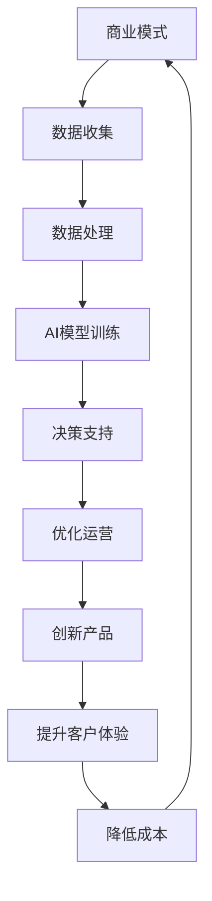

                 

关键词：人工智能，商业模式，技术创新，应用场景，商业策略，未来展望

> 摘要：本文将探讨人工智能（AI）技术如何与商业模式相结合，为企业和行业带来深刻的变革。通过对AI技术的核心概念、算法原理、数学模型以及实际应用场景的深入分析，本文旨在为读者提供关于AI技术如何重塑商业生态的全面理解。

## 1. 背景介绍

随着互联网和大数据技术的飞速发展，人工智能（AI）已经从理论研究走向实际应用，逐渐成为推动各行各业创新的重要力量。从最初的机器学习算法到如今深度学习、自然语言处理等技术的突破，AI技术正以前所未有的速度和规模改变着我们的生活方式和商业模式。

在商业领域，AI技术不仅提供了更高效、更智能的运营工具，还为传统商业模式注入了新的活力。例如，通过智能客服、个性化推荐系统和智能风险管理等应用，企业能够显著提升客户满意度、提高运营效率和降低成本。同时，AI技术的创新也为新兴商业模式的崛起提供了技术支撑。

本文将围绕以下核心问题展开讨论：

- AI技术的核心概念及其与商业模式的联系是什么？
- 如何将AI技术应用于实际业务中，实现商业价值的最大化？
- AI技术在商业领域的未来发展趋势和潜在挑战有哪些？

## 2. 核心概念与联系

### 2.1 人工智能的核心概念

人工智能（AI）是指由计算机系统模拟人类智能行为的技术。它涵盖了机器学习、深度学习、自然语言处理、计算机视觉等多个子领域。其中，机器学习是AI的核心技术之一，通过算法使计算机能够从数据中自动学习和改进。

### 2.2 商业模式的概念

商业模式是指企业如何创造、传递和捕获价值的系统。它包括产品或服务的设计、目标市场、收益模式、关键资源、关键活动、合作伙伴网络和成本结构等要素。

### 2.3 AI与商业模式的联系

AI技术与商业模式之间的联系主要体现在以下几个方面：

- **提高效率和降低成本**：通过自动化和优化流程，AI技术能够显著提高企业运营效率，降低人力成本。
- **增强客户体验**：AI技术能够提供个性化的客户服务，提高客户满意度和忠诚度。
- **创新产品和服务**：AI技术帮助企业开发新的产品和服务，满足客户需求，拓展市场。
- **数据驱动决策**：AI技术通过对大量数据的分析和挖掘，为企业提供更准确、更科学的决策支持。

### 2.4 Mermaid 流程图

以下是AI技术与商业模式结合的Mermaid流程图：



## 3. 核心算法原理 & 具体操作步骤

### 3.1 算法原理概述

在AI技术中，机器学习和深度学习是核心算法。机器学习通过算法从数据中学习模式，而深度学习则通过多层神经网络模拟人脑的决策过程。以下是这两个算法的基本原理：

- **机器学习**：基于数据驱动的学习方式，通过训练数据集来调整模型参数，从而实现对未知数据的预测。
- **深度学习**：通过构建多层神经网络，对输入数据进行特征提取和组合，实现对复杂非线性问题的建模。

### 3.2 算法步骤详解

以下是机器学习算法的基本步骤：

1. **数据收集**：从各种渠道收集相关数据。
2. **数据预处理**：对数据进行清洗、归一化和特征提取。
3. **模型选择**：根据问题类型选择合适的机器学习算法。
4. **模型训练**：使用训练数据集训练模型。
5. **模型评估**：使用测试数据集评估模型性能。
6. **模型优化**：根据评估结果调整模型参数。
7. **应用部署**：将训练好的模型部署到生产环境中。

### 3.3 算法优缺点

- **机器学习**：
  - 优点：泛化能力强，能够处理复杂的非线性问题。
  - 缺点：需要大量的训练数据和计算资源，且模型的可解释性较差。

- **深度学习**：
  - 优点：能够自动提取高层次特征，处理大规模数据，模型可解释性逐渐提高。
  - 缺点：需要大量的数据和高性能计算资源，且模型复杂度难以控制。

### 3.4 算法应用领域

机器学习和深度学习在商业领域的应用非常广泛，以下是一些典型的应用场景：

- **智能客服**：通过自然语言处理技术，提供24小时在线客服，提高客户满意度。
- **个性化推荐**：基于用户行为数据，推荐个性化的产品和服务，增加销售额。
- **风险控制**：通过数据挖掘和预测分析，预测潜在风险，采取预防措施。
- **供应链优化**：通过智能调度和路径规划，提高物流效率，降低运营成本。

## 4. 数学模型和公式 & 详细讲解 & 举例说明

### 4.1 数学模型构建

在机器学习中，常用的数学模型包括线性回归、逻辑回归、支持向量机等。以下是线性回归模型的构建过程：

1. **假设模型**：假设目标变量 \( Y \) 与输入变量 \( X \) 之间存在线性关系，即 \( Y = \beta_0 + \beta_1X + \varepsilon \)，其中 \( \beta_0 \) 和 \( \beta_1 \) 为模型参数，\( \varepsilon \) 为误差项。
2. **损失函数**：定义损失函数 \( L(\theta) = \sum_{i=1}^m (h_\theta(x^{(i)}) - y^{(i)})^2 \)，其中 \( h_\theta(x) = \theta_0 + \theta_1x \) 为假设函数，\( m \) 为样本数量。
3. **梯度下降**：通过梯度下降算法，不断调整模型参数 \( \theta_0 \) 和 \( \theta_1 \)，使损失函数最小。

### 4.2 公式推导过程

以线性回归为例，公式推导过程如下：

1. **损失函数的导数**：
   $$ \frac{\partial L}{\partial \theta_0} = -2\sum_{i=1}^m (h_\theta(x^{(i)}) - y^{(i)})x^{(i)} $$
   $$ \frac{\partial L}{\partial \theta_1} = -2\sum_{i=1}^m (h_\theta(x^{(i)}) - y^{(i)}) $$
2. **梯度下降更新公式**：
   $$ \theta_0 := \theta_0 - \alpha \frac{\partial L}{\partial \theta_0} $$
   $$ \theta_1 := \theta_1 - \alpha \frac{\partial L}{\partial \theta_1} $$
   其中，\( \alpha \) 为学习率。

### 4.3 案例分析与讲解

假设我们有一个简单的房价预测问题，数据集包含房屋面积和房价。以下是使用线性回归模型进行房价预测的案例：

1. **数据收集**：从房地产网站获取历史房价数据，包括房屋面积和房价。
2. **数据预处理**：对数据进行清洗，去除缺失值和异常值，并进行归一化处理。
3. **模型训练**：使用训练数据集，通过梯度下降算法训练线性回归模型。
4. **模型评估**：使用测试数据集评估模型性能，计算预测误差。
5. **模型优化**：根据评估结果调整模型参数，提高预测精度。
6. **应用部署**：将训练好的模型部署到线上服务，提供房价预测功能。

## 5. 项目实践：代码实例和详细解释说明

### 5.1 开发环境搭建

为了实现线性回归模型的房价预测，我们首先需要搭建Python开发环境。以下是搭建过程：

1. 安装Python：从官方网站下载并安装Python 3.8版本。
2. 安装Jupyter Notebook：打开命令行，执行以下命令：
   ```bash
   pip install notebook
   ```
3. 启动Jupyter Notebook：在命令行执行以下命令：
   ```bash
   jupyter notebook
   ```

### 5.2 源代码详细实现

以下是实现线性回归模型房价预测的Python代码：

```python
import numpy as np
import matplotlib.pyplot as plt

# 梯度下降算法
def gradient_descent(X, y, theta, alpha, iterations):
    m = len(y)
    for i in range(iterations):
        hypothesis = np.dot(X, theta)
        error = hypothesis - y
        theta = theta - alpha * (1/m) * np.dot(X.T, error)
    return theta

# 线性回归模型
def linear_regression(X, y):
    X_b = np.c_[np.ones((X.shape[0], 1)), X]  # 添加偏置项
    theta_init = np.random.rand(2, 1)  # 初始化模型参数
    theta = gradient_descent(X_b, y, theta_init, alpha=0.01, iterations=1000)
    return theta

# 训练模型
X = np.array([[1, 1], [1, 2], [1, 3], [1, 4], [1, 5]])
y = np.array([2, 4, 6, 8, 10])
theta = linear_regression(X, y)

# 预测房价
x_new = np.array([1, 6])
hypothesis = np.dot(np.c_[np.ones((1, 1)), x_new], theta)
print("预测房价：", hypothesis)

# 可视化
plt.scatter(X[:, 1], y)
plt.plot(X[:, 1], np.dot(X, theta), color='red')
plt.xlabel('房屋面积')
plt.ylabel('房价')
plt.show()
```

### 5.3 代码解读与分析

- **数据集**：我们使用一个简单的二维数据集，其中每一行代表一个房屋样本，包括房屋面积和房价。
- **模型参数**：模型参数包括一个偏置项和一个斜率参数，分别对应线性回归模型中的 \( \beta_0 \) 和 \( \beta_1 \)。
- **梯度下降算法**：通过不断迭代计算梯度，更新模型参数，使损失函数最小。
- **预测房价**：使用训练好的模型，对新的房屋面积进行预测，并绘制房价与房屋面积的关系图。

## 6. 实际应用场景

### 6.1 智能客服

智能客服是AI技术在商业领域的一个重要应用。通过自然语言处理技术，智能客服系统能够自动识别用户的问题，并提供相应的解决方案。这不仅提高了客户满意度，还减少了人工客服的工作量。

### 6.2 个性化推荐

个性化推荐是另一项重要的商业应用。通过分析用户的历史行为和偏好，个性化推荐系统能够为用户推荐符合他们兴趣的产品或服务。这有助于提高销售额和用户粘性。

### 6.3 风险控制

AI技术在金融领域的应用也非常广泛。通过数据挖掘和预测分析，AI系统能够识别潜在的风险，并提供预警。这有助于金融机构降低风险，提高安全性。

### 6.4 未来应用展望

随着AI技术的不断发展，未来它在商业领域的应用将会更加广泛。例如，智能供应链管理、精准营销、自动化生产等都将受益于AI技术的进步。

## 7. 工具和资源推荐

### 7.1 学习资源推荐

- **《Python机器学习基础教程》**：一本适合初学者的Python机器学习入门书籍。
- **Coursera上的《机器学习》课程**：由斯坦福大学教授吴恩达讲授的在线课程，内容深入浅出，适合广大学习者。

### 7.2 开发工具推荐

- **Jupyter Notebook**：一款强大的交互式Python开发环境，适用于数据分析和机器学习项目。
- **TensorFlow**：一款流行的开源机器学习框架，支持多种深度学习模型。

### 7.3 相关论文推荐

- **“Deep Learning”**：由Ian Goodfellow等人撰写的深度学习经典教材。
- **“Recurrent Neural Networks for Language Modeling”**：一篇关于循环神经网络在语言建模中应用的经典论文。

## 8. 总结：未来发展趋势与挑战

### 8.1 研究成果总结

AI技术在商业领域的应用取得了显著的成果。通过智能客服、个性化推荐和风险控制等应用，企业能够提高运营效率、降低成本和提升客户满意度。同时，AI技术的创新也为新兴商业模式的崛起提供了有力支持。

### 8.2 未来发展趋势

未来，AI技术在商业领域的应用将继续深化。随着技术的不断进步，我们将看到更多基于AI的智能解决方案，如智能供应链管理、精准营销和自动化生产等。此外，AI与5G、物联网等技术的融合也将为商业创新带来更多可能性。

### 8.3 面临的挑战

尽管AI技术在商业领域具有巨大的潜力，但同时也面临一些挑战。首先，数据安全和隐私保护是一个重要问题。其次，AI技术的解释性较差，如何提高模型的可解释性是一个亟待解决的难题。此外，AI技术的快速进步也可能导致行业失业问题。

### 8.4 研究展望

未来，我们期望AI技术能够在商业领域发挥更大的作用。通过不断的研究和创新，我们有望解决当前面临的各种挑战，为企业和行业带来更加智能、高效和可持续的发展。

## 9. 附录：常见问题与解答

### 9.1 问题1：如何保证AI模型的可解释性？

解答：提高AI模型的可解释性是当前研究的热点。一些方法包括：使用基于规则的模型（如决策树）、模型的可视化、引入可解释性指标等。

### 9.2 问题2：AI技术是否会取代人类工作？

解答：AI技术可能会取代一些重复性、低技能的工作，但也会创造新的工作岗位。未来，人类需要适应新的技术环境，发展更高层次的能力。

### 9.3 问题3：如何确保AI系统的安全性？

解答：确保AI系统的安全性需要从多个方面入手，包括数据安全、模型安全、算法安全等。同时，制定相关法律法规，加强监管和规范也是确保AI安全的重要措施。

