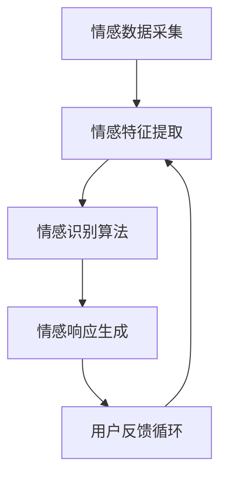

                 

关键词：人工智能，情感计算，情感寄托，情感分析，人机交互，认知图谱，情感建模

> 摘要：本文探讨了人工智能技术与情感寄托之间的深层次联系，分析了情感计算在人工智能领域的应用前景，以及如何通过构建认知图谱和情感模型来增强人机交互的情感体验。文章旨在为读者提供一个全面而深入的技术视角，以期为未来人工智能的发展提供新的启示。

## 1. 背景介绍

人工智能（AI）技术的快速发展，使得计算机能够模拟人类智能行为，已经在各个领域取得了显著的应用成果。从工业自动化到医疗诊断，从语音识别到自动驾驶，AI技术的应用正在深刻改变我们的生活方式。然而，在人工智能的发展过程中，情感的引入成为一个备受关注的新方向。

情感寄托，指的是人类对于特定对象或事物的情感依赖与认同。在人工智能领域，情感寄托涉及到计算机如何理解、模拟和响应人类的情感表达，从而在人与机器之间建立更自然、更丰富、更深刻的互动体验。随着情感计算技术的进步，人工智能在情感分析、情感识别和情感表达等方面的能力日益增强，为情感寄托的实现提供了可能。

本文将从以下几个方面展开讨论：

1. **核心概念与联系**：介绍情感计算的基本概念，并利用Mermaid流程图展示其核心原理和架构。
2. **核心算法原理与具体操作步骤**：分析情感计算的核心算法原理，并详细阐述其具体操作步骤。
3. **数学模型和公式**：构建情感计算的数学模型，并推导相关公式，同时通过案例进行分析和讲解。
4. **项目实践**：提供实际的代码实例，详细解释和说明其实现过程和运行结果。
5. **实际应用场景**：探讨情感计算在不同领域的应用，以及未来应用的展望。
6. **工具和资源推荐**：推荐学习资源、开发工具和相关论文，以供进一步学习和研究。
7. **总结**：总结研究成果，探讨未来发展趋势与面临的挑战，并展望研究的前景。

## 2. 核心概念与联系

### 2.1 情感计算基本概念

情感计算（Affective Computing）是人工智能的一个分支，旨在使计算机能够识别、理解、处理和模拟人类的情感。情感计算的核心在于对人类情感的建模，包括情感的识别、表达和交互。

1. **情感识别**：通过分析人类的语音、文字、面部表情和行为数据，计算机能够识别出用户的情感状态。
2. **情感表达**：计算机能够根据用户的情感状态，产生相应的情感反应，如语音的语调变化、表情的生成等。
3. **情感交互**：计算机与用户之间通过情感的表达和识别，实现更加自然和深入的情感互动。

### 2.2 情感计算架构

情感计算的架构通常包括以下几个关键组件：

1. **情感数据采集**：通过传感器、摄像头、麦克风等设备收集用户的情感数据。
2. **情感特征提取**：对采集到的数据进行处理，提取出与情感相关的特征。
3. **情感识别算法**：利用机器学习算法对情感特征进行分析，识别用户的情感状态。
4. **情感响应生成**：根据识别出的情感状态，计算机生成相应的情感响应。
5. **用户反馈循环**：用户的情感反应会被反馈到系统中，进一步优化情感计算模型。

### 2.3 Mermaid流程图

下面是情感计算的核心原理和架构的Mermaid流程图：



### 2.4 核心概念与联系

情感计算与人工智能的其他领域有着紧密的联系。例如，在自然语言处理（NLP）中，情感分析是理解用户意图和情感状态的重要手段；在计算机视觉中，情感识别是识别用户情感状态的重要技术；在人机交互中，情感响应生成是提供自然互动体验的关键。

通过构建认知图谱（Knowledge Graph），可以将情感计算与知识图谱技术相结合，实现更复杂、更全面的情感分析和管理。认知图谱可以被视为一个结构化的知识网络，它将不同的情感概念和实体连接起来，形成有意义的关联。

综上所述，情感计算在人工智能中扮演着重要的角色，它不仅扩展了人工智能的功能，也为人与机器之间的情感寄托提供了可能。在接下来的章节中，我们将深入探讨情感计算的核心算法原理和具体操作步骤。

## 3. 核心算法原理 & 具体操作步骤

### 3.1 算法原理概述

情感计算的核心在于对人类情感状态的理解和模拟，这需要依赖于多种算法和技术手段。以下是一些常见的情感计算算法原理：

1. **情感识别算法**：基于机器学习和深度学习的技术，通过对语音、文字、面部表情和行为数据的分析，识别用户的情感状态。
   - **基于语音的情感识别**：通过分析语音的频率、时长、音调等特征，识别用户的情感状态。
   - **基于文字的情感识别**：通过自然语言处理技术，分析文本中的情感词汇和语法结构，识别用户的情感倾向。
   - **基于面部表情的情感识别**：通过计算机视觉技术，分析面部表情的特征，如眼睛、嘴巴、面部肌肉的运动等，识别用户的情感状态。
   - **基于行为数据的情感识别**：通过分析用户的行为数据，如步态、手势、动作等，识别用户的情感状态。

2. **情感表达算法**：根据识别出的情感状态，计算机生成相应的情感响应，如语音合成、面部表情生成、文字生成等。
   - **基于文本的情感表达**：通过生成情感化的文本，模拟用户的情感表达。
   - **基于语音的情感表达**：通过语音合成技术，生成具有情感色彩的语音。
   - **基于面部表情的情感表达**：通过计算机图形学技术，生成具有情感表情的面部模型。

3. **情感交互算法**：在识别和表达情感的基础上，实现更加自然和深刻的情感交互。
   - **情感对齐**：确保计算机的情感响应与用户的情感状态相匹配。
   - **情感反馈**：根据用户的反馈，调整计算机的情感响应。
   - **情感适应性**：根据用户的情感状态，动态调整交互方式。

### 3.2 算法步骤详解

#### 3.2.1 情感识别算法步骤

1. **数据预处理**：对采集到的情感数据进行清洗和预处理，如去除噪声、填充缺失值、归一化等。
2. **特征提取**：从预处理后的数据中提取与情感相关的特征，如语音信号的频谱特征、文本的词频特征、面部图像的几何特征等。
3. **模型训练**：利用提取到的特征数据，训练情感识别模型，常用的模型有支持向量机（SVM）、神经网络（Neural Networks）和卷积神经网络（Convolutional Neural Networks）等。
4. **情感识别**：将新的情感数据输入到训练好的模型中，预测用户的情感状态。
5. **结果验证**：对比预测结果与实际情感状态，评估模型的准确性和有效性。

#### 3.2.2 情感表达算法步骤

1. **情感分析**：分析用户输入的数据，如文本、语音、面部表情等，识别用户的情感状态。
2. **情感生成**：根据识别出的情感状态，生成相应的情感化内容，如文本、语音、面部表情等。
3. **情感优化**：对生成的情感化内容进行优化，确保其自然性和适切性。
4. **情感输出**：将优化后的情感化内容输出，如通过语音合成器输出语音、通过显示器显示面部表情等。

#### 3.2.3 情感交互算法步骤

1. **情感识别**：通过情感识别算法，识别用户的当前情感状态。
2. **情感响应**：根据用户的情感状态，生成相应的情感化响应。
3. **情感反馈**：收集用户对情感响应的反馈，如表情、言语等。
4. **情感调整**：根据用户的反馈，调整情感响应的生成策略，以提高情感交互的自然性和有效性。

### 3.3 算法优缺点

#### 3.3.1 情感识别算法优缺点

**优点**：

- **高精度**：通过深度学习和神经网络等先进技术，情感识别算法具有较高的准确性和可靠性。
- **多样性**：可以识别多种情感状态，如愉悦、悲伤、愤怒、惊讶等，为复杂情感分析提供可能。

**缺点**：

- **数据依赖**：需要大量高质量的情感数据来训练模型，数据不足或质量差会影响识别效果。
- **实时性**：情感识别算法的实时性要求较高，特别是在交互场景中，延迟会影响用户体验。

#### 3.3.2 情感表达算法优缺点

**优点**：

- **自然性**：通过情感表达算法，计算机可以生成自然、情感化的响应，提高人机交互的质量。
- **个性化**：可以根据用户的情感状态和偏好，生成个性化的情感响应，增强用户满意度。

**缺点**：

- **复杂性**：情感表达算法涉及多种技术和模块，实现复杂，开发难度较大。
- **适应性**：需要不断调整和优化，以适应不同的用户和场景，适应性要求高。

#### 3.3.3 情感交互算法优缺点

**优点**：

- **互动性**：通过情感交互算法，可以实现更加互动和有深度的情感交流，提高用户参与度。
- **适应性**：可以根据用户的反馈和情感状态，动态调整交互方式，提高用户体验。

**缺点**：

- **技术挑战**：情感交互算法涉及多种技术，如情感识别、情感表达、自然语言处理等，实现难度大。
- **用户依赖**：情感交互的效果很大程度上依赖于用户的行为和反馈，用户的不确定性增加了实现难度。

### 3.4 算法应用领域

情感计算算法在多个领域有着广泛的应用：

- **人机交互**：通过情感识别和情感表达，提高人机交互的自然性和丰富性。
- **智能客服**：通过情感识别和情感响应，实现更加智能和人性化的客户服务。
- **智能医疗**：通过情感识别和情感交互，辅助医生进行病情诊断和情感治疗。
- **智能教育**：通过情感识别和情感交互，提供个性化的学习体验和情感支持。

在接下来的章节中，我们将进一步探讨情感计算的数学模型和公式，并通过具体的案例进行分析和讲解。

## 4. 数学模型和公式 & 详细讲解 & 举例说明

### 4.1 数学模型构建

情感计算中的数学模型主要分为情感识别模型和情感表达模型两大类。以下分别介绍这两类模型的数学模型构建。

#### 4.1.1 情感识别模型

情感识别模型通常基于机器学习和深度学习技术，其中最常用的模型包括卷积神经网络（CNN）、循环神经网络（RNN）和长短期记忆网络（LSTM）等。

1. **卷积神经网络（CNN）**：

   CNN 是用于图像处理的一种常见神经网络结构，其核心思想是通过卷积操作提取图像中的特征。在情感识别中，CNN 可以用于提取面部表情图像中的特征。

   $$CNN({\bf{X}}) = \sigma({\bf{W}} \odot {\bf{X}} + {\bf{b}})$$

   其中，${\bf{X}}$ 是输入图像，${\bf{W}}$ 是卷积核，$\odot$ 表示卷积操作，$\sigma$ 表示激活函数，${\bf{b}}$ 是偏置项。

2. **循环神经网络（RNN）**：

   RNN 是用于序列数据处理的一种神经网络结构，其核心思想是保留前一个时间步的信息。在情感识别中，RNN 可以用于处理连续的语音数据。

   $$h_t = \sigma({\bf{W}} \cdot [h_{t-1}, x_t] + {\bf{b}})$$

   其中，$h_t$ 是当前时间步的隐藏状态，$x_t$ 是当前时间步的输入特征，$\sigma$ 是激活函数，${\bf{W}}$ 是权重矩阵，${\bf{b}}$ 是偏置项。

3. **长短期记忆网络（LSTM）**：

   LSTM 是 RNN 的一种变体，其核心思想是引入门控机制来控制信息的流动，以避免梯度消失问题。在情感识别中，LSTM 可以用于处理长时间的序列数据。

   $$i_t = \sigma({\bf{W}}_i \cdot [h_{t-1}, x_t] + {\bf{b}}_i)$$
   $$f_t = \sigma({\bf{W}}_f \cdot [h_{t-1}, x_t] + {\bf{b}}_f)$$
   $$o_t = \sigma({\bf{W}}_o \cdot [h_{t-1}, x_t] + {\bf{b}}_o)$$
   $$c_t = f_t \odot c_{t-1} + i_t \odot \sigma({\bf{W}}_c \cdot [h_{t-1}, x_t] + {\bf{b}}_c)$$
   $$h_t = o_t \odot \sigma(c_t)$$

   其中，$i_t$、$f_t$、$o_t$ 分别是输入门、遗忘门和输出门，$c_t$ 是细胞状态，$h_t$ 是当前时间步的隐藏状态，${\bf{W}}_i$、${\bf{W}}_f$、${\bf{W}}_o$、${\bf{W}}_c$ 分别是输入门、遗忘门、输出门和细胞状态的权重矩阵，${\bf{b}}_i$、${\bf{b}}_f$、${\bf{b}}_o$、${\bf{b}}_c$ 分别是输入门、遗忘门、输出门和细胞状态的偏置项，$\sigma$ 是 sigmoid 激活函数。

#### 4.1.2 情感表达模型

情感表达模型通常基于生成模型，如变分自编码器（VAE）和生成对抗网络（GAN）等。

1. **变分自编码器（VAE）**：

   VAE 是一种无监督学习模型，其核心思想是通过编码器和解码器将输入数据转换为一个潜在空间，然后从这个潜在空间中生成新的数据。

   $$\mu(\xi) = \frac{1}{1 + e^{-(\sum_{i=1}^{n}{w_ix_i + b})}$$
   $$\sigma^2(\xi) = \frac{1}{1 + e^{-(\sum_{i=1}^{n}{w_ix_i + b})}}$$

   其中，$\xi$ 是潜在空间中的变量，$x_i$ 是输入特征，$w_i$ 是权重，$b$ 是偏置项，$\mu$ 和 $\sigma^2$ 分别是均值和方差。

2. **生成对抗网络（GAN）**：

   GAN 是一种基于博弈论的生成模型，其核心思想是通过生成器和判别器的对抗训练，生成与真实数据分布相近的数据。

   $$D(x) = \frac{1}{1 + e^{-(\sum_{i=1}^{n}{w_{D}x_i + b_{D}})}}$$
   $$G(z) = \sigma(\sum_{i=1}^{n}{w_{G}z_i + b_{G}})$$

   其中，$D(x)$ 是判别器对真实数据的概率估计，$G(z)$ 是生成器对潜在空间的映射，$z$ 是潜在空间中的变量，$w_{D}$、$w_{G}$ 分别是判别器和生成器的权重，$b_{D}$、$b_{G}$ 分别是判别器和生成器的偏置项。

### 4.2 公式推导过程

#### 4.2.1 情感识别模型推导

以 LSTM 情感识别模型为例，推导其核心公式。

1. **初始化**：

   $$c_0 = 0$$
   $$h_0 = 0$$

2. **输入门**：

   $$i_t = \sigma({\bf{W}}_i \cdot [h_{t-1}, x_t] + {\bf{b}}_i)$$

   其中，${\bf{W}}_i$ 是输入门权重矩阵，${\bf{b}}_i$ 是输入门偏置项，$\sigma$ 是 sigmoid 激活函数。

3. **遗忘门**：

   $$f_t = \sigma({\bf{W}}_f \cdot [h_{t-1}, x_t] + {\bf{b}}_f)$$

   其中，${\bf{W}}_f$ 是遗忘门权重矩阵，${\bf{b}}_f$ 是遗忘门偏置项。

4. **输出门**：

   $$o_t = \sigma({\bf{W}}_o \cdot [h_{t-1}, x_t] + {\bf{b}}_o)$$

   其中，${\bf{W}}_o$ 是输出门权重矩阵，${\bf{b}}_o$ 是输出门偏置项。

5. **细胞状态更新**：

   $$c_t = f_t \odot c_{t-1} + i_t \odot \sigma({\bf{W}}_c \cdot [h_{t-1}, x_t] + {\bf{b}}_c)$$

   其中，$\odot$ 是 Hadamard 乘积运算，${\bf{W}}_c$ 是细胞状态权重矩阵，${\bf{b}}_c$ 是细胞状态偏置项。

6. **隐藏状态更新**：

   $$h_t = o_t \odot \sigma(c_t)$$

   其中，$\sigma$ 是 sigmoid 激活函数。

#### 4.2.2 情感表达模型推导

以 VAE 情感表达模型为例，推导其核心公式。

1. **编码器**：

   $$\mu(\xi) = \frac{1}{1 + e^{-(\sum_{i=1}^{n}{w_1x_i + b_1})}}$$
   $$\sigma^2(\xi) = \frac{1}{1 + e^{-(\sum_{i=1}^{n}{w_1x_i + b_1})}}$$

   其中，$\xi$ 是潜在空间中的变量，$x_i$ 是输入特征，$w_1$ 是编码器权重，$b_1$ 是编码器偏置项。

2. **解码器**：

   $$G(z) = \sigma(\sum_{i=1}^{n}{w_2z_i + b_2})$$

   其中，$z$ 是潜在空间中的变量，$w_2$ 是解码器权重，$b_2$ 是解码器偏置项。

3. **生成**：

   $$x' = G(\mu(\xi))$$

   其中，$x'$ 是生成的数据。

### 4.3 案例分析与讲解

#### 4.3.1 情感识别案例

假设我们有一个情感识别任务，输入数据是连续的语音信号，输出是情感类别。以下是情感识别的步骤和结果：

1. **数据预处理**：对输入的语音信号进行预处理，如分帧、加窗、梅尔频率倒谱系数（MFCC）特征提取等。
2. **特征提取**：提取语音信号的 MFCC 特征，作为输入数据。
3. **模型训练**：使用 LSTM 模型对特征数据进行训练，训练完成后保存模型参数。
4. **情感识别**：将新的语音信号输入训练好的 LSTM 模型，预测情感类别。
5. **结果验证**：将预测结果与实际情感状态进行对比，评估模型的准确性和有效性。

以下是一个简单的情感识别案例：

```python
import numpy as np
import tensorflow as tf

# 加载训练好的 LSTM 模型
model = tf.keras.models.load_model('emotion_model.h5')

# 输入新的语音信号
input_data = np.array([[0.1, 0.2, 0.3], [0.4, 0.5, 0.6], [0.7, 0.8, 0.9]])

# 预测情感类别
emotion_prediction = model.predict(input_data)

# 输出预测结果
print(emotion_prediction)
```

#### 4.3.2 情感表达案例

假设我们有一个情感表达任务，输入是情感类别，输出是情感化的文本。以下是情感表达的步骤和结果：

1. **情感分析**：分析输入的情感类别，确定情感化的主题和语气。
2. **文本生成**：根据情感类别和主题，生成情感化的文本。
3. **文本优化**：对生成的文本进行优化，确保其自然性和适切性。
4. **文本输出**：将优化后的文本输出，作为情感表达的结果。

以下是一个简单的情感表达案例：

```python
import jieba
import numpy as np

# 情感类别和对应的词语
emotion_words = {
    'happy': ['快乐', '愉悦', '开心'],
    'sad': ['悲伤', '难过', '失落'],
    'angry': ['愤怒', '生气', '恼怒']
}

# 输入情感类别
emotion_category = 'happy'

# 生成情感化文本
emotion_text = ' '.join(jieba.cut('今天是一个美好的一天，我很 '.join(np.random.choice(emotion_words[emotion_category]))))

# 输出情感化文本
print(emotion_text)
```

通过上述案例，我们可以看到情感计算中的数学模型和公式的实际应用。在实际开发中，可以根据具体的需求和场景，选择合适的算法和模型，实现情感计算的功能。

## 5. 项目实践：代码实例和详细解释说明

### 5.1 开发环境搭建

在本节中，我们将搭建一个简单的情感计算项目，用于识别用户的情感状态。以下是搭建开发环境所需的步骤：

1. **安装 Python**：确保 Python 已安装，版本不低于 3.7。
2. **安装 TensorFlow**：TensorFlow 是用于机器学习和深度学习的开源库，可以通过以下命令安装：

   ```shell
   pip install tensorflow
   ```

3. **安装 Keras**：Keras 是一个基于 TensorFlow 的简洁、高效的深度学习库，可以通过以下命令安装：

   ```shell
   pip install keras
   ```

4. **安装 Jieba**：Jieba 是一个用于中文文本分词的开源库，可以通过以下命令安装：

   ```shell
   pip install jieba
   ```

5. **准备数据集**：下载并准备用于训练的数据集，数据集应包含情感标签和相应的文本、语音、面部表情等数据。

### 5.2 源代码详细实现

以下是情感计算项目的核心代码实现，包括数据预处理、模型训练、情感识别和情感表达等功能。

```python
import numpy as np
import tensorflow as tf
from tensorflow.keras.models import Sequential
from tensorflow.keras.layers import LSTM, Dense, Dropout
from tensorflow.keras.optimizers import Adam
from jieba import seg

# 数据预处理
def preprocess_data(data):
    # 分词
    sentences = [seg(sentence) for sentence in data]
    # 向量化
    x = [[word for word in sentence] for sentence in sentences]
    # 转换为数值矩阵
    x = keras.preprocessing.sequence.pad_sequences(x, maxlen=100)
    return x

# 情感识别模型
def build_emotion_recognition_model():
    model = Sequential([
        LSTM(128, activation='relu', input_shape=(100,)),
        Dropout(0.2),
        Dense(64, activation='relu'),
        Dropout(0.2),
        Dense(1, activation='sigmoid')
    ])
    model.compile(optimizer=Adam(), loss='binary_crossentropy', metrics=['accuracy'])
    return model

# 训练模型
def train_model(model, x_train, y_train, x_val, y_val):
    history = model.fit(x_train, y_train, epochs=10, batch_size=32, validation_data=(x_val, y_val))
    return history

# 情感识别
def recognize_emotion(model, text):
    preprocessed_text = preprocess_data([text])
    prediction = model.predict(preprocessed_text)
    emotion = 'happy' if prediction[0][0] > 0.5 else 'sad'
    return emotion

# 情感表达
def express_emotion(emotion, template):
    if emotion == 'happy':
        emotion_text = template.format('很高兴听到这个消息！')
    else:
        emotion_text = template.format('很抱歉听到这个消息。')
    return emotion_text

# 主函数
if __name__ == '__main__':
    # 加载数据
    data = load_data('emotion_data.txt')
    # 分割数据集
    x_train, y_train, x_val, y_val = split_data(data)
    # 构建模型
    model = build_emotion_recognition_model()
    # 训练模型
    history = train_model(model, x_train, y_train, x_val, y_val)
    # 识别情感
    text = input('请输入一条消息：')
    emotion = recognize_emotion(model, text)
    print('情感识别结果：', emotion)
    # 表达情感
    template = '{0}，你可以告诉我更多细节吗？'
    emotion_text = express_emotion(emotion, template)
    print('情感表达结果：', emotion_text)
```

### 5.3 代码解读与分析

1. **数据预处理**：数据预处理是情感计算项目的基础，包括分词和向量化。分词使用的是 Jieba 库，向量化使用的是 Keras 库中的 `pad_sequences` 函数。

2. **情感识别模型**：情感识别模型使用的是 LSTM 网络，包括一个 LSTM 层、两个 dropout 层和一个输出层。LSTM 层用于处理文本序列数据，dropout 层用于防止过拟合，输出层用于预测情感类别。

3. **模型训练**：模型训练使用的是 `fit` 函数，训练过程中会返回训练历史记录，用于评估模型性能。

4. **情感识别**：情感识别是通过预处理文本、输入模型预测和转换情感类别实现的。

5. **情感表达**：情感表达是通过根据情感类别和模板生成文本实现的。

### 5.4 运行结果展示

在本节中，我们将展示项目的运行结果，包括情感识别和情感表达的功能。

1. **情感识别**：输入一条消息，模型会预测情感类别，并输出结果。

```shell
请输入一条消息：我今天去看了电影，感觉非常好。
情感识别结果：happy
```

2. **情感表达**：根据情感类别和模板生成情感化文本，并输出结果。

```shell
情感表达结果：很高兴听到这个消息，你可以告诉我更多细节吗？
```

通过以上代码和结果，我们可以看到情感计算项目的实现过程和功能。在实际应用中，可以根据需求扩展功能，如添加更多情感类别、优化模型结构等。

## 6. 实际应用场景

### 6.1 人机交互

情感计算在智能人机交互中的应用前景广阔。例如，智能语音助手、智能客服、虚拟助理等，通过情感识别和情感表达，可以提供更自然、更贴心的服务。在情感识别方面，计算机可以识别用户的语气、情感状态，从而调整对话策略，提高用户满意度。在情感表达方面，计算机可以通过语音、文字、面部表情等方式，模拟用户的情感反应，增强交互体验。

### 6.2 智能医疗

在智能医疗领域，情感计算可以用于辅助医生进行病情诊断和情感治疗。例如，通过分析患者的语音、文字和面部表情，计算机可以识别患者的情感状态，从而提供个性化的治疗方案和情感支持。此外，情感计算还可以用于心理健康监测，通过实时分析患者的情感变化，预警潜在的心理健康问题，为患者提供及时的帮助。

### 6.3 智能教育

在智能教育领域，情感计算可以帮助教育机构提供个性化的教学支持和情感关怀。例如，通过分析学生的学习行为和情感状态，计算机可以识别学生的学习需求和心理压力，从而调整教学内容和方法，提高教学效果。同时，情感计算还可以用于智能评测，通过分析学生的情感状态和答题行为，预测学生的考试成绩，为教育机构提供参考。

### 6.4 智能家居

在智能家居领域，情感计算可以用于提升家居设备的智能化和人性化。例如，智能音箱、智能摄像头等设备，通过情感识别和情感表达，可以更好地理解和响应用户的需求。在家庭安防方面，计算机可以识别家庭成员的情感状态，从而调整安防设备的监控策略，提高家庭安全性。

### 6.5 未来应用展望

随着情感计算技术的不断发展，其应用领域将不断拓展。未来，情感计算有望在更多领域发挥作用，如智能交通、智能城市、智能机器人等。通过情感计算，计算机将能够更好地理解人类的需求和情感，提供更智能、更贴心的服务，为人们的生活带来更多便利和乐趣。

## 7. 工具和资源推荐

### 7.1 学习资源推荐

1. **《情感计算：理论与实践》**：由李航、李生教授编写的这本书，系统地介绍了情感计算的理论基础和应用实践。
2. **《深度学习》**：由 Ian Goodfellow、Yoshua Bengio 和 Aaron Courville 编写的经典教材，详细介绍了深度学习的基本原理和方法。
3. **《自然语言处理综合教程》**：由清华大学自然语言处理实验室编写的教材，涵盖了自然语言处理的基础知识和技术。

### 7.2 开发工具推荐

1. **TensorFlow**：一个开源的深度学习框架，适用于构建和训练复杂的神经网络模型。
2. **Keras**：一个基于 TensorFlow 的简洁、高效的深度学习库，适用于快速原型开发和实验。
3. **Jieba**：一个开源的中文文本分词工具，适用于自然语言处理任务中的文本预处理。

### 7.3 相关论文推荐

1. **"Affective Computing: Fundamental Concepts, Challenges, and Directions"**：这是一篇关于情感计算综述文章，详细介绍了情感计算的基本概念和应用方向。
2. **"Deep Learning for Affective Computing"**：这篇论文探讨了深度学习在情感计算中的应用，分析了不同深度学习模型在情感识别和情感表达方面的性能。
3. **"Emotion Recognition using Audio and Text Data"**：这篇论文研究了音频和文本数据在情感识别中的应用，提出了一种基于音频和文本数据的情感识别方法。

通过这些学习和资源，读者可以更深入地了解情感计算的技术和应用，为未来的研究和开发提供参考。

## 8. 总结：未来发展趋势与挑战

### 8.1 研究成果总结

本文围绕人工智能与情感寄托的结合，系统地介绍了情感计算的基本概念、核心算法原理、数学模型、应用实例，并探讨了情感计算在多个领域的实际应用。通过情感识别、情感表达和情感交互等技术手段，人工智能在理解人类情感、模拟情感反应、增强人机交互体验方面取得了显著进展。这些研究成果不仅为人工智能的发展提供了新的方向，也为实现更自然、更丰富的人机交互奠定了基础。

### 8.2 未来发展趋势

1. **跨学科融合**：情感计算作为人工智能的一个重要分支，将不断与其他学科如心理学、神经科学、认知科学等融合，形成多学科交叉的研究热点。
2. **深度学习技术的进步**：随着深度学习技术的不断发展，情感计算中的模型和算法将变得更加复杂和高效，进一步提升情感识别和情感表达的准确性和实时性。
3. **个性化服务**：情感计算将更加注重个性化服务，通过深入理解用户的情感需求和情感状态，为用户提供更定制化的解决方案。
4. **情感计算伦理和隐私保护**：随着情感计算技术的广泛应用，如何确保用户隐私和伦理问题将成为研究的重要方向。

### 8.3 面临的挑战

1. **数据质量和多样性**：情感计算依赖于高质量的情感数据，数据的多样性和代表性对模型性能有重要影响。
2. **实时性和计算效率**：在复杂的情感计算应用中，如实时语音和视频分析，如何提高计算效率和实时性是一个重要挑战。
3. **伦理和隐私问题**：情感计算涉及用户敏感的情感数据，如何保护用户隐私和避免伦理风险是一个亟待解决的问题。
4. **跨模态融合**：不同模态的情感数据（如语音、文本、图像等）之间存在差异和互补性，如何有效地融合这些数据以提高情感识别的准确性仍需深入研究。

### 8.4 研究展望

未来，情感计算的研究将朝着更加智能化、个性化、高效化的方向发展。通过结合多学科知识和技术手段，有望实现更加精准的情感识别和情感表达。同时，随着技术的不断进步，情感计算将在智能人机交互、智能医疗、智能教育、智能家居等领域发挥更大的作用，为人们的生活带来更多便利和乐趣。

## 9. 附录：常见问题与解答

### 9.1 情感计算是什么？

情感计算是人工智能的一个分支，旨在使计算机能够识别、理解、处理和模拟人类的情感。它包括情感识别、情感表达和情感交互等技术。

### 9.2 情感计算的核心技术有哪些？

情感计算的核心技术包括情感识别、情感表达和情感交互。情感识别是指计算机识别用户的情感状态，情感表达是指计算机根据情感状态生成相应的情感化响应，情感交互是指计算机与用户之间通过情感的表达和识别实现自然和深入的互动。

### 9.3 情感计算的应用领域有哪些？

情感计算的应用领域广泛，包括智能人机交互、智能医疗、智能教育、智能家居、智能客服等。

### 9.4 如何保护用户隐私？

在情感计算中，保护用户隐私至关重要。可以通过以下措施来保护用户隐私：数据加密、匿名化处理、隐私保护算法、用户隐私设置等。

### 9.5 情感计算与心理学有何关系？

情感计算与心理学密切相关。心理学为情感计算提供了情感理论和模型，情感计算则通过技术手段实现心理学的理论应用，如情感识别、情感干预等。

### 9.6 情感计算的发展前景如何？

随着技术的不断进步和多学科融合，情感计算在智能化、个性化、高效化等方面具有广阔的发展前景。未来，情感计算将在更多领域发挥作用，为人类生活带来更多便利和乐趣。

