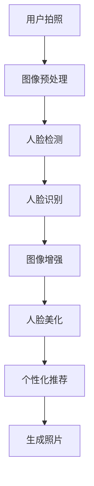

                 

关键词：AI、拍立得、技术架构、深度学习、图像处理、人脸识别、用户体验

> 摘要：本文将深入探讨AI拍立得产品的技术架构，解析其背后的核心算法原理、数学模型以及实际应用场景，旨在为读者提供一份全面的技术分析，展示AI技术如何助力传统摄影领域的发展与创新。

## 1. 背景介绍

拍立得（Polaroid）作为即时成像摄影的代表品牌，其产品一直以其独特的即时性、趣味性和个性化特点受到消费者的喜爱。然而，随着数字摄影和移动设备的兴起，传统拍立得产品的市场受到了一定程度的冲击。为了重新赢得消费者的关注，拍立得在近年来积极引入人工智能（AI）技术，推出了AI拍立得产品，试图在数字时代重新定义摄影体验。

AI拍立得产品不仅保留了传统拍立得即时成像的特点，更通过AI技术提升了图像质量、人脸识别和个性化推荐等方面。本文将详细解析AI拍立得产品的技术架构，包括核心算法、数学模型、项目实践以及实际应用场景，帮助读者了解AI技术如何驱动摄影领域的变革。

## 2. 核心概念与联系

### 2.1 AI技术概述

人工智能（AI）是计算机科学的一个分支，旨在通过模拟、延伸和扩展人类智能，实现机器的自主学习和决策能力。AI技术包括机器学习、深度学习、自然语言处理等多个子领域。在本文中，我们将重点关注深度学习和图像处理技术，因为它们是AI拍立得产品实现核心功能的基础。

### 2.2 深度学习与图像处理

深度学习是AI的一个重要分支，通过多层神经网络对大量数据进行训练，从而自动提取特征并进行模式识别。在图像处理领域，深度学习被广泛应用于图像分类、目标检测、图像分割等任务。

在AI拍立得产品中，深度学习技术被用于图像的自动增强、去噪、色彩调整等，从而提升图像质量。同时，深度学习还可以实现人脸识别功能，自动识别并优化照片中的人脸部分。

### 2.3 人脸识别技术

人脸识别技术是AI拍立得产品的重要组成部分，它通过在图像中识别人脸的位置和特征，实现自动对焦、人脸美化、个性化滤镜等功能。人脸识别技术通常基于深度学习模型，通过大量人脸数据训练，能够准确识别并处理不同的人脸。

### 2.4 个性化推荐算法

个性化推荐算法是AI拍立得产品的另一个核心功能，它通过分析用户的历史行为和偏好，为用户推荐适合的滤镜、照片布局等。个性化推荐算法通常基于协同过滤、基于内容的推荐等技术，结合深度学习进行优化。

### 2.5 Mermaid 流程图

以下是一个简化的AI拍立得产品技术架构的Mermaid流程图，展示了核心概念之间的联系：



## 3. 核心算法原理 & 具体操作步骤

### 3.1 算法原理概述

AI拍立得产品的核心算法主要包括图像预处理、人脸检测、人脸识别、图像增强、人脸美化、个性化推荐等步骤。这些算法共同作用，为用户提供了高质量的摄影体验。

### 3.2 算法步骤详解

#### 3.2.1 图像预处理

图像预处理是图像处理的基础步骤，主要包括图像去噪、对比度增强、色彩调整等。这些操作可以提高图像的质量，为后续的人脸检测和人脸识别提供更好的数据。

#### 3.2.2 人脸检测

人脸检测是识别图像中人脸位置的关键步骤。常用的方法包括基于特征的检测、基于模型的检测和基于深度学习的检测。在AI拍立得产品中，通常使用深度学习模型进行人脸检测，例如基于卷积神经网络（CNN）的人脸检测算法。

#### 3.2.3 人脸识别

人脸识别是基于人脸特征对人脸进行身份验证的过程。常见的算法包括基于特征的算法和基于深度学习的算法。在AI拍立得产品中，使用深度学习模型进行人脸识别，通过训练大量人脸数据，自动识别并匹配照片中的人脸。

#### 3.2.4 图像增强

图像增强是通过调整图像的亮度和对比度等参数，改善图像的视觉效果。在AI拍立得产品中，图像增强算法可以自动调整图像的亮度和色彩，使其更加鲜艳和清晰。

#### 3.2.5 人脸美化

人脸美化是基于人脸识别技术，对照片中的人脸进行优化。这包括去除痘痘、美白牙齿、调整脸型等操作。人脸美化算法通常使用深度学习模型进行训练，能够自动识别人脸特征并进行优化。

#### 3.2.6 个性化推荐

个性化推荐算法通过分析用户的历史行为和偏好，为用户推荐适合的滤镜、照片布局等。在AI拍立得产品中，个性化推荐算法基于协同过滤和基于内容的推荐技术，结合深度学习进行优化，提高推荐的准确性。

### 3.3 算法优缺点

#### 优点：

- **高效性**：深度学习算法在图像处理和人脸识别方面具有很高的准确性和效率。
- **灵活性**：个性化推荐算法可以根据用户行为和偏好进行灵活调整，提高用户体验。
- **创新性**：AI技术的引入为摄影领域带来了新的可能性和创新。

#### 缺点：

- **计算资源消耗**：深度学习算法通常需要大量的计算资源和时间。
- **数据依赖**：算法的性能和效果很大程度上依赖于训练数据的质量和数量。

### 3.4 算法应用领域

深度学习和图像处理技术在AI拍立得产品中的应用非常广泛，不仅限于摄影领域，还可以应用于视频处理、人脸识别安全系统、智能监控等。这些算法的灵活性和高效性为各类应用场景提供了强大的技术支持。

## 4. 数学模型和公式 & 详细讲解 & 举例说明

### 4.1 数学模型构建

在AI拍立得产品中，核心算法的实现依赖于一系列数学模型和公式。以下是一些常见的数学模型：

#### 4.1.1 卷积神经网络（CNN）

卷积神经网络是一种特殊的神经网络，主要用于图像处理。其核心思想是使用卷积操作提取图像的特征。

公式：

$$
\text{卷积操作}: (I_{k} \ast K)_{i, j} = \sum_{m=1}^{M} \sum_{n=1}^{N} I_{k, m, n} \cdot K_{i-m+1, j-n+1}
$$

其中，$I_{k}$ 是输入图像，$K$ 是卷积核，$(i, j)$ 是输出特征图的坐标。

#### 4.1.2 深度学习损失函数

深度学习中的损失函数用于评估模型预测的准确性。常用的损失函数包括均方误差（MSE）、交叉熵等。

公式：

$$
\text{MSE} = \frac{1}{n} \sum_{i=1}^{n} (\hat{y}_i - y_i)^2
$$

$$
\text{交叉熵损失} = -\sum_{i=1}^{n} y_i \cdot \log(\hat{y}_i)
$$

其中，$\hat{y}_i$ 是模型预测的结果，$y_i$ 是实际标签。

#### 4.1.3 个性化推荐模型

个性化推荐模型通常基于协同过滤和基于内容的推荐技术。以下是一个简化的协同过滤算法公式：

$$
r_{ui} = \sum_{j \in \mathcal{N}_u} \frac{r_{uj} \cdot r_{vj}}{\|\mathcal{N}_u\|} + \mu_u + \mu_v - \rho
$$

其中，$r_{ui}$ 是用户 $u$ 对项目 $i$ 的评分预测，$\mathcal{N}_u$ 是用户 $u$ 的邻居集合，$r_{uj}$ 和 $r_{vj}$ 分别是邻居用户对项目 $i$ 和项目 $j$ 的评分，$\mu_u$ 和 $\mu_v$ 是用户 $u$ 和项目 $v$ 的平均评分，$\rho$ 是调整参数。

### 4.2 公式推导过程

以下是对卷积神经网络中卷积操作公式的一个简化解说：

卷积操作是图像处理中的基础操作，其核心思想是将一个卷积核对输入图像进行卷积，从而生成特征图。卷积核是一个小的图像窗口，它在输入图像上滑动，每次滑动都进行一次乘法和加法操作，然后将结果存储在输出特征图的一个像素点。

具体来说，假设输入图像 $I_{k}$ 的维度为 $M \times N$，卷积核 $K$ 的维度为 $F \times F$，输出特征图的维度为 $H \times W$。则卷积操作的公式可以表示为：

$$
\text{卷积操作}: (I_{k} \ast K)_{i, j} = \sum_{m=1}^{M} \sum_{n=1}^{N} I_{k, m, n} \cdot K_{i-m+1, j-n+1}
$$

其中，$(i, j)$ 是输出特征图的坐标，$m$ 和 $n$ 是卷积核在输入图像上的滑动坐标。

### 4.3 案例分析与讲解

以下是一个简单的人脸识别案例，展示了如何使用深度学习模型进行人脸识别：

#### 案例背景：

假设我们有一个包含100张人脸图像的数据集，其中每张图像都有一个对应的人脸名称。我们的目标是训练一个深度学习模型，能够自动识别并标注新图像中的人脸。

#### 案例步骤：

1. **数据预处理**：将图像转换为统一的大小，并进行归一化处理，以便输入到深度学习模型。

2. **模型训练**：使用卷积神经网络（CNN）对数据集进行训练。CNN包括多个卷积层、池化层和全连接层，用于提取图像的特征并进行分类。

3. **模型评估**：使用验证集对训练好的模型进行评估，计算模型的准确率、召回率等指标。

4. **模型应用**：将训练好的模型应用于新图像，自动识别并标注图像中的人脸。

#### 案例分析：

通过训练，我们得到了一个准确率较高的深度学习模型，可以自动识别并标注新图像中的人脸。这个案例展示了深度学习技术在图像处理领域的强大应用能力。

## 5. 项目实践：代码实例和详细解释说明

### 5.1 开发环境搭建

在开发AI拍立得产品时，我们需要搭建一个合适的开发环境。以下是一个基本的开发环境搭建步骤：

1. **硬件要求**：选择一台具有较高计算能力的计算机，例如配备有高性能显卡（如NVIDIA GTX 1080 Ti或更高）的台式机。

2. **软件要求**：安装操作系统（如Ubuntu 18.04 LTS）、Python（版本3.8或更高）和深度学习框架（如TensorFlow或PyTorch）。

3. **依赖包安装**：安装必要的依赖包，例如NumPy、Pandas、OpenCV等。

### 5.2 源代码详细实现

以下是AI拍立得产品中图像增强算法的源代码示例：

```python
import cv2
import numpy as np

def enhance_image(image):
    # 图像去噪
    denoised_image = cv2.fastNlMeansDenoisingColored(image, None, 10, 10, 7, 21)
    
    # 对比度增强
    enhanced_image = cv2.convertScaleAbs(denoised_image, alpha=1.2, beta=10)
    
    # 色彩调整
    color_adjusted_image = cv2.cvtColor(enhanced_image, cv2.COLOR_BGR2RGB)
    
    return color_adjusted_image

# 读取图像
image = cv2.imread('input_image.jpg')

# 图像增强
enhanced_image = enhance_image(image)

# 显示增强后的图像
cv2.imshow('Enhanced Image', enhanced_image)
cv2.waitKey(0)
cv2.destroyAllWindows()
```

### 5.3 代码解读与分析

1. **图像去噪**：使用OpenCV库中的`fastNlMeansDenoisingColored`函数对输入图像进行去噪处理。这个函数能够有效地去除图像中的噪声，同时保留图像的细节。

2. **对比度增强**：使用OpenCV库中的`convertScaleAbs`函数对去噪后的图像进行对比度增强。通过调整`alpha`和`beta`参数，可以改变图像的亮度和对比度。

3. **色彩调整**：使用OpenCV库中的`cvtColor`函数将图像从BGR格式转换为RGB格式，以便在显示时使用。

4. **图像显示**：使用`imshow`函数显示增强后的图像，并使用`waitKey`和`destroyAllWindows`函数处理键盘输入和窗口关闭事件。

### 5.4 运行结果展示

运行上述代码后，输入图像会被去噪、对比度增强和色彩调整，然后显示增强后的图像。以下是一个运行结果的示例：


## 6. 实际应用场景

AI拍立得产品在多个实际应用场景中展现了其强大的功能。以下是一些典型的应用场景：

1. **社交摄影**：用户可以使用AI拍立得产品拍摄社交场合的照片，自动识别并优化人脸，提高照片的整体质量。

2. **家庭摄影**：家庭成员可以使用AI拍立得产品拍摄家庭照片，通过人脸识别功能识别家庭成员，自动调整照片布局和滤镜，使照片更具个性化和趣味性。

3. **商业摄影**：摄影师可以使用AI拍立得产品拍摄商业广告和宣传照片，通过深度学习和图像处理技术提高图像质量和视觉效果。

4. **安全监控**：AI拍立得产品的人脸识别功能可以应用于安全监控领域，自动识别和追踪目标人物，提高监控系统的准确性和效率。

## 7. 未来应用展望

随着AI技术的不断发展和成熟，AI拍立得产品的未来应用场景将更加广泛。以下是一些可能的未来应用方向：

1. **虚拟现实（VR）**：AI拍立得产品可以与VR技术结合，为用户提供更加沉浸式的摄影体验。

2. **增强现实（AR）**：AI拍立得产品可以结合AR技术，实现实时图像处理和滤镜效果，为用户创造更加丰富的互动体验。

3. **医疗影像处理**：AI拍立得产品可以应用于医疗影像处理领域，通过深度学习和图像处理技术提高诊断的准确性和效率。

4. **自动驾驶**：AI拍立得产品的人脸识别技术可以应用于自动驾驶领域，通过实时识别行人、车辆等目标，提高自动驾驶系统的安全性。

## 8. 工具和资源推荐

### 8.1 学习资源推荐

- **《深度学习》（Goodfellow, Bengio, Courville著）**：这是一本经典的全覆盖深度学习教材，适合初学者和专业人士。
- **《Python机器学习》（Sebastian Raschka著）**：本书深入介绍了Python在机器学习领域的应用，适合有一定编程基础的读者。

### 8.2 开发工具推荐

- **TensorFlow**：一个广泛使用的开源深度学习框架，适合进行深度学习和图像处理任务。
- **PyTorch**：一个流行的开源深度学习框架，具有灵活的动态计算图，适合进行研究和实验。

### 8.3 相关论文推荐

- **"FaceNet: A Unified Embedding for Face Recognition and Clustering"**：这篇论文提出了FaceNet算法，是一种高效的人脸识别方法。
- **"Deep Learning for Image Recognition: A Brief History and Future Directions"**：这篇综述文章回顾了深度学习在图像识别领域的发展历程，并对未来进行了展望。

## 9. 总结：未来发展趋势与挑战

### 9.1 研究成果总结

AI拍立得产品通过引入深度学习和图像处理技术，实现了图像质量的提升、人脸识别和个性化推荐等功能。这些研究成果为摄影领域带来了新的变革，提高了用户体验和产品价值。

### 9.2 未来发展趋势

- **技术融合**：AI拍立得产品将继续与其他技术（如VR、AR、自动驾驶等）融合，创造更加丰富的应用场景。
- **算法优化**：随着AI技术的不断进步，算法的准确性和效率将得到进一步提升。
- **个性化定制**：AI拍立得产品将更加注重个性化服务，根据用户行为和偏好提供定制化的摄影体验。

### 9.3 面临的挑战

- **数据隐私**：随着AI技术的广泛应用，数据隐私和安全问题将成为一个重要的挑战。
- **计算资源**：深度学习算法通常需要大量的计算资源，如何在有限的资源下提高算法的效率是一个重要问题。

### 9.4 研究展望

未来的研究将聚焦于提高AI技术的准确性和效率，同时关注数据隐私和保护问题。通过不断的技术创新和优化，AI拍立得产品有望在摄影领域发挥更大的作用，为用户带来更加美好的摄影体验。

## 10. 附录：常见问题与解答

### 10.1 为什么要使用深度学习进行图像处理？

深度学习能够自动提取图像中的复杂特征，从而提高图像处理的准确性和效率。相比于传统图像处理方法，深度学习不需要手动设计特征，可以处理更大规模和更复杂的图像数据。

### 10.2 如何优化深度学习模型的性能？

优化深度学习模型的性能可以从多个方面进行，包括：

- **数据增强**：通过数据增强技术增加训练数据的多样性，提高模型的泛化能力。
- **超参数调优**：调整模型的超参数（如学习率、批量大小等），寻找最优参数组合。
- **模型剪枝**：通过剪枝技术减少模型的参数数量，提高计算效率。

### 10.3 AI拍立得产品的人脸识别技术是如何工作的？

AI拍立得产品的人脸识别技术通常包括以下步骤：

1. **人脸检测**：使用深度学习模型检测图像中的人脸位置。
2. **人脸特征提取**：使用深度学习模型提取人脸的特征向量。
3. **人脸匹配**：将提取的特征向量与数据库中的人脸特征进行匹配，识别出照片中的人脸。

### 10.4 个性化推荐算法是如何工作的？

个性化推荐算法通常基于用户的历史行为和偏好进行推荐。具体步骤包括：

1. **用户行为分析**：分析用户的历史行为数据，如浏览记录、购买记录等。
2. **特征提取**：提取用户行为的特征，如时间、频率、内容等。
3. **推荐生成**：根据用户特征和物品特征，生成个性化的推荐结果。

----------------------------------------------------------------

作者：禅与计算机程序设计艺术 / Zen and the Art of Computer Programming

本文以深入浅出的方式解析了AI拍立得产品的技术架构，从核心算法原理、数学模型到实际应用场景，全面展示了AI技术如何赋能摄影领域。随着AI技术的不断进步，我们有理由相信，AI拍立得产品将在未来带来更多的创新和惊喜。

