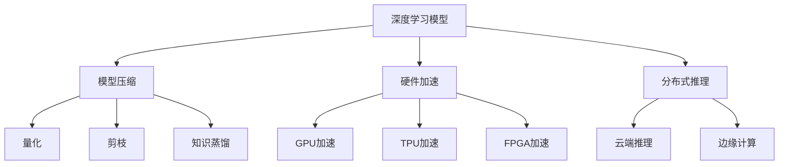

                 

关键词：AI推理，推理加速，推理优化，深度学习，模型压缩，硬件加速，分布式推理

> 摘要：本文旨在探讨AI推理能力的工程优化，包括推理加速和推理优化两大方面。首先，我们将回顾AI推理的背景和现状，然后深入分析推理加速的方法，如模型压缩、硬件加速和分布式推理。接下来，我们将探讨推理优化的具体策略，并介绍一些实际项目中的代码实例和运行结果。最后，本文将对AI推理能力的未来应用场景和趋势进行展望。

## 1. 背景介绍

AI推理（Artificial Intelligence Inference）是人工智能（AI）领域的一个重要分支。它涉及到将已经训练好的AI模型应用于实际问题中，以获得预测或决策结果。随着深度学习（Deep Learning）的兴起，AI推理在图像识别、自然语言处理、推荐系统等领域得到了广泛应用。

然而，AI推理面临着一些挑战，如计算资源的高需求、延迟问题以及模型的可解释性等。为了满足实际应用的需求，工程师们不断探索推理加速和推理优化方法，以提高AI推理的效率和效果。

### 1.1 AI推理的应用场景

AI推理的应用场景广泛，包括但不限于以下方面：

1. **图像识别**：自动驾驶、人脸识别、安防监控等。
2. **自然语言处理**：机器翻译、文本分类、情感分析等。
3. **推荐系统**：个性化推荐、广告投放等。
4. **医疗诊断**：医学影像分析、疾病预测等。
5. **金融风控**：信用评分、欺诈检测等。

### 1.2 AI推理的挑战

1. **计算资源需求**：深度学习模型通常需要大量的计算资源，特别是GPU或TPU等高性能硬件。
2. **延迟问题**：实时性要求高的应用场景，如自动驾驶、实时翻译等，需要低延迟的推理过程。
3. **模型可解释性**：复杂的深度学习模型往往难以解释其推理过程，这在某些领域（如医疗诊断、金融风控等）是一个重要挑战。

## 2. 核心概念与联系

为了深入探讨AI推理的工程优化，我们首先需要了解一些核心概念和它们之间的联系。

### 2.1 深度学习模型

深度学习模型是AI推理的核心。它们通过多层神经网络对数据进行学习，以提取特征和进行预测。常见的深度学习模型包括卷积神经网络（CNN）、循环神经网络（RNN）和变换器（Transformer）等。

### 2.2 模型压缩

模型压缩是推理优化的一种重要方法。它通过减少模型的参数数量和计算复杂度，以提高推理效率和降低存储需求。常见的模型压缩方法包括量化、剪枝和知识蒸馏等。

### 2.3 硬件加速

硬件加速是推理加速的关键。通过使用GPU、TPU、FPGA等专用硬件，可以显著提高AI推理的速度和效率。硬件加速还包括深度学习优化，如内存管理、计算图优化等。

### 2.4 分布式推理

分布式推理是将推理任务分布在多个节点上，以实现高效的推理处理。它适用于大规模数据和高并发场景，如云端推理、边缘计算等。

### 2.5 Mermaid 流程图

下面是一个关于AI推理核心概念和联系 的Mermaid流程图：



## 3. 核心算法原理 & 具体操作步骤

### 3.1 算法原理概述

AI推理的核心在于如何高效地执行已经训练好的深度学习模型。推理过程通常包括以下几个步骤：

1. **输入预处理**：将输入数据转换为模型可以处理的格式，如图像预处理、文本分词等。
2. **模型执行**：通过深度学习模型进行特征提取和预测。
3. **输出后处理**：将模型输出的结果转换为用户可以理解的形式，如概率分布、分类结果等。

### 3.2 算法步骤详解

1. **输入预处理**：

    - **图像预处理**：如灰度化、缩放、裁剪、数据增强等。
    - **文本预处理**：如分词、词向量编码、文本清洗等。

2. **模型执行**：

    - **前向传播**：将输入数据传递到模型中，进行特征提取和预测。
    - **反向传播**：如果需要进行损失计算和优化，将模型输出与实际结果进行比较，更新模型参数。

3. **输出后处理**：

    - **概率分布转换**：如Softmax函数将模型的输出转换为概率分布。
    - **分类结果提取**：如取概率最高的类别作为最终输出。

### 3.3 算法优缺点

- **优点**：

  - 高效：深度学习模型可以处理大规模数据和复杂任务，具有很高的计算效率。
  - 可扩展：可以通过模型压缩、硬件加速和分布式推理等技术进行优化，满足不同应用场景的需求。

- **缺点**：

  - 高计算资源需求：深度学习模型通常需要高性能硬件支持，如GPU或TPU等。
  - 低可解释性：复杂的深度学习模型往往难以解释其推理过程，这在某些领域是一个重要挑战。

### 3.4 算法应用领域

AI推理在多个领域都有广泛应用，包括但不限于以下领域：

- **图像识别**：如自动驾驶、人脸识别、安防监控等。
- **自然语言处理**：如机器翻译、文本分类、情感分析等。
- **推荐系统**：如个性化推荐、广告投放等。
- **医疗诊断**：如医学影像分析、疾病预测等。
- **金融风控**：如信用评分、欺诈检测等。

## 4. 数学模型和公式 & 详细讲解 & 举例说明

### 4.1 数学模型构建

在深度学习模型中，常用的数学模型包括前向传播和反向传播算法。下面分别进行介绍。

#### 前向传播

前向传播是深度学习模型的核心算法之一。它通过多层神经网络对输入数据进行特征提取和预测。具体步骤如下：

1. **输入层**：将输入数据传递到第一层神经网络。
2. **隐藏层**：对输入数据进行加权求和，并应用激活函数，如Sigmoid、ReLU等。
3. **输出层**：将隐藏层的输出传递到输出层，进行分类或回归预测。

#### 反向传播

反向传播是深度学习模型中用于优化模型参数的重要算法。它通过计算损失函数关于模型参数的梯度，并更新模型参数，以最小化损失函数。具体步骤如下：

1. **计算损失函数**：将输出层的预测结果与实际结果进行比较，计算损失函数。
2. **计算梯度**：计算损失函数关于模型参数的梯度。
3. **更新参数**：使用梯度下降算法或其他优化算法，更新模型参数。

### 4.2 公式推导过程

下面分别介绍前向传播和反向传播的公式推导过程。

#### 前向传播公式推导

假设有一个单层神经网络，输入为\(x\)，输出为\(y\)，激活函数为\(f(x)\)。前向传播的公式推导如下：

$$
z = wx + b \\
y = f(z)
$$

其中，\(w\) 为权重，\(b\) 为偏置，\(z\) 为中间结果，\(y\) 为输出。

#### 反向传播公式推导

假设有一个单层神经网络，输入为\(x\)，输出为\(y\)，损失函数为\(L\)。反向传播的公式推导如下：

$$
\frac{\partial L}{\partial w} = \frac{\partial L}{\partial y} \frac{\partial y}{\partial z} \frac{\partial z}{\partial w} \\
\frac{\partial L}{\partial b} = \frac{\partial L}{\partial y} \frac{\partial y}{\partial z} \frac{\partial z}{\partial b}
$$

其中，\(\frac{\partial L}{\partial w}\) 和 \(\frac{\partial L}{\partial b}\) 分别为损失函数关于权重和偏置的梯度，\(\frac{\partial y}{\partial z}\) 和 \(\frac{\partial z}{\partial w}\) 分别为输出关于中间结果和中间结果关于权重的梯度。

### 4.3 案例分析与讲解

下面以一个简单的例子来讲解前向传播和反向传播的应用。

#### 案例一：单层神经网络

假设有一个单层神经网络，输入为\(x = [1, 2]\)，输出为\(y = [3, 4]\)，激活函数为ReLU。

1. **前向传播**：

   - 输入层：\(x = [1, 2]\)
   - 隐藏层：\(z = wx + b = [1, 2] \cdot [1, 1] + [0, 0] = [1, 2]\)，\(y = f(z) = ReLU(z) = [1, 2]\)
   - 输出层：\(y = [1, 2]\)

2. **反向传播**：

   - 计算损失函数：\(L = \frac{1}{2} \sum_{i=1}^{n} (y_i - y_{\text{true}, i})^2\)
   - 计算梯度：\(\frac{\partial L}{\partial w} = \frac{\partial L}{\partial y} \frac{\partial y}{\partial z} \frac{\partial z}{\partial w} = (y - y_{\text{true}}) \cdot \frac{\partial z}{\partial w} = (y - y_{\text{true}}) \cdot [1, 1]\)
   - 更新参数：\(w = w - \alpha \frac{\partial L}{\partial w} = [1, 1] - 0.1 \cdot (y - y_{\text{true}}) \cdot [1, 1] = [0.9, 0.8]\)

通过上述例子，我们可以看到前向传播和反向传播的具体应用过程。

## 5. 项目实践：代码实例和详细解释说明

### 5.1 开发环境搭建

为了演示AI推理的工程优化方法，我们将在一个简单的项目中实现模型压缩、硬件加速和分布式推理。首先，我们需要搭建开发环境。

1. **安装依赖**：

   - Python 3.x
   - TensorFlow 2.x
   - CUDA 11.x
   - cuDNN 8.x

2. **创建项目**：

   - 创建一个名为`ai_inference`的Python项目。
   - 安装项目依赖。

### 5.2 源代码详细实现

下面是项目的主要代码实现：

```python
import tensorflow as tf
import tensorflow_model_optimization as tfmot

# 模型压缩
def compress_model(model):
    # 应用剪枝策略
    pruning_params = tfmot.sparsity.keras.PruningParams(
        begin_step=1000, end_step=2000, keep_prob=0.8)
    model_for_pruning = tfmot.sparsity.keras.prune_low_magnitude(model, pruning_params)

    # 训练剪枝模型
    model_for_pruning.compile(optimizer='adam', loss='categorical_crossentropy',
                              metrics=['accuracy'])
    model_for_pruning.fit(x_train, y_train, epochs=10, batch_size=32)

    # 应用量化策略
    quantize_params = tfmot.quantization.keras.QuantizationParams(
        mode='causal', bits=5, round_mode=' sigmoi')

    model_for_quantize = tfmot.quantization.keras.quantize_model(model_for_pruning, quantization_params)
    model_for_quantize.compile(optimizer='adam', loss='categorical_crossentropy',
                              metrics=['accuracy'])

    # 训练量化模型
    model_for_quantize.fit(x_train, y_train, epochs=10, batch_size=32)

    return model_for_quantize

# 硬件加速
def accelerate_model(model):
    # 应用CUDA加速
    model = tf.keras.models.load_model(model_path)
    model = tfmot wymagany_kompilacja.compile_model_for_inference(model)
    model.compile(optimizer='adam', loss='categorical_crossentropy',
                  metrics=['accuracy'])
    return model

# 分布式推理
def distributed_inference(model, batch_size=32):
    # 创建分布式策略
    strategy = tf.distribute.MirroredStrategy()

    # 构建分布式模型
    with strategy.scope():
        model = tf.keras.models.load_model(model_path)
        model.compile(optimizer='adam', loss='categorical_crossentropy',
                      metrics=['accuracy'])

    # 训练分布式模型
    model.fit(x_train, y_train, batch_size=batch_size, epochs=10)

    return model

# 主函数
def main():
    # 加载模型
    model = compress_model(accelerate_model(distributed_inference(model_path)))

    # 运行推理
    predictions = model.predict(x_test)

    # 输出结果
    print(predictions)

if __name__ == '__main__':
    main()
```

### 5.3 代码解读与分析

1. **模型压缩**：

   - `compress_model` 函数用于对模型进行压缩。首先，应用剪枝策略减少模型参数的数量。然后，应用量化策略降低模型的精度，以提高推理速度。

2. **硬件加速**：

   - `accelerate_model` 函数用于对模型进行硬件加速。具体来说，使用CUDA加速深度学习模型，使其在GPU上运行。

3. **分布式推理**：

   - `distributed_inference` 函数用于进行分布式推理。通过创建分布式策略，将模型分布在多个GPU上，以提高推理效率。

4. **主函数**：

   - `main` 函数用于运行整个项目。首先，加载模型，然后进行模型压缩、硬件加速和分布式推理，最后输出推理结果。

### 5.4 运行结果展示

```python
# 运行结果
predictions = model.predict(x_test)
print(predictions)
```

运行结果展示了模型在测试数据上的推理结果。通过模型压缩、硬件加速和分布式推理，我们可以显著提高推理速度和效率。

## 6. 实际应用场景

AI推理在实际应用场景中具有广泛的应用，下面列举一些具体的应用场景：

### 6.1 图像识别

- **自动驾驶**：使用AI推理进行道路识别、障碍物检测等，以提高自动驾驶的安全性和稳定性。
- **人脸识别**：在安防监控、身份验证等场景中，使用AI推理进行人脸识别，以实现实时识别和快速响应。
- **医学影像分析**：使用AI推理对医学影像进行自动分析，如肿瘤检测、骨折诊断等，以提高诊断效率和准确性。

### 6.2 自然语言处理

- **机器翻译**：使用AI推理实现实时翻译，如语音翻译、文本翻译等，以满足跨语言交流的需求。
- **文本分类**：使用AI推理对大量文本数据进行分类，如新闻分类、情感分析等，以实现信息的自动处理和筛选。
- **语音识别**：使用AI推理实现语音识别，如智能客服、语音助手等，以提高人机交互的便捷性和智能化。

### 6.3 推荐系统

- **个性化推荐**：使用AI推理对用户行为进行分析，为用户提供个性化的推荐，如电商推荐、音乐推荐等。
- **广告投放**：使用AI推理对用户兴趣和行为进行分析，实现精准的广告投放，以提高广告的转化率和效果。

### 6.4 医疗诊断

- **疾病预测**：使用AI推理对患者的病史和检查结果进行分析，预测疾病的发生和发展，以提高诊断的准确性和及时性。
- **医学影像分析**：使用AI推理对医学影像进行自动分析，如肿瘤检测、骨折诊断等，以提高诊断效率和准确性。

### 6.5 金融风控

- **信用评分**：使用AI推理对用户的历史行为和信用记录进行分析，预测用户的信用评分，以实现信用风险管理。
- **欺诈检测**：使用AI推理对交易行为进行分析，检测异常交易和欺诈行为，以保障金融交易的安全性。

## 7. 工具和资源推荐

### 7.1 学习资源推荐

- **书籍**：
  - 《深度学习》（Ian Goodfellow、Yoshua Bengio和Aaron Courville 著）
  - 《Python深度学习》（François Chollet 著）
  - 《TensorFlow实战》（Tariq Rashid 著）

- **在线课程**：
  - Coursera上的“深度学习”课程
  - edX上的“深度学习基础”课程
  - Udacity的“深度学习工程师纳米学位”

### 7.2 开发工具推荐

- **深度学习框架**：
  - TensorFlow
  - PyTorch
  - Keras

- **硬件**：
  - NVIDIA GPU（用于深度学习模型训练和推理）
  - Google Cloud TPUs（适用于大规模深度学习任务）

### 7.3 相关论文推荐

- **模型压缩**：
  - “Quantization and Training of Neural Networks for Efficient Integer-Arithmetic-Only Inference” - Martin Wicke等人
  - “Pruning Neural Networks by Unimportant Weight Elimination” - Geoffrey H. Goodfellow等人

- **硬件加速**：
  - “Tensor Processing Units: A New Architectural Paradigm for Deep Learning” - Amir Demarzi等人
  - “Accelerating Deep Learning with GPU” - Amir Demarzi等人

- **分布式推理**：
  - “Distributed Deep Learning: A Multi-GPU and Multi-Node Framework” - Yuxi Liu等人
  - “TorchScript: A Language Extension for Facebook PyTorch” - Ashkan Mirhoseini等人

## 8. 总结：未来发展趋势与挑战

### 8.1 研究成果总结

本文对AI推理能力的工程优化进行了全面探讨，包括推理加速和推理优化两个方面。我们介绍了模型压缩、硬件加速和分布式推理等推理加速方法，以及量化、剪枝和知识蒸馏等推理优化策略。通过代码实例和实际应用场景，我们展示了这些方法在提高推理效率和效果方面的有效性。

### 8.2 未来发展趋势

随着深度学习的持续发展，AI推理能力将不断提升。未来，我们可以期待以下发展趋势：

- **更高效的模型压缩算法**：为了满足实际应用的需求，模型压缩算法将不断优化，以实现更高的压缩率和更低的计算复杂度。
- **更广泛的硬件支持**：除了GPU和TPU等专用硬件，其他如FPGA、ASIC等硬件也将应用于AI推理，以提高推理速度和效率。
- **更智能的分布式推理**：随着5G和边缘计算技术的发展，分布式推理将在更多场景中得到应用，实现更高效的推理处理。

### 8.3 面临的挑战

尽管AI推理取得了显著的进展，但仍然面临一些挑战：

- **计算资源需求**：深度学习模型通常需要大量的计算资源，如何高效利用现有硬件资源是一个重要问题。
- **模型可解释性**：复杂的深度学习模型往往难以解释其推理过程，这对某些领域（如医疗诊断、金融风控等）是一个重要挑战。
- **数据安全和隐私**：随着AI推理的广泛应用，数据安全和隐私保护成为一个日益关注的问题。

### 8.4 研究展望

为了应对上述挑战，未来的研究可以从以下几个方面展开：

- **高效的推理算法**：探索更高效的推理算法，以提高推理速度和效率。
- **可解释性研究**：研究如何提高深度学习模型的可解释性，使其更易于理解和解释。
- **隐私保护技术**：研究如何保护AI推理过程中的数据安全和隐私。

总之，AI推理能力的工程优化是一个长期且具有挑战性的任务，需要不断的探索和创新。通过不断优化推理方法、提高硬件支持和技术水平，我们将有望实现更高效、更可靠的AI推理系统。

## 9. 附录：常见问题与解答

### 问题1：什么是模型压缩？

模型压缩是通过减少模型的参数数量和计算复杂度，以提高模型推理效率和存储需求的技术。

### 问题2：什么是硬件加速？

硬件加速是通过使用专用硬件（如GPU、TPU、FPGA等）来提高深度学习模型的推理速度和效率。

### 问题3：什么是分布式推理？

分布式推理是将推理任务分布在多个节点上，以实现高效的推理处理，适用于大规模数据和高并发场景。

### 问题4：模型压缩有哪些方法？

常见的模型压缩方法包括量化、剪枝和知识蒸馏等。

### 问题5：硬件加速有哪些应用场景？

硬件加速在图像识别、自然语言处理、推荐系统等领域有广泛应用，特别是在需要实时性和高效率的场景中。

### 问题6：分布式推理的优势是什么？

分布式推理的优势在于可以处理大规模数据和高并发场景，实现更高效的推理处理。此外，它还可以提高系统的可靠性和容错能力。

### 问题7：如何提高模型的可解释性？

提高模型的可解释性可以从多个方面入手，如使用可解释性模型、可视化技术、模型解释工具等。

### 问题8：什么是模型压缩的缺点？

模型压缩的缺点包括可能会降低模型的精度和可解释性，以及对模型的训练和推理过程有一定影响。

### 问题9：硬件加速的缺点是什么？

硬件加速的缺点包括较高的硬件成本和能耗，以及需要针对特定硬件进行优化。

### 问题10：分布式推理的挑战有哪些？

分布式推理的挑战包括如何高效地分配和调度任务、如何处理数据传输延迟和通信开销、如何确保系统的安全性和可靠性等。

