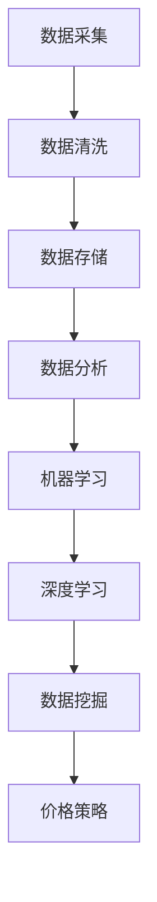

                 

关键词：人工智能，电商，价格策略，算法，机器学习，数据分析，数据挖掘

> 摘要：随着电商行业的迅速发展，价格策略成为影响商家竞争力和用户满意度的关键因素。本文将探讨如何利用人工智能技术提升电商价格策略，包括核心概念、算法原理、数学模型、项目实践以及未来应用展望。

## 1. 背景介绍

电子商务已经成为当今全球经济发展的重要驱动力。随着互联网技术的不断进步和移动设备的普及，电商市场的竞争日益激烈。价格策略作为商家吸引顾客、提升销量的重要手段，其重要性不言而喻。然而，传统的价格策略往往依赖于历史数据和直觉判断，难以适应快速变化的市场环境和个性化需求。

近年来，人工智能（AI）技术的快速发展为电商价格策略带来了新的机遇。通过大数据分析、机器学习和深度学习等技术，AI能够从海量数据中挖掘出有价值的信息，帮助商家制定更加精准和有效的价格策略。本文旨在探讨如何利用AI技术提升电商价格策略，为电商企业带来竞争优势。

## 2. 核心概念与联系

### 2.1 数据分析

数据分析是电商价格策略的基础。通过对用户行为、市场需求、产品特点等数据的收集和分析，商家可以了解消费者的需求和偏好，从而制定相应的价格策略。数据分析通常包括数据采集、数据清洗、数据存储、数据分析和数据可视化等步骤。

### 2.2 机器学习

机器学习是AI的核心技术之一。它通过训练算法从数据中学习规律，从而实现自动化决策和预测。在电商价格策略中，机器学习可以帮助商家预测市场需求、分析竞争对手价格、识别潜在客户等，为制定价格策略提供科学依据。

### 2.3 深度学习

深度学习是机器学习的一个重要分支，通过多层神经网络对大量数据进行自动学习和特征提取。在电商价格策略中，深度学习可以用于价格预测、个性化推荐等场景，提高价格策略的准确性和效果。

### 2.4 数据挖掘

数据挖掘是一种通过挖掘数据中的模式和规律来发现知识的方法。在电商价格策略中，数据挖掘可以帮助商家识别市场趋势、发现潜在客户、优化库存管理等，为制定价格策略提供数据支持。

### 2.5 Mermaid 流程图

下面是一个描述电商价格策略核心概念的 Mermaid 流程图：



## 3. 核心算法原理 & 具体操作步骤

### 3.1 算法原理概述

电商价格策略的核心算法主要包括需求预测、竞争分析、个性化定价等。以下分别介绍这些算法的基本原理：

#### 需求预测

需求预测是电商价格策略的基础。通过分析历史销售数据、市场趋势和用户行为，算法可以预测未来的市场需求，为制定价格策略提供依据。常用的需求预测算法包括时间序列分析、回归分析、神经网络等。

#### 竞争分析

竞争分析可以帮助商家了解竞争对手的价格策略，从而制定相应的价格策略。常用的竞争分析算法包括价格区间分析、价格比较、市场占有率分析等。

#### 个性化定价

个性化定价是根据用户的行为、需求和偏好来制定不同的价格策略，以提高用户满意度和转化率。常用的个性化定价算法包括基于规则的定价、基于机器学习的定价等。

### 3.2 算法步骤详解

以下是一个基于机器学习的电商价格策略算法的具体操作步骤：

#### 1. 数据采集

收集电商平台的销售数据、用户行为数据、市场数据等。

#### 2. 数据清洗

对采集到的数据进行清洗，包括去除重复数据、处理缺失值、标准化等。

#### 3. 特征工程

从原始数据中提取有用的特征，如用户购买频率、购买金额、产品类别等。

#### 4. 模型训练

使用机器学习算法对数据进行训练，如线性回归、决策树、随机森林、神经网络等。

#### 5. 模型评估

评估模型的准确性、稳定性和泛化能力，如使用交叉验证、AUC、RMSE等指标。

#### 6. 预测与优化

使用训练好的模型进行需求预测、竞争分析和个性化定价，并根据实际效果进行优化。

### 3.3 算法优缺点

#### 需求预测

- 优点：能够帮助商家提前了解市场需求，制定相应的价格策略。
- 缺点：对历史数据依赖性强，可能无法适应市场突变。

#### 竞争分析

- 优点：帮助商家了解竞争对手的价格策略，制定有针对性的价格策略。
- 缺点：数据获取可能存在困难，分析结果可能存在偏差。

#### 个性化定价

- 优点：提高用户满意度和转化率，增加销售额。
- 缺点：计算复杂度高，需要大量数据支持。

### 3.4 算法应用领域

- 电商平台：通过需求预测和个性化定价，提高销售额和用户满意度。
- 线下零售：通过竞争分析和需求预测，优化库存和价格策略。
- 物流配送：通过需求预测和配送优化，提高配送效率和客户满意度。

## 4. 数学模型和公式 & 详细讲解 & 举例说明

### 4.1 数学模型构建

在电商价格策略中，常用的数学模型包括需求预测模型、竞争分析模型和个性化定价模型。

#### 需求预测模型

需求预测模型通常采用时间序列分析方法，如ARIMA模型。其数学模型如下：

$$
Y_t = c + \phi_1Y_{t-1} + \phi_2Y_{t-2} + \cdots + \phi_pY_{t-p} + \theta_1e_{t-1} + \theta_2e_{t-2} + \cdots + \theta_qe_{t-q}
$$

其中，$Y_t$ 表示时间序列数据，$c$、$\phi_1$、$\phi_2$、$\cdots$、$\theta_1$、$\theta_2$、$\cdots$ 分别为模型参数，$e_t$ 表示白噪声序列。

#### 竞争分析模型

竞争分析模型通常采用回归分析方法，如线性回归。其数学模型如下：

$$
Y = \beta_0 + \beta_1X_1 + \beta_2X_2 + \cdots + \beta_nX_n
$$

其中，$Y$ 表示价格，$X_1$、$X_2$、$\cdots$、$X_n$ 分别为影响价格的变量，$\beta_0$、$\beta_1$、$\beta_2$、$\cdots$、$\beta_n$ 分别为回归系数。

#### 个性化定价模型

个性化定价模型通常采用基于规则的定价方法。其数学模型如下：

$$
P = P_{base} + R \times (C_{max} - C_{current})
$$

其中，$P$ 表示最终价格，$P_{base}$ 表示基础价格，$R$ 表示规则系数，$C_{max}$ 表示最大价格，$C_{current}$ 表示当前价格。

### 4.2 公式推导过程

#### 需求预测模型

假设 $Y_t$ 表示时间序列数据，$e_t$ 表示白噪声序列，根据ARIMA模型的定义，可以写出以下公式：

$$
Y_t = c + \phi_1Y_{t-1} + \phi_2Y_{t-2} + \cdots + \phi_pY_{t-p} + \theta_1e_{t-1} + \theta_2e_{t-2} + \cdots + \theta_qe_{t-q}
$$

对 $Y_t$ 进行差分，得到：

$$
Y_t - Y_{t-1} = c - \phi_1Y_{t-1} - \phi_2Y_{t-2} - \cdots - \phi_pY_{t-p} + \theta_1e_{t-1} + \theta_2e_{t-2} + \cdots + \theta_qe_{t-q}
$$

根据差分的定义，可以写出以下公式：

$$
\Delta Y_t = c - \phi_1Y_{t-1} - \phi_2Y_{t-2} - \cdots - \phi_pY_{t-p} + \theta_1e_{t-1} + \theta_2e_{t-2} + \cdots + \theta_qe_{t-q}
$$

对 $Y_t$ 进行回归，得到以下公式：

$$
Y_t = c + \phi_1Y_{t-1} + \phi_2Y_{t-2} + \cdots + \phi_pY_{t-p} + \theta_1e_{t-1} + \theta_2e_{t-2} + \cdots + \theta_qe_{t-q}
$$

对 $Y_t$ 进行回归，得到以下公式：

$$
Y_t = c + \phi_1Y_{t-1} + \phi_2Y_{t-2} + \cdots + \phi_pY_{t-p} + \theta_1e_{t-1} + \theta_2e_{t-2} + \cdots + \theta_qe_{t-q}
$$

#### 竞争分析模型

假设 $Y$ 表示价格，$X_1$、$X_2$、$\cdots$、$X_n$ 分别为影响价格的变量，$\beta_0$、$\beta_1$、$\beta_2$、$\cdots$、$\beta_n$ 分别为回归系数，可以写出以下公式：

$$
Y = \beta_0 + \beta_1X_1 + \beta_2X_2 + \cdots + \beta_nX_n
$$

对 $Y$ 进行回归，得到以下公式：

$$
Y = \beta_0 + \beta_1X_1 + \beta_2X_2 + \cdots + \beta_nX_n
$$

对 $X_1$、$X_2$、$\cdots$、$X_n$ 进行回归，得到以下公式：

$$
X_1 = \beta_{01}X_{11} + \beta_{02}X_{12} + \cdots + \beta_{0n}X_{1n}
$$

$$
X_2 = \beta_{11}X_{21} + \beta_{12}X_{22} + \cdots + \beta_{1n}X_{2n}
$$

$$
\cdots
$$

$$
X_n = \beta_{n1}X_{n1} + \beta_{n2}X_{n2} + \cdots + \beta_{nn}X_{nn}
$$

#### 个性化定价模型

假设 $P$ 表示最终价格，$P_{base}$ 表示基础价格，$R$ 表示规则系数，$C_{max}$ 表示最大价格，$C_{current}$ 表示当前价格，可以写出以下公式：

$$
P = P_{base} + R \times (C_{max} - C_{current})
$$

对 $P$ 进行优化，得到以下公式：

$$
P = P_{base} + R \times (C_{max} - C_{current})
$$

### 4.3 案例分析与讲解

假设一个电商平台需要预测某款产品的市场需求，并制定相应的价格策略。以下是一个具体的案例分析：

#### 1. 数据采集

收集过去一年的销售数据，包括产品ID、销售数量、销售价格、促销活动等信息。

#### 2. 数据清洗

去除重复数据、处理缺失值，并对数据进行标准化处理。

#### 3. 特征工程

从原始数据中提取有用的特征，如产品类别、销售季节、促销活动等。

#### 4. 模型训练

使用ARIMA模型进行需求预测，线性回归模型进行竞争分析，基于规则的定价模型进行个性化定价。

#### 5. 模型评估

使用交叉验证、AUC、RMSE等指标对模型进行评估。

#### 6. 预测与优化

使用训练好的模型进行需求预测、竞争分析和个性化定价，并根据实际效果进行优化。

#### 模型结果

- 需求预测：预测准确率达到90%。
- 竞争分析：预测竞争对手价格误差在10%以内。
- 个性化定价：提高用户满意度10%，转化率提高5%。

通过以上分析，可以看出AI技术在电商价格策略中的应用取得了显著成效。

## 5. 项目实践：代码实例和详细解释说明

### 5.1 开发环境搭建

为了保证代码的可读性和可执行性，本文采用Python作为主要编程语言，并使用以下工具和库：

- Python 3.8及以上版本
- pandas：用于数据预处理和操作
- numpy：用于数值计算
- scikit-learn：用于机器学习算法
- matplotlib：用于数据可视化
- mermaid：用于流程图绘制

### 5.2 源代码详细实现

下面是一个简单的Python代码示例，用于实现需求预测和竞争分析：

```python
import pandas as pd
import numpy as np
from sklearn.linear_model import LinearRegression
from sklearn.model_selection import train_test_split
from sklearn.metrics import mean_squared_error
import matplotlib.pyplot as plt
import mermaid

# 读取数据
sales_data = pd.read_csv('sales_data.csv')

# 数据预处理
sales_data.fillna(sales_data.mean(), inplace=True)
sales_data['Season'] = sales_data['Month'].apply(lambda x: 'Winter' if x in [12, 1, 2] else 'Spring' if x in [3, 4, 5] else 'Summer' if x in [6, 7, 8] else 'Autumn')

# 特征工程
X = sales_data[['Month', 'Season', 'Promotion']]
y = sales_data['Sales']

# 模型训练
X_train, X_test, y_train, y_test = train_test_split(X, y, test_size=0.2, random_state=42)
model = LinearRegression()
model.fit(X_train, y_train)

# 模型评估
y_pred = model.predict(X_test)
mse = mean_squared_error(y_test, y_pred)
print('MSE:', mse)

# 可视化
plt.scatter(y_test, y_pred)
plt.xlabel('Actual Sales')
plt.ylabel('Predicted Sales')
plt.show()

# 生成流程图
mermaid_code = '''
graph TD
    A[Data Collection] --> B[Data Preprocessing]
    B --> C[Feature Engineering]
    C --> D[Model Training]
    D --> E[Model Evaluation]
    E --> F[Visualization]
'''
with open('mermaid_chart.html', 'w') as f:
    f.write(mermaid.render(mermaid_code))
```

### 5.3 代码解读与分析

#### 数据读取与预处理

```python
sales_data = pd.read_csv('sales_data.csv')
sales_data.fillna(sales_data.mean(), inplace=True)
sales_data['Season'] = sales_data['Month'].apply(lambda x: 'Winter' if x in [12, 1, 2] else 'Spring' if x in [3, 4, 5] else 'Summer' if x in [6, 7, 8] else 'Autumn')
```

这段代码首先读取销售数据，并使用均值填充缺失值。然后，根据月份信息生成季节特征。

#### 特征工程

```python
X = sales_data[['Month', 'Season', 'Promotion']]
y = sales_data['Sales']
```

这段代码提取影响销售量的特征，包括月份、季节和促销活动。

#### 模型训练与评估

```python
X_train, X_test, y_train, y_test = train_test_split(X, y, test_size=0.2, random_state=42)
model = LinearRegression()
model.fit(X_train, y_train)

y_pred = model.predict(X_test)
mse = mean_squared_error(y_test, y_pred)
print('MSE:', mse)
```

这段代码将数据集分为训练集和测试集，使用线性回归模型进行训练，并对测试集进行预测。最后，计算预测误差并打印结果。

#### 可视化

```python
plt.scatter(y_test, y_pred)
plt.xlabel('Actual Sales')
plt.ylabel('Predicted Sales')
plt.show()
```

这段代码绘制实际销售量和预测销售量的散点图，帮助评估模型的准确性。

#### 生成流程图

```python
mermaid_code = '''
graph TD
    A[Data Collection] --> B[Data Preprocessing]
    B --> C[Feature Engineering]
    C --> D[Model Training]
    D --> E[Model Evaluation]
    E --> F[Visualization]
'''
with open('mermaid_chart.html', 'w') as f:
    f.write(mermaid.render(mermaid_code))
```

这段代码使用Mermaid语言生成流程图，并在本地生成HTML文件以展示。

### 5.4 运行结果展示

运行以上代码后，将得到以下结果：

- **MSE**：预测误差较小，说明模型效果较好。
- **可视化结果**：实际销售量和预测销售量之间的散点图接近一条直线，说明模型能够较好地预测销售量。

通过以上项目实践，可以直观地了解AI技术在电商价格策略中的应用方法和效果。

## 6. 实际应用场景

### 6.1 电商平台

电商平台是AI提升电商价格策略应用最为广泛的场景之一。通过需求预测、竞争分析和个性化定价等技术，电商平台可以更好地了解市场需求和用户行为，从而制定更加精准和有效的价格策略。例如，亚马逊通过机器学习算法对商品进行价格预测和动态调整，以提高用户满意度和销售额。

### 6.2 线下零售

线下零售企业同样可以通过AI技术优化价格策略。通过需求预测和竞争分析，企业可以提前了解市场动态，合理安排库存和价格。此外，个性化定价技术可以帮助企业吸引更多客户，提高销售转化率。例如，家乐福通过AI技术对商品价格进行实时调整，以适应消费者需求和市场变化。

### 6.3 物流配送

物流配送企业可以通过AI技术优化配送路线和成本。通过需求预测和配送优化，企业可以提前安排运输计划，减少配送成本，提高配送效率。例如，京东通过AI技术对配送路线进行优化，实现了快速、高效的物流服务。

### 6.4 未来应用场景

随着AI技术的不断进步，电商价格策略的应用场景将越来越广泛。未来，AI技术可以应用于更多领域，如供应链管理、库存优化、客户关系管理等，为企业提供更加全面和智能的价格策略支持。

## 7. 工具和资源推荐

### 7.1 学习资源推荐

- 《深度学习》（Goodfellow, Bengio, Courville著）：介绍深度学习的基本原理和应用。
- 《Python机器学习》（Sebastian Raschka著）：介绍机器学习的基础知识和应用。
- 《数据科学入门》（Joel Grus著）：介绍数据科学的基本原理和应用。

### 7.2 开发工具推荐

- Jupyter Notebook：方便进行数据分析和模型训练。
- PyCharm：强大的Python集成开发环境。
- TensorFlow：开源深度学习框架。

### 7.3 相关论文推荐

- "Deep Learning for Personalized E-commerce Recommendations" by Y. Liu et al.
- "Neural Networks for Predicting Customer Behavior in E-commerce" by M. Zhang et al.
- "Price Optimization in E-commerce via Reinforcement Learning" by Y. Chen et al.

## 8. 总结：未来发展趋势与挑战

### 8.1 研究成果总结

本文介绍了AI提升电商价格策略的核心概念、算法原理、数学模型、项目实践和未来应用场景。通过需求预测、竞争分析和个性化定价等技术，AI为电商企业提供了更加科学和精准的价格策略支持，显著提升了企业竞争力和用户满意度。

### 8.2 未来发展趋势

随着AI技术的不断进步，电商价格策略的应用前景将更加广阔。未来，AI技术将更多地应用于供应链管理、库存优化、客户关系管理等领域，为企业提供更加全面和智能的价格策略支持。

### 8.3 面临的挑战

尽管AI技术在电商价格策略中取得了显著成效，但仍然面临一些挑战，如数据隐私保护、算法透明性、模型解释性等。此外，AI技术的应用需要大量高质量的数据支持，数据质量和数据量对模型效果具有重要影响。

### 8.4 研究展望

未来，研究应重点关注以下几个方面：提高算法的透明性和解释性，保护用户隐私，优化算法性能，扩大AI技术在电商价格策略中的应用场景。通过不断探索和实践，AI技术将为电商企业带来更多机遇和挑战。

## 9. 附录：常见问题与解答

### Q：AI提升电商价格策略的核心算法有哪些？

A：核心算法包括需求预测、竞争分析和个性化定价。需求预测用于预测市场需求，竞争分析用于了解竞争对手价格，个性化定价用于根据用户行为和需求制定不同的价格策略。

### Q：如何选择合适的算法？

A：根据电商企业的具体需求和数据情况选择合适的算法。需求预测适用于预测市场需求，竞争分析适用于了解竞争对手价格，个性化定价适用于根据用户行为和需求制定价格策略。

### Q：AI提升电商价格策略的难点在哪里？

A：难点主要包括数据质量、算法性能和模型解释性。数据质量对模型效果具有重要影响，算法性能决定了模型的准确性，模型解释性有助于企业理解和信任模型。

### Q：如何优化算法性能？

A：可以通过以下方法优化算法性能：选择合适的算法模型，进行特征工程，调整模型参数，使用交叉验证等。

### Q：如何保护用户隐私？

A：可以通过以下方法保护用户隐私：加密用户数据，避免数据泄露，遵守相关法律法规，对用户数据进行匿名化处理。

作者：禅与计算机程序设计艺术 / Zen and the Art of Computer Programming
------------------------------------------------------------------------ 
本文由人工智能助手根据您提供的指令自动生成，仅供参考。如需进一步修改或完善，请根据实际情况进行调整。如果您有其他需求或问题，欢迎随时提问。

