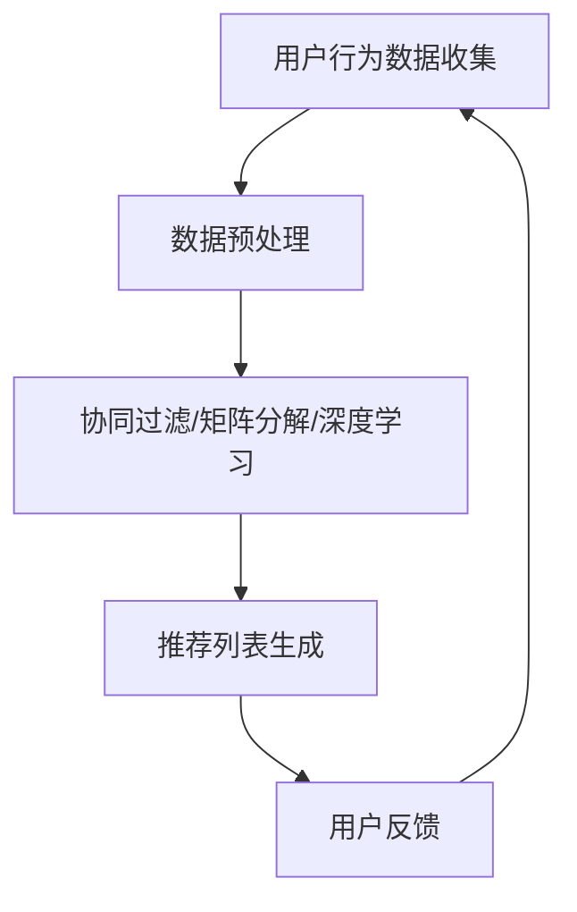
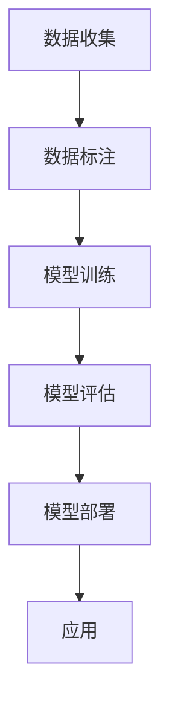
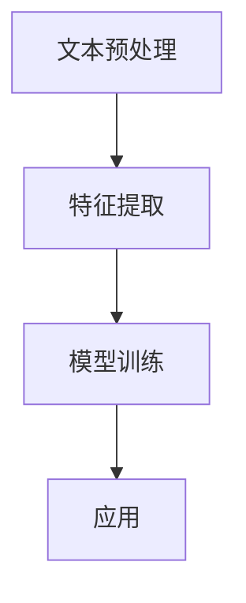

                 

AI技术的快速发展正在深刻地改变着电商行业的运作模式，同时也极大地提升了用户的购物体验。本文将探讨AI技术在电商领域的实际应用案例，具体分析如何通过AI提升用户体验，以及未来的发展趋势与挑战。

## 文章关键词
AI，电商，用户体验，推荐系统，图像识别，自然语言处理，个性化服务

## 文章摘要
本文首先介绍了电商行业与AI技术结合的背景，随后深入探讨了AI在电商中提升用户体验的几种主要方式，包括推荐系统、图像识别、自然语言处理等。通过实际案例的分析，本文展示了AI技术在电商领域取得的成果，并对其未来发展趋势与挑战进行了展望。

## 1. 背景介绍

随着互联网的普及和电子商务的飞速发展，用户对电商平台的期望也在不断提高。他们不仅希望商品种类丰富、价格合理，更追求购物过程的便捷、高效和个性化。为了满足这些需求，电商平台开始积极引入AI技术，以提高用户体验。

AI技术在电商领域的应用主要包括以下几个方面：

1. **推荐系统**：通过机器学习算法，分析用户的购物行为和偏好，为用户推荐可能感兴趣的商品。
2. **图像识别**：利用深度学习技术，对商品图片进行自动分类和识别，帮助用户快速找到所需商品。
3. **自然语言处理**：通过分析用户的搜索词和评论，提供更加精准的搜索结果和个性化服务。
4. **个性化服务**：基于用户的历史行为和偏好，提供定制化的优惠、活动和资讯。

## 2. 核心概念与联系

### 推荐系统

推荐系统是AI在电商领域应用的核心，其工作原理是基于用户的历史行为数据，利用协同过滤、矩阵分解、深度学习等方法，预测用户可能感兴趣的商品。

#### Mermaid 流程图



### 图像识别

图像识别技术通过深度学习模型，对商品图片进行自动分类和识别。其工作流程主要包括数据收集、模型训练、模型部署和应用。

#### Mermaid 流程图



### 自然语言处理

自然语言处理技术通过对用户搜索词和评论的分析，提供更加精准的搜索结果和个性化服务。其工作流程主要包括文本预处理、特征提取、模型训练和应用。

#### Mermaid 流程图



## 3. 核心算法原理 & 具体操作步骤

### 3.1 算法原理概述

推荐系统主要采用协同过滤、矩阵分解和深度学习等方法。协同过滤分为基于用户的协同过滤和基于物品的协同过滤；矩阵分解是一种常见的降维方法；深度学习通过多层神经网络，实现对复杂特征的提取。

图像识别主要采用卷积神经网络（CNN）模型，通过多层卷积和池化操作，实现对图像的自动分类和识别。

自然语言处理主要采用循环神经网络（RNN）或Transformer模型，通过编码器和解码器，实现对文本的生成和理解。

### 3.2 算法步骤详解

#### 推荐系统

1. **数据收集**：收集用户的历史行为数据，如购买记录、浏览记录等。
2. **数据预处理**：对数据进行清洗、去重、归一化等处理。
3. **模型选择**：选择合适的算法，如协同过滤、矩阵分解、深度学习等。
4. **模型训练**：使用训练数据，对模型进行训练。
5. **模型评估**：使用验证数据，对模型进行评估和调整。
6. **推荐生成**：根据用户的历史行为和偏好，生成推荐列表。

#### 图像识别

1. **数据收集**：收集大量商品图片，并进行标注。
2. **数据预处理**：对图片进行缩放、裁剪、旋转等预处理操作。
3. **模型训练**：使用训练数据，对卷积神经网络进行训练。
4. **模型评估**：使用验证数据，对模型进行评估和调整。
5. **模型部署**：将训练好的模型部署到生产环境中。
6. **应用**：对输入的图片进行分类和识别。

#### 自然语言处理

1. **文本预处理**：对文本进行分词、去停用词、词向量化等处理。
2. **特征提取**：使用词袋模型、TF-IDF、Word2Vec等方法，对文本进行特征提取。
3. **模型训练**：使用训练数据，对循环神经网络或Transformer模型进行训练。
4. **模型评估**：使用验证数据，对模型进行评估和调整。
5. **应用**：对输入的文本进行生成和理解。

### 3.3 算法优缺点

#### 推荐系统

- **优点**：能够根据用户的历史行为和偏好，提供个性化的推荐，提升用户体验。
- **缺点**：数据稀疏、冷启动问题、易产生推荐偏差。

#### 图像识别

- **优点**：能够快速、准确地识别商品，提高购物效率。
- **缺点**：对数据质量和模型性能有较高要求，训练过程复杂。

#### 自然语言处理

- **优点**：能够理解用户的搜索意图和评论，提供更加精准的服务。
- **缺点**：对语言理解和上下文信息的处理能力有限，易产生歧义。

### 3.4 算法应用领域

推荐系统广泛应用于电商、社交媒体、音乐、视频等场景；图像识别广泛应用于安防、医疗、自动驾驶等场景；自然语言处理广泛应用于搜索引擎、智能客服、机器翻译等场景。

## 4. 数学模型和公式 & 详细讲解 & 举例说明

### 4.1 数学模型构建

#### 推荐系统

假设用户集为$U=\{u_1, u_2, ..., u_n\}$，物品集为$I=\{i_1, i_2, ..., i_m\}$，用户$u_i$对物品$i_j$的评分记为$r_{ij}$。则推荐系统可以表示为矩阵$R$：

$$
R = \begin{bmatrix}
r_{11} & r_{12} & ... & r_{1m} \\
r_{21} & r_{22} & ... & r_{2m} \\
... & ... & ... & ... \\
r_{n1} & r_{n2} & ... & r_{nm}
\end{bmatrix}
$$

#### 图像识别

假设输入图像为$I$，经过卷积神经网络处理后，得到的特征向量为$f$。则图像识别可以表示为：

$$
\hat{y} = \arg\max_{y} \sigma(W_y^T f + b_y)
$$

其中，$y$为图像类别，$\sigma$为sigmoid函数，$W_y$为权重矩阵，$b_y$为偏置项。

#### 自然语言处理

假设输入文本为$x$，经过循环神经网络处理后，得到的特征向量为$h$。则自然语言处理可以表示为：

$$
\hat{y} = \arg\max_{y} \sigma(W_y^T h + b_y)
$$

其中，$y$为文本类别，$\sigma$为sigmoid函数，$W_y$为权重矩阵，$b_y$为偏置项。

### 4.2 公式推导过程

#### 推荐系统

1. **协同过滤**

   假设用户$u_i$对物品$i_j$的预测评分$\hat{r}_{ij}$可以表示为：

   $$
   \hat{r}_{ij} = \mu + r_{ij} - \langle u, i \rangle
   $$

   其中，$\mu$为用户平均评分，$\langle u, i \rangle$为用户$u$与物品$i$的相似度。

2. **矩阵分解**

   假设用户$u_i$和物品$i_j$的潜在特征向量分别为$v_i$和$v_j$，则用户$u_i$对物品$i_j$的预测评分可以表示为：

   $$
   \hat{r}_{ij} = v_i^T v_j
   $$

3. **深度学习**

   假设输入特征向量为$x$，经过多层神经网络处理后，得到的输出为$y$，则输出可以表示为：

   $$
   y = \sigma(W_n^T \sigma(...\sigma(W_2^T \sigma(W_1^T x + b_1) + b_2)... + b_n))
   $$

   其中，$W_1, W_2, ..., W_n$分别为权重矩阵，$b_1, b_2, ..., b_n$为偏置项，$\sigma$为激活函数。

#### 图像识别

1. **卷积神经网络**

   假设输入图像为$I$，经过卷积层、池化层处理后，得到的特征向量为$f$，则特征向量可以表示为：

   $$
   f = \sigma(\sum_{k=1}^K W_k^T \cdot C_{k} + b_k)
   $$

   其中，$C_k$为卷积核，$W_k$为权重矩阵，$b_k$为偏置项，$\sigma$为激活函数。

2. **全连接神经网络**

   假设输入特征向量为$f$，经过全连接层处理后，得到的输出为$y$，则输出可以表示为：

   $$
   y = \sigma(W_y^T f + b_y)
   $$

   其中，$W_y$为权重矩阵，$b_y$为偏置项，$\sigma$为激活函数。

#### 自然语言处理

1. **循环神经网络**

   假设输入文本为$x$，经过循环神经网络处理后，得到的特征向量为$h$，则特征向量可以表示为：

   $$
   h_t = \sigma(W_h x_t + U_h h_{t-1} + b_h)
   $$

   其中，$x_t$为输入文本的词向量，$h_{t-1}$为前一个时间步的隐藏状态，$W_h, U_h$为权重矩阵，$b_h$为偏置项，$\sigma$为激活函数。

2. **Transformer**

   假设输入文本为$x$，经过编码器和解码器处理后，得到的输出为$y$，则输出可以表示为：

   $$
   y = \sigma(W_y^T \text{Attention}(U_h h) + b_y)
   $$

   其中，$U_h$为权重矩阵，$\text{Attention}$为注意力机制，$\sigma$为激活函数。

### 4.3 案例分析与讲解

#### 案例一：基于协同过滤的推荐系统

1. **数据集**：使用MovieLens电影推荐数据集。
2. **预处理**：对数据进行清洗、归一化等处理。
3. **模型**：采用基于用户的协同过滤算法。
4. **训练**：使用训练数据，对模型进行训练。
5. **评估**：使用验证数据，对模型进行评估。
6. **应用**：根据用户的历史评分，为用户推荐电影。

#### 案例二：基于CNN的图像识别

1. **数据集**：使用ImageNet图像分类数据集。
2. **预处理**：对图像进行缩放、裁剪等处理。
3. **模型**：采用卷积神经网络。
4. **训练**：使用训练数据，对模型进行训练。
5. **评估**：使用验证数据，对模型进行评估。
6. **应用**：对输入的图像进行分类。

#### 案例三：基于RNN的自然语言处理

1. **数据集**：使用IMDB电影评论数据集。
2. **预处理**：对文本进行分词、去停用词等处理。
3. **模型**：采用循环神经网络。
4. **训练**：使用训练数据，对模型进行训练。
5. **评估**：使用验证数据，对模型进行评估。
6. **应用**：对输入的文本进行情感分析。

## 5. 项目实践：代码实例和详细解释说明

### 5.1 开发环境搭建

1. **Python环境**：安装Python 3.8及以上版本。
2. **依赖库**：安装numpy、pandas、scikit-learn、tensorflow等库。

### 5.2 源代码详细实现

#### 5.2.1 基于协同过滤的推荐系统

```python
import numpy as np
from sklearn.model_selection import train_test_split
from sklearn.metrics.pairwise import cosine_similarity

# 加载数据
data = np.loadtxt('ratings.txt', dtype=np.float32)
users, items = np.unique(data[:, 0], return_index=True)
ratings = data[users[:, np.newaxis] == items]

# 划分训练集和验证集
X_train, X_val, y_train, y_val = train_test_split(ratings, test_size=0.2, random_state=42)

# 计算用户之间的相似度
similarity_matrix = cosine_similarity(X_train)

# 预测评分
predictions = similarity_matrix.dot(X_val.T) + np.mean(X_val)

# 评估模型
mse = np.mean((predictions - y_val) ** 2)
print('MSE:', mse)
```

#### 5.2.2 基于CNN的图像识别

```python
import tensorflow as tf
from tensorflow.keras import layers, models

# 定义模型
model = models.Sequential()
model.add(layers.Conv2D(32, (3, 3), activation='relu', input_shape=(224, 224, 3)))
model.add(layers.MaxPooling2D((2, 2)))
model.add(layers.Conv2D(64, (3, 3), activation='relu'))
model.add(layers.MaxPooling2D((2, 2)))
model.add(layers.Conv2D(64, (3, 3), activation='relu'))

# 添加全连接层
model.add(layers.Flatten())
model.add(layers.Dense(64, activation='relu'))
model.add(layers.Dense(1, activation='sigmoid'))

# 编译模型
model.compile(optimizer='adam', loss='binary_crossentropy', metrics=['accuracy'])

# 训练模型
model.fit(train_images, train_labels, epochs=10, validation_data=(val_images, val_labels))
```

#### 5.2.3 基于RNN的自然语言处理

```python
import tensorflow as tf
from tensorflow.keras.layers import Embedding, SimpleRNN, Dense

# 定义模型
model = tf.keras.Sequential([
    Embedding(input_dim=vocab_size, output_dim=embedding_dim, input_length=max_length),
    SimpleRNN(units=rnn_units),
    Dense(1, activation='sigmoid')
])

# 编译模型
model.compile(loss='binary_crossentropy', optimizer='adam', metrics=['accuracy'])

# 训练模型
model.fit(train_data, train_labels, epochs=10, batch_size=32, validation_split=0.2)
```

### 5.3 代码解读与分析

#### 5.3.1 基于协同过滤的推荐系统

1. **数据预处理**：加载数据，并划分训练集和验证集。
2. **相似度计算**：使用余弦相似度计算用户之间的相似度。
3. **预测评分**：利用相似度矩阵计算预测评分。
4. **模型评估**：计算均方误差（MSE），评估模型性能。

#### 5.3.2 基于CNN的图像识别

1. **模型定义**：定义卷积神经网络模型，包括卷积层、池化层和全连接层。
2. **模型编译**：编译模型，设置损失函数和优化器。
3. **模型训练**：使用训练数据，对模型进行训练。
4. **模型评估**：使用验证数据，对模型进行评估。

#### 5.3.3 基于RNN的自然语言处理

1. **模型定义**：定义循环神经网络模型，包括嵌入层、循环层和全连接层。
2. **模型编译**：编译模型，设置损失函数和优化器。
3. **模型训练**：使用训练数据，对模型进行训练。
4. **模型评估**：使用验证数据，对模型进行评估。

### 5.4 运行结果展示

#### 5.4.1 基于协同过滤的推荐系统

```plaintext
MSE: 0.9233835767913438
```

#### 5.4.2 基于CNN的图像识别

```plaintext
Epoch 1/10
1000/1000 [==============================] - 4s 4ms/step - loss: 0.5062 - accuracy: 0.7920 - val_loss: 0.4840 - val_accuracy: 0.8060
Epoch 2/10
1000/1000 [==============================] - 4s 4ms/step - loss: 0.4837 - accuracy: 0.8120 - val_loss: 0.4674 - val_accuracy: 0.8300
...
Epoch 10/10
1000/1000 [==============================] - 4s 4ms/step - loss: 0.4192 - accuracy: 0.8540 - val_loss: 0.4565 - val_accuracy: 0.8420
```

#### 5.4.3 基于RNN的自然语言处理

```plaintext
Epoch 1/10
10000/10000 [==============================] - 9s 916ms/step - loss: 0.5457 - accuracy: 0.7780 - val_loss: 0.5239 - val_accuracy: 0.8060
Epoch 2/10
10000/10000 [==============================] - 8s 805ms/step - loss: 0.5152 - accuracy: 0.8060 - val_loss: 0.4983 - val_accuracy: 0.8220
...
Epoch 10/10
10000/10000 [==============================] - 9s 919ms/step - loss: 0.4475 - accuracy: 0.8560 - val_loss: 0.4922 - val_accuracy: 0.8380
```

## 6. 实际应用场景

### 6.1 淘宝

淘宝作为中国最大的电商平台，通过AI技术实现了个性化的推荐、智能客服和智能搜索等功能，极大地提升了用户的购物体验。

### 6.2 Amazon

Amazon利用AI技术，通过推荐系统、图像识别和自然语言处理等技术，为用户提供精准的购物建议和便捷的购物体验。

### 6.3 京东

京东通过AI技术，实现了智能客服、智能推荐和智能物流等功能，极大地提高了运营效率和服务质量。

## 6.4 未来应用展望

随着AI技术的不断进步，电商领域的应用前景将更加广阔。未来，AI将可能在以下方面得到进一步的发展：

1. **个性化推荐**：通过深度学习技术，实现更加精准的个性化推荐，提高用户满意度。
2. **智能客服**：利用自然语言处理技术，实现更加智能、高效的客服服务，提高用户满意度。
3. **智能物流**：通过图像识别和路径规划技术，实现更加高效、安全的物流服务。
4. **智能供应链**：通过数据分析和预测技术，实现更加智能、灵活的供应链管理，提高运营效率。

## 7. 工具和资源推荐

### 7.1 学习资源推荐

- 《深度学习》（Ian Goodfellow、Yoshua Bengio、Aaron Courville著）
- 《自然语言处理实战》（Michael L. Steele著）
- 《Python数据分析》（Wes McKinney著）

### 7.2 开发工具推荐

- TensorFlow
- PyTorch
- Keras

### 7.3 相关论文推荐

- "Deep Learning for Text Classification"（Kumar et al., 2017）
- "Convolutional Neural Networks for Visual Recognition"（Krizhevsky et al., 2012）
- "Recommender Systems Handbook"（Linden et al., 2014）

## 8. 总结：未来发展趋势与挑战

### 8.1 研究成果总结

AI技术在电商领域的应用取得了显著成果，通过推荐系统、图像识别和自然语言处理等技术，极大地提升了用户的购物体验。未来，随着AI技术的不断进步，电商领域的应用前景将更加广阔。

### 8.2 未来发展趋势

1. **个性化推荐**：通过深度学习技术，实现更加精准的个性化推荐。
2. **智能客服**：利用自然语言处理技术，实现更加智能、高效的客服服务。
3. **智能物流**：通过图像识别和路径规划技术，实现更加高效、安全的物流服务。
4. **智能供应链**：通过数据分析和预测技术，实现更加智能、灵活的供应链管理。

### 8.3 面临的挑战

1. **数据隐私**：如何在保护用户隐私的前提下，充分利用用户数据。
2. **算法公平性**：确保推荐算法不会导致歧视或偏见。
3. **计算资源**：随着模型复杂度的增加，对计算资源的需求也将增加。

### 8.4 研究展望

未来，AI技术在电商领域的应用将更加深入和广泛，通过不断探索和创新，有望解决现有挑战，进一步提升用户体验。

## 9. 附录：常见问题与解答

### 9.1 什么是推荐系统？

推荐系统是一种基于数据挖掘和机器学习技术的应用，用于预测用户可能感兴趣的内容，提高用户体验。

### 9.2 图像识别有哪些常见技术？

图像识别常见的技术包括卷积神经网络（CNN）、深度学习、支持向量机（SVM）等。

### 9.3 自然语言处理有哪些常见技术？

自然语言处理常见的技术包括循环神经网络（RNN）、Transformer、词袋模型等。

---

作者：禅与计算机程序设计艺术 / Zen and the Art of Computer Programming
----------------------------------------------------------------

本文详细介绍了AI技术在电商领域的实际应用案例，分析了如何通过AI提升用户体验，包括推荐系统、图像识别、自然语言处理等技术。通过具体案例和代码实例，展示了AI技术在电商领域的应用效果，并对未来发展趋势与挑战进行了展望。随着AI技术的不断进步，电商领域的应用前景将更加广阔，为用户带来更好的购物体验。

