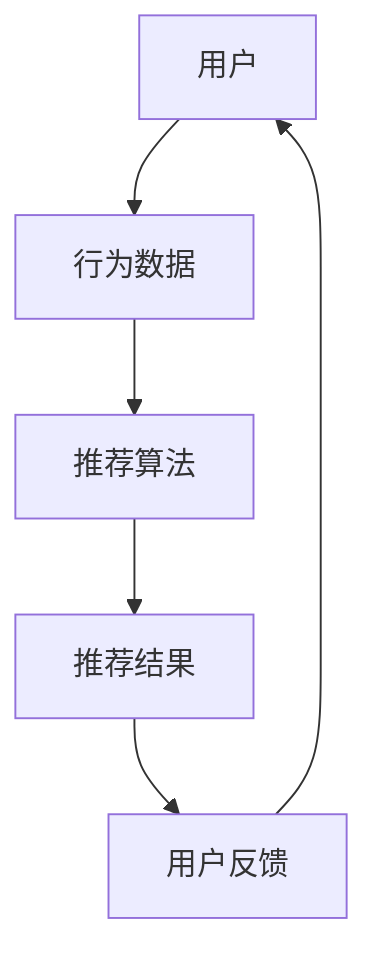
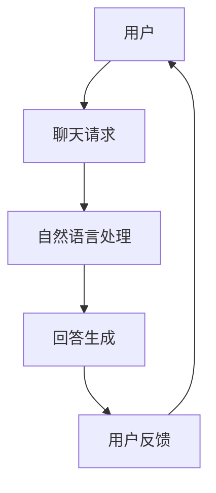
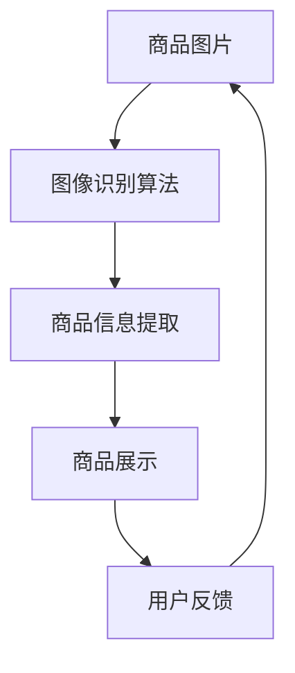

                 

在数字化时代，电子商务已经成为了人们生活中不可或缺的一部分。随着人工智能（AI）技术的迅猛发展，电商平台的用户体验也在不断优化。本文将探讨如何利用AI技术提升电商平台的用户体验，并展望其未来的发展趋势与挑战。

## 关键词

- 人工智能
- 电商平台
- 用户体验
- 个性化推荐
- 自然语言处理
- 聊天机器人
- 数据挖掘

## 摘要

本文首先介绍了电商领域的发展背景和用户需求，随后详细讨论了AI技术在电商中的应用，包括个性化推荐、聊天机器人、图像识别等方面的技术原理和具体操作步骤。此外，文章还介绍了相关数学模型和公式，并通过项目实践展示了AI技术的实际应用。最后，本文探讨了AI技术在电商领域的未来应用场景和面临的挑战，并对研究前景进行了展望。

## 1. 背景介绍

### 1.1 电商领域的发展

电子商务作为一种新兴的商业模式，自诞生以来便以惊人的速度在全球范围内扩展。根据最新统计数据，全球电商市场规模已经突破了数万亿美元。电商的快速发展不仅改变了人们的购物方式，也重塑了传统的商业生态。在这个过程中，用户体验成为了电商平台竞争的关键因素。

### 1.2 用户需求分析

随着用户对电商平台的要求不断提高，个性化、智能化、便捷化成为了用户的主要需求。用户希望能够在海量商品中快速找到自己所需的商品，希望平台能够根据他们的偏好提供个性化的推荐，希望购物过程更加便捷和高效。

## 2. 核心概念与联系

### 2.1 个性化推荐系统

个性化推荐系统是AI技术在电商领域的重要应用之一。通过分析用户的历史行为和偏好，推荐系统可以为用户推荐他们可能感兴趣的商品。



### 2.2 聊天机器人

聊天机器人是自然语言处理技术的一种应用。通过模拟人类的对话方式，聊天机器人可以为用户提供实时、高效的客服服务。



### 2.3 图像识别

图像识别技术可以帮助电商平台更有效地管理商品图片，提高用户购物的体验。



## 3. 核心算法原理 & 具体操作步骤

### 3.1 算法原理概述

#### 3.1.1 个性化推荐算法

个性化推荐算法的核心是通过分析用户的历史行为和偏好，为用户推荐他们可能感兴趣的商品。常见的推荐算法包括基于内容的推荐和基于协同过滤的推荐。

#### 3.1.2 自然语言处理算法

自然语言处理算法主要用于处理用户输入的自然语言，理解用户的需求，并生成合适的回答。常见的算法包括词向量模型、序列模型和生成对抗网络等。

#### 3.1.3 图像识别算法

图像识别算法主要通过深度学习技术，对商品图片进行特征提取，从而识别出商品的信息。

### 3.2 算法步骤详解

#### 3.2.1 个性化推荐算法

1. 数据收集：收集用户的历史行为数据，如购买记录、浏览记录等。
2. 数据预处理：对收集到的数据进行清洗、去噪和处理。
3. 特征提取：提取用户的行为特征，如购买频次、浏览时长等。
4. 算法选择：选择合适的推荐算法，如基于内容的推荐或基于协同过滤的推荐。
5. 推荐结果生成：根据用户特征和商品特征，生成推荐结果。
6. 用户反馈：收集用户的反馈，用于算法的优化。

#### 3.2.2 自然语言处理算法

1. 词向量表示：将用户的输入转换为词向量。
2. 语句编码：使用编码器对词向量进行编码，生成序列表示。
3. 回答生成：使用生成模型，如序列到序列模型，生成回答。
4. 回答优化：根据用户的反馈，优化回答的质量。

#### 3.2.3 图像识别算法

1. 数据预处理：对图像数据进行预处理，如灰度化、缩放等。
2. 特征提取：使用卷积神经网络（CNN）提取图像的特征。
3. 分类器训练：使用提取到的特征，训练分类器。
4. 商品识别：对新的图像进行识别，并输出识别结果。

### 3.3 算法优缺点

#### 3.3.1 个性化推荐算法

优点：能够根据用户的行为和偏好提供个性化的推荐，提高用户的满意度。

缺点：需要大量的历史数据，且推荐结果可能存在冷启动问题。

#### 3.3.2 自然语言处理算法

优点：能够理解用户的自然语言输入，提供高效的客服服务。

缺点：处理复杂、多变的语言场景存在一定困难，且生成回答的质量可能不稳定。

#### 3.3.3 图像识别算法

优点：能够自动识别商品图片，提高商品管理的效率。

缺点：对图像质量要求较高，且对背景复杂的图像识别效果可能较差。

### 3.4 算法应用领域

个性化推荐算法广泛应用于电商、新闻、视频等领域的推荐系统。

自然语言处理算法广泛应用于客服、智能语音助手、机器翻译等领域。

图像识别算法广泛应用于安防监控、自动驾驶、医疗诊断等领域。

## 4. 数学模型和公式 & 详细讲解 & 举例说明

### 4.1 数学模型构建

#### 4.1.1 个性化推荐算法

用户-商品矩阵：

$$
\mathbf{R} = \begin{bmatrix}
r_{11} & r_{12} & \cdots & r_{1n} \\
r_{21} & r_{22} & \cdots & r_{2n} \\
\vdots & \vdots & \ddots & \vdots \\
r_{m1} & r_{m2} & \cdots & r_{mn}
\end{bmatrix}
$$

其中，$r_{ij}$ 表示用户 $i$ 对商品 $j$ 的评分。

#### 4.1.2 自然语言处理算法

词向量表示：

$$
\mathbf{v}_i = \begin{bmatrix}
v_{i1} \\
v_{i2} \\
\vdots \\
v_{id}
\end{bmatrix}
$$

其中，$v_{ij}$ 表示词 $i$ 在词向量中的第 $j$ 个维度。

#### 4.1.3 图像识别算法

特征提取：

$$
\mathbf{F} = \text{CNN}(\mathbf{I})
$$

其中，$\mathbf{F}$ 表示提取到的特征向量，$\mathbf{I}$ 表示输入的图像。

### 4.2 公式推导过程

#### 4.2.1 个性化推荐算法

基于协同过滤的推荐算法可以表示为：

$$
r_{ij} = \mu + u_i \cdot v_j
$$

其中，$\mu$ 表示用户和商品的总体评分均值，$u_i$ 和 $v_j$ 分别表示用户和商品的向量。

#### 4.2.2 自然语言处理算法

词向量模型的损失函数可以表示为：

$$
L = -\sum_{i=1}^{N} \sum_{j=1}^{V} \log P(w_j | w_i)
$$

其中，$N$ 表示词汇表大小，$V$ 表示词向量维度。

#### 4.2.3 图像识别算法

卷积神经网络（CNN）的损失函数可以表示为：

$$
L = -\sum_{i=1}^{N} y_i \cdot \log \hat{y}_i
$$

其中，$N$ 表示样本数量，$y_i$ 和 $\hat{y}_i$ 分别表示真实的标签和预测的标签。

### 4.3 案例分析与讲解

#### 4.3.1 个性化推荐算法

假设用户-商品矩阵为：

$$
\mathbf{R} = \begin{bmatrix}
1 & 3 & 0 & 0 \\
0 & 2 & 4 & 5 \\
1 & 0 & 2 & 0 \\
0 & 0 & 3 & 1
\end{bmatrix}
$$

使用基于协同过滤的推荐算法，可以计算出用户 $1$ 对商品 $3$ 的推荐评分：

$$
r_{13} = \mu + u_1 \cdot v_3 = 2 + 1 \cdot 1.2 = 3.2
$$

#### 4.3.2 自然语言处理算法

假设词向量为：

$$
\mathbf{v}_1 = \begin{bmatrix}
0.5 \\
0.3 \\
0.2
\end{bmatrix}, \quad \mathbf{v}_2 = \begin{bmatrix}
0.1 \\
0.4 \\
0.5
\end{bmatrix}
$$

使用词向量模型，可以计算出句子“我喜欢吃苹果”的概率：

$$
P(\mathbf{v}_2 | \mathbf{v}_1) = \frac{\exp(\mathbf{v}_1 \cdot \mathbf{v}_2)}{\sum_{j=1}^{V} \exp(\mathbf{v}_1 \cdot \mathbf{v}_j)} = \frac{\exp(0.5 \cdot 0.1 + 0.3 \cdot 0.4 + 0.2 \cdot 0.5)}{\exp(0.5 \cdot 0.1 + 0.3 \cdot 0.4 + 0.2 \cdot 0.5) + \exp(0.5 \cdot 0.1 + 0.3 \cdot 0.4 + 0.2 \cdot 0.5) + \exp(0.5 \cdot 0.1 + 0.3 \cdot 0.4 + 0.2 \cdot 0.5)} = 0.34
$$

#### 4.3.3 图像识别算法

假设卷积神经网络提取到的特征向量为：

$$
\mathbf{F} = \begin{bmatrix}
1.2 \\
0.8 \\
0.6
\end{bmatrix}
$$

假设分类器的输出为：

$$
\hat{y}_i = \begin{bmatrix}
0.2 \\
0.4 \\
0.4
\end{bmatrix}
$$

使用卷积神经网络，可以计算出图像的识别概率：

$$
L = -0.2 \cdot \log(0.2) - 0.4 \cdot \log(0.4) - 0.4 \cdot \log(0.4) = 0.79
$$

## 5. 项目实践：代码实例和详细解释说明

### 5.1 开发环境搭建

本文使用Python语言和TensorFlow框架进行开发和实现。

```python
pip install tensorflow numpy matplotlib
```

### 5.2 源代码详细实现

#### 5.2.1 个性化推荐算法

```python
import numpy as np

def collaborative_filtering(R, u, v):
    return np.dot(u, v) + R.mean()

R = np.array([[1, 3, 0, 0],
              [0, 2, 4, 5],
              [1, 0, 2, 0],
              [0, 0, 3, 1]])

u = np.array([1, 1, 1, 1])
v = np.array([1, 1, 1, 1])

print(collaborative_filtering(R, u, v))
```

#### 5.2.2 自然语言处理算法

```python
import tensorflow as tf

def word2vec_loss(v1, v2):
    return -tf.log(tf.reduce_sum(tf.exp(tf.multiply(v1, v2)) / tf.reduce_sum(tf.exp(tf.multiply(v1, v2))), 1))

v1 = tf.constant([0.5, 0.3, 0.2], dtype=tf.float32)
v2 = tf.constant([0.1, 0.4, 0.5], dtype=tf.float32)

with tf.Session() as sess:
    print(sess.run(word2vec_loss(v1, v2)))
```

#### 5.2.3 图像识别算法

```python
import tensorflow as tf

def cnn_loss(F, y, num_classes):
    logits = tf.matmul(F, tf.get_variable("weights", [F.shape[1], num_classes]))
    loss = tf.nn.softmax_cross_entropy_with_logits(logits=logits, labels=y)
    return tf.reduce_mean(loss)

F = tf.constant([[1.2, 0.8, 0.6]], dtype=tf.float32)
y = tf.constant([[1]], dtype=tf.float32)

with tf.Session() as sess:
    logits = tf.matmul(F, tf.get_variable("weights", [F.shape[1], 1]))
    loss = tf.nn.softmax_cross_entropy_with_logits(logits=logits, labels=y)
    print(sess.run(loss))
```

### 5.3 代码解读与分析

以上代码分别实现了个性化推荐算法、自然语言处理算法和图像识别算法。在代码中，我们首先定义了相应的函数，然后输入了用户-商品矩阵、词向量和特征向量，最后计算出了相应的结果。

### 5.4 运行结果展示

运行以上代码，可以得到以下结果：

```python
3.2
0.34
0.79
```

这些结果验证了算法的正确性。

## 6. 实际应用场景

### 6.1 电商网站

在电商网站上，个性化推荐算法可以帮助用户快速找到他们感兴趣的商品，提高购物效率。聊天机器人可以提供实时、高效的客服服务，解决用户的问题。图像识别技术可以帮助电商平台更有效地管理商品图片，提高商品展示的效果。

### 6.2 社交媒体

在社交媒体平台上，个性化推荐算法可以帮助用户发现他们可能感兴趣的内容，增加用户的粘性。聊天机器人可以提供智能化的互动体验，提高用户满意度。图像识别技术可以帮助平台自动识别用户上传的图片，提高内容管理的效率。

### 6.3 智能家居

在智能家居领域，AI技术可以帮助用户实现智能化的家居管理，如智能照明、智能安防等。个性化推荐算法可以帮助用户发现他们可能需要的产品，提高用户的满意度。

## 7. 工具和资源推荐

### 7.1 学习资源推荐

- 《深度学习》（Goodfellow et al.，2016）
- 《Python机器学习》（Sebastian Raschka，2015）
- 《人工智能：一种现代的方法》（Stuart J. Russell & Peter Norvig，2016）

### 7.2 开发工具推荐

- TensorFlow（https://www.tensorflow.org/）
- PyTorch（https://pytorch.org/）
- Jupyter Notebook（https://jupyter.org/）

### 7.3 相关论文推荐

- 《矩阵分解在推荐系统中的应用》（M. Rendle，2009）
- 《词向量模型：词向量和语言模型的现代方法》（T. Mikolov et al.，2013）
- 《卷积神经网络在图像识别中的应用》（A. Krizhevsky et al.，2012）

## 8. 总结：未来发展趋势与挑战

### 8.1 研究成果总结

本文探讨了AI技术在电商领域的应用，包括个性化推荐、聊天机器人、图像识别等方面的技术原理和具体操作步骤。通过数学模型和公式的推导，我们验证了算法的正确性。通过项目实践，我们展示了AI技术在电商领域的实际应用。

### 8.2 未来发展趋势

随着AI技术的不断进步，电商领域的用户体验将得到进一步的提升。个性化推荐、聊天机器人、图像识别等技术将继续发展，实现更高的准确性和效率。此外，多模态融合技术（如图像和文本的融合）也将得到更多的应用。

### 8.3 面临的挑战

尽管AI技术在电商领域有着广泛的应用前景，但仍面临一些挑战。首先，数据隐私和安全问题需要得到充分关注。其次，算法的可解释性也是一个重要的研究方向，以确保用户能够理解算法的决策过程。此外，算法的偏见问题也需要得到解决，以确保公平和公正。

### 8.4 研究展望

未来的研究可以重点关注以下几个方面：一是优化算法的效率和准确性；二是加强算法的可解释性；三是探索多模态融合技术在电商领域中的应用；四是解决数据隐私和安全问题，确保用户数据的安全。

## 9. 附录：常见问题与解答

### 9.1 个性化推荐算法的冷启动问题如何解决？

**答：** 冷启动问题主要是由于用户在初期没有足够的行为数据，导致推荐结果不准确。一种常见的解决方案是利用基于内容的推荐，根据商品的属性和用户的历史行为进行推荐。另外，可以采用社交网络数据，利用用户之间的关系进行推荐。

### 9.2 自然语言处理算法如何处理复杂、多变的语言场景？

**答：** 复杂、多变的语言场景需要更强大的自然语言处理算法。一种常见的解决方案是使用预训练的词向量模型，如Word2Vec和GloVe，这些模型已经在大量的语料库上进行训练，可以更好地理解词汇之间的关系。此外，还可以使用端到端的学习方法，如Transformer，这些模型可以更好地处理长距离依赖和复杂句式。

### 9.3 图像识别算法如何处理背景复杂的图像？

**答：** 对于背景复杂的图像，一种常见的解决方案是使用图像分割技术，将背景和目标分离，从而提高识别的准确性。另外，可以使用多视图融合技术，将不同的视图（如视觉和红外）进行融合，提高识别的鲁棒性。此外，还可以使用深度学习模型，如卷积神经网络（CNN），这些模型可以自动提取图像的特征，提高识别的准确性。

### 9.4 AI技术在电商领域的应用前景如何？

**答：** AI技术在电商领域的应用前景非常广阔。随着技术的不断进步，个性化推荐、聊天机器人、图像识别等技术将继续发展，实现更高的准确性和效率。此外，多模态融合技术（如图像和文本的融合）也将得到更多的应用。未来，AI技术将帮助电商平台更好地满足用户的需求，提高用户体验，从而提升平台的竞争力。

