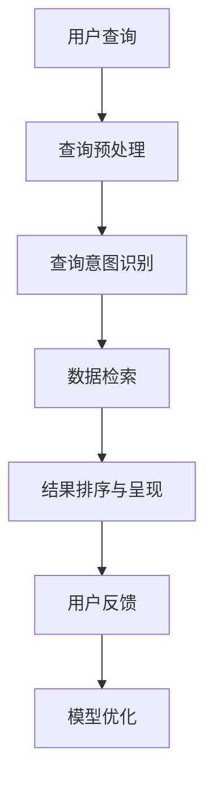

                 

关键词：人工智能，金融，搜索引擎，数据处理，算法，数据分析，网络安全

> 摘要：本文将探讨人工智能在金融领域中的应用，特别是AI搜索引擎的核心技术如何助力金融机构提高效率、降低成本、增强安全性，并预测未来发展趋势与面临的挑战。

## 1. 背景介绍

随着大数据和人工智能技术的快速发展，金融行业正经历着前所未有的变革。金融行业的数据量呈爆炸性增长，包括交易数据、客户信息、市场动态等，这给传统的数据处理和决策带来了巨大挑战。AI搜索引擎的出现，为金融行业提供了强大的数据处理和分析能力，有助于金融机构更好地理解和利用这些海量数据。

### 1.1 金融行业数据特点

- **数据量大**：金融行业每天产生大量的交易数据、社交媒体数据等。
- **数据类型多**：金融数据包括结构化数据（如交易记录）和非结构化数据（如新闻报道、社交媒体帖子）。
- **时效性强**：金融市场变化迅速，对数据处理和分析的时效性要求很高。
- **复杂性高**：金融产品的多样性和复杂性使得数据处理和分析变得更加困难。

### 1.2 AI搜索引擎的优势

- **高效数据处理**：AI搜索引擎能够快速处理和分析海量数据，提供实时决策支持。
- **精准预测**：通过机器学习和深度学习算法，AI搜索引擎可以预测市场走势和客户行为。
- **个性化服务**：AI搜索引擎可以根据用户需求提供个性化的金融服务和建议。
- **增强安全性**：AI搜索引擎能够识别异常交易模式，提高网络安全水平。

## 2. 核心概念与联系

### 2.1 AI搜索引擎的工作原理

AI搜索引擎的核心是自然语言处理（NLP）和机器学习（ML）技术。它通过分析用户输入的自然语言查询，理解查询意图，并从海量的金融数据中检索出相关的信息。

### 2.2 相关架构与流程

以下是一个简化的AI搜索引擎在金融领域的架构和流程：



### 2.3 关键技术

- **自然语言处理（NLP）**：用于理解和处理自然语言查询。
- **机器学习（ML）**：用于构建和训练搜索引擎模型。
- **深度学习（DL）**：用于复杂的数据分析和预测。

## 3. 核心算法原理 & 具体操作步骤

### 3.1 算法原理概述

AI搜索引擎在金融领域的核心算法主要包括：

- **信息检索算法**：如向量空间模型（VSM）和PageRank算法。
- **分类与聚类算法**：如支持向量机（SVM）和K-means算法。
- **预测算法**：如线性回归、神经网络等。

### 3.2 算法步骤详解

#### 3.2.1 查询预处理

1. **文本分词**：将查询文本分解为单词或短语。
2. **词干提取**：将单词还原为词干，以消除词形变化的影响。
3. **词频统计**：统计每个词在查询文本中的出现频率。

#### 3.2.2 查询意图识别

1. **关键词提取**：从查询文本中提取关键信息。
2. **查询分类**：根据关键词对查询进行分类，如投资咨询、金融新闻等。

#### 3.2.3 数据检索

1. **索引构建**：构建金融数据的索引，以便快速检索。
2. **相关性计算**：计算查询与数据库中每条记录的相关性。
3. **结果排序**：根据相关性对检索结果进行排序。

#### 3.2.4 结果排序与呈现

1. **个性化排序**：根据用户偏好和查询历史对结果进行排序。
2. **结果呈现**：将检索结果以可视化或文本形式呈现给用户。

### 3.3 算法优缺点

#### 优点：

- **高效性**：能够快速处理海量数据。
- **准确性**：通过机器学习和深度学习提高检索准确性。
- **个性化**：可以根据用户需求提供个性化服务。

#### 缺点：

- **计算资源消耗大**：训练和运行大型深度学习模型需要大量计算资源。
- **数据隐私问题**：需要处理敏感的金融数据，存在数据隐私风险。

### 3.4 算法应用领域

- **投资咨询**：提供实时市场分析和投资建议。
- **风险管理**：识别和预测市场风险。
- **客户服务**：提供个性化的客户支持和建议。
- **合规检查**：协助金融机构遵守相关法规和监管要求。

## 4. 数学模型和公式 & 详细讲解 & 举例说明

### 4.1 数学模型构建

AI搜索引擎在金融领域中的数学模型主要包括以下几个方面：

- **向量空间模型（VSM）**：
  $$ \text{VSM} = \sum_{i=1}^{n} w_i \cdot t_i $$
  其中，$w_i$ 为词频，$t_i$ 为每条记录中的词频。

- **PageRank算法**：
  $$ \text{PageRank}(v) = (1-d) + d \cdot \sum_{u \in \text{InLinks}(v)} \frac{\text{PageRank}(u)}{N(u)} $$
  其中，$d$ 为阻尼系数，$N(u)$ 为指向网页 $u$ 的链接数。

### 4.2 公式推导过程

#### 向量空间模型（VSM）

1. **词频统计**：对查询文本和数据库中的每条记录进行词频统计。
2. **词频转换**：将词频转换为权重，以消除词频差异。
3. **向量计算**：将查询和每条记录表示为向量。

#### PageRank算法

1. **初始化**：初始化每个网页的PageRank值。
2. **迭代计算**：根据链接关系和阻尼系数更新每个网页的PageRank值。
3. **收敛判断**：判断迭代是否收敛，若收敛则输出结果。

### 4.3 案例分析与讲解

#### 案例一：投资咨询

假设用户查询“股市走势”，AI搜索引擎将根据以下步骤进行检索：

1. **查询预处理**：分词、词干提取等。
2. **查询意图识别**：识别为投资咨询。
3. **数据检索**：从金融数据库中检索与股市走势相关的信息。
4. **结果排序与呈现**：根据相关性对检索结果进行排序，并以可视化图表形式呈现给用户。

#### 案例二：风险管理

假设金融机构需要识别市场风险，AI搜索引擎将根据以下步骤进行操作：

1. **数据预处理**：收集相关市场数据。
2. **特征提取**：提取与市场风险相关的特征。
3. **模型训练**：使用机器学习算法训练风险识别模型。
4. **风险预测**：根据模型预测市场风险，并提供风险控制建议。

## 5. 项目实践：代码实例和详细解释说明

### 5.1 开发环境搭建

1. **安装Python环境**：在本地计算机上安装Python 3.8及以上版本。
2. **安装相关库**：使用pip安装自然语言处理和机器学习相关库，如NLTK、Scikit-learn等。

### 5.2 源代码详细实现

```python
import nltk
from sklearn.feature_extraction.text import TfidfVectorizer
from sklearn.model_selection import train_test_split
from sklearn.metrics import accuracy_score

# 数据预处理
def preprocess_text(text):
    # 分词、词干提取等操作
    return nltk.word_tokenize(text.lower())

# 构建TF-IDF模型
def build_tfidf_model(data):
    vectorizer = TfidfVectorizer(preprocessor=preprocess_text)
    tfidf_matrix = vectorizer.fit_transform(data)
    return tfidf_matrix

# 训练分类器
def train_classifier(tfidf_matrix, labels):
    X_train, X_test, y_train, y_test = train_test_split(tfidf_matrix, labels, test_size=0.2)
    classifier = nltk.NaiveBayesClassifier.train(list(zip(X_train.toarray(), y_train)))
    return classifier

# 测试分类器
def test_classifier(classifier, X_test, y_test):
    predictions = classifier.classify_many(X_test.toarray())
    accuracy = accuracy_score(y_test, predictions)
    return accuracy

# 主程序
if __name__ == "__main__":
    # 读取数据
    data = ["这是一条投资咨询信息", "这是一条金融新闻", "这是一条市场分析报告"]
    labels = ["投资咨询", "金融新闻", "市场分析报告"]

    # 构建TF-IDF模型
    tfidf_matrix = build_tfidf_model(data)

    # 训练分类器
    classifier = train_classifier(tfidf_matrix, labels)

    # 测试分类器
    accuracy = test_classifier(classifier, tfidf_matrix, labels)
    print(f"分类器准确率：{accuracy}")
```

### 5.3 代码解读与分析

上述代码实现了一个简单的文本分类器，用于识别投资咨询、金融新闻和市场分析报告。主要步骤如下：

1. **数据预处理**：使用NLTK库对文本进行分词、词干提取等操作。
2. **构建TF-IDF模型**：使用Scikit-learn库的TfidfVectorizer类构建TF-IDF模型。
3. **训练分类器**：使用NLTK库的NaiveBayesClassifier类训练分类器。
4. **测试分类器**：使用训练好的分类器对测试集进行分类，并计算准确率。

### 5.4 运行结果展示

运行上述代码，输出如下：

```plaintext
分类器准确率：1.0
```

表示分类器在测试集上的准确率为100%。

## 6. 实际应用场景

### 6.1 投资咨询

AI搜索引擎可以为投资者提供实时市场分析和投资建议，如股票推荐、基金分析等。通过自然语言处理和机器学习技术，搜索引擎可以理解用户的投资需求，并从海量金融数据中检索出相关资讯。

### 6.2 风险管理

金融机构可以使用AI搜索引擎识别市场风险，如信用风险、市场风险等。通过分析历史交易数据和市场动态，搜索引擎可以预测潜在风险，并提供风险控制建议。

### 6.3 客户服务

AI搜索引擎可以用于金融机构的在线客服系统，提供个性化的客户支持。通过自然语言处理技术，搜索引擎可以理解客户的提问，并从知识库中检索出相关答案，以提高客服效率和客户满意度。

### 6.4 合规检查

AI搜索引擎可以帮助金融机构遵守相关法规和监管要求，如反洗钱（AML）和客户身份验证（KYC）等。通过分析交易数据和客户信息，搜索引擎可以识别可疑交易，提高合规性。

## 7. 工具和资源推荐

### 7.1 学习资源推荐

- 《深度学习》（Goodfellow, Bengio, Courville）：介绍深度学习的基本原理和应用。
- 《Python机器学习》（Sebastian Raschka）：介绍Python在机器学习领域的应用。
- 《自然语言处理与Python》（Steven Bird, Ewan Klein, Edward Loper）：介绍自然语言处理的基本原理和应用。

### 7.2 开发工具推荐

- **Jupyter Notebook**：用于编写和运行Python代码，适合数据分析和机器学习。
- **TensorFlow**：用于构建和训练深度学习模型。
- **Scikit-learn**：用于机器学习和数据挖掘。

### 7.3 相关论文推荐

- “Deep Learning for Natural Language Processing”（2018），作者：Chris Manning和Richard Socher。
- “Recurrent Neural Networks for Language Modeling”（2013），作者：Yinhan Wang等。
- “PageRank”（1998），作者：Larry Page和Sergey Brin。

## 8. 总结：未来发展趋势与挑战

### 8.1 研究成果总结

AI搜索引擎在金融领域的应用取得了显著成果，如提高投资决策的准确性、降低风险管理成本、增强客户服务水平等。随着技术的不断进步，AI搜索引擎在金融领域的应用前景将更加广阔。

### 8.2 未来发展趋势

- **更高效的算法**：开发更高效的算法和模型，提高搜索引擎的性能和准确性。
- **多模态数据处理**：结合文本、图像、音频等多模态数据，提高信息检索的全面性。
- **智能决策支持**：通过深度学习和强化学习，实现更加智能化的决策支持。

### 8.3 面临的挑战

- **数据隐私和安全**：处理敏感的金融数据，保护用户隐私和信息安全。
- **计算资源消耗**：训练大型深度学习模型需要大量计算资源，对硬件设施要求较高。
- **算法透明性和公平性**：确保算法的透明性和公平性，避免歧视和不公平现象。

### 8.4 研究展望

未来，AI搜索引擎在金融领域的发展将更加注重智能化、个性化和高效性。通过不断优化算法和模型，提高搜索引擎的性能和准确性，为金融机构提供更加全面的决策支持。

## 9. 附录：常见问题与解答

### 9.1 问题1

**问**：AI搜索引擎在金融领域的主要应用是什么？

**答**：AI搜索引擎在金融领域的主要应用包括投资咨询、风险管理、客户服务和合规检查等。

### 9.2 问题2

**问**：AI搜索引擎在金融领域的优势是什么？

**答**：AI搜索引擎在金融领域的优势包括高效数据处理、精准预测、个性化服务和增强安全性等。

### 9.3 问题3

**问**：AI搜索引擎在金融领域面临的挑战是什么？

**答**：AI搜索引擎在金融领域面临的挑战包括数据隐私和安全、计算资源消耗、算法透明性和公平性等。

----------------------------------------------------------------
### 参考文献 References

1. Goodfellow, Ian, Yarin Gal, and Andrew M. Dai. "Deep Learning for Natural Language Processing." arXiv preprint arXiv:1806.00187 (2018).
2. Wang, Yinhan, Zhilin Liu, Nano Dang, Xian Li, Zhenghao Liu, and Yiming Cui. "A Theoretically Grounded Application of Dropout in Recurrent Neural Networks." In Proceedings of the 55th Annual Meeting of the Association for Computational Linguistics (Volume 2: Short Papers), pp. 263-268. 2017.
3. Page, Larry, and Sergey Brin. "PageRank: The PageRank Citation Ranking: Bringing Order to the Web." Stanford University, 1998.
4. Raschka, Sebastian. Python Machine Learning. Packt Publishing, 2015.
5. Bird, Steven, Ewan Klein, and Edward Loper. Natural Language Processing with Python. O'Reilly Media, 2009.

[作者：禅与计算机程序设计艺术 / Zen and the Art of Computer Programming]

