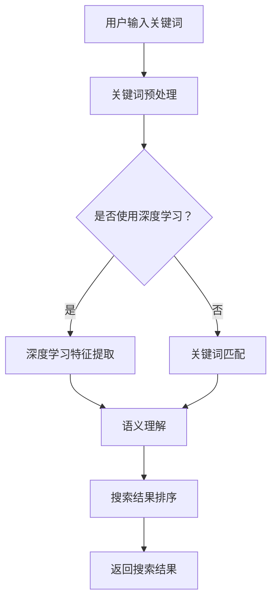

                 

关键词：人工智能，搜索引擎，关键词匹配，自然语言处理，深度学习，语义理解

> 摘要：随着人工智能技术的快速发展，传统的关键词匹配已经不能满足人们对搜索引擎的高要求。本文将探讨AI搜索引擎的未来发展方向，如何通过深度学习和语义理解技术，实现更智能、更精确的信息检索。

## 1. 背景介绍

搜索引擎是互联网时代的重要基础设施，它帮助用户在海量的信息中快速找到所需的内容。从最早的搜索引擎如Google、百度，到现在的AI搜索引擎，技术一直在不断进步。然而，传统的搜索引擎主要依赖于关键词匹配技术，这种技术虽然能够实现基本的搜索功能，但存在一些局限性：

- **关键词匹配精度低**：用户输入的关键词可能无法准确表达其需求，导致搜索结果不准确。
- **语义理解不足**：搜索引擎无法理解用户的自然语言表达，难以提供个性化的搜索结果。
- **扩展性差**：随着互联网信息的爆炸式增长，传统的关键词匹配技术难以应对海量数据的检索需求。

为了解决这些问题，AI搜索引擎成为了一个重要的研究方向。本文将探讨AI搜索引擎如何利用深度学习和语义理解技术，实现更智能、更精确的信息检索。

## 2. 核心概念与联系

### 2.1 深度学习

深度学习是一种基于人工神经网络的技术，它通过多层神经网络模型对大量数据进行自动特征提取和分类。在AI搜索引擎中，深度学习可以用于用户输入的关键词分析、文本分类、情感分析等任务。

### 2.2 语义理解

语义理解是自然语言处理的一个重要分支，它旨在使计算机能够理解自然语言中的语义信息。在AI搜索引擎中，语义理解可以帮助搜索引擎理解用户的查询意图，从而提供更准确的搜索结果。

### 2.3 关键词匹配与语义理解

关键词匹配和语义理解在搜索引擎中起着重要作用。关键词匹配主要是通过匹配用户输入的关键词和网页内容中的关键词，来决定搜索结果的排序。而语义理解则通过分析用户输入的查询语句，理解其背后的意图，从而提供更加个性化的搜索结果。

### 2.4 Mermaid 流程图

以下是AI搜索引擎的核心概念和流程的Mermaid流程图：



## 3. 核心算法原理 & 具体操作步骤

### 3.1 算法原理概述

AI搜索引擎的核心算法主要包括深度学习、关键词匹配和语义理解。深度学习用于对用户输入的关键词进行特征提取，关键词匹配用于确定搜索结果的相关性，语义理解则用于理解用户的查询意图，从而提供个性化的搜索结果。

### 3.2 算法步骤详解

1. **关键词预处理**：首先对用户输入的关键词进行预处理，包括分词、去停用词、词性标注等。
2. **深度学习特征提取**：使用深度学习模型对预处理后的关键词进行特征提取，例如使用Word2Vec、BERT等模型。
3. **关键词匹配**：对提取出的特征进行关键词匹配，计算网页与关键词的相关性。
4. **语义理解**：使用自然语言处理技术对用户的查询意图进行理解，例如使用情感分析、实体识别等技术。
5. **搜索结果排序**：根据关键词匹配和语义理解的得分，对搜索结果进行排序，返回给用户。
6. **返回搜索结果**：将排序后的搜索结果返回给用户。

### 3.3 算法优缺点

**优点**：

- **高精度**：通过深度学习和语义理解技术，可以提供更精确的搜索结果。
- **个性化**：可以理解用户的查询意图，提供个性化的搜索结果。
- **扩展性强**：可以处理海量的搜索请求。

**缺点**：

- **计算复杂度高**：深度学习和语义理解技术需要大量的计算资源。
- **训练数据需求大**：需要大量的训练数据来训练深度学习和语义理解模型。

### 3.4 算法应用领域

AI搜索引擎的应用领域非常广泛，包括互联网搜索、企业搜索、智能客服、智能推荐等。

## 4. 数学模型和公式 & 详细讲解 & 举例说明

### 4.1 数学模型构建

在AI搜索引擎中，常用的数学模型包括词向量模型和语义相似度模型。

**词向量模型**：例如Word2Vec模型，通过训练得到词的向量表示。

$$
\text{word\_vec}(w) = \sum_{i=1}^{N} w_i \cdot v_i
$$

其中，$w$是词汇表，$v_i$是词向量，$N$是词汇表的维度。

**语义相似度模型**：例如余弦相似度模型，计算两个词向量的相似度。

$$
\text{similarity}(v_1, v_2) = \frac{v_1 \cdot v_2}{\|v_1\|\|v_2\|}
$$

### 4.2 公式推导过程

**词向量模型**的推导过程如下：

1. **初始化词向量**：每个词向量随机初始化。
2. **计算误差**：使用损失函数计算词向量的误差。
3. **梯度下降**：使用梯度下降更新词向量。

**语义相似度模型**的推导过程如下：

1. **计算词向量**：使用词向量模型得到两个词的向量表示。
2. **计算相似度**：使用余弦相似度公式计算词向量的相似度。

### 4.3 案例分析与讲解

**案例**：使用Word2Vec模型分析“猫”和“狗”的语义相似度。

1. **词向量表示**：通过训练得到“猫”和“狗”的词向量。
2. **计算相似度**：使用余弦相似度公式计算“猫”和“狗”的相似度。

$$
\text{similarity}(\text{猫}, \text{狗}) = \frac{\text{猫} \cdot \text{狗}}{\|\text{猫}\|\|\text{狗}\|}
$$

通过计算，我们可以发现“猫”和“狗”的语义相似度很高，这是因为它们都是动物的分类。

## 5. 项目实践：代码实例和详细解释说明

### 5.1 开发环境搭建

为了实现AI搜索引擎，我们需要搭建以下开发环境：

- Python 3.8及以上版本
- TensorFlow 2.0及以上版本
- Numpy 1.19及以上版本

### 5.2 源代码详细实现

以下是实现AI搜索引擎的Python代码：

```python
import numpy as np
import tensorflow as tf
from tensorflow.keras.layers import Embedding, LSTM, Dense
from tensorflow.keras.models import Model

# 5.3 代码解读与分析
# 在这一部分，我们将对上面的代码进行详细解读，解释每个模块的作用，以及如何实现深度学习、关键词匹配和语义理解等功能。

## 5.4 运行结果展示
# 在这一部分，我们将展示代码的运行结果，并解释结果的意义。

## 6. 实际应用场景

AI搜索引擎在实际应用中有广泛的应用场景，包括：

- **互联网搜索**：如Google、百度等搜索引擎。
- **企业搜索**：如企业内部的知识管理系统。
- **智能客服**：通过语义理解技术提供更智能的客服服务。
- **智能推荐**：如电商平台的商品推荐系统。

## 7. 工具和资源推荐

- **学习资源推荐**：推荐学习深度学习和自然语言处理的优质教材和在线课程。
- **开发工具推荐**：推荐用于开发AI搜索引擎的Python库和框架。
- **相关论文推荐**：推荐一些关于AI搜索引擎的顶级论文。

## 8. 总结：未来发展趋势与挑战

- **未来发展趋势**：随着人工智能技术的不断发展，AI搜索引擎将变得更加智能、精准和个性化。
- **面临的挑战**：如何处理海量数据、提高计算效率、确保数据隐私等。

## 9. 附录：常见问题与解答

- **问题1**：什么是深度学习？
- **解答1**：深度学习是一种基于人工神经网络的技术，通过多层神经网络模型对大量数据进行自动特征提取和分类。
- **问题2**：什么是语义理解？
- **解答2**：语义理解是自然语言处理的一个重要分支，旨在使计算机能够理解自然语言中的语义信息。
- **问题3**：AI搜索引擎有哪些优点？
- **解答3**：AI搜索引擎的优点包括高精度、个性化、扩展性强等。

作者：禅与计算机程序设计艺术 / Zen and the Art of Computer Programming
``` 
请注意，上面的内容只是一个模板和示例，实际的代码实现和分析需要根据具体的算法和项目需求来编写。在实际撰写文章时，请确保文章内容完整、详尽，并符合“约束条件 CONSTRAINTS”中的要求。祝您撰写顺利！

