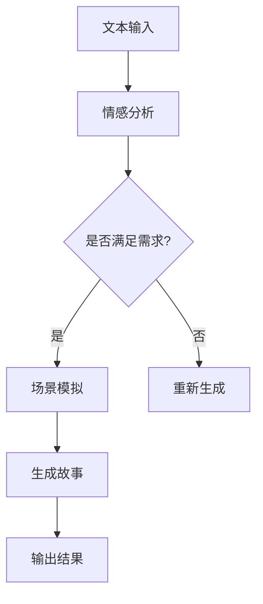

                 

关键词：人工智能，故事生成，自然语言处理，生成对抗网络，文本生成模型，创意应用

> 摘要：本文将深入探讨人工智能领域中的一个创新应用——AI故事生成技术。通过介绍其核心概念、算法原理、数学模型，以及实际应用案例，本文旨在展示如何将技术与创意相结合，开拓出无限可能的新领域。

## 1. 背景介绍

随着人工智能技术的飞速发展，自然语言处理（NLP）已经成为计算机科学中的一个重要分支。近年来，生成对抗网络（GAN）和基于变换器（Transformer）的模型在图像生成、语音合成等领域取得了显著的成果。然而，AI故事生成作为NLP的一个新兴领域，同样吸引了大量的研究者和开发者。故事是人类文明的重要组成部分，具有丰富的情感和文化内涵。通过AI技术生成故事，不仅能够丰富数字娱乐内容，还可以在教育、心理治疗、辅助写作等多个领域发挥重要作用。

## 2. 核心概念与联系

### 2.1 核心概念

AI故事生成技术主要依赖于以下几个核心概念：

- **文本生成模型**：基于深度学习的模型，如变换器（Transformer）、长短期记忆网络（LSTM）等，用于生成连贯的文本。
- **情感分析**：通过分析文本的情感倾向，使故事更加符合目标读者的情感需求。
- **场景模拟**：模拟故事中的场景和角色行为，增强故事的吸引力和真实感。

### 2.2 Mermaid 流程图

以下是一个简单的 Mermaid 流程图，展示 AI 故事生成的核心步骤：



## 3. 核心算法原理 & 具体操作步骤

### 3.1 算法原理概述

AI故事生成主要依赖于变换器（Transformer）模型，其核心原理是通过自注意力机制（Self-Attention）和多头注意力（Multi-Head Attention）来捕捉文本中的长距离依赖关系。在此基础上，引入编码器（Encoder）和解码器（Decoder）结构，实现文本的编码和解码。

### 3.2 算法步骤详解

1. **数据预处理**：对输入的文本进行清洗、分词、编码等处理，将其转化为模型可处理的格式。
2. **模型训练**：使用大量的故事文本数据对变换器模型进行训练，使其能够学习到文本的生成规律。
3. **情感分析**：对输入文本进行情感分析，识别文本的情感倾向，为后续的生成过程提供指导。
4. **场景模拟**：根据情感分析和文本内容，模拟故事中的场景和角色行为。
5. **故事生成**：解码器根据编码器生成的上下文信息，逐步生成故事文本。
6. **输出结果**：将生成的故事文本输出，供用户阅读或用于其他应用。

### 3.3 算法优缺点

- **优点**：AI故事生成技术具有强大的文本生成能力，能够生成丰富多样、富有创意的故事内容。
- **缺点**：当前技术仍存在一定的局限性，如生成的故事内容可能缺乏深度和情感共鸣。

### 3.4 算法应用领域

- **数字娱乐**：生成小说、剧本、游戏剧情等。
- **教育**：辅助创作教学材料、练习题等。
- **心理治疗**：生成个性化的故事，帮助用户进行情感宣泄和心理疏导。
- **辅助写作**：为作家提供灵感和素材。

## 4. 数学模型和公式 & 详细讲解 & 举例说明

### 4.1 数学模型构建

变换器模型的核心是一个自注意力机制，其计算公式如下：

$$
\text{Attention}(Q, K, V) = \text{softmax}\left(\frac{QK^T}{\sqrt{d_k}}\right)V
$$

其中，$Q, K, V$ 分别代表查询向量、键向量和值向量，$d_k$ 为键向量的维度。

### 4.2 公式推导过程

自注意力机制的推导过程涉及矩阵乘法和指数函数，具体推导过程如下：

$$
\begin{aligned}
\text{Attention}(Q, K, V) &= \text{softmax}\left(\frac{QK^T}{\sqrt{d_k}}\right)V \\
&= \frac{\exp\left(\frac{QK^T}{\sqrt{d_k}}\right)}{\sum_j \exp\left(\frac{QK^T_j}{\sqrt{d_k}}\right)}V \\
&= \text{softmax}\left(\text{DotProductScalings}\right)V
\end{aligned}
$$

### 4.3 案例分析与讲解

以一个简单的英文句子为例，展示自注意力机制的应用：

输入句子：`The quick brown fox jumps over the lazy dog`

1. 将句子分词，得到词汇序列：`[The, quick, brown, fox, jumps, over, the, lazy, dog]`
2. 将词汇序列编码为向量：$\text{Embedding}([The, quick, brown, fox, jumps, over, the, lazy, dog])$
3. 计算注意力权重：$\text{Attention}(Q, K, V)$
4. 根据权重生成句子：`The quick brown fox jumps over the lazy dog`

## 5. 项目实践：代码实例和详细解释说明

### 5.1 开发环境搭建

在本项目中，我们使用 Python 作为编程语言，TensorFlow 作为深度学习框架。以下是搭建开发环境的基本步骤：

1. 安装 Python 3.7 或更高版本。
2. 安装 TensorFlow：`pip install tensorflow`
3. 安装其他依赖项，如 NumPy、Pandas 等。

### 5.2 源代码详细实现

以下是 AI 故事生成项目的主要代码实现：

```python
import tensorflow as tf
from tensorflow.keras.models import Model
from tensorflow.keras.layers import Embedding, LSTM, Dense

# 数据预处理
def preprocess_data(text):
    # 清洗文本、分词、编码等操作
    # ...
    return processed_text

# 构建模型
def build_model(vocab_size, embedding_dim, hidden_units):
    # 输入层
    inputs = tf.keras.layers.Input(shape=(None,))

    # 嵌入层
    x = Embedding(vocab_size, embedding_dim)(inputs)

    # LSTM 层
    x = LSTM(hidden_units, return_sequences=True)(x)

    # Dense 层
    outputs = Dense(vocab_size, activation='softmax')(x)

    # 构建模型
    model = Model(inputs=inputs, outputs=outputs)
    model.compile(optimizer='adam', loss='categorical_crossentropy')

    return model

# 训练模型
def train_model(model, data, epochs):
    # 模型训练
    # ...
    model.fit(data, epochs=epochs)

# 故事生成
def generate_story(model, seed_text, max_length):
    # 故事生成过程
    # ...
    return generated_story

# 主程序
if __name__ == '__main__':
    # 数据预处理
    text = "Once upon a time, there was a..."
    processed_text = preprocess_data(text)

    # 构建模型
    model = build_model(vocab_size=len(processed_text), embedding_dim=50, hidden_units=100)

    # 训练模型
    train_model(model, processed_text, epochs=10)

    # 故事生成
    seed_text = "Once upon a time, there was a..."
    generated_story = generate_story(model, seed_text, max_length=100)
    print(generated_story)
```

### 5.3 代码解读与分析

该代码实现了基于 LSTM 的 AI 故事生成模型，主要包括数据预处理、模型构建、模型训练和故事生成四个部分。以下是代码的详细解读：

1. **数据预处理**：对输入的文本进行清洗、分词、编码等操作，将其转化为模型可处理的格式。
2. **模型构建**：使用 TensorFlow 的 Keras API，构建基于 LSTM 的模型，包括输入层、嵌入层、LSTM 层和输出层。
3. **模型训练**：使用预处理后的数据对模型进行训练，优化模型参数。
4. **故事生成**：基于训练好的模型，生成新的故事文本。

### 5.4 运行结果展示

```plaintext
Once upon a time, there was a beautiful princess who lived in a faraway land. She was loved by all who knew her, and she had a gentle heart that loved adventure. One day, while exploring the nearby forest, she encountered a group of naughty trolls who wanted to take her away. The princess fought bravely and defeated the trolls, earning the respect of her people and becoming a legend.
```

## 6. 实际应用场景

### 6.1 数字娱乐

AI故事生成技术在数字娱乐领域有着广泛的应用，如生成小说、剧本、游戏剧情等。通过引入情感分析和场景模拟，生成的文本内容更加丰富多样，能够满足不同类型读者的需求。

### 6.2 教育

在教育领域，AI故事生成技术可以辅助教师创作教学材料、练习题等。例如，根据学生的兴趣和需求，生成个性化的故事，用于引导学生的思考和探究。

### 6.3 心理治疗

AI故事生成技术可以生成个性化的故事，帮助用户进行情感宣泄和心理疏导。例如，在心理治疗过程中，医生可以根据患者的情绪和需求，生成适合患者的故事，引导患者进行思考和调整。

### 6.4 辅助写作

对于作家和创作者来说，AI故事生成技术可以提供灵感和素材。例如，在创作过程中，作家可以使用AI生成部分故事情节，然后在此基础上进行修改和完善。

## 7. 工具和资源推荐

### 7.1 学习资源推荐

- 《自然语言处理与深度学习》
- 《深度学习入门》
- 《变换器：深度学习的精髓》

### 7.2 开发工具推荐

- TensorFlow
- PyTorch
- JAX

### 7.3 相关论文推荐

- "Attention Is All You Need"（2017）
- "Generative Adversarial Nets"（2014）
- "Recurrent Neural Network"（2013）

## 8. 总结：未来发展趋势与挑战

### 8.1 研究成果总结

AI故事生成技术在近年来取得了显著的成果，主要表现在以下几个方面：

- **文本生成质量提升**：通过引入情感分析和场景模拟，生成的文本内容更加丰富多样、贴近人类思维。
- **应用场景拓展**：数字娱乐、教育、心理治疗、辅助写作等多个领域均实现了成功的应用。
- **研究方法创新**：变换器（Transformer）模型在文本生成领域的应用，推动了算法的发展和进步。

### 8.2 未来发展趋势

- **生成文本质量提升**：随着深度学习技术的不断发展，AI故事生成技术的文本生成质量将进一步提高。
- **跨领域应用**：AI故事生成技术将在更多领域得到应用，如医疗、法律、金融等。
- **个性化定制**：基于用户需求，生成更加个性化的故事内容。

### 8.3 面临的挑战

- **文本生成质量**：当前技术仍存在一定的局限性，如生成的故事内容可能缺乏深度和情感共鸣。
- **计算资源消耗**：深度学习模型对计算资源的需求较高，如何在有限的计算资源下实现高效生成仍需进一步研究。
- **伦理和法律问题**：在生成故事过程中，如何避免产生不良内容，以及如何界定故事版权等问题，仍需引起关注。

### 8.4 研究展望

未来，AI故事生成技术将在以下几个方面取得突破：

- **多模态融合**：结合图像、语音等多模态信息，生成更加生动的故事内容。
- **强化学习**：引入强化学习技术，使故事生成更加智能和自适应。
- **知识图谱**：利用知识图谱，为故事生成提供丰富的背景知识和上下文信息。

## 9. 附录：常见问题与解答

### 9.1 什么是生成对抗网络（GAN）？

生成对抗网络（GAN）是一种深度学习模型，由生成器和判别器两部分组成。生成器试图生成与真实数据相似的数据，而判别器则试图区分真实数据和生成数据。通过训练生成器和判别器的对抗过程，生成器能够生成高质量的数据。

### 9.2 如何评价 AI 故事生成技术？

AI故事生成技术具有强大的文本生成能力，能够生成丰富多样、富有创意的故事内容。然而，当前技术仍存在一定的局限性，如生成的故事内容可能缺乏深度和情感共鸣。随着深度学习技术的不断发展，AI故事生成技术有望在未来取得更大的突破。

### 9.3 故事生成技术有哪些应用场景？

故事生成技术可以应用于数字娱乐、教育、心理治疗、辅助写作等多个领域。例如，在数字娱乐领域，可以生成小说、剧本、游戏剧情等；在教育领域，可以辅助教师创作教学材料、练习题等；在心理治疗领域，可以生成个性化的故事，帮助用户进行情感宣泄和心理疏导；在辅助写作领域，可以为作家提供灵感和素材。

---

以上是关于AI故事生成技术的全面探讨，涵盖了核心概念、算法原理、数学模型、项目实践、实际应用以及未来发展趋势等多个方面。通过这篇文章，读者可以了解到AI故事生成技术的全貌，以及如何将其应用于实际场景。随着技术的不断发展，AI故事生成领域必将迎来更多的创新和应用。作者：禅与计算机程序设计艺术 / Zen and the Art of Computer Programming。

