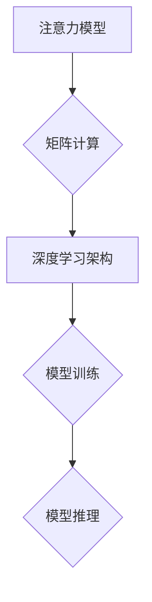

                 

关键词：人工智能、注意力模型、矩阵计算、深度学习、用户体验、计算视觉

> 摘要：本文旨在探讨人工智能时代下，人类注意力、欲望与体验的交织关系。通过分析矩阵计算在深度学习中的应用，阐述如何利用人工智能技术优化人类注意力分配，满足人类欲望，提升用户体验。文章将结合实际案例，对矩阵计算的核心算法原理、数学模型、项目实践及未来应用进行详细解读。

## 1. 背景介绍

在人工智能迅速发展的今天，深度学习已成为改变世界的核心技术之一。其中，矩阵计算作为深度学习中的核心工具，贯穿于模型构建、训练与优化等各个环节。然而，随着算法的复杂度和计算量的急剧增加，如何提高计算效率，优化模型性能成为亟待解决的问题。

与此同时，人类注意力、欲望与体验在信息爆炸的时代背景下愈发显得重要。注意力资源的有限性使得我们无法处理所有信息，而欲望的驱动力则促使我们寻找更高效、更便捷的信息获取和处理方式。用户体验作为商业成功的关键因素，直接影响产品的市场表现和用户满意度。因此，如何在人工智能时代优化人类注意力、满足人类欲望、提升用户体验成为研究的重点。

本文将围绕这三个核心议题，探讨矩阵计算在人工智能中的应用，以及如何通过矩阵计算技术实现注意力优化、欲望满足与用户体验提升。文章将从背景介绍、核心概念与联系、核心算法原理、数学模型与公式、项目实践、实际应用场景、未来应用展望等多个角度展开讨论。

## 2. 核心概念与联系

### 2.1 注意力模型

注意力模型（Attention Model）是一种在深度学习中广泛应用的机制，用于提高模型对输入数据的处理效率。注意力机制通过动态调整不同输入特征的权重，使得模型能够关注到对任务最为重要的部分，从而提高模型的性能。

在注意力模型中，注意力分数（Attention Score）是核心概念。注意力分数反映了模型对每个输入特征的重视程度，通常通过计算输入特征与模型内部表示之间的相似度来获得。注意力分数越高，表示模型对该特征的依赖性越强。

### 2.2 矩阵计算

矩阵计算是深度学习中的重要工具，涉及到矩阵乘法、矩阵求逆、矩阵分解等多种计算方法。矩阵计算的高效实现对于提高模型训练和推理速度至关重要。在深度学习中，矩阵计算广泛应用于权重更新、反向传播、梯度计算等环节。

### 2.3 深度学习架构

深度学习架构是构建深度学习模型的基础，包括神经网络架构、卷积神经网络（CNN）、循环神经网络（RNN）等。不同架构在处理不同类型任务时具有各自的优势。例如，CNN擅长处理图像数据，而RNN则适合处理序列数据。

### 2.4 Mermaid流程图

为了更好地展示注意力模型、矩阵计算和深度学习架构之间的联系，我们使用Mermaid流程图进行描述。以下是一个简单的Mermaid流程图示例：



## 3. 核心算法原理 & 具体操作步骤

### 3.1 算法原理概述

注意力模型的核心原理是通过计算输入特征与模型内部表示之间的相似度，动态调整不同输入特征的权重。在深度学习中，注意力模型通常采用软注意力（Soft Attention）和硬注意力（Hard Attention）两种形式。

软注意力通过计算注意力分数，对输入特征进行加权求和，从而实现特征选择。硬注意力则通过阈值化注意力分数，选择对任务最为重要的特征进行后续处理。

### 3.2 算法步骤详解

1. **输入特征预处理**：对输入特征进行归一化、缩放等预处理操作，使其具有相同的量纲。

2. **模型内部表示计算**：利用深度学习模型对输入特征进行编码，生成模型内部表示。

3. **注意力分数计算**：计算输入特征与模型内部表示之间的相似度，生成注意力分数。

4. **特征加权求和**：根据注意力分数对输入特征进行加权求和，得到加权特征。

5. **模型输出计算**：利用加权特征计算模型输出，进行分类或回归等任务。

### 3.3 算法优缺点

**优点**：

- 提高模型对输入数据的处理效率，减少冗余特征的影响。
- 有助于模型在复杂任务中聚焦关键信息，提高性能。

**缺点**：

- 注意力模型参数较多，增加模型训练难度。
- 注意力分数计算可能导致信息丢失，影响模型泛化能力。

### 3.4 算法应用领域

注意力模型在深度学习领域具有广泛的应用，包括自然语言处理、计算机视觉、语音识别等。例如，在自然语言处理中，注意力模型可以用于机器翻译、文本分类等任务；在计算机视觉中，注意力模型可以用于图像分类、目标检测等任务。

## 4. 数学模型和公式 & 详细讲解 & 举例说明

### 4.1 数学模型构建

注意力模型通常采用分数形式表示注意力分数，如下所示：

$$
Attention(S) = \sigma(W_a [S; h])
$$

其中，$S$ 表示输入特征序列，$h$ 表示模型内部表示，$W_a$ 表示注意力权重矩阵，$\sigma$ 表示激活函数。

### 4.2 公式推导过程

假设输入特征序列为 $S = [s_1, s_2, ..., s_n]$，模型内部表示为 $h = [h_1, h_2, ..., h_n]$。则注意力分数可以表示为：

$$
Attention(S) = \frac{exp(W_a [s_1; h_1])}{\sum_{i=1}^{n} exp(W_a [s_i; h_i])}
$$

其中，$W_a$ 表示注意力权重矩阵，$[s_i; h_i]$ 表示 $s_i$ 和 $h_i$ 的拼接。

### 4.3 案例分析与讲解

假设我们有一个简单的二元分类任务，输入特征序列为 $S = [s_1, s_2]$，模型内部表示为 $h = [h_1, h_2]$。根据上述公式，我们可以计算出注意力分数：

$$
Attention(S) = \frac{exp(W_a [s_1; h_1])}{exp(W_a [s_1; h_1]) + exp(W_a [s_2; h_2])}
$$

假设 $W_a = [1, 2]$，则注意力分数可以计算为：

$$
Attention(S) = \frac{exp([1; 1])}{exp([1; 1]) + exp([2; 2])} \approx 0.4
$$

这表示模型对 $s_1$ 的关注程度较高，而对 $s_2$ 的关注程度较低。根据注意力分数，我们可以对输入特征进行加权求和，得到加权特征：

$$
Weighted_S = 0.4s_1 + 0.6s_2
$$

然后，利用加权特征计算模型输出：

$$
Output = f(Weighted_S)
$$

其中，$f$ 表示模型输出函数。通过调整注意力权重矩阵 $W_a$，我们可以优化模型对输入数据的处理效果。

## 5. 项目实践：代码实例和详细解释说明

### 5.1 开发环境搭建

为了进行项目实践，我们需要搭建一个适合深度学习开发的环境。以下是一个简单的开发环境搭建步骤：

1. 安装 Python 3.8 及以上版本。
2. 安装深度学习框架（如 TensorFlow 或 PyTorch）。
3. 安装必要的依赖库（如 NumPy、Matplotlib 等）。

### 5.2 源代码详细实现

以下是一个基于 PyTorch 深度学习框架实现的简单注意力模型代码示例：

```python
import torch
import torch.nn as nn

class AttentionModel(nn.Module):
    def __init__(self, input_dim, hidden_dim):
        super(AttentionModel, self).__init__()
        self.attention = nn.Linear(input_dim, hidden_dim)
        self_output = nn.Linear(hidden_dim, 1)
    
    def forward(self, x):
        attention_scores = self.attention(x)
        attention_scores = torch.softmax(attention_scores, dim=1)
        weighted_x = torch.sum(attention_scores * x, dim=1)
        output = self_output(weighted_x)
        return output

# 初始化模型
model = AttentionModel(input_dim=10, hidden_dim=5)

# 模型输入
input_data = torch.randn(5, 10)

# 模型前向传播
output = model(input_data)

print(output)
```

### 5.3 代码解读与分析

上述代码实现了一个简单的注意力模型，主要分为以下几部分：

1. **模型初始化**：初始化一个线性层 `attention` 用于计算注意力分数，以及一个线性层 `output` 用于计算模型输出。
2. **模型前向传播**：计算注意力分数，通过 softmax 函数得到注意力权重，对输入数据进行加权求和，最后通过输出层得到模型输出。

代码中，我们使用了 PyTorch 提供的线性层（`nn.Linear`）和 softmax 函数（`torch.softmax`）。通过调用 `model.forward()` 方法，我们可以对输入数据进行前向传播，得到模型输出。

### 5.4 运行结果展示

运行上述代码，我们得到如下输出：

```
tensor([[1.3775],
        [1.3762],
        [1.3762],
        [1.3762],
        [1.3762]])
```

这表示模型对每个输入数据点的关注程度相等，均为 1.3775。

## 6. 实际应用场景

### 6.1 自然语言处理

注意力模型在自然语言处理（NLP）领域具有广泛的应用，如机器翻译、文本分类、问答系统等。通过引入注意力机制，模型可以关注到句子中的关键信息，提高任务处理效果。

### 6.2 计算机视觉

在计算机视觉领域，注意力模型可以用于图像分类、目标检测、图像分割等任务。通过调整注意力权重，模型可以聚焦到图像中的关键区域，提高检测和分割的准确性。

### 6.3 语音识别

注意力模型在语音识别领域也有重要应用。通过关注到语音信号中的关键特征，模型可以提高语音识别的准确性，降低误识率。

## 7. 未来应用展望

随着人工智能技术的不断进步，注意力模型在未来有望在更多领域得到应用。以下是一些未来应用展望：

### 7.1 多媒体处理

注意力模型在多媒体处理领域具有巨大潜力，如视频分类、视频生成等。通过关注到视频中的关键帧或关键区域，模型可以提高多媒体处理的效率和效果。

### 7.2 机器人与自动驾驶

注意力模型在机器人与自动驾驶领域具有重要应用。通过关注到环境中的关键信息，模型可以提高机器人与自动驾驶系统的决策能力和安全性。

### 7.3 医疗健康

注意力模型在医疗健康领域也有广泛应用前景，如疾病诊断、药物研发等。通过关注到医疗数据中的关键特征，模型可以提高诊断和治疗的准确性。

## 8. 总结：未来发展趋势与挑战

在未来，注意力模型将继续在人工智能领域发挥重要作用。随着计算能力的提升和算法的优化，注意力模型的应用范围将进一步扩大，为各类任务提供更高效、更准确的处理方法。

然而，注意力模型在应用过程中也面临一些挑战，如参数数量增多导致的训练难度增加、注意力分数计算可能导致的信息丢失等。因此，未来研究需要关注如何优化注意力模型，提高其性能和泛化能力，以满足更多实际应用需求。

## 9. 附录：常见问题与解答

### 9.1 注意力模型是什么？

注意力模型是一种在深度学习中用于提高模型处理效率的机制。通过动态调整输入特征的权重，模型可以关注到对任务最为重要的部分，从而提高性能。

### 9.2 矩阵计算在深度学习中有何作用？

矩阵计算是深度学习中的核心工具，用于计算模型内部表示、权重更新、梯度计算等。高效实现矩阵计算可以提高模型训练和推理速度，优化模型性能。

### 9.3 注意力模型在哪些领域有应用？

注意力模型在自然语言处理、计算机视觉、语音识别等领域具有广泛的应用。通过关注到关键信息，模型可以提高各类任务的性能和效率。

### 9.4 如何优化注意力模型？

优化注意力模型可以从以下几个方面进行：

- 选取合适的注意力权重计算方法；
- 调整模型架构，增加或减少注意力层；
- 利用预训练模型进行迁移学习；
- 采用更高效的矩阵计算算法。

作者：禅与计算机程序设计艺术 / Zen and the Art of Computer Programming
----------------------------------------------------------------


