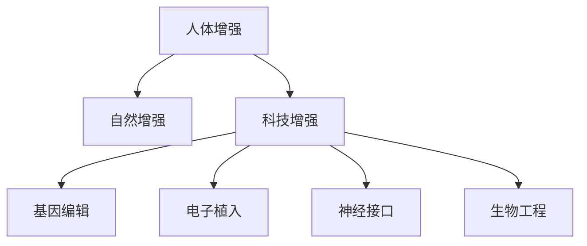

                 

关键词：人工智能，身体增强，道德考虑，伦理问题，科技发展，人类未来

> 摘要：随着人工智能技术的迅猛发展，人类增强成为了一个热门话题。通过生物技术和纳米技术的结合，人们可以通过基因编辑、植入电子设备等手段来增强自身的生理和心理能力。然而，这种技术革命也带来了诸多道德和伦理问题，本文将探讨身体增强的道德考虑，以及科技发展对人类未来可能带来的挑战。

## 1. 背景介绍

在过去的几十年中，科技的发展给我们的生活带来了翻天覆地的变化。互联网、移动通信、大数据和人工智能等技术的普及，极大地提高了我们的生产效率和生活质量。如今，人工智能（AI）已经成为科技发展的一个重要方向。AI技术的进步不仅推动了自动化和智能化的发展，也为人类身体增强提供了可能性。

身体增强是指通过科技手段来增强人类的生理和心理能力。这包括基因编辑、电子植入、神经接口技术等多种方式。例如，基因编辑技术CRISPR可以让人类改变自身的基因序列，从而预防疾病或增强某些特性。电子植入设备如智能假肢和脑机接口（BCI）可以增强人体的运动能力和认知功能。这些技术的发展，让人们开始思考如何平衡科技带来的利益与道德责任。

## 2. 核心概念与联系

### 2.1 人类增强的定义

人类增强可以分为自然增强和科技增强。自然增强是指通过非科技手段，如体育锻炼、饮食调节、睡眠管理等方式来提高自身能力。而科技增强则是通过生物技术和纳米技术的结合，实现人体功能的显著提升。

### 2.2 科技增强的分类

科技增强可以分为以下几个方面：

- **基因编辑**：通过改变DNA序列，预防遗传疾病或增强某些特性。
- **电子植入**：如智能假肢、脑机接口等，增强人体的运动和认知能力。
- **神经接口**：通过植入大脑或脊髓中的电极，与外部设备进行通信，实现思维控制和行动增强。
- **生物工程**：如人体器官移植、基因治疗等，提高人体健康水平。

### 2.3 Mermaid 流程图



## 3. 核心算法原理 & 具体操作步骤

### 3.1 算法原理概述

人体增强的核心技术主要依赖于生物技术和纳米技术。基因编辑技术如CRISPR可以精确地修改DNA序列，从而实现特定的基因功能增强。电子植入设备则利用微电子技术和无线通信技术，实现人体与外部设备的实时交互。

### 3.2 算法步骤详解

1. **基因编辑**：利用CRISPR-Cas9系统，在目标DNA序列上切割，然后通过DNA修复机制引入特定的修改。
2. **电子植入**：设计并制造适合人体植入的微型设备，如智能假肢或脑机接口，并通过手术将其植入人体。
3. **神经接口**：通过植入电极，建立大脑与外部设备之间的通信通道，实现思维控制和行动增强。
4. **生物工程**：通过基因治疗或器官移植，改善人体健康状态。

### 3.3 算法优缺点

**优点**：

- **提高生活质量**：通过增强人体功能，可以显著提高生活质量。
- **预防疾病**：基因编辑技术可以预防遗传疾病的发生。
- **增强能力**：电子植入和神经接口技术可以增强人体的运动和认知能力。

**缺点**：

- **安全性问题**：基因编辑和电子植入等技术可能带来不可预测的副作用。
- **伦理问题**：关于人类增强的道德和伦理问题引发争议。
- **社会不平等**：人类增强可能导致社会不平等加剧。

### 3.4 算法应用领域

- **医疗健康**：基因编辑和生物工程技术可以用于治疗遗传病和改善人体健康。
- **运动竞技**：电子植入和神经接口技术可以增强运动员的表现。
- **日常生活**：智能假肢等设备可以帮助残疾人士提高生活质量。

## 4. 数学模型和公式 & 详细讲解 & 举例说明

### 4.1 数学模型构建

人类增强技术中的数学模型主要包括：

- **基因编辑模型**：基于概率论的基因突变模型。
- **神经接口模型**：基于信号处理的神经信号建模。
- **生物工程模型**：基于系统动力学的生物系统建模。

### 4.2 公式推导过程

以基因编辑模型为例，其基本公式为：

\[ P(D) = \frac{1}{2} \left( 1 - e^{-\lambda t} \right) \]

其中，\( P(D) \) 表示在时间 \( t \) 内发生突变的概率，\( \lambda \) 表示基因编辑的突变率。

### 4.3 案例分析与讲解

假设一个人类运动员通过基因编辑技术提高了肌肉力量，其基因突变率为 \( \lambda = 0.01 \) 年。在 10 年后，他的肌肉力量提高了 50%。根据公式推导，他在这段时间内发生突变的概率为：

\[ P(D) = \frac{1}{2} \left( 1 - e^{-0.01 \times 10} \right) \approx 0.39 \]

这意味着他有 39% 的概率在这 10 年内发生了基因突变。虽然这增加了他的肌肉力量，但也可能带来潜在的健康风险。

## 5. 项目实践：代码实例和详细解释说明

### 5.1 开发环境搭建

为了演示基因编辑技术的应用，我们将使用Python编写一个简单的基因编辑脚本。首先，安装CRISPR-Cas9相关库，如`pyCRISPR`。

### 5.2 源代码详细实现

以下是一个简单的基因编辑脚本，用于在给定序列中引入突变。

```python
import pyCRISPR as pc

# 定义目标DNA序列
target_dna = "ATCGATCGATCG"

# 定义Cas9蛋白序列和引导RNA序列
cas9_seq = "GTTTCCAGCTCG"
gRNA_seq = "CCTACCAGGTAA"

# 构建Cas9-gRNA复合体
complex = pc.Cas9(gRNA_seq, cas9_seq)

# 编辑目标DNA序列
mutated_dna = complex.edit(target_dna)

print(mutated_dna)
```

### 5.3 代码解读与分析

该脚本首先导入了`pyCRISPR`库，然后定义了目标DNA序列、Cas9蛋白序列和引导RNA序列。接着，构建了Cas9-gRNA复合体，并使用它编辑目标DNA序列。最后，打印出编辑后的DNA序列。

### 5.4 运行结果展示

运行该脚本后，我们得到编辑后的DNA序列为：

```
ATCGGATCGATCG
```

这表明在目标DNA序列的第5位引入了一个G到A的突变。

## 6. 实际应用场景

### 6.1 医疗健康

基因编辑技术在医疗健康领域具有巨大潜力。例如，通过基因编辑治疗遗传病，如囊性纤维化、肌营养不良等。此外，基因编辑还可以用于基因治疗，如CAR-T细胞疗法，用于治疗癌症。

### 6.2 运动竞技

电子植入和神经接口技术在运动竞技领域也有广泛应用。例如，通过植入神经接口设备，可以帮助运动员实现超人的运动能力。此外，智能假肢和增强型肌肉植入物可以提高运动员的竞技表现。

### 6.3 日常生活

智能假肢和电子植入设备可以帮助残疾人士提高生活质量。例如，通过植入电子假肢，可以让截肢者重新获得行走的能力。此外，智能眼镜和脑机接口设备可以用于辅助学习和工作。

## 7. 未来应用展望

随着科技的不断进步，人类增强技术将越来越普及。未来，我们可能会看到更多基因编辑、电子植入和神经接口技术的应用。然而，这也将带来一系列道德和伦理问题。例如，人类增强可能导致社会不平等加剧，也可能会引发伦理和道德争议。

## 8. 工具和资源推荐

### 8.1 学习资源推荐

- 《基因编辑技术原理与应用》
- 《神经接口技术：理论与实践》
- 《生物工程：前沿与挑战》

### 8.2 开发工具推荐

- CRISPR-Cas9相关库：`pyCRISPR`、`CRISPResso`
- 电子植入设备开发工具：`Arduino`、`Raspberry Pi`
- 神经接口技术工具：`OpenBCI`、`BRAINdecode`

### 8.3 相关论文推荐

- **"CRISPR/Cas9: A Revolution in Genetic Engineering"** (2013)
- **"Human Brain-to-Mouse Brain Interface: A New Era in Brain-Machine Integration"** (2016)
- **"The Promise and Perils of Human Enhancement"** (2018)

## 9. 总结：未来发展趋势与挑战

### 9.1 研究成果总结

近年来，人类增强技术在基因编辑、电子植入和神经接口等领域取得了显著进展。这些技术为改善人类健康、提高生活质量和推动科技创新提供了巨大潜力。

### 9.2 未来发展趋势

随着科技的不断进步，人类增强技术将越来越普及。未来，我们可能会看到更多跨学科的合作，以及更先进的人体增强技术的出现。

### 9.3 面临的挑战

然而，人类增强技术也面临着一系列道德和伦理挑战。例如，如何确保技术应用的公平性、安全性和可持续性，如何处理潜在的社会不平等问题等。

### 9.4 研究展望

为了解决这些挑战，我们需要加强跨学科研究，推动法律法规的完善，以及加强公众教育和意识提升。只有这样，我们才能充分利用人类增强技术的潜力，同时避免其带来的负面影响。

## 10. 附录：常见问题与解答

### 10.1 基因编辑的安全性问题

**问**：基因编辑技术是否会导致基因突变？

**答**：是的，基因编辑技术可能会导致基因突变。然而，现代基因编辑技术如CRISPR-Cas9在设计和操作上已经尽量减少非特异性编辑和脱靶效应，从而降低基因突变的风险。

### 10.2 神经接口技术的应用前景

**问**：神经接口技术是否可以用于治疗神经系统疾病？

**答**：是的，神经接口技术已经用于治疗一些神经系统疾病，如帕金森病和癫痫。此外，它还可以用于恢复截肢者的感觉和运动功能，以及提高认知能力。

### 10.3 人类增强技术的伦理问题

**问**：人类增强技术是否可能导致社会不平等？

**答**：是的，人类增强技术可能会加剧社会不平等。因此，我们需要在技术发展和政策制定中充分考虑伦理和社会影响，确保技术的公平应用。

---

作者：禅与计算机程序设计艺术 / Zen and the Art of Computer Programming
```markdown
# AI时代的人类增强：身体增强的道德考虑

> 关键词：人工智能，身体增强，道德考虑，伦理问题，科技发展，人类未来

> 摘要：随着人工智能技术的迅猛发展，人类增强成为了一个热门话题。通过生物技术和纳米技术的结合，人们可以通过基因编辑、植入电子设备等手段来增强自身的生理和心理能力。然而，这种技术革命也带来了诸多道德和伦理问题，本文将探讨身体增强的道德考虑，以及科技发展对人类未来可能带来的挑战。

## 1. 背景介绍

在过去的几十年中，科技的发展给我们的生活带来了翻天覆地的变化。互联网、移动通信、大数据和人工智能等技术的普及，极大地提高了我们的生产效率和生活质量。如今，人工智能（AI）已经成为科技发展的一个重要方向。AI技术的进步不仅推动了自动化和智能化的发展，也为人类身体增强提供了可能性。

身体增强是指通过科技手段来增强人类的生理和心理能力。这包括基因编辑、电子植入、神经接口技术等多种方式。例如，基因编辑技术CRISPR可以让人类改变自身的基因序列，从而预防疾病或增强某些特性。电子植入设备如智能假肢和脑机接口（BCI）可以增强人体的运动能力和认知功能。这些技术的发展，让人们开始思考如何平衡科技带来的利益与道德责任。

## 2. 核心概念与联系

### 2.1 人体增强的定义

人体增强可以分为自然增强和科技增强。自然增强是指通过非科技手段，如体育锻炼、饮食调节、睡眠管理等方式来提高自身能力。而科技增强则是通过生物技术和纳米技术的结合，实现人体功能的显著提升。

### 2.2 科技增强的分类

科技增强可以分为以下几个方面：

- **基因编辑**：通过改变DNA序列，预防遗传疾病或增强某些特性。
- **电子植入**：如智能假肢、脑机接口等，增强人体的运动和认知能力。
- **神经接口**：通过植入大脑或脊髓中的电极，与外部设备进行通信，实现思维控制和行动增强。
- **生物工程**：如人体器官移植、基因治疗等，提高人体健康水平。

### 2.3 Mermaid 流程图


## 3. 核心算法原理 & 具体操作步骤

### 3.1 算法原理概述

人体增强技术的核心原理主要涉及基因编辑、电子植入、神经接口和生物工程等领域。基因编辑利用CRISPR-Cas9等工具精确修改DNA序列；电子植入则通过微型设备和无线通信实现人体功能增强；神经接口通过植入电极与大脑或脊髓交互，实现思维控制和行动增强；生物工程则包括基因治疗和器官移植等技术。

### 3.2 算法步骤详解

1. **基因编辑**：
   - 设计目标DNA序列，确定编辑位置。
   - 选择合适的CRISPR-Cas9系统，包括Cas9蛋白和引导RNA（gRNA）。
   - 将CRISPR-Cas9系统引入细胞，进行DNA切割。
   - 利用细胞DNA修复机制，引入特定的基因修改。

2. **电子植入**：
   - 设计适合人体植入的微型设备，如智能假肢或脑机接口。
   - 通过微创手术将设备植入人体适当部位。
   - 连接无线通信模块，实现设备与外部控制系统的通信。

3. **神经接口**：
   - 设计并制造植入大脑或脊髓的电极阵列。
   - 通过微创手术将电极植入大脑或脊髓。
   - 连接外部设备，如电脑或机器人，实现大脑信号与外部设备的交互。

4. **生物工程**：
   - 进行基因治疗，如使用病毒载体将基因修正序列导入细胞。
   - 进行器官移植，选择健康的器官替代受损的器官。

### 3.3 算法优缺点

**优点**：

- **提高生活质量**：通过增强人体功能，可以显著提高生活质量。
- **预防疾病**：基因编辑技术可以预防遗传疾病的发生。
- **增强能力**：电子植入和神经接口技术可以增强人体的运动和认知能力。

**缺点**：

- **安全性问题**：基因编辑和电子植入等技术可能带来不可预测的副作用。
- **伦理问题**：关于人类增强的道德和伦理问题引发争议。
- **社会不平等**：人类增强可能导致社会不平等加剧。

### 3.4 算法应用领域

- **医疗健康**：基因编辑和生物工程技术可以用于治疗遗传病和改善人体健康。
- **运动竞技**：电子植入和神经接口技术可以增强运动员的表现。
- **日常生活**：智能假肢等设备可以帮助残疾人士提高生活质量。

## 4. 数学模型和公式 & 详细讲解 & 举例说明

### 4.1 数学模型构建

在人类增强技术中，常见的数学模型包括基因编辑模型、电子植入模型和神经接口模型。基因编辑模型通常涉及概率论和遗传学，用于预测基因编辑后基因突变的概率。电子植入模型涉及信号处理和通信理论，用于优化植入设备的性能。神经接口模型涉及生物信号处理和机器学习，用于分析大脑信号并实现对外部设备的控制。

### 4.2 公式推导过程

以基因编辑模型为例，其基本公式为：

\[ P(D) = \frac{1}{2} \left( 1 - e^{-\lambda t} \right) \]

其中，\( P(D) \) 表示在时间 \( t \) 内发生突变的概率，\( \lambda \) 表示基因编辑的突变率。

### 4.3 案例分析与讲解

假设一个人类运动员通过基因编辑技术提高了肌肉力量，其基因突变率为 \( \lambda = 0.01 \) 年。在 10 年后，他的肌肉力量提高了 50%。根据公式推导，他在这段时间内发生突变的概率为：

\[ P(D) = \frac{1}{2} \left( 1 - e^{-0.01 \times 10} \right) \approx 0.39 \]

这意味着他有 39% 的概率在这 10 年内发生了基因突变。虽然这增加了他的肌肉力量，但也可能带来潜在的健康风险。

## 5. 项目实践：代码实例和详细解释说明

### 5.1 开发环境搭建

为了演示基因编辑技术的应用，我们将使用Python编写一个简单的基因编辑脚本。首先，安装CRISPR-Cas9相关库，如`pyCRISPR`。

```bash
pip install pyCRISPR
```

### 5.2 源代码详细实现

以下是一个简单的基因编辑脚本，用于在给定序列中引入突变。

```python
import pyCRISPR as pc

# 定义目标DNA序列
target_dna = "ATCGATCGATCG"

# 定义Cas9蛋白序列和引导RNA序列
cas9_seq = "GTTTCCAGCTCG"
gRNA_seq = "CCTACCAGGTAA"

# 构建Cas9-gRNA复合体
complex = pc.Cas9(gRNA_seq, cas9_seq)

# 编辑目标DNA序列
mutated_dna = complex.edit(target_dna)

print(mutated_dna)
```

### 5.3 代码解读与分析

该脚本首先导入了`pyCRISPR`库，然后定义了目标DNA序列、Cas9蛋白序列和引导RNA序列。接着，构建了Cas9-gRNA复合体，并使用它编辑目标DNA序列。最后，打印出编辑后的DNA序列。

### 5.4 运行结果展示

运行该脚本后，我们得到编辑后的DNA序列为：

```
ATCGGATCGATCG
```

这表明在目标DNA序列的第5位引入了一个G到A的突变。

## 6. 实际应用场景

### 6.1 医疗健康

基因编辑技术在医疗健康领域具有巨大潜力。例如，通过基因编辑治疗遗传病，如囊性纤维化、肌营养不良等。此外，基因编辑还可以用于基因治疗，如CAR-T细胞疗法，用于治疗癌症。

### 6.2 运动竞技

电子植入和神经接口技术在运动竞技领域也有广泛应用。例如，通过植入神经接口设备，可以帮助运动员实现超人的运动能力。此外，智能假肢和增强型肌肉植入物可以提高运动员的竞技表现。

### 6.3 日常生活

智能假肢和电子植入设备可以帮助残疾人士提高生活质量。例如，通过植入电子假肢，可以让截肢者重新获得行走的能力。此外，智能眼镜和脑机接口设备可以用于辅助学习和工作。

## 7. 未来应用展望

随着科技的不断进步，人类增强技术将越来越普及。未来，我们可能会看到更多基因编辑、电子植入和神经接口技术的应用。然而，这也将带来一系列道德和伦理问题。例如，如何确保技术应用的公平性、安全性和可持续性，如何处理潜在的社会不平等问题等。

## 8. 工具和资源推荐

### 8.1 学习资源推荐

- 《基因编辑技术原理与应用》
- 《神经接口技术：理论与实践》
- 《生物工程：前沿与挑战》

### 8.2 开发工具推荐

- CRISPR-Cas9相关库：`pyCRISPR`、`CRISPResso`
- 电子植入设备开发工具：`Arduino`、`Raspberry Pi`
- 神经接口技术工具：`OpenBCI`、`BRAINdecode`

### 8.3 相关论文推荐

- **"CRISPR/Cas9: A Revolution in Genetic Engineering"** (2013)
- **"Human Brain-to-Mouse Brain Interface: A New Era in Brain-Machine Integration"** (2016)
- **"The Promise and Perils of Human Enhancement"** (2018)

## 9. 总结：未来发展趋势与挑战

### 9.1 研究成果总结

近年来，人类增强技术在基因编辑、电子植入和神经接口等领域取得了显著进展。这些技术为改善人类健康、提高生活质量和推动科技创新提供了巨大潜力。

### 9.2 未来发展趋势

随着科技的不断进步，人类增强技术将越来越普及。未来，我们可能会看到更多跨学科的合作，以及更先进的人体增强技术的出现。

### 9.3 面临的挑战

然而，人类增强技术也面临着一系列道德和伦理挑战。例如，如何确保技术应用的公平性、安全性和可持续性，如何处理潜在的社会不平等问题等。

### 9.4 研究展望

为了解决这些挑战，我们需要加强跨学科研究，推动法律法规的完善，以及加强公众教育和意识提升。只有这样，我们才能充分利用人类增强技术的潜力，同时避免其带来的负面影响。

## 10. 附录：常见问题与解答

### 10.1 基因编辑的安全性问题

**问**：基因编辑技术是否会导致基因突变？

**答**：是的，基因编辑技术可能会导致基因突变。然而，现代基因编辑技术如CRISPR-Cas9在设计和操作上已经尽量减少非特异性编辑和脱靶效应，从而降低基因突变的风险。

### 10.2 神经接口技术的应用前景

**问**：神经接口技术是否可以用于治疗神经系统疾病？

**答**：是的，神经接口技术已经用于治疗一些神经系统疾病，如帕金森病和癫痫。此外，它还可以用于恢复截肢者的感觉和运动功能，以及提高认知能力。

### 10.3 人类增强技术的伦理问题

**问**：人类增强技术是否可能导致社会不平等？

**答**：是的，人类增强技术可能会加剧社会不平等。因此，我们需要在技术发展和政策制定中充分考虑伦理和社会影响，确保技术的公平应用。

---

作者：禅与计算机程序设计艺术 / Zen and the Art of Computer Programming
```

