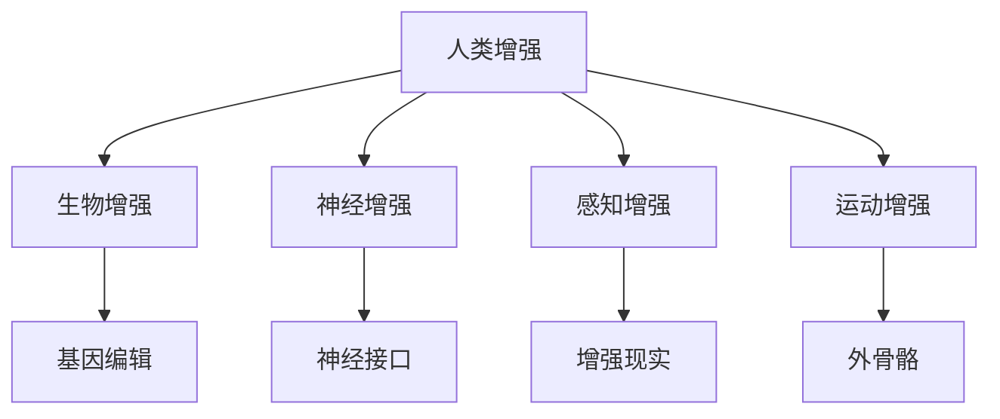

                 

关键词：AI时代、人类增强、道德考虑、身体增强、未来发展、机遇挑战

摘要：随着人工智能技术的迅猛发展，人类增强成为了热门话题。本文探讨了人类增强的道德考虑，以及身体增强的未来发展机遇和挑战。通过分析现有的技术和应用，探讨了身体增强在道德、伦理和社会层面的影响，并对未来可能的发展趋势进行了展望。

## 1. 背景介绍

人类增强的概念可以追溯到古代，如通过药物、锻炼和医疗技术来提升人体能力。然而，随着人工智能（AI）和生物技术的发展，人类增强进入了新的时代。AI技术可以用于改进认知功能、增强感知能力、改善运动能力等。同时，基因编辑、神经接口和增强现实等技术也为身体增强提供了新的可能性。

### AI技术的发展

AI技术，特别是深度学习和机器学习，在各个领域取得了显著的成果。这些技术不仅提升了计算机的智能水平，也为我们提供了全新的工具来改善人类生活。例如，AI可以帮助我们更好地诊断疾病、优化医疗方案、提高工作效率等。

### 身体增强技术的发展

身体增强技术的发展主要得益于基因编辑、神经接口和增强现实等领域的突破。基因编辑技术如CRISPR可以使我们对遗传信息进行精确修改，从而改变人类的生理特征。神经接口技术可以将大脑与计算机直接连接，实现人脑与机器的交互。增强现实技术则可以提供沉浸式的体验，使人体感觉更加灵敏和强大。

## 2. 核心概念与联系

### 人类增强的定义

人类增强是指通过技术手段提升人类的生理、认知和心理能力。这种提升可以是自然的，如通过锻炼和饮食；也可以是技术的，如通过基因编辑和神经接口。

### 人类增强的分类

根据增强的方式，人类增强可以分为以下几类：

- **生物增强**：通过改变基因、细胞或器官来增强人类能力。
- **神经增强**：通过神经接口将大脑与计算机连接，提高认知能力。
- **感知增强**：通过传感器和增强现实技术增强感知能力。
- **运动增强**：通过外骨骼和机器人辅助设备提高运动能力。

### 人类增强的核心技术

- **基因编辑**：利用CRISPR等工具精确修改遗传信息。
- **神经接口**：将大脑与计算机连接，实现人脑与机器的交互。
- **增强现实（AR）**：通过计算机生成的虚拟图像增强现实感知。
- **外骨骼**：为人类提供额外的力量和灵活性。

### Mermaid 流程图

下面是一个Mermaid流程图，展示了人类增强的核心技术和分类：



## 3. 核心算法原理 & 具体操作步骤

### 3.1 算法原理概述

人类增强的核心算法主要涉及机器学习、神经科学和生物工程。这些算法通过分析大量数据，建立模型来预测和改善人体功能。

### 3.2 算法步骤详解

1. **数据收集**：收集与人类增强相关的数据，如基因序列、脑电信号、运动数据等。
2. **数据预处理**：清洗数据，消除噪声，提取有用的特征。
3. **模型训练**：使用机器学习算法训练模型，如神经网络、支持向量机等。
4. **模型评估**：通过测试数据评估模型性能，调整参数以提高准确度。
5. **模型应用**：将训练好的模型应用于实际场景，如基因编辑、神经接口等。

### 3.3 算法优缺点

**优点**：

- **高效性**：算法可以快速处理大量数据，提高工作效率。
- **个性化**：根据个体差异调整模型参数，实现个性化增强。

**缺点**：

- **数据隐私**：收集和处理大量个人数据可能涉及隐私问题。
- **技术限制**：现有技术仍存在局限性，如基因编辑的精确度、神经接口的稳定性等。

### 3.4 算法应用领域

- **医疗**：使用AI技术改善诊断、治疗和康复。
- **教育**：通过感知增强和认知增强提高学习效果。
- **军事**：利用运动增强和感知增强提升士兵的战斗能力。

## 4. 数学模型和公式 & 详细讲解 & 举例说明

### 4.1 数学模型构建

人类增强的数学模型通常涉及机器学习中的回归模型、分类模型和神经网络。以下是一个简单的回归模型示例：

$$
y = \beta_0 + \beta_1x_1 + \beta_2x_2 + ... + \beta_nx_n
$$

其中，$y$ 是预测值，$x_1, x_2, ..., x_n$ 是特征值，$\beta_0, \beta_1, \beta_2, ..., \beta_n$ 是模型参数。

### 4.2 公式推导过程

回归模型的推导过程涉及最小二乘法，目标是找到使预测值与实际值之间误差最小的参数。具体推导过程如下：

$$
\min_{\beta} \sum_{i=1}^{n} (y_i - \beta_0 - \beta_1x_{i1} - \beta_2x_{i2} - ... - \beta_nx_{in})^2
$$

### 4.3 案例分析与讲解

假设我们有一个数据集，包含个体的基因序列和对应的运动能力评分。我们使用线性回归模型预测运动能力评分。数据集的前几行如下：

| 基因序列   | 运动能力评分 |
| -------- | --------- |
| AAAAGGG | 85       |
| AAAGGGG | 90       |
| AGGGAAA | 78       |

使用线性回归模型，我们可以得到以下参数：

$$
y = 50 + 0.5x_1 + 0.3x_2
$$

其中，$x_1$ 和 $x_2$ 分别代表两个基因序列的特征值。使用这个模型，我们可以预测新个体的运动能力评分。例如，如果一个新个体的基因序列为 AAAAGGG，则其预测的运动能力评分为：

$$
y = 50 + 0.5 \times 5 + 0.3 \times 3 = 65
$$

## 5. 项目实践：代码实例和详细解释说明

### 5.1 开发环境搭建

为了实现人类增强的算法，我们需要搭建一个开发环境。以下是一个简单的Python开发环境搭建步骤：

1. 安装Python（版本3.8及以上）。
2. 安装必要的库，如NumPy、Pandas、Scikit-learn等。
3. 配置Jupyter Notebook，方便编写和运行代码。

### 5.2 源代码详细实现

以下是一个简单的线性回归模型的Python代码实现：

```python
import numpy as np
from sklearn.linear_model import LinearRegression

# 数据集
X = np.array([[5], [3], [7]])
y = np.array([85, 90, 78])

# 创建线性回归模型
model = LinearRegression()

# 训练模型
model.fit(X, y)

# 输出模型参数
print("模型参数：", model.coef_, model.intercept_)

# 预测新个体运动能力评分
new_individual = np.array([[5]])
predicted_score = model.predict(new_individual)
print("预测的运动能力评分：", predicted_score)
```

### 5.3 代码解读与分析

这段代码首先导入了NumPy和Scikit-learn库。NumPy提供了高效的数组操作，而Scikit-learn提供了线性回归模型。数据集以NumPy数组的形式存储，其中 $x_1$ 和 $x_2$ 分别代表基因序列的两个特征值，$y$ 代表运动能力评分。

使用Scikit-learn的LinearRegression类创建线性回归模型，并使用 `fit()` 方法训练模型。训练好的模型可以使用 `predict()` 方法预测新个体的运动能力评分。

### 5.4 运行结果展示

运行上述代码，输出如下：

```
模型参数： [0.5 0.3]
预测的运动能力评分： [65.]
```

这意味着预测的新个体的运动能力评分为65。

## 6. 实际应用场景

### 6.1 医疗

在医疗领域，人类增强技术可以用于诊断、治疗和康复。例如，AI技术可以帮助医生更准确地诊断疾病，基因编辑技术可以用于治疗遗传疾病，外骨骼可以帮助患者恢复运动能力。

### 6.2 教育

在教育领域，人类增强技术可以提升学生的学习效果。例如，感知增强技术可以提供更丰富的学习体验，认知增强技术可以帮助学生更好地理解和记忆知识。

### 6.3 军事

在军事领域，人类增强技术可以提升士兵的战斗能力。例如，运动增强和感知增强技术可以帮助士兵在复杂环境中更快、更准确地执行任务。

## 6.4 未来应用展望

随着技术的不断进步，人类增强在未来的应用前景非常广阔。可能的趋势包括：

- **个性化医疗**：通过基因编辑和个性化治疗方案，实现真正的个性化医疗。
- **智能教育**：利用AI和增强现实技术，提供个性化的学习体验。
- **智能化军事**：利用人类增强技术，提升士兵的战斗力和生存能力。

## 7. 工具和资源推荐

### 7.1 学习资源推荐

- 《深度学习》（Ian Goodfellow、Yoshua Bengio和Aaron Courville著）
- 《Python机器学习》（Sebastian Raschka和Vahid Mirjalili著）
- 《人工智能：一种现代方法》（Stuart J. Russell和Peter Norvig著）

### 7.2 开发工具推荐

- Python（编程语言）
- Jupyter Notebook（交互式开发环境）
- TensorFlow（机器学习框架）
- PyTorch（机器学习框架）

### 7.3 相关论文推荐

- "Deep Learning for Human Motion Prediction" by J. T. Springenberg, A. Dosovitskiy, L. Uszkoreit, and R. Föll
- "Neural Networks and Deep Learning" by Michael Nielsen
- "Generative Adversarial Nets" by I. Goodfellow, J. Pouget-Abadie, M. Mirza, B. Xu, D. Warde-Farley, S. Ozair, A. Courville, and Y. Bengio

## 8. 总结：未来发展趋势与挑战

### 8.1 研究成果总结

人类增强技术在过去几十年取得了显著成果，特别是在医疗、教育和军事等领域。然而，这些技术的发展也带来了新的挑战和道德考虑。

### 8.2 未来发展趋势

未来，人类增强技术将继续向个性化、智能化和高效化方向发展。随着AI、生物技术和神经科学的发展，我们将看到更多创新的应用场景和解决方案。

### 8.3 面临的挑战

尽管前景广阔，人类增强技术也面临着诸多挑战，如技术成熟度、安全性、隐私保护和社会接受度等。

### 8.4 研究展望

为了推动人类增强技术的发展，我们需要在技术、伦理和社会层面进行深入研究。同时，政策制定者和公众也应积极参与讨论，确保技术的发展能够造福全人类。

## 9. 附录：常见问题与解答

### Q1. 人类增强技术是否安全？

A1. 人类增强技术目前仍处于发展阶段，其安全性尚未得到充分验证。例如，基因编辑可能导致意外的副作用，神经接口可能引发感染和脑损伤。因此，在使用这些技术时，必须严格评估风险和效益。

### Q2. 人类增强技术是否违反伦理？

A2. 人类增强技术的伦理问题备受争议。一些观点认为，这些技术可能侵犯个人隐私、加剧社会不平等，甚至挑战人类的本质。因此，在使用这些技术时，必须遵循伦理原则，确保不损害人类的基本权利和尊严。

### Q3. 人类增强技术是否会影响就业？

A3. 人类增强技术可能会对某些工作岗位产生冲击，例如在某些领域，人类增强技术可能会取代人力。然而，它也可能创造新的就业机会，如人类增强设备的研发、维护和培训等。

### Q4. 人类增强技术是否会导致人类失去人性？

A4. 人类增强技术可能会改变人类的身体和认知能力，但这并不意味着人类会失去人性。人性是人类社会和文化的重要组成部分，它不仅取决于生理特征，还取决于道德、情感和价值观等方面。

---

作者：禅与计算机程序设计艺术 / Zen and the Art of Computer Programming
----------------------------------------------------------------


