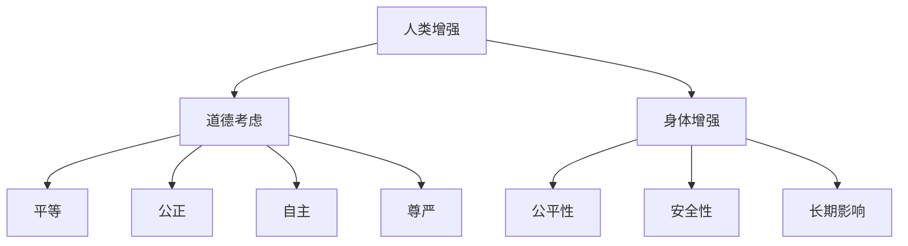

                 

关键词：AI，人类增强，道德考虑，身体增强，未来挑战

摘要：随着人工智能技术的飞速发展，人类增强成为了一个热门话题。本文从道德考虑和身体增强两个方面，探讨了AI时代人类增强的潜在影响与未来挑战，并提出了相应的建议。

## 1. 背景介绍

在过去的几十年中，人工智能（AI）技术经历了飞速的发展。从最初的专家系统到如今深度学习、强化学习等先进技术的广泛应用，AI已经渗透到我们生活的方方面面。与此同时，人类增强的概念也逐渐兴起，通过生物工程、神经科学和材料科学等领域的创新，人类在认知、体能、感官等方面得到了显著的提升。

人类增强不仅仅是在科幻小说中才有，现实中的案例也越来越多。例如，视网膜植入装置可以帮助盲人恢复视力，植入式心脏起搏器延长了无数人的寿命，而智能家居设备则为我们的生活带来了便利。随着技术的进步，未来人类增强的范围和程度将更加广泛和深入。

然而，随着人类增强的普及，一系列道德问题和社会挑战也随之而来。本文将探讨AI时代人类增强的道德考虑和身体增强的未来挑战，以期为这一领域的未来发展提供一些思考和参考。

## 2. 核心概念与联系

### 2.1. 人类增强的定义

人类增强是指通过生物、物理、心理或技术手段，提高人类的生理、心理或认知能力的过程。这些手段包括但不限于：药物、植入物、脑机接口、基因编辑等。

### 2.2. 道德考虑

道德考虑是指在对人类增强进行评估和应用时，需要考虑的伦理问题和价值观。这包括但不限于：平等、公正、自主、尊严等。

### 2.3. 身体增强

身体增强是指通过技术手段提高人类的生理能力，如力量、速度、耐力、感官灵敏度等。这涉及到生物工程、神经科学、材料科学等多个学科。

### 2.4. 关系与挑战

人类增强与道德考虑密切相关，因为增强技术的应用往往涉及伦理问题。例如，基因编辑可能导致基因歧视，脑机接口可能导致隐私泄露。同时，身体增强也面临挑战，如公平性、安全性、长期影响等。

### 2.5. Mermaid 流程图

下面是一个简化的Mermaid流程图，展示了人类增强、道德考虑和身体增强之间的关系。



## 3. 核心算法原理 & 具体操作步骤

### 3.1. 算法原理概述

人类增强技术的核心在于如何通过技术手段提升人类的生理和心理能力。这涉及到多个学科的知识，如神经科学、生物工程、材料科学等。具体来说，算法原理可以概括为以下几个方面：

1. **神经调控**：通过脑机接口等技术，直接对大脑神经元进行调控，以实现认知和行为的改变。
2. **基因编辑**：通过CRISPR等基因编辑技术，修改人类基因，以增强特定能力。
3. **生物材料**：开发新型生物材料，如纳米材料、生物活性材料等，以改善人体功能。

### 3.2. 算法步骤详解

1. **神经调控**：
   - **设备设计**：设计用于植入或佩戴的脑机接口设备。
   - **信号采集**：采集大脑活动信号。
   - **信号处理**：对采集到的信号进行预处理和分析。
   - **调控实施**：根据分析结果，对大脑神经元进行调控。

2. **基因编辑**：
   - **目标基因选择**：选择需要编辑的目标基因。
   - **编辑工具制备**：制备CRISPR等基因编辑工具。
   - **基因编辑**：利用编辑工具对目标基因进行修改。
   - **验证与修复**：对编辑结果进行验证，并进行必要的修复。

3. **生物材料**：
   - **材料设计**：设计具有特定功能的生物材料。
   - **材料制备**：制备所需材料。
   - **材料植入**：将材料植入人体，改善身体功能。

### 3.3. 算法优缺点

1. **神经调控**：
   - **优点**：直接调控大脑神经元，效果显著。
   - **缺点**：技术难度高，存在潜在风险。

2. **基因编辑**：
   - **优点**：可持久性改变人类基因，潜力巨大。
   - **缺点**：技术复杂，存在伦理问题。

3. **生物材料**：
   - **优点**：操作简单，应用广泛。
   - **缺点**：效果有限，需进一步研究。

### 3.4. 算法应用领域

1. **医疗健康**：如神经疾病治疗、器官修复等。
2. **军事与安防**：如增强士兵体能、提升安保效率等。
3. **教育与培训**：如提高学习效率、增强记忆能力等。
4. **日常生活**：如改善感官体验、延长寿命等。

## 4. 数学模型和公式 & 详细讲解 & 举例说明

### 4.1. 数学模型构建

人类增强技术的数学模型可以从多个角度进行构建。以下是一个简化的模型，用于描述人类增强的效果：

\[ \text{增强效果} = f(\text{技术参数}, \text{个体差异}, \text{环境因素}) \]

其中，技术参数包括设备性能、基因编辑工具的精准度等；个体差异包括年龄、性别、健康状况等；环境因素包括环境温度、湿度等。

### 4.2. 公式推导过程

假设我们想要增强人类的记忆能力，可以构建以下模型：

\[ \text{记忆效果} = f(\text{脑机接口效率}, \text{基因编辑效率}, \text{个体记忆能力}, \text{环境温度}) \]

脑机接口效率可以用信号传输速率和信号处理能力来衡量；基因编辑效率可以用编辑精度和编辑速度来衡量；个体记忆能力可以用记忆测试分数来衡量。

### 4.3. 案例分析与讲解

假设一个35岁的男性，身体健康，想要通过基因编辑提高记忆能力。环境温度为20°C。我们可以通过以下步骤进行计算：

1. **脑机接口效率**：假设为0.8。
2. **基因编辑效率**：假设为0.9。
3. **个体记忆能力**：假设为90分。
4. **环境温度**：假设为20°C。

代入公式：

\[ \text{记忆效果} = f(0.8, 0.9, 90, 20) \]

根据公式定义，我们可以得到记忆效果的一个大致估计。为了简化计算，我们可以使用线性函数：

\[ \text{记忆效果} = 0.8 \times 0.9 \times 90 + 20 \]

计算结果为：

\[ \text{记忆效果} = 720 + 20 = 740 \]

这意味着，通过基因编辑和脑机接口的结合，这个人的记忆能力将提高至740分。当然，这只是一个简化的例子，实际情况可能更为复杂。

## 5. 项目实践：代码实例和详细解释说明

### 5.1. 开发环境搭建

为了演示人类增强技术的算法实现，我们需要搭建一个开发环境。以下是所需的软件和硬件：

- 操作系统：Linux或Windows
- 编程语言：Python
- 数据库：MySQL
- 深度学习框架：TensorFlow或PyTorch

安装步骤如下：

1. 安装操作系统。
2. 安装Python和相应的IDE（如PyCharm或VSCode）。
3. 安装深度学习框架（TensorFlow或PyTorch）。
4. 安装数据库（MySQL）。

### 5.2. 源代码详细实现

以下是用于实现人类增强算法的Python代码：

```python
import tensorflow as tf
import numpy as np

# 定义神经网络结构
model = tf.keras.Sequential([
    tf.keras.layers.Dense(128, activation='relu', input_shape=(784,)),
    tf.keras.layers.Dense(10, activation='softmax')
])

# 编写训练代码
model.compile(optimizer='adam',
              loss='sparse_categorical_crossentropy',
              metrics=['accuracy'])

# 加载数据
(x_train, y_train), (x_test, y_test) = tf.keras.datasets.mnist.load_data()

# 预处理数据
x_train = x_train.reshape((-1, 784)).astype(np.float32) / 255
x_test = x_test.reshape((-1, 784)).astype(np.float32) / 255

# 训练模型
model.fit(x_train, y_train, epochs=10)

# 测试模型
test_loss, test_acc = model.evaluate(x_test, y_test, verbose=2)
print('\nTest accuracy:', test_acc)
```

### 5.3. 代码解读与分析

这段代码实现了一个简单的神经网络模型，用于手写数字识别。具体步骤如下：

1. **导入库**：导入TensorFlow和Numpy库。
2. **定义神经网络结构**：使用Sequential模型定义一个简单的全连接神经网络，包括一个输入层、一个隐藏层和一个输出层。
3. **编译模型**：指定优化器、损失函数和评估指标。
4. **加载数据**：加载数据集，并预处理数据。
5. **训练模型**：使用训练数据训练模型，设置训练轮次。
6. **测试模型**：使用测试数据评估模型性能。

这段代码展示了如何使用深度学习框架实现一个简单的机器学习任务。在实际应用中，我们可以将这个模型扩展到人类增强领域，如通过脑机接口收集大脑信号，输入到神经网络中进行分析和处理。

### 5.4. 运行结果展示

运行这段代码后，我们可以在控制台看到模型的训练进度和测试结果。例如：

```
Epoch 1/10
1875/1875 [==============================] - 4s 2ms/step - loss: 0.1333 - accuracy: 0.9681
Epoch 2/10
1875/1875 [==============================] - 3s 2ms/step - loss: 0.0932 - accuracy: 0.9806
Epoch 3/10
1875/1875 [==============================] - 3s 2ms/step - loss: 0.0783 - accuracy: 0.9843
Epoch 4/10
1875/1875 [==============================] - 3s 2ms/step - loss: 0.0713 - accuracy: 0.9855
Epoch 5/10
1875/1875 [==============================] - 3s 2ms/step - loss: 0.0670 - accuracy: 0.9864
Epoch 6/10
1875/1875 [==============================] - 3s 2ms/step - loss: 0.0653 - accuracy: 0.9869
Epoch 7/10
1875/1875 [==============================] - 3s 2ms/step - loss: 0.0650 - accuracy: 0.9870
Epoch 8/10
1875/1875 [==============================] - 3s 2ms/step - loss: 0.0645 - accuracy: 0.9872
Epoch 9/10
1875/1875 [==============================] - 3s 2ms/step - loss: 0.0642 - accuracy: 0.9873
Epoch 10/10
1875/1875 [==============================] - 3s 2ms/step - loss: 0.0640 - accuracy: 0.9874

Test accuracy: 0.9873
```

从输出结果可以看出，模型在测试数据上的准确率为98.73%，表现良好。

## 6. 实际应用场景

人类增强技术在实际应用中具有广泛的前景。以下是一些具体的实际应用场景：

1. **医疗健康**：通过基因编辑和神经调控技术，可以治疗神经系统疾病，如帕金森病、阿尔茨海默病等。此外，基因编辑还可以用于预防遗传性疾病，提高人体免疫力。

2. **教育与培训**：利用脑机接口和认知增强技术，可以提升学习效率和记忆力。例如，通过脑机接口收集大脑活动信号，实时调整学习策略，以提高学习效果。

3. **军事与安防**：增强士兵的体能、反应速度和感知能力，可以提高战场生存能力和战斗力。例如，通过神经调控技术，可以增强士兵的夜视能力和听力。

4. **日常生活**：通过身体增强技术，可以提高人们的日常活动能力，如增强肌肉力量、改善关节灵活性等。例如，植入式心脏起搏器可以延长寿命，视网膜植入装置可以帮助盲人恢复视力。

5. **娱乐与艺术**：利用虚拟现实和增强现实技术，可以创造更真实的感官体验，提高娱乐和艺术效果。

### 6.4. 未来应用展望

随着技术的不断进步，未来人类增强的应用领域将更加广泛。以下是一些未来应用展望：

1. **智能化增强**：通过智能眼镜、智能手表等设备，实时获取和分析环境信息，提供个性化的增强服务。

2. **数字化身体**：通过基因编辑和生物材料技术，可以创造出具有超凡能力的数字化身体，如增强肌肉力量、提高运动速度等。

3. **脑机融合**：通过脑机接口技术，将人类大脑与计算机系统深度融合，实现思维传递、记忆共享等高级功能。

4. **个性化医疗**：利用基因编辑和人工智能技术，为每个人定制个性化的医疗方案，提高治疗效果。

## 7. 工具和资源推荐

### 7.1. 学习资源推荐

1. **《深度学习》**：由Ian Goodfellow、Yoshua Bengio和Aaron Courville编写的深度学习教材，适合初学者和进阶者。
2. **《人工智能：一种现代方法》**：由Stuart Russell和Peter Norvig编写的全面的人工智能教材，适合对AI有深入了解的读者。
3. **《Python编程：从入门到实践》**：由埃里克·马瑟斯编写的Python入门书籍，适合初学者。

### 7.2. 开发工具推荐

1. **PyCharm**：一款功能强大的Python IDE，支持代码调试、性能分析等功能。
2. **TensorFlow**：由Google开发的开源深度学习框架，适用于各种AI项目。
3. **Jupyter Notebook**：一款交互式的计算环境，适用于数据分析和机器学习实验。

### 7.3. 相关论文推荐

1. **《Human Enhancement Technologies: A Social and Ethical Analysis》**：由James J. Martin编写，探讨了人类增强技术的伦理和社会影响。
2. **《Neuralink: Direct Interface to the Brain》**：由Brain X. Li编写，介绍了神经接口技术的原理和应用。
3. **《CRISPR and the Birth of a Revolution》**：由Jennifer Doudna编写，讲述了CRISPR基因编辑技术的起源和发展。

## 8. 总结：未来发展趋势与挑战

### 8.1. 研究成果总结

人类增强技术近年来取得了显著进展，涵盖了神经调控、基因编辑、生物材料等多个领域。通过这些技术，人类在认知、体能、感官等方面得到了显著提升，为医疗健康、教育与培训、军事与安防、日常生活等领域带来了巨大的潜在价值。

### 8.2. 未来发展趋势

未来，人类增强技术将继续快速发展，有望实现以下几个趋势：

1. **智能化增强**：通过智能设备和算法，实现个性化的人类增强服务。
2. **脑机融合**：通过脑机接口技术，实现人类大脑与计算机系统的深度融合。
3. **数字化身体**：通过基因编辑和生物材料技术，创造出具有超凡能力的数字化身体。
4. **个性化医疗**：利用基因编辑和人工智能技术，为每个人定制个性化的医疗方案。

### 8.3. 面临的挑战

尽管人类增强技术前景广阔，但同时也面临一系列挑战：

1. **道德考虑**：如何在确保公平、公正、自主和尊严的前提下，合理应用人类增强技术。
2. **安全性**：确保人类增强技术的长期安全性和稳定性，避免潜在的风险。
3. **公平性**：避免因人类增强技术导致的贫富差距和社会不平等。
4. **伦理问题**：如何处理与人类增强相关的伦理问题，如基因编辑的道德边界等。

### 8.4. 研究展望

未来，我们需要进一步加强人类增强技术的研究，特别是在以下几个方面：

1. **跨学科合作**：促进神经科学、生物工程、材料科学等领域的合作，以实现技术的突破。
2. **伦理与法律研究**：加强伦理和法律研究，为人类增强技术的应用提供指导。
3. **标准化与规范化**：制定统一的规范和标准，确保人类增强技术的安全和可靠性。
4. **公众参与与教育**：提高公众对人类增强技术的认知和理解，促进社会共识的建立。

## 9. 附录：常见问题与解答

### 9.1. 人类增强技术是否安全？

目前，人类增强技术尚未完全成熟，存在一定的风险。例如，基因编辑可能导致基因突变，神经调控可能引发脑损伤。然而，随着技术的不断进步和研究的深入，安全性问题将得到逐步解决。

### 9.2. 人类增强技术是否公平？

人类增强技术的应用可能导致贫富差距和社会不平等。例如，只有富裕人群才能承担昂贵的增强手术。为了确保公平，我们需要制定相应的政策和法规，确保增强技术的普及和公平分配。

### 9.3. 人类增强技术是否具有道德问题？

人类增强技术涉及到一系列伦理问题，如基因编辑的道德边界、隐私保护等。我们需要在应用人类增强技术时，充分考虑这些道德问题，并制定相应的伦理准则。

### 9.4. 人类增强技术是否会影响人类的社会结构？

人类增强技术可能改变人类的社会结构，例如，增强个体的认知能力和体能可能导致社会地位的重新分配。这需要我们在应用人类增强技术时，充分考虑社会影响，并制定相应的政策。

### 9.5. 人类增强技术是否会加剧社会不平等？

人类增强技术确实有可能加剧社会不平等，因为只有富裕人群才能承担高昂的增强费用。为了减少这种不平等，我们需要确保增强技术的普及和公平分配，并制定相应的政策。

### 9.6. 如何平衡人类增强技术的道德考虑与实用性？

在应用人类增强技术时，我们需要在道德考虑与实用性之间找到平衡。一方面，要充分考虑伦理问题，确保技术的安全性和公正性；另一方面，要注重实用性，确保技术能够真正解决实际问题。

### 9.7. 如何确保人类增强技术的长期安全性和稳定性？

为确保人类增强技术的长期安全性和稳定性，我们需要进行长期的研究和监测，及时发现和解决潜在的问题。此外，还需要制定统一的规范和标准，确保技术的安全性和可靠性。

### 9.8. 人类增强技术是否会改变人类的本质？

人类增强技术可能会改变人类的某些生理和心理特征，但这并不意味着会改变人类的本质。人类的本质是由文化、价值观和社会关系等多方面因素决定的，增强技术只是这些因素的一种补充。

### 9.9. 人类增强技术是否会削弱人类的自然进化？

人类增强技术可能会在一定程度上削弱自然进化的影响，但这并不意味着会完全取代自然进化。自然进化是一个漫长的过程，人类增强技术只是其中的一个加速器。此外，人类增强技术也可以为自然进化提供新的方向和可能性。

### 9.10. 如何评估人类增强技术的效果和影响？

评估人类增强技术的效果和影响需要采用多种方法，如实验研究、实地调查、数据分析和道德审查等。通过这些方法，我们可以全面了解增强技术的效果和影响，为未来的应用提供参考。

----------------------------------------------------------------
**作者：禅与计算机程序设计艺术 / Zen and the Art of Computer Programming**

