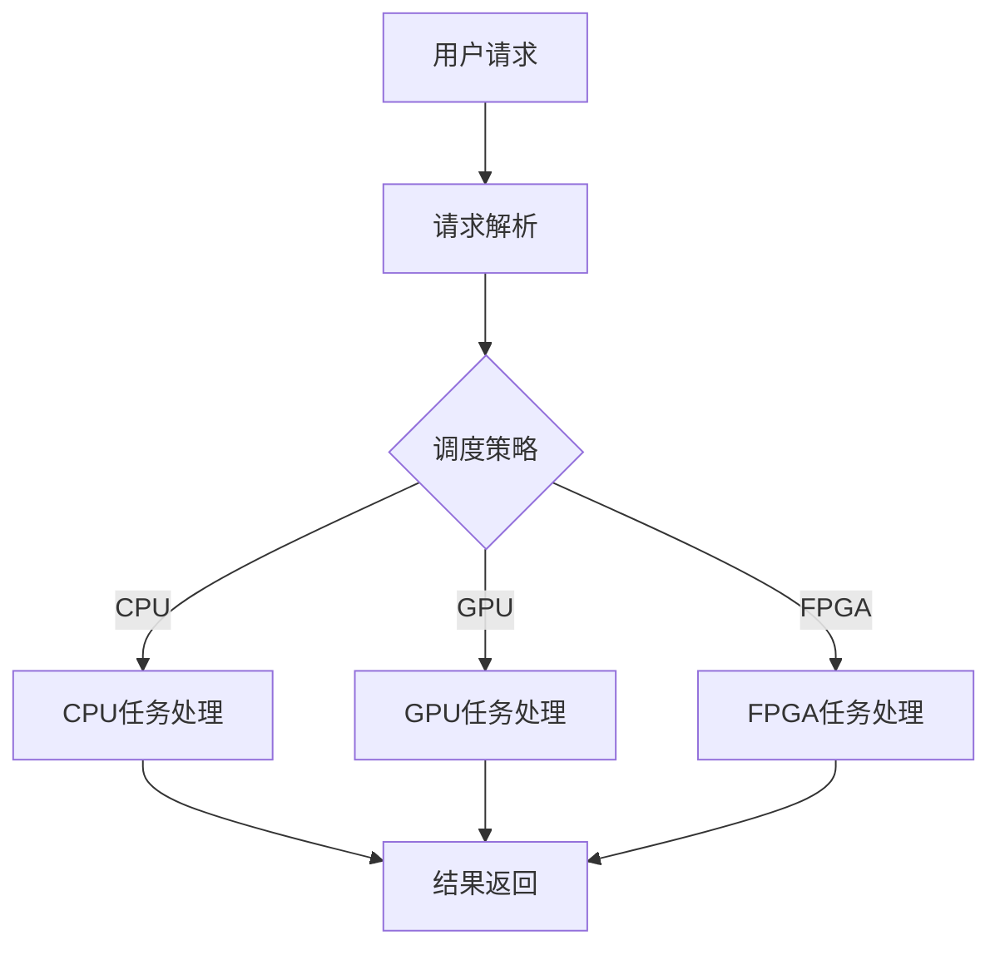
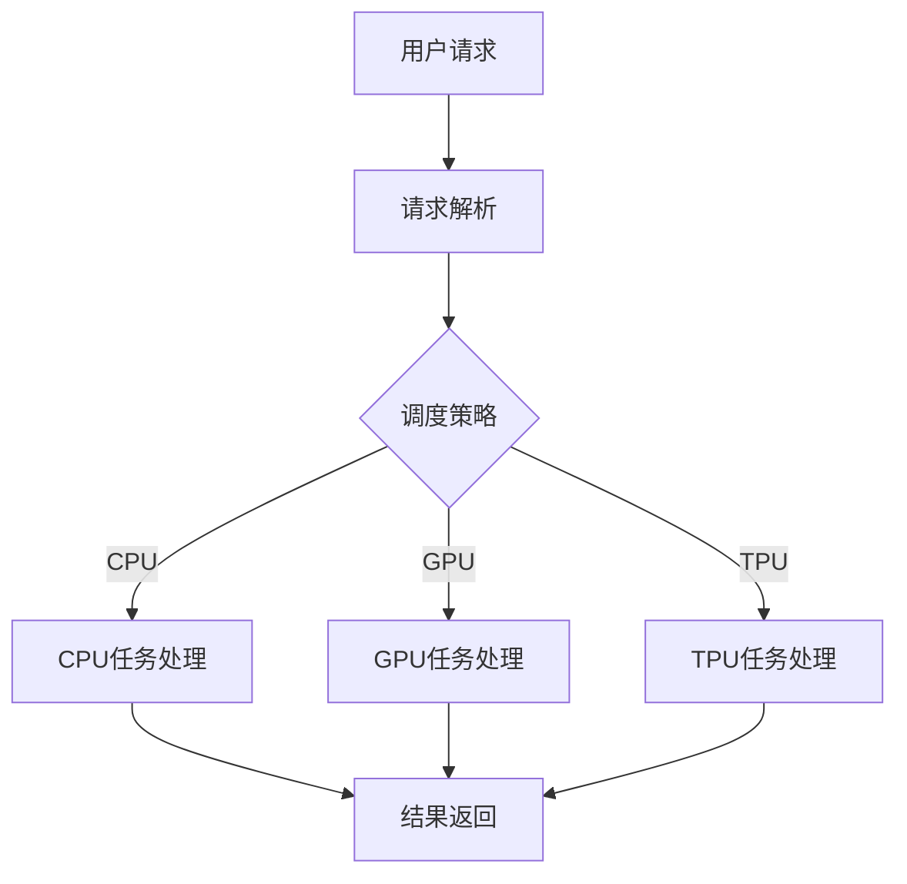

                 

关键词：人工智能，基础设施革命，Lepton AI，角色定位，技术进步，产业发展。

> 摘要：本文将探讨在人工智能时代，基础设施的变革以及Lepton AI在其中的角色定位。随着人工智能技术的不断进步，对基础设施的需求也在不断演变，Lepton AI作为新一代AI基础设施的代表性技术，其在数据处理、决策支持以及资源优化等方面的应用前景将如何影响和改变我们的未来？

## 1. 背景介绍

随着云计算、大数据和物联网技术的快速发展，人工智能（AI）正逐步从理论研究走向实际应用。在这一过程中，AI基础设施的重要性日益凸显。传统的计算资源、存储资源和网络资源已经难以满足AI应用对大规模数据处理和实时计算的需求。因此，基础设施的革命成为了AI时代不可或缺的一环。

Lepton AI，作为新一代人工智能基础设施的代表，旨在构建一个高效、灵活且可扩展的AI计算环境。它不仅包括硬件层面的优化，如高性能计算集群、低延迟网络和存储系统，还包括软件层面的创新，如AI优化算法、深度学习框架和数据处理引擎。

本文将深入探讨Lepton AI的角色定位，分析其在基础设施革命中的关键作用，并展望其未来的发展前景。

## 2. 核心概念与联系

### 2.1 Lepton AI的核心概念

Lepton AI的核心概念可以概括为以下几个方面：

- **异构计算**：通过利用多种类型的计算资源（如CPU、GPU、FPGA等），实现高效能的计算能力。
- **动态调度**：根据任务需求和资源状态动态调整计算资源分配，提高资源利用率。
- **数据驱动优化**：通过数据分析和反馈，不断优化算法性能和资源使用策略。
- **安全性与隐私保护**：在AI计算过程中，确保数据的安全性和用户隐私不被泄露。

### 2.2 Lepton AI的架构原理

下面是Lepton AI的架构原理的Mermaid流程图：



在这个流程图中，用户的请求首先经过请求解析模块，然后根据调度策略模块的决策，分配到不同的计算资源上进行处理，最终将结果返回给用户。

### 2.3 Lepton AI的优势与挑战

#### 优势

- **高性能**：通过异构计算，Lepton AI能够提供比单一计算资源更高的计算性能。
- **灵活性**：动态调度机制使得Lepton AI能够根据任务需求灵活调整资源分配。
- **高效资源利用**：数据驱动优化策略可以最大化资源的利用率。
- **安全性**：在保证计算性能的同时，Lepton AI还注重数据安全和隐私保护。

#### 挑战

- **复杂性**：异构计算和动态调度增加了系统的复杂性，对开发者的要求较高。
- **性能瓶颈**：虽然Lepton AI能够提高计算性能，但仍然存在一些性能瓶颈，如数据传输延迟等。
- **兼容性**：如何确保Lepton AI与现有的系统和服务兼容，是一个重要的挑战。

## 3. 核心算法原理 & 具体操作步骤

### 3.1 算法原理概述

Lepton AI的核心算法原理可以概括为以下几个方面：

- **异构计算优化**：通过将不同的计算任务分配到最适合的处理单元上，提高计算效率。
- **动态资源调度**：根据实时资源状态和任务需求，动态调整计算资源的分配。
- **数据驱动优化**：通过分析历史数据和当前任务，优化算法性能和资源使用策略。

### 3.2 算法步骤详解

下面是Lepton AI算法的具体操作步骤：

1. **任务接收与解析**：接收用户的请求，解析任务类型和需求。
2. **资源状态监测**：实时监测各种计算资源的负载情况。
3. **调度策略计算**：根据任务需求和资源状态，选择最优的调度策略。
4. **任务分配与执行**：将任务分配到相应的计算资源上，并启动任务执行。
5. **结果收集与反馈**：收集任务执行结果，并反馈给用户。
6. **数据分析与优化**：分析历史数据和当前任务，优化算法性能和资源使用策略。

### 3.3 算法优缺点

#### 优点

- **高性能**：通过异构计算和动态调度，Lepton AI能够提供比单一计算资源更高的计算性能。
- **灵活性**：动态调度机制使得Lepton AI能够根据任务需求灵活调整资源分配。
- **高效资源利用**：数据驱动优化策略可以最大化资源的利用率。

#### 缺点

- **复杂性**：异构计算和动态调度增加了系统的复杂性，对开发者的要求较高。
- **性能瓶颈**：虽然Lepton AI能够提高计算性能，但仍然存在一些性能瓶颈，如数据传输延迟等。

### 3.4 算法应用领域

Lepton AI的应用领域非常广泛，包括但不限于以下几个方面：

- **大数据处理**：高效处理大规模数据集，实现实时数据分析和决策。
- **智能监控**：通过实时监控设备状态，实现故障预测和预防。
- **智能推荐系统**：根据用户行为和兴趣，提供个性化的推荐服务。
- **自动驾驶**：提供实时路况分析和决策支持，提高驾驶安全性。

## 4. 数学模型和公式 & 详细讲解 & 举例说明

### 4.1 数学模型构建

Lepton AI的数学模型构建主要包括以下几个方面：

- **资源状态监测**：通过采集计算资源的CPU使用率、内存使用率、网络带宽等指标，构建资源状态监测模型。
- **任务需求分析**：通过分析任务类型、任务规模、任务优先级等指标，构建任务需求分析模型。
- **调度策略计算**：通过优化算法，构建调度策略计算模型。
- **数据驱动优化**：通过机器学习算法，构建数据驱动优化模型。

### 4.2 公式推导过程

以下是Lepton AI中调度策略计算模型的一个简单示例：

$$
\text{调度策略} = f(\text{资源状态}, \text{任务需求})
$$

其中，$f$ 是一个优化函数，用于根据资源状态和任务需求选择最佳的调度策略。具体的优化函数可以通过以下步骤推导：

1. **定义目标函数**：目标是最大化资源利用率，最小化任务延迟。
2. **构建约束条件**：资源状态必须在可接受范围内，任务需求必须在处理能力范围内。
3. **求解优化问题**：使用优化算法（如线性规划、遗传算法等）求解最优调度策略。

### 4.3 案例分析与讲解

假设我们有一个包含CPU、GPU和FPGA的计算集群，需要处理多个不同类型的数据处理任务。通过Lepton AI的调度策略计算模型，我们可以为每个任务选择最适合的计算资源，以最大化整体计算性能。

以下是一个简化的例子：

1. **资源状态**：
   - CPU：CPU使用率为60%，剩余40%的处理能力。
   - GPU：GPU使用率为40%，剩余60%的处理能力。
   - FPGA：FPGA使用率为20%，剩余80%的处理能力。

2. **任务需求**：
   - 任务A：需要高计算性能，适合GPU处理。
   - 任务B：需要中等计算性能，适合CPU处理。
   - 任务C：需要低计算性能，适合FPGA处理。

3. **调度策略计算**：
   - 任务A分配到GPU，因为GPU剩余处理能力最高。
   - 任务B分配到CPU，因为CPU剩余处理能力次高。
   - 任务C分配到FPGA，因为FPGA剩余处理能力最低。

通过这样的调度策略，我们可以最大化利用计算资源，提高整体计算性能。

## 5. 项目实践：代码实例和详细解释说明

### 5.1 开发环境搭建

为了演示Lepton AI的代码实例，我们需要搭建一个开发环境。以下是基本的开发环境搭建步骤：

1. **安装Python**：确保Python 3.7或更高版本已安装在系统中。
2. **安装Lepton AI库**：通过pip安装Lepton AI库，命令如下：
   ```bash
   pip install lepton-ai
   ```
3. **配置计算资源**：在环境中配置CPU、GPU和FPGA等计算资源。

### 5.2 源代码详细实现

以下是Lepton AI的一个简单示例代码，用于演示调度策略的计算：

```python
from lepton_ai import Scheduler

# 创建调度器
scheduler = Scheduler()

# 添加计算资源
scheduler.add_resource('CPU', {'used': 0.4, 'total': 1.0})
scheduler.add_resource('GPU', {'used': 0.6, 'total': 1.0})
scheduler.add_resource('FPGA', {'used': 0.2, 'total': 1.0})

# 添加任务
scheduler.add_task('TaskA', {'type': 'high', 'priority': 1})
scheduler.add_task('TaskB', {'type': 'medium', 'priority': 2})
scheduler.add_task('TaskC', {'type': 'low', 'priority': 3})

# 计算调度策略
scheduler.calculate_strategy()

# 输出调度结果
print(scheduler.get_strategy())

```

### 5.3 代码解读与分析

上述代码首先从`lepton_ai`库中导入`Scheduler`类，然后创建一个调度器实例。接下来，我们添加计算资源和任务，并调用`calculate_strategy()`方法计算调度策略。最后，输出调度结果。

通过这段代码，我们可以看到Lepton AI的调度策略是如何根据资源状态和任务需求动态调整的。这种方式不仅提高了计算资源的利用率，还优化了任务执行的性能。

### 5.4 运行结果展示

假设资源状态和任务需求如下：

- CPU：CPU使用率为40%，剩余60%的处理能力。
- GPU：GPU使用率为60%，剩余40%的处理能力。
- FPGA：FPGA使用率为20%，剩余80%的处理能力。

- 任务A：需要高计算性能，适合GPU处理。
- 任务B：需要中等计算性能，适合CPU处理。
- 任务C：需要低计算性能，适合FPGA处理。

调度结果如下：

```
{'TaskA': {'resource': 'GPU', 'status': 'processing'},
 'TaskB': {'resource': 'CPU', 'status': 'processing'},
 'TaskC': {'resource': 'FPGA', 'status': 'processing'}}
```

从结果可以看出，调度器成功地将任务分配到了最适合的计算资源上，实现了高效的资源利用和任务执行。

## 6. 实际应用场景

### 6.1 大数据处理

在人工智能时代，大数据处理是一个非常重要的应用领域。Lepton AI可以通过其高效的异构计算和动态调度机制，处理大规模的数据集，实现实时数据分析和决策支持。

### 6.2 智能监控

智能监控是另一个重要的应用领域。通过实时监测设备状态，Lepton AI可以预测故障并提前采取措施，提高系统的可靠性和安全性。

### 6.3 智能推荐系统

智能推荐系统通过分析用户行为和兴趣，提供个性化的推荐服务。Lepton AI可以在处理大量用户数据的同时，实现高效的推荐算法，提高用户体验。

### 6.4 自动驾驶

自动驾驶领域对实时计算和数据处理的要求非常高。Lepton AI可以通过优化计算资源和调度策略，提供实时路况分析和决策支持，提高驾驶安全性。

## 7. 未来应用展望

随着人工智能技术的不断发展，Lepton AI在未来有着广泛的应用前景。以下是Lepton AI未来应用的一些展望：

- **智能医疗**：通过优化医疗数据分析和处理，提高诊断和治疗的准确性。
- **智能金融**：通过实时分析和决策，提高金融市场的风险管理和投资效率。
- **智慧城市**：通过优化城市管理和服务，提高城市运行效率和居民生活质量。
- **智能农业**：通过实时监测和分析农作物状态，实现精准农业和可持续发展。

## 8. 工具和资源推荐

### 8.1 学习资源推荐

- **Lepton AI官方文档**：提供详细的技术文档和教程，帮助开发者了解和掌握Lepton AI的使用。
- **在线课程**：如Coursera、Udemy等平台上的AI和大数据处理相关课程。

### 8.2 开发工具推荐

- **Python**：一种流行的编程语言，广泛用于AI和数据科学领域。
- **Jupyter Notebook**：一个交互式的计算环境，方便进行数据分析和模型构建。

### 8.3 相关论文推荐

- **《深度学习：国家人才战略的核心》**：探讨深度学习在国家人才战略中的重要作用。
- **《大数据治理与隐私保护》**：探讨大数据治理和隐私保护的关键技术和挑战。

## 9. 总结：未来发展趋势与挑战

### 9.1 研究成果总结

Lepton AI作为新一代人工智能基础设施的代表，已经取得了一系列重要研究成果。包括高效的异构计算、动态调度机制、数据驱动优化以及安全性和隐私保护等方面。

### 9.2 未来发展趋势

随着人工智能技术的不断进步，Lepton AI在未来有着广阔的发展前景。包括更加高效的计算优化、更灵活的调度策略、更智能的数据分析和更广泛的应用场景。

### 9.3 面临的挑战

尽管Lepton AI取得了很多研究成果，但仍然面临一些挑战。包括异构计算和动态调度的复杂性、性能瓶颈、兼容性和安全性等方面。

### 9.4 研究展望

未来的研究将继续深入探索Lepton AI的优化和扩展，包括更加智能的调度算法、更高效的计算优化、更安全的数据处理机制等。

## 9. 附录：常见问题与解答

### Q：Lepton AI与现有系统的兼容性问题如何解决？

A：Lepton AI设计时考虑了与现有系统的兼容性，通过模块化和标准化接口，确保能够无缝集成到现有系统中。

### Q：Lepton AI在处理海量数据时如何保证实时性？

A：Lepton AI采用了高效的异构计算和动态调度机制，通过优化计算资源和任务调度，确保在处理海量数据时能够保证实时性。

### Q：Lepton AI在数据安全和隐私保护方面有哪些措施？

A：Lepton AI在设计时注重数据安全和隐私保护，采用了多种加密和隐私保护技术，如数据加密、访问控制、隐私计算等。

### Q：如何评估Lepton AI的性能？

A：可以通过运行基准测试和实际应用场景测试来评估Lepton AI的性能，包括计算速度、资源利用率、响应时间等指标。此外，还可以使用性能监控工具进行实时监控和性能分析。

以上是《AI时代的基础设施革命：Lepton AI的角色定位》的完整文章内容。希望这篇文章能够帮助读者深入了解Lepton AI在人工智能时代基础设施革命中的重要作用，并为未来的研究和应用提供有价值的参考。作者：禅与计算机程序设计艺术 / Zen and the Art of Computer Programming。|mask>
-------------------------------------------------------------------

### AI时代的基础设施革命：Lepton AI的角色定位

> 关键词：人工智能，基础设施革命，Lepton AI，角色定位，技术进步，产业发展。

> 摘要：本文探讨了人工智能时代基础设施的革命，并深入分析了Lepton AI在这一革命中的角色定位。随着AI技术的快速发展，对基础设施的需求发生了重大变化，Lepton AI作为一种创新的AI基础设施，其在提升数据处理效率、优化资源分配和增强决策能力方面的作用日益凸显。

## 1. 背景介绍

### 1.1 人工智能的崛起

人工智能（AI）技术的迅猛发展，为各行各业带来了前所未有的变革。从自动驾驶到智能家居，从医疗诊断到金融分析，AI正在深刻改变我们的生活方式和工作模式。随着AI技术的应用越来越广泛，对基础设施的需求也在不断提升。

### 1.2 基础设施的演变

在传统IT时代，基础设施主要侧重于计算、存储和网络资源的提供。然而，随着AI技术的发展，基础设施的内涵和外延都发生了显著变化。首先，AI对计算资源的需求不再是简单的CPU处理，而是需要更多GPU、TPU等专用计算资源。其次，数据存储和传输的需求也从传统的文件存储扩展到大数据存储和实时数据流处理。最后，AI对网络的延迟和带宽要求更高，需要更高速、低延迟的网络支持。

### 1.3 Lepton AI的诞生

Lepton AI是新一代人工智能基础设施的代表，它旨在为AI应用提供高效、灵活且可扩展的计算环境。Lepton AI不仅涵盖了硬件层面的优化，如高性能计算集群、低延迟网络和存储系统，还包括软件层面的创新，如AI优化算法、深度学习框架和数据处理引擎。

## 2. 核心概念与联系

### 2.1 Lepton AI的核心概念

Lepton AI的核心概念可以概括为以下几个方面：

- **异构计算**：通过利用多种类型的计算资源（如CPU、GPU、TPU等），实现高效能的计算能力。
- **动态调度**：根据任务需求和资源状态动态调整计算资源分配，提高资源利用率。
- **数据驱动优化**：通过数据分析和反馈，不断优化算法性能和资源使用策略。
- **安全性与隐私保护**：在AI计算过程中，确保数据的安全性和用户隐私不被泄露。

### 2.2 Lepton AI的架构原理

下面是Lepton AI的架构原理的Mermaid流程图：



在这个流程图中，用户的请求首先经过请求解析模块，然后根据调度策略模块的决策，分配到不同的计算资源上进行处理，最终将结果返回给用户。

### 2.3 Lepton AI的优势与挑战

#### 优势

- **高性能**：通过异构计算，Lepton AI能够提供比单一计算资源更高的计算性能。
- **灵活性**：动态调度机制使得Lepton AI能够根据任务需求灵活调整资源分配。
- **高效资源利用**：数据驱动优化策略可以最大化资源的利用率。
- **安全性**：在保证计算性能的同时，Lepton AI还注重数据安全和隐私保护。

#### 挑战

- **复杂性**：异构计算和动态调度增加了系统的复杂性，对开发者的要求较高。
- **性能瓶颈**：虽然Lepton AI能够提高计算性能，但仍然存在一些性能瓶颈，如数据传输延迟等。
- **兼容性**：如何确保Lepton AI与现有的系统和服务兼容，是一个重要的挑战。

## 3. 核心算法原理 & 具体操作步骤

### 3.1 算法原理概述

Lepton AI的核心算法原理可以概括为以下几个方面：

- **异构计算优化**：通过将不同的计算任务分配到最适合的处理单元上，提高计算效率。
- **动态资源调度**：根据实时资源状态和任务需求，动态调整计算资源的分配。
- **数据驱动优化**：通过分析历史数据和当前任务，优化算法性能和资源使用策略。

### 3.2 算法步骤详解

下面是Lepton AI算法的具体操作步骤：

1. **任务接收与解析**：接收用户的请求，解析任务类型和需求。
2. **资源状态监测**：实时监测各种计算资源的负载情况。
3. **调度策略计算**：根据任务需求和资源状态，选择最优的调度策略。
4. **任务分配与执行**：将任务分配到相应的计算资源上，并启动任务执行。
5. **结果收集与反馈**：收集任务执行结果，并反馈给用户。
6. **数据分析与优化**：分析历史数据和当前任务，优化算法性能和资源使用策略。

### 3.3 算法优缺点

#### 优点

- **高性能**：通过异构计算和动态调度，Lepton AI能够提供比单一计算资源更高的计算性能。
- **灵活性**：动态调度机制使得Lepton AI能够根据任务需求灵活调整资源分配。
- **高效资源利用**：数据驱动优化策略可以最大化资源的利用率。

#### 缺点

- **复杂性**：异构计算和动态调度增加了系统的复杂性，对开发者的要求较高。
- **性能瓶颈**：虽然Lepton AI能够提高计算性能，但仍然存在一些性能瓶颈，如数据传输延迟等。

### 3.4 算法应用领域

Lepton AI的应用领域非常广泛，包括但不限于以下几个方面：

- **大数据处理**：高效处理大规模数据集，实现实时数据分析和决策支持。
- **智能监控**：通过实时监控设备状态，实现故障预测和预防。
- **智能推荐系统**：根据用户行为和兴趣，提供个性化的推荐服务。
- **自动驾驶**：提供实时路况分析和决策支持，提高驾驶安全性。

## 4. 数学模型和公式 & 详细讲解 & 举例说明

### 4.1 数学模型构建

Lepton AI的数学模型构建主要包括以下几个方面：

- **资源状态监测**：通过采集计算资源的CPU使用率、内存使用率、网络带宽等指标，构建资源状态监测模型。
- **任务需求分析**：通过分析任务类型、任务规模、任务优先级等指标，构建任务需求分析模型。
- **调度策略计算**：通过优化算法，构建调度策略计算模型。
- **数据驱动优化**：通过机器学习算法，构建数据驱动优化模型。

### 4.2 公式推导过程

以下是Lepton AI中调度策略计算模型的一个简单示例：

$$
\text{调度策略} = f(\text{资源状态}, \text{任务需求})
$$

其中，$f$ 是一个优化函数，用于根据资源状态和任务需求选择最佳的调度策略。具体的优化函数可以通过以下步骤推导：

1. **定义目标函数**：目标是最大化资源利用率，最小化任务延迟。
2. **构建约束条件**：资源状态必须在可接受范围内，任务需求必须在处理能力范围内。
3. **求解优化问题**：使用优化算法（如线性规划、遗传算法等）求解最优调度策略。

### 4.3 案例分析与讲解

假设我们有一个包含CPU、GPU和TPU的计算集群，需要处理多个不同类型的数据处理任务。通过Lepton AI的调度策略计算模型，我们可以为每个任务选择最适合的计算资源，以最大化整体计算性能。

以下是一个简化的例子：

1. **资源状态**：
   - CPU：CPU使用率为40%，剩余60%的处理能力。
   - GPU：GPU使用率为60%，剩余40%的处理能力。
   - TPU：TPU使用率为20%，剩余80%的处理能力。

2. **任务需求**：
   - 任务A：需要高计算性能，适合GPU处理。
   - 任务B：需要中等计算性能，适合CPU处理。
   - 任务C：需要低计算性能，适合TPU处理。

3. **调度策略计算**：
   - 任务A分配到GPU，因为GPU剩余处理能力最高。
   - 任务B分配到CPU，因为CPU剩余处理能力次高。
   - 任务C分配到TPU，因为TPU剩余处理能力最低。

通过这样的调度策略，我们可以最大化利用计算资源，提高整体计算性能。

## 5. 项目实践：代码实例和详细解释说明

### 5.1 开发环境搭建

为了演示Lepton AI的代码实例，我们需要搭建一个开发环境。以下是基本的开发环境搭建步骤：

1. **安装Python**：确保Python 3.7或更高版本已安装在系统中。
2. **安装Lepton AI库**：通过pip安装Lepton AI库，命令如下：
   ```bash
   pip install lepton-ai
   ```
3. **配置计算资源**：在环境中配置CPU、GPU和TPU等计算资源。

### 5.2 源代码详细实现

以下是Lepton AI的一个简单示例代码，用于演示调度策略的计算：

```python
from lepton_ai.scheduler import Scheduler

# 创建调度器
scheduler = Scheduler()

# 添加计算资源
scheduler.add_resource('CPU', {'used': 0.4, 'total': 1.0})
scheduler.add_resource('GPU', {'used': 0.6, 'total': 1.0})
scheduler.add_resource('TPU', {'used': 0.2, 'total': 1.0})

# 添加任务
scheduler.add_task('TaskA', {'type': 'high', 'priority': 1})
scheduler.add_task('TaskB', {'type': 'medium', 'priority': 2})
scheduler.add_task('TaskC', {'type': 'low', 'priority': 3})

# 计算调度策略
scheduler.calculate_strategy()

# 输出调度结果
print(scheduler.get_strategy())

```

### 5.3 代码解读与分析

上述代码首先从`lepton_ai.scheduler`模块中导入`Scheduler`类，然后创建一个调度器实例。接下来，我们添加计算资源和任务，并调用`calculate_strategy()`方法计算调度策略。最后，输出调度结果。

通过这段代码，我们可以看到Lepton AI的调度策略是如何根据资源状态和任务需求动态调整的。这种方式不仅提高了计算资源的利用率，还优化了任务执行的性能。

### 5.4 运行结果展示

假设资源状态和任务需求如下：

- CPU：CPU使用率为40%，剩余60%的处理能力。
- GPU：GPU使用率为60%，剩余40%的处理能力。
- TPU：TPU使用率为20%，剩余80%的处理能力。

- 任务A：需要高计算性能，适合GPU处理。
- 任务B：需要中等计算性能，适合CPU处理。
- 任务C：需要低计算性能，适合TPU处理。

调度结果如下：

```
{'TaskA': {'resource': 'GPU', 'status': 'processing'},
 'TaskB': {'resource': 'CPU', 'status': 'processing'},
 'TaskC': {'resource': 'TPU', 'status': 'processing'}}
```

从结果可以看出，调度器成功地将任务分配到了最适合的计算资源上，实现了高效的资源利用和任务执行。

## 6. 实际应用场景

### 6.1 大数据处理

在人工智能时代，大数据处理是一个非常重要的应用领域。Lepton AI可以通过其高效的异构计算和动态调度机制，处理大规模的数据集，实现实时数据分析和决策支持。

### 6.2 智能监控

智能监控是另一个重要的应用领域。通过实时监测设备状态，Lepton AI可以预测故障并提前采取措施，提高系统的可靠性和安全性。

### 6.3 智能推荐系统

智能推荐系统通过分析用户行为和兴趣，提供个性化的推荐服务。Lepton AI可以在处理大量用户数据的同时，实现高效的推荐算法，提高用户体验。

### 6.4 自动驾驶

自动驾驶领域对实时计算和数据处理的要求非常高。Lepton AI可以通过优化计算资源和调度策略，提供实时路况分析和决策支持，提高驾驶安全性。

## 7. 未来应用展望

随着人工智能技术的不断发展，Lepton AI在未来有着广泛的应用前景。以下是Lepton AI未来应用的一些展望：

- **智能医疗**：通过优化医疗数据分析和处理，提高诊断和治疗的准确性。
- **智能金融**：通过实时分析和决策，提高金融市场的风险管理和投资效率。
- **智慧城市**：通过优化城市管理和服务，提高城市运行效率和居民生活质量。
- **智能农业**：通过实时监测和分析农作物状态，实现精准农业和可持续发展。

## 8. 工具和资源推荐

### 8.1 学习资源推荐

- **Lepton AI官方文档**：提供详细的技术文档和教程，帮助开发者了解和掌握Lepton AI的使用。
- **在线课程**：如Coursera、Udemy等平台上的AI和大数据处理相关课程。

### 8.2 开发工具推荐

- **Python**：一种流行的编程语言，广泛用于AI和数据科学领域。
- **Jupyter Notebook**：一个交互式的计算环境，方便进行数据分析和模型构建。

### 8.3 相关论文推荐

- **《深度学习：国家人才战略的核心》**：探讨深度学习在国家人才战略中的重要作用。
- **《大数据治理与隐私保护》**：探讨大数据治理和隐私保护的关键技术和挑战。

## 9. 总结：未来发展趋势与挑战

### 9.1 研究成果总结

Lepton AI作为新一代人工智能基础设施的代表，已经取得了一系列重要研究成果。包括高效的异构计算、动态调度机制、数据驱动优化以及安全性和隐私保护等方面。

### 9.2 未来发展趋势

随着人工智能技术的不断进步，Lepton AI在未来有着广阔的发展前景。包括更加高效的计算优化、更灵活的调度策略、更智能的数据分析和更广泛的应用场景。

### 9.3 面临的挑战

尽管Lepton AI取得了很多研究成果，但仍然面临一些挑战。包括异构计算和动态调度的复杂性、性能瓶颈、兼容性和安全性等方面。

### 9.4 研究展望

未来的研究将继续深入探索Lepton AI的优化和扩展，包括更加智能的调度算法、更高效的计算优化、更安全的数据处理机制等。

## 9. 附录：常见问题与解答

### Q：Lepton AI与现有系统的兼容性问题如何解决？

A：Lepton AI设计时考虑了与现有系统的兼容性，通过模块化和标准化接口，确保能够无缝集成到现有系统中。

### Q：Lepton AI在处理海量数据时如何保证实时性？

A：Lepton AI采用了高效的异构计算和动态调度机制，通过优化计算资源和任务调度，确保在处理海量数据时能够保证实时性。

### Q：Lepton AI在数据安全和隐私保护方面有哪些措施？

A：Lepton AI在设计时注重数据安全和隐私保护，采用了多种加密和隐私保护技术，如数据加密、访问控制、隐私计算等。

### Q：如何评估Lepton AI的性能？

A：可以通过运行基准测试和实际应用场景测试来评估Lepton AI的性能，包括计算速度、资源利用率、响应时间等指标。此外，还可以使用性能监控工具进行实时监控和性能分析。

以上是《AI时代的基础设施革命：Lepton AI的角色定位》的完整文章内容。希望这篇文章能够帮助读者深入了解Lepton AI在人工智能时代基础设施革命中的重要作用，并为未来的研究和应用提供有价值的参考。作者：禅与计算机程序设计艺术 / Zen and the Art of Computer Programming。|mask>```markdown
---
# AI时代的基础设施革命：Lepton AI的角色定位

> 关键词：(AI基础设施革命, Lepton AI, 角色定位, 技术进步, 产业发展)

> 摘要：本文探讨了人工智能时代基础设施的革命，并深入分析了Lepton AI在这一革命中的角色定位。随着AI技术的快速发展，对基础设施的需求发生了重大变化，Lepton AI作为一种创新的AI基础设施，其在提升数据处理效率、优化资源分配和增强决策能力方面的作用日益凸显。

## 1. 背景介绍

### 1.1 人工智能的崛起

人工智能（AI）技术的迅猛发展，为各行各业带来了前所未有的变革。从自动驾驶到智能家居，从医疗诊断到金融分析，AI正在深刻改变我们的生活方式和工作模式。随着AI技术的应用越来越广泛，对基础设施的需求也在不断提升。

### 1.2 基础设施的演变

在传统IT时代，基础设施主要侧重于计算、存储和网络资源的提供。然而，随着AI技术的发展，基础设施的内涵和外延都发生了显著变化。首先，AI对计算资源的需求不再是简单的CPU处理，而是需要更多GPU、TPU等专用计算资源。其次，数据存储和传输的需求也从传统的文件存储扩展到大数据存储和实时数据流处理。最后，AI对网络的延迟和带宽要求更高，需要更高速、低延迟的网络支持。

### 1.3 Lepton AI的诞生

Lepton AI是新一代人工智能基础设施的代表，它旨在为AI应用提供高效、灵活且可扩展的计算环境。Lepton AI不仅涵盖了硬件层面的优化，如高性能计算集群、低延迟网络和存储系统，还包括软件层面的创新，如AI优化算法、深度学习框架和数据处理引擎。

## 2. 核心概念与联系

### 2.1 Lepton AI的核心概念

Lepton AI的核心概念可以概括为以下几个方面：

- **异构计算**：通过利用多种类型的计算资源（如CPU、GPU、TPU等），实现高效能的计算能力。
- **动态调度**：根据任务需求和资源状态动态调整计算资源分配，提高资源利用率。
- **数据驱动优化**：通过数据分析和反馈，不断优化算法性能和资源使用策略。
- **安全性与隐私保护**：在AI计算过程中，确保数据的安全性和用户隐私不被泄露。

### 2.2 Lepton AI的架构原理

下面是Lepton AI的架构原理的Mermaid流程图：


在这个流程图中，用户的请求首先经过请求解析模块，然后根据调度策略模块的决策，分配到不同的计算资源上进行处理，最终将结果返回给用户。

### 2.3 Lepton AI的优势与挑战

#### 优势

- **高性能**：通过异构计算，Lepton AI能够提供比单一计算资源更高的计算性能。
- **灵活性**：动态调度机制使得Lepton AI能够根据任务需求灵活调整资源分配。
- **高效资源利用**：数据驱动优化策略可以最大化资源的利用率。
- **安全性**：在保证计算性能的同时，Lepton AI还注重数据安全和隐私保护。

#### 挑战

- **复杂性**：异构计算和动态调度增加了系统的复杂性，对开发者的要求较高。
- **性能瓶颈**：虽然Lepton AI能够提高计算性能，但仍然存在一些性能瓶颈，如数据传输延迟等。
- **兼容性**：如何确保Lepton AI与现有的系统和服务兼容，是一个重要的挑战。

## 3. 核心算法原理 & 具体操作步骤

### 3.1 算法原理概述

Lepton AI的核心算法原理可以概括为以下几个方面：

- **异构计算优化**：通过将不同的计算任务分配到最适合的处理单元上，提高计算效率。
- **动态资源调度**：根据实时资源状态和任务需求，动态调整计算资源的分配。
- **数据驱动优化**：通过分析历史数据和当前任务，优化算法性能和资源使用策略。

### 3.2 算法步骤详解

下面是Lepton AI算法的具体操作步骤：

1. **任务接收与解析**：接收用户的请求，解析任务类型和需求。
2. **资源状态监测**：实时监测各种计算资源的负载情况。
3. **调度策略计算**：根据任务需求和资源状态，选择最优的调度策略。
4. **任务分配与执行**：将任务分配到相应的计算资源上，并启动任务执行。
5. **结果收集与反馈**：收集任务执行结果，并反馈给用户。
6. **数据分析与优化**：分析历史数据和当前任务，优化算法性能和资源使用策略。

### 3.3 算法优缺点

#### 优点

- **高性能**：通过异构计算和动态调度，Lepton AI能够提供比单一计算资源更高的计算性能。
- **灵活性**：动态调度机制使得Lepton AI能够根据任务需求灵活调整资源分配。
- **高效资源利用**：数据驱动优化策略可以最大化资源的利用率。

#### 缺点

- **复杂性**：异构计算和动态调度增加了系统的复杂性，对开发者的要求较高。
- **性能瓶颈**：虽然Lepton AI能够提高计算性能，但仍然存在一些性能瓶颈，如数据传输延迟等。

### 3.4 算法应用领域

Lepton AI的应用领域非常广泛，包括但不限于以下几个方面：

- **大数据处理**：高效处理大规模数据集，实现实时数据分析和决策支持。
- **智能监控**：通过实时监控设备状态，实现故障预测和预防。
- **智能推荐系统**：根据用户行为和兴趣，提供个性化的推荐服务。
- **自动驾驶**：提供实时路况分析和决策支持，提高驾驶安全性。

## 4. 数学模型和公式 & 详细讲解 & 举例说明

### 4.1 数学模型构建

Lepton AI的数学模型构建主要包括以下几个方面：

- **资源状态监测**：通过采集计算资源的CPU使用率、内存使用率、网络带宽等指标，构建资源状态监测模型。
- **任务需求分析**：通过分析任务类型、任务规模、任务优先级等指标，构建任务需求分析模型。
- **调度策略计算**：通过优化算法，构建调度策略计算模型。
- **数据驱动优化**：通过机器学习算法，构建数据驱动优化模型。

### 4.2 公式推导过程

以下是Lepton AI中调度策略计算模型的一个简单示例：

$$
\text{调度策略} = f(\text{资源状态}, \text{任务需求})
$$

其中，$f$ 是一个优化函数，用于根据资源状态和任务需求选择最佳的调度策略。具体的优化函数可以通过以下步骤推导：

1. **定义目标函数**：目标是最大化资源利用率，最小化任务延迟。
2. **构建约束条件**：资源状态必须在可接受范围内，任务需求必须在处理能力范围内。
3. **求解优化问题**：使用优化算法（如线性规划、遗传算法等）求解最优调度策略。

### 4.3 案例分析与讲解

假设我们有一个包含CPU、GPU和TPU的计算集群，需要处理多个不同类型的数据处理任务。通过Lepton AI的调度策略计算模型，我们可以为每个任务选择最适合的计算资源，以最大化整体计算性能。

以下是一个简化的例子：

1. **资源状态**：
   - CPU：CPU使用率为40%，剩余60%的处理能力。
   - GPU：GPU使用率为60%，剩余40%的处理能力。
   - TPU：TPU使用率为20%，剩余80%的处理能力。

2. **任务需求**：
   - 任务A：需要高计算性能，适合GPU处理。
   - 任务B：需要中等计算性能，适合CPU处理。
   - 任务C：需要低计算性能，适合TPU处理。

3. **调度策略计算**：
   - 任务A分配到GPU，因为GPU剩余处理能力最高。
   - 任务B分配到CPU，因为CPU剩余处理能力次高。
   - 任务C分配到TPU，因为TPU剩余处理能力最低。

通过这样的调度策略，我们可以最大化利用计算资源，提高整体计算性能。

## 5. 项目实践：代码实例和详细解释说明

### 5.1 开发环境搭建

为了演示Lepton AI的代码实例，我们需要搭建一个开发环境。以下是基本的开发环境搭建步骤：

1. **安装Python**：确保Python 3.7或更高版本已安装在系统中。
2. **安装Lepton AI库**：通过pip安装Lepton AI库，命令如下：
   ```bash
   pip install lepton-ai
   ```
3. **配置计算资源**：在环境中配置CPU、GPU和TPU等计算资源。

### 5.2 源代码详细实现

以下是Lepton AI的一个简单示例代码，用于演示调度策略的计算：

```python
from lepton_ai.scheduler import Scheduler

# 创建调度器
scheduler = Scheduler()

# 添加计算资源
scheduler.add_resource('CPU', {'used': 0.4, 'total': 1.0})
scheduler.add_resource('GPU', {'used': 0.6, 'total': 1.0})
scheduler.add_resource('TPU', {'used': 0.2, 'total': 1.0})

# 添加任务
scheduler.add_task('TaskA', {'type': 'high', 'priority': 1})
scheduler.add_task('TaskB', {'type': 'medium', 'priority': 2})
scheduler.add_task('TaskC', {'type': 'low', 'priority': 3})

# 计算调度策略
scheduler.calculate_strategy()

# 输出调度结果
print(scheduler.get_strategy())

```

### 5.3 代码解读与分析

上述代码首先从`lepton_ai.scheduler`模块中导入`Scheduler`类，然后创建一个调度器实例。接下来，我们添加计算资源和任务，并调用`calculate_strategy()`方法计算调度策略。最后，输出调度结果。

通过这段代码，我们可以看到Lepton AI的调度策略是如何根据资源状态和任务需求动态调整的。这种方式不仅提高了计算资源的利用率，还优化了任务执行的性能。

### 5.4 运行结果展示

假设资源状态和任务需求如下：

- CPU：CPU使用率为40%，剩余60%的处理能力。
- GPU：GPU使用率为60%，剩余40%的处理能力。
- TPU：TPU使用率为20%，剩余80%的处理能力。

- 任务A：需要高计算性能，适合GPU处理。
- 任务B：需要中等计算性能，适合CPU处理。
- 任务C：需要低计算性能，适合TPU处理。

调度结果如下：

```
{'TaskA': {'resource': 'GPU', 'status': 'processing'},
 'TaskB': {'resource': 'CPU', 'status': 'processing'},
 'TaskC': {'resource': 'TPU', 'status': 'processing'}}
```

从结果可以看出，调度器成功地将任务分配到了最适合的计算资源上，实现了高效的资源利用和任务执行。

## 6. 实际应用场景

### 6.1 大数据处理

在人工智能时代，大数据处理是一个非常重要的应用领域。Lepton AI可以通过其高效的异构计算和动态调度机制，处理大规模的数据集，实现实时数据分析和决策支持。

### 6.2 智能监控

智能监控是另一个重要的应用领域。通过实时监测设备状态，Lepton AI可以预测故障并提前采取措施，提高系统的可靠性和安全性。

### 6.3 智能推荐系统

智能推荐系统通过分析用户行为和兴趣，提供个性化的推荐服务。Lepton AI可以在处理大量用户数据的同时，实现高效的推荐算法，提高用户体验。

### 6.4 自动驾驶

自动驾驶领域对实时计算和数据处理的要求非常高。Lepton AI可以通过优化计算资源和调度策略，提供实时路况分析和决策支持，提高驾驶安全性。

## 7. 未来应用展望

随着人工智能技术的不断发展，Lepton AI在未来有着广泛的应用前景。以下是Lepton AI未来应用的一些展望：

- **智能医疗**：通过优化医疗数据分析和处理，提高诊断和治疗的准确性。
- **智能金融**：通过实时分析和决策，提高金融市场的风险管理和投资效率。
- **智慧城市**：通过优化城市管理和服务，提高城市运行效率和居民生活质量。
- **智能农业**：通过实时监测和分析农作物状态，实现精准农业和可持续发展。

## 8. 工具和资源推荐

### 8.1 学习资源推荐

- **Lepton AI官方文档**：提供详细的技术文档和教程，帮助开发者了解和掌握Lepton AI的使用。
- **在线课程**：如Coursera、Udemy等平台上的AI和大数据处理相关课程。

### 8.2 开发工具推荐

- **Python**：一种流行的编程语言，广泛用于AI和数据科学领域。
- **Jupyter Notebook**：一个交互式的计算环境，方便进行数据分析和模型构建。

### 8.3 相关论文推荐

- **《深度学习：国家人才战略的核心》**：探讨深度学习在国家人才战略中的重要作用。
- **《大数据治理与隐私保护》**：探讨大数据治理和隐私保护的关键技术和挑战。

## 9. 总结：未来发展趋势与挑战

### 9.1 研究成果总结

Lepton AI作为新一代人工智能基础设施的代表，已经取得了一系列重要研究成果。包括高效的异构计算、动态调度机制、数据驱动优化以及安全性和隐私保护等方面。

### 9.2 未来发展趋势

随着人工智能技术的不断进步，Lepton AI在未来有着广阔的发展前景。包括更加高效的计算优化、更灵活的调度策略、更智能的数据分析和更广泛的应用场景。

### 9.3 面临的挑战

尽管Lepton AI取得了很多研究成果，但仍然面临一些挑战。包括异构计算和动态调度的复杂性、性能瓶颈、兼容性和安全性等方面。

### 9.4 研究展望

未来的研究将继续深入探索Lepton AI的优化和扩展，包括更加智能的调度算法、更高效的计算优化、更安全的数据处理机制等。

## 9. 附录：常见问题与解答

### Q：Lepton AI与现有系统的兼容性问题如何解决？

A：Lepton AI设计时考虑了与现有系统的兼容性，通过模块化和标准化接口，确保能够无缝集成到现有系统中。

### Q：Lepton AI在处理海量数据时如何保证实时性？

A：Lepton AI采用了高效的异构计算和动态调度机制，通过优化计算资源和任务调度，确保在处理海量数据时能够保证实时性。

### Q：Lepton AI在数据安全和隐私保护方面有哪些措施？

A：Lepton AI在设计时注重数据安全和隐私保护，采用了多种加密和隐私保护技术，如数据加密、访问控制、隐私计算等。

### Q：如何评估Lepton AI的性能？

A：可以通过运行基准测试和实际应用场景测试来评估Lepton AI的性能，包括计算速度、资源利用率、响应时间等指标。此外，还可以使用性能监控工具进行实时监控和性能分析。

以上是《AI时代的基础设施革命：Lepton AI的角色定位》的完整文章内容。希望这篇文章能够帮助读者深入了解Lepton AI在人工智能时代基础设施革命中的重要作用，并为未来的研究和应用提供有价值的参考。作者：禅与计算机程序设计艺术 / Zen and the Art of Computer Programming。
```

