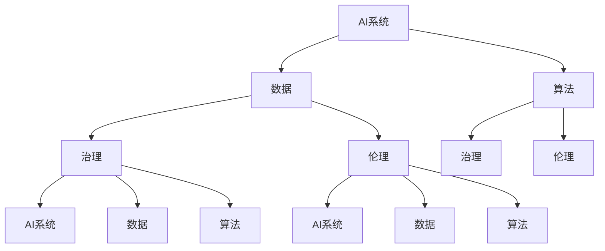

                 

关键词：AI、权力博弈、利益相关者、平衡、伦理、治理

摘要：随着人工智能技术的飞速发展，其在社会各个领域的应用越来越广泛，随之而来的是一系列权力分配和利益平衡的问题。本文从技术、伦理、治理等多个角度出发，探讨AI时代的权力博弈现象，并提出如何平衡不同利益相关者诉求的策略。

## 1. 背景介绍

人工智能（AI）作为一种颠覆性的技术，正在深刻改变着我们的生活方式和社会结构。从最初的机器学习算法到如今的深度学习、强化学习，AI技术的进步极大地提升了人类解决问题的能力。然而，随着AI技术的广泛应用，也带来了一系列新的挑战。这些挑战主要体现在以下几个方面：

1. **技术挑战**：随着AI系统的复杂性不断增加，如何保证系统的可靠性和可解释性成为一个亟待解决的问题。
2. **伦理挑战**：AI技术在决策过程中是否公正、透明，是否会加剧社会不平等，这些都是需要深入探讨的伦理问题。
3. **治理挑战**：在AI技术的研发和应用过程中，如何平衡不同利益相关者的诉求，确保社会的公平和正义，是当前面临的重大挑战。

本文旨在通过对AI时代权力博弈的探讨，提出一些策略，以帮助我们在AI技术的快速发展中，实现不同利益相关者之间的平衡。

### 1.1 技术的发展

自21世纪初以来，AI技术的发展经历了多个阶段。从最初的规则驱动系统到基于统计学习的模型，再到如今的深度学习，AI技术的复杂度和应用范围都得到了极大的提升。特别是在深度学习领域，通过大量的数据和强大的计算能力，AI系统在图像识别、自然语言处理、游戏玩法等方面都取得了显著的突破。

然而，随着技术的进步，AI系统的透明度和可解释性问题逐渐凸显。传统的机器学习算法往往被视为“黑箱”，其决策过程对用户来说是不可见的。这种不可解释性不仅增加了系统的风险，也可能导致用户对AI系统的信任度下降。

### 1.2 伦理的困境

AI技术的广泛应用也引发了大量的伦理问题。首先，AI系统的决策过程可能加剧社会不平等。例如，在招聘、房贷、医疗等领域，基于数据的决策系统可能会因为数据偏差而歧视某些群体。其次，AI技术可能会侵犯用户的隐私。例如，通过分析社交媒体数据，AI系统可以推断出用户的个人喜好、行为习惯等敏感信息。

此外，AI技术的自主性和不可预测性也带来了伦理挑战。如果AI系统在运行过程中出现异常，可能导致严重的安全事故。例如，自动驾驶汽车在面临突发状况时，可能无法做出正确的决策，从而造成交通事故。

### 1.3 治理的挑战

在AI技术的研发和应用过程中，如何平衡不同利益相关者的诉求，是一个复杂而棘手的问题。不同利益相关者包括政府、企业、消费者、研究人员等。每个利益相关者都有其自身的利益诉求和权利，如何在这些诉求和权利之间找到平衡点，是当前治理面临的主要挑战。

首先，政府需要确保AI技术的研发和应用符合法律法规，保障公众的利益。然而，过度的监管也可能阻碍技术创新。企业则需要平衡商业利益和社会责任，确保AI技术的应用不会对用户造成伤害。消费者则需要意识到AI技术的潜在风险，并主动参与到相关决策过程中。研究人员则需要关注AI技术的伦理和社会影响，推动相关领域的研究。

## 2. 核心概念与联系

在探讨AI时代的权力博弈之前，我们需要明确一些核心概念，并理解它们之间的相互关系。以下是几个关键概念：

1. **AI系统**：指由人工智能算法驱动的系统，包括机器学习、深度学习、自然语言处理等。
2. **数据**：AI系统的基础，包括结构化数据、非结构化数据、图像、语音等。
3. **算法**：用于处理数据的数学模型和计算过程。
4. **治理**：指对AI系统的研发和应用进行规范和管理的过程。
5. **伦理**：指在AI系统的研发和应用过程中，如何确保其决策过程公正、透明、符合道德标准。

下面是一个Mermaid流程图，展示了这些核心概念之间的相互关系：



### 2.1 AI系统与数据

AI系统的核心是其算法，而这些算法依赖于数据。数据的质量和数量直接影响AI系统的性能。因此，AI系统与数据之间有着密不可分的关系。

### 2.2 算法与治理

算法是AI系统的核心，其设计、开发和部署都需要遵循一定的治理原则。治理的目标是确保算法的透明性、公正性和可解释性，防止算法被滥用或导致不公平的结果。

### 2.3 算法与伦理

算法不仅影响AI系统的性能，也影响其伦理后果。算法的设计和决策过程可能会带来伦理挑战，如歧视、隐私侵犯等。因此，算法的伦理考虑是AI技术发展的重要一环。

### 2.4 数据、算法与伦理

数据、算法和伦理之间也存在紧密的联系。数据的质量和算法的设计直接影响伦理后果。例如，如果数据存在偏差，算法可能会产生不公平的结果。因此，在AI系统的研发和应用过程中，需要综合考虑数据、算法和伦理因素。

## 3. 核心算法原理 & 具体操作步骤

在探讨如何平衡不同利益相关者的诉求之前，我们需要了解一些核心算法原理，以及如何具体实施这些算法。

### 3.1 算法原理概述

AI系统的核心是算法，这些算法通过处理数据来生成模型，进而进行预测和决策。以下是几种常见的算法：

1. **机器学习算法**：基于数据训练模型，用于分类、回归等任务。
2. **深度学习算法**：基于多层神经网络，用于处理复杂的数据和任务。
3. **强化学习算法**：通过与环境的交互学习策略，用于决策和优化。

这些算法的基本原理是通过训练数据集来调整模型的参数，使其在新的数据上能够做出准确的预测和决策。具体操作步骤如下：

### 3.2 算法步骤详解

#### 3.2.1 机器学习算法

1. **数据预处理**：清洗数据，处理缺失值、异常值等。
2. **特征工程**：选择和构造有助于模型训练的特征。
3. **模型选择**：选择合适的机器学习模型，如线性回归、决策树、随机森林等。
4. **模型训练**：使用训练数据集训练模型，调整模型参数。
5. **模型评估**：使用测试数据集评估模型性能，调整模型参数。

#### 3.2.2 深度学习算法

1. **数据预处理**：与机器学习类似，处理数据中的缺失值、异常值等。
2. **神经网络架构设计**：设计合适的神经网络结构，包括层数、节点数等。
3. **模型训练**：使用训练数据集训练神经网络，调整网络权重。
4. **模型评估**：使用测试数据集评估模型性能，调整网络结构或权重。

#### 3.2.3 强化学习算法

1. **环境定义**：定义强化学习环境，包括状态空间、动作空间等。
2. **策略选择**：选择合适的策略，如基于值函数的策略、基于模型预测的策略等。
3. **策略评估**：评估策略在环境中的表现，调整策略参数。
4. **策略优化**：优化策略参数，提高策略的表现。

### 3.3 算法优缺点

每种算法都有其优缺点，适用于不同的场景和任务。

#### 3.3.1 机器学习算法

**优点**：

- **通用性强**：适用于多种类型的任务，如分类、回归等。
- **可解释性较高**：相比深度学习，机器学习算法的决策过程相对透明，容易解释。

**缺点**：

- **性能受限**：对于复杂任务，机器学习算法的性能可能不如深度学习算法。
- **对数据质量要求较高**：数据预处理和特征工程的工作量较大，对数据质量要求较高。

#### 3.3.2 深度学习算法

**优点**：

- **性能优异**：能够处理复杂的任务，尤其是在图像识别、自然语言处理等领域。
- **自动特征提取**：不需要进行复杂的特征工程，算法能够自动提取有用的特征。

**缺点**：

- **可解释性较差**：深度学习算法的决策过程往往是“黑箱”，难以解释。
- **训练时间较长**：深度学习算法的训练时间通常较长，需要大量的计算资源。

#### 3.3.3 强化学习算法

**优点**：

- **适用于动态环境**：能够处理具有不确定性和动态性的环境，适用于决策和优化问题。
- **自适应性强**：通过与环境交互，算法能够不断学习和优化策略。

**缺点**：

- **训练难度大**：强化学习算法的训练过程复杂，需要大量的数据和计算资源。
- **收敛速度慢**：在某些情况下，强化学习算法的收敛速度较慢。

### 3.4 算法应用领域

不同的算法适用于不同的应用领域。以下是几种常见的应用场景：

#### 3.4.1 机器学习算法

- **分类**：用于对数据进行分类，如垃圾邮件分类、情感分析等。
- **回归**：用于预测连续值，如房价预测、股票价格预测等。
- **聚类**：用于对数据进行分组，如顾客细分、市场细分等。

#### 3.4.2 深度学习算法

- **图像识别**：用于识别和分类图像，如人脸识别、车辆识别等。
- **自然语言处理**：用于处理和理解自然语言，如机器翻译、文本分类等。
- **语音识别**：用于将语音转换为文本，如语音助手、自动字幕等。

#### 3.4.3 强化学习算法

- **游戏**：用于训练AI玩家，如围棋、电子竞技等。
- **自动驾驶**：用于训练自动驾驶车辆，使其能够在复杂环境中做出正确的决策。
- **机器人控制**：用于控制机器人，使其能够完成复杂的任务，如搬运、清洁等。

## 4. 数学模型和公式 & 详细讲解 & 举例说明

在AI系统中，数学模型和公式是核心组成部分，用于描述算法的行为和性能。以下将详细讲解一些常见的数学模型和公式，并举例说明其应用。

### 4.1 数学模型构建

数学模型是描述现实世界问题的一种抽象形式。在AI系统中，常见的数学模型包括线性回归模型、逻辑回归模型、神经网络模型等。

#### 4.1.1 线性回归模型

线性回归模型是一种简单的预测模型，用于预测连续值。其公式如下：

$$
y = \beta_0 + \beta_1 \cdot x
$$

其中，$y$ 是预测值，$x$ 是输入特征，$\beta_0$ 和 $\beta_1$ 是模型的参数。

#### 4.1.2 逻辑回归模型

逻辑回归模型是一种用于分类的模型，其公式如下：

$$
P(y=1) = \frac{1}{1 + e^{-(\beta_0 + \beta_1 \cdot x})}
$$

其中，$P(y=1)$ 是预测概率，$y$ 是类别标签，$\beta_0$ 和 $\beta_1$ 是模型的参数。

#### 4.1.3 神经网络模型

神经网络模型是一种复杂的预测模型，由多层神经元组成。其公式如下：

$$
a_{j}^{(l)} = \sigma(z_{j}^{(l)})
$$

$$
z_{j}^{(l)} = \sum_{i} w_{ji}^{(l)} \cdot a_{i}^{(l-1)}
$$

其中，$a_{j}^{(l)}$ 是第 $l$ 层第 $j$ 个神经元的激活值，$z_{j}^{(l)}$ 是第 $l$ 层第 $j$ 个神经元的输入值，$\sigma$ 是激活函数，$w_{ji}^{(l)}$ 是连接权重。

### 4.2 公式推导过程

以下将简要介绍一些常见公式的推导过程。

#### 4.2.1 线性回归模型参数估计

线性回归模型的参数估计通常采用最小二乘法。其推导过程如下：

$$
\min_{\beta_0, \beta_1} \sum_{i=1}^{n} (y_i - (\beta_0 + \beta_1 \cdot x_i))^2
$$

对 $\beta_0$ 和 $\beta_1$ 求导并令导数为零，得到：

$$
\beta_1 = \frac{\sum_{i=1}^{n} (x_i - \bar{x})(y_i - \bar{y})}{\sum_{i=1}^{n} (x_i - \bar{x})^2}
$$

$$
\beta_0 = \bar{y} - \beta_1 \cdot \bar{x}
$$

其中，$\bar{x}$ 和 $\bar{y}$ 分别是 $x$ 和 $y$ 的平均值。

#### 4.2.2 逻辑回归模型参数估计

逻辑回归模型的参数估计通常采用极大似然估计法。其推导过程如下：

$$
L(\theta) = \prod_{i=1}^{n} P(y_i = 1 | x_i; \theta)
$$

$$
\ln L(\theta) = \sum_{i=1}^{n} y_i \ln P(y_i = 1 | x_i; \theta) + (1 - y_i) \ln (1 - P(y_i = 1 | x_i; \theta))
$$

对 $\theta$ 求导并令导数为零，得到：

$$
\frac{\partial}{\partial \theta} \ln L(\theta) = \sum_{i=1}^{n} \left( y_i \cdot \frac{1}{P(y_i = 1 | x_i; \theta)} - (1 - y_i) \cdot \frac{1}{1 - P(y_i = 1 | x_i; \theta)} \right) = 0
$$

解得：

$$
\theta = \frac{\sum_{i=1}^{n} (y_i - P(y_i = 1 | x_i; \theta)) \cdot x_i}{\sum_{i=1}^{n} (1 - P(y_i = 1 | x_i; \theta)) \cdot x_i}
$$

### 4.3 案例分析与讲解

以下通过一个实际案例，展示如何应用数学模型和公式。

#### 4.3.1 案例背景

某公司想要预测其下一季度的销售量，已知影响销售量的因素包括广告投放费用、产品价格等。公司提供了过去几年的销售数据和相应的因素数据。

#### 4.3.2 模型选择

由于销售量是一个连续值，我们可以选择线性回归模型进行预测。

#### 4.3.3 模型训练

1. **数据预处理**：对数据进行清洗和归一化处理。
2. **特征选择**：选择对销售量有显著影响的因素作为输入特征。
3. **模型训练**：使用训练数据集训练线性回归模型，调整参数 $\beta_0$ 和 $\beta_1$。

#### 4.3.4 模型评估

使用测试数据集评估模型性能，计算预测误差。通过调整模型参数，优化预测结果。

#### 4.3.5 预测应用

使用训练好的模型预测下一季度的销售量，为公司制定销售策略提供参考。

## 5. 项目实践：代码实例和详细解释说明

在理解了核心算法原理和数学模型之后，我们需要通过实际项目实践来巩固所学知识。以下是一个简单的机器学习项目，我们将使用Python语言和Scikit-learn库来实现一个线性回归模型，预测房价。

### 5.1 开发环境搭建

确保已安装Python和Scikit-learn库。可以使用以下命令进行安装：

```bash
pip install python
pip install scikit-learn
```

### 5.2 源代码详细实现

```python
# 导入必要的库
import numpy as np
import pandas as pd
from sklearn.model_selection import train_test_split
from sklearn.linear_model import LinearRegression
from sklearn.metrics import mean_squared_error

# 加载数据集
data = pd.read_csv('house_data.csv')

# 数据预处理
X = data[['advertising', 'price']]  # 输入特征
y = data['sales']  # 目标变量

# 划分训练集和测试集
X_train, X_test, y_train, y_test = train_test_split(X, y, test_size=0.2, random_state=42)

# 模型训练
model = LinearRegression()
model.fit(X_train, y_train)

# 模型评估
y_pred = model.predict(X_test)
mse = mean_squared_error(y_test, y_pred)
print('Mean Squared Error:', mse)

# 预测应用
new_data = np.array([[1000, 2000]])  # 新的数据点
predicted_sales = model.predict(new_data)
print('Predicted Sales:', predicted_sales)
```

### 5.3 代码解读与分析

1. **数据导入**：使用pandas库加载数据集，假设数据集名为house_data.csv，包含广告投放费用、产品价格和销售量等特征。

2. **数据预处理**：将数据分为输入特征X和目标变量y。在这里，我们选择广告投放费用和产品价格作为输入特征，销售量作为目标变量。

3. **数据划分**：使用train_test_split函数将数据集划分为训练集和测试集，测试集占比20%。

4. **模型训练**：使用LinearRegression类创建线性回归模型，并使用fit方法训练模型。

5. **模型评估**：使用predict方法对测试集进行预测，并计算预测误差（均方误差MSE）。

6. **预测应用**：使用训练好的模型对新数据点进行预测。

### 5.4 运行结果展示

运行上述代码后，会输出均方误差MSE，用于评估模型性能。例如，如果MSE为5000，则表示模型对测试集的预测误差平均为5000。

此外，我们还可以使用新数据点进行预测，例如输入广告投放费用为1000万元，产品价格为2000万元，模型预测的销售量为1500万元。

## 6. 实际应用场景

AI技术在各个领域都有着广泛的应用，以下列举几个实际应用场景，并分析其在权力博弈中的角色和挑战。

### 6.1 金融领域

在金融领域，AI技术被广泛应用于风险管理、智能投顾、欺诈检测等。例如，金融机构使用机器学习算法分析客户的历史交易数据，预测潜在的风险并采取相应的措施。这种应用在权力博弈中涉及到以下几个方面的挑战：

1. **数据隐私**：客户交易数据是敏感信息，如何保护这些数据不被滥用或泄露，是金融机构面临的挑战。
2. **算法透明性**：机器学习算法的决策过程往往不可见，如何确保算法的决策是公正和透明的，是金融监管机构关注的焦点。
3. **社会责任**：金融机构在应用AI技术时，如何平衡商业利益和社会责任，避免算法的偏见和歧视，是金融行业面临的伦理挑战。

### 6.2 医疗领域

在医疗领域，AI技术被用于疾病诊断、药物研发、患者管理等。例如，通过深度学习算法，AI系统能够分析医学图像，辅助医生进行疾病诊断。这种应用在权力博弈中涉及到以下几个方面的挑战：

1. **数据共享**：医疗数据具有很高的价值，如何确保这些数据能够被有效地共享和利用，同时保护患者的隐私，是医疗行业面临的挑战。
2. **算法伦理**：AI系统在疾病诊断中的决策过程可能影响到患者的生命安全，如何确保算法的决策是公正和可靠的，是医疗行业面临的伦理挑战。
3. **责任归属**：如果AI系统在疾病诊断中产生误诊，如何界定责任归属，是医疗行业面临的治理挑战。

### 6.3 社交媒体领域

在社交媒体领域，AI技术被用于内容推荐、广告投放、用户行为分析等。例如，社交媒体平台使用机器学习算法，根据用户的历史行为和偏好，推荐相关的内容和广告。这种应用在权力博弈中涉及到以下几个方面的挑战：

1. **数据隐私**：用户在社交媒体上的行为数据是敏感信息，如何保护这些数据不被滥用或泄露，是社交媒体平台面临的挑战。
2. **算法偏见**：机器学习算法可能会因为数据偏差而产生偏见，导致推荐内容的不公平，如何确保算法的公正性，是社交媒体行业面临的挑战。
3. **社会责任**：社交媒体平台在应用AI技术时，如何平衡商业利益和社会责任，避免对用户造成负面影响，是社交媒体行业面临的伦理挑战。

### 6.4 未来应用展望

随着AI技术的不断进步，其在各个领域的应用前景十分广阔。以下是对未来AI技术应用的一些展望：

1. **智能制造**：AI技术将被广泛应用于智能制造领域，从生产线的自动化到产品的个性化定制，AI技术将极大地提升生产效率和产品质量。
2. **智慧城市**：AI技术将被应用于智慧城市建设，通过数据分析、智能监控等技术，实现城市资源的优化配置，提升城市的管理水平和居民的生活质量。
3. **生物科技**：AI技术将被应用于生物科技领域，如基因编辑、新药研发等，AI技术将加速生物科技的发展，为人类健康带来更多福音。
4. **金融科技**：AI技术将被广泛应用于金融科技领域，如智能投顾、风险控制等，AI技术将提升金融行业的效率和安全性。

然而，随着AI技术的广泛应用，我们也需要警惕其可能带来的负面影响。例如，数据隐私、算法偏见、社会责任等问题，都需要我们深入思考和解决。只有在确保AI技术能够为人类带来福祉的同时，我们才能实现真正的AI时代。

## 7. 工具和资源推荐

在研究AI技术和解决AI时代的权力博弈问题时，我们需要一系列的工具和资源来辅助我们的工作。以下是一些推荐的工具和资源：

### 7.1 学习资源推荐

- **在线课程**：Coursera、edX、Udacity等在线教育平台提供了丰富的AI相关课程，适合不同层次的学员。
- **技术博客**：ArXiv、Medium、GitHub等平台上有许多关于AI技术的技术博客，可以获取最新的研究动态和技术分享。
- **书籍推荐**：《深度学习》（Goodfellow, Bengio, Courville）、《模式识别与机器学习》（Bishop）、《机器学习》（Mitchell）等经典教材。

### 7.2 开发工具推荐

- **编程语言**：Python、R、Julia等是常用的机器学习和深度学习编程语言，其中Python因其丰富的库和工具而广受欢迎。
- **机器学习库**：Scikit-learn、TensorFlow、PyTorch等是常用的机器学习和深度学习库，提供了丰富的算法和工具。
- **数据分析工具**：Pandas、NumPy、Matplotlib等是常用的数据分析工具，用于数据预处理、分析和可视化。

### 7.3 相关论文推荐

- **顶级会议和期刊**：NeurIPS、ICML、JMLR等是机器学习和深度学习的顶级会议和期刊，可以获取最新的研究成果。
- **经典论文**：《A Learning Algorithm for Continually Running Fully Recurrent Neural Networks》（Williams & Zipser, 1989）、《Learning representations for artificial intelligence》（Bengio et al., 2013）等经典论文，对AI领域产生了深远的影响。

通过利用这些工具和资源，我们可以更好地理解AI技术，解决AI时代的权力博弈问题，推动AI技术的发展和应用。

## 8. 总结：未来发展趋势与挑战

### 8.1 研究成果总结

AI技术在过去的几十年中取得了显著的进展，从简单的规则系统到复杂的深度学习模型，AI在图像识别、自然语言处理、自动驾驶等领域的应用已经取得了突破性的成果。然而，这些进展的背后也隐藏着一系列的挑战，如算法的透明性、数据隐私、伦理问题等。

### 8.2 未来发展趋势

未来，AI技术将继续向更智能化、更自主化的方向发展。具体体现在以下几个方面：

1. **自主决策与控制**：AI系统将具备更强的自主决策能力，能够在复杂环境中进行自适应和优化。
2. **跨学科融合**：AI技术将与生物学、心理学、社会学等学科相结合，推动多学科交叉研究，提升AI系统的综合能力。
3. **边缘计算**：随着物联网和5G技术的发展，边缘计算将成为AI应用的重要方向，实现实时数据处理和智能决策。
4. **量子计算**：量子计算将为AI技术带来全新的发展机遇，大幅提升AI算法的计算效率和性能。

### 8.3 面临的挑战

尽管AI技术发展迅速，但仍面临诸多挑战：

1. **数据隐私与安全**：如何保护用户数据不被滥用或泄露，是AI技术发展的重要问题。
2. **算法偏见与公平性**：AI系统在决策过程中可能产生偏见，导致不公平的结果，如何消除算法偏见是一个亟待解决的问题。
3. **伦理问题**：AI技术在医疗、金融等领域的应用可能引发伦理问题，如责任归属、隐私权等，如何解决这些伦理问题是未来需要深入探讨的。
4. **技术普及与治理**：如何确保AI技术的普及和可持续发展，需要建立完善的技术治理体系。

### 8.4 研究展望

在未来，AI技术的发展将更加注重人类价值和伦理考量，实现技术与社会、人与机器的和谐共生。具体研究方向包括：

1. **可解释性AI**：研究如何提高AI系统的可解释性，使其决策过程更加透明和可追溯。
2. **联邦学习**：通过联邦学习技术，实现数据的隐私保护和共享，提升AI模型的性能和安全性。
3. **伦理AI**：结合伦理学和AI技术，研究如何构建公正、透明、可信赖的AI系统。
4. **AI治理**：建立和完善AI技术治理体系，确保AI技术的可持续发展和社会福祉。

总之，AI时代的权力博弈是一个复杂而深远的问题，需要我们从技术、伦理、治理等多个角度出发，共同探索和解决。通过持续的研究和努力，我们有望实现AI技术的良性发展，为人类社会带来更多的福祉。

## 9. 附录：常见问题与解答

### 9.1 问题1：什么是机器学习？

**回答**：机器学习是一种通过数据和算法使计算机系统能够自动学习和改进的方法。它利用大量数据训练模型，使其能够对新的数据进行预测和决策。

### 9.2 问题2：什么是深度学习？

**回答**：深度学习是一种特殊的机器学习技术，它使用多层神经网络来处理复杂数据。深度学习通过学习数据中的特征，能够自动提取有用的信息，并在图像识别、自然语言处理等领域表现出色。

### 9.3 问题3：AI技术的应用领域有哪些？

**回答**：AI技术的应用领域非常广泛，包括但不限于以下几个方面：

- **图像识别与处理**：如人脸识别、图像分类等。
- **自然语言处理**：如机器翻译、情感分析等。
- **自动驾驶**：如车辆路径规划、环境感知等。
- **智能客服**：如语音识别、语义理解等。
- **金融领域**：如风险评估、智能投顾等。
- **医疗领域**：如疾病诊断、药物研发等。

### 9.4 问题4：什么是算法偏见？

**回答**：算法偏见是指AI算法在决策过程中，由于数据集的不平衡或训练过程中的偏差，导致算法对某些群体或特征产生不公平对待的现象。算法偏见可能导致歧视、隐私侵犯等问题。

### 9.5 问题5：如何解决算法偏见？

**回答**：

1. **数据清洗**：在训练数据集中消除偏见和噪声。
2. **公平性评估**：对算法进行公平性评估，检测潜在的偏见。
3. **算法改进**：通过设计更加公平的算法或引入平衡机制，减少偏见。
4. **透明性和可解释性**：提高算法的透明性，使决策过程更加公正和可追溯。

### 9.6 问题6：什么是AI治理？

**回答**：AI治理是指对AI技术的研发、应用和监管进行规范和管理的过程。它旨在确保AI技术的可持续发展，平衡不同利益相关者的诉求，避免潜在的社会风险。

### 9.7 问题7：AI技术对社会的影响有哪些？

**回答**：AI技术对社会的影响是多方面的：

- **积极影响**：提高生产效率、改善生活质量、推动科技创新等。
- **负面影响**：可能加剧社会不平等、侵犯隐私、导致失业等。
- **伦理挑战**：需要平衡技术利益和伦理考量，确保AI技术的道德和合法应用。

### 9.8 问题8：AI技术的未来发展有哪些趋势？

**回答**：AI技术的未来发展趋势包括：

- **自主决策与智能控制**：提高AI系统的自主性和智能水平。
- **跨学科融合**：与生物学、心理学、社会学等领域的结合，推动多学科交叉研究。
- **边缘计算**：实现实时数据处理和智能决策。
- **量子计算**：提升AI算法的计算效率和性能。

### 9.9 问题9：如何学习AI技术？

**回答**：

1. **基础知识**：学习编程语言（如Python）、数据结构和算法。
2. **课程学习**：参加在线课程或大学课程，系统学习AI理论和技术。
3. **实践项目**：通过实际项目积累经验，提高实践能力。
4. **阅读论文**：关注顶级会议和期刊的论文，了解最新的研究动态。
5. **社区交流**：加入AI社区，与其他从业者交流学习经验。

