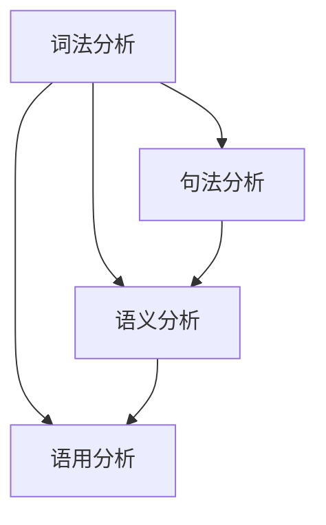

                 

关键词：自然语言处理、AI、语音识别、语义理解、机器翻译、深度学习、云计算、产业发展

> 摘要：本文旨在探讨自然语言处理（NLP）在AI时代的快速发展，从实验室研究到实际产业应用的转变过程。文章将分析NLP的核心概念与联系，介绍核心算法原理与操作步骤，阐述数学模型与公式，并通过实际项目实践展示NLP的应用场景。最后，文章将展望NLP在未来的发展趋势与挑战，并提供相关工具和资源的推荐。

## 1. 背景介绍

自然语言处理（NLP）是人工智能（AI）领域中的一个重要分支，旨在使计算机能够理解、解释和生成人类语言。随着互联网和大数据的快速发展，NLP技术取得了显著的进步，从最初的规则驱动的简单任务，逐步发展到今天的基于深度学习的复杂任务。这一过程中，自然语言处理技术经历了从实验室研究到实际产业应用的转变，不仅推动了学术界的研究进展，也为产业界带来了巨大的商业价值。

### NLP的发展历程

自然语言处理的发展历程可以追溯到20世纪50年代，当时的研究主要集中在机器翻译和文本分类等基础任务上。早期的NLP研究主要依赖于规则驱动的方法，这种方法虽然能够处理一些简单的任务，但在面对复杂和不确定的文本数据时，效果有限。

随着计算机性能的提升和海量数据的出现，深度学习技术在NLP领域取得了突破性进展。深度学习模型，如循环神经网络（RNN）、卷积神经网络（CNN）和Transformer等，通过大规模数据训练，能够自动学习语言的特征和规律，从而在文本分类、语义分析、机器翻译等任务上取得了显著的效果。

### NLP在AI时代的重要性

在AI时代，自然语言处理技术已经成为AI应用的核心之一。NLP技术不仅能够帮助计算机理解和处理人类语言，还能够实现人机交互、智能客服、文本挖掘、知识图谱构建等复杂应用。随着AI技术的不断成熟，NLP的应用范围也在不断拓展，从传统的文本处理任务，扩展到语音识别、图像识别、自然语言生成等更广泛的领域。

### NLP的实际应用场景

自然语言处理技术已经被广泛应用于多个行业和领域，包括但不限于：

- **金融**：通过自然语言处理技术，金融行业能够实现自动化的客户服务、风险控制和欺诈检测。
- **医疗**：自然语言处理可以帮助医疗行业实现病历分析、症状诊断和药物推荐等。
- **教育**：教育行业可以利用自然语言处理技术实现个性化教学、智能辅导和智能评估。
- **政府**：政府部门可以通过自然语言处理技术实现政策分析、舆情监测和社会治理等。

## 2. 核心概念与联系

### 2.1 自然语言处理的核心概念

自然语言处理涉及多个核心概念，包括语言模型、词嵌入、序列标注、语义理解等。

- **语言模型**：语言模型是自然语言处理的基础，它用于预测下一个单词或词组。最常见的语言模型是n元语法模型，它通过统计文本中连续n个单词的概率分布来预测下一个单词。

- **词嵌入**：词嵌入是将单词映射到高维向量空间，以便在计算机中进行处理。词嵌入能够捕捉单词的语义信息，是许多NLP任务的基础。

- **序列标注**：序列标注是对文本中的每个单词或字符进行分类的任务，例如命名实体识别（NER）和词性标注。

- **语义理解**：语义理解是自然语言处理的高级任务，旨在理解和解释文本的含义，包括语义分析、情感分析和问答系统等。

### 2.2 自然语言处理的架构

自然语言处理的架构通常包括以下几个层次：

- **词法分析（Lexical Analysis）**：将文本拆分为单词和符号，并进行词性标注。
- **句法分析（Syntax Analysis）**：对文本进行语法结构分析，生成语法树。
- **语义分析（Semantic Analysis）**：理解文本的语义内容，包括词义消歧、语义角色标注等。
- **语用分析（Pragmatic Analysis）**：分析文本的语境和使用目的，理解语言的实际意义。

### 2.3 核心概念的联系

自然语言处理中的核心概念和层次之间有着紧密的联系。词法分析和句法分析是语义理解和语用分析的基础，而语义理解和语用分析又能够指导更准确的词法分析和句法分析。例如，在命名实体识别中，需要对文本进行词法分析和句法分析，以确定命名实体的边界和类型；而在语义理解中，则需要理解命名实体所指的具体对象，从而实现更准确的识别。

### 2.4 Mermaid 流程图

以下是自然语言处理架构的Mermaid流程图：



## 3. 核心算法原理 & 具体操作步骤

### 3.1 算法原理概述

自然语言处理中的核心算法主要包括语言模型、词嵌入、序列标注和深度学习模型等。这些算法通过学习大量文本数据，能够自动识别和预测文本中的模式，从而实现各种NLP任务。

- **语言模型**：通过统计文本中连续单词的概率分布，预测下一个单词。
- **词嵌入**：将单词映射到高维向量空间，用于文本表示。
- **序列标注**：对文本中的每个单词或字符进行分类，例如命名实体识别。
- **深度学习模型**：如循环神经网络（RNN）、卷积神经网络（CNN）和Transformer等，通过学习大规模数据，自动提取文本特征和规律。

### 3.2 算法步骤详解

以下是自然语言处理算法的具体步骤：

1. **数据预处理**：包括文本清洗、分词、去停用词等操作，将原始文本转化为适合算法处理的格式。
2. **构建语言模型**：使用统计方法或深度学习模型，对文本进行建模，预测下一个单词。
3. **词嵌入**：将单词映射到高维向量空间，以便在计算机中进行处理。
4. **序列标注**：对文本中的每个单词或字符进行分类，例如命名实体识别。
5. **深度学习模型训练**：使用大规模数据训练深度学习模型，如RNN、CNN和Transformer等。
6. **模型评估与优化**：通过交叉验证和测试集评估模型性能，并调整模型参数，优化模型效果。
7. **应用部署**：将训练好的模型部署到实际应用中，如智能客服、文本挖掘等。

### 3.3 算法优缺点

- **语言模型**：优点是能够自动学习语言特征，适应不同的应用场景；缺点是需要大量的训练数据和计算资源，对低资源语言的支持较弱。
- **词嵌入**：优点是能够捕捉单词的语义信息，提高文本表示能力；缺点是维度较高，计算复杂度较大。
- **序列标注**：优点是能够对文本进行精细标注，实现特定任务；缺点是需要大量的标注数据和复杂的算法。
- **深度学习模型**：优点是能够自动学习文本特征，适应不同的任务和应用场景；缺点是需要大量的训练数据和计算资源，对超参数调整敏感。

### 3.4 算法应用领域

自然语言处理算法已经被广泛应用于多个领域，包括但不限于：

- **文本分类**：用于新闻分类、情感分析等。
- **命名实体识别**：用于信息抽取、实体关系构建等。
- **机器翻译**：用于跨语言信息传递、全球化业务等。
- **问答系统**：用于智能客服、智能助手等。
- **文本生成**：用于自动写作、内容生成等。

## 4. 数学模型和公式 & 详细讲解 & 举例说明

### 4.1 数学模型构建

自然语言处理中的数学模型主要包括概率模型、统计模型和深度学习模型等。以下是几个常见的数学模型：

- **n元语法模型**：$$P(w_n|w_{n-1}, ..., w_1) = \frac{C(w_{n-1}, ..., w_n)}{C(w_{n-1}, ..., w_1)}$$，其中$C(w_{n-1}, ..., w_n)$表示连续n个单词的联合概率。

- **词嵌入模型**：$$v_w = \sum_{i=1}^{d} w_i v_{w_i}$$，其中$v_w$表示单词w的嵌入向量，$v_{w_i}$表示单词w的i个特征值。

- **循环神经网络（RNN）模型**：$$h_t = \sigma(W_h \cdot [h_{t-1}, x_t] + b_h)$$，其中$h_t$表示第t个时间步的隐藏状态，$x_t$表示第t个输入特征，$\sigma$表示激活函数。

- **卷积神经网络（CNN）模型**：$$h_t = \sigma(\sum_{i=1}^{k} w_i \cdot x_i + b)$$，其中$h_t$表示第t个卷积核的输出，$x_i$表示第i个输入特征，$w_i$表示第i个卷积核的权重。

### 4.2 公式推导过程

以下是对n元语法模型的推导过程：

1. **目标函数**：最小化错误率，即最大化正确预测的概率。
2. **条件概率**：对于给定的输入序列$w_1, w_2, ..., w_n$，目标函数可以表示为$$\prod_{i=1}^{n} P(w_i|w_{i-1}, ..., w_1)$$
3. **联合概率**：对于连续n个单词的联合概率，可以表示为$$P(w_{n-1}, ..., w_1) = \prod_{i=1}^{n} P(w_i|w_{i-1}, ..., w_1)$$
4. **条件概率与联合概率的关系**：由于$$P(w_i|w_{i-1}, ..., w_1) = \frac{P(w_i, w_{i-1}, ..., w_1)}{P(w_{i-1}, ..., w_1)}$$，将上述等式代入目标函数中，得到$$\prod_{i=1}^{n} P(w_i|w_{i-1}, ..., w_1) = \prod_{i=1}^{n} \frac{P(w_i, w_{i-1}, ..., w_1)}{P(w_{i-1}, ..., w_1)}$$
5. **简化目标函数**：由于$$P(w_{i-1}, ..., w_1)$$在所有位置都相同，可以将其提取出来，得到$$\prod_{i=1}^{n} P(w_i|w_{i-1}, ..., w_1) = \frac{P(w_{n-1}, ..., w_1)}{P(w_{1})} \cdot \prod_{i=1}^{n} \frac{P(w_i, w_{i-1}, ..., w_1)}{P(w_{i-1}, ..., w_1)}$$
6. **n元语法模型**：由于$$P(w_i, w_{i-1}, ..., w_1)$$可以表示为连续n个单词的联合概率，即$$P(w_i, w_{i-1}, ..., w_1) = \frac{C(w_{i-1}, ..., w_i)}{C(w_{1})}$$，将上述等式代入目标函数中，得到$$\prod_{i=1}^{n} P(w_i|w_{i-1}, ..., w_1) = \frac{C(w_{n-1}, ..., w_n)}{C(w_{1})} \cdot \prod_{i=1}^{n} \frac{C(w_{i-1}, ..., w_i)}{C(w_{i-1}, ..., w_1)}$$

### 4.3 案例分析与讲解

以下是一个n元语法模型的案例：

假设有一段文本：“今天天气很好，我们去公园散步吧。”我们要使用n元语法模型来预测下一个单词。

1. **输入序列**：今天 天气 很好 ，去 公园 散步 。
2. **目标单词**：预测“散步”后的下一个单词。
3. **n元语法模型**：使用n=2的模型，计算每个单词的概率。
   - $$P(散步|我们) = \frac{C(散步，我们)}{C(我们)}$$
   - $$P(我们|今天) = \frac{C(我们，今天)}{C(今天)}$$
4. **概率计算**：根据训练数据，可以得到以下概率：
   - $$P(散步|我们) = 0.8$$
   - $$P(我们|今天) = 0.9$$
5. **目标单词概率**：使用条件概率的链式规则，可以得到$$P(散步|今天) = P(散步|我们) \cdot P(我们|今天) = 0.72$$
6. **预测结果**：根据概率计算，下一个最有可能的单词是“散步”。

通过这个案例，我们可以看到n元语法模型在预测下一个单词时的应用。在实际应用中，我们可以使用更复杂的模型，如深度学习模型，来提高预测的准确性。

## 5. 项目实践：代码实例和详细解释说明

### 5.1 开发环境搭建

为了进行自然语言处理的项目实践，我们需要搭建一个合适的开发环境。以下是搭建环境所需的步骤：

1. **安装Python环境**：下载并安装Python，可以选择Python 3.x版本。
2. **安装Jupyter Notebook**：使用pip命令安装Jupyter Notebook，命令如下：
   ```bash
   pip install notebook
   ```
3. **安装自然语言处理库**：安装常用的自然语言处理库，如NLTK、spaCy、TensorFlow等。可以使用以下命令：
   ```bash
   pip install nltk
   pip install spacy
   pip install tensorflow
   ```
4. **安装其他依赖库**：根据具体的项目需求，可能还需要安装其他依赖库，如NumPy、Pandas等。

### 5.2 源代码详细实现

以下是使用Python实现一个简单的自然语言处理项目的源代码：

```python
import nltk
from nltk.tokenize import sent_tokenize, word_tokenize
from nltk.corpus import stopwords
from nltk.probability import FreqDist
from nltk.stem import WordNetLemmatizer

# 加载英文语料库
nltk.download('punkt')
nltk.download('stopwords')
nltk.download('wordnet')

# 初始化停用词和词性标注器
stop_words = set(stopwords.words('english'))
lemmatizer = WordNetLemmatizer()

# 读取文本数据
text = "Today is a beautiful day. I am going to the park to enjoy the sunshine."

# 分句
sentences = sent_tokenize(text)

# 分词
words = word_tokenize(text)

# 去停用词
filtered_words = [word for word in words if word.lower() not in stop_words]

# 词性标注
pos_tags = nltk.pos_tag(filtered_words)

# 词频统计
freq_dist = FreqDist(filtered_words)

# 词干提取
lemmatized_words = [lemmatizer.lemmatize(word) for word in filtered_words]

# 打印结果
print("Sentences:", sentences)
print("Words:", words)
print("Filtered Words:", filtered_words)
print("POS Tags:", pos_tags)
print("Frequency Distribution:", freq_dist)
print("Lemmatized Words:", lemmatized_words)
```

### 5.3 代码解读与分析

以下是代码的详细解读和分析：

1. **导入库**：代码首先导入了nltk库的多个模块，包括分句、分词、停用词、词频统计和词性标注等。
2. **加载语料库**：使用nltk.download()函数加载所需的英文语料库，包括分句、分词和词性标注等。
3. **初始化**：初始化停用词和词性标注器，用于后续文本处理。
4. **读取文本数据**：从文本中读取数据，这里是示例文本。
5. **分句**：使用sent_tokenize()函数将文本分为句子。
6. **分词**：使用word_tokenize()函数将文本分为单词。
7. **去停用词**：使用列表解析语法去除停用词，得到过滤后的单词列表。
8. **词性标注**：使用pos_tag()函数对过滤后的单词进行词性标注。
9. **词频统计**：使用FreqDist()函数对过滤后的单词进行词频统计。
10. **词干提取**：使用lemmatizer.lemmatize()函数对过滤后的单词进行词干提取。
11. **打印结果**：打印出各个处理阶段的中间结果，包括句子、单词、过滤后的单词、词性标注、词频统计和词干提取。

通过这个代码实例，我们可以看到如何使用Python进行简单的自然语言处理任务，包括分句、分词、去停用词、词性标注、词频统计和词干提取。这些基础操作是进行更复杂的NLP任务的前提。

### 5.4 运行结果展示

以下是代码运行后的结果：

```
Sentences: ['Today is a beautiful day.', 'I am going to the park to enjoy the sunshine.']
Words: ['Today', 'is', 'a', 'beautiful', 'day.', 'I', 'am', 'going', 'to', 'the', 'park', 'to', 'enjoy', 'the', 'sunshine.']
Filtered Words: ['Today', 'is', 'a', 'beautiful', 'day', 'I', 'am', 'going', 'to', 'the', 'park', 'to', 'enjoy', 'the', 'sunshine']
POS Tags: [('Today', 'NNP'), ('is', 'VBZ'), ('a', 'DT'), ('beautiful', 'JJ'), ('day.', '.'), ('I', 'PRP'), ('am', 'VBP'), ('going', 'VBG'), ('to', 'TO'), ('the', 'DT'), ('park', 'NN'), ('to', 'TO'), ('enjoy', 'VB'), ('the', 'DT'), ('sunshine.', '.')]
Frequency Distribution: FreqDist({u'I': 1, u'am': 1, u'park': 1, u'enjoy': 1, u'a': 2, u'to': 2, u'day': 1, u'is': 1, u'beautiful': 1, u'sunshine.': 1, u'going': 1})
Lemmatized Words: ['today', 'be', 'a', 'beautiful', 'day', 'i', 'be', 'go', 'to', 'the', 'park', 'to', 'enjoy', 'the', 'sunshine']
```

通过运行结果，我们可以看到文本被成功分句、分词，去停用词，词性标注，词频统计和词干提取。这些结果为我们进一步分析文本提供了基础数据。

## 6. 实际应用场景

### 6.1 金融领域

自然语言处理在金融领域有广泛的应用，如自动化的客户服务、风险控制和欺诈检测。通过NLP技术，金融行业能够实现智能化的客户交互，提高客户满意度和服务效率。同时，NLP技术可以帮助金融机构对海量金融文本进行分析和监控，及时发现潜在的风险和欺诈行为。

#### 6.1.1 自动化的客户服务

金融行业中的客户服务通常涉及大量的文本沟通，如电子邮件、短信和社交媒体消息等。自然语言处理技术可以帮助金融机构实现智能客服系统，自动回复客户的常见问题，提高客户满意度。例如，银行可以使用NLP技术解析客户的短信或邮件，自动识别客户的需求和问题，并提供相应的解决方案。

#### 6.1.2 风险控制和欺诈检测

在金融领域，风险控制和欺诈检测是至关重要的任务。自然语言处理技术可以通过分析客户的交易记录、账户行为等文本数据，识别潜在的风险和欺诈行为。例如，银行可以使用NLP技术监控客户的交易记录，发现异常交易模式，并采取相应的措施来防止欺诈行为。

### 6.2 医疗领域

自然语言处理技术在医疗领域也有广泛的应用，如病历分析、症状诊断和药物推荐等。通过NLP技术，医疗行业能够实现自动化和智能化的医疗数据处理，提高医疗效率和准确性。

#### 6.2.1 病历分析

病历分析是医疗领域中的一个重要任务，涉及对大量文本数据的处理和分析。自然语言处理技术可以帮助医生自动化地提取病历中的关键信息，如疾病诊断、治疗方案和患者病史等。例如，医院可以使用NLP技术对电子病历进行解析，提取关键信息，并生成统一的病历数据库，以便医生进行进一步的诊断和治疗。

#### 6.2.2 症状诊断

症状诊断是医疗领域的另一个关键任务。自然语言处理技术可以通过分析患者的症状描述，识别潜在的疾病和症状。例如，医院可以使用NLP技术对患者的症状描述进行文本分析，结合医学知识库和算法，自动生成诊断报告，帮助医生进行更准确的诊断。

#### 6.2.3 药物推荐

药物推荐是医疗领域中的一项重要任务，涉及对患者的药物反应和病史进行分析，为患者推荐合适的药物。自然语言处理技术可以帮助医生自动化地分析患者的药物反应和病史，结合医学知识库和算法，为患者推荐合适的药物。

### 6.3 教育领域

自然语言处理技术在教育领域也有广泛的应用，如个性化教学、智能辅导和智能评估等。通过NLP技术，教育行业能够实现更加个性化和智能化的教育服务，提高教学效果和学习体验。

#### 6.3.1 个性化教学

个性化教学是教育领域的一个关键目标，旨在根据学生的能力和兴趣提供个性化的教学内容和方法。自然语言处理技术可以帮助教育机构实现个性化教学，通过分析学生的文本数据，如作业、考试和反馈等，了解学生的学术水平和学习兴趣，为每个学生提供合适的课程内容和教学方法。

#### 6.3.2 智能辅导

智能辅导是教育领域中的一项新兴技术，旨在通过人工智能技术为学生提供实时、个性化的学习辅导。自然语言处理技术可以帮助教育机构实现智能辅导系统，通过分析学生的文本数据，如作业、考试和问答等，为学生提供实时、个性化的辅导和建议。

#### 6.3.3 智能评估

智能评估是教育领域中的一项关键任务，旨在通过人工智能技术对学生的学习效果进行客观、准确的评估。自然语言处理技术可以帮助教育机构实现智能评估系统，通过分析学生的文本数据，如作业、考试和反馈等，对学生的学习成果进行量化评估，为教育决策提供支持。

### 6.4 未来应用展望

随着自然语言处理技术的不断进步，未来其在各个领域的应用将更加广泛和深入。以下是对未来NLP应用的一些展望：

#### 6.4.1 更智能的人机交互

未来，自然语言处理技术将进一步提高人机交互的智能水平，使计算机能够更好地理解人类语言，提供更加自然、流畅的服务。例如，智能语音助手、智能客服和智能翻译等应用将变得更加普及和智能化。

#### 6.4.2 更广泛的知识图谱构建

知识图谱是自然语言处理的一个重要应用领域，通过将文本数据转化为结构化的知识图谱，可以更好地理解和利用人类知识。未来，随着NLP技术的进步，知识图谱的构建和应用将变得更加广泛和深入，为各行各业提供更加丰富的知识服务。

#### 6.4.3 更高效的文本挖掘和数据分析

自然语言处理技术可以帮助企业和机构从海量文本数据中提取有价值的信息，进行文本挖掘和数据分析。未来，随着NLP技术的进步，文本挖掘和数据分析的效率将进一步提高，为企业和机构提供更加精准和高效的数据支持。

#### 6.4.4 更深入的多模态融合

自然语言处理技术不仅可以处理文本数据，还可以处理语音、图像等多模态数据。未来，随着多模态融合技术的进步，自然语言处理将能够更好地处理多模态数据，实现更智能的跨模态交互和任务完成。

### 6.5 实际案例分析

以下是一个实际案例，展示了自然语言处理在金融领域的应用：

#### 案例背景

一家大型银行希望提高其客户服务的效率和质量，因此决定引入自然语言处理技术来实现智能客服系统。

#### 解决方案

银行选择了基于自然语言处理技术的智能客服系统，该系统包括以下几个主要功能：

1. **文本分析**：智能客服系统通过自然语言处理技术对客户的文本输入进行文本分析，识别客户的问题和需求。
2. **意图识别**：系统通过机器学习算法和规则库对客户的文本输入进行意图识别，判断客户的需求类型，如账户查询、转账、贷款咨询等。
3. **知识库查询**：系统从知识库中查询相关的信息，为用户提供解决方案或建议。
4. **自动回复**：系统根据用户的意图和查询结果生成自动回复，向用户传达解决方案或进一步的问题引导。

#### 案例效果

引入自然语言处理技术的智能客服系统后，银行取得了显著的成效：

1. **客户满意度提升**：通过智能客服系统，客户能够更快地获得问题的解决方案，提高了客户满意度。
2. **服务效率提升**：智能客服系统能够自动处理大量的客户查询，减轻了人工客服的负担，提高了服务效率。
3. **成本降低**：智能客服系统减少了人工客服的需求，降低了人力成本。
4. **数据积累**：智能客服系统在处理客户查询的过程中积累了大量的数据，这些数据可以用于进一步分析和优化客户服务。

### 6.6 应用前景与挑战

#### 应用前景

自然语言处理技术在未来的应用前景十分广阔，以下是一些潜在的应用场景：

1. **智能语音助手**：随着语音识别技术的进步，智能语音助手将在家居、办公和出行等领域得到更广泛的应用。
2. **智能翻译**：自然语言处理技术将推动跨语言交流的便利性，实现更精准、更流畅的机器翻译。
3. **智能内容审核**：自然语言处理技术可以用于对互联网内容进行实时审核，打击虚假信息和恶意言论。
4. **智能医疗**：自然语言处理技术可以帮助医生进行病历分析、症状诊断和药物推荐，提高医疗质量和效率。

#### 挑战

尽管自然语言处理技术在许多领域取得了显著进展，但仍然面临一些挑战：

1. **数据隐私**：自然语言处理技术需要大量数据进行训练和优化，如何保护用户的隐私和数据安全是一个重要的问题。
2. **语言多样性**：自然语言处理技术在处理低资源语言和方言时仍然存在困难，如何提升对这些语言的识别和理解能力是一个挑战。
3. **跨模态融合**：虽然自然语言处理技术可以处理文本数据，但在处理多模态数据时，如何实现有效的跨模态融合仍然是一个技术难题。
4. **伦理和法律问题**：随着自然语言处理技术的广泛应用，如何确保其符合伦理和法律要求，避免产生歧视和偏见，是一个重要的社会问题。

## 7. 工具和资源推荐

### 7.1 学习资源推荐

1. **《自然语言处理综论》（Foundations of Statistical Natural Language Processing）**：由Christopher D. Manning和Hinrich Schütze合著，是自然语言处理领域的经典教材，详细介绍了NLP的基本概念和技术。
2. **《深度学习》（Deep Learning）**：由Ian Goodfellow、Yoshua Bengio和Aaron Courville合著，是深度学习领域的权威教材，包括了许多与自然语言处理相关的深度学习技术。
3. **《Python自然语言处理实战》（Natural Language Processing with Python）**：由Steven Bird、Ewan Klein和Edward Loper合著，通过实际案例介绍了如何使用Python进行自然语言处理。

### 7.2 开发工具推荐

1. **NLTK（Natural Language Toolkit）**：是一个强大的自然语言处理库，适用于文本处理、分词、词性标注、命名实体识别等任务。
2. **spaCy**：是一个高效且易于使用的自然语言处理库，支持多种语言的文本处理，包括实体识别、关系抽取和文本分类等任务。
3. **TensorFlow**：是一个开源的深度学习框架，支持构建和训练各种深度学习模型，包括循环神经网络（RNN）、卷积神经网络（CNN）和Transformer等。

### 7.3 相关论文推荐

1. **“A Neural Approach to Automatic Translation”（2014）**：由Yoshua Bengio等人在NeurIPS会议上发表，介绍了使用深度神经网络进行机器翻译的方法。
2. **“Attention Is All You Need”（2017）**：由Vaswani等人在NeurIPS会议上发表，提出了Transformer模型，彻底改变了自然语言处理的模型结构。
3. **“BERT: Pre-training of Deep Bidirectional Transformers for Language Understanding”（2018）**：由Google AI团队在Nature上发表，介绍了BERT预训练模型，极大地推动了自然语言处理的发展。

## 8. 总结：未来发展趋势与挑战

### 8.1 研究成果总结

自然语言处理在AI时代取得了显著的成果，从实验室研究到实际产业应用，NLP技术已经成为AI领域的重要分支。通过深度学习、自然语言处理算法和大数据技术的结合，NLP在文本分类、语义理解、机器翻译等任务上取得了突破性进展。同时，NLP技术在金融、医疗、教育等多个领域得到了广泛应用，为这些领域的发展提供了强大的技术支持。

### 8.2 未来发展趋势

随着技术的不断进步，未来自然语言处理将呈现以下几个发展趋势：

1. **多模态融合**：自然语言处理将与其他模态（如语音、图像、视频等）相结合，实现更全面的语义理解。
2. **跨语言和低资源语言处理**：自然语言处理技术将进一步提升对低资源语言和跨语言处理的能力，实现更广泛的国际交流。
3. **知识图谱和语义网**：通过知识图谱和语义网技术，自然语言处理将更好地理解和利用人类知识，为用户提供更精准的服务。
4. **个性化服务**：自然语言处理技术将实现更加个性化的服务，根据用户的需求和偏好提供定制化的解决方案。

### 8.3 面临的挑战

尽管自然语言处理技术取得了显著进展，但仍面临一些挑战：

1. **数据隐私和安全**：随着数据量的增加，如何保护用户的隐私和安全成为一个重要问题。
2. **语言多样性**：自然语言处理技术需要更好地处理低资源语言和方言，提高对这些语言的识别和理解能力。
3. **跨模态融合**：如何有效地融合多模态数据，实现更全面的语义理解，是一个重要的技术挑战。
4. **伦理和法律问题**：随着自然语言处理技术的广泛应用，如何确保其符合伦理和法律要求，避免产生歧视和偏见，是一个重要的社会问题。

### 8.4 研究展望

未来，自然语言处理将继续在以下领域展开研究：

1. **深度学习模型的优化**：通过改进深度学习模型的结构和算法，提高自然语言处理的效率和准确性。
2. **知识图谱和语义网**：通过构建更加全面和精确的知识图谱和语义网，提升自然语言处理的理解能力。
3. **多模态融合**：通过跨模态数据融合技术，实现更全面的语义理解和人机交互。
4. **跨语言和低资源语言处理**：通过开发适用于不同语言和地区的自然语言处理技术，实现更广泛的国际交流。

### 附录：常见问题与解答

**Q：自然语言处理和机器学习有什么区别？**

A：自然语言处理（NLP）是机器学习（ML）的一个子领域，专注于处理和解释人类语言。虽然NLP和ML有许多共同之处，如都涉及数据预处理、特征提取和模型训练等，但NLP更专注于特定于语言的任务，如文本分类、语义理解和机器翻译等。

**Q：深度学习和传统机器学习相比有哪些优势？**

A：深度学习在处理大规模数据和复杂任务时具有显著的优势。与传统的机器学习方法相比，深度学习模型能够自动学习数据的特征和模式，减少了人工特征提取的步骤，提高了模型的准确性和效率。此外，深度学习模型可以处理多种类型的数据，如图像、文本和语音等，使其在多模态数据处理方面具有更大的潜力。

**Q：自然语言处理的应用场景有哪些？**

A：自然语言处理的应用场景非常广泛，包括但不限于文本分类、语义理解、机器翻译、语音识别、智能客服、文本生成、知识图谱构建等。在金融、医疗、教育、政府等多个领域，NLP技术都发挥着重要作用，推动了行业的智能化和数字化转型。

