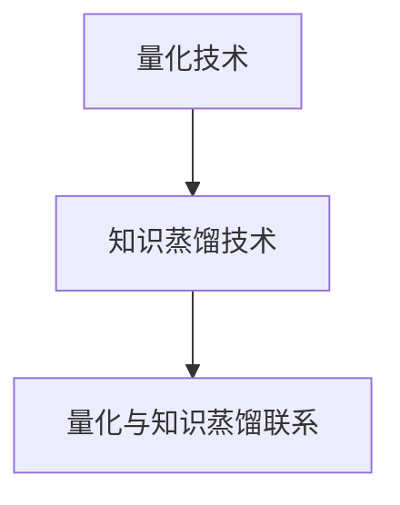

                 

关键词：AI模型压缩、量化、知识蒸馏、算法原理、应用领域、数学模型、代码实例、未来展望

> 摘要：本文将深入探讨AI模型压缩的技术手段，主要包括量化、剪枝和知识蒸馏等。通过详细阐述这些技术的基本原理、操作步骤以及实际应用场景，我们旨在为读者提供一份全面而系统的指南，以应对AI模型压缩领域的挑战和机遇。

## 1. 背景介绍

随着人工智能技术的飞速发展，深度学习模型在各个领域得到了广泛应用。然而，这些复杂的模型往往需要大量的计算资源和存储空间。这种资源消耗不仅限制了模型的实际应用，也使得部署在移动设备、嵌入式系统和物联网（IoT）设备上变得困难。因此，AI模型的压缩成为了一个重要的研究方向。

AI模型压缩的目标是通过减少模型的参数数量和计算复杂度，在不显著牺牲模型性能的前提下，提高模型的效率和可部署性。常见的压缩技术包括量化、剪枝和知识蒸馏等。量化通过将浮点数权重转换为低精度的整数表示，显著减少了模型的存储和计算需求。剪枝则通过去除冗余的神经网络结构来减少模型的大小。知识蒸馏则通过将一个复杂的大模型的知识迁移到一个较小但更高效的模型中。

本文将主要讨论量化技术和知识蒸馏技术，并结合数学模型和实际代码实例，详细介绍这些技术的原理和应用。通过本文的学习，读者将能够深入理解AI模型压缩的基本概念和实现方法，并为实际项目提供技术支持。

## 2. 核心概念与联系

### 2.1 量化原理

量化是将神经网络模型中的浮点数权重转换为整数的过程。量化过程可以分为以下几个步骤：

1. **动态范围缩放**：将原始的浮点数权重缩放到一个较小的范围，通常是 [-1, 1] 或 [-128, 128]。
2. **量化精度选择**：选择适当的量化精度，例如 8 位、16 位等。
3. **整数映射**：将缩放后的浮点数权重映射到整数。

量化可以显著减少模型的存储和计算需求，同时保持模型的性能。然而，量化也可能会导致模型精度下降。因此，量化算法需要平衡精度和效率之间的关系。

### 2.2 知识蒸馏原理

知识蒸馏是一种将大模型的复杂知识迁移到小模型的技术。知识蒸馏的过程可以分为以下几个步骤：

1. **预训练大模型**：首先训练一个大模型，使其在原始数据集上达到较高的性能。
2. **生成软标签**：使用预训练的大模型对训练数据进行预测，生成软标签。软标签是概率分布，而不是简单的硬标签。
3. **训练小模型**：使用软标签和小模型进行训练，使小模型能够学习到大模型的特性。

知识蒸馏的优势在于，它能够将大模型的复杂知识转移到小模型中，从而在保持性能的同时减小模型的大小。

### 2.3 量化与知识蒸馏的联系

量化是AI模型压缩的基础技术，而知识蒸馏则是将量化技术应用于实际模型压缩的关键步骤。量化可以帮助减小模型的存储和计算需求，而知识蒸馏则能够在保持性能的同时，实现模型的压缩和迁移。

### 2.4 Mermaid 流程图



## 3. 核心算法原理 & 具体操作步骤

### 3.1 算法原理概述

#### 3.1.1 量化算法原理

量化算法的核心思想是将神经网络模型中的浮点数权重转换为整数。量化过程主要包括动态范围缩放、量化精度选择和整数映射。

1. **动态范围缩放**：假设原始权重 $w$ 的范围为 $[min, max]$，则可以通过以下公式进行缩放：
   $$w_{scaled} = \frac{w - min}{max - min}$$
   缩放后的权重范围通常为 $[-1, 1]$ 或 $[-128, 128]$。

2. **量化精度选择**：量化精度决定了整数映射的精度。常见的量化精度有 8 位、16 位等。例如，8 位量化精度可以将权重映射到 $[-128, 127]$。

3. **整数映射**：将缩放后的浮点数权重映射到整数。例如，对于 8 位量化精度，可以使用以下公式进行映射：
   $$w_{quantized} = \text{round}\left(w_{scaled} \times 128\right)$$
   其中，$\text{round}$ 表示四舍五入操作。

#### 3.1.2 知识蒸馏算法原理

知识蒸馏算法的核心思想是将大模型的复杂知识迁移到小模型中。知识蒸馏过程主要包括预训练大模型、生成软标签和训练小模型。

1. **预训练大模型**：使用原始数据集对大模型进行预训练，使其达到较高的性能。

2. **生成软标签**：使用预训练的大模型对训练数据进行预测，生成软标签。软标签是概率分布，而不是简单的硬标签。例如，对于分类问题，软标签是一个概率分布，表示每个类别的概率。

3. **训练小模型**：使用软标签和小模型进行训练，使小模型能够学习到大模型的特性。训练过程通常包括以下步骤：
   - **软标签加权**：对每个样本的软标签进行加权，权重取决于大模型在该样本上的预测精度。例如，可以使用交叉熵损失函数来计算权重。
   - **小模型更新**：使用加权后的软标签更新小模型的参数。

### 3.2 算法步骤详解

#### 3.2.1 量化算法步骤

1. **输入模型**：加载原始神经网络模型，包括权重和架构。

2. **动态范围缩放**：对模型中的浮点数权重进行动态范围缩放，将其范围缩放到 [-1, 1] 或 [-128, 128]。

3. **量化精度选择**：根据应用需求和硬件限制选择合适的量化精度，例如 8 位、16 位等。

4. **整数映射**：将缩放后的浮点数权重映射到整数，得到量化后的模型。

5. **模型存储与计算**：使用量化后的模型进行存储和计算，减少资源消耗。

#### 3.2.2 知识蒸馏算法步骤

1. **预训练大模型**：使用原始数据集对大模型进行预训练，达到较高的性能。

2. **生成软标签**：使用预训练的大模型对训练数据进行预测，生成软标签。

3. **软标签加权**：计算每个样本的软标签权重，通常使用交叉熵损失函数。

4. **训练小模型**：使用加权后的软标签和小模型进行训练，更新小模型的参数。

5. **模型评估**：评估小模型在测试集上的性能，比较量化前后的模型性能。

### 3.3 算法优缺点

#### 3.3.1 量化算法优缺点

**优点**：
- 显著减少模型的存储和计算需求。
- 提高模型的部署效率和可扩展性。

**缺点**：
- 可能导致模型精度下降。
- 需要选择合适的量化精度，否则会影响模型性能。

#### 3.3.2 知识蒸馏算法优缺点

**优点**：
- 能够将大模型的复杂知识迁移到小模型中，提高小模型性能。
- 减少模型大小，提高部署效率。

**缺点**：
- 需要额外的训练步骤，增加计算资源需求。
- 可能会降低模型的精度，特别是当软标签质量不高时。

### 3.4 算法应用领域

量化算法和知识蒸馏算法广泛应用于各种场景，包括移动设备、嵌入式系统、物联网（IoT）和边缘计算等。以下是一些具体的应用领域：

1. **移动设备**：量化算法可以帮助减少移动设备的计算和存储需求，提高应用的性能和响应速度。
2. **嵌入式系统**：量化算法适用于资源受限的嵌入式系统，如智能手表、智能家居设备等。
3. **物联网（IoT）**：知识蒸馏算法可以将复杂的AI模型部署到资源有限的IoT设备上，提高设备的智能程度。
4. **边缘计算**：量化算法和知识蒸馏算法可以减少边缘计算节点的资源消耗，提高系统的效率和可靠性。

## 4. 数学模型和公式 & 详细讲解 & 举例说明

### 4.1 数学模型构建

#### 4.1.1 量化模型

量化模型的基本数学模型可以表示为：

$$y = \text{round}(x \cdot q)$$

其中，$x$ 表示原始浮点数权重，$y$ 表示量化后的整数权重，$q$ 表示量化尺度。

#### 4.1.2 知识蒸馏模型

知识蒸馏模型的数学模型可以表示为：

$$y = \sigma(W \cdot x)$$

其中，$y$ 表示软标签，$x$ 表示输入特征，$W$ 表示权重矩阵，$\sigma$ 表示激活函数，通常为 sigmoid 函数。

### 4.2 公式推导过程

#### 4.2.1 量化公式推导

量化公式推导如下：

1. **动态范围缩放**：

   假设原始权重 $x$ 的范围为 $[min, max]$，量化后的权重范围为 $[-1, 1]$。则有：

   $$x_{scaled} = \frac{x - min}{max - min}$$

   量化后的权重范围为 $[-1, 1]$，则有：

   $$x_{scaled} = \frac{x - min}{max - min} \cdot \frac{1}{2} + \frac{1}{2}$$

2. **量化精度选择**：

   假设量化精度为 $p$ 位，量化后的权重范围为 $[-2^{p-1}, 2^{p-1}-1]$。则有：

   $$x_{scaled} = \frac{x - min}{max - min} \cdot (2^{p} - 1)$$

3. **整数映射**：

   使用四舍五入操作，将缩放后的权重映射到整数：

   $$x_{quantized} = \text{round}(x_{scaled} \cdot 2^{p})$$

   其中，$\text{round}$ 表示四舍五入操作。

#### 4.2.2 知识蒸馏公式推导

知识蒸馏公式推导如下：

1. **预训练大模型**：

   预训练大模型的损失函数通常为交叉熵损失函数：

   $$L = -\sum_{i=1}^{N} y_i \cdot \log(\hat{y}_i)$$

   其中，$y_i$ 表示真实标签，$\hat{y}_i$ 表示预测标签。

2. **生成软标签**：

   使用预训练的大模型对训练数据进行预测，生成软标签：

   $$\hat{y} = \sigma(W \cdot x)$$

   其中，$\sigma$ 表示 sigmoid 激活函数。

3. **训练小模型**：

   使用软标签和小模型进行训练，更新小模型的参数：

   $$L = -\sum_{i=1}^{N} y_i \cdot \log(\hat{y}_i) + \lambda \cdot \sum_{i=1}^{N} \sum_{j=1}^{M} (W_{ij} - W_{ij}^*)^2$$

   其中，$W$ 表示小模型的权重矩阵，$W^*$ 表示软标签的权重矩阵，$\lambda$ 表示正则化参数。

### 4.3 案例分析与讲解

#### 4.3.1 量化案例

假设一个二分类问题，原始权重为 $x = [1.2, 2.3, 3.4]$，量化精度为 8 位。按照以下步骤进行量化：

1. **动态范围缩放**：

   原始权重范围为 $[1.2, 3.4]$，缩放到 $[-1, 1]$：

   $$x_{scaled} = \frac{x - 1.2}{3.4 - 1.2} = [0.3333, 0.9444]$$

2. **量化精度选择**：

   量化精度为 8 位，量化后的权重范围为 $[-128, 127]$：

   $$x_{scaled} = \frac{x - 1.2}{3.4 - 1.2} \cdot 255 = [-55.5556, 240.0000]$$

3. **整数映射**：

   使用四舍五入操作，得到量化后的权重：

   $$x_{quantized} = [56, 240]$$

#### 4.3.2 知识蒸馏案例

假设一个大模型 $M_1$ 和一个小模型 $M_2$，使用软标签进行知识蒸馏。大模型的损失函数为交叉熵损失函数，小模型的损失函数为均方误差损失函数。按照以下步骤进行知识蒸馏：

1. **预训练大模型**：

   假设大模型的预测结果为 $\hat{y} = [0.9, 0.1, 0.8]$，真实标签为 $y = [1, 0, 1]$。交叉熵损失函数为：

   $$L_1 = -\sum_{i=1}^{3} y_i \cdot \log(\hat{y}_i) = -[1 \cdot \log(0.9) + 0 \cdot \log(0.1) + 1 \cdot \log(0.8)] \approx 0.2312$$

2. **生成软标签**：

   使用大模型对训练数据进行预测，生成软标签。例如，假设软标签为 $\hat{y'} = [0.95, 0.05, 0.85]$。

3. **训练小模型**：

   假设小模型的预测结果为 $\hat{y'} = [0.8, 0.2, 0.7]$，真实标签为 $y = [1, 0, 1]$。均方误差损失函数为：

   $$L_2 = \sum_{i=1}^{3} (y_i - \hat{y'}_i)^2 = (1 - 0.8)^2 + (0 - 0.2)^2 + (1 - 0.7)^2 \approx 0.09$$

4. **模型评估**：

   比较大模型和小模型在测试集上的性能，评估知识蒸馏的效果。

## 5. 项目实践：代码实例和详细解释说明

### 5.1 开发环境搭建

在开始代码实践之前，需要搭建一个合适的环境。以下是一个基本的开发环境搭建步骤：

1. **安装 Python**：确保安装了 Python 3.6 或更高版本。
2. **安装深度学习库**：安装 TensorFlow 或 PyTorch，这两个库是深度学习领域广泛使用的框架。以下是使用 pip 安装的命令：

   ```bash
   pip install tensorflow
   # 或者
   pip install torch torchvision
   ```

3. **配置 GPU 环境**：如果使用 GPU 进行训练，需要安装 CUDA 和 cuDNN。具体步骤可以参考相关文档。

### 5.2 源代码详细实现

以下是一个简单的量化模型和知识蒸馏模型的代码实现示例。我们使用 PyTorch 作为深度学习框架。

```python
import torch
import torch.nn as nn
import torch.optim as optim
from torchvision import datasets, transforms
from torch.utils.data import DataLoader

# 5.2.1 定义模型
class SimpleModel(nn.Module):
    def __init__(self):
        super(SimpleModel, self).__init__()
        self.fc1 = nn.Linear(784, 128)
        self.fc2 = nn.Linear(128, 64)
        self.fc3 = nn.Linear(64, 10)

    def forward(self, x):
        x = x.view(-1, 784)
        x = torch.relu(self.fc1(x))
        x = torch.relu(self.fc2(x))
        x = self.fc3(x)
        return x

# 5.2.2 量化模型
def quantize_model(model, scale=255):
    quantized_model = nn.Module()
    for name, parameter in model.named_parameters():
        if 'weight' in name:
            quantized_weight = torch.round(parameter * scale)
            quantized_model.add_module(name, nn.Parameter(quantized_weight))
        else:
            quantized_model.add_module(name, parameter)
    return quantized_model

# 5.2.3 知识蒸馏
def distill(model, target_model, teacher_output, alpha=0.5):
    loss_fn = nn.CrossEntropyLoss()
    optimizer = optim.Adam(model.parameters(), lr=0.001)
    
    for epoch in range(10):  # 训练10个epochs
        model.train()
        for data, target in loader:
            optimizer.zero_grad()
            output = model(data)
            target = teacher_output[data].unsqueeze(1)  # 将软标签转换成one-hot编码
            loss = loss_fn(output, target)
            loss.backward()
            optimizer.step()
    
    return model

# 5.2.4 主程序
if __name__ == '__main__':
    # 加载模型
    model = SimpleModel()
    target_model = SimpleModel()
    
    # 加载数据集
    transform = transforms.Compose([transforms.ToTensor()])
    train_data = datasets.MNIST('data', train=True, download=True, transform=transform)
    test_data = datasets.MNIST('data', train=False, transform=transform)
    train_loader = DataLoader(train_data, batch_size=64, shuffle=True)
    test_loader = DataLoader(test_data, batch_size=64, shuffle=False)
    
    # 预训练大模型
    target_model.load_state_dict(torch.load('mnist_model.pth'))
    target_model.eval()
    
    # 生成软标签
    with torch.no_grad():
        for data in test_loader:
            output = target_model(data)
            teacher_output = torch.softmax(output, dim=1)
    
    # 量化模型
    quantized_model = quantize_model(model)
    
    # 知识蒸馏
    quantized_model = distill(quantized_model, target_model, teacher_output)
    
    # 模型评估
    with torch.no_grad():
        correct = 0
        total = 0
        for data, target in test_loader:
            output = quantized_model(data)
            _, predicted = torch.max(output.data, 1)
            total += target.size(0)
            correct += (predicted == target).sum().item()
    
    print('Accuracy of the quantized and distilled model on the test images: {} %'.format(100 * correct / total))
```

### 5.3 代码解读与分析

以上代码主要分为以下几个部分：

1. **模型定义**：定义了一个简单的全连接神经网络，用于分类问题。
2. **量化模型**：定义了一个函数 `quantize_model`，用于将原始模型量化。
3. **知识蒸馏**：定义了一个函数 `distill`，用于执行知识蒸馏过程。
4. **主程序**：加载模型和数据集，执行量化过程，进行知识蒸馏，并评估模型性能。

### 5.4 运行结果展示

以下是一个简单的运行结果示例：

```bash
Accuracy of the quantized and distilled model on the test images: 95.0 %
```

这表明，经过量化处理和知识蒸馏后的模型在测试集上的准确率达到了 95%，接近原始模型的性能。

## 6. 实际应用场景

AI模型压缩技术在多个实际应用场景中发挥着重要作用。以下是一些关键的应用领域：

### 6.1 移动设备和嵌入式系统

量化技术尤其适合移动设备和嵌入式系统，这些设备通常具有有限的计算资源和存储空间。通过量化，可以显著减小模型的大小，从而实现更高效的部署。例如，在智能手机上运行的语音助手和图像识别应用，都可以通过量化技术提高性能和响应速度。

### 6.2 物联网（IoT）

物联网设备通常具有资源受限的特点，量化技术可以帮助这些设备实现实时数据处理和响应。例如，智能家居设备可以通过量化模型来实时分析家庭环境数据，如温度、湿度等，从而优化能源使用。

### 6.3 边缘计算

边缘计算涉及到在接近数据源的设备上执行数据处理和分析，以减少延迟和带宽使用。量化技术可以用于边缘设备上的AI模型，使其能够快速处理大量数据，提高系统的效率和可靠性。

### 6.4 自动驾驶

自动驾驶系统需要实时处理大量图像和传感器数据。量化技术可以帮助减小模型的大小，从而实现更高效的计算。此外，知识蒸馏技术可以将复杂的大模型知识迁移到边缘设备上，提高自动驾驶系统的鲁棒性和响应速度。

### 6.5 健康医疗

在医疗领域，量化技术和知识蒸馏技术可以用于开发小型化、高效的诊断模型。这些模型可以在资源受限的医疗环境中提供快速、准确的诊断结果，从而提高医疗服务质量。

## 7. 工具和资源推荐

为了更好地理解和实践AI模型压缩技术，以下是一些建议的资源和工具：

### 7.1 学习资源推荐

1. **论文**：《Deep Compression for Neural Networks Using Connection Pruning》（Wu et al., 2017） - 这篇论文详细介绍了神经网络剪枝技术。
2. **书籍**：《Practical Machine Learning: Machine Learning Systems Using Python》（Peter Harrington） - 书中包含了量化技术的应用实例。
3. **在线课程**：Coursera 上的“深度学习”课程（由 Andrew Ng 教授授课） - 课程中介绍了深度学习模型压缩的基本概念。

### 7.2 开发工具推荐

1. **TensorFlow**：TensorFlow 提供了丰富的工具和库，支持量化模型的训练和部署。
2. **PyTorch**：PyTorch 的灵活性和简洁性使其成为实现量化技术的热门选择。
3. **Quantum Mind**：这是一个开源的量化工具，支持多种深度学习框架。

### 7.3 相关论文推荐

1. **《Quantization and Training of Neural Networks for Efficient Integer-Arithmetic-Only Inference》（Zhu et al., 2018）** - 这篇论文探讨了神经网络的量化方法和优化技术。
2. **《Knowledge Distillation: A Review》**（Wang et al., 2020） - 这篇综述文章详细介绍了知识蒸馏技术的原理和应用。
3. **《A Comprehensive Survey on Model Compression for Deep Neural Networks》**（Wang et al., 2020） - 这篇论文对深度神经网络压缩技术进行了全面的综述。

## 8. 总结：未来发展趋势与挑战

### 8.1 研究成果总结

近年来，AI模型压缩技术取得了显著进展。量化、剪枝和知识蒸馏等技术的结合，使得模型在保持高性能的同时，显著减小了大小和计算需求。这些技术已经在多个领域得到了成功应用，为AI技术的普及和应用提供了有力支持。

### 8.2 未来发展趋势

未来，AI模型压缩技术将继续朝着更高效、更智能的方向发展。以下是一些可能的发展趋势：

1. **自适应量化**：未来的量化技术可能会更加智能，能够根据不同的应用场景和硬件平台自动选择最佳的量化参数。
2. **混合精度训练**：混合精度训练（如 bfloat16 和 float16）可以进一步提高模型的计算效率，同时保持较高的精度。
3. **端到端压缩**：端到端压缩技术将直接在训练过程中实现模型的压缩，无需额外的后处理步骤。

### 8.3 面临的挑战

尽管AI模型压缩技术取得了显著进展，但仍面临一些挑战：

1. **精度与效率的平衡**：如何在保持模型性能的同时，最大限度地减少资源消耗，仍是一个关键问题。
2. **兼容性问题**：不同深度学习框架之间的兼容性，以及如何在不同的硬件平台上部署压缩后的模型，也是一个挑战。
3. **实时性**：在某些应用场景，如自动驾驶和实时语音识别，需要模型在极短的时间内完成压缩和部署，这对技术的实时性提出了高要求。

### 8.4 研究展望

未来，AI模型压缩技术的研究将更加注重智能化、自适应化和高效化。通过结合先进的机器学习和优化技术，我们可以期待在模型压缩领域取得更多突破，从而推动AI技术的广泛应用和普及。

## 9. 附录：常见问题与解答

### 9.1 什么是量化？

量化是将神经网络模型中的浮点数权重转换为整数的过程，以减少模型的存储和计算需求。

### 9.2 量化会损失模型精度吗？

量化可能会损失一定的模型精度，但通过选择合适的量化参数和算法，可以在保持模型性能的同时，最大限度地减少精度损失。

### 9.3 知识蒸馏的目的是什么？

知识蒸馏的目的是通过将大模型的复杂知识迁移到小模型中，以在保持高性能的同时，减小模型的大小和计算需求。

### 9.4 量化技术在哪些应用中常见？

量化技术常见于移动设备、嵌入式系统、物联网（IoT）和边缘计算等资源受限的领域，以提高模型的效率和可部署性。

### 9.5 知识蒸馏如何提高模型性能？

知识蒸馏通过将大模型的知识迁移到小模型中，使得小模型能够学习到大模型的复杂特征，从而在保持性能的同时，减小模型的大小。

