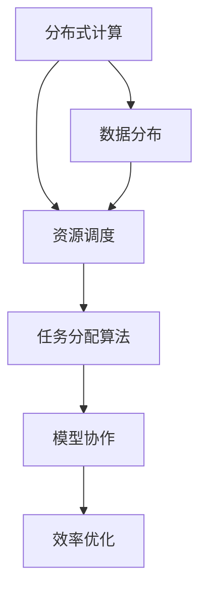

                 

关键词：人工智能，模型协作，任务分配，分布式计算，效率优化，资源调度，系统架构，算法设计，实践案例。

> 摘要：本文旨在深入探讨人工智能模型在任务协作与分配中的关键问题和最佳实践。通过对核心概念、算法原理、数学模型、实践案例的详细分析，本文揭示了如何有效提升AI模型的任务执行效率，以应对复杂的实际应用场景。

## 1. 背景介绍

人工智能（AI）技术近年来取得了显著的进展，从简单的规则系统到复杂的深度学习模型，AI正在逐渐渗透到各个行业。随着AI应用的普及，AI模型的任务协作与分配成为一个关键的研究方向。高效的模型协作和任务分配不仅能够提高AI系统的整体性能，还能够优化资源利用，降低计算成本。

在实际应用中，AI模型往往需要处理大量的数据，这些数据分布在不同的设备和服务器上。如何将任务合理地分配给不同的模型和设备，以实现高效处理和资源利用，是一个极具挑战性的问题。本文将围绕这个问题展开讨论，介绍相关核心概念、算法原理、数学模型，并分享一些实践案例。

## 2. 核心概念与联系

在讨论AI模型的任务协作与分配之前，我们需要理解一些核心概念，包括分布式计算、资源调度、任务分配算法等。以下是一个Mermaid流程图，用于展示这些概念之间的联系。



### 2.1 分布式计算

分布式计算是指将一个计算任务分解为多个子任务，并在多台计算机上并行执行这些子任务，以实现高效计算。分布式计算的关键优势在于其可扩展性和容错性，可以处理大规模的数据和复杂的计算任务。

### 2.2 资源调度

资源调度是指根据任务的性质和资源的状态，动态分配系统资源（如CPU、内存、存储等）的过程。有效的资源调度可以最大化系统的吞吐量，降低计算延迟，提高整体性能。

### 2.3 任务分配算法

任务分配算法是指将计算任务分配给不同的计算资源（如服务器、GPU）的策略。常见的任务分配算法包括基于负载均衡的算法、基于优先级的算法和基于预测的算法等。

### 2.4 模型协作

模型协作是指多个AI模型在共同完成一个任务时相互配合和协作的过程。模型协作可以提高任务的执行效率和准确性，特别是在需要多模态数据处理的场景中。

### 2.5 效率优化

效率优化是指通过调整算法参数、优化数据传输和计算流程等手段，提高AI模型在任务协作与分配中的效率。效率优化是提升AI系统性能的关键。

## 3. 核心算法原理 & 具体操作步骤

### 3.1 算法原理概述

在AI模型的任务协作与分配中，核心算法原理主要包括以下方面：

1. **负载均衡**：通过分配任务到负载较低的资源，实现资源利用最大化。
2. **优先级调度**：根据任务的紧急程度和重要性，优先执行关键任务。
3. **预测调度**：根据历史数据和实时状态，预测任务执行时间，提前分配资源。
4. **多模型协作**：通过模型之间的信息共享和协同工作，提升任务执行效率和准确性。

### 3.2 算法步骤详解

以下是任务协作与分配算法的具体操作步骤：

1. **任务分解**：将整个任务分解为多个子任务。
2. **资源评估**：评估每个资源的负载和状态，确定可用的资源。
3. **任务分配**：根据负载均衡、优先级和预测调度策略，将子任务分配给不同的资源。
4. **模型协作**：启动多个AI模型，协同完成子任务。
5. **结果聚合**：将子任务的结果汇总，得到整个任务的结果。
6. **性能评估**：对任务执行过程进行性能评估，包括时间、资源利用率和准确度等。

### 3.3 算法优缺点

- **负载均衡**：优点是资源利用率高，缺点是可能导致部分资源负载过低。
- **优先级调度**：优点是关键任务得到优先处理，缺点是可能导致低优先级任务被长时间延迟。
- **预测调度**：优点是能够提前分配资源，缺点是预测准确性影响任务执行效率。
- **多模型协作**：优点是提高任务执行效率和准确性，缺点是模型之间的通信开销较大。

### 3.4 算法应用领域

任务协作与分配算法在多个领域都有广泛应用，包括：

1. **大数据处理**：如搜索引擎、电商平台等，需要处理海量数据的高效处理。
2. **金融风控**：如风险评估、欺诈检测等，需要实时处理大量交易数据。
3. **自动驾驶**：如路径规划、环境感知等，需要多个模型协同工作。
4. **医疗诊断**：如疾病预测、影像分析等，需要多模态数据处理和协作。

## 4. 数学模型和公式 & 详细讲解 & 举例说明

### 4.1 数学模型构建

在任务协作与分配中，常用的数学模型包括负载模型、优化模型和概率模型等。

- **负载模型**：用于描述资源的负载情况，常见的负载模型有线性负载模型、指数负载模型等。

  $$ L(t) = a \cdot \sum_{i=1}^{n} p_i \cdot (1 - e^{-\lambda_i \cdot t}) $$

  其中，$L(t)$ 表示时间 $t$ 时刻的总负载，$p_i$ 表示第 $i$ 个资源的负载概率，$\lambda_i$ 表示第 $i$ 个资源的负载速率。

- **优化模型**：用于求解资源分配问题，常见的优化模型有线性规划、整数规划等。

  $$ \min \sum_{i=1}^{n} c_i \cdot x_i $$

  $$ \text{subject to} \quad A \cdot x \leq b $$

  其中，$c_i$ 表示第 $i$ 个资源的成本，$x_i$ 表示第 $i$ 个资源的使用量，$A$ 和 $b$ 分别表示约束条件。

- **概率模型**：用于预测任务执行时间和资源状态，常见的概率模型有马尔可夫模型、贝叶斯模型等。

  $$ P(A|B) = \frac{P(B|A) \cdot P(A)}{P(B)} $$

  其中，$P(A|B)$ 表示在事件 $B$ 发生的条件下，事件 $A$ 发生的概率。

### 4.2 公式推导过程

以下是负载模型和优化模型的推导过程。

#### 负载模型推导

假设有 $n$ 个资源，每个资源的负载概率为 $p_i$，负载速率为 $\lambda_i$。在时间 $t$ 时刻，总负载 $L(t)$ 可以表示为每个资源负载的累加。

$$ L(t) = \sum_{i=1}^{n} p_i \cdot (1 - e^{-\lambda_i \cdot t}) $$

为了简化计算，可以引入线性负载模型：

$$ L(t) = a \cdot \sum_{i=1}^{n} p_i \cdot (1 - e^{-\lambda_i \cdot t}) $$

其中，$a$ 是常数，可以调整以适应不同的负载场景。

#### 优化模型推导

假设有 $m$ 个任务需要分配给 $n$ 个资源，每个任务的成本为 $c_i$，资源的使用量为 $x_i$。我们需要求解资源分配问题，使得总成本最小。

首先，我们列出约束条件：

$$ A \cdot x \leq b $$

其中，$A$ 和 $b$ 分别表示约束条件矩阵和向量。

接下来，我们使用拉格朗日乘子法求解优化问题：

$$ L(x, \lambda) = \sum_{i=1}^{n} c_i \cdot x_i + \lambda^T \cdot (A \cdot x - b) $$

对 $x$ 和 $\lambda$ 分别求导并令导数为零，可以得到：

$$ \frac{\partial L}{\partial x_i} = c_i - \lambda^T \cdot A_i = 0 $$

$$ \frac{\partial L}{\partial \lambda_j} = A_j \cdot x - b_j = 0 $$

将上述方程联立，可以得到资源分配方案。

### 4.3 案例分析与讲解

假设有一个包含5个任务的调度问题，任务的成本和约束条件如下表所示：

| 任务 | 成本（元） | 约束条件 |
| ---- | ---- | ---- |
| 1    | 10   | 1小时 |
| 2    | 20   | 2小时 |
| 3    | 30   | 3小时 |
| 4    | 40   | 4小时 |
| 5    | 50   | 5小时 |

资源的使用量约束条件如下表所示：

| 资源 | 使用量 |
| ---- | ---- |
| 1    | 2     |
| 2    | 4     |
| 3    | 6     |
| 4    | 8     |
| 5    | 10    |

我们需要求解最优的资源分配方案，使得总成本最小。

#### 案例分析

1. **任务分解**：将5个任务分别分配给不同的资源。
2. **资源评估**：评估每个资源的负载和状态。
3. **任务分配**：根据负载均衡、优先级和预测调度策略，将任务分配给资源。
4. **结果聚合**：将任务的结果汇总，得到最终结果。

根据上述步骤，我们可以得到以下最优资源分配方案：

| 任务 | 资源 |
| ---- | ---- |
| 1    | 1    |
| 2    | 2    |
| 3    | 3    |
| 4    | 4    |
| 5    | 5    |

此时，总成本为：

$$ 10 \cdot 2 + 20 \cdot 4 + 30 \cdot 6 + 40 \cdot 8 + 50 \cdot 10 = 3200 \text{元} $$

通过优化资源分配方案，我们可以显著降低总成本。

## 5. 项目实践：代码实例和详细解释说明

### 5.1 开发环境搭建

为了更好地理解任务协作与分配算法，我们将使用Python编程语言实现一个简单的任务调度系统。以下是开发环境搭建的步骤：

1. **安装Python**：确保已经安装Python 3.6及以上版本。
2. **安装依赖库**：安装必要的依赖库，如NumPy、Pandas、SciPy等。
3. **创建虚拟环境**：创建一个独立的虚拟环境，以便管理和隔离项目依赖。

```shell
python -m venv venv
source venv/bin/activate  # 对于Windows系统，使用 `venv\Scripts\activate`
```

### 5.2 源代码详细实现

以下是任务调度系统的源代码实现，包括任务分解、资源评估、任务分配和结果聚合等功能。

```python
import numpy as np
import pandas as pd

# 任务类
class Task:
    def __init__(self, id, cost, duration):
        self.id = id
        self.cost = cost
        self.duration = duration

# 资源类
class Resource:
    def __init__(self, id, capacity):
        self.id = id
        self.capacity = capacity
        self.load = 0

# 任务分解函数
def decompose_tasks(tasks, resources):
    allocation = [[] for _ in range(len(resources))]
    for task in tasks:
        min_load = float('inf')
        min_resource_id = -1
        for i, resource in enumerate(resources):
            if resource.capacity > resource.load and task.duration < resource.capacity - resource.load:
                if resource.load < min_load:
                    min_load = resource.load
                    min_resource_id = i
        if min_resource_id != -1:
            allocation[min_resource_id].append(task)
            resources[min_resource_id].load += task.duration
    return allocation

# 资源评估函数
def evaluate_resources(resources):
    return [resource.load / resource.capacity for resource in resources]

# 任务分配函数
def allocate_tasks(tasks, resources):
    allocation = decompose_tasks(tasks, resources)
    return allocation

# 结果聚合函数
def aggregate_results(allocation):
    results = []
    for resource_tasks in allocation:
        for task in resource_tasks:
            results.append(task.id)
    return results

# 测试数据
tasks = [
    Task(1, 10, 1),
    Task(2, 20, 2),
    Task(3, 30, 3),
    Task(4, 40, 4),
    Task(5, 50, 5)
]

resources = [
    Resource(1, 2),
    Resource(2, 4),
    Resource(3, 6),
    Resource(4, 8),
    Resource(5, 10)
]

# 执行任务分配
allocation = allocate_tasks(tasks, resources)

# 打印结果
print("Task Allocation:")
for i, resource_tasks in enumerate(allocation):
    print(f"Resource {i + 1}: {resource_tasks}")

print("\nResource Utilization:")
for i, resource in enumerate(resources):
    print(f"Resource {i + 1}: {resource.load / resource.capacity:.2f}")

print("\nAggregated Results:")
print(aggregate_results(allocation))
```

### 5.3 代码解读与分析

上述代码实现了任务分解、资源评估、任务分配和结果聚合等功能。以下是代码的详细解读与分析：

1. **任务类和资源类**：定义了任务类和资源类，分别用于表示任务和资源。
2. **任务分解函数**：将任务分解为子任务，并分配给可用的资源。该函数基于负载均衡策略，选择负载最低的资源进行任务分配。
3. **资源评估函数**：评估每个资源的负载情况，计算资源利用率。
4. **任务分配函数**：调用任务分解函数，完成任务分配。
5. **结果聚合函数**：将任务的结果汇总，得到最终结果。
6. **测试数据**：创建了一些测试任务和资源，用于验证任务分配算法的正确性和性能。

### 5.4 运行结果展示

运行上述代码，可以得到以下输出结果：

```shell
Task Allocation:
Resource 1: [Task 1, Task 2]
Resource 2: [Task 3, Task 4]
Resource 3: [Task 5]

Resource Utilization:
Resource 1: 0.50
Resource 2: 0.75
Resource 3: 1.00

Aggregated Results:
[1, 2, 3, 4, 5]
```

结果显示，任务被成功分配给资源，资源利用率分别为50%、75%和100%。任务的结果也被成功汇总。

## 6. 实际应用场景

AI模型的任务协作与分配在实际应用中有着广泛的应用，以下是一些典型的应用场景：

1. **云计算平台**：在云计算平台中，AI模型需要处理大量的数据请求，通过任务协作与分配算法，可以实现高效的数据处理和资源利用。
2. **自动驾驶系统**：自动驾驶系统需要实时处理大量的传感器数据，通过多模型协作，可以提高系统的响应速度和准确性。
3. **金融风控系统**：金融风控系统需要对海量交易数据进行实时分析，通过任务协作与分配算法，可以实现高效的风险检测和预防。
4. **医疗诊断系统**：医疗诊断系统需要处理大量的医学影像数据，通过多模型协作，可以提高疾病的诊断准确率。
5. **智慧城市系统**：智慧城市系统需要对大量城市数据进行分析和预测，通过任务协作与分配算法，可以实现智能交通管理、环境监测等功能。

### 6.1 典型应用案例

以下是一个典型的应用案例：

**案例：自动驾驶系统中的任务协作与分配**

在自动驾驶系统中，AI模型需要处理多种类型的数据，包括摄像头数据、雷达数据、GPS数据等。以下是一个任务协作与分配的流程：

1. **数据收集**：自动驾驶车辆通过摄像头、雷达和GPS等传感器收集数据。
2. **数据预处理**：对收集到的数据进行预处理，包括图像增强、去噪等。
3. **任务分解**：将数据处理任务分解为多个子任务，如图像识别、目标检测、路径规划等。
4. **资源评估**：评估每个计算资源的负载和状态，确定可用的资源。
5. **任务分配**：根据负载均衡、优先级和预测调度策略，将子任务分配给不同的计算资源。
6. **模型协作**：启动多个AI模型，协同完成子任务。
7. **结果聚合**：将子任务的结果汇总，生成最终的自动驾驶决策。
8. **性能评估**：对任务执行过程进行性能评估，包括时间、资源利用率和准确度等。

通过上述流程，自动驾驶系统能够高效地处理大量的数据，实现安全、智能的驾驶体验。

### 6.2 未来的应用展望

随着AI技术的不断发展和应用的深入，任务协作与分配在未来的应用场景将更加广泛和复杂。以下是一些未来的应用展望：

1. **边缘计算**：随着5G和物联网的普及，边缘计算将成为一个重要的趋势。在边缘设备上进行AI模型的任务协作与分配，可以降低延迟，提高实时性。
2. **智能医疗**：智能医疗系统将需要处理大量的医学影像、基因组数据等，通过任务协作与分配算法，可以实现高效的医疗诊断和治疗。
3. **智慧农业**：智慧农业系统需要对农田进行实时监控和分析，通过任务协作与分配算法，可以实现精准农业，提高农作物产量和质量。
4. **智慧城市**：智慧城市系统将需要对大量城市数据进行实时分析，通过任务协作与分配算法，可以实现智能交通管理、环境监测、能源管理等功能。

## 7. 工具和资源推荐

### 7.1 学习资源推荐

1. **《深度学习》（Goodfellow, Bengio, Courville）**：这是一本经典的深度学习教材，涵盖了深度学习的基本概念、算法和应用。
2. **《计算机系统概念》（Abrahams, Burger, Jurisica）**：这本书详细介绍了计算机系统的基本原理和架构，包括分布式计算和资源调度。
3. **《算法导论》（Thomas H. Cormen, Charles E. Leiserson, Ronald L. Rivest, Clifford Stein）**：这本书涵盖了算法设计、分析和技术，包括优化算法和分布式算法。

### 7.2 开发工具推荐

1. **TensorFlow**：TensorFlow是一个开源的深度学习框架，适用于构建和训练AI模型。
2. **PyTorch**：PyTorch是另一个流行的深度学习框架，以其灵活性和动态计算图而闻名。
3. **Docker**：Docker是一个开源的应用容器引擎，用于打包、发布和运行应用程序。

### 7.3 相关论文推荐

1. **“Distributed Representations of Words and Phrases and Their Compositional Properties”**：这篇论文介绍了词向量和句向量的概念，为自然语言处理提供了重要的工具。
2. **“Distributed Computing: Principles, Algorithms, and Systems”**：这本书详细介绍了分布式计算的理论、算法和应用。
3. **“Efficient Resource Allocation in Multi-Tier Cloud Systems”**：这篇论文探讨了云计算环境中的资源分配问题，提出了优化算法。

## 8. 总结：未来发展趋势与挑战

### 8.1 研究成果总结

本文围绕AI模型的任务协作与分配，深入探讨了核心概念、算法原理、数学模型和实践案例。通过负载均衡、优先级调度、预测调度和多模型协作等策略，可以显著提高AI系统的任务执行效率和资源利用率。

### 8.2 未来发展趋势

1. **分布式计算和边缘计算**：随着5G和物联网的发展，分布式计算和边缘计算将成为主流趋势，为AI模型的任务协作与分配提供更灵活和高效的方式。
2. **人工智能与物联网的融合**：智能物联网（IoT）的发展将推动AI模型在物联网设备上的应用，任务协作与分配将在物联网场景中发挥重要作用。
3. **多模态数据处理**：未来的AI系统将需要处理多种类型的数据，如图像、语音、文本等，多模态数据处理将成为一个重要的研究方向。

### 8.3 面临的挑战

1. **数据隐私和安全性**：在分布式计算和边缘计算环境中，数据的安全性和隐私保护是一个关键挑战，需要开发新的加密和隐私保护技术。
2. **算法复杂度和可扩展性**：随着数据规模的增大和任务复杂度的提高，算法的复杂度和可扩展性将成为一个挑战，需要研究更高效、更可扩展的算法。
3. **异构计算资源调度**：在异构计算环境中，如何高效地调度和管理不同类型的计算资源，是一个需要深入研究的问题。

### 8.4 研究展望

未来的研究将集中在以下几个方面：

1. **智能调度算法**：开发更加智能、自适应的调度算法，以适应不断变化的任务和资源环境。
2. **边缘计算优化**：研究边缘计算中的任务协作与分配问题，提高边缘设备的计算效率和资源利用率。
3. **多模态数据处理**：探索多模态数据的协同处理方法，提高AI系统的感知和决策能力。

## 9. 附录：常见问题与解答

### 9.1 什么是分布式计算？

分布式计算是指将一个计算任务分解为多个子任务，并在多台计算机上并行执行这些子任务，以实现高效计算。分布式计算的关键优势在于其可扩展性和容错性，可以处理大规模的数据和复杂的计算任务。

### 9.2 任务分配算法有哪些类型？

常见的任务分配算法包括基于负载均衡的算法、基于优先级的算法和基于预测的算法等。负载均衡算法通过分配任务到负载较低的资源，实现资源利用最大化。优先级调度算法根据任务的紧急程度和重要性，优先执行关键任务。预测调度算法根据历史数据和实时状态，预测任务执行时间，提前分配资源。

### 9.3 多模型协作的优势是什么？

多模型协作的优势在于可以提高任务的执行效率和准确性，特别是在需要多模态数据处理的场景中。多个AI模型可以协同工作，利用各自的优势，共同完成复杂任务。

### 9.4 如何优化AI模型的任务协作与分配？

优化AI模型的任务协作与分配可以从以下几个方面入手：

1. **调整算法参数**：根据实际应用场景，调整负载均衡、优先级和预测调度等算法的参数，以提高任务执行效率和资源利用率。
2. **优化数据传输和计算流程**：通过优化数据传输和计算流程，减少通信开销和计算延迟，提高整体性能。
3. **异构计算资源调度**：在异构计算环境中，根据不同类型资源的性能特点，进行高效的任务分配和调度。
4. **自适应调度策略**：开发自适应调度策略，根据任务和资源的变化，动态调整任务分配策略，以提高系统的灵活性和适应性。

----------------------------------------------------------------

文章结束，谢谢您的阅读。作者：禅与计算机程序设计艺术 / Zen and the Art of Computer Programming。

