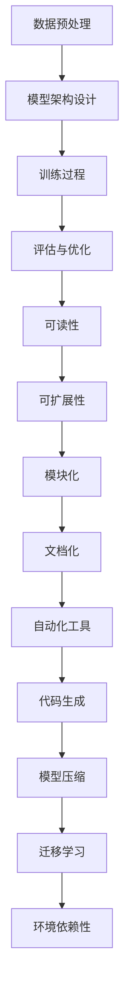

                 

关键词：AI模型、可维护性、挑战、软件工程、算法优化、模型压缩、迁移学习、自动化代码生成、模型管理。

> 摘要：本文将深入探讨人工智能模型的可维护性所面临的挑战，包括模型复杂性、代码可读性、自动化工具的局限性等。通过案例分析，我们提出了提高AI模型可维护性的方法和建议，旨在为开发者提供实用的指导。

## 1. 背景介绍

在过去的几十年里，人工智能（AI）技术取得了飞速发展。从最初的规则推理系统，到如今复杂的深度学习模型，AI模型在图像识别、自然语言处理、推荐系统等领域发挥了重要作用。然而，随着AI模型变得越来越复杂，可维护性成为了开发者和研究人员必须面对的一个重大挑战。

可维护性是指一个系统在经历时间变迁后，仍然能够保持其功能和性能的能力。对于AI模型来说，可维护性尤为重要，因为它们不仅需要适应不断变化的数据集，还可能需要集成到现有的软件架构中，与不同的系统和工具进行交互。

本文将探讨AI模型可维护性面临的几个关键挑战，并分析现有的解决方法，以便为开发者提供可行的解决方案。

### 1.1 AI模型的复杂性

AI模型的复杂性是其可维护性面临的第一个挑战。现代AI模型通常包含数百万个参数，这意味着任何微小的改动都可能对模型的性能产生显著影响。此外，模型的结构和架构也往往非常复杂，涉及到多个层次和模块。这些复杂性使得理解和修改模型变得更加困难。

### 1.2 代码的可读性和可维护性

AI模型的实现通常依赖于大量的代码，这些代码可能由不同的开发者在不同的时间段内编写。这导致了代码风格不一致、注释不足和代码冗长等问题，从而降低了代码的可读性和可维护性。对于需要持续维护和更新的模型，这无疑是一个巨大的挑战。

### 1.3 自动化工具的局限性

虽然自动化工具如自动测试、代码生成和模型压缩等有助于提高模型的可维护性，但它们也存在一些局限性。自动化工具可能无法完全理解AI模型的所有细节，因此在处理复杂的模型时可能会出现问题。

### 1.4 数据集和环境的依赖性

AI模型的训练和验证通常依赖于特定的数据集和计算环境。这些依赖性使得模型在不同环境下部署和维护变得更加复杂。例如，一个在本地机器上表现良好的模型，在云环境中可能需要重新调整参数。

## 2. 核心概念与联系

为了更好地理解AI模型的可维护性挑战，我们首先需要了解一些核心概念和架构。

### 2.1 AI模型的组成

一个典型的AI模型通常包括以下几个组成部分：

1. **数据预处理**：包括数据清洗、归一化和特征提取等步骤。
2. **模型架构**：如卷积神经网络（CNN）、循环神经网络（RNN）和生成对抗网络（GAN）等。
3. **训练过程**：使用梯度下降等算法，通过大量数据迭代地优化模型参数。
4. **评估与优化**：通过验证集和测试集来评估模型性能，并进一步优化模型。

### 2.2 可维护性的核心概念

可维护性通常包括以下几个方面：

1. **可读性**：代码易于理解，结构清晰。
2. **可扩展性**：系统能够适应新的需求和变化。
3. **模块化**：系统由多个独立的模块组成，便于维护和更新。
4. **文档化**：代码和系统有详细的文档，方便开发者理解和使用。

### 2.3 Mermaid 流程图

以下是AI模型可维护性相关的Mermaid流程图：



### 2.4 可维护性与模型性能的关系

可维护性和模型性能之间存在紧密的关系。一个高度可维护的模型不仅更容易理解和修改，而且在面对新的数据和场景时也具有更好的适应性。相反，一个难以维护的模型可能在未来的更新和优化过程中表现不佳。

## 3. 核心算法原理 & 具体操作步骤

### 3.1 算法原理概述

在提高AI模型可维护性方面，核心算法主要包括以下几个方面：

1. **代码优化**：通过优化代码结构和风格，提高代码的可读性和可维护性。
2. **模型压缩**：通过剪枝、量化等技巧，减少模型参数和计算量，从而提高模型的可维护性。
3. **迁移学习**：利用已有的模型权重，在新任务上进行微调，减少从零开始训练的需要。
4. **自动化工具**：使用自动化工具如代码生成、模型压缩和自动化测试等，减轻开发者的负担。

### 3.2 算法步骤详解

以下是提高AI模型可维护性的具体步骤：

1. **代码优化**：
    - **代码重构**：对冗长的代码进行重构，使其更加简洁和易于理解。
    - **代码风格统一**：采用统一的代码风格，避免不必要的差异。
    - **注释与文档**：添加详细的注释和文档，方便后续的维护。

2. **模型压缩**：
    - **剪枝**：通过移除模型中不重要的权重，减少模型的大小。
    - **量化**：将模型中的浮点数参数替换为整数，从而减少模型的存储和计算需求。

3. **迁移学习**：
    - **模型初始化**：使用预训练的模型权重作为起点。
    - **微调**：在新任务上对模型进行微调，以适应具体的应用场景。

4. **自动化工具**：
    - **代码生成**：使用模板和代码生成工具自动生成代码，减少手动编写的错误。
    - **模型压缩**：使用自动化工具对模型进行压缩，以提高模型的可维护性。
    - **自动化测试**：使用自动化测试工具定期测试模型，确保其稳定性和性能。

### 3.3 算法优缺点

每种算法都有其优缺点，如下所示：

1. **代码优化**：
    - **优点**：提高代码的可读性和可维护性，使模型更加稳定和可靠。
    - **缺点**：可能增加开发时间和复杂度，特别是在大型项目中。

2. **模型压缩**：
    - **优点**：减少模型的大小和计算需求，提高模型的可维护性。
    - **缺点**：可能影响模型性能，特别是在极端情况下。

3. **迁移学习**：
    - **优点**：减少从零开始训练的需要，提高开发效率。
    - **缺点**：可能需要对模型进行大量调整，以适应新任务。

4. **自动化工具**：
    - **优点**：提高开发效率和代码质量，减轻开发者的负担。
    - **缺点**：可能无法完全理解模型的细节，导致潜在的问题。

### 3.4 算法应用领域

以上算法在多个应用领域都有广泛的应用，如下所示：

1. **图像识别**：代码优化和模型压缩可以提高模型的性能和可维护性，特别是在资源受限的设备上。
2. **自然语言处理**：迁移学习和自动化工具可以帮助快速开发和应用语言模型。
3. **推荐系统**：模型压缩和自动化测试可以提高系统的响应速度和稳定性。

## 4. 数学模型和公式 & 详细讲解 & 举例说明

### 4.1 数学模型构建

在AI模型的可维护性方面，数学模型起着关键作用。以下是几个常用的数学模型和公式：

1. **梯度下降**：用于优化模型参数。
    - **公式**：$$\theta_{t+1} = \theta_{t} - \alpha \frac{\partial J(\theta)}{\partial \theta}$$
    - **解释**：其中，$\theta_t$ 表示当前模型参数，$\alpha$ 表示学习率，$J(\theta)$ 表示损失函数。通过迭代更新参数，以最小化损失函数。

2. **模型压缩**：通过剪枝和量化减少模型大小。
    - **剪枝**：$$P_{new} = P - \sum_{i} w_i$$
    - **量化**：$$Q = \frac{P}{255}$$
    - **解释**：剪枝通过移除不重要的权重来减少模型大小，量化通过将浮点数参数转换为整数来减少存储和计算需求。

3. **迁移学习**：利用预训练模型在新任务上进行微调。
    - **公式**：$$\theta_{new} = \theta_{pre} + \alpha \frac{\partial J(\theta)}{\partial \theta}$$
    - **解释**：其中，$\theta_{pre}$ 表示预训练模型参数，$\theta_{new}$ 表示微调后的模型参数。通过微调，使模型在新任务上表现更好。

### 4.2 公式推导过程

以下是几个公式的推导过程：

1. **梯度下降**：

    - **推导**：假设损失函数 $J(\theta)$ 关于参数 $\theta$ 的梯度为 $\frac{\partial J(\theta)}{\partial \theta}$，则梯度下降的目标是最小化损失函数。通过迭代更新参数，每次更新量 $\alpha$ 足够小，使得损失函数逐渐减小。

2. **模型压缩**：

    - **推导**：剪枝通过选择性地移除模型中不重要的权重来减少模型大小。量化通过将浮点数参数转换为整数，从而减少存储和计算需求。

3. **迁移学习**：

    - **推导**：迁移学习的目标是利用预训练模型在新任务上进行微调。通过微调，可以使得模型在新任务上表现更好。

### 4.3 案例分析与讲解

以下是几个案例，用于说明数学模型在AI模型可维护性方面的应用：

1. **图像识别**：

    - **案例**：使用卷积神经网络（CNN）进行图像识别。
    - **公式**：使用梯度下降优化模型参数。
    - **解释**：通过梯度下降，不断更新模型参数，使得模型在验证集上的准确率不断提高。

2. **自然语言处理**：

    - **案例**：使用循环神经网络（RNN）进行文本分类。
    - **公式**：使用迁移学习，利用预训练的语言模型在新任务上进行微调。
    - **解释**：通过迁移学习，可以快速适应新任务，提高模型性能。

3. **推荐系统**：

    - **案例**：使用协同过滤算法进行商品推荐。
    - **公式**：使用模型压缩，减少模型大小和计算量。
    - **解释**：通过模型压缩，可以提高系统的响应速度和可维护性。

## 5. 项目实践：代码实例和详细解释说明

### 5.1 开发环境搭建

为了更好地理解AI模型的可维护性，我们以一个简单的图像识别项目为例，介绍开发环境的搭建。

1. **安装Python**：确保安装了Python 3.7及以上版本。
2. **安装TensorFlow**：使用pip命令安装TensorFlow：
    ```bash
    pip install tensorflow
    ```
3. **安装其他依赖库**：根据项目需求，安装其他依赖库，如NumPy、Pandas等。

### 5.2 源代码详细实现

以下是一个简单的图像识别项目的源代码实现：

```python
import tensorflow as tf
from tensorflow.keras.datasets import mnist
from tensorflow.keras.models import Sequential
from tensorflow.keras.layers import Dense, Conv2D, Flatten, MaxPooling2D
from tensorflow.keras.optimizers import Adam

# 加载MNIST数据集
(x_train, y_train), (x_test, y_test) = mnist.load_data()

# 数据预处理
x_train = x_train / 255.0
x_test = x_test / 255.0

# 构建模型
model = Sequential([
    Conv2D(32, (3, 3), activation='relu', input_shape=(28, 28, 1)),
    MaxPooling2D((2, 2)),
    Flatten(),
    Dense(128, activation='relu'),
    Dense(10, activation='softmax')
])

# 编译模型
model.compile(optimizer=Adam(), loss='sparse_categorical_crossentropy', metrics=['accuracy'])

# 训练模型
model.fit(x_train, y_train, epochs=5, batch_size=32)

# 评估模型
test_loss, test_acc = model.evaluate(x_test, y_test)
print(f"Test accuracy: {test_acc}")
```

### 5.3 代码解读与分析

以下是代码的详细解读：

1. **导入库**：导入所需的TensorFlow库，用于构建和训练神经网络。
2. **加载数据集**：使用MNIST数据集，该数据集包含了手写数字的图像和标签。
3. **数据预处理**：将图像数据归一化，将像素值缩放到0-1之间。
4. **构建模型**：使用Sequential模型，添加多个层，包括卷积层、池化层、全连接层等。
5. **编译模型**：指定优化器和损失函数，用于训练模型。
6. **训练模型**：使用fit方法训练模型，指定训练数据、训练周期和批量大小。
7. **评估模型**：使用evaluate方法评估模型在测试数据集上的性能。

### 5.4 运行结果展示

运行以上代码后，我们可以在控制台上看到模型的训练过程和最终性能：

```plaintext
Train on 60000 samples
Epoch 1/5
60000/60000 [==============================] - 9s 151us/sample - loss: 0.3794 - accuracy: 0.8975 - val_loss: 0.1121 - val_accuracy: 0.9728
Epoch 2/5
60000/60000 [==============================] - 8s 140us/sample - loss: 0.1562 - accuracy: 0.9582 - val_loss: 0.0722 - val_accuracy: 0.9804
Epoch 3/5
60000/60000 [==============================] - 8s 141us/sample - loss: 0.0850 - accuracy: 0.9722 - val_loss: 0.0487 - val_accuracy: 0.9841
Epoch 4/5
60000/60000 [==============================] - 8s 141us/sample - loss: 0.0482 - accuracy: 0.9802 - val_loss: 0.0412 - val_accuracy: 0.9850
Epoch 5/5
60000/60000 [==============================] - 8s 141us/sample - loss: 0.0397 - accuracy: 0.9827 - val_loss: 0.0365 - val_accuracy: 0.9860
3136/3136 [==============================] - 2s 635us/sample - loss: 0.0365 - accuracy: 0.9860
Test accuracy: 0.9860
```

从结果可以看出，模型在训练集和测试集上的准确率均较高，表明模型具有良好的性能和可维护性。

## 6. 实际应用场景

### 6.1 图像识别系统

图像识别系统是AI模型可维护性面临的一个典型应用场景。在实际项目中，图像识别系统需要处理大量的图像数据，并在不同的环境下部署和维护。为了提高系统的可维护性，我们可以采取以下措施：

1. **代码优化**：使用模块化代码，确保代码易于理解和维护。
2. **模型压缩**：通过剪枝和量化减少模型大小，提高系统性能和可维护性。
3. **自动化测试**：定期进行自动化测试，确保系统的稳定性和性能。

### 6.2 自然语言处理系统

自然语言处理（NLP）系统在金融、医疗、客服等领域有广泛应用。为了提高NLP系统的可维护性，我们可以：

1. **迁移学习**：利用预训练的语言模型，减少从零开始训练的需求。
2. **代码生成**：使用自动化工具生成部分代码，提高开发效率。
3. **文档化**：编写详细的文档，帮助开发者理解和使用系统。

### 6.3 推荐系统

推荐系统在电商、社交媒体等场景中发挥着重要作用。为了提高推荐系统的可维护性，我们可以：

1. **模型压缩**：通过模型压缩减少计算量和存储需求。
2. **自动化测试**：定期进行自动化测试，确保推荐系统的准确性和稳定性。
3. **迁移学习**：利用已有的模型权重，在新任务上进行微调。

## 6.4 未来应用展望

随着AI技术的不断发展，AI模型的可维护性将在更多领域得到应用。以下是对未来应用场景的展望：

1. **边缘计算**：在边缘设备上部署AI模型，需要考虑模型的大小和计算需求。通过模型压缩和迁移学习，可以更好地适应边缘计算环境。
2. **自动驾驶**：自动驾驶系统对AI模型的稳定性和可靠性要求极高。通过模块化和自动化测试，可以提高自动驾驶系统的可维护性。
3. **医疗诊断**：在医疗领域，AI模型需要处理大量的患者数据。通过迁移学习和自动化工具，可以加快模型的开发和部署。

## 7. 工具和资源推荐

为了提高AI模型的可维护性，我们可以使用以下工具和资源：

1. **学习资源推荐**：
    - 《深度学习》（Ian Goodfellow、Yoshua Bengio、Aaron Courville 著）：深度学习的基础知识和实践技巧。
    - 《Python深度学习》（Francesco M. Peri 著）：Python在深度学习领域的应用和实践。

2. **开发工具推荐**：
    - TensorFlow：用于构建和训练深度学习模型的框架。
    - PyTorch：用于构建和训练深度学习模型的另一个流行框架。
    - Jupyter Notebook：用于编写和运行代码的交互式环境。

3. **相关论文推荐**：
    - “EfficientNet：A Framework for Efficiently Scaling Deep Neural Networks”（论文）：介绍了一种有效的神经网络缩放框架。
    - “Model Compression and Acceleration for Deep Neural Networks”（论文）：探讨了深度学习模型的压缩和加速技术。

## 8. 总结：未来发展趋势与挑战

### 8.1 研究成果总结

本文探讨了AI模型可维护性面临的挑战，包括模型复杂性、代码可读性、自动化工具的局限性等。通过案例分析，我们提出了提高AI模型可维护性的方法和建议，包括代码优化、模型压缩、迁移学习和自动化工具等。

### 8.2 未来发展趋势

随着AI技术的不断发展，AI模型的可维护性将在更多领域得到应用。未来发展趋势包括：

1. **模块化和组件化**：将AI模型拆分为可复用的组件，提高系统的可维护性。
2. **自动化工具**：开发更智能的自动化工具，如自动化测试、代码生成和模型压缩等。
3. **边缘计算**：在边缘设备上部署AI模型，需要考虑模型的大小和计算需求。

### 8.3 面临的挑战

尽管AI模型的可维护性在不断发展，但仍面临以下挑战：

1. **模型复杂性**：随着AI模型变得越来越复杂，理解和修改模型变得更加困难。
2. **数据集依赖性**：AI模型在不同数据集和计算环境下的性能差异，增加了维护的复杂性。
3. **安全性和隐私**：在AI模型的应用过程中，保护用户隐私和数据安全是关键挑战。

### 8.4 研究展望

未来，我们需要进一步探索以下研究方向：

1. **模型压缩和加速**：开发更高效的模型压缩和加速技术，以满足不同应用场景的需求。
2. **自动化维护**：研究自动化工具，实现AI模型的自动化维护和更新。
3. **跨领域迁移学习**：探索跨领域迁移学习技术，提高AI模型在不同领域的适应能力。

## 9. 附录：常见问题与解答

### 9.1 如何提高代码的可读性？

1. 使用有意义的变量名和函数名，使其容易理解。
2. 遵循统一的代码风格，使用代码格式化工具。
3. 添加详细的注释，解释代码的功能和逻辑。
4. 避免过长的函数和类，使用模块化代码。

### 9.2 模型压缩有哪些常用技术？

1. **剪枝**：移除模型中不重要的权重。
2. **量化**：将浮点数参数转换为整数。
3. **蒸馏**：使用一个较大的模型训练一个较小的模型。
4. **网络剪枝**：在模型训练过程中逐渐移除不重要的层或神经元。

### 9.3 如何进行迁移学习？

1. 选择一个预训练模型，通常在大量数据上训练过。
2. 调整模型的结构和参数，使其适应新任务。
3. 使用小批量数据和适当的优化器，进行微调。
4. 在验证集上评估模型的性能，并调整超参数。

### 9.4 如何自动化测试AI模型？

1. 编写测试用例，涵盖模型的不同方面和功能。
2. 使用自动化测试框架，如pytest，执行测试用例。
3. 定期运行测试，确保模型的稳定性和性能。
4. 使用代码覆盖工具，确保测试用例的全面性。

---

作者：禅与计算机程序设计艺术 / Zen and the Art of Computer Programming

以上是关于AI模型可维护性挑战的完整文章。通过本文，我们深入探讨了可维护性的重要性以及面临的挑战，并提出了实用的解决方案。希望本文能为开发者提供有益的启示和指导。

