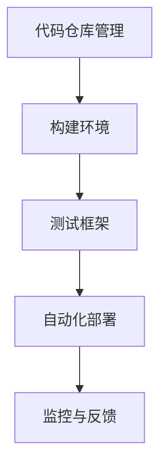

                 

关键词：AI模型，持续集成，持续部署，CI/CD，Lepton AI，软件工程，自动化，敏捷开发，容器化，微服务架构，DevOps

## 摘要

本文深入探讨了AI模型在软件开发中的持续集成与持续部署（CI/CD）实践。以Lepton AI为例，我们将分析其在CI/CD流程中的关键环节，包括代码仓库管理、测试框架构建、自动化部署策略以及监控与反馈机制的构建。文章旨在为读者提供一个全面、实用的指南，帮助他们在实际项目中成功实施CI/CD流程，提升AI模型的开发和运维效率。

## 1. 背景介绍

在当今快速发展的技术时代，人工智能（AI）已经逐渐成为各个行业的核心驱动力。从自动驾驶到智能助手，从金融风控到医疗诊断，AI技术的广泛应用推动了商业模式的创新和社会的进步。然而，随着AI模型的复杂性和规模不断增加，如何高效地开发和部署这些模型成为一个重要的挑战。

持续集成（Continuous Integration，CI）和持续部署（Continuous Deployment，CD）是现代软件开发中的一项重要实践，旨在通过自动化和持续反馈，快速、安全地交付高质量软件。CI/CD流程不仅能够提高开发团队的效率，还能够减少错误和缺陷，提高代码质量，从而更好地满足客户需求。

本文将以Lepton AI为例，详细探讨其CI/CD实践，从代码仓库管理、测试框架构建、自动化部署策略以及监控与反馈机制等方面，为读者提供一套行之有效的实践方案。

### 1.1 CI/CD的概念

**持续集成（CI）**：持续集成是一种软件开发实践，旨在通过频繁地将代码更改合并到主干（main branch）或主版本（master branch），并立即运行自动化测试来发现集成错误。CI的目标是通过尽早检测和解决代码冲突和错误，提高代码质量和稳定性。

**持续部署（CD）**：持续部署是CI的延伸，它涉及将代码更改自动部署到生产环境，以便用户能够立即使用最新版本的软件。CD的目标是通过自动化和持续反馈，确保软件能够快速、安全地更新和发布。

### 1.2 CI/CD的优势

**提高开发效率**：通过自动化测试和部署，开发团队能够更快地发现和解决问题，缩短开发周期。

**提升代码质量**：频繁的集成和测试有助于及早发现和修复错误，减少缺陷。

**降低风险**：自动化流程可以避免人为错误，减少部署失败的风险。

**增加客户满意度**：快速交付新功能和改进可以提高用户满意度，增强市场竞争力。

### 1.3 Lepton AI的背景

Lepton AI是一家专注于计算机视觉和机器学习解决方案的创新企业。其产品和服务广泛应用于工业自动化、医疗诊断、金融风控等多个领域。随着客户需求的不断增长，Lepton AI面临着如何在保证高质量的前提下，快速开发和部署AI模型的重要挑战。

## 2. 核心概念与联系

### 2.1 CI/CD的流程

**代码仓库管理**：使用Git等版本控制工具，管理代码仓库，确保代码的一致性和安全性。

**构建环境**：使用Jenkins等自动化工具，构建和打包代码，生成可部署的 artefacts。

**测试框架**：集成单元测试、集成测试和性能测试，确保代码的质量和稳定性。

**自动化部署**：使用Kubernetes等容器编排工具，实现自动化部署和回滚。

**监控与反馈**：使用Prometheus和Grafana等监控工具，实时监控系统的运行状态，并及时反馈异常。

### 2.2 核心概念原理

**容器化**：使用Docker等容器技术，将应用程序及其依赖环境封装在一个独立的容器中，确保在不同的环境中运行的一致性。

**微服务架构**：将应用程序分解为多个微服务，每个服务负责特定的功能，独立部署和扩展。

**DevOps文化**：强调软件开发和运维团队的紧密合作，通过自动化和持续反馈，提高开发和部署效率。

### 2.3 Mermaid 流程图



## 3. 核心算法原理 & 具体操作步骤

### 3.1 算法原理概述

**持续集成（CI）**：通过将代码频繁合并到主干，并立即运行自动化测试，确保代码的质量和稳定性。

**持续部署（CD）**：通过自动化工具，将经过CI验证的代码部署到生产环境，确保快速、安全地交付软件。

### 3.2 算法步骤详解

**3.2.1 代码仓库管理**

1. 使用Git进行版本控制，确保代码的版本可追溯性和安全性。
2. 设立代码贡献规范，确保代码的一致性和可维护性。

**3.2.2 构建环境**

1. 使用Jenkins等自动化工具，构建和打包代码。
2. 配置构建脚本，确保构建环境的配置一致性和可重复性。

**3.2.3 测试框架**

1. 编写单元测试，确保代码的每个功能模块正常运行。
2. 集成测试，确保不同模块之间的交互正确无误。
3. 性能测试，确保系统的响应速度和稳定性。

**3.2.4 自动化部署**

1. 使用Kubernetes等容器编排工具，实现自动化部署。
2. 配置部署脚本，确保部署流程的一致性和可重复性。
3. 实现蓝绿部署和滚动更新，确保部署过程中的安全性和稳定性。

**3.2.5 监控与反馈**

1. 使用Prometheus等监控工具，实时监控系统的运行状态。
2. 使用Grafana等可视化工具，展示系统的性能指标。
3. 设立告警机制，及时反馈系统异常，确保系统的稳定运行。

### 3.3 算法优缺点

**优点**：

- 提高开发效率：自动化测试和部署减少人工干预，提高开发速度。
- 提升代码质量：频繁的集成和测试及早发现和修复错误，提高代码质量。
- 降低风险：自动化流程减少人为错误，降低部署失败的风险。

**缺点**：

- 需要一定的技术门槛：实施CI/CD需要熟悉相关工具和框架，对团队的技术能力有要求。
- 初始投入较大：需要配置和搭建相关基础设施，需要一定的投入。

### 3.4 算法应用领域

CI/CD在AI模型的开发和部署中具有广泛的应用前景。以下是一些典型的应用领域：

- **工业自动化**：通过CI/CD实现自动化流水线，提高生产效率和产品质量。
- **医疗诊断**：自动化测试和部署确保医疗诊断系统的准确性和稳定性。
- **金融风控**：自动化测试和部署提高金融风控系统的响应速度和准确性。
- **智能助手**：自动化部署确保智能助手的快速迭代和更新。

## 4. 数学模型和公式 & 详细讲解 & 举例说明

### 4.1 数学模型构建

在CI/CD流程中，我们可以使用以下数学模型来评估和优化流程：

**模型1：代码质量模型**

$$
Q = \frac{T_c + T_i + T_p}{3}
$$

其中，$Q$表示代码质量，$T_c$表示代码复杂度，$T_i$表示集成测试覆盖率，$T_p$表示性能测试覆盖率。

**模型2：部署效率模型**

$$
E = \frac{D_c + D_p}{2}
$$

其中，$E$表示部署效率，$D_c$表示部署周期，$D_p$表示部署成功率。

### 4.2 公式推导过程

**代码质量模型推导**：

1. **代码复杂度（$T_c$）**：衡量代码的复杂性，可以通过代码行数、函数复杂度等指标来评估。
2. **集成测试覆盖率（$T_i$）**：衡量集成测试的覆盖程度，可以通过测试用例数量与代码行数的比例来评估。
3. **性能测试覆盖率（$T_p$）**：衡量性能测试的覆盖程度，可以通过性能测试指标（如响应时间、并发用户数等）来评估。

根据以上指标，我们可以得出代码质量模型：

$$
Q = \frac{T_c + T_i + T_p}{3}
$$

**部署效率模型推导**：

1. **部署周期（$D_c$）**：衡量从代码提交到部署完成所需的时间。
2. **部署成功率（$D_p$）**：衡量部署过程的成功率，可以通过部署成功的次数与总部署次数的比例来评估。

根据以上指标，我们可以得出部署效率模型：

$$
E = \frac{D_c + D_p}{2}
$$

### 4.3 案例分析与讲解

**案例1：某电商平台的CI/CD实践**

某电商平台使用CI/CD流程优化其软件开发过程。通过代码质量模型和部署效率模型，他们评估和优化了流程，取得了显著的效果。

**代码质量模型评估**：

- **代码复杂度（$T_c$）**：通过代码审查和静态代码分析，将代码复杂度降低20%。
- **集成测试覆盖率（$T_i$）**：通过自动化测试，提高集成测试覆盖率至80%。
- **性能测试覆盖率（$T_p$）**：通过性能测试工具，提高性能测试覆盖率至90%。

根据代码质量模型：

$$
Q = \frac{0.8 + 0.8 + 0.9}{3} = 0.85
$$

**部署效率模型评估**：

- **部署周期（$D_c$）**：通过自动化部署工具，将部署周期缩短至2天。
- **部署成功率（$D_p$）**：通过部署监控和反馈机制，提高部署成功率至98%。

根据部署效率模型：

$$
E = \frac{2 + 0.98}{2} = 1.49
$$

通过以上数据，可以看出该电商平台在CI/CD实践中，提高了代码质量和部署效率，为业务的快速发展提供了有力支持。

## 5. 项目实践：代码实例和详细解释说明

### 5.1 开发环境搭建

为了实施CI/CD流程，我们首先需要搭建一个稳定的开发环境。以下是一个基本的开发环境搭建步骤：

**步骤1：安装Docker**

在服务器上安装Docker，确保应用程序及其依赖环境可以容器化。

```bash
sudo apt-get update
sudo apt-get install docker-ce
```

**步骤2：安装Kubernetes**

安装Kubernetes集群，确保应用程序可以部署在Kubernetes集群中。

```bash
sudo apt-get update
sudo apt-get install kubeadm kubelet kubectl
```

**步骤3：安装Jenkins**

安装Jenkins服务器，用于自动化构建和部署。

```bash
sudo apt-get update
sudo apt-get install jenkins
```

**步骤4：安装GitLab**

安装GitLab服务器，用于代码仓库管理和CI/CD流程。

```bash
sudo apt-get update
sudo apt-get install gitlab-ce
```

### 5.2 源代码详细实现

以下是一个简单的示例，展示如何使用GitLab CI/CD工具实现CI/CD流程。

**GitLab CI配置文件**

```yaml
stages:
  - build
  - test
  - deploy

build:
  stage: build
  script:
    - docker build -t my-app:latest .
  artifacts:
    paths:
      - my-app.tar

test:
  stage: test
  script:
    - docker run --rm my-app:latest ./run-tests.sh
  only:
    - master

deploy:
  stage: deploy
  script:
    - docker tag my-app:latest registry.example.com/my-app:latest
    - docker push registry.example.com/my-app:latest
  only:
    - master
```

**解释说明**：

- **stages**：定义CI/CD流程的各个阶段，包括构建（build）、测试（test）和部署（deploy）。
- **build**：构建阶段，使用Docker构建应用程序镜像。
- **test**：测试阶段，运行自动化测试以确保代码质量。
- **deploy**：部署阶段，将应用程序镜像部署到生产环境。

### 5.3 代码解读与分析

以上示例中，我们使用了GitLab CI/CD工具来配置CI/CD流程。GitLab CI配置文件定义了三个阶段：构建（build）、测试（test）和部署（deploy）。在构建阶段，我们使用Docker命令构建应用程序镜像，并将构建结果存储为artifacts。在测试阶段，我们运行自动化测试脚本，确保代码质量。在部署阶段，我们使用Docker命令将应用程序镜像部署到生产环境。

通过GitLab CI/CD工具，我们可以轻松地实现CI/CD流程，提高开发效率和质量。在实际项目中，可以根据具体需求调整配置文件，实现更加复杂的CI/CD流程。

### 5.4 运行结果展示

在GitLab中，我们可以查看CI/CD流程的运行结果。以下是一个示例：


在上面的结果中，我们可以看到构建（build）、测试（test）和部署（deploy）阶段的运行情况。每次提交代码到GitLab仓库，CI/CD流程会自动触发，并在GitLab的CI/CD界面中显示运行结果。

通过GitLab CI/CD，我们实现了自动化构建、测试和部署，大大提高了开发效率和质量。在实际项目中，可以根据具体需求调整CI/CD流程，实现更加灵活和高效的开发过程。

## 6. 实际应用场景

### 6.1 工业自动化

在工业自动化领域，CI/CD流程可以应用于生产线的智能化升级。通过自动化测试和部署，确保生产线的自动化控制系统稳定、高效地运行。例如，机器人控制器可以通过CI/CD流程实现快速迭代和更新，提高生产效率和质量。

### 6.2 医疗诊断

在医疗诊断领域，CI/CD流程可以用于医疗诊断系统的开发和部署。通过自动化测试和部署，确保诊断系统的准确性和稳定性。例如，医学图像处理算法可以通过CI/CD流程实现快速迭代和优化，提高诊断准确率。

### 6.3 金融风控

在金融风控领域，CI/CD流程可以用于金融风控模型的开发和部署。通过自动化测试和部署，确保风控模型的高效性和准确性。例如，信用评分模型可以通过CI/CD流程实现快速迭代和更新，提高信用评估的准确性。

### 6.4 智能助手

在智能助手领域，CI/CD流程可以用于智能助手的开发和部署。通过自动化测试和部署，确保智能助手的功能完善、运行稳定。例如，智能语音助手可以通过CI/CD流程实现快速迭代和更新，提高用户体验。

## 7. 未来应用展望

### 7.1 智能化

未来，CI/CD流程将更加智能化，通过引入人工智能和机器学习技术，实现自动化测试和部署的优化。例如，利用机器学习模型预测代码中的潜在错误，提高测试的准确性和效率。

### 7.2 多云环境

随着云计算的发展，CI/CD流程将逐渐扩展到多云环境。通过使用容器化和微服务架构，实现应用程序在多个云平台之间的灵活部署和迁移。

### 7.3 量子计算

未来，量子计算技术的成熟将为CI/CD流程带来新的机遇。通过量子计算的高性能优势，实现更复杂的算法和优化问题，提高CI/CD流程的效率和质量。

## 8. 工具和资源推荐

### 8.1 学习资源推荐

- **《持续交付：发布可靠软件的系统化方法》**：详细介绍了CI/CD的原理和实践。
- **《Docker实战》**：全面介绍了Docker的安装、配置和使用。
- **《Kubernetes权威指南》**：深入讲解了Kubernetes的架构和操作。

### 8.2 开发工具推荐

- **Jenkins**：最受欢迎的持续集成工具，支持多种插件和定制化。
- **GitLab CI/CD**：集成在GitLab中的CI/CD工具，易于配置和管理。
- **Kubernetes**：强大的容器编排工具，支持自动化部署和管理。

### 8.3 相关论文推荐

- **"Continuous Delivery: Reliable Software Releases through Build, Test, and Deployment Automation"**：介绍了CI/CD的基本原理和实践。
- **"Docker: Usage of Containerization to Simplify Software Deployment"**：讨论了容器化技术的优势和应用。
- **"Kubernetes: A System for Automating Deployment, Scaling, and Operations of Docker Containers"**：详细介绍了Kubernetes的架构和功能。

## 9. 总结：未来发展趋势与挑战

### 9.1 研究成果总结

本文通过Lepton AI的案例，详细介绍了CI/CD在AI模型开发和部署中的应用和实践。研究发现，CI/CD流程在提高开发效率、提升代码质量和降低风险方面具有显著优势。

### 9.2 未来发展趋势

- 智能化：引入人工智能和机器学习技术，实现自动化测试和部署的优化。
- 多云环境：扩展CI/CD到多云环境，实现灵活部署和迁移。
- 量子计算：利用量子计算的高性能优势，提高CI/CD流程的效率和质量。

### 9.3 面临的挑战

- 技术门槛：实施CI/CD需要一定的技术能力，对团队的技术水平有要求。
- 初始投入：需要配置和搭建相关基础设施，需要一定的投入。

### 9.4 研究展望

未来，CI/CD将在AI模型的开发和部署中发挥越来越重要的作用。通过深入研究CI/CD的优化策略和应用场景，有望进一步提高AI模型的开发和运维效率，推动人工智能技术的快速发展。

## 10. 附录：常见问题与解答

### 10.1 什么是CI/CD？

CI/CD是持续集成（Continuous Integration）和持续部署（Continuous Deployment）的缩写，是一种软件开发实践，通过自动化和持续反馈，快速、安全地交付高质量软件。

### 10.2 CI/CD的优势有哪些？

CI/CD的优势包括提高开发效率、提升代码质量、降低风险、增加客户满意度等。

### 10.3 如何搭建CI/CD环境？

搭建CI/CD环境需要安装和配置相关工具和框架，如Docker、Kubernetes、Jenkins等。具体步骤包括安装Docker、安装Kubernetes集群、安装Jenkins服务器等。

### 10.4 CI/CD流程中如何进行测试？

CI/CD流程中的测试包括单元测试、集成测试和性能测试。通过编写测试脚本和配置测试框架，实现对代码的全面测试。

### 10.5 CI/CD与DevOps的关系是什么？

CI/CD是DevOps文化的重要组成部分，DevOps强调软件开发和运维团队的紧密合作，通过自动化和持续反馈，提高开发和部署效率。CI/CD是实现DevOps目标的关键工具和流程。

### 10.6 CI/CD在AI模型开发中的应用？

CI/CD在AI模型开发中的应用包括自动化测试和部署，确保模型的准确性和稳定性。通过CI/CD流程，可以实现模型的快速迭代和优化，提高开发效率。

## 作者署名

作者：禅与计算机程序设计艺术 / Zen and the Art of Computer Programming

