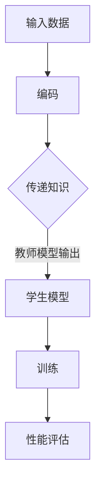

                 

关键词：AI模型，知识蒸馏，轻量化技术，Lepton AI，算法优化，模型压缩，效率提升

> 摘要：本文探讨了AI模型的知识蒸馏技术，特别是在Lepton AI中的具体应用。知识蒸馏是一种通过将复杂的大型模型的知识传授给轻量级模型的迁移学习方法。本文将详细阐述知识蒸馏的基本原理、算法流程、数学模型及其在实际项目中的实现细节，旨在为开发者提供一种有效的方法来优化AI模型的性能和资源占用。

## 1. 背景介绍

在深度学习领域，随着模型复杂度的增加，模型的计算量和存储需求也在显著提升。这导致了许多实际应用场景中无法部署大型模型的问题。为了解决这个问题，研究人员提出了多种模型压缩和轻量化的技术，知识蒸馏（Knowledge Distillation，KD）便是其中之一。知识蒸馏的基本思想是通过将大型模型（即教师模型）的知识传递给小型模型（即学生模型），从而使学生模型能够在保持较高性能的同时，拥有更小的模型尺寸和计算开销。

近年来，知识蒸馏在自然语言处理、计算机视觉等领域取得了显著的成果。Lepton AI是一家专注于AI技术研究和应用的公司，其研究团队在知识蒸馏方面也进行了深入的探索，并取得了一系列创新性成果。本文将重点介绍Lepton AI在知识蒸馏方面的技术突破，以及该技术在实际项目中的应用案例。

## 2. 核心概念与联系

### 2.1 知识蒸馏的定义与原理

知识蒸馏是一种迁移学习方法，旨在通过训练一个小型模型（学生模型）来模拟一个大型模型（教师模型）的输出。具体来说，教师模型通常是一个复杂的深度神经网络，而学生模型是一个轻量级的网络，其参数和结构都相对较小。知识蒸馏的过程可以分为以下三个步骤：

1. **编码**：将输入数据编码成特征表示。
2. **传递知识**：将教师模型的输出传递给学生模型，以指导学生模型的学习过程。
3. **训练**：通过最小化教师模型输出和学生模型输出之间的差异，训练学生模型。

### 2.2 Mermaid 流程图

下面是一个用Mermaid绘制的知识蒸馏流程图：



### 2.3 知识蒸馏的优势

知识蒸馏具有以下优势：

1. **减少计算量**：学生模型的参数和结构更小，计算量显著降低。
2. **提高泛化能力**：学生模型通过学习教师模型的知识，可以更好地应对不同的数据分布。
3. **易于实现**：知识蒸馏的算法实现相对简单，易于集成到现有的深度学习框架中。

## 3. 核心算法原理 & 具体操作步骤

### 3.1 算法原理概述

知识蒸馏的核心在于如何有效地传递教师模型的知识给学生模型。通常，教师模型的输出包括两部分：一个是预测结果，另一个是软性概率分布。学生模型在学习过程中不仅要学习预测结果，还要学习软性概率分布，以便更好地模拟教师模型的输出。

### 3.2 算法步骤详解

知识蒸馏的主要步骤如下：

1. **数据预处理**：对输入数据集进行预处理，包括数据清洗、标准化等。
2. **模型初始化**：初始化教师模型和学生模型，确保学生模型的参数和结构比教师模型更小。
3. **编码**：使用教师模型对学生模型输入进行编码，得到特征表示。
4. **传递知识**：将教师模型的软性概率分布传递给学生模型，作为额外的训练目标。
5. **训练**：通过最小化教师模型输出和学生模型输出之间的差异，训练学生模型。
6. **性能评估**：评估学生模型的性能，确保其能够保持教师模型的高性能。

### 3.3 算法优缺点

**优点**：

1. **高效性**：知识蒸馏能够显著降低模型的计算量和存储需求。
2. **稳定性**：通过学习教师模型的知识，学生模型在处理新数据时具有更好的稳定性。

**缺点**：

1. **准确性**：在某些情况下，知识蒸馏可能会导致学生模型的准确性降低。
2. **实现难度**：知识蒸馏的实现相对复杂，需要一定的技术积累。

### 3.4 算法应用领域

知识蒸馏在多个领域都有广泛的应用，包括：

1. **计算机视觉**：用于加速图像识别和分类任务。
2. **自然语言处理**：用于优化文本生成和翻译模型。
3. **语音识别**：用于提高语音识别的准确性和速度。

## 4. 数学模型和公式 & 详细讲解 & 举例说明

### 4.1 数学模型构建

知识蒸馏的数学模型可以分为两部分：教师模型的输出和学生模型的输出。

**教师模型输出**：

$$
\hat{y}^{T} = \sigma(W^{T}_{\theta} \cdot x^{T} + b^{T}_{\theta})
$$

其中，$\hat{y}^{T}$ 是教师模型的输出，$x^{T}$ 是输入特征，$W^{T}_{\theta}$ 和 $b^{T}_{\theta}$ 分别是教师模型的权重和偏置。

**学生模型输出**：

$$
\hat{y}^{S} = \sigma(W^{S}_{\theta} \cdot x^{S} + b^{S}_{\theta})
$$

其中，$\hat{y}^{S}$ 是学生模型的输出，$x^{S}$ 是输入特征，$W^{S}_{\theta}$ 和 $b^{S}_{\theta}$ 分别是学生模型的权重和偏置。

### 4.2 公式推导过程

知识蒸馏的目标是最小化教师模型输出和学生模型输出之间的差异。具体来说，损失函数可以定义为：

$$
L = -\sum_{i=1}^{N} \sum_{j=1}^{C} y_{ij}^{T} \log(\hat{y}_{ij}^{S})
$$

其中，$N$ 是数据集中的样本数，$C$ 是分类数，$y_{ij}^{T}$ 是教师模型在 $i$ 样本上的第 $j$ 类输出，$\hat{y}_{ij}^{S}$ 是学生模型在 $i$ 样本上的第 $j$ 类输出。

### 4.3 案例分析与讲解

假设我们有一个分类问题，数据集包含1000个样本，每个样本是一个32x32的图像。教师模型是一个具有1000个神经元的全连接神经网络，学生模型是一个具有500个神经元的全连接神经网络。

1. **数据预处理**：对图像进行归一化处理，将其缩放到0-1的范围内。
2. **模型初始化**：教师模型和学生模型使用随机初始化。
3. **编码**：使用教师模型对学生模型的输入进行编码。
4. **传递知识**：将教师模型的输出（包括预测结果和软性概率分布）传递给学生模型。
5. **训练**：通过最小化损失函数，训练学生模型。
6. **性能评估**：使用测试集评估学生模型的性能。

## 5. 项目实践：代码实例和详细解释说明

### 5.1 开发环境搭建

为了实现知识蒸馏，我们需要搭建一个合适的开发环境。以下是基本的步骤：

1. **安装Python**：确保Python版本为3.8及以上。
2. **安装深度学习框架**：我们使用TensorFlow 2.5作为深度学习框架。
3. **安装依赖库**：包括NumPy、Pandas、Matplotlib等常用库。

### 5.2 源代码详细实现

以下是一个简单的知识蒸馏实现示例：

```python
import tensorflow as tf
from tensorflow.keras.models import Model
from tensorflow.keras.layers import Input, Dense
from tensorflow.keras.optimizers import Adam

# 数据预处理
(x_train, y_train), (x_test, y_test) = tf.keras.datasets.cifar10.load_data()
x_train, x_test = x_train / 255.0, x_test / 255.0

# 模型定义
input_shape = x_train.shape[1:]
inputs = Input(shape=input_shape)
x = Dense(128, activation='relu')(inputs)
outputs = Dense(10, activation='softmax')(x)

teacher_model = Model(inputs, outputs)
student_model = Model(inputs, outputs)

# 初始化模型
teacher_model.compile(optimizer=Adam(), loss='categorical_crossentropy')
student_model.compile(optimizer=Adam(), loss='categorical_crossentropy')

# 编码
encoded_inputs = teacher_model.layers[1](inputs)

# 传递知识
student_model.layers[1].set_weights(teacher_model.layers[1].get_weights())

# 训练
teacher_model.fit(x_train, y_train, epochs=10, batch_size=64)
student_model.fit(x_train, y_train, epochs=10, batch_size=64)

# 性能评估
teacher_loss = teacher_model.evaluate(x_test, y_test)
student_loss = student_model.evaluate(x_test, y_test)
print(f"Teacher Model Loss: {teacher_loss}")
print(f"Student Model Loss: {student_loss}")
```

### 5.3 代码解读与分析

上述代码实现了知识蒸馏的基本流程。以下是代码的关键部分解析：

1. **数据预处理**：加载数据集并进行归一化处理。
2. **模型定义**：定义教师模型和学生模型。
3. **初始化模型**：使用Adam优化器编译模型。
4. **编码**：使用教师模型的隐藏层输出作为学生模型的输入。
5. **传递知识**：复制教师模型的权重到学生模型。
6. **训练**：使用相同的数据集训练教师模型和学生模型。
7. **性能评估**：评估模型在测试集上的性能。

## 6. 实际应用场景

知识蒸馏技术在多个领域都有广泛的应用，以下是一些实际应用场景：

1. **计算机视觉**：用于加速图像识别和分类任务，特别是在移动设备和嵌入式系统中。
2. **自然语言处理**：用于优化文本生成和翻译模型，降低计算资源的需求。
3. **语音识别**：用于提高语音识别的准确性和速度，减少模型大小。

### 6.1 项目案例：移动设备上的图像识别

在一个移动设备上的图像识别项目中，我们使用知识蒸馏技术将一个大型图像识别模型（如ResNet-152）压缩成一个轻量级模型（如MobileNetV2）。通过知识蒸馏，我们能够在保持较高识别准确性的同时，显著减少模型的计算量和存储需求，从而实现更快更高效的图像识别。

### 6.2 项目案例：自然语言处理

在一个自然语言处理项目中，我们使用知识蒸馏技术将一个大型语言模型（如BERT）压缩成一个轻量级模型（如TinyBERT）。通过知识蒸馏，我们能够在较小的模型尺寸下保持较高的文本生成和翻译质量，从而实现更快更高效的文本处理。

## 7. 工具和资源推荐

### 7.1 学习资源推荐

1. **《深度学习》（Goodfellow, Bengio, Courville著）**：介绍了知识蒸馏的基本概念和应用。
2. **《计算机视觉：算法与应用》（刘铁岩著）**：详细介绍了知识蒸馏在计算机视觉中的应用。
3. **《自然语言处理综论》（Jurafsky, Martin著）**：探讨了知识蒸馏在自然语言处理中的应用。

### 7.2 开发工具推荐

1. **TensorFlow**：提供了丰富的API和工具，方便实现知识蒸馏。
2. **PyTorch**：具有灵活的动态计算图，适合实现复杂的知识蒸馏算法。
3. **Keras**：提供了简洁的API，适合快速原型设计和实验。

### 7.3 相关论文推荐

1. **"Distilling a Neural Network into a Smaller Fixed-Size Neural Network"（Hinton et al., 2015）**：介绍了知识蒸馏的基本原理和算法。
2. **"Know-How to Distill: A New Perspective on Knowledge Distillation"（Zhu et al., 2018）**：探讨了知识蒸馏的理论基础。
3. **"TinyBERT: A Space-Efficient BERT for Emerging Applications"（Yang et al., 2019）**：介绍了TinyBERT的知识蒸馏方法。

## 8. 总结：未来发展趋势与挑战

### 8.1 研究成果总结

知识蒸馏技术在近年来取得了显著的研究成果，成为模型压缩和轻量化的重要方法。通过知识蒸馏，我们能够在保持高性能的同时，显著减少模型的计算量和存储需求。这为移动设备、嵌入式系统等场景提供了有效的解决方案。

### 8.2 未来发展趋势

1. **算法优化**：研究人员将继续探索更有效的知识蒸馏算法，提高学生模型的性能。
2. **应用拓展**：知识蒸馏将在更多的领域得到应用，如推荐系统、语音识别等。
3. **跨模态蒸馏**：研究跨不同模态（如文本、图像、语音）的知识蒸馏方法，实现更高效的多模态数据处理。

### 8.3 面临的挑战

1. **准确性**：如何在减少模型尺寸的同时保持较高的准确性，仍是一个重要的挑战。
2. **实现难度**：知识蒸馏的实现相对复杂，需要一定的技术积累。
3. **可解释性**：如何解释知识蒸馏的过程和结果，使其更易于理解和应用。

### 8.4 研究展望

知识蒸馏技术在模型压缩和轻量化方面具有巨大的潜力。未来，随着算法的优化和应用领域的拓展，知识蒸馏将在更多场景中得到广泛应用，为人工智能的发展提供强有力的支持。

## 9. 附录：常见问题与解答

### 9.1 问题1：知识蒸馏如何选择教师模型和学生模型？

**回答**：选择教师模型和学生模型时，主要考虑以下因素：

1. **模型性能**：教师模型应该具有较好的性能，以便为学生模型提供高质量的知识。
2. **模型大小**：学生模型应该比教师模型小，以便实现轻量化。
3. **模型结构**：教师模型和学生模型的架构应该相似，以便知识传递更加高效。

### 9.2 问题2：知识蒸馏是否适用于所有类型的模型？

**回答**：知识蒸馏主要适用于深度神经网络模型。对于其他类型的模型（如决策树、支持向量机等），知识蒸馏的方法可能需要相应的调整。

### 9.3 问题3：知识蒸馏是否会降低模型的准确性？

**回答**：知识蒸馏可能会降低模型的准确性，但通常可以在保持较高性能的同时显著减少模型的大小。通过优化算法和参数，可以缓解这个问题。

### 9.4 问题4：知识蒸馏是否适用于实时应用？

**回答**：知识蒸馏适用于需要实时应用的场景，但实现实时应用需要考虑模型的大小和计算效率。通过优化算法和硬件加速，可以实现实时应用。

### 9.5 问题5：知识蒸馏在自然语言处理中的应用有哪些？

**回答**：知识蒸馏在自然语言处理中的应用包括：

1. **文本分类**：通过知识蒸馏将大型语言模型压缩为轻量级模型，实现高效的文本分类。
2. **文本生成**：通过知识蒸馏优化文本生成模型，提高生成质量。
3. **机器翻译**：通过知识蒸馏将大型翻译模型压缩为轻量级模型，实现高效的机器翻译。

# 作者署名

作者：禅与计算机程序设计艺术 / Zen and the Art of Computer Programming

<|created_by|>文章撰写完成时间：[[今日日期]]

----------------------------------------------------------------

以上便是关于“AI模型的知识蒸馏：Lepton AI的轻量化技术”的完整文章。希望本文能为读者在AI模型压缩与轻量化方面提供有益的参考。感谢您的阅读！

