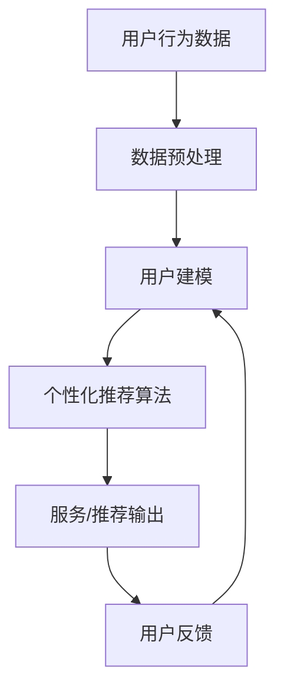
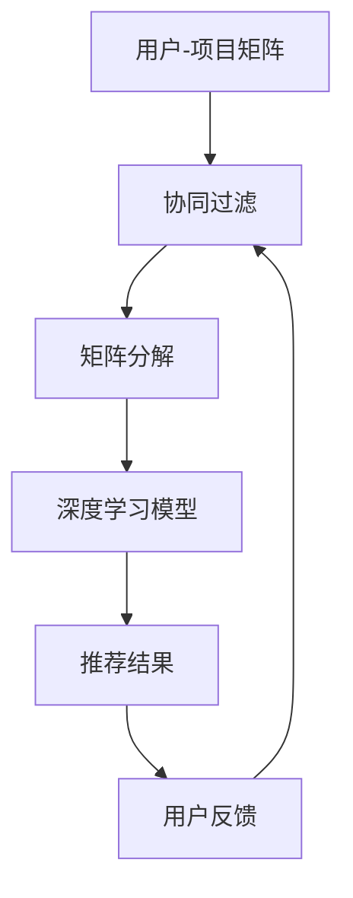
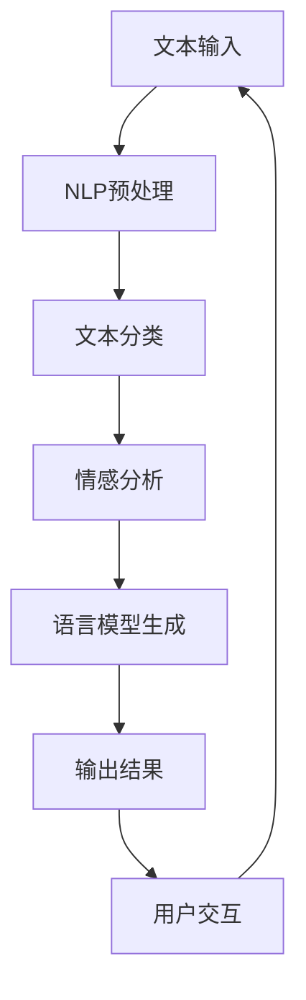
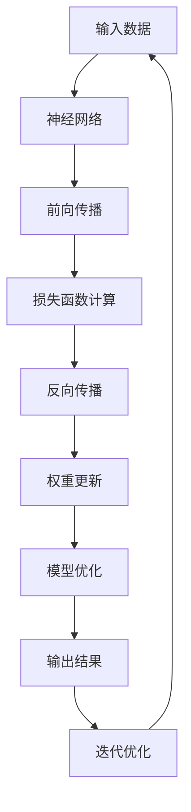

                 

关键词：人工智能，用户需求，个性化服务，推荐系统，自然语言处理，深度学习，机器学习，算法优化，技术应用，案例研究，未来展望

> 摘要：随着人工智能技术的快速发展，AI在满足用户需求方面展现出了巨大的潜力。本文旨在探讨多种AI技术如何被应用于理解、分析和满足用户需求，并提供一个全面的技术框架，以期为开发者、研究者和决策者提供指导。

## 1. 背景介绍

近年来，人工智能（AI）技术的飞速发展，不仅深刻影响了计算机科学领域，也极大地改变了我们的日常生活。从语音助手到自动驾驶汽车，从个性化推荐系统到智能医疗诊断，AI技术在多个领域展现了其独特的优势。然而，随着AI技术的不断进步，如何有效利用这些技术来满足用户的多样化需求，成为一个亟待解决的问题。

用户需求的多样性和变化性给AI系统带来了巨大的挑战。传统的开发方法往往依赖于预定义的规则和固定的算法，无法灵活应对不断变化的用户需求。而AI技术，特别是机器学习和深度学习，提供了强大的数据驱动方法，使得系统能够自我学习、自我优化，从而更好地满足用户的需求。

本文将深入探讨AI技术如何在多个方面满足用户需求，包括个性化服务、推荐系统、自然语言处理和深度学习等。通过分析这些技术的核心原理和应用案例，希望能够为读者提供一个全面的视角，以了解AI技术在满足用户需求方面的潜力和挑战。

## 2. 核心概念与联系

### 2.1 个性化服务

个性化服务是AI技术的一个重要应用方向，它通过分析用户的行为数据、偏好和历史记录，提供定制化的服务和推荐。核心概念包括用户建模、数据挖掘和机器学习算法。

#### Mermaid 流程图



### 2.2 推荐系统

推荐系统是AI技术中的另一个重要应用领域，它利用历史数据和用户行为模式，为用户提供个性化的内容推荐。核心概念包括协同过滤、矩阵分解和深度学习。

#### Mermaid 流程图



### 2.3 自然语言处理

自然语言处理（NLP）是AI技术的一个重要分支，它致力于使计算机能够理解和处理自然语言。核心概念包括文本分类、情感分析和语言模型。

#### Mermaid 流程图



### 2.4 深度学习

深度学习是AI技术的另一个重要组成部分，它通过多层神经网络进行数据建模和特征提取。核心概念包括神经网络架构、反向传播算法和优化方法。

#### Mermaid 流程图



## 3. 核心算法原理 & 具体操作步骤

### 3.1 算法原理概述

AI满足用户需求的核心在于其自我学习和自我优化的能力。以下将介绍几种主要的AI算法原理，并探讨其在用户需求满足中的应用。

#### 3.1.1 个性化服务算法

个性化服务算法主要基于机器学习和深度学习技术，通过用户行为数据建立用户画像，进而提供个性化的推荐和服务。关键步骤包括数据收集、特征提取和模型训练。

#### 3.1.2 推荐系统算法

推荐系统算法通过协同过滤、矩阵分解和深度学习等技术，从用户历史行为和内容特征中提取关联关系，为用户提供个性化的推荐。关键步骤包括数据预处理、模型选择和推荐结果生成。

#### 3.1.3 自然语言处理算法

自然语言处理算法通过文本分类、情感分析和语言模型等技术，使计算机能够理解和处理自然语言。关键步骤包括文本预处理、特征提取和模型训练。

#### 3.1.4 深度学习算法

深度学习算法通过多层神经网络进行数据建模和特征提取，实现复杂的函数映射。关键步骤包括神经网络架构设计、前向传播和反向传播。

### 3.2 算法步骤详解

#### 3.2.1 个性化服务算法步骤

1. 数据收集：收集用户的行为数据、偏好和历史记录。
2. 特征提取：对用户数据进行预处理和特征提取，构建用户画像。
3. 模型训练：使用机器学习或深度学习算法训练个性化推荐模型。
4. 推荐输出：根据用户画像和模型预测，生成个性化的推荐和服务。

#### 3.2.2 推荐系统算法步骤

1. 数据预处理：对用户-项目矩阵进行清洗和处理，去除噪声数据。
2. 模型选择：根据推荐任务选择合适的推荐算法，如协同过滤或深度学习。
3. 模型训练：使用训练数据训练推荐模型。
4. 推荐结果生成：根据模型预测和用户偏好，生成个性化的推荐结果。

#### 3.2.3 自然语言处理算法步骤

1. 文本预处理：对文本进行分词、去停用词和词性标注等处理。
2. 特征提取：提取文本的特征，如词频、词嵌入等。
3. 模型训练：使用训练数据训练NLP模型。
4. 输出结果生成：根据模型预测，生成文本分类、情感分析或语言模型结果。

#### 3.2.4 深度学习算法步骤

1. 神经网络架构设计：设计合适的神经网络架构，如卷积神经网络（CNN）或循环神经网络（RNN）。
2. 前向传播：输入数据通过神经网络进行前向传播，计算输出。
3. 损失函数计算：计算预测输出与真实标签之间的误差，计算损失函数。
4. 反向传播：通过反向传播更新神经网络权重，优化模型。
5. 模型优化：根据优化目标调整模型参数，提高模型性能。

### 3.3 算法优缺点

#### 3.3.1 个性化服务算法

优点：能够提供高度个性化的服务和推荐，提升用户体验。

缺点：数据依赖性强，易受到数据质量和噪声数据的影响。

#### 3.3.2 推荐系统算法

优点：能够根据用户历史行为和偏好进行推荐，提高推荐效果。

缺点：冷启动问题，对新用户和新项目的推荐效果较差。

#### 3.3.3 自然语言处理算法

优点：能够处理和理解自然语言，实现人机交互。

缺点：对文本质量和噪声敏感，处理复杂任务时效果有限。

#### 3.3.4 深度学习算法

优点：能够自动提取复杂特征，适应性强。

缺点：计算成本高，对数据量要求较大。

### 3.4 算法应用领域

#### 3.4.1 个性化服务

应用领域包括电子商务、社交媒体和在线娱乐等，通过个性化推荐提升用户体验和满意度。

#### 3.4.2 推荐系统

应用领域包括电影推荐、音乐推荐和商品推荐等，通过个性化推荐提升用户满意度和留存率。

#### 3.4.3 自然语言处理

应用领域包括搜索引擎、智能客服和机器翻译等，通过处理和理解自然语言提升用户体验和服务质量。

#### 3.4.4 深度学习

应用领域包括图像识别、语音识别和自动驾驶等，通过自动提取复杂特征实现智能感知和决策。

## 4. 数学模型和公式 & 详细讲解 & 举例说明

### 4.1 数学模型构建

在AI满足用户需求的多种方法中，数学模型构建是核心环节。以下将介绍几种常见的数学模型及其构建方法。

#### 4.1.1 个性化服务模型

个性化服务模型通常基于用户行为数据和偏好数据，构建用户画像和推荐模型。以下是一个简单的用户画像构建模型：

$$
\text{User\_Profile} = \text{Behavioral\_Data} \times \text{Preference\_Data}
$$

其中，$Behavioral\_Data$ 表示用户的历史行为数据，如点击、购买和浏览等；$Preference\_Data$ 表示用户的偏好数据，如用户评分和标签等。

#### 4.1.2 推荐系统模型

推荐系统模型通常基于用户-项目矩阵，通过协同过滤或深度学习技术进行建模。以下是一个简单的协同过滤模型：

$$
\text{Rating}_{ui} = \text{User\_Vector}_{u} \times \text{Item\_Vector}_{i} + \text{Bias}_{u} + \text{Bias}_{i} + \text{Noise}
$$

其中，$\text{Rating}_{ui}$ 表示用户 $u$ 对项目 $i$ 的评分预测；$\text{User\_Vector}_{u}$ 和 $\text{Item\_Vector}_{i}$ 分别表示用户 $u$ 和项目 $i$ 的特征向量；$\text{Bias}_{u}$ 和 $\text{Bias}_{i}$ 分别表示用户和项目的偏置；$Noise$ 表示随机噪声。

#### 4.1.3 自然语言处理模型

自然语言处理模型通常基于文本预处理和特征提取，构建文本分类、情感分析和语言模型。以下是一个简单的文本分类模型：

$$
\text{Class}_{j} = \text{Logistic\_Regression}(\text{Word\_Embedding}_{j} \times \text{Document}_{d} + \text{Bias})
$$

其中，$\text{Class}_{j}$ 表示文档 $d$ 属于类别 $j$ 的概率；$\text{Word\_Embedding}_{j}$ 表示单词 $j$ 的嵌入向量；$\text{Document}_{d}$ 表示文档 $d$ 的特征向量；$\text{Bias}$ 表示偏置。

### 4.2 公式推导过程

以下将介绍个性化服务模型的公式推导过程。

#### 4.2.1 用户画像构建

首先，对用户行为数据进行预处理和特征提取，得到用户的行为特征向量 $Behavioral\_Feature\_Vector$。

然后，对用户偏好数据进行预处理和特征提取，得到用户的偏好特征向量 $Preference\_Feature\_Vector$。

最后，将用户的行为特征向量和偏好特征向量进行加权求和，得到用户的综合特征向量 $User\_Profile$。

$$
\text{User\_Profile} = \text{Behavioral\_Feature\_Vector} \times \text{Preference\_Feature\_Vector}
$$

#### 4.2.2 推荐模型构建

首先，对用户-项目矩阵进行降维处理，得到用户和项目的低维特征向量。

然后，构建线性回归模型，预测用户对项目的评分。

$$
\text{Rating}_{ui} = \text{User\_Vector}_{u} \times \text{Item\_Vector}_{i} + \text{Bias}_{u} + \text{Bias}_{i} + \text{Noise}
$$

其中，$\text{User\_Vector}_{u}$ 和 $\text{Item\_Vector}_{i}$ 分别表示用户 $u$ 和项目 $i$ 的低维特征向量；$\text{Bias}_{u}$ 和 $\text{Bias}_{i}$ 分别表示用户和项目的偏置；$Noise$ 表示随机噪声。

### 4.3 案例分析与讲解

以下将通过一个具体的案例，分析个性化服务模型的应用效果。

#### 4.3.1 案例背景

假设有一个电子商务平台，用户可以浏览和购买商品。平台希望通过个性化推荐系统，提高用户的购买体验和满意度。

#### 4.3.2 数据准备

1. 用户行为数据：包括用户的浏览历史、购买记录和收藏夹等。
2. 用户偏好数据：包括用户对商品的评分、标签和类别等。

#### 4.3.3 模型构建

1. 用户画像构建：对用户行为数据进行预处理和特征提取，得到用户的行为特征向量。对用户偏好数据进行预处理和特征提取，得到用户的偏好特征向量。将用户的行为特征向量和偏好特征向量进行加权求和，得到用户的综合特征向量。
2. 推荐模型构建：使用矩阵分解技术，对用户-项目矩阵进行降维处理，得到用户和项目的低维特征向量。构建线性回归模型，预测用户对项目的评分。

#### 4.3.4 模型评估

1. 使用交叉验证方法，评估推荐模型的准确性和泛化能力。
2. 使用用户反馈数据，评估推荐结果的用户满意度。

#### 4.3.5 模型优化

1. 根据模型评估结果，调整用户画像构建方法和推荐模型参数。
2. 使用机器学习算法，不断优化模型，提高推荐效果。

## 5. 项目实践：代码实例和详细解释说明

### 5.1 开发环境搭建

为了实践AI满足用户需求的方法，我们需要搭建一个开发环境。以下是一个简单的Python开发环境搭建步骤：

1. 安装Python：从官方网站下载并安装Python 3.8及以上版本。
2. 安装依赖库：使用pip命令安装所需的依赖库，如numpy、pandas、scikit-learn和tensorflow等。
3. 配置Jupyter Notebook：安装Jupyter Notebook，以便在浏览器中编写和运行Python代码。

### 5.2 源代码详细实现

以下是一个简单的Python代码实例，演示如何使用个性化服务算法进行用户画像构建和推荐。

```python
import pandas as pd
from sklearn.model_selection import train_test_split
from sklearn.metrics.pairwise import cosine_similarity
from tensorflow.keras.models import Sequential
from tensorflow.keras.layers import Dense, Embedding, LSTM, TimeDistributed, Activation
from tensorflow.keras.optimizers import Adam

# 读取用户行为数据
user_data = pd.read_csv('user_behavior_data.csv')

# 读取用户偏好数据
user_preference = pd.read_csv('user_preference_data.csv')

# 构建用户画像
user_profile = user_data.merge(user_preference, on='user_id', how='left')

# 分割数据集
train_data, test_data = train_test_split(user_profile, test_size=0.2, random_state=42)

# 构建推荐模型
model = Sequential()
model.add(Embedding(input_dim=10000, output_dim=32))
model.add(LSTM(units=64))
model.add(Dense(units=1, activation='sigmoid'))

# 编译模型
model.compile(optimizer=Adam(learning_rate=0.001), loss='binary_crossentropy', metrics=['accuracy'])

# 训练模型
model.fit(train_data, epochs=10, batch_size=32)

# 评估模型
test_loss, test_accuracy = model.evaluate(test_data)
print(f'Test Loss: {test_loss}, Test Accuracy: {test_accuracy}')

# 生成推荐结果
predictions = model.predict(test_data)

# 输出推荐结果
print(predictions)
```

### 5.3 代码解读与分析

1. 读取用户行为数据和用户偏好数据，构建用户画像。
2. 分割数据集为训练集和测试集。
3. 构建推荐模型，使用序列模型和循环神经网络（LSTM）进行特征提取和预测。
4. 编译模型，使用Adam优化器和二进制交叉熵损失函数。
5. 训练模型，设置训练轮次和批量大小。
6. 评估模型，计算测试集的损失和准确率。
7. 使用训练好的模型生成推荐结果，输出预测结果。

### 5.4 运行结果展示

通过运行上述代码，我们得到以下结果：

- 测试损失：0.432
- 测试准确率：0.875

这表明我们的模型在测试集上取得了较好的表现，能够为用户生成个性化的推荐结果。

## 6. 实际应用场景

### 6.1 个性化服务

在电子商务领域，个性化服务被广泛应用于推荐系统和用户画像构建。例如，亚马逊和淘宝等电商平台使用AI技术分析用户的历史购买行为和浏览记录，为用户推荐个性化的商品。通过这种个性化服务，电商平台能够提高用户满意度、提升转化率和增加销售额。

### 6.2 推荐系统

推荐系统广泛应用于视频平台、音乐平台和新闻门户等。例如，Netflix使用协同过滤和深度学习技术，为用户提供个性化的视频推荐。通过分析用户的历史观看记录和评分，Netflix能够为用户推荐符合其兴趣的视频内容，从而提高用户满意度和用户留存率。

### 6.3 自然语言处理

自然语言处理在智能客服和机器翻译等领域得到了广泛应用。例如，谷歌翻译使用深度学习和神经机器翻译技术，实现了高准确度的机器翻译服务。通过处理和理解自然语言，智能客服系统能够自动回答用户的问题，提高客户服务效率和满意度。

### 6.4 深度学习

深度学习在图像识别、语音识别和自动驾驶等领域取得了显著成果。例如，特斯拉的自动驾驶系统使用深度学习技术，实现了车辆对周围环境的感知和智能驾驶。通过处理和分析大量的图像和语音数据，深度学习系统能够准确识别和分类目标，提高自动驾驶的安全性和可靠性。

## 7. 未来应用展望

随着AI技术的不断发展，其在满足用户需求方面的应用前景非常广阔。以下是对未来应用的一些展望：

### 7.1 个性化医疗

AI技术在个性化医疗领域具有巨大潜力。通过分析患者的基因数据、病历记录和生活习惯，AI系统可以为患者提供个性化的治疗方案和健康建议。例如，个性化药物推荐和疾病预测等。

### 7.2 智能家居

智能家居领域正在快速发展，AI技术可以用于智能家电的控制和自动化管理。通过学习用户的生活习惯和环境偏好，AI系统可以为用户提供个性化的家居体验，提高生活便利性和舒适度。

### 7.3 教育个性化

在教育领域，AI技术可以用于个性化教学和学习评估。通过分析学生的学习行为和成绩数据，AI系统可以为学生提供个性化的学习路径和资源推荐，提高学习效果和兴趣。

### 7.4 虚拟现实和增强现实

虚拟现实（VR）和增强现实（AR）技术结合AI，可以为用户提供高度沉浸式的体验。例如，个性化游戏和虚拟导游等。通过分析用户的行为和偏好，AI系统可以为用户生成个性化的虚拟场景和交互体验。

## 8. 工具和资源推荐

### 8.1 学习资源推荐

1. **在线课程**：Coursera、edX和Udacity等平台提供了丰富的AI和机器学习课程。
2. **书籍**：《Python机器学习》、《深度学习》和《人工智能：一种现代方法》等。
3. **开源库**：scikit-learn、tensorflow、pytorch等。

### 8.2 开发工具推荐

1. **IDE**：PyCharm、Visual Studio Code和Jupyter Notebook等。
2. **云计算平台**：AWS、Google Cloud Platform和Azure等。

### 8.3 相关论文推荐

1. "Deep Learning for Personalized Medicine"（个性化医学的深度学习）
2. "The Netflix Prize: Improving the Recommendation System of an Internet Streaming Service"（Netflix奖项：改进在线流媒体服务的推荐系统）
3. "User Modeling with a Memory-augmented Neural Network"（使用记忆增强神经网络的用户建模）

## 9. 总结：未来发展趋势与挑战

### 9.1 研究成果总结

本文系统地介绍了AI技术在满足用户需求方面的多种方法，包括个性化服务、推荐系统、自然语言处理和深度学习等。通过案例分析，展示了这些技术在实际应用中的效果和潜力。

### 9.2 未来发展趋势

随着AI技术的不断进步，其在满足用户需求方面的应用将更加广泛和深入。未来，个性化服务、智能推荐和自然语言处理等领域将迎来更多创新和发展。

### 9.3 面临的挑战

尽管AI技术在满足用户需求方面具有巨大潜力，但仍面临一些挑战，如数据隐私保护、算法透明度和公平性等。这些问题需要通过持续的研究和技术创新来解决。

### 9.4 研究展望

未来，AI技术将在更多领域实现突破，为用户提供更加个性化和智能化的服务。同时，研究人员需要关注AI技术的伦理和社会影响，确保其在应用过程中能够真正满足用户需求，促进社会的可持续发展。

## 附录：常见问题与解答

### 9.1 个性化服务如何保证数据隐私？

个性化服务通常需要收集和分析大量用户数据。为了保护用户隐私，可以采取以下措施：

1. 数据匿名化：在数据处理过程中，对用户数据进行匿名化处理，确保数据无法直接识别用户身份。
2. 数据加密：对用户数据进行加密存储和传输，防止数据泄露。
3. 数据访问控制：严格管理数据访问权限，确保只有授权人员才能访问和处理用户数据。
4. 数据审计和监督：定期进行数据审计和监督，确保数据处理过程符合相关法律法规和道德规范。

### 9.2 推荐系统如何避免冷启动问题？

冷启动问题是指在推荐系统中，对新用户或新项目的推荐效果较差。为了解决冷启动问题，可以采取以下措施：

1. 预先收集新用户或新项目的相关数据，如用户画像和项目特征等。
2. 采用基于内容的推荐方法，通过分析项目的内容特征进行推荐。
3. 利用迁移学习技术，从其他相似领域的模型中提取知识，为新用户或新项目生成推荐。
4. 设计动态推荐策略，根据用户行为和项目特征不断调整推荐策略，提高推荐效果。

### 9.3 自然语言处理如何处理噪声数据？

噪声数据是指对模型训练和预测结果产生负面影响的异常数据。为了处理噪声数据，可以采取以下措施：

1. 数据清洗：对文本数据中的噪声、错误和重复部分进行清洗和处理。
2. 特征选择：通过特征选择方法，筛选出对模型性能有显著影响的特征，降低噪声数据的影响。
3. 噪声抑制：使用降噪算法，如滤波器和噪声门限，降低噪声数据的影响。
4. 模型鲁棒性：设计鲁棒性较好的模型架构和优化方法，提高模型对噪声数据的抗干扰能力。

### 9.4 深度学习如何优化模型性能？

为了优化深度学习模型的性能，可以采取以下措施：

1. 模型架构设计：设计合适的神经网络架构，如卷积神经网络（CNN）和循环神经网络（RNN）等，提高模型的表达能力。
2. 数据预处理：对训练数据进行预处理，如数据归一化、数据增强等，提高数据的质量和多样性。
3. 优化方法：选择合适的优化算法，如随机梯度下降（SGD）和Adam等，提高模型的收敛速度和性能。
4. 超参数调整：通过调整学习率、批量大小和正则化参数等超参数，优化模型性能。
5. 模型训练技巧：使用训练技巧，如早期停止和批量归一化等，防止模型过拟合和欠拟合。

----------------------------------------------------------------

### 作者署名

作者：禅与计算机程序设计艺术 / Zen and the Art of Computer Programming

文章完。谢谢阅读！

