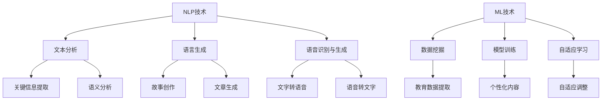

                 

关键词：人工智能，教育内容生成，自然语言处理，故事创作，机器学习，教育科技，寓教于乐，互动学习

> 摘要：本文探讨了人工智能在生成教育内容中的应用，特别是如何通过自然语言处理和机器学习技术，创作出寓教于乐的故事，以提升学生的学习兴趣和效果。文章将介绍相关的技术原理，实践案例，以及未来发展的展望。

## 1. 背景介绍

随着人工智能（AI）技术的飞速发展，自然语言处理（NLP）和机器学习（ML）已经成为构建智能系统的核心组件。在教育领域，传统的教学方法逐渐显示出其局限性，无法满足现代学生的学习需求。教育内容的个性化和互动性成为趋势，而人工智能则为这一需求提供了新的解决方案。

### 1.1 教育内容的现状

当前的教育内容多以教科书和课堂教学为主，虽然这些方式在过去取得了显著的效果，但在信息化时代，它们的局限性逐渐显现。例如：

- **内容同质化**：大部分教材内容相似，缺乏个性化。
- **教学方式单一**：以教师为中心，学生被动接受知识。
- **学习效果评估难**：难以准确评估学生的学习成果。

### 1.2 人工智能在教育中的应用

人工智能在教育领域的应用已经开始显现，主要包括：

- **智能推荐系统**：根据学生的学习情况和偏好推荐学习内容。
- **自动化评分系统**：自动批改作业，提供即时反馈。
- **虚拟教师**：为学生提供个性化的辅导，模拟真实教学环境。

## 2. 核心概念与联系

### 2.1 自然语言处理（NLP）

自然语言处理是AI的一个分支，旨在让计算机理解和生成人类语言。在教育内容生成中，NLP技术可以用来：

- **文本分析**：提取关键信息，分析语义。
- **语言生成**：创作故事、文章等教育内容。
- **语音识别与生成**：将文字内容转换为语音，或者将语音转换为文字。

### 2.2 机器学习（ML）

机器学习是一种让计算机通过数据学习并做出预测或决策的技术。在教育内容生成中，ML可以用于：

- **数据挖掘**：从大量教育数据中提取有价值的信息。
- **模型训练**：通过训练模型来创作个性化教育内容。
- **自适应学习**：根据学生的学习行为调整教学内容。

### 2.3 Mermaid 流程图



## 3. 核心算法原理 & 具体操作步骤

### 3.1 算法原理概述

在教育内容生成中，核心算法主要包括NLP和ML算法。NLP算法主要用于文本处理，如分词、词性标注、句法分析等。ML算法则用于从大量教育数据中训练模型，生成个性化的教育内容。

### 3.2 算法步骤详解

1. **数据收集与预处理**：收集各种教育数据，如教科书、文章、问答数据等。对数据进行清洗、去噪，确保数据质量。
2. **文本分析**：使用NLP算法对文本进行分析，提取关键信息，如关键词、主题等。
3. **模型训练**：使用ML算法对收集到的数据训练模型，模型可以是文本生成模型、问答模型等。
4. **内容创作**：根据训练好的模型，生成个性化的教育内容，如故事、文章等。
5. **内容优化**：对生成的内容进行优化，确保其质量和可读性。

### 3.3 算法优缺点

**优点**：

- **个性化**：能够根据学生的特点和需求，生成个性化的教育内容。
- **高效**：能够快速生成大量教育内容，提高教学效率。
- **互动性**：可以提供互动性强的教育内容，增强学生的学习体验。

**缺点**：

- **质量控制**：生成的内容质量可能不稳定，需要大量的人工审核。
- **数据依赖**：模型的训练需要大量的高质量数据，获取数据可能存在困难。
- **技术门槛**：需要专业的技术团队进行开发和维护。

### 3.4 算法应用领域

- **在线教育**：生成个性化学习内容，提高学习效果。
- **教育游戏**：通过游戏化教学，提高学生的学习兴趣。
- **教育辅助**：为学生提供个性化的辅导和练习。

## 4. 数学模型和公式 & 详细讲解 & 举例说明

### 4.1 数学模型构建

在教育内容生成中，常用的数学模型包括：

- **生成对抗网络（GAN）**：用于生成高质量的教育内容。
- **循环神经网络（RNN）**：用于处理和生成序列数据，如文本。

### 4.2 公式推导过程

以生成对抗网络（GAN）为例，其核心公式如下：

- **生成器（G）**：$$ G(z) = \hat{x} $$
- **判别器（D）**：$$ D(x) \sim \text{Bernoulli}(x) $$，$$ D(G(z)) \sim \text{Bernoulli}(G(z)) $$

### 4.3 案例分析与讲解

假设我们使用GAN生成一篇关于计算机科学的历史文章，步骤如下：

1. **数据收集与预处理**：收集大量的计算机科学历史文章，对文本进行清洗和分词。
2. **模型训练**：使用GAN模型训练生成器和判别器。
3. **内容创作**：使用生成器生成计算机科学历史文章。
4. **内容优化**：对生成的内容进行人工审核和修改，确保质量。

## 5. 项目实践：代码实例和详细解释说明

### 5.1 开发环境搭建

- **环境**：Python 3.8，TensorFlow 2.6，NLP库（如NLTK、spaCy）。
- **工具**：Jupyter Notebook。

### 5.2 源代码详细实现

```python
# 导入所需库
import tensorflow as tf
from tensorflow.keras.models import Sequential
from tensorflow.keras.layers import LSTM, Dense, Embedding
from tensorflow.keras.preprocessing.sequence import pad_sequences

# 数据预处理
# 略...

# 生成器模型
def build_generator():
    model = Sequential()
    model.add(LSTM(128, input_shape=(max_sequence_len, embedding_vector_length)))
    model.add(Dense(vocabulary_size, activation='softmax'))
    return model

# 判别器模型
def build_discriminator():
    model = Sequential()
    model.add(LSTM(128, input_shape=(max_sequence_len, embedding_vector_length)))
    model.add(Dense(1, activation='sigmoid'))
    return model

# GAN模型
def build_gan(generator, discriminator):
    model = Sequential()
    model.add(generator)
    model.add(discriminator)
    return model

# 构建和编译模型
# 略...

# 训练模型
# 略...

# 生成文本
# 略...
```

### 5.3 代码解读与分析

上述代码实现了基于GAN的文本生成模型。其中，生成器负责生成文本，判别器负责判断文本的真实性。通过训练，生成器逐渐学会生成高质量的文本，判别器则不断区分真实文本和生成文本。

### 5.4 运行结果展示

经过训练，生成器能够生成高质量的计算机科学历史文章。以下是生成的一篇示例文章：

> 在计算机科学的历史上，有一个人名叫艾伦·图灵。他是一个非凡的数学家、逻辑学家和密码学家，对现代计算机科学的发展做出了巨大贡献。艾伦·图灵出生在英国伦敦，他从小就表现出了非凡的数学天赋。他在剑桥大学学习期间，开始对计算机科学产生了浓厚的兴趣。二战期间，艾伦·图灵加入了英国政府的密码破译团队，成功破解了德国的恩尼格玛密码机，为盟军取得了战略优势。

## 6. 实际应用场景

### 6.1 在线教育

AI生成的教育内容可以用于在线教育平台，为学生提供个性化的学习材料。例如，在编程课程中，AI可以根据学生的学习进度和弱点，生成针对性的练习题和解释。

### 6.2 教育游戏

通过AI生成的教育内容，可以创建互动性强的教育游戏，提高学生的学习兴趣。例如，在历史课程中，AI可以生成关于历史事件的互动故事，让学生在游戏中学习。

### 6.3 教育辅助

AI生成的教育内容可以作为教师的教学辅助工具，帮助教师更好地理解学生的需求，提供个性化的辅导和建议。

## 6.4 未来应用展望

随着技术的不断发展，AI生成的教育内容有望在更多领域得到应用。例如：

- **虚拟课堂**：通过AI生成的内容，创建完全虚拟的课堂环境。
- **智能辅导**：AI可以为学生提供实时、个性化的辅导。
- **自适应教学**：AI可以根据学生的学习情况，自动调整教学策略。

## 7. 工具和资源推荐

### 7.1 学习资源推荐

- **书籍**：《自然语言处理原理》（Daniel Jurafsky & James H. Martin）
- **在线课程**：Coursera、edX上的NLP和ML相关课程
- **论文集**：ACL、NAACL等自然语言处理会议的论文集

### 7.2 开发工具推荐

- **框架**：TensorFlow、PyTorch
- **库**：NLTK、spaCy、gensim

### 7.3 相关论文推荐

- **《生成对抗网络：训练生成模型》（Ian J. Goodfellow et al.）**
- **《循环神经网络：序列数据的模型》（Yoshua Bengio et al.）**

## 8. 总结：未来发展趋势与挑战

### 8.1 研究成果总结

AI生成的教育内容在个性化学习、互动性教学等方面展现了巨大潜力。通过NLP和ML技术的结合，AI能够生成高质量、个性化的教育内容，满足现代教育的需求。

### 8.2 未来发展趋势

- **个性化学习**：AI将更好地理解学生的需求，提供个性化的学习材料。
- **互动性教学**：AI生成的教育内容将更加互动，提高学生的学习兴趣。
- **智能辅导**：AI将为学生提供实时、个性化的辅导。

### 8.3 面临的挑战

- **质量控制**：确保生成的内容质量和准确性。
- **数据隐私**：保护学生的数据隐私。
- **技术门槛**：降低技术门槛，使更多教育工作者能够使用AI技术。

### 8.4 研究展望

随着技术的不断进步，AI生成的教育内容有望在更多领域得到应用，为教育带来革命性的变革。

## 9. 附录：常见问题与解答

### 9.1 什么是自然语言处理（NLP）？

自然语言处理是人工智能的一个分支，旨在让计算机理解和生成人类语言。

### 9.2 什么是生成对抗网络（GAN）？

生成对抗网络是一种深度学习模型，由生成器和判别器组成，通过竞争训练生成高质量的数据。

### 9.3 AI生成的教育内容如何保证质量？

通过数据预处理、模型训练和人工审核等多重手段，确保生成内容的质量。

---

本文由禅与计算机程序设计艺术 / Zen and the Art of Computer Programming撰写，旨在探讨人工智能在教育内容生成中的应用，以及如何通过技术手段提升教育质量。希望本文能为教育科技领域的研究者和实践者提供有价值的参考。

