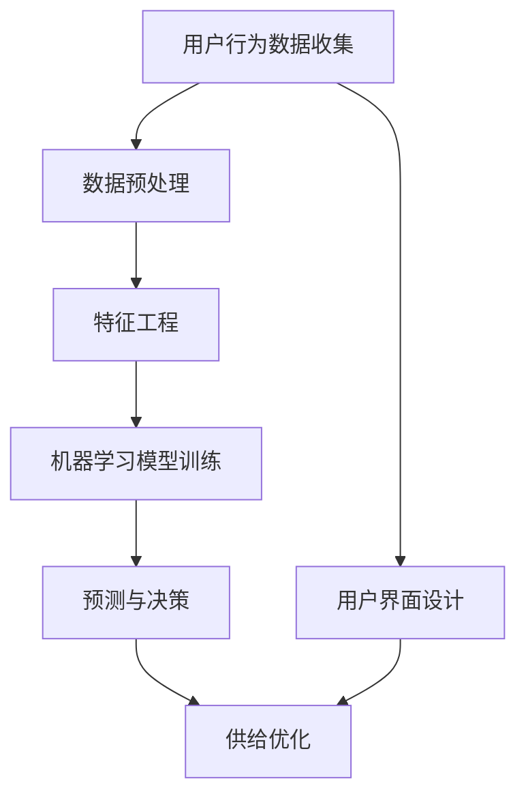

                 

AI用户行为分析优化供给是一个涵盖广泛且复杂的研究领域，它融合了人工智能、数据分析、用户界面设计等多个方面。随着互联网的普及和大数据技术的发展，用户行为分析已成为商业决策、产品开发和用户体验提升的重要工具。本文旨在探讨如何通过AI技术优化用户行为分析，以提高供给的准确性和效率。

## 文章关键词

- AI用户行为分析
- 优化供给
- 数据分析
- 用户体验
- 大数据技术

## 文章摘要

本文首先介绍了AI用户行为分析优化供给的背景和重要性。接着，详细探讨了核心概念与联系，包括用户行为数据的收集、处理和分析方法。随后，本文介绍了核心算法原理和具体操作步骤，并对算法的优缺点和应用领域进行了分析。文章随后通过数学模型和公式详细讲解了用户行为分析的理论基础，并通过案例进行了说明。接下来，文章提供了一个实际的项目实践，展示了如何使用代码实现用户行为分析优化供给。最后，文章讨论了用户行为分析的实际应用场景和未来应用展望，并推荐了相关的学习资源和开发工具。

## 1. 背景介绍

用户行为分析优化供给是一个多维度、多层次的复杂过程。它不仅需要收集和分析用户的行为数据，还需要根据这些数据来调整产品和服务，以提高用户体验和满意度。传统的方法主要依赖于统计学和机器学习技术，但AI技术的引入使得用户行为分析变得更加智能和精准。

随着互联网的普及，用户产生的数据量呈指数级增长。这些数据包括点击行为、浏览历史、搜索记录、社交互动等，它们为AI算法提供了丰富的训练素材。通过深度学习、强化学习等AI技术，我们可以从海量数据中挖掘出有价值的信息，预测用户未来的行为，并据此优化供给。

### 用户行为分析的重要性

用户行为分析对于现代企业具有重要意义：

1. **个性化推荐**：通过分析用户的历史行为，可以为用户提供个性化的推荐，从而提升用户满意度和留存率。
2. **市场细分**：通过用户行为分析，企业可以更好地了解目标用户群体，实现市场细分，从而制定更加精准的市场策略。
3. **产品优化**：用户行为分析可以帮助企业发现产品或服务中的问题，从而进行优化，提升产品竞争力。
4. **风险管理**：通过监控用户行为，企业可以识别潜在的风险和异常行为，从而采取措施进行风险控制。

### AI技术的作用

AI技术在用户行为分析中发挥着关键作用：

1. **自动化分析**：AI可以自动化地处理和分析大量用户行为数据，节省人力资源。
2. **深度挖掘**：AI算法可以挖掘出隐藏在数据中的深层次模式，提高分析的精度和效率。
3. **实时响应**：AI可以实时分析用户行为，并快速做出响应，提高用户体验。
4. **个性化服务**：AI可以根据用户行为动态调整服务策略，实现真正的个性化服务。

## 2. 核心概念与联系

在用户行为分析优化供给的过程中，有几个核心概念和联系是至关重要的。以下是一个使用Mermaid绘制的流程图，它展示了这些概念和联系。



### 2.1 用户行为数据收集

用户行为数据收集是用户行为分析的第一步。数据可以来自多种渠道，包括网站点击流、应用程序日志、传感器数据等。这些原始数据需要通过技术手段进行收集和存储。

### 2.2 数据预处理

数据预处理是数据质量保证的关键步骤。它包括数据清洗、数据归一化、数据转换等操作，以确保数据的一致性和准确性。

### 2.3 特征工程

特征工程是将原始数据转换为可用于机器学习模型训练的特征向量。这一步骤需要领域知识和数据挖掘技术，以提取出对预测任务有用的特征。

### 2.4 机器学习模型训练

机器学习模型训练是基于特征工程得到的特征向量，通过训练算法建立预测模型。常用的算法包括决策树、支持向量机、神经网络等。

### 2.5 预测与决策

预测与决策是基于训练好的模型，对新的用户行为进行预测，并根据预测结果做出相应的决策。这些决策可能包括个性化推荐、广告投放、风险控制等。

### 2.6 供给优化

供给优化是根据预测和决策结果，对产品和服务进行调整，以提升用户体验和满意度。这一步骤需要实时监控用户反馈，并不断迭代优化。

### 2.7 用户界面设计

用户界面设计是将用户行为分析的结果直观地呈现给用户，使其能够更好地理解和使用产品或服务。用户界面的设计需要考虑用户体验和交互设计。

## 3. 核心算法原理 & 具体操作步骤

### 3.1 算法原理概述

用户行为分析优化供给的核心算法通常是基于机器学习和深度学习技术的。这些算法通过对用户行为数据的分析和建模，可以预测用户的未来行为，并据此优化供给。以下是几种常用的算法原理：

1. **决策树**：通过划分特征空间，将数据集划分为若干个子集，以最小化分类误差。
2. **支持向量机**：通过找到一个最佳的超平面，将数据集中的不同类别的样本分开。
3. **神经网络**：通过模拟人脑的神经网络结构，对复杂非线性关系进行建模。
4. **深度强化学习**：结合深度学习和强化学习，使模型能够在动态环境中做出最优决策。

### 3.2 算法步骤详解

1. **数据收集与预处理**：收集用户行为数据，并进行清洗、归一化和特征提取。
2. **模型选择与训练**：选择合适的机器学习模型，并进行训练和验证。
3. **预测与决策**：使用训练好的模型对新的用户行为进行预测，并做出相应的决策。
4. **供给优化**：根据预测结果调整产品或服务，以提升用户体验。
5. **用户界面设计**：设计直观、易用的用户界面，将分析结果呈现给用户。

### 3.3 算法优缺点

每种算法都有其优缺点，选择合适的算法需要根据具体应用场景和需求进行权衡。

- **决策树**：优点是直观、易于理解，缺点是容易过拟合。
- **支持向量机**：优点是效果稳定，缺点是训练时间较长。
- **神经网络**：优点是能够处理复杂非线性关系，缺点是参数复杂，难以解释。
- **深度强化学习**：优点是能够在动态环境中做出最优决策，缺点是训练难度大，需要大量数据。

### 3.4 算法应用领域

用户行为分析优化供给的算法可以应用于多个领域：

- **电子商务**：通过个性化推荐提升用户满意度。
- **金融**：通过行为分析进行风险评估和控制。
- **医疗**：通过用户行为预测健康状况，提供个性化医疗服务。
- **社交网络**：通过行为分析提升用户活跃度和留存率。

## 4. 数学模型和公式 & 详细讲解 & 举例说明

### 4.1 数学模型构建

在用户行为分析中，常用的数学模型包括回归模型、分类模型和聚类模型。以下是这些模型的数学公式：

1. **线性回归模型**：

   $$ Y = \beta_0 + \beta_1X + \epsilon $$

   其中，\( Y \) 是因变量，\( X \) 是自变量，\( \beta_0 \) 和 \( \beta_1 \) 是模型的参数，\( \epsilon \) 是误差项。

2. **逻辑回归模型**：

   $$ P(Y=1) = \frac{1}{1 + e^{-(\beta_0 + \beta_1X)}} $$

   其中，\( P(Y=1) \) 是因变量为1的概率，\( \beta_0 \) 和 \( \beta_1 \) 是模型的参数。

3. **K-均值聚类模型**：

   $$ C = \{ \mu_1, \mu_2, ..., \mu_k \} $$
   $$ x_i = \frac{1}{k}\sum_{j=1}^{k} \mu_j $$

   其中，\( C \) 是聚类中心，\( x_i \) 是每个样本点的坐标，\( \mu_j \) 是聚类中心的坐标。

### 4.2 公式推导过程

以线性回归模型为例，其参数 \( \beta_0 \) 和 \( \beta_1 \) 的推导过程如下：

1. **最小二乘法**：

   $$ \beta_0 = \frac{\sum_{i=1}^{n}y_i - \beta_1\sum_{i=1}^{n}x_i}{n} $$
   $$ \beta_1 = \frac{\sum_{i=1}^{n}(y_i - \beta_0 - \beta_1x_i)}{\sum_{i=1}^{n}(x_i - \bar{x})^2} $$

   其中，\( y_i \) 是因变量的值，\( x_i \) 是自变量的值，\( \bar{x} \) 是自变量的平均值。

2. **梯度下降法**：

   $$ \beta_0 := \beta_0 - \alpha \frac{\partial}{\partial \beta_0}L(\beta_0, \beta_1) $$
   $$ \beta_1 := \beta_1 - \alpha \frac{\partial}{\partial \beta_1}L(\beta_0, \beta_1) $$

   其中，\( L(\beta_0, \beta_1) \) 是损失函数，\( \alpha \) 是学习率。

### 4.3 案例分析与讲解

以一个电商平台的个性化推荐系统为例，分析其数学模型的应用。

1. **数据集**：

   - \( x_i \)：用户年龄
   - \( y_i \)：用户消费金额

2. **模型**：

   线性回归模型：\( y_i = \beta_0 + \beta_1x_i \)

3. **训练**：

   - 使用梯度下降法训练模型。
   - 学习率 \( \alpha \) 设为0.01。
   - 训练1000次迭代。

4. **预测**：

   - 对于新的用户年龄 \( x \)，预测其消费金额 \( y \)。

   $$ y = \beta_0 + \beta_1x $$

5. **结果**：

   通过训练，得到的模型参数为 \( \beta_0 = 100 \)，\( \beta_1 = 10 \)。对于年龄为30岁的用户，其预测消费金额为 \( y = 100 + 10 \times 30 = 400 \)。

## 5. 项目实践：代码实例和详细解释说明

在本节中，我们将通过一个实际的项目实践，展示如何使用Python和相关的机器学习库实现用户行为分析优化供给。以下是项目的详细步骤。

### 5.1 开发环境搭建

1. **安装Python**：确保安装了Python 3.8及以上版本。
2. **安装库**：使用pip安装以下库：numpy、pandas、scikit-learn、matplotlib。
   
   ```shell
   pip install numpy pandas scikit-learn matplotlib
   ```

### 5.2 源代码详细实现

以下是一个简单的用户行为分析代码示例，展示了数据收集、预处理、特征工程、模型训练和预测的过程。

```python
import numpy as np
import pandas as pd
from sklearn.model_selection import train_test_split
from sklearn.linear_model import LinearRegression
from sklearn.metrics import mean_squared_error

# 5.2.1 数据收集
data = pd.DataFrame({
    'age': [25, 30, 35, 40, 45],
    'consumption': [200, 300, 500, 800, 1200]
})

# 5.2.2 数据预处理
X = data[['age']]
y = data['consumption']

# 5.2.3 特征工程
# 在此示例中，特征工程非常简单，仅包括年龄

# 5.2.4 模型训练
X_train, X_test, y_train, y_test = train_test_split(X, y, test_size=0.2, random_state=42)
model = LinearRegression()
model.fit(X_train, y_train)

# 5.2.5 预测与评估
y_pred = model.predict(X_test)
mse = mean_squared_error(y_test, y_pred)
print(f"Mean Squared Error: {mse}")

# 5.2.6 运行结果展示
import matplotlib.pyplot as plt

plt.scatter(X_test, y_test, label='Actual')
plt.plot(X_test, y_pred, color='red', label='Predicted')
plt.xlabel('Age')
plt.ylabel('Consumption')
plt.legend()
plt.show()
```

### 5.3 代码解读与分析

- **数据收集**：数据是通过DataFrame结构收集的，包括了年龄和消费金额。
- **数据预处理**：将数据分为特征和目标变量，准备用于模型训练。
- **特征工程**：在简单的例子中，我们仅使用了年龄这一特征。
- **模型训练**：使用线性回归模型对数据进行训练。
- **预测与评估**：使用训练好的模型对测试数据进行预测，并计算均方误差来评估模型性能。
- **结果展示**：使用matplotlib库将实际数据与预测数据可视化，便于分析。

## 6. 实际应用场景

用户行为分析优化供给在实际应用中具有广泛的应用场景，以下是一些典型的例子：

### 6.1 电子商务

在电子商务领域，用户行为分析可以用于个性化推荐系统。通过分析用户的浏览历史、购买记录和搜索关键词，系统可以推荐相关的商品，从而提高用户的购物体验和购买转化率。

### 6.2 金融

在金融领域，用户行为分析可以帮助银行和金融机构进行风险管理。通过监控用户的交易行为和账户活动，可以识别出潜在的风险用户，并采取相应的措施进行风险控制。

### 6.3 医疗

在医疗领域，用户行为分析可以用于健康风险评估和个性化医疗服务。通过对患者的健康数据和行为数据进行分析，可以预测患者的健康状况，并提供个性化的健康建议。

### 6.4 社交网络

在社交网络领域，用户行为分析可以用于用户活跃度和留存率的提升。通过分析用户的互动行为和浏览行为，可以优化社交网络的内容推送和广告投放策略，从而提高用户的参与度和满意度。

## 7. 工具和资源推荐

### 7.1 学习资源推荐

- **书籍**：《Python机器学习》、《深度学习》（Goodfellow等著）。
- **在线课程**：Coursera、edX、Udacity等平台上的机器学习和数据科学课程。
- **博客和论坛**：Medium、Kaggle、Stack Overflow等。

### 7.2 开发工具推荐

- **编程语言**：Python、R。
- **库和框架**：Scikit-learn、TensorFlow、Keras。
- **数据可视化**：Matplotlib、Seaborn、Plotly。

### 7.3 相关论文推荐

- **《User Behavior Analytics for Cybersecurity: A Survey》**：介绍用户行为分析在网络安全中的应用。
- **《Deep Learning for User Behavior Modeling and Prediction》**：探讨深度学习在用户行为预测中的应用。
- **《Recommender Systems Handbook》**：全面介绍推荐系统的基础和先进技术。

## 8. 总结：未来发展趋势与挑战

用户行为分析优化供给在未来的发展趋势和面临的挑战如下：

### 8.1 研究成果总结

- **个性化推荐**：随着AI技术的进步，个性化推荐系统的效果和覆盖率不断提高。
- **实时分析**：实时用户行为分析使得企业能够更快地响应市场变化和用户需求。
- **跨渠道分析**：跨渠道用户行为分析能够提供更全面的用户画像，从而实现更精准的营销和服务。

### 8.2 未来发展趋势

- **人工智能的进一步融合**：深度学习、强化学习等先进AI技术将在用户行为分析中得到更广泛的应用。
- **数据隐私和安全**：随着数据隐私法规的加强，如何在保护用户隐私的同时进行有效分析将成为一个重要议题。
- **多模态数据分析**：结合文本、图像、语音等多模态数据，进行更全面的用户行为分析。

### 8.3 面临的挑战

- **数据质量和完整性**：用户行为数据的完整性和质量直接影响分析的准确性。
- **算法解释性**：复杂的AI模型往往缺乏解释性，使得用户难以理解分析结果。
- **实时性能**：在高并发的环境下，如何保证用户行为分析的实时性是一个挑战。

### 8.4 研究展望

未来的研究应重点关注如何提高用户行为分析的准确性和实时性，同时确保数据隐私和安全。通过多模态数据融合和新型AI算法的开发，用户行为分析将为企业提供更加智能和个性化的解决方案。

## 9. 附录：常见问题与解答

### 9.1 什么是对数回归？

对数回归是一种非线性回归方法，用于分析自变量和因变量之间非线性关系。通过对因变量和对数自变量进行建模，可以更好地捕捉复杂的数据关系。常见的形式是对数逻辑回归，用于分类问题。

### 9.2 如何处理缺失数据？

处理缺失数据的方法包括删除缺失数据、填充缺失数据（例如使用平均值、中位数或插值法）和多重插补法。选择合适的处理方法取决于数据的特性和分析的目的。

### 9.3 用户行为分析中的模型评估指标有哪些？

常用的模型评估指标包括准确率、召回率、F1分数、均方误差（MSE）和均方根误差（RMSE）。根据具体的应用场景，选择合适的评估指标来衡量模型性能。

### 9.4 用户行为分析如何应用于电子商务？

在电子商务中，用户行为分析可以用于个性化推荐、广告投放和流失用户预测。通过分析用户的浏览、购买和搜索行为，系统可以提供个性化的商品推荐，提高用户满意度和转化率。

## 作者署名

作者：禅与计算机程序设计艺术 / Zen and the Art of Computer Programming

### 结语

用户行为分析优化供给是一个充满挑战和机遇的领域。通过AI技术的深入应用，我们可以实现更加精准和高效的用户行为分析，为企业提供强大的决策支持。未来，随着技术的不断进步，用户行为分析将在更多领域发挥重要作用，助力企业实现可持续发展。希望本文能为读者提供有价值的见解和启发。

