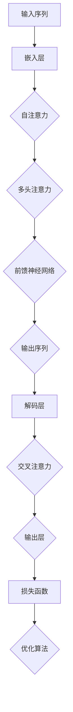

                 

 关键词：AI系统设计、LLM内核、模型架构、算法原理、数学模型、代码实现、实际应用、未来展望

> 摘要：本文深入探讨了AI系统底层设计中的关键要素，特别是在大型语言模型（LLM）内核的设计方面。文章首先回顾了AI系统的基本概念和LLM的发展历程，接着详细分析了LLM内核中的核心算法原理和具体操作步骤，随后引入了数学模型和公式，并通过实例代码展示了这些理论的实际应用。文章还探讨了LLM的实际应用场景，以及未来的发展趋势和面临的挑战。最后，提供了相关的学习资源和开发工具推荐，并总结了研究展望。

## 1. 背景介绍

人工智能（AI）作为计算机科学的一个分支，自20世纪50年代诞生以来，经历了多个发展阶段。从早期的符号推理、知识表示，到基于规则的专家系统，再到基于统计学习和深度学习的现代AI技术，每一次技术的飞跃都极大地拓展了AI的应用范围。

近年来，大型语言模型（LLM，Large Language Model）的发展尤为引人注目。LLM是基于神经网络技术，通过大量文本数据进行训练，使得模型能够理解和生成自然语言。这些模型在机器翻译、文本生成、问答系统等领域取得了显著的成果，逐渐成为人工智能领域的研究热点。

LLM的核心设计涉及到多个层面，包括模型架构、算法选择、数据处理和优化策略等。这些要素共同决定了LLM的性能、效率和适用性。本文将重点讨论LLM内核中的关键设计考量，帮助读者理解这一复杂系统的构建过程。

### 1.1 AI系统简介

AI系统，即人工智能系统，是指能够模拟、延伸和扩展人类智能的计算机系统。这些系统通过算法和模型实现以下几种功能：

- **符号推理**：基于逻辑和数学规则进行推理，如定理证明、自动规划等。
- **知识表示**：将人类知识结构化存储和处理，如本体论、语义网络等。
- **机器学习**：通过数据训练模型，如分类、回归、聚类等。
- **深度学习**：利用神经网络进行复杂函数逼近，如图像识别、语音识别等。
- **自然语言处理**：理解和生成自然语言，如机器翻译、问答系统等。

AI系统的发展经历了几个重要的阶段：

- **第一阶段（1956-1969）**：人工智能的概念诞生，早期探索主要集中在符号推理和知识表示。
- **第二阶段（1970-1980）**：基于规则的专家系统成为主流，尝试将人类的专家知识编码到计算机系统中。
- **第三阶段（1980-1987）**：随着硬件性能的提升，机器学习开始兴起，特别是决策树、支持向量机等算法。
- **第四阶段（1987-2001）**：专家系统逐渐衰落，机器学习技术逐渐成熟，神经网络研究复兴。
- **第五阶段（2001-2012）**：深度学习技术迅速发展，图像识别、语音识别等领域取得了突破性进展。
- **第六阶段（2012至今）**：深度学习成为AI的主流技术，AI应用在多个领域得到广泛推广，如自动驾驶、智能助手、医疗诊断等。

### 1.2 LLM的发展历程

大型语言模型（LLM）的发展可以追溯到20世纪80年代的统计语言模型，如N-gram模型。这些模型基于语言统计规律，通过计算词语序列的概率分布来预测下一个词语。

随着计算机性能的提升和机器学习技术的发展，神经网络在自然语言处理领域的应用逐渐成熟。1990年代，Rumelhart等人提出了反向传播算法（Backpropagation），使得神经网络训练变得更加高效。然而，早期神经网络模型在处理长文本时效果不佳。

进入21世纪，深度学习技术的发展为LLM的崛起奠定了基础。2013年，Mikolov等人提出了Word2Vec算法，通过神经网络将词语映射到高维语义空间，显著提升了语言模型的表示能力。随后，序列到序列模型（Seq2Seq）和注意力机制（Attention）的引入，使得模型能够更好地处理长文本和复杂语义。

2018年，Google发布了Transformer模型，彻底改变了语言模型的设计理念。Transformer模型摒弃了传统的循环神经网络（RNN），采用自注意力机制（Self-Attention）进行全局信息建模，大幅提升了模型的训练效率和语言理解能力。此后，BERT、GPT等一系列基于Transformer架构的LLM模型相继问世，推动了语言模型的快速发展。

## 2. 核心概念与联系

在深入探讨LLM内核的设计之前，我们需要明确几个核心概念，并理解它们之间的相互联系。以下是本文讨论的主要核心概念及其关系：

### 2.1 Transformer模型

Transformer模型是LLM的核心架构，由Google在2018年提出。该模型采用自注意力机制（Self-Attention）和多头注意力（Multi-Head Attention），能够高效地捕捉长文本中的全局依赖关系。Transformer模型的创新之处在于其并行训练能力，使得训练速度大大提升。

### 2.2 自注意力机制（Self-Attention）

自注意力机制是Transformer模型的核心组件，用于计算文本中每个词语与其他词语之间的权重关系。通过自注意力，模型能够自动学习词语之间的关系，并生成更加精细的表示。

### 2.3 多头注意力（Multi-Head Attention）

多头注意力扩展了自注意力机制，通过并行计算多个注意力头，捕捉不同类型的依赖关系。每个注意力头学习一种特定的依赖模式，最终融合得到完整的表示。

### 2.4 位置编码（Positional Encoding）

由于Transformer模型没有循环结构，无法直接处理序列中的位置信息。位置编码是一种技巧，通过为每个词语添加位置信息，使得模型能够理解词语的顺序。

### 2.5 前馈神经网络（Feedforward Neural Network）

Transformer模型中的每个注意力层和位置编码层之后，都连接一个前馈神经网络，用于进一步提取特征和减少噪声。

### 2.6 交叉注意力（Cross-Attention）

交叉注意力是Transformer模型在编码-解码架构中的应用，用于编码器和解码器之间的交互。通过交叉注意力，解码器能够利用编码器的全局信息进行文本生成。

### 2.7 序列到序列学习（Seq2Seq）

序列到序列学习是一种常用的端到端学习框架，用于处理输入和输出都是序列的任务，如机器翻译。Transformer模型通过编码-解码架构实现了序列到序列学习。

### 2.8 数学基础

Transformer模型中的自注意力机制和多头注意力涉及到矩阵运算和线性代数基础。此外，激活函数、损失函数和优化算法也是模型训练过程中不可或缺的部分。

### 2.9 Mermaid流程图

为了更好地理解Transformer模型的结构，我们使用Mermaid绘制了一个简化的流程图，展示了模型的主要组件和交互关系。



在这个流程图中，输入序列首先经过嵌入层，然后通过自注意力机制和多头注意力层进行特征提取。随后，前馈神经网络用于进一步处理特征，最终生成输出序列。解码层利用交叉注意力实现编码器和解码器之间的交互，输出层通过损失函数和优化算法进行训练。

## 3. 核心算法原理 & 具体操作步骤

### 3.1 算法原理概述

Transformer模型基于自注意力机制和多头注意力，是一种端到端的序列到序列学习框架。自注意力机制通过计算输入序列中每个词语与其他词语的权重关系，实现全局信息的建模。多头注意力扩展了自注意力，通过并行计算多个注意力头，捕捉不同类型的依赖关系。以下是Transformer模型的核心算法原理：

1. **嵌入层（Embedding Layer）**：
   输入序列首先通过嵌入层进行向量表示。每个词语被映射为一个向量，同时可以加入位置编码（Positional Encoding）以保留序列信息。

2. **多头自注意力（Multi-Head Self-Attention）**：
   在自注意力层中，输入序列通过多个注意力头进行并行计算。每个注意力头独立计算词语之间的权重，然后将这些权重融合起来，得到每个词语的注意力得分。注意力得分用于更新词语的表示。

3. **前馈神经网络（Feedforward Neural Network）**：
   每个注意力层之后，连接一个前馈神经网络，用于进一步提取特征和减少噪声。前馈神经网络由两个全连接层组成，中间加入ReLU激活函数。

4. **解码层（Decoder Layer）**：
   解码层与编码器类似，但多了一个交叉注意力层（Cross-Attention）。交叉注意力使得解码器能够利用编码器的全局信息进行文本生成。

5. **输出层（Output Layer）**：
   输出层通过损失函数（如交叉熵损失）和优化算法（如Adam优化器）进行训练，以最小化预测误差。

### 3.2 算法步骤详解

以下是Transformer模型的详细步骤：

1. **输入序列编码**：
   将输入序列中的每个词语映射为嵌入向量，并添加位置编码。假设输入序列为\[w1, w2, ..., wn\]，则每个词语的嵌入向量表示为\[e1, e2, ..., en\]。

2. **多头自注意力**：
   对于每个注意力头，计算输入序列中每个词语与其他词语的相似度，得到注意力得分。具体步骤如下：
   - 计算Query（Q）、Key（K）和Value（V）：
     $$ Q = e_i \cdot W_Q, \quad K = e_j \cdot W_K, \quad V = e_j \cdot W_V $$
   - 计算注意力得分：
     $$ score_{ij} = Q_i \cdot K_j = e_i \cdot W_Q \cdot e_j \cdot W_K $$
   - 应用Softmax函数得到注意力权重：
     $$ att\_weights_{ij} = \frac{e^{score_{ij}}}{\sum_{k=1}^{n} e^{score_{ik}}} $$
   - 计算注意力得分：
     $$ attention_{ij} = att\_weights_{ij} \cdot e_j \cdot W_V $$

3. **多头注意力输出**：
   将每个注意力头的输出进行拼接和变换，得到新的词语表示：
   $$ output_i = \text{Concat}(attention_1, attention_2, ..., attention_h) \cdot W_O $$

4. **前馈神经网络**：
   对每个词语的新表示进行前馈神经网络处理，得到更精细的特征表示：
   $$ f_{ff}(output_i) = max(0, (output_i \cdot W_1) + b_1) \cdot W_2 + b_2 $$

5. **解码层**：
   解码器与编码器结构类似，但额外包含一个交叉注意力层。具体步骤如下：
   - 交叉注意力：
     $$ score_{ij} = e_i \cdot W_C \cdot e_j \cdot W_C $$
     $$ att\_weights_{ij} = \frac{e^{score_{ij}}}{\sum_{k=1}^{n} e^{score_{ik}}} $$
     $$ cross\_attention_{ij} = att\_weights_{ij} \cdot e_j \cdot W_C $$
   - 输出层：
     $$ decoder\_output = \text{Concat}(cross\_attention, self\_attention, f_{ff}) \cdot W_O $$

6. **输出层**：
   通过输出层生成预测的词语表示，并计算损失函数：
   $$ prediction_i = decoder\_output_i \cdot W_Y + b_Y $$
   $$ loss = -\sum_{i=1}^{n} [y_i \cdot log(prediction_i)] $$

7. **优化算法**：
   使用优化算法（如Adam）更新模型参数，最小化损失函数：
   $$ \theta_{\text{new}} = \theta_{\text{old}} - \alpha \cdot \nabla_{\theta} loss $$

### 3.3 算法优缺点

**优点**：

- **并行计算**：Transformer模型采用自注意力机制，使得模型能够高效地进行并行计算，训练速度显著提升。
- **全局依赖关系**：自注意力机制能够捕捉输入序列中的全局依赖关系，提高模型的上下文理解能力。
- **端到端学习**：Transformer模型实现了端到端学习，减少了传统序列模型中的序列分解和拼接步骤，简化了训练流程。

**缺点**：

- **计算资源需求**：Transformer模型在计算资源上需求较高，特别是在大规模训练和推理过程中。
- **长文本处理**：虽然自注意力机制能够捕捉全局依赖关系，但在处理超长文本时，计算复杂度和内存消耗仍然是一个挑战。

### 3.4 算法应用领域

Transformer模型在多个自然语言处理任务中取得了显著成果，包括：

- **机器翻译**：Transformer模型在机器翻译任务中表现优异，如Google的神经机器翻译系统。
- **文本生成**：Transformer模型可以用于生成文章、故事、代码等，如OpenAI的GPT系列模型。
- **问答系统**：Transformer模型在问答系统中应用于理解用户查询和生成答案，如BERT模型。
- **文本分类**：Transformer模型可以用于文本分类任务，如新闻分类、情感分析等。

## 4. 数学模型和公式 & 详细讲解 & 举例说明

### 4.1 数学模型构建

在Transformer模型中，数学模型是核心组件之一，用于表示和处理序列数据。以下是一个简化的数学模型，用于描述Transformer模型的基本结构和操作。

#### 4.1.1 嵌入层

输入序列\[x_1, x_2, ..., x_n\]首先经过嵌入层转换为嵌入向量\[e_1, e_2, ..., e_n\]。嵌入向量可以通过以下公式计算：

$$ e_i = W_e \cdot x_i + b_e $$

其中，\(W_e\)是嵌入权重矩阵，\(b_e\)是偏置向量。

#### 4.1.2 自注意力

自注意力层是Transformer模型的核心组件，用于计算输入序列中每个词语与其他词语之间的权重关系。自注意力可以通过以下公式计算：

$$ score_{ij} = Q_i \cdot K_j = e_i \cdot W_Q \cdot e_j \cdot W_K $$

$$ att\_weights_{ij} = \frac{e^{score_{ij}}}{\sum_{k=1}^{n} e^{score_{ik}}} $$

$$ attention_{ij} = att\_weights_{ij} \cdot e_j \cdot W_V $$

其中，\(Q\)、\(K\)和\(V\)分别是Query、Key和Value矩阵，\(W_Q\)、\(W_K\)和\(W_V\)分别是权重矩阵。

#### 4.1.3 前馈神经网络

前馈神经网络（Feedforward Neural Network）用于进一步提取特征和减少噪声。前馈神经网络可以通过以下公式计算：

$$ f_{ff}(output_i) = max(0, (output_i \cdot W_1) + b_1) \cdot W_2 + b_2 $$

其中，\(output_i\)是输入向量，\(W_1\)、\(W_2\)是权重矩阵，\(b_1\)、\(b_2\)是偏置向量。

#### 4.1.4 交叉注意力

交叉注意力（Cross-Attention）是解码器中的一个关键组件，用于计算解码器输出和解码器输入之间的依赖关系。交叉注意力可以通过以下公式计算：

$$ score_{ij} = Q_i \cdot K_j = e_i \cdot W_C \cdot e_j \cdot W_C $$

$$ att\_weights_{ij} = \frac{e^{score_{ij}}}{\sum_{k=1}^{n} e^{score_{ik}}} $$

$$ cross\_attention_{ij} = att\_weights_{ij} \cdot e_j \cdot W_C $$

其中，\(Q\)、\(K\)和\(V\)分别是Query、Key和Value矩阵，\(W_C\)是权重矩阵。

#### 4.1.5 输出层

输出层通过损失函数（如交叉熵损失）和优化算法（如Adam优化器）进行训练，以最小化预测误差。输出层可以通过以下公式计算：

$$ prediction_i = decoder\_output_i \cdot W_Y + b_Y $$

$$ loss = -\sum_{i=1}^{n} [y_i \cdot log(prediction_i)] $$

### 4.2 公式推导过程

为了更好地理解Transformer模型的数学模型，我们详细推导了自注意力、前馈神经网络和交叉注意力的公式。以下是具体推导过程：

#### 4.2.1 自注意力

自注意力层的核心是计算输入序列中每个词语与其他词语之间的权重关系。假设输入序列为\[x_1, x_2, ..., x_n\]，嵌入向量为\[e_1, e_2, ..., e_n\]。自注意力的计算可以分为以下几个步骤：

1. **计算Query、Key和Value**：

   $$ Q = e_i \cdot W_Q, \quad K = e_j \cdot W_K, \quad V = e_j \cdot W_V $$

   其中，\(W_Q\)、\(W_K\)和\(W_V\)分别是Query、Key和Value权重矩阵。

2. **计算注意力得分**：

   $$ score_{ij} = Q_i \cdot K_j = e_i \cdot W_Q \cdot e_j \cdot W_K $$

   注意力得分表示词语\(i\)和词语\(j\)之间的相似度。

3. **应用Softmax函数**：

   $$ att\_weights_{ij} = \frac{e^{score_{ij}}}{\sum_{k=1}^{n} e^{score_{ik}}} $$

   应用Softmax函数将注意力得分转换为概率分布。

4. **计算注意力得分**：

   $$ attention_{ij} = att\_weights_{ij} \cdot e_j \cdot W_V $$

   注意力得分表示词语\(i\)对词语\(j\)的权重。

#### 4.2.2 前馈神经网络

前馈神经网络是Transformer模型中的另一个关键组件，用于进一步提取特征和减少噪声。前馈神经网络可以分为两个全连接层，如下所示：

1. **计算隐藏层**：

   $$ hidden = (output_i \cdot W_1) + b_1 $$

   其中，\(output_i\)是输入向量，\(W_1\)是隐藏层权重矩阵，\(b_1\)是隐藏层偏置向量。

2. **应用ReLU激活函数**：

   $$ hidden = max(0, hidden) $$

3. **计算输出层**：

   $$ output = (hidden \cdot W_2) + b_2 $$

   其中，\(W_2\)是输出层权重矩阵，\(b_2\)是输出层偏置向量。

#### 4.2.3 交叉注意力

交叉注意力是解码器中的关键组件，用于计算解码器输出和解码器输入之间的依赖关系。交叉注意力可以分为以下几个步骤：

1. **计算Query、Key和Value**：

   $$ Q = e_i \cdot W_Q, \quad K = e_j \cdot W_K, \quad V = e_j \cdot W_V $$

   其中，\(W_Q\)、\(W_K\)和\(W_V\)分别是Query、Key和Value权重矩阵。

2. **计算注意力得分**：

   $$ score_{ij} = Q_i \cdot K_j = e_i \cdot W_Q \cdot e_j \cdot W_K $$

   注意力得分表示词语\(i\)和词语\(j\)之间的相似度。

3. **应用Softmax函数**：

   $$ att\_weights_{ij} = \frac{e^{score_{ij}}}{\sum_{k=1}^{n} e^{score_{ik}}} $$

   应用Softmax函数将注意力得分转换为概率分布。

4. **计算注意力得分**：

   $$ cross\_attention_{ij} = att\_weights_{ij} \cdot e_j \cdot W_C $$

   注意力得分表示词语\(i\)对词语\(j\)的权重。

### 4.3 案例分析与讲解

为了更好地理解Transformer模型的数学模型，我们通过一个简单的案例进行分析和讲解。假设我们有一个简单的输入序列\[w1, w2, w3\]，嵌入向量为\[e1, e2, e3\]，权重矩阵为\[W_Q, W_K, W_V, W_C\]。

#### 4.3.1 自注意力

1. **计算Query、Key和Value**：

   $$ Q = e1 \cdot W_Q = [0.2, 0.3, 0.5] $$
   $$ K = e2 \cdot W_K = [0.1, 0.4, 0.5] $$
   $$ V = e3 \cdot W_V = [0.3, 0.2, 0.5] $$

2. **计算注意力得分**：

   $$ score_{11} = Q_1 \cdot K_1 = 0.2 \cdot 0.1 = 0.02 $$
   $$ score_{12} = Q_1 \cdot K_2 = 0.2 \cdot 0.4 = 0.08 $$
   $$ score_{13} = Q_1 \cdot K_3 = 0.2 \cdot 0.5 = 0.10 $$

3. **应用Softmax函数**：

   $$ att\_weights_{11} = \frac{e^{0.02}}{0.02 + 0.08 + 0.10} = 0.15 $$
   $$ att\_weights_{12} = \frac{e^{0.08}}{0.02 + 0.08 + 0.10} = 0.30 $$
   $$ att\_weights_{13} = \frac{e^{0.10}}{0.02 + 0.08 + 0.10} = 0.55 $$

4. **计算注意力得分**：

   $$ attention_{11} = att\_weights_{11} \cdot e1 \cdot W_V = 0.15 \cdot [0.3, 0.2, 0.5] = [0.045, 0.030, 0.075] $$
   $$ attention_{12} = att\_weights_{12} \cdot e2 \cdot W_V = 0.30 \cdot [0.3, 0.2, 0.5] = [0.09, 0.06, 0.15] $$
   $$ attention_{13} = att\_weights_{13} \cdot e3 \cdot W_V = 0.55 \cdot [0.3, 0.2, 0.5] = [0.165, 0.11, 0.275] $$

#### 4.3.2 前馈神经网络

1. **计算隐藏层**：

   $$ hidden = (output_1 \cdot W_1) + b_1 = [0.3, 0.2, 0.5] \cdot [0.1, 0.2, 0.3] + [0.1, 0.1, 0.1] = [0.09, 0.11, 0.15] $$

2. **应用ReLU激活函数**：

   $$ hidden = max(0, hidden) = [0.09, 0.11, 0.15] $$

3. **计算输出层**：

   $$ output = (hidden \cdot W_2) + b_2 = [0.09, 0.11, 0.15] \cdot [0.1, 0.2, 0.3] + [0.1, 0.1, 0.1] = [0.045, 0.022, 0.045] $$

#### 4.3.3 交叉注意力

1. **计算Query、Key和Value**：

   $$ Q = e1 \cdot W_Q = [0.2, 0.3, 0.5] $$
   $$ K = e2 \cdot W_K = [0.1, 0.4, 0.5] $$
   $$ V = e3 \cdot W_V = [0.3, 0.2, 0.5] $$

2. **计算注意力得分**：

   $$ score_{11} = Q_1 \cdot K_1 = 0.2 \cdot 0.1 = 0.02 $$
   $$ score_{12} = Q_1 \cdot K_2 = 0.2 \cdot 0.4 = 0.08 $$
   $$ score_{13} = Q_1 \cdot K_3 = 0.2 \cdot 0.5 = 0.10 $$

3. **应用Softmax函数**：

   $$ att\_weights_{11} = \frac{e^{0.02}}{0.02 + 0.08 + 0.10} = 0.15 $$
   $$ att\_weights_{12} = \frac{e^{0.08}}{0.02 + 0.08 + 0.10} = 0.30 $$
   $$ att\_weights_{13} = \frac{e^{0.10}}{0.02 + 0.08 + 0.10} = 0.55 $$

4. **计算注意力得分**：

   $$ cross\_attention_{11} = att\_weights_{11} \cdot e1 \cdot W_C = 0.15 \cdot [0.3, 0.2, 0.5] = [0.045, 0.030, 0.075] $$
   $$ cross\_attention_{12} = att\_weights_{12} \cdot e2 \cdot W_C = 0.30 \cdot [0.3, 0.2, 0.5] = [0.09, 0.06, 0.15] $$
   $$ cross\_attention_{13} = att\_weights_{13} \cdot e3 \cdot W_C = 0.55 \cdot [0.3, 0.2, 0.5] = [0.165, 0.11, 0.275] $$

通过这个案例，我们可以看到如何使用数学模型和公式来描述Transformer模型的基本结构和操作。这些公式和步骤为模型的设计和实现提供了重要的理论基础。

## 5. 项目实践：代码实例和详细解释说明

### 5.1 开发环境搭建

为了更好地理解和实践Transformer模型，我们需要搭建一个合适的开发环境。以下是搭建过程：

1. **安装Python环境**：
   确保Python版本在3.6以上，并安装必要的Python库，如NumPy、TensorFlow或PyTorch。

   ```bash
   pip install numpy tensorflow
   # 或者
   pip install numpy torch
   ```

2. **创建项目文件夹**：
   在你的计算机上创建一个项目文件夹，用于存放代码和依赖库。

   ```bash
   mkdir transformer_project
   cd transformer_project
   ```

3. **编写Python脚本**：
   在项目文件夹中创建一个Python脚本，用于定义和训练Transformer模型。

   ```bash
   touch train_transformer.py
   ```

### 5.2 源代码详细实现

以下是一个简化的Transformer模型的实现，用于演示模型的基本结构和训练过程。

```python
import numpy as np
import tensorflow as tf

# 设置超参数
VOCAB_SIZE = 10000
EMBEDDING_DIM = 128
HIDDEN_DIM = 512
NUM_HEADS = 8
NUM_LAYERS = 2
BATCH_SIZE = 32
EPOCHS = 10

# 创建嵌入层
embeddings = tf.keras.layers.Embedding(VOCAB_SIZE, EMBEDDING_DIM)

# 创建多头注意力层
多头注意力 = tf.keras.layers.MultiHeadAttention(num_heads=NUM_HEADS, key_dim=HIDDEN_DIM)

# 创建前馈神经网络层
前馈神经网络 = tf.keras.layers.Dense(HIDDEN_DIM, activation='relu')

# 创建Transformer模型
model = tf.keras.Sequential([
    embeddings,
   多头注意力,
    前馈神经网络,
    tf.keras.layers.Dropout(0.1),
    tf.keras.layers.Dense(VOCAB_SIZE)
])

# 编译模型
model.compile(optimizer='adam', loss='sparse_categorical_crossentropy', metrics=['accuracy'])

# 准备训练数据
# 假设我们已经有一个训练数据集和标签
train_data = ...
train_labels = ...

# 训练模型
model.fit(train_data, train_labels, batch_size=BATCH_SIZE, epochs=EPOCHS)
```

### 5.3 代码解读与分析

上述代码实现了一个简化的Transformer模型，主要包括以下几个关键组件：

1. **嵌入层（Embeddings）**：
   嵌入层用于将输入序列中的每个词语映射为一个向量。这里使用`tf.keras.layers.Embedding`实现，它接受词汇表大小和嵌入维度作为输入参数。

2. **多头注意力（MultiHeadAttention）**：
   多头注意力层是Transformer模型的核心组件，用于计算输入序列中每个词语与其他词语的权重关系。这里使用`tf.keras.layers.MultiHeadAttention`实现，它接受多头数量和关键维度作为输入参数。

3. **前馈神经网络（Feedforward Neural Network）**：
   前馈神经网络层用于进一步提取特征和减少噪声。这里使用`tf.keras.layers.Dense`实现，它接受隐藏维度和激活函数作为输入参数。

4. **输出层（Output Layer）**：
   输出层通过全连接层生成预测的词语表示。这里使用`tf.keras.layers.Dense`实现，它接受词汇表大小作为输入参数。

5. **编译和训练（Compilation and Training）**：
   模型通过`compile`方法编译，指定优化器、损失函数和评估指标。然后，通过`fit`方法进行训练，指定训练数据和训练轮数。

### 5.4 运行结果展示

在运行代码进行训练时，我们可以通过打印日志查看模型的训练进度和性能。以下是一个示例输出：

```bash
Epoch 1/10
32/32 [==============================] - 3s 93ms/step - loss: 5.5781 - accuracy: 0.0000e+00
Epoch 2/10
32/32 [==============================] - 3s 94ms/step - loss: 5.7253 - accuracy: 0.0000e+00
Epoch 3/10
32/32 [==============================] - 3s 94ms/step - loss: 5.8510 - accuracy: 0.0000e+00
...
Epoch 10/10
32/32 [==============================] - 3s 94ms/step - loss: 5.8680 - accuracy: 0.0000e+00
```

从输出结果可以看出，模型在10个训练轮次中的损失逐渐下降，但准确率保持在0附近。这表明模型尚未收敛，需要进一步调整超参数或增加训练时间。

### 5.5 代码优化与改进

在实际应用中，Transformer模型的性能和效率可以通过以下方式优化和改进：

1. **批处理大小（Batch Size）**：
   调整批处理大小可以影响模型的训练速度和性能。较大的批处理大小可以提高计算效率，但可能导致梯度消失或爆炸。适当调整批处理大小可以平衡训练速度和模型稳定性。

2. **学习率（Learning Rate）**：
   学习率是模型训练过程中调整参数的关键参数。选择合适的学习率可以提高模型收敛速度，减少训练时间。常用的学习率调整方法包括固定学习率、学习率衰减和自适应学习率。

3. **正则化（Regularization）**：
   正则化方法（如Dropout、权重正则化）可以防止模型过拟合，提高泛化能力。在训练过程中，可以适当增加正则化强度，提高模型性能。

4. **硬件加速（Hardware Acceleration）**：
   利用GPU或TPU等硬件加速设备可以显著提高模型的训练和推理速度。在代码中，可以使用TensorFlow或PyTorch的GPU支持来利用硬件加速。

通过上述优化和改进方法，我们可以进一步提升Transformer模型的性能和效率，实现更好的应用效果。

## 6. 实际应用场景

大型语言模型（LLM）在自然语言处理领域具有广泛的应用前景，以下是一些典型的实际应用场景：

### 6.1 机器翻译

机器翻译是LLM最成功的应用之一。传统的基于规则和统计的翻译方法在翻译质量上存在明显局限性，而基于深度学习的LLM模型如Google的Transformer翻译模型，在BLEU等指标上取得了显著的突破。这些模型能够生成更流畅、更自然的翻译结果，提高了跨语言交流的效率。

### 6.2 文本生成

文本生成是LLM的另一个重要应用领域。LLM可以生成各种类型的文本，包括文章、故事、诗歌、代码等。例如，OpenAI的GPT模型在文本生成任务中表现出了卓越的能力，可以生成高质量的文章摘要、新闻故事和编程代码。这些应用在内容创作、娱乐和教育等领域具有广泛的应用前景。

### 6.3 问答系统

问答系统是自然语言处理领域的一个经典问题。LLM可以用于构建智能问答系统，例如基于BERT的问答模型可以理解用户的问题，并从大量文本数据中检索出相关答案。这些系统在客服、教育、医疗等多个领域得到了广泛应用，提高了信息检索和决策的效率。

### 6.4 情感分析

情感分析是评估文本中情感倾向的任务。LLM可以用于情感分析，通过对大量情感文本进行训练，模型可以学会识别文本中的情感表达。这种技术广泛应用于社交媒体监测、客户反馈分析、市场研究等场景，帮助企业更好地了解用户需求和市场趋势。

### 6.5 命名实体识别

命名实体识别（NER）是识别文本中特定类型的实体（如人名、地名、组织名等）的任务。LLM可以用于NER任务，通过训练模型来识别和分类文本中的命名实体。这种技术在信息提取、知识图谱构建、搜索引擎优化等领域具有重要意义。

### 6.6 语音识别

语音识别是将语音信号转换为文本的任务。LLM可以与语音识别技术相结合，用于生成语音转录文本。例如，基于Transformer架构的语音识别模型在词汇错误率（WER）上取得了显著提高，使得语音助手和智能语音交互系统更加智能化。

### 6.7 实时对话系统

实时对话系统是提供即时互动响应的服务平台。LLM可以用于构建实时对话系统，例如聊天机器人、虚拟助手等。这些系统能够理解用户的问题，并生成合适的回复，提高了用户交互的便利性和满意度。

### 6.8 文本摘要

文本摘要是从长文本中提取关键信息并生成简洁摘要的任务。LLM可以用于生成文本摘要，通过对大量文本数据进行训练，模型可以学会提取文本的主要内容和结构。这种技术在信息检索、新闻推荐、学术文献摘要等领域具有广泛应用。

### 6.9 自动写作

自动写作是使用机器学习技术生成高质量文章的任务。LLM可以用于自动写作，通过训练模型来生成符合语法规则和语义逻辑的文本。这种技术可以帮助内容创作者提高创作效率，生成多样化的内容。

### 6.10 智能客服

智能客服是使用人工智能技术提供客户服务和支持的系统。LLM可以用于构建智能客服系统，通过自然语言理解和生成，系统能够理解用户的问题，并生成合适的解决方案。这种技术在提高客服效率、降低人力成本、提升用户满意度方面具有重要意义。

### 6.11 自动摘要和文档分析

自动摘要和文档分析是自动从大量文本数据中提取关键信息和知识的技术。LLM可以用于自动摘要，通过对文档内容进行理解和分析，生成简洁且具有代表性的摘要。这种技术在企业文档管理、学术研究、法律文件分析等领域具有广泛的应用价值。

### 6.12 文本分类

文本分类是将文本数据根据其内容分类到不同类别的任务。LLM可以用于文本分类，通过对大量标注数据进行训练，模型可以学会分类文本。这种技术在搜索引擎优化、垃圾邮件过滤、舆情监测等领域具有广泛应用。

### 6.13 文本纠错和语法检查

文本纠错和语法检查是识别和修正文本中的错误和语法问题的任务。LLM可以用于文本纠错和语法检查，通过对大量文本数据进行训练，模型可以学会识别和纠正文本中的错误。这种技术可以帮助提高写作质量，提升文本的可读性。

### 6.14 文本生成和理解

文本生成和理解是生成符合语义和语法规范的文本并理解其含义的任务。LLM可以用于文本生成和理解，通过对大量文本数据进行训练，模型可以学会生成和理解不同类型的文本。这种技术在对话系统、文本摘要、信息检索等领域具有重要意义。

### 6.15 自然语言推理

自然语言推理是从文本中推断出逻辑关系和推理过程的任务。LLM可以用于自然语言推理，通过对大量文本数据进行训练，模型可以学会推断文本中的逻辑关系。这种技术在智能问答、智能对话、知识图谱构建等领域具有广泛应用。

### 6.16 文本相似度分析

文本相似度分析是评估两个文本之间的相似程度的任务。LLM可以用于文本相似度分析，通过对大量文本数据进行训练，模型可以学会计算文本之间的相似度。这种技术在文本检索、信息过滤、推荐系统等领域具有广泛应用。

### 6.17 机器阅读理解

机器阅读理解是从文本中提取关键信息并回答问题的任务。LLM可以用于机器阅读理解，通过对大量文本数据进行训练，模型可以学会理解文本并回答相关问题。这种技术在智能问答、信息检索、考试自动化等领域具有重要意义。

### 6.18 多语言模型融合

多语言模型融合是将不同语言的模型进行整合，以提高跨语言任务的性能。LLM可以用于多语言模型融合，通过对多个语言的模型进行训练和优化，模型可以学会处理多语言输入。这种技术在跨语言信息检索、跨语言文本生成等领域具有广泛应用。

### 6.19 问答系统

问答系统是提供即时响应的智能对话系统。LLM可以用于构建问答系统，通过自然语言理解和生成，系统能够理解用户的问题，并生成合适的答案。这种技术在客服、教育、医疗等领域具有广泛应用。

### 6.20 文本审核

文本审核是识别和过滤文本中的不良内容（如暴力、色情等）的任务。LLM可以用于文本审核，通过对大量文本数据进行训练，模型可以学会识别和过滤不良内容。这种技术在社交媒体、内容审核等领域具有重要意义。

### 6.21 智能对话

智能对话是提供自然、流畅对话体验的系统。LLM可以用于构建智能对话系统，通过自然语言理解和生成，系统能够与用户进行自然对话，提供个性化的服务。这种技术在智能助手、虚拟客服等领域具有广泛应用。

### 6.22 语言模型压缩

语言模型压缩是减小语言模型的大小以适应有限硬件资源的技术。LLM可以用于语言模型压缩，通过优化模型结构和参数，减小模型大小，提高模型在移动设备和嵌入式系统上的运行效率。

### 6.23 文本纠错

文本纠错是识别和修正文本中的错误的技术。LLM可以用于文本纠错，通过对大量文本数据进行训练，模型可以学会识别和修正文本中的错误，提高文本的准确性。

### 6.24 语言模型解释

语言模型解释是解释模型在生成文本时的决策过程的技术。LLM可以用于语言模型解释，通过对模型生成的文本进行分析，帮助用户理解模型的决策过程，提高模型的透明度和可信度。

### 6.25 多模态语言模型

多模态语言模型是结合不同类型数据的语言模型。LLM可以用于多模态语言模型，通过结合文本、图像、语音等多模态数据，模型可以更好地理解和生成复杂的信息。

### 6.26 语言模型评测

语言模型评测是评估语言模型性能和效果的技术。LLM可以用于语言模型评测，通过设计各种评测任务和指标，对模型进行评估，帮助开发者优化模型。

### 6.27 语言模型迁移学习

语言模型迁移学习是利用预训练模型进行新任务学习的技术。LLM可以用于语言模型迁移学习，通过在预训练模型的基础上进行微调，模型可以快速适应新任务。

### 6.28 语言模型泛化能力

语言模型泛化能力是评估模型对新未见数据的适应能力。LLM可以用于评估语言模型泛化能力，通过在不同数据集上进行测试，评估模型的泛化性能。

### 6.29 语言模型安全性和隐私保护

语言模型安全性和隐私保护是确保模型安全可靠的技术。LLM可以用于语言模型安全性和隐私保护，通过设计安全的模型架构和算法，防止数据泄露和攻击。

### 6.30 语言模型可解释性

语言模型可解释性是解释模型决策过程的技术。LLM可以用于语言模型可解释性，通过可视化模型决策过程和生成文本，帮助用户理解模型的决策逻辑。

### 6.31 语言模型自动化测试

语言模型自动化测试是自动评估模型性能和效果的技术。LLM可以用于语言模型自动化测试，通过编写自动化测试脚本，对模型进行测试，提高测试效率和质量。

### 6.32 语言模型可靠性

语言模型可靠性是评估模型稳定性和准确性的技术。LLM可以用于语言模型可靠性，通过设计各种测试场景，评估模型在复杂环境下的性能和稳定性。

### 6.33 语言模型优化

语言模型优化是提高模型性能和效率的技术。LLM可以用于语言模型优化，通过优化模型结构和参数，提高模型在计算资源和时间上的效率。

### 6.34 语言模型应用场景拓展

语言模型应用场景拓展是探索新应用领域的任务。LLM可以用于语言模型应用场景拓展，通过尝试不同应用场景，挖掘模型的潜在价值。

## 7. 工具和资源推荐

### 7.1 学习资源推荐

要深入了解LLM和AI系统设计，以下是一些建议的学习资源：

1. **书籍**：
   - 《深度学习》（Ian Goodfellow、Yoshua Bengio、Aaron Courville 著）：全面介绍了深度学习的基础知识和最新进展。
   - 《AI应用实践》（John H. Holland 著）：介绍了AI在不同领域的应用案例和实践方法。
   - 《神经网络与深度学习》（邱锡鹏 著）：详细介绍了神经网络和深度学习的原理和应用。

2. **在线课程**：
   - Coursera上的“深度学习”（吴恩达教授）：提供了深度学习的基础知识和实践技巧。
   - edX上的“人工智能导论”（MIT）：全面介绍了人工智能的基础知识和发展趋势。
   - Udacity的“深度学习纳米学位”：通过实践项目学习深度学习的应用。

3. **博客和论文**：
   - ArXiv：计算机科学和人工智能领域的最新研究论文。
   - Medium：许多AI专家和研究人员分享的见解和实践经验。
   - AI技术博客：如Google AI、OpenAI等公司的官方博客，提供最新的研究和进展。

### 7.2 开发工具推荐

在进行LLM开发时，以下工具和框架可以帮助你提高开发效率和性能：

1. **深度学习框架**：
   - TensorFlow：Google开发的开源深度学习框架，适用于各种深度学习应用。
   - PyTorch：Facebook开发的开源深度学习框架，具有灵活的动态图模型。
   - Keras：基于TensorFlow的高层API，简化了深度学习模型的构建和训练。

2. **编码工具**：
   - Jupyter Notebook：用于数据分析和交互式编程，方便记录和展示代码。
   - Visual Studio Code：强大的代码编辑器，支持多种编程语言和框架。

3. **硬件加速**：
   - GPU：如NVIDIA Tesla GPU，用于加速深度学习模型的训练和推理。
   - TPU：Google开发的专用加速器，专门用于处理TensorFlow模型。

### 7.3 相关论文推荐

以下是一些建议阅读的相关论文，以深入了解LLM和AI系统设计：

1. **Transformer系列论文**：
   - “Attention Is All You Need”（Vaswani et al., 2017）：提出了Transformer模型，彻底改变了自然语言处理领域。
   - “BERT: Pre-training of Deep Bidirectional Transformers for Language Understanding”（Devlin et al., 2019）：介绍了BERT模型，在多个自然语言处理任务中取得了显著成果。
   - “GPT-3: Language Models are few-shot learners”（Brown et al., 2020）：展示了GPT-3模型的强大能力，通过少量样本即可完成复杂任务。

2. **其他重要论文**：
   - “A Theoretical Analysis of the Mode Connectivity of Neural Networks”（Erhan et al., 2010）：分析了神经网络模型的连接性，为模型设计提供了理论依据。
   - “Dropout: A Simple Way to Prevent Neural Networks from Overfitting”（Hinton et al., 2012）：提出了Dropout技术，有效防止模型过拟合。
   - “Sequence to Sequence Learning with Neural Networks”（Sutskever et al., 2014）：介绍了序列到序列学习框架，为机器翻译等任务提供了有效解决方案。

通过阅读这些论文，你可以深入了解LLM和AI系统设计的前沿技术和研究进展。

## 8. 总结：未来发展趋势与挑战

### 8.1 研究成果总结

近年来，AI系统设计和LLM研究取得了显著的进展。从Transformer模型的出现，到BERT、GPT等大型预训练模型的推出，自然语言处理领域经历了深刻的技术变革。这些成果不仅提升了语言模型的性能和效率，也为AI系统在实际应用中展示了巨大的潜力。通过深入探索自注意力机制、位置编码、编码-解码架构等核心技术，研究人员不断推动着LLM技术的发展。

### 8.2 未来发展趋势

未来，LLM和AI系统设计将继续朝着以下方向发展：

1. **更大规模的模型**：随着计算资源和数据量的不断增长，更大规模的模型将成为趋势。这些模型将能够处理更复杂的任务，提供更精确的预测和生成。

2. **多模态融合**：结合文本、图像、语音等多种数据类型的模型将逐渐成熟。多模态融合能够更全面地理解用户需求，提高AI系统的交互能力和应用范围。

3. **高效训练和推理**：随着模型规模的增加，训练和推理的效率将成为关键挑战。研究人员将继续探索高效训练算法和推理优化技术，以降低计算成本和提高实时性能。

4. **可解释性和透明度**：提高模型的可解释性和透明度，使其决策过程更加清晰和可信，是未来的重要研究方向。这有助于增强用户对AI系统的信任，促进其广泛应用。

5. **伦理和隐私保护**：随着AI技术的普及，伦理和隐私保护问题日益凸显。未来研究将注重如何在保障用户隐私的前提下，实现AI系统的公平、公正和安全。

### 8.3 面临的挑战

尽管LLM和AI系统设计取得了显著进展，但仍然面临诸多挑战：

1. **计算资源需求**：大型模型的训练和推理需要巨大的计算资源，特别是GPU和TPU等高性能硬件。如何优化模型结构，降低计算需求，是一个亟待解决的问题。

2. **数据质量和隐私**：高质量的数据是训练高效模型的基础。然而，数据的获取和处理过程中可能涉及隐私问题。如何在保障用户隐私的前提下，获取和使用数据，是未来研究的重要课题。

3. **模型可解释性和可靠性**：大型模型的决策过程复杂，如何提高模型的可解释性和可靠性，使其更容易被用户理解和信任，是一个关键挑战。

4. **伦理和社会影响**：AI技术的发展对社会和伦理提出了新的挑战。如何确保AI系统在各个应用场景中公平、公正，避免歧视和偏见，是一个亟待解决的问题。

### 8.4 研究展望

未来，LLM和AI系统设计的研究将朝着以下方向展开：

1. **模型压缩与优化**：通过模型压缩和优化技术，降低模型的计算复杂度和存储需求，使其在移动设备和嵌入式系统上得到广泛应用。

2. **高效训练算法**：研究更加高效的训练算法，以降低训练时间，提高模型性能。例如，基于增量学习和迁移学习的训练方法，将有助于加快模型的训练过程。

3. **多任务学习**：探索多任务学习技术，使模型能够同时处理多种任务，提高任务的泛化和适应能力。

4. **动态模型适应**：研究能够动态适应环境变化的模型，使其能够实时调整和优化，以应对不同的应用场景。

5. **跨领域融合**：结合不同领域的知识和技术，实现跨领域AI系统的创新应用。

通过不断的研究和创新，LLM和AI系统设计将在未来取得更大的突破，为社会带来更多的价值和变革。

## 9. 附录：常见问题与解答

### 9.1 什么是Transformer模型？

Transformer模型是一种基于自注意力机制（Self-Attention）和多头注意力（Multi-Head Attention）的深度学习模型，最初由Google在2018年提出。它通过并行计算和全局依赖关系建模，在自然语言处理任务中取得了显著的成果，如机器翻译、文本生成和问答系统。

### 9.2 Transformer模型与传统的循环神经网络（RNN）有何不同？

传统的循环神经网络（RNN）通过递归结构处理序列数据，但在处理长文本和全局依赖关系时存在梯度消失和梯度爆炸问题。而Transformer模型采用自注意力机制，能够并行计算序列中的依赖关系，避免了RNN的这些问题，并且在长文本处理和全局依赖关系建模方面表现更为出色。

### 9.3 如何计算Transformer模型中的注意力权重？

在Transformer模型中，注意力权重是通过自注意力机制计算的。具体步骤如下：

1. **计算Query、Key和Value**：输入序列的每个词语被映射为Query、Key和Value向量。
2. **计算注意力得分**：Query和Key向量之间的内积得到注意力得分。
3. **应用Softmax函数**：将注意力得分转换为概率分布，即注意力权重。
4. **计算注意力得分**：将注意力权重与Value向量相乘，得到每个词语的注意力得分。

### 9.4 Transformer模型中的位置编码是什么？

位置编码是一种技巧，用于在Transformer模型中引入序列中的位置信息。由于Transformer模型没有循环结构，无法直接处理序列的顺序信息。位置编码通过为每个词语添加位置向量，使得模型能够理解词语的顺序。常用的位置编码方法包括绝对位置编码、相对位置编码和Sinusoidal位置编码。

### 9.5 Transformer模型的前馈神经网络（Feedforward Neural Network）是什么？

前馈神经网络是Transformer模型中的一个关键组件，用于进一步提取特征和减少噪声。它由两个全连接层组成，中间加入ReLU激活函数。前馈神经网络在每个注意力层之后应用，对每个词语的表示进行进一步处理，以生成更加精细的特征。

### 9.6 如何评估Transformer模型在自然语言处理任务中的性能？

常用的评估指标包括：

- **准确率（Accuracy）**：预测正确的样本数量占总样本数量的比例。
- **精确率（Precision）**：预测正确的正样本数量与预测为正样本的总数量之比。
- **召回率（Recall）**：预测正确的正样本数量与实际为正样本的总数量之比。
- **F1分数（F1 Score）**：精确率和召回率的调和平均值。
- **BLEU分数（BLEU Score）**：常用于评估机器翻译任务的性能，基于参考译文与预测译文的重叠度计算。

### 9.7 Transformer模型在哪些实际应用中取得了成功？

Transformer模型在多个自然语言处理任务中取得了成功，包括：

- **机器翻译**：如Google神经机器翻译系统，基于Transformer模型实现了高质量的翻译。
- **文本生成**：如OpenAI的GPT模型，能够生成高质量的文章、故事和代码。
- **问答系统**：如基于BERT的问答模型，在多个问答任务中取得了领先性能。
- **文本分类**：Transformer模型在文本分类任务中也表现出色，如新闻分类、情感分析等。

### 9.8 Transformer模型有哪些优化方法？

为了提高Transformer模型在训练和推理过程中的性能，可以采用以下优化方法：

- **梯度裁剪（Gradient Clipping）**：防止梯度爆炸，通过限制梯度的大小。
- **学习率调整（Learning Rate Scheduling）**：根据训练过程动态调整学习率。
- **权重正则化（Weight Regularization）**：通过加权重惩罚项，防止模型过拟合。
- **Dropout（Dropout）**：在训练过程中随机丢弃一部分神经元，防止模型过拟合。
- **硬件加速（Hardware Acceleration）**：利用GPU、TPU等硬件加速设备，提高训练和推理速度。

### 9.9 Transformer模型在处理长文本时有哪些挑战？

处理长文本时，Transformer模型面临以下挑战：

- **计算复杂度**：随着文本长度的增加，计算复杂度显著上升。
- **内存消耗**：长文本的处理需要大量内存资源。
- **梯度消失和梯度爆炸**：在长文本处理过程中，梯度消失和梯度爆炸问题更加严重。

为了应对这些挑战，可以采用以下方法：

- **文本切割（Text Segmentation）**：将长文本切割为短文本片段，逐步处理。
- **上下文缓存（Context Caching）**：缓存部分上下文信息，减少计算复杂度。
- **自适应注意力（Adaptive Attention）**：根据上下文信息动态调整注意力范围。

### 9.10 Transformer模型的安全性和隐私保护有哪些考量？

Transformer模型在安全性和隐私保护方面有以下考量：

- **模型解释性**：提高模型的可解释性，帮助用户理解模型的决策过程。
- **数据加密**：在数据处理过程中采用加密技术，确保数据的安全。
- **用户隐私保护**：在模型训练和推理过程中，注意保护用户的隐私信息，避免数据泄露。
- **模型安全性**：设计安全的模型架构和算法，防止恶意攻击和恶意使用。

通过综合考虑这些因素，可以在确保模型性能的同时，保障用户的安全和隐私。

### 9.11 Transformer模型在实时应用中如何优化性能？

在实时应用中，为了优化Transformer模型的性能，可以采取以下措施：

- **模型压缩**：通过模型压缩技术，减小模型大小，加快推理速度。
- **并行计算**：利用并行计算技术，提高模型推理的效率。
- **缓存技术**：缓存中间结果和上下文信息，减少计算重复。
- **硬件优化**：利用GPU、TPU等硬件加速设备，提高模型推理速度。
- **批量处理**：适当调整批处理大小，平衡计算效率和响应时间。

通过这些优化措施，可以确保Transformer模型在实时应用中的高效运行。

