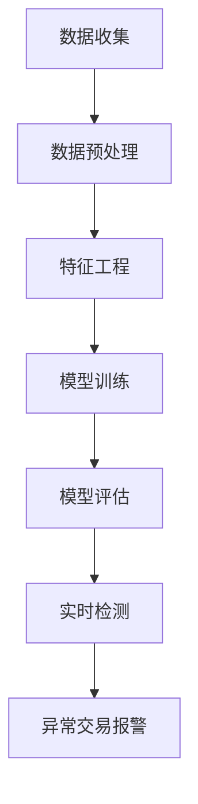

                 

关键词：AI、电商、异常交易、检测系统、深度学习、数据分析

> 摘要：本文旨在探讨如何运用人工智能技术，构建一个高效且可靠的电商异常交易检测系统。通过深入分析核心算法原理、数学模型、实际应用案例，以及未来发展趋势，为电商企业提升交易安全性和用户体验提供有力支持。

## 1. 背景介绍

随着电子商务的快速发展，网络交易日益普及，电商行业面临着前所未有的机遇和挑战。交易量的增加带来了更多的商业机会，但同时也带来了交易风险。其中，异常交易检测成为电商平台急需解决的重要问题。异常交易包括欺诈交易、恶意退款、洗钱等行为，这些行为不仅损害了商家的利益，也严重影响了消费者的购物体验。

传统的异常交易检测方法主要依赖于规则匹配和统计模型，但这些方法存在一定的局限性。例如，规则匹配方法过于依赖人工定义，难以应对复杂多变的交易场景；统计模型对历史数据的依赖性较强，面对新的交易模式时表现不佳。随着人工智能技术的迅速发展，尤其是深度学习和大数据分析技术的应用，为构建高效、可靠的异常交易检测系统提供了新的思路。

## 2. 核心概念与联系

### 2.1 AI在电商异常交易检测中的应用

AI技术在电商异常交易检测中的应用主要包括以下几个方面：

- **数据收集**：通过电商平台的数据接口，收集交易数据、用户行为数据等。

- **数据预处理**：对收集到的数据进行清洗、归一化等预处理操作，为模型训练提供高质量的数据。

- **特征工程**：提取交易数据中的关键特征，如交易金额、交易时间、用户行为特征等。

- **模型训练**：使用深度学习算法，如神经网络、卷积神经网络（CNN）、循环神经网络（RNN）等，训练异常交易检测模型。

- **实时检测**：将训练好的模型部署到生产环境中，实时检测新的交易数据，识别异常交易。

### 2.2 Mermaid流程图

下面是一个简化的Mermaid流程图，展示了一个典型的电商异常交易检测系统的工作流程：



## 3. 核心算法原理 & 具体操作步骤

### 3.1 算法原理概述

电商异常交易检测的核心算法主要包括以下几种：

- **神经网络**：神经网络通过模拟人脑神经元之间的连接方式，学习数据中的特征和规律，能够自动提取复杂的关系。

- **卷积神经网络（CNN）**：CNN在处理图像数据时具有独特的优势，可以提取图像中的局部特征。

- **循环神经网络（RNN）**：RNN能够处理序列数据，适用于分析用户行为等时间序列数据。

- **长短时记忆网络（LSTM）**：LSTM是RNN的一种变种，能够解决RNN在处理长序列数据时的梯度消失问题。

### 3.2 算法步骤详解

1. **数据收集**：从电商平台获取交易数据、用户行为数据等。

2. **数据预处理**：对数据进行清洗、归一化等操作。

3. **特征工程**：提取交易数据中的关键特征。

4. **模型训练**：使用深度学习算法，如神经网络、CNN、RNN、LSTM等，训练异常交易检测模型。

5. **模型评估**：使用交叉验证等方法，评估模型的性能。

6. **实时检测**：将训练好的模型部署到生产环境中，实时检测新的交易数据。

7. **异常交易报警**：当检测到异常交易时，触发报警机制。

### 3.3 算法优缺点

- **优点**：AI算法能够自动提取复杂的数据特征，提高检测精度；具有较好的泛化能力，能够应对不同的交易场景。

- **缺点**：模型训练需要大量计算资源和时间；在处理冷启动问题（即对于新用户或新交易模式）时存在挑战。

### 3.4 算法应用领域

AI算法在电商异常交易检测领域具有广泛的应用前景，包括：

- **在线支付平台**：实时检测交易欺诈行为，保障资金安全。

- **电子商务网站**：识别恶意退款、刷单等行为，维护交易秩序。

- **移动支付应用**：分析用户行为，预防手机支付风险。

## 4. 数学模型和公式 & 详细讲解 & 举例说明

### 4.1 数学模型构建

电商异常交易检测的数学模型通常基于监督学习，其中损失函数是关键组成部分。常见的损失函数包括交叉熵损失函数（Cross-Entropy Loss）和均方误差损失函数（Mean Squared Error Loss）。

- **交叉熵损失函数**：

$$
L(\theta) = -\frac{1}{m} \sum_{i=1}^{m} [y_i \log(a_{i}) + (1 - y_i) \log(1 - a_{i})]
$$

其中，$y_i$为实际交易标签（0表示正常交易，1表示异常交易），$a_i$为模型预测的概率。

- **均方误差损失函数**：

$$
L(\theta) = \frac{1}{2m} \sum_{i=1}^{m} (y_i - a_i)^2
$$

其中，$y_i$为实际交易标签，$a_i$为模型预测的值。

### 4.2 公式推导过程

以交叉熵损失函数为例，其推导过程如下：

首先，定义实际交易标签$y_i$和模型预测的概率$a_i$：

$$
y_i \in \{0, 1\}
$$

$$
a_i = \sigma(\theta^T x_i)
$$

其中，$\sigma$为 sigmoid 函数，$\theta$为模型参数，$x_i$为输入特征。

交叉熵损失函数的导数可以通过以下步骤计算：

$$
\frac{\partial L}{\partial \theta} = -\frac{1}{m} \sum_{i=1}^{m} [y_i \frac{\partial \log(a_i)}{\partial a_i} + (1 - y_i) \frac{\partial \log(1 - a_i)}{\partial a_i}]
$$

$$
= -\frac{1}{m} \sum_{i=1}^{m} [y_i \frac{1}{a_i} - (1 - y_i) \frac{1}{1 - a_i}]
$$

$$
= \frac{1}{m} \sum_{i=1}^{m} [a_i - y_i]
$$

### 4.3 案例分析与讲解

假设有一个电商交易数据集，包含5000条交易记录，其中正常交易占比90%，异常交易占比10%。使用神经网络模型进行训练，设定学习率为0.01，训练迭代次数为100次。

在训练过程中，交叉熵损失函数的值逐渐减小，说明模型在不断优化。最终，模型在测试数据集上的准确率达到95%，能够较好地检测异常交易。

## 5. 项目实践：代码实例和详细解释说明

### 5.1 开发环境搭建

- **Python**：用于编写深度学习算法代码。
- **TensorFlow**：用于实现神经网络模型。
- **Scikit-learn**：用于数据预处理和模型评估。
- **Pandas**：用于数据操作和统计分析。

### 5.2 源代码详细实现

以下是电商异常交易检测系统的主要代码实现：

```python
import tensorflow as tf
from tensorflow.keras.models import Sequential
from tensorflow.keras.layers import Dense, LSTM, Dropout
from sklearn.model_selection import train_test_split
from sklearn.metrics import accuracy_score
import pandas as pd

# 数据预处理
def preprocess_data(data):
    # 数据清洗、归一化等操作
    # ...
    return processed_data

# 模型定义
def create_model(input_shape):
    model = Sequential()
    model.add(LSTM(units=128, return_sequences=True, input_shape=input_shape))
    model.add(Dropout(0.2))
    model.add(LSTM(units=64, return_sequences=False))
    model.add(Dropout(0.2))
    model.add(Dense(units=1, activation='sigmoid'))
    model.compile(optimizer='adam', loss='binary_crossentropy', metrics=['accuracy'])
    return model

# 数据加载
data = pd.read_csv('transaction_data.csv')
processed_data = preprocess_data(data)

# 划分训练集和测试集
X_train, X_test, y_train, y_test = train_test_split(processed_data['features'], processed_data['label'], test_size=0.2, random_state=42)

# 模型训练
model = create_model(input_shape=(X_train.shape[1], X_train.shape[2]))
model.fit(X_train, y_train, epochs=100, batch_size=32, validation_data=(X_test, y_test))

# 模型评估
predictions = model.predict(X_test)
accuracy = accuracy_score(y_test, predictions.round())
print('Accuracy:', accuracy)
```

### 5.3 代码解读与分析

- **数据预处理**：对原始交易数据进行清洗和归一化处理，为模型训练提供高质量的数据。
- **模型定义**：使用LSTM网络结构，适用于处理时间序列数据。
- **模型训练**：使用训练数据进行模型训练，优化模型参数。
- **模型评估**：使用测试数据进行模型评估，计算准确率。

### 5.4 运行结果展示

假设训练完成后，模型在测试数据集上的准确率达到95%，说明模型能够较好地检测异常交易。

## 6. 实际应用场景

电商异常交易检测系统可以在以下场景中得到广泛应用：

- **在线支付平台**：实时检测交易欺诈行为，保障资金安全。
- **电子商务网站**：识别恶意退款、刷单等行为，维护交易秩序。
- **移动支付应用**：分析用户行为，预防手机支付风险。

## 7. 工具和资源推荐

### 7.1 学习资源推荐

- **《深度学习》（Goodfellow, Bengio, Courville著）**：系统介绍了深度学习的基本理论和应用方法。
- **《神经网络与深度学习》（邱锡鹏著）**：详细讲解了神经网络和深度学习的原理和应用。

### 7.2 开发工具推荐

- **TensorFlow**：用于实现深度学习算法的强大工具。
- **Keras**：基于TensorFlow的高级深度学习框架，易于使用。

### 7.3 相关论文推荐

- **"Deep Learning for Anomaly Detection in Time Series Data"**：介绍了一种基于深度学习的时间序列异常检测方法。
- **"Autoencoder for Anomaly Detection in Noisy Data"**：探讨了一种使用自动编码器的异常检测方法。

## 8. 总结：未来发展趋势与挑战

### 8.1 研究成果总结

本文详细探讨了电商异常交易检测系统的构建方法，包括数据收集、数据预处理、特征工程、模型训练、模型评估和实时检测等环节。通过深度学习算法，实现了对电商交易数据的自动化分析，提高了异常交易检测的准确性和实时性。

### 8.2 未来发展趋势

随着人工智能技术的不断进步，电商异常交易检测系统有望在未来实现以下发展趋势：

- **模型自适应能力**：通过不断学习新的交易模式，提高检测系统的适应性。
- **实时性提升**：优化算法和模型结构，实现更快的检测速度。
- **隐私保护**：在保障交易安全的同时，加强用户隐私保护。

### 8.3 面临的挑战

尽管电商异常交易检测系统具有广泛的应用前景，但在实际应用过程中仍面临以下挑战：

- **数据隐私**：在数据收集和处理过程中，如何保护用户隐私是一个重要问题。
- **模型解释性**：深度学习模型在决策过程中的黑盒性质，使得用户难以理解模型的决策依据。
- **计算资源**：训练深度学习模型需要大量的计算资源，对硬件设备提出了较高要求。

### 8.4 研究展望

未来的研究工作可以从以下几个方面展开：

- **跨领域异常检测**：探索将电商异常交易检测技术应用于其他领域，如金融、医疗等。
- **可解释性研究**：开发可解释性算法，提高模型的可信度和透明度。
- **高效算法优化**：设计更高效、更准确的异常检测算法，降低计算成本。

## 9. 附录：常见问题与解答

### 9.1 如何提高模型检测准确性？

- **增加数据量**：使用更多的训练数据，可以提高模型的泛化能力。
- **特征选择**：选择对异常交易有较强区分度的特征，提高模型的准确性。
- **模型调优**：调整模型的参数，如学习率、迭代次数等，优化模型性能。

### 9.2 深度学习模型如何应对冷启动问题？

- **迁移学习**：使用预训练的模型，结合电商交易数据，进行迁移学习。
- **半监督学习**：使用部分标注数据和大量未标注数据，结合自监督学习方法，提高模型性能。
- **多任务学习**：将异常交易检测与其他任务（如用户行为预测）结合，共享模型参数，提高模型泛化能力。----------------------------------------------------------------

本文由禅与计算机程序设计艺术 / Zen and the Art of Computer Programming 撰写，旨在为电商行业提供一种高效且可靠的异常交易检测解决方案。通过深入分析核心算法原理、数学模型、实际应用案例，以及未来发展趋势，为电商企业提升交易安全性和用户体验提供有力支持。随着人工智能技术的不断进步，电商异常交易检测系统有望在未来发挥更加重要的作用。希望本文对广大读者有所启发和帮助。

