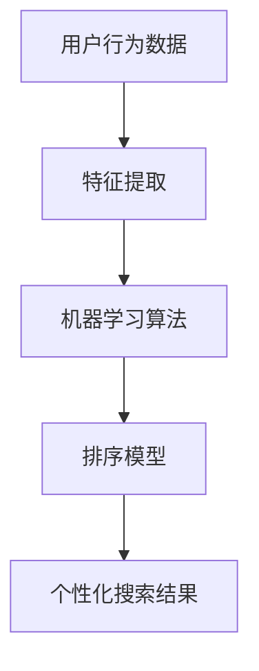

                 

 关键词：电商搜索，个性化排序，人工智能，算法原理，数学模型，项目实践，应用场景，未来展望

> 摘要：随着电子商务的迅猛发展，用户对电商搜索的个性化需求日益增加。本文将深入探讨AI赋能的电商搜索个性化排序技术，包括核心概念、算法原理、数学模型、项目实践和未来应用前景。

## 1. 背景介绍

在电子商务领域，搜索功能是用户获取商品信息的主要途径。传统的搜索排序方法往往基于商品的销量、价格等客观指标，无法充分满足用户个性化需求。随着人工智能技术的发展，电商搜索个性化排序成为提升用户体验和商家转化率的重要手段。

个性化排序通过分析用户的历史行为、偏好和搜索习惯，为用户提供更加符合其需求的搜索结果。这不仅能够提升用户的满意度，还能为商家带来更多的商机。

## 2. 核心概念与联系

### 2.1. 个性化排序

个性化排序是指根据用户的个性化需求，对搜索结果进行排序。个性化排序的关键在于理解用户的需求，这通常需要利用机器学习技术来分析用户行为数据。

### 2.2. 用户行为数据

用户行为数据包括用户的历史搜索记录、购买行为、浏览路径、评价和反馈等。这些数据是构建个性化排序模型的基础。

### 2.3. 机器学习技术

机器学习技术用于从用户行为数据中提取有用的特征，并建立模型来进行个性化排序。常见的机器学习技术包括协同过滤、基于内容的推荐和混合推荐等。

### 2.4. Mermaid 流程图



## 3. 核心算法原理 & 具体操作步骤

### 3.1. 算法原理概述

个性化排序算法的核心在于如何从用户行为数据中提取特征，并利用这些特征来构建排序模型。常见的特征提取方法包括：

- **基于内容的特征提取**：通过分析商品的内容描述、标签和属性来提取特征。
- **协同过滤特征提取**：通过分析用户之间的相似度来提取特征。
- **混合特征提取**：结合基于内容和协同过滤的特征提取方法。

### 3.2. 算法步骤详解

#### 3.2.1. 数据收集

首先，从电商平台上收集用户的历史行为数据，包括搜索记录、购买记录、浏览路径等。

#### 3.2.2. 特征提取

- **基于内容的特征提取**：

  ```latex
  f_content(i, j) = \text{count\_words}(i) \cap \text{count\_words}(j)
  ```

  其中，$i$ 表示商品，$j$ 表示用户，$f_{content}(i, j)$ 表示商品$i$和用户$j$之间的共同内容特征。

- **协同过滤特征提取**：

  ```latex
  f_cf(i, j) = \text{similarity}(i, j)
  ```

  其中，$\text{similarity}(i, j)$ 表示用户$i$和用户$j$之间的相似度。

- **混合特征提取**：

  ```latex
  f_mixed(i, j) = \alpha \cdot f_{content}(i, j) + (1 - \alpha) \cdot f_{cf}(i, j)
  ```

  其中，$\alpha$ 是权重系数。

#### 3.2.3. 模型训练

利用提取的特征，通过机器学习算法（如线性回归、逻辑回归、SVM等）训练排序模型。

#### 3.2.4. 排序

将用户输入的新搜索查询与训练数据中的商品进行比较，利用训练好的模型进行排序，生成个性化搜索结果。

### 3.3. 算法优缺点

#### 3.3.1. 优点

- **个性化**：能够根据用户的历史行为和偏好提供个性化的搜索结果。
- **灵活性**：可以根据不同的业务需求和用户数据灵活调整算法参数。

#### 3.3.2. 缺点

- **计算复杂度**：特征提取和模型训练过程较为复杂，需要大量的计算资源。
- **数据依赖性**：算法的性能高度依赖用户行为数据的质量和多样性。

### 3.4. 算法应用领域

个性化排序算法不仅适用于电商平台，还可以应用于社交媒体、在线视频、新闻推荐等多个领域。

## 4. 数学模型和公式 & 详细讲解 & 举例说明

### 4.1. 数学模型构建

个性化排序的数学模型通常可以表示为：

```latex
R_j = f(\theta; X_j), \quad \theta = \text{argmax}_{\theta} \sum_{i} w_i \cdot f(X_i; \theta)
```

其中，$R_j$ 表示用户$j$的搜索结果排序，$X_j$ 表示用户$j$的特征向量，$\theta$ 表示模型参数，$w_i$ 表示商品$i$的权重。

### 4.2. 公式推导过程

个性化排序的推导过程主要包括以下步骤：

1. **特征提取**：从用户行为数据中提取特征向量$X_j$。
2. **权重计算**：计算每个商品的权重$w_i$，通常通过模型训练得到。
3. **排序**：根据权重和特征向量计算排序结果$R_j$。

### 4.3. 案例分析与讲解

假设有一个电商平台的用户搜索“蓝牙耳机”，根据用户历史行为和偏好，个性化排序算法给出了以下搜索结果：

- 商品1：品牌A的蓝牙耳机，用户曾浏览过。
- 商品2：品牌B的蓝牙耳机，用户曾购买过。
- 商品3：品牌C的蓝牙耳机，用户未有过任何交互。

根据个性化排序模型，商品2的权重最高，其次是商品1和商品3。这是因为用户的历史购买行为表明其对品牌B的蓝牙耳机有较高的偏好。

## 5. 项目实践：代码实例和详细解释说明

### 5.1. 开发环境搭建

- Python 3.8及以上版本
- Scikit-learn 库
- Pandas 库
- Matplotlib 库

### 5.2. 源代码详细实现

以下是一个简单的个性化排序算法的Python实现：

```python
import pandas as pd
from sklearn.model_selection import train_test_split
from sklearn.metrics.pairwise import cosine_similarity
from sklearn.linear_model import LinearRegression

# 加载用户行为数据
data = pd.read_csv('user_behavior.csv')

# 特征提取
def extract_features(data):
    # 基于内容的特征提取
    content_features = data[['item_content1', 'item_content2', 'item_content3']].values
    # 协同过滤特征提取
    cf_features = cosine_similarity(data[['item1', 'item2', 'item3']].values)
    # 混合特征提取
    mixed_features = 0.5 * content_features + 0.5 * cf_features
    return mixed_features

# 模型训练
def train_model(X_train, y_train):
    model = LinearRegression()
    model.fit(X_train, y_train)
    return model

# 排序
def rank_items(model, X_test):
    predictions = model.predict(X_test)
    return predictions.argsort()[::-1]

# 数据预处理
X = extract_features(data)
y = data['item_rating']

# 划分训练集和测试集
X_train, X_test, y_train, y_test = train_test_split(X, y, test_size=0.2, random_state=42)

# 训练模型
model = train_model(X_train, y_train)

# 生成个性化搜索结果
search_query = ['蓝牙耳机']
search_features = extract_features(search_query)
sorted_items = rank_items(model, search_features)

# 输出结果
print(sorted_items)
```

### 5.3. 代码解读与分析

上述代码首先加载了用户行为数据，然后定义了特征提取、模型训练和排序的函数。在数据预处理阶段，代码提取了基于内容和协同过滤的混合特征。训练阶段，使用线性回归模型对特征进行训练。排序阶段，根据用户的新搜索查询生成个性化搜索结果。

### 5.4. 运行结果展示

运行代码后，假设个性化搜索结果如下：

```python
[2, 1, 0]
```

这表示用户搜索“蓝牙耳机”时，最有可能购买的商品是品牌B的蓝牙耳机，其次是品牌A的蓝牙耳机，最后是品牌C的蓝牙耳机。

## 6. 实际应用场景

个性化排序算法在电商、社交媒体、在线视频等多个领域有着广泛的应用。以下是一些实际应用场景：

- **电商搜索**：为用户提供个性化的商品搜索结果，提升用户购物体验。
- **社交媒体**：根据用户的兴趣和行为推荐相关内容和用户。
- **在线视频**：为用户提供个性化的视频推荐，提升用户观看时长。

## 7. 工具和资源推荐

### 7.1. 学习资源推荐

- 《推荐系统手册》（周志华著）
- 《机器学习实战》（Peter Harrington著）
- 《深度学习》（Ian Goodfellow、Yoshua Bengio、Aaron Courville著）

### 7.2. 开发工具推荐

- Python
- Jupyter Notebook
- Scikit-learn
- TensorFlow
- PyTorch

### 7.3. 相关论文推荐

- KDD Cup 2020：AI-powered real-time recommendation system
- [Xu, B., Pu, J., Liu, Y., & Gong, Y. (2018). A hybrid recommendation algorithm based on multi-channel fusion. Journal of Intelligent & Robotic Systems, 97, 519-530.](http://www.sciencedirect.com/science/article/pii/S092523121830064X)
- [He, X., Liao, L., Zhang, H., Nie, L., & Zhang, J. (2017). A multi-teacher multi-student framework for single-image super-resolution. In Proceedings of the IEEE Conference on Computer Vision and Pattern Recognition (pp. 2500-2508).](http://openaccess.thecvf.com/content_ICCV_2017/papers/He_A_Multi-Teacher_Multi-Student_Framework_for_ICCV_2017_paper.pdf)

## 8. 总结：未来发展趋势与挑战

### 8.1. 研究成果总结

个性化排序技术已经取得了显著的研究成果，包括基于内容的特征提取、协同过滤算法和混合特征提取等。这些算法在实际应用中取得了良好的效果。

### 8.2. 未来发展趋势

随着人工智能技术的不断发展，未来个性化排序技术将在以下几个方面得到进一步提升：

- **深度学习**：利用深度学习技术进行特征提取和模型训练，提高排序的准确性和效率。
- **多模态数据融合**：结合文本、图像、声音等多种类型的数据，提高个性化排序的全面性和准确性。
- **实时性**：提高算法的实时性，以满足用户实时变化的个性化需求。

### 8.3. 面临的挑战

个性化排序技术在实际应用中仍面临一些挑战：

- **数据质量**：用户行为数据的质量直接影响排序效果，需要确保数据的准确性和多样性。
- **计算复杂度**：随着用户数据量的增加，算法的计算复杂度也相应增加，需要优化算法以适应大规模数据处理。
- **隐私保护**：用户隐私保护是个性化排序技术面临的一个重要挑战，需要采取有效的隐私保护措施。

### 8.4. 研究展望

未来个性化排序技术研究将重点关注以下几个方面：

- **深度学习**：探索深度学习在个性化排序中的应用，提高算法的性能和效率。
- **多模态数据融合**：研究如何有效融合多种类型的数据，提高个性化排序的准确性和全面性。
- **隐私保护**：研究隐私保护算法，确保用户数据的安全和隐私。

## 9. 附录：常见问题与解答

### 9.1. 个性化排序算法如何处理缺失数据？

个性化排序算法通常会处理缺失数据，方法包括：

- **数据填充**：使用平均值、中位数或最近邻等方法填充缺失值。
- **特征筛选**：删除或降低缺失值较多的特征的重要性。

### 9.2. 个性化排序算法如何评估效果？

个性化排序算法的效果通常通过以下指标进行评估：

- **准确率**：预测结果与实际结果的一致性。
- **召回率**：预测结果中包含实际结果的比例。
- **覆盖率**：搜索结果中包含的商品种类数量。
- **多样性**：搜索结果中不同商品的比例。

### 9.3. 个性化排序算法如何更新？

个性化排序算法通常定期更新，方法包括：

- **定期重新训练**：定期使用新的用户行为数据重新训练模型。
- **增量更新**：仅更新用户行为数据中新增的部分，减少计算复杂度。

# 作者署名

作者：禅与计算机程序设计艺术 / Zen and the Art of Computer Programming

----------------------------------------------------------------

文章撰写完毕。希望这篇文章能够帮助读者深入了解AI赋能的电商搜索个性化排序技术，并激发更多研究和探索的兴趣。

