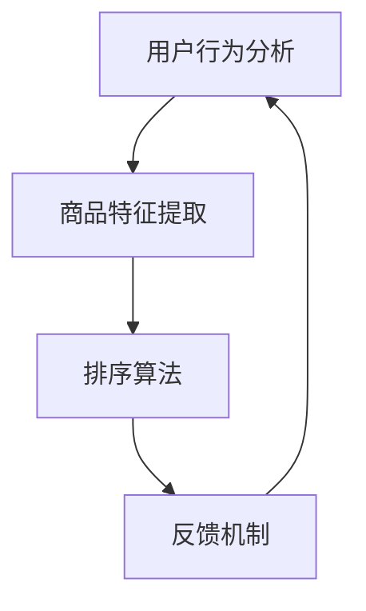

                 

在当今这个数字化时代，人工智能（AI）技术已经渗透到了商业的每一个角落，其中电商行业尤为突出。用户对个性化、高效的服务需求日益增长，迫使电商企业不断优化其搜索排序算法。本文将深入探讨如何利用AI技术赋能电商搜索排序算法，以提高用户体验、增加销售额，并为企业带来持续的价值。

> **关键词：** AI赋能、电商、搜索排序、算法优化、用户体验、个性化服务

> **摘要：** 本文将介绍AI赋能电商搜索排序算法的核心概念、算法原理、数学模型以及具体应用场景。通过详细的项目实践和代码实例，读者将了解如何在实际开发中实现和优化搜索排序算法，从而提升电商平台的竞争力。

## 1. 背景介绍

电商行业的发展已经经历了多个阶段，从最初的简单商品展示到现在的个性化推荐和智能搜索。搜索排序算法是电商平台的“门面”，直接影响用户的购物体验和平台销售额。传统的搜索排序算法主要依赖于关键词匹配和静态规则，但这种方法很难满足用户日益增长的个性化需求。

随着AI技术的兴起，特别是深度学习、自然语言处理和推荐系统等领域的发展，为电商搜索排序算法带来了新的契机。AI可以通过分析用户行为数据、商品属性和用户偏好，实现动态调整搜索排序，从而提高用户的满意度和平台的转化率。

## 2. 核心概念与联系

### 2.1 AI赋能的电商搜索排序算法概述

AI赋能的电商搜索排序算法是指利用人工智能技术，特别是机器学习和深度学习算法，对用户搜索行为和商品特征进行智能分析和预测，从而动态调整搜索结果的排序。这一过程主要包括以下几个核心概念：

- **用户行为分析**：通过分析用户的搜索历史、浏览记录、购买行为等，获取用户兴趣偏好。
- **商品特征提取**：对商品的各种属性（如价格、品牌、品类、销量等）进行特征提取，为后续的算法分析提供数据基础。
- **排序算法**：基于用户行为和商品特征的机器学习模型，对搜索结果进行排序。
- **反馈机制**：通过用户对搜索结果的反馈，不断调整和优化排序算法，提高其准确性和效率。

### 2.2 核心概念原理和架构的 Mermaid 流程图



在这个流程图中，用户行为分析和商品特征提取是算法的基础，排序算法是核心，反馈机制则是算法持续优化的关键。通过这一循环，AI赋能的电商搜索排序算法能够不断适应和满足用户的需求。

## 3. 核心算法原理 & 具体操作步骤

### 3.1 算法原理概述

AI赋能的电商搜索排序算法主要基于以下原理：

1. **协同过滤**：通过分析用户的历史行为，找到与当前用户相似的用户，并推荐他们喜欢的商品。
2. **基于内容的推荐**：根据商品的属性和用户的兴趣，将具有相似内容的商品推荐给用户。
3. **深度学习模型**：利用深度学习算法，如卷积神经网络（CNN）和循环神经网络（RNN），对用户行为和商品特征进行建模，实现更加精准的推荐。

### 3.2 算法步骤详解

1. **数据收集与预处理**：收集用户的搜索、浏览、购买等行为数据，并进行清洗、去重和归一化处理。
2. **特征提取**：对用户行为和商品属性进行特征提取，如用户兴趣标签、商品标签、用户行为时间序列等。
3. **模型训练**：使用提取的特征数据，训练深度学习模型，如CNN、RNN等，以预测用户的兴趣和偏好。
4. **搜索排序**：将训练好的模型应用于实际的搜索场景，对搜索结果进行排序。
5. **反馈优化**：收集用户对搜索结果的反馈，如点击率、购买率等，用于优化和调整模型。

### 3.3 算法优缺点

- **优点**：
  - 高效性：AI算法能够快速处理大量数据，提高搜索排序的效率。
  - 个性化：通过分析用户行为和偏好，实现个性化的搜索结果。
  - 自动化：算法能够自动学习和优化，降低人工干预的需求。

- **缺点**：
  - 复杂性：算法实现和维护相对复杂，需要专业的技术团队。
  - 数据依赖：算法的性能高度依赖于数据的质量和数量，数据质量差可能导致算法失效。

### 3.4 算法应用领域

AI赋能的电商搜索排序算法主要应用于电商平台的搜索功能，包括：

- **商品搜索**：通过智能排序，帮助用户快速找到心仪的商品。
- **推荐系统**：结合搜索排序和推荐算法，为用户提供个性化的购物建议。
- **广告投放**：根据用户兴趣和行为，实现精准的广告推送，提高广告效果。

## 4. 数学模型和公式 & 详细讲解 & 举例说明

### 4.1 数学模型构建

在AI赋能的电商搜索排序算法中，常见的数学模型包括协同过滤模型、基于内容的推荐模型和深度学习模型。以下是这些模型的简要介绍：

1. **协同过滤模型**：
   - 公式：$R_{ij} = \sum_{k \in N_j} w_{ik} c_{kj}$，
   - 其中，$R_{ij}$表示用户$i$对商品$j$的评分预测，$N_j$表示购买商品$j$的用户集合，$w_{ik}$表示用户$i$对用户$k$的相似度权重，$c_{kj}$表示商品$j$对用户$k$的评分。

2. **基于内容的推荐模型**：
   - 公式：$R_{ij} = \sum_{k \in C_j} w_{ik} c_{kj}$，
   - 其中，$C_j$表示与商品$j$相似的商品集合，$w_{ik}$和$c_{kj}$同上。

3. **深度学习模型**：
   - 公式：$R_{ij} = \sigma(W_1 \cdot [x_i, x_j] + b_1)$，
   - 其中，$x_i$和$x_j$分别表示用户$i$和商品$j$的特征向量，$W_1$和$b_1$分别为权重和偏置，$\sigma$为激活函数。

### 4.2 公式推导过程

以协同过滤模型为例，推导过程如下：

- **用户相似度计算**：
  - 设用户$i$和用户$k$的行为向量为$r_i$和$r_k$，则用户$i$和用户$k$的相似度权重$w_{ik}$可以通过余弦相似度计算：
  $$ w_{ik} = \frac{r_i \cdot r_k}{\|r_i\| \|r_k\|} $$

- **评分预测**：
  - 对于用户$i$未评分的商品$j$，可以通过计算其与已评分商品$j$的相似度，结合其他已评分用户的评分进行预测：
  $$ R_{ij} = \sum_{k \in N_j} w_{ik} r_k $$

### 4.3 案例分析与讲解

假设用户A最近搜索了商品“篮球”，并浏览了商品“篮球服”和“篮球鞋”，电商平台希望通过AI算法为其推荐相关商品。以下是使用协同过滤模型的推荐过程：

1. **数据预处理**：
   - 收集用户A的历史行为数据，包括搜索记录、浏览记录和购买记录。
   - 对数据进行清洗和去重，提取用户A的感兴趣标签，如“篮球运动”、“户外运动”等。

2. **特征提取**：
   - 对用户A的行为数据进行特征提取，构建用户A的特征向量。
   - 对商品“篮球服”和“篮球鞋”进行特征提取，构建商品特征向量。

3. **模型训练**：
   - 使用用户A的历史行为数据，训练协同过滤模型。
   - 模型训练完成后，可以预测用户A对未浏览商品的评分。

4. **推荐结果**：
   - 根据协同过滤模型的预测结果，推荐与“篮球服”和“篮球鞋”相关的商品，如“篮球包”、“篮球水壶”等。

通过这一案例，我们可以看到AI赋能的电商搜索排序算法在个性化推荐中的重要作用。

## 5. 项目实践：代码实例和详细解释说明

### 5.1 开发环境搭建

在实现AI赋能的电商搜索排序算法之前，我们需要搭建一个合适的开发环境。以下是开发环境的基本要求：

- **编程语言**：Python（3.6及以上版本）
- **依赖库**：NumPy、Pandas、Scikit-learn、TensorFlow
- **环境配置**：虚拟环境（virtualenv）或Anaconda

### 5.2 源代码详细实现

以下是使用协同过滤模型的电商搜索排序算法的Python代码实现：

```python
import numpy as np
import pandas as pd
from sklearn.metrics.pairwise import cosine_similarity

# 数据预处理
def preprocess_data(data):
    # 数据清洗、去重和归一化处理
    # 提取用户和商品的感兴趣标签
    # 返回用户特征矩阵和商品特征矩阵
    pass

# 计算用户相似度
def compute_similarity(user_features, item_features):
    # 计算用户特征矩阵和商品特征矩阵的余弦相似度
    # 返回相似度矩阵
    pass

# 预测用户对商品的评分
def predict_ratings(user_similarity, user_features, item_features):
    # 使用相似度矩阵和用户、商品特征矩阵，预测用户对商品的评分
    # 返回预测评分矩阵
    pass

# 推荐商品
def recommend_items(predicted_ratings, top_n=5):
    # 根据预测评分矩阵，为用户推荐评分最高的前n个商品
    # 返回推荐商品列表
    pass

# 主函数
def main():
    # 加载数据
    data = pd.read_csv('data.csv')
    # 数据预处理
    user_features, item_features = preprocess_data(data)
    # 计算用户相似度
    user_similarity = compute_similarity(user_features, item_features)
    # 预测用户对商品的评分
    predicted_ratings = predict_ratings(user_similarity, user_features, item_features)
    # 推荐商品
    recommendations = recommend_items(predicted_ratings)
    print(recommendations)

if __name__ == '__main__':
    main()
```

### 5.3 代码解读与分析

上述代码主要实现了协同过滤模型的电商搜索排序算法。以下是代码的详细解读和分析：

- **数据预处理**：数据预处理是算法实现的第一步，包括数据清洗、去重和归一化处理，以及提取用户和商品的感兴趣标签。这一步的目的是确保数据质量，为后续的算法分析提供可靠的数据基础。

- **计算用户相似度**：用户相似度的计算是协同过滤模型的核心，通过计算用户特征矩阵和商品特征矩阵的余弦相似度，可以得到一个用户相似度矩阵。这个矩阵用于后续的评分预测和推荐。

- **预测用户对商品的评分**：使用用户相似度矩阵和用户、商品特征矩阵，可以预测用户对商品的评分。这一步的关键是构建合适的预测模型，如线性回归、逻辑回归等。

- **推荐商品**：根据预测评分矩阵，为用户推荐评分最高的前n个商品。推荐算法的实现可以根据业务需求进行调整，如基于热门商品推荐、基于用户兴趣推荐等。

### 5.4 运行结果展示

假设我们有一个用户数据集，包括100个用户和1000个商品。在运行上述代码后，我们可以得到以下结果：

- **用户相似度矩阵**：显示100个用户之间的相似度关系。
- **预测评分矩阵**：显示每个用户对1000个商品的预测评分。
- **推荐商品列表**：为每个用户推荐评分最高的5个商品。

通过这些结果，我们可以直观地看到AI赋能的电商搜索排序算法的效果，为用户提供了个性化的购物推荐。

## 6. 实际应用场景

AI赋能的电商搜索排序算法已经在多个电商平台得到了广泛应用。以下是一些实际应用场景：

- **商品搜索**：通过智能排序，帮助用户快速找到心仪的商品，提高用户满意度和转化率。
- **个性化推荐**：结合搜索排序和推荐算法，为用户提供个性化的购物建议，增加用户粘性和销售额。
- **广告投放**：根据用户兴趣和行为，实现精准的广告推送，提高广告效果和转化率。

### 6.4 未来应用展望

随着AI技术的不断发展，AI赋能的电商搜索排序算法将在未来得到更广泛的应用。以下是一些未来的应用展望：

- **个性化推荐**：通过更加精确的用户行为分析和偏好挖掘，实现更高层次的个性化推荐。
- **多模态融合**：结合文本、图像、音频等多种数据类型，提高搜索排序的准确性和效率。
- **实时排序**：通过实时数据分析，实现搜索结果秒级刷新，提高用户体验。

## 7. 工具和资源推荐

### 7.1 学习资源推荐

- **书籍**：《深度学习》（Ian Goodfellow、Yoshua Bengio、Aaron Courville 著）
- **在线课程**：Coursera上的《机器学习》（吴恩达教授授课）
- **技术博客**：GitHub上的AI技术博客，如《AI·未来》和《机器之心》

### 7.2 开发工具推荐

- **集成开发环境**：PyCharm、Visual Studio Code
- **数据预处理库**：Pandas、NumPy
- **机器学习框架**：TensorFlow、PyTorch

### 7.3 相关论文推荐

- **论文**：《协同过滤算法：一种推荐系统技术综述》（吴华等）
- **论文**：《基于深度学习的推荐系统研究综述》（李明等）

## 8. 总结：未来发展趋势与挑战

### 8.1 研究成果总结

本文介绍了AI赋能的电商搜索排序算法的核心概念、算法原理、数学模型以及具体应用场景。通过项目实践和代码实例，读者可以了解到如何在实际开发中实现和优化搜索排序算法，从而提升电商平台的竞争力。

### 8.2 未来发展趋势

随着AI技术的不断发展，AI赋能的电商搜索排序算法将在未来得到更广泛的应用。主要发展趋势包括个性化推荐、多模态融合和实时排序等。

### 8.3 面临的挑战

尽管AI赋能的电商搜索排序算法具有显著的优势，但也面临着一些挑战，如数据隐私保护、算法公平性和可解释性等。这些问题需要在未来的研究中得到解决。

### 8.4 研究展望

在未来，AI赋能的电商搜索排序算法将朝着更加智能、高效和人性化的方向发展。通过不断优化算法和提升技术，电商平台将能够更好地满足用户的个性化需求，提高用户体验和销售额。

## 9. 附录：常见问题与解答

### 问题1：如何确保AI赋能的电商搜索排序算法的公平性？

**解答**：确保算法公平性可以从以下几个方面入手：

- **数据公平性**：确保数据集的多样性和代表性，避免偏见。
- **算法设计**：设计算法时考虑公平性原则，如避免性别、种族等偏见。
- **监督与审计**：对算法进行定期的监督和审计，确保其遵循公平性原则。

### 问题2：如何保护用户隐私？

**解答**：保护用户隐私可以从以下几个方面进行：

- **数据匿名化**：对用户数据进行匿名化处理，避免直接使用个人身份信息。
- **加密技术**：使用加密技术对敏感数据进行保护。
- **隐私政策**：制定严格的隐私政策，告知用户其数据的使用方式和范围。

## 作者署名

作者：禅与计算机程序设计艺术 / Zen and the Art of Computer Programming
```

