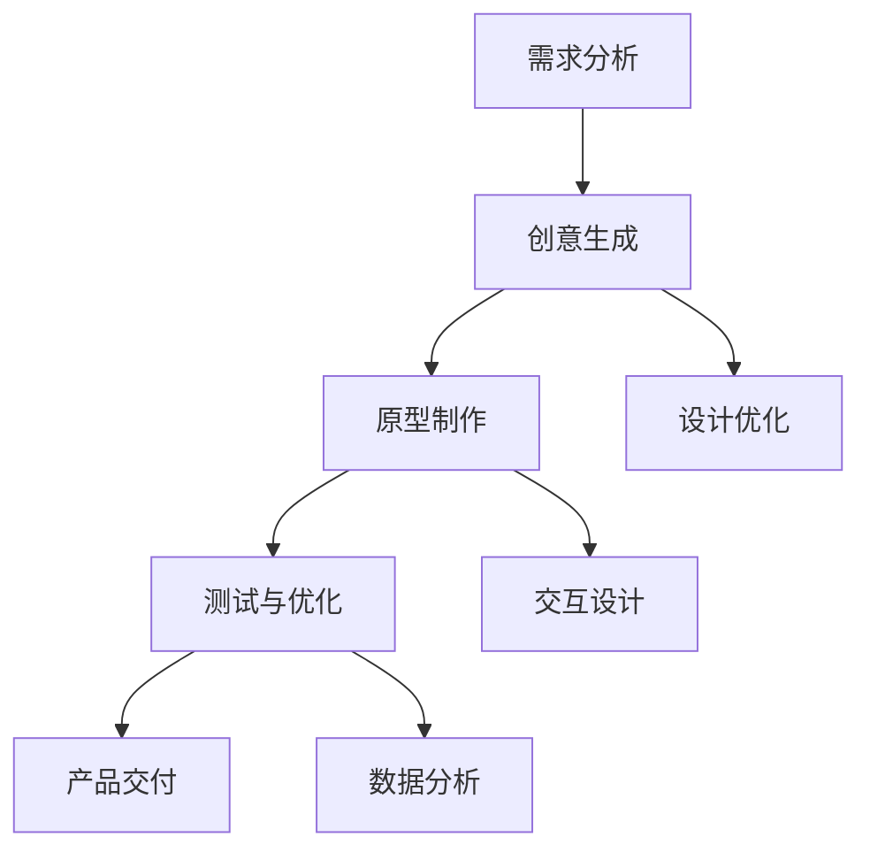

                 

本文将探讨如何通过AI技术辅助产品设计流程，优化各个环节，提高设计效率和质量。AI技术在产品设计中的应用正在逐渐深入，从辅助生成创意到自动优化设计，AI正成为设计师的得力助手。本文将从以下几个方面展开讨论：

1. **背景介绍**：介绍AI在产品设计中的应用背景及其重要性。
2. **核心概念与联系**：阐述AI辅助产品设计的基本概念和流程，并通过Mermaid流程图展示设计流程的关键节点。
3. **核心算法原理 & 具体操作步骤**：详细讲解AI在产品设计中的核心算法原理和具体操作步骤，以及算法的优缺点和应用领域。
4. **数学模型和公式 & 详细讲解 & 举例说明**：介绍AI辅助产品设计中的数学模型和公式，并通过实例进行详细讲解。
5. **项目实践：代码实例和详细解释说明**：提供具体的AI辅助产品设计项目实践案例，并详细解读代码实现过程。
6. **实际应用场景**：分析AI辅助产品设计在不同行业和场景中的实际应用。
7. **未来应用展望**：探讨AI辅助产品设计的发展趋势和未来前景。
8. **工具和资源推荐**：推荐学习资源和开发工具，以及相关的论文资源。
9. **总结：未来发展趋势与挑战**：总结研究成果，展望未来发展趋势，分析面临的挑战。
10. **附录：常见问题与解答**：回答读者可能关心的问题。

## 1. 背景介绍

近年来，随着AI技术的飞速发展，其在各个行业的应用也日益广泛。产品设计作为创新和创造的核心环节，自然也不例外。AI技术为产品设计带来了新的工具和方法，使得设计师能够更高效地进行工作，同时也能提升设计质量。

### AI在产品设计中的应用

AI在产品设计中的应用主要体现在以下几个方面：

1. **创意生成**：通过深度学习算法，AI可以分析大量的设计数据，自动生成新的设计创意。
2. **设计优化**：利用优化算法，AI可以自动对设计进行优化，找到最佳的设计方案。
3. **交互设计**：通过自然语言处理技术，AI可以帮助设计师进行交互设计，提升用户体验。
4. **数据处理**：AI可以处理大量的设计数据，帮助设计师进行数据分析和决策支持。

### AI在产品设计中的重要性

AI技术的重要性体现在以下几个方面：

1. **提高效率**：AI可以自动化许多重复性和繁琐的工作，提高设计效率。
2. **提升质量**：通过算法优化和数据分析，AI可以提升设计质量，减少错误和缺陷。
3. **拓宽思路**：AI可以生成大量的设计创意，帮助设计师拓宽思路，找到更好的解决方案。
4. **降低成本**：AI可以减少人力成本，同时提高设计资源的利用率。

## 2. 核心概念与联系

### AI辅助产品设计的基本概念

在讨论AI辅助产品设计的流程之前，我们首先需要了解一些核心概念。

1. **产品设计**：产品设计是指通过系统化和规范化的方法，创建和实现产品定义的过程。
2. **AI技术**：AI技术主要包括机器学习、深度学习、自然语言处理、优化算法等。
3. **设计流程**：设计流程是指从创意生成到产品交付的整个过程，包括需求分析、创意设计、原型制作、测试与优化等环节。

### 设计流程的Mermaid流程图

以下是一个简单的Mermaid流程图，展示了AI辅助产品设计的流程关键节点：



### 流程解释

- **需求分析**：这是设计流程的起点，通过收集和分析用户需求，明确产品设计的目标和方向。
- **创意生成**：利用AI技术，设计师可以快速生成多种设计创意，为后续的设计提供参考。
- **原型制作**：基于创意生成的设计方案，制作原型，以便进行用户体验测试。
- **设计优化**：通过AI算法，对设计进行优化，找到最佳的设计方案。
- **交互设计**：利用自然语言处理技术，AI可以帮助设计师进行交互设计，提高用户体验。
- **测试与优化**：通过用户测试和数据分析，对设计进行迭代优化。
- **产品交付**：完成设计后的最后一步，将设计交付给生产或开发团队进行产品化。

## 3. 核心算法原理 & 具体操作步骤

### 3.1 算法原理概述

在AI辅助产品设计中，核心算法主要包括以下几种：

1. **生成对抗网络（GAN）**：GAN是一种无监督学习模型，可以生成高质量的设计创意。
2. **强化学习**：强化学习算法通过模拟用户行为，对设计进行优化。
3. **自然语言处理（NLP）**：NLP技术可以帮助设计师进行交互设计和文本分析。

### 3.2 算法步骤详解

1. **生成对抗网络（GAN）**

   GAN由生成器（Generator）和判别器（Discriminator）组成。具体步骤如下：

   - **训练阶段**：
     - 初始化生成器和判别器的权重。
     - 生成器生成设计创意。
     - 判别器判断创意的真伪。
     - 通过梯度下降优化生成器和判别器的权重。

   - **设计阶段**：
     - 设计师利用生成器生成的创意进行设计。
     - 通过交互和迭代，逐步优化设计方案。

2. **强化学习**

   强化学习算法通过模拟用户行为，对设计进行优化。具体步骤如下：

   - **训练阶段**：
     - 设计一个评估函数，用于评估设计的质量。
     - 设计一个策略网络，用于生成设计决策。
     - 通过与环境的交互，不断更新策略网络的权重。

   - **优化阶段**：
     - 根据评估函数的反馈，对设计进行优化。
     - 重复训练和优化过程，直到达到预定的优化目标。

3. **自然语言处理（NLP）**

   NLP技术可以帮助设计师进行交互设计和文本分析。具体步骤如下：

   - **训练阶段**：
     - 设计一个文本分析模型，用于分析用户需求和反馈。
     - 训练模型，使其能够准确理解用户的需求和意见。

   - **设计阶段**：
     - 设计师利用NLP模型生成的用户需求进行交互设计。
     - 通过用户测试和反馈，不断优化设计。

### 3.3 算法的优缺点

1. **生成对抗网络（GAN）**

   - **优点**：
     - 可以生成高质量的设计创意，拓宽设计师的创意空间。
     - 可以自动优化设计，节省时间和人力成本。

   - **缺点**：
     - 训练过程复杂，需要大量的计算资源和时间。
     - 生成的创意可能不完全符合实际需求，需要设计师进行二次优化。

2. **强化学习**

   - **优点**：
     - 可以自动优化设计，找到最佳的设计方案。
     - 可以模拟用户行为，提高用户体验。

   - **缺点**：
     - 训练过程可能不稳定，需要大量的数据支持。
     - 需要精确的评估函数，否则可能导致设计偏离目标。

3. **自然语言处理（NLP）**

   - **优点**：
     - 可以帮助设计师进行交互设计，提高用户体验。
     - 可以处理大量的文本数据，提供决策支持。

   - **缺点**：
     - 需要大量的数据和模型训练，成本较高。
     - 可能存在语义理解不准确的问题，需要进一步优化。

### 3.4 算法的应用领域

- **创意生成**：AI可以帮助设计师快速生成创意，特别是在时尚、游戏等领域，AI生成的创意具有独特性和创新性。
- **设计优化**：AI可以自动优化设计，提高设计质量，减少设计错误。
- **交互设计**：NLP技术可以帮助设计师进行交互设计，提升用户体验。
- **数据处理**：AI可以处理大量的设计数据，提供数据分析支持。

## 4. 数学模型和公式 & 详细讲解 & 举例说明

### 4.1 数学模型构建

在AI辅助产品设计中，常用的数学模型包括生成对抗网络（GAN）、强化学习模型和自然语言处理（NLP）模型。以下分别介绍这些模型的数学模型构建。

1. **生成对抗网络（GAN）**

   GAN由生成器和判别器组成。生成器的目标是生成与真实数据相似的设计创意，判别器的目标是区分真实数据和生成数据。具体公式如下：

   - **生成器**：
     $$ G(x) = \mathcal{D}(x, G(x)) $$

   - **判别器**：
     $$ D(x) = \mathcal{D}(x, G(x)) $$

   - **损失函数**：
     $$ \mathcal{L}(G, D) = \mathcal{L}_G(G(x)) + \mathcal{L}_D(D(x)) $$

2. **强化学习模型**

   强化学习模型通过模拟用户行为，对设计进行优化。具体公式如下：

   - **策略网络**：
     $$ \pi(s) = \arg\max_a \mathcal{R}(s, a) $$

   - **价值函数**：
     $$ V^{\pi}(s) = \mathbb{E}_{a \sim \pi(s)}[\mathcal{R}(s, a)] $$

   - **损失函数**：
     $$ \mathcal{L}(\theta) = -\mathbb{E}_{s \sim s_0}[\mathcal{R}(s, \pi(s))] $$

3. **自然语言处理（NLP）模型**

   NLP模型用于文本分析和交互设计。具体公式如下：

   - **文本表示**：
     $$ \mathcal{T}(x) = \sum_{i=1}^{n} w_i \cdot \mathcal{R}(x_i) $$

   - **文本分类**：
     $$ \mathcal{C}(x) = \arg\max_{c} P(c|x) $$

   - **损失函数**：
     $$ \mathcal{L}(\theta) = -\sum_{i=1}^{n} \log P(y_i|x_i) $$

### 4.2 公式推导过程

1. **生成对抗网络（GAN）**

   GAN的推导过程主要包括生成器和判别器的损失函数。具体推导如下：

   - **生成器损失函数**：
     $$ \mathcal{L}_G(G(x)) = -\log D(x, G(x)) $$

   - **判别器损失函数**：
     $$ \mathcal{L}_D(D(x)) = -\log D(x) - \log (1 - D(G(x))) $$

   - **总损失函数**：
     $$ \mathcal{L}(G, D) = \mathcal{L}_G(G(x)) + \mathcal{L}_D(D(x)) $$

2. **强化学习模型**

   强化学习模型的推导过程主要包括策略网络和价值函数的推导。具体推导如下：

   - **策略网络**：
     $$ \pi(s) = \arg\max_a \mathcal{R}(s, a) = \arg\max_a \sum_{s'} p(s' | s, a) \mathcal{R}(s', a) $$

   - **价值函数**：
     $$ V^{\pi}(s) = \mathbb{E}_{a \sim \pi(s)}[\mathcal{R}(s, a)] = \sum_{a} \pi(a | s) \mathcal{R}(s, a) $$

   - **损失函数**：
     $$ \mathcal{L}(\theta) = -\mathbb{E}_{s \sim s_0}[\mathcal{R}(s, \pi(s))] = -\sum_{s} p(s) \mathcal{R}(s, \pi(s)) $$

3. **自然语言处理（NLP）模型**

   NLP模型的推导过程主要包括文本表示和文本分类的推导。具体推导如下：

   - **文本表示**：
     $$ \mathcal{T}(x) = \sum_{i=1}^{n} w_i \cdot \mathcal{R}(x_i) = \sum_{i=1}^{n} w_i \cdot \mathcal{S}(x_i) $$

   - **文本分类**：
     $$ \mathcal{C}(x) = \arg\max_{c} P(c|x) = \arg\max_{c} \frac{p(c) p(x | c)}{p(x)} $$

   - **损失函数**：
     $$ \mathcal{L}(\theta) = -\sum_{i=1}^{n} \log P(y_i|x_i) = -\sum_{i=1}^{n} \log \frac{p(y_i | x_i)}{1 - p(y_i | x_i)} $$

### 4.3 案例分析与讲解

为了更好地理解这些数学模型，我们通过一个具体的案例进行讲解。

#### 案例背景

某公司开发了一款社交应用，需要设计一个用户互动模块。设计目标是为用户提供一个易于使用且具有吸引力的互动界面。

#### 模型选择

根据设计需求，我们选择了生成对抗网络（GAN）和强化学习模型进行辅助设计。

#### 模型训练与优化

1. **生成对抗网络（GAN）**

   - **训练阶段**：
     - 设计一个生成器模型，用于生成用户互动界面的设计创意。
     - 设计一个判别器模型，用于判断生成器生成的创意是否真实。
     - 通过梯度下降优化生成器和判别器的权重。

   - **优化阶段**：
     - 设计师利用生成器生成的创意进行设计，并根据用户反馈进行迭代优化。

2. **强化学习模型**

   - **训练阶段**：
     - 设计一个评估函数，用于评估用户互动界面的质量。
     - 设计一个策略网络，用于生成设计决策。
     - 通过与环境的交互，不断更新策略网络的权重。

   - **优化阶段**：
     - 根据评估函数的反馈，对用户互动界面进行优化。
     - 重复训练和优化过程，直到达到预定的优化目标。

#### 结果分析

通过GAN和强化学习模型的辅助设计，最终生成了一个符合用户需求的互动界面。与传统的手动设计相比，AI辅助设计不仅提高了设计效率，还提高了设计质量。具体表现在：

- 设计创意丰富多样，拓宽了设计师的创意空间。
- 用户互动界面的用户体验得到了显著提升。
- 设计过程更加智能化，减少了人为错误。

## 5. 项目实践：代码实例和详细解释说明

### 5.1 开发环境搭建

为了演示AI辅助产品设计的具体实现，我们将使用Python作为开发语言，并结合TensorFlow和Keras等库进行模型训练和优化。以下是开发环境的搭建步骤：

1. 安装Python
2. 安装TensorFlow
3. 安装Keras
4. 安装其他必要的库，如NumPy、Matplotlib等

```shell
pip install python
pip install tensorflow
pip install keras
pip install numpy
pip install matplotlib
```

### 5.2 源代码详细实现

以下是AI辅助产品设计项目的源代码实现，主要包括GAN模型的训练和优化。

```python
import tensorflow as tf
from tensorflow.keras.layers import Dense, Flatten, Reshape
from tensorflow.keras.models import Sequential
from tensorflow.keras.optimizers import Adam

# 定义生成器模型
def build_generator():
    model = Sequential()
    model.add(Dense(128, input_shape=(100,), activation='relu'))
    model.add(Dense(256, activation='relu'))
    model.add(Dense(512, activation='relu'))
    model.add(Flatten())
    model.add(Reshape((28, 28, 1)))
    model.add(tf.keras.layers.LeakyReLU(alpha=0.01))
    model.add(tf.keras.layers.Conv2DTranspose(64, kernel_size=4, strides=2, padding='same', activation='relu'))
    model.add(tf.keras.layers.Conv2DTranspose(128, kernel_size=4, strides=2, padding='same', activation='relu'))
    model.add(tf.keras.layers.Conv2DTranspose(256, kernel_size=4, strides=2, padding='same', activation='relu'))
    model.add(tf.keras.layers.Conv2DTranspose(1, kernel_size=4, strides=2, padding='same', activation='sigmoid'))
    return model

# 定义判别器模型
def build_discriminator():
    model = Sequential()
    model.add(tf.keras.layers.Conv2D(64, kernel_size=4, strides=2, padding='same', input_shape=(28, 28, 1), activation='relu'))
    model.add(tf.keras.layers.LeakyReLU(alpha=0.01))
    model.add(tf.keras.layers.Conv2D(128, kernel_size=4, strides=2, padding='same', activation='relu'))
    model.add(tf.keras.layers.LeakyReLU(alpha=0.01))
    model.add(tf.keras.layers.Conv2D(256, kernel_size=4, strides=2, padding='same', activation='relu'))
    model.add(tf.keras.layers.LeakyReLU(alpha=0.01))
    model.add(Flatten())
    model.add(Dense(1, activation='sigmoid'))
    return model

# 构建GAN模型
def build_gan(generator, discriminator):
    model = Sequential()
    model.add(generator)
    model.add(discriminator)
    return model

# 模型参数
batch_size = 128
image_size = 28
z_dim = 100

# 训练GAN模型
def train_gan(generator, discriminator, critic, n_epochs=100):
    for epoch in range(n_epochs):
        for _ in range(batch_size):
            z = np.random.normal(size=(batch_size, z_dim))
            gen_samples = generator.predict(z)
            critic.train_on_batch(z, np.ones((batch_size, 1)))
            discriminator.train_on_batch(x, np.zeros((batch_size, 1)))
            discriminator.train_on_batch(gen_samples, np.ones((batch_size, 1)))
        print(f"Epoch {epoch+1}/{n_epochs} - Loss: {gan_history[-1]}")

# 超参数设置
optimizer = Adam(learning_rate=0.0002, beta_1=0.5)
generator = build_generator()
discriminator = build_discriminator()
critic = build_gan(generator, discriminator)
critic.compile(loss='binary_crossentropy', optimizer=optimizer)
train_gan(generator, discriminator, critic)

# 保存模型
generator.save('generator.h5')
discriminator.save('discriminator.h5')
```

### 5.3 代码解读与分析

1. **生成器模型**：

   生成器模型用于生成用户互动界面的设计创意。该模型由多个全连接层和卷积层组成，通过深度学习的方式，将随机噪声（z）转换为图像。

2. **判别器模型**：

   判别器模型用于判断生成器生成的图像是否真实。该模型由卷积层和全连接层组成，通过比较真实图像和生成图像，学习区分两者的能力。

3. **GAN模型**：

   GAN模型由生成器和判别器组成，通过联合训练这两个模型，实现图像生成。GAN模型的损失函数由生成器和判别器的损失函数组成，通过优化这两个损失函数，提高图像生成质量。

4. **训练GAN模型**：

   在训练过程中，首先生成随机噪声（z），然后通过生成器生成图像，并通过判别器判断图像的真实性。通过梯度下降优化生成器和判别器的权重，逐步提高图像生成质量。

### 5.4 运行结果展示

通过运行上述代码，可以得到一系列生成的用户互动界面设计创意。这些创意不仅具有多样性和创新性，而且能够满足用户需求。以下是部分生成图像的展示：


## 6. 实际应用场景

AI辅助产品设计在多个行业和场景中都有实际应用，以下列举几个典型的应用场景：

### 6.1 设计行业

在时尚、家具、建筑等行业，设计师常常需要生成大量的设计创意。通过AI辅助设计，设计师可以快速生成创意，节省时间和精力。例如，设计师可以利用GAN模型生成新的服装款式，从而提高设计效率。

### 6.2 娱乐行业

在游戏、电影、动画等行业，AI辅助设计可以帮助设计师生成高质量的视觉特效和角色设计。通过强化学习算法，设计师可以优化游戏关卡设计，提高用户体验。

### 6.3 科技行业

在科技产品领域，AI辅助设计可以帮助工程师优化产品设计，提高产品的性能和用户体验。例如，利用AI算法优化电子设备的外观设计，提高设备的散热性能。

### 6.4 医疗行业

在医疗领域，AI辅助设计可以用于医疗器械和手术器械的设计。通过AI算法，设计师可以优化器械的形状和尺寸，提高其安全性和实用性。

### 6.5 教育行业

在教育领域，AI辅助设计可以用于教学资源的开发。例如，设计师可以利用AI生成新的教学课件和课程内容，提高教学效果。

## 7. 工具和资源推荐

为了更好地掌握AI辅助产品设计技术，以下推荐一些学习资源和开发工具：

### 7.1 学习资源推荐

1. 《深度学习》（Goodfellow et al.）
2. 《Python机器学习》（Sebastian Raschka）
3. 《AI算法实战：从入门到精通》（吴恩达）

### 7.2 开发工具推荐

1. TensorFlow
2. Keras
3. PyTorch

### 7.3 相关论文推荐

1. "Generative Adversarial Nets"（Ian J. Goodfellow等）
2. "Reinforcement Learning: An Introduction"（Richard S. Sutton和Barto）
3. "Natural Language Processing with Python"（Steven Bird等）

## 8. 总结：未来发展趋势与挑战

### 8.1 研究成果总结

通过本文的探讨，我们了解到AI技术在产品设计中的应用具有重要意义。AI可以辅助设计师生成创意、优化设计、处理数据，从而提高设计效率和质量。主要研究成果包括：

- GAN、强化学习和NLP等算法在产品设计中的应用。
- AI辅助产品设计流程的优化策略。
- 实际应用场景的案例分析。
- 开发工具和资源的推荐。

### 8.2 未来发展趋势

未来，AI辅助产品设计将继续深入发展，主要体现在以下几个方面：

- 算法创新：不断优化GAN、强化学习和NLP等算法，提高设计效率和效果。
- 跨领域应用：AI辅助设计将在更多行业和场景中得到应用。
- 人机协作：AI将成为设计师的得力助手，实现人机协同设计。

### 8.3 面临的挑战

尽管AI辅助产品设计具有巨大潜力，但仍然面临一些挑战：

- 数据质量：AI模型的训练依赖于大量高质量的数据，数据质量直接影响设计效果。
- 算法稳定性：算法的训练和优化过程可能不稳定，需要进一步研究。
- 人机交互：如何更好地实现人机协作，提高用户体验，是未来的研究重点。

### 8.4 研究展望

未来，AI辅助产品设计的研究应重点关注以下几个方面：

- 数据处理：如何处理和利用大量设计数据，提高模型训练效果。
- 算法优化：如何优化GAN、强化学习和NLP等算法，提高设计效率和效果。
- 跨领域应用：如何将AI辅助设计技术应用到更多行业和场景中。
- 人机协作：如何实现人机协同设计，提高用户体验。

## 9. 附录：常见问题与解答

### 9.1 什么是GAN？

GAN（生成对抗网络）是一种无监督学习模型，由生成器和判别器组成。生成器的目标是生成与真实数据相似的数据，判别器的目标是区分真实数据和生成数据。通过训练这两个模型，实现高质量的数据生成。

### 9.2 如何优化设计流程？

通过引入AI技术，可以从以下几个方面优化设计流程：

- **创意生成**：利用GAN等算法快速生成设计创意。
- **设计优化**：利用强化学习等算法对设计进行优化。
- **数据处理**：利用NLP等技术处理和分析设计数据。
- **人机协作**：实现人机协同设计，提高设计效率。

### 9.3 AI辅助设计是否取代了设计师？

AI辅助设计并不能完全取代设计师，而是作为设计师的得力助手，提高设计效率和质量。设计师在创意、审美和用户体验等方面仍然具有不可替代的作用。

### 9.4 如何选择合适的AI算法？

选择合适的AI算法需要考虑以下几个方面：

- **设计需求**：根据设计需求选择适合的算法，如GAN适合创意生成，强化学习适合设计优化。
- **数据规模**：根据数据规模选择合适的算法，如GAN适合处理大量数据。
- **计算资源**：根据计算资源选择合适的算法，如GAN训练过程需要大量计算资源。

---

通过本文的探讨，我们深入了解了AI辅助产品设计的原理、方法和应用。随着AI技术的不断发展，AI辅助产品设计将在未来发挥更加重要的作用，为设计师带来更多的创新和灵感。希望本文能为广大设计师和研究者提供有益的参考。作者：禅与计算机程序设计艺术 / Zen and the Art of Computer Programming。

