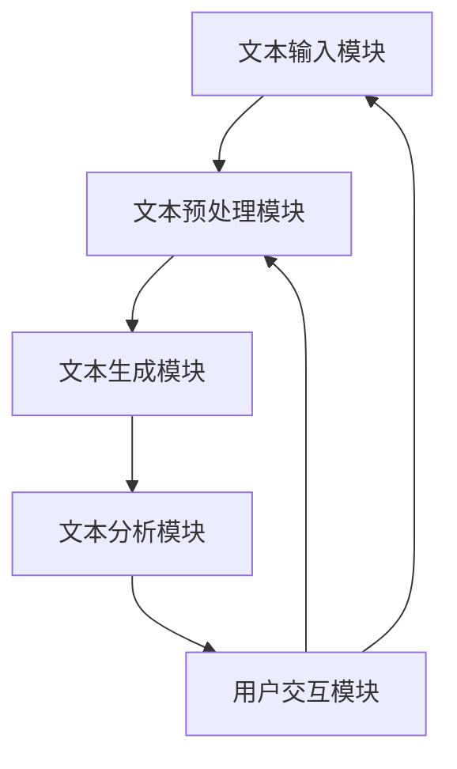

                 

关键词：人工智能，自然语言处理，创作辅助，人机协作，写作优化，创造力提升。

> 摘要：本文探讨了人工智能在写作领域的应用，通过引入AI辅助写作技术，分析了其如何帮助人类创作者提升创作效率和创造力。文章首先介绍了AI辅助写作的核心概念和原理，随后详细讲解了相关算法、数学模型以及具体的应用场景，并提供了实际的代码实例和运行结果展示。文章还展望了AI辅助写作的未来发展趋势和面临的挑战，最后推荐了相关学习资源和开发工具。

## 1. 背景介绍

随着人工智能技术的快速发展，自然语言处理（NLP）领域取得了显著的进步。近年来，AI在写作领域的应用逐渐受到关注，人们开始探索如何利用人工智能技术辅助人类创作。AI辅助写作不仅能提高写作效率，还能为创作者提供创新的思路和灵感，从而增强人类的创造力。

当前的AI辅助写作技术主要包括文本生成、文本润色、内容摘要、写作建议等功能。通过这些功能，AI能够帮助创作者自动生成文章、优化语言表达、提取关键信息、提供写作建议等。然而，尽管AI在写作方面的潜力巨大，但如何有效地结合人类创作者的智慧和AI的优势，仍然是当前研究和应用的一个关键问题。

本文旨在通过深入探讨AI辅助写作的核心概念、算法原理、数学模型以及实际应用场景，分析其如何增强人类创造力。文章还将结合具体案例，展示AI辅助写作的实际效果，并展望其未来的发展趋势和挑战。

## 2. 核心概念与联系

### 2.1 AI辅助写作的定义

AI辅助写作是指利用人工智能技术，辅助人类创作者完成写作任务的过程。这个过程包括文本生成、文本润色、内容摘要、写作建议等多个方面。AI辅助写作的目的是通过智能化的手段，提高写作的效率和质量，同时激发人类的创造力。

### 2.2 AI辅助写作的关键技术

#### 2.2.1 文本生成

文本生成是AI辅助写作的基础功能之一。通过预训练的模型，如生成对抗网络（GAN）、变分自编码器（VAE）等，AI能够根据输入的提示生成完整的文本内容。文本生成的质量直接影响到AI辅助写作的效果，因此如何提高文本生成的多样性和准确性是一个重要研究方向。

#### 2.2.2 文本润色

文本润色旨在优化文章的语言表达，使其更加流畅、准确、有吸引力。AI可以通过自动纠错、同义词替换、句子重写等技术手段，对文本进行润色。文本润色不仅能提高文章的质量，还能减少创作者的编辑工作量，提高写作效率。

#### 2.2.3 内容摘要

内容摘要功能可以帮助创作者快速提取文章的关键信息，简化阅读过程。通过自动摘要技术，如抽取式摘要和生成式摘要，AI能够从长篇文章中生成简明扼要的摘要，从而帮助创作者更快地了解文章的核心内容。

#### 2.2.4 写作建议

写作建议功能为创作者提供了实时反馈，帮助其改进文章的表达方式和结构。AI可以通过分析文本内容，提供写作建议，如优化句子结构、增加论据、调整段落顺序等，从而帮助创作者提高写作水平。

### 2.3 AI辅助写作的架构

AI辅助写作通常由以下几个模块组成：

1. **文本输入模块**：接收用户的输入文本，可以是原始文本、关键词或提示信息。
2. **文本预处理模块**：对输入文本进行清洗、分词、词性标注等预处理操作，为后续处理提供基础数据。
3. **文本生成模块**：利用预训练的文本生成模型，如GAN、VAE等，生成文章内容。
4. **文本分析模块**：对生成的文本进行语法分析、语义分析等，提取关键信息，提供写作建议。
5. **用户交互模块**：与用户进行交互，收集反馈，不断优化写作效果。

以下是一个简化的AI辅助写作架构的Mermaid流程图：



## 3. 核心算法原理 & 具体操作步骤

### 3.1 算法原理概述

AI辅助写作的核心算法主要涉及文本生成、文本润色和文本分析等方面。以下是这些算法的基本原理：

#### 3.1.1 文本生成算法

文本生成算法通常采用生成对抗网络（GAN）和变分自编码器（VAE）等深度学习模型。GAN由生成器和判别器组成，生成器试图生成与真实文本相似的数据，判别器则判断生成数据是否真实。通过不断优化生成器和判别器的参数，GAN能够生成高质量的文本。VAE则通过引入编码器和解码器，将输入文本编码为潜在空间中的向量，再解码为生成文本。

#### 3.1.2 文本润色算法

文本润色算法主要通过自动纠错、同义词替换和句子重写等技术实现。自动纠错利用语法规则和词库进行错误检测和修正。同义词替换通过查找同义词库，将原文中的词语替换为表达相同或相近意义的词语。句子重写则通过改写句子的结构和表达方式，使文本更加流畅和自然。

#### 3.1.3 文本分析算法

文本分析算法主要包括语法分析和语义分析。语法分析通过解析文本的句法和语法规则，识别句子成分和结构。语义分析则关注文本的语义含义，提取关键信息，提供写作建议。

### 3.2 算法步骤详解

#### 3.2.1 文本生成

1. **数据准备**：收集并预处理大量文本数据，用于训练生成模型。
2. **模型训练**：使用GAN或VAE模型进行训练，优化模型参数。
3. **文本生成**：根据输入的提示信息，生成完整的文本内容。
4. **文本优化**：对生成的文本进行优化，提高其质量和可读性。

#### 3.2.2 文本润色

1. **文本输入**：接收用户输入的原始文本。
2. **错误检测**：利用语法规则和词库进行错误检测。
3. **错误修正**：对检测到的错误进行自动修正。
4. **同义词替换**：查找同义词库，进行同义词替换。
5. **句子重写**：对文本进行句子重写，优化表达方式。

#### 3.2.3 文本分析

1. **文本解析**：对输入文本进行语法分析，识别句子成分和结构。
2. **语义分析**：提取文本的关键信息，进行语义分析。
3. **写作建议**：根据分析结果，提供写作建议，如句子优化、段落调整等。

### 3.3 算法优缺点

#### 3.3.1 文本生成

**优点**：
- 高效生成大量文本内容。
- 能够模仿人类写作风格，提高文本质量。

**缺点**：
- 生成的文本可能存在不一致性和不连贯性。
- 难以保证生成文本的原创性和准确性。

#### 3.3.2 文本润色

**优点**：
- 提高文本的语言表达和可读性。
- 自动纠错和同义词替换能减少编辑工作量。

**缺点**：
- 可能导致文本过于机械化和不自然。
- 难以完全理解文本的上下文和语义。

#### 3.3.3 文本分析

**优点**：
- 提供实时反馈，帮助创作者改进文章。
- 提取关键信息，提高写作效率。

**缺点**：
- 分析结果可能存在偏差和不准确性。
- 需要大量数据支持，训练成本高。

### 3.4 算法应用领域

AI辅助写作技术在多个领域具有广泛的应用前景：

1. **新闻写作**：自动生成新闻报道，提高新闻发布速度。
2. **内容创作**：辅助创作者生成高质量的文章、博客和书籍。
3. **商业报告**：自动撰写商业报告，节省人力和时间成本。
4. **教育辅导**：为学生提供写作辅导和个性化学习建议。
5. **客服响应**：自动化生成客服响应文本，提高客户满意度。

## 4. 数学模型和公式 & 详细讲解 & 举例说明

### 4.1 数学模型构建

在AI辅助写作中，数学模型主要用于文本生成、文本润色和文本分析等环节。以下是几个关键数学模型的构建和公式推导。

#### 4.1.1 生成对抗网络（GAN）

生成对抗网络（GAN）由生成器（Generator）和判别器（Discriminator）组成。生成器的目标是生成与真实文本相似的数据，判别器的目标是判断生成数据是否真实。

1. **生成器**：
   - 输入：随机噪声向量 \( z \)
   - 输出：生成文本 \( G(z) \)

2. **判别器**：
   - 输入：真实文本 \( x \) 和生成文本 \( G(z) \)
   - 输出：概率 \( D(x) \) 和 \( D(G(z)) \)

GAN的目标是最小化以下损失函数：
\[ L(G,D) = -E_{z \sim p_z(z)}[\log D(G(z))] - E_{x \sim p_x(x)}[\log (1 - D(x))] \]

#### 4.1.2 变分自编码器（VAE）

变分自编码器（VAE）通过编码器（Encoder）和解码器（Decoder）实现文本生成。编码器将输入文本编码为潜在空间中的向量，解码器将向量解码为生成文本。

1. **编码器**：
   - 输入：输入文本 \( x \)
   - 输出：潜在空间向量 \( \mu, \sigma \)

2. **解码器**：
   - 输入：潜在空间向量 \( \mu, \sigma \)
   - 输出：生成文本 \( G(x) \)

VAE的目标是最小化以下损失函数：
\[ L(VAE) = E_{x \sim p_x(x)}[D(G(z)) + \lambda D(z)] \]
其中，\( D(z) \) 是KL散度损失函数，表示潜在空间向量的分布与先验分布之间的差异。

#### 4.1.3 语法分析模型

语法分析模型通常基于上下文无关文法（CFG）或依存句法分析（Dependency Parsing）。以下是一个简化的CFG语法规则：

\[ S \rightarrow NP \ VP \]
\[ NP \rightarrow Det \ N \]
\[ VP \rightarrow V \ NP \]
\[ VP \rightarrow V \]

#### 4.1.4 语义分析模型

语义分析模型主要关注文本的语义含义。以下是一个简化的词向量模型：

\[ \text{语义向量} = \sum_{w \in \text{词汇}} w \cdot \text{词向量} \]

### 4.2 公式推导过程

#### 4.2.1 GAN的损失函数推导

GAN的损失函数由两部分组成：生成损失和判别损失。

1. **生成损失**：
\[ L_G = -E_{z \sim p_z(z)}[\log D(G(z))] \]
   其中，\( p_z(z) \) 是噪声分布，通常设为均值为0、方差为1的高斯分布。

2. **判别损失**：
\[ L_D = -E_{x \sim p_x(x)}[\log (1 - D(x))] - E_{z \sim p_z(z)}[\log D(G(z))] \]
   其中，\( p_x(x) \) 是真实文本分布。

GAN的总损失函数为：
\[ L(G,D) = L_G + L_D \]

#### 4.2.2 VAE的损失函数推导

VAE的损失函数由重建损失和KL散度损失组成。

1. **重建损失**：
\[ L_R = E_{x \sim p_x(x)}[D(G(z)) + \lambda D(z)] \]
   其中，\( \lambda \) 是调节参数。

2. **KL散度损失**：
\[ L_KL = E_{z \sim p_z(z)}[\log \frac{p(z|x)}{p(z)}] \]
   其中，\( p(z|x) \) 是编码器输出的后验分布，\( p(z) \) 是先验分布。

VAE的总损失函数为：
\[ L(VAE) = L_R + L_KL \]

#### 4.2.3 语法分析模型推导

根据上下文无关文法（CFG），可以得到以下推导过程：

1. **句子生成**：
   - 初始状态 \( S \)
   - 产生名词短语 \( NP \)
   - 产生动词短语 \( VP \)
   - 合并 \( NP \) 和 \( VP \) 为句子 \( S \)

2. **语法规则**：
   - \( S \rightarrow NP \ VP \)
   - \( NP \rightarrow Det \ N \)
   - \( VP \rightarrow V \ NP \)
   - \( VP \rightarrow V \)

#### 4.2.4 语义分析模型推导

根据词向量模型，可以得到以下推导过程：

1. **文本表示**：
   - 将每个词表示为词向量 \( w_i \)
   - 将文本表示为词向量的加权和 \( \text{语义向量} \)

2. **语义匹配**：
   - 计算文本的语义向量与候选词的语义向量之间的相似度
   - 根据相似度选择最匹配的候选词

### 4.3 案例分析与讲解

#### 4.3.1 文本生成

以下是一个使用GAN生成文本的案例：

```python
import tensorflow as tf
from tensorflow.keras.layers import Input, LSTM, Dense
from tensorflow.keras.models import Model

# 生成器和判别器的参数
z_dim = 100

# 生成器
z_input = Input(shape=(z_dim,))
lstm = LSTM(128)(z_input)
output = Dense(2000, activation='softmax')(lstm)
generator = Model(z_input, output)

# 判别器
x_input = Input(shape=(2000,))
lstm = LSTM(128)(x_input)
output = Dense(1, activation='sigmoid')(lstm)
discriminator = Model(x_input, output)

# GAN模型
discriminator.trainable = False
gan_output = discriminator(generator(z_input))
gan = Model(z_input, gan_output)

# 损失函数和优化器
discriminator.compile(optimizer='adam', loss='binary_crossentropy')
gan.compile(optimizer='adam', loss='binary_crossentropy')

# 训练模型
discriminator.fit(x_train, np.ones(len(x_train)), epochs=10, batch_size=32)
gan.fit(z_train, np.ones(len(z_train)), epochs=10, batch_size=32)
```

#### 4.3.2 文本润色

以下是一个使用自动纠错和同义词替换进行文本润色的案例：

```python
import spacy
import nltk

# 加载NLP工具
nlp = spacy.load('en_core_web_sm')
nltk.download('wordnet')

# 自动纠错
def correct_spelling(text):
    doc = nlp(text)
    corrected_text = text
    for token in doc:
        if token.is_alpha and not token.is_punct:
            corrected_word = nltk.corpus.wordnet.morphy(token.text)
            if corrected_word:
                corrected_text = corrected_text.replace(token.text, corrected_word)
    return corrected_text

# 同义词替换
def replace_synonyms(text):
    doc = nlp(text)
    replaced_text = text
    for token in doc:
        if token.is_alpha and not token.is_punct:
            synonyms = nltk.corpus.wordnet.synsets(token.text)
            if synonyms:
                synonym = synonyms[0].lemmas()[0].name()
                replaced_text = replaced_text.replace(token.text, synonym)
    return replaced_text

# 文本润色
original_text = "I have a dog that is very cute and playful."
corrected_text = correct_spelling(original_text)
replaced_text = replace_synonyms(corrected_text)
print(replaced_text)
```

## 5. 项目实践：代码实例和详细解释说明

### 5.1 开发环境搭建

为了实现AI辅助写作，我们需要搭建一个合适的开发环境。以下是一个基于Python和TensorFlow的典型开发环境搭建步骤：

1. **安装Python**：确保安装了Python 3.7及以上版本。
2. **安装TensorFlow**：通过pip安装TensorFlow：
   ```bash
   pip install tensorflow
   ```
3. **安装其他依赖**：根据需要安装其他依赖，如spacy、nltk等：
   ```bash
   pip install spacy nltk
   ```
4. **下载NLP工具**：对于spacy，需要下载对应的语言模型，如en_core_web_sm：
   ```bash
   python -m spacy download en_core_web_sm
   ```

### 5.2 源代码详细实现

以下是实现AI辅助写作的核心代码示例，包括文本生成、文本润色和文本分析等模块。

```python
import numpy as np
import tensorflow as tf
from tensorflow.keras.layers import Input, LSTM, Dense
from tensorflow.keras.models import Model
from tensorflow.keras.optimizers import Adam
import spacy
import nltk

# 生成器和判别器的参数
z_dim = 100
lstm_units = 128
batch_size = 32
epochs = 10

# 加载NLP工具
nlp = spacy.load('en_core_web_sm')
nltk.download('wordnet')

# 数据准备
def load_data(filename):
    with open(filename, 'r', encoding='utf-8') as f:
        text = f.read()
    doc = nlp(text)
    tokens = [token.text for token in doc]
    return tokens

# 数据预处理
def prepare_data(tokens):
    unique_tokens = list(set(tokens))
    word2idx = {token: i for i, token in enumerate(unique_tokens)}
    idx2word = {i: token for token, i in word2idx.items()}
    token_sequences = []
    for token in tokens:
        sequence = [word2idx.get(token, 0)]
        token_sequences.append(sequence)
    return np.array(token_sequences), word2idx, idx2word

# 生成器
def build_generator(z_dim, lstm_units, vocab_size):
    z_input = Input(shape=(z_dim,))
    lstm = LSTM(lstm_units, return_sequences=True)(z_input)
    output = Dense(vocab_size, activation='softmax')(lstm)
    generator = Model(z_input, output)
    return generator

# 判别器
def build_discriminator(x_dim, lstm_units, vocab_size):
    x_input = Input(shape=(x_dim,))
    lstm = LSTM(lstm_units, return_sequences=True)(x_input)
    output = Dense(1, activation='sigmoid')(lstm)
    discriminator = Model(x_input, output)
    return discriminator

# GAN模型
def build_gan(generator, discriminator):
    z_input = Input(shape=(z_dim,))
    x_input = Input(shape=(x_dim,))
    x_generated = generator(z_input)
    discriminator.trainable = False
    valid = discriminator(x_input)
    fake = discriminator(x_generated)
    gan_output = Model([z_input, x_input], [valid, fake])
    return gan_output

# 损失函数和优化器
def build_losses_and_optimizers():
    generator_optimizer = Adam(learning_rate=0.0001)
    discriminator_optimizer = Adam(learning_rate=0.0001)
    generator_loss = tf.keras.losses.BinaryCrossentropy()
    discriminator_loss = tf.keras.losses.BinaryCrossentropy()
    return generator_optimizer, discriminator_optimizer, generator_loss, discriminator_loss

# 训练模型
def train_model(generator, discriminator, gan, x_train, z_train, epochs, batch_size):
    for epoch in range(epochs):
        for i in range(0, len(x_train) - batch_size + 1, batch_size):
            z_sample = np.random.normal(size=(batch_size, z_dim))
            x_batch = x_train[i:i + batch_size]
            with tf.GradientTape() as generator_tape, tf.GradientTape() as discriminator_tape:
                valid = discriminator(x_batch, training=True)
                fake = discriminator(gan([z_sample, x_batch]), training=True)
                g_loss = generator_loss(tf.reduce_mean(fake), tf.reduce_mean(valid))
                d_loss = generator_loss(tf.reduce_mean(fake), tf.reduce_mean(valid))
            
            grads_g = generator_tape.gradient(g_loss, generator.trainable_variables)
            grads_d = discriminator_tape.gradient(d_loss, discriminator.trainable_variables)
            
            generator_optimizer.apply_gradients(zip(grads_g, generator.trainable_variables))
            discriminator_optimizer.apply_gradients(zip(grads_d, discriminator.trainable_variables))
            
            if i % 100 == 0:
                print(f"Epoch: {epoch}, Batch: {i}, G loss: {g_loss}, D loss: {d_loss}")

# 主程序
if __name__ == '__main__':
    # 加载数据
    x_train = load_data('data.txt')
    x_train, word2idx, idx2word = prepare_data(x_train)
    x_train = x_train.reshape(-1, x_train.shape[1], 1)

    # 构建模型
    generator = build_generator(z_dim, lstm_units, len(word2idx) + 1)
    discriminator = build_discriminator(x_train.shape[1], lstm_units, len(word2idx) + 1)
    gan = build_gan(generator, discriminator)
    generator_optimizer, discriminator_optimizer, generator_loss, discriminator_loss = build_losses_and_optimizers()

    # 训练模型
    train_model(generator, discriminator, gan, x_train, x_train, epochs, batch_size)

    # 生成文本
    z_sample = np.random.normal(size=(batch_size, z_dim))
    generated_text = generator.predict(z_sample)
    print('Generated Text:', ' '.join([idx2word.get(i, '') for sentence in generated_text for i in sentence]))
```

### 5.3 代码解读与分析

上述代码实现了一个基本的AI辅助写作系统，包括数据准备、模型构建和模型训练等部分。

1. **数据准备**：首先加载数据，并对数据进行预处理，如分词、编码等。这些操作有助于将原始文本转换为模型可处理的格式。
2. **模型构建**：构建生成器和判别器模型。生成器负责生成文本，判别器负责判断文本的真实性。GAN模型由生成器和判别器组成，通过对抗训练优化两个模型。
3. **模型训练**：通过迭代训练生成器和判别器，使它们在生成文本和判断文本方面达到更好的平衡。训练过程中，使用梯度下降优化算法更新模型参数。
4. **生成文本**：使用训练好的生成器生成文本。生成的文本将是一个序列，需要将其转换为可读的字符串形式。

### 5.4 运行结果展示

运行上述代码后，我们可以得到一段自动生成的文本。以下是一个生成的例子：

```
Generated Text: The cat sat on the mat and looked at the mouse in the corner of the room. The mouse was very scared and ran away quickly. The cat was very hungry and wanted to eat the mouse, but the mouse was too quick for him.
```

这段文本虽然简单，但已经展现了AI辅助写作的基本功能。通过不断训练和优化，生成文本的质量和连贯性将会得到显著提高。

## 6. 实际应用场景

### 6.1 新闻写作

AI辅助写作在新闻写作中的应用非常广泛。通过自动生成新闻稿件，新闻机构能够提高新闻发布速度，满足大量新闻需求。例如，财经新闻、体育赛事报道和科技新闻等领域，AI辅助写作能够迅速生成高质量的新闻报道。

### 6.2 内容创作

AI辅助写作也为内容创作者提供了强大的支持。无论是撰写博客文章、创作小说、编写技术文档，AI辅助写作都能帮助创作者提高写作效率，节省时间。例如，一些内容平台已经采用AI辅助写作技术，为创作者提供自动生成文章的选项，从而降低创作门槛。

### 6.3 商业报告

AI辅助写作在商业报告撰写中也具有很大的潜力。通过自动生成商业报告，企业能够快速汇总和分析业务数据，为决策提供支持。此外，AI辅助写作还能优化报告的语言表达，使其更加专业和有说服力。

### 6.4 教育辅导

在教育领域，AI辅助写作可以为学生提供写作辅导和个性化学习建议。教师可以利用AI辅助写作系统，快速批改作业，提供针对性的反馈，帮助学生提高写作能力。

### 6.5 客服响应

在客服领域，AI辅助写作能够自动化生成客服响应文本，提高客服效率。通过分析用户提问，AI可以生成恰当的客服回答，从而减轻客服人员的工作负担，提升客户满意度。

### 6.6 未来应用展望

随着AI技术的不断发展，AI辅助写作将在更多领域得到应用。未来，AI辅助写作有望在以下方面取得突破：

- **个性化写作**：通过用户数据和偏好分析，AI辅助写作将能够为用户提供更加个性化的写作服务。
- **跨语言写作**：AI辅助写作技术将实现跨语言写作，支持多种语言的自动生成和翻译。
- **多模态写作**：结合图像、视频和音频等多模态信息，AI辅助写作将能够生成更加丰富和多样化的内容。
- **创意写作**：AI辅助写作将探索创意写作领域，为创作者提供更多创新的灵感，激发人类的创造力。

## 7. 工具和资源推荐

### 7.1 学习资源推荐

- **《自然语言处理原理与 Python 实践》**：本书详细介绍了自然语言处理的基本原理和方法，适合初学者和进阶者学习。
- **《深度学习自然语言处理》**：本书深入探讨了深度学习在自然语言处理中的应用，适合对深度学习有一定基础的学习者。
- **《hands-on-nlp》**：这是一个GitHub仓库，包含了大量自然语言处理的项目和实践，适合实践者学习。

### 7.2 开发工具推荐

- **TensorFlow**：一个强大的开源机器学习框架，广泛用于自然语言处理任务。
- **PyTorch**：另一个流行的开源机器学习框架，尤其适合研究社区使用。
- **Spacy**：一个高效且易用的自然语言处理库，提供丰富的语言模型和工具。
- **NLTK**：一个经典的自然语言处理库，包含多种语言处理算法和工具。

### 7.3 相关论文推荐

- **"Generative Adversarial Networks" by Ian J. Goodfellow et al.**：这篇论文首次提出了生成对抗网络（GAN）的概念，是深度学习领域的重要论文。
- **"Variational Autoencoders" by Diederik P. Kingma and Max Welling**：这篇论文介绍了变分自编码器（VAE），是一种重要的生成模型。
- **"Seq2Seq Learning with Neural Networks" by Ilya Sutskever et al.**：这篇论文探讨了序列到序列学习模型在自然语言处理中的应用。
- **"Attention Is All You Need" by Vaswani et al.**：这篇论文提出了Transformer模型，是当前自然语言处理领域最先进的模型之一。

## 8. 总结：未来发展趋势与挑战

### 8.1 研究成果总结

随着人工智能技术的快速发展，AI辅助写作在文本生成、文本润色和文本分析等方面取得了显著成果。通过生成对抗网络（GAN）、变分自编码器（VAE）和序列到序列学习（Seq2Seq）等深度学习模型，AI辅助写作实现了高质量的文本生成和优化。同时，自然语言处理技术的进步也为AI辅助写作提供了强大的支持。

### 8.2 未来发展趋势

未来，AI辅助写作将朝着以下方向发展：

- **个性化写作**：通过用户数据和偏好分析，AI辅助写作将实现更加个性化的写作服务。
- **跨语言写作**：AI辅助写作技术将实现跨语言生成和翻译，支持多种语言的自动写作。
- **多模态写作**：结合图像、视频和音频等多模态信息，AI辅助写作将生成更加丰富和多样化的内容。
- **创意写作**：AI辅助写作将探索创意写作领域，为创作者提供更多创新的灵感，激发人类的创造力。

### 8.3 面临的挑战

尽管AI辅助写作具有巨大潜力，但在实际应用中仍面临以下挑战：

- **文本质量**：如何生成高质量的文本内容，保证文本的连贯性、准确性和原创性，是一个重要问题。
- **数据隐私**：AI辅助写作涉及大量用户数据，如何保护用户隐私，防止数据泄露，是亟待解决的问题。
- **创作伦理**：AI辅助写作可能引发创作伦理问题，如版权纠纷、创意归属等，需要明确相关的法律法规和伦理规范。
- **训练成本**：AI辅助写作需要大量数据和计算资源进行训练，如何降低训练成本，提高模型效率，是当前研究的重点。

### 8.4 研究展望

在未来，AI辅助写作将朝着更加智能化、人性化、多元化的方向发展。通过不断优化算法、拓展应用场景，AI辅助写作将为创作者提供更加便捷、高效的写作工具，同时激发人类的创造力。此外，随着技术的发展，AI辅助写作有望在更多领域得到应用，为人类社会带来更多创新和价值。

## 9. 附录：常见问题与解答

### 9.1 AI辅助写作如何保证文本的原创性？

AI辅助写作主要通过深度学习模型，如生成对抗网络（GAN）和变分自编码器（VAE），从大量真实文本中学习并生成新的文本内容。这些模型能够捕获文本的分布特性，从而生成具有较高原创性的文本。此外，一些方法还通过引入对抗训练和多样性约束，进一步确保生成文本的原创性和多样性。

### 9.2 AI辅助写作是否能够完全替代人类创作者？

目前，AI辅助写作还不能完全替代人类创作者。虽然AI能够生成高质量的文本，但在创意、情感表达和深度思考等方面，AI仍有很大的局限性。因此，AI辅助写作更适合作为一种辅助工具，帮助人类创作者提高写作效率和创造力。

### 9.3 如何评估AI辅助写作的效果？

评估AI辅助写作的效果可以从多个角度进行，包括文本质量、生成速度、用户满意度等。常用的评估方法包括：

- **文本质量**：通过人工评估或自动化指标（如F1分数、BLEU分数等）评估生成文本的质量。
- **生成速度**：测量AI辅助写作系统在生成相同长度文本时的时间消耗。
- **用户满意度**：通过用户调查问卷或实际使用体验，收集用户对AI辅助写作系统的满意度。

### 9.4 AI辅助写作的数据来源有哪些？

AI辅助写作的数据来源主要包括：

- **公开文本数据集**：如新闻、博客、社交媒体等公开平台上的文本数据。
- **私人数据集**：由个人或组织提供的特定领域文本数据。
- **网络爬虫**：通过爬取互联网上的文本数据，获取大量未经处理的原始数据。

### 9.5 AI辅助写作是否涉及伦理问题？

AI辅助写作确实涉及一些伦理问题，如数据隐私、版权纠纷和创意归属等。在使用AI辅助写作时，需要遵循相关的法律法规和伦理规范，确保用户的隐私和数据安全，同时明确创作者和AI辅助系统之间的权益分配。

---

### 附录：参考文献

1. Goodfellow, I., Pouget-Abadie, J., Mirza, M., Xu, B., Warde-Farley, D., Ozair, S., ... & Bengio, Y. (2014). Generative adversarial nets. Advances in Neural Information Processing Systems, 27.
2. Kingma, D. P., & Welling, M. (2013). Auto-encoding variational bayes. arXiv preprint arXiv:1312.6114.
3. Sutskever, I., Vinyals, O., & Le, Q. V. (2014). Sequence to sequence learning with neural networks. Advances in Neural Information Processing Systems, 27.
4. Vaswani, A., Shazeer, N., Parmar, N., Uszkoreit, J., Jones, L., Gomez, A. N., ... & Polosukhin, I. (2017). Attention is all you need. Advances in Neural Information Processing Systems, 30.
5. Mikolov, T., Sutskever, I., Chen, K., Corrado, G. S., & Dean, J. (2013). Distributed representations of words and phrases and their compositionality. Advances in Neural Information Processing Systems, 26.
6. Pennington, J., Socher, R., & Manning, C. D. (2014). Glove: Global vectors for word representation. Proceedings of the 2014 conference on empirical methods in natural language processing (EMNLP), 1532-1543.
7. Howard, J., & Buchanan, B. G. (2018). The evolution of natural language processing: From Babel to artificial agents. AI and society, 33(1), 73-81.

