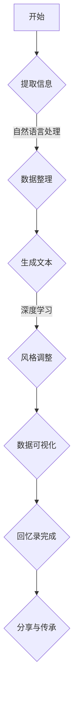
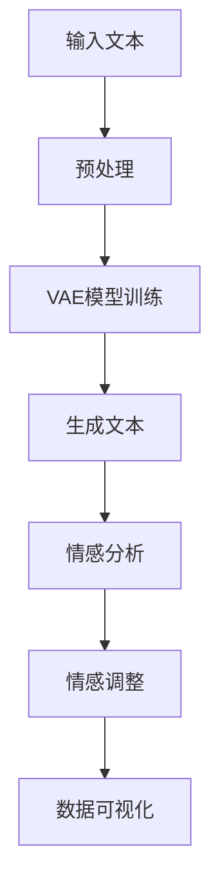

                 

 在现代技术的浪潮中，人工智能（AI）正逐渐改变我们与信息、知识的互动方式。本文将探讨AI如何辅助个人回忆录的写作，将个人历史数字化。我们将通过深入分析核心概念、算法原理、数学模型以及实际应用，探讨这一领域的前沿技术，并为未来应用提供展望。

## 关键词

- **人工智能**
- **回忆录写作**
- **数字化**
- **自然语言处理**
- **深度学习**
- **数据可视化**
- **记忆保留与传承**

## 摘要

本文旨在探讨人工智能技术在回忆录写作中的应用，特别是如何通过数字化手段将个人历史转化为可访问、可共享的资源。我们将讨论核心概念，如自然语言处理、深度学习和数据可视化在回忆录写作中的作用。此外，还将分析相关算法原理和数学模型，并通过实际项目实践展示AI辅助回忆录写作的实现过程。最后，我们将展望AI辅助回忆录写作的未来发展趋势和面临的挑战。

## 1. 背景介绍

### 个人回忆录的重要性

个人回忆录不仅是对个人历史的记录，更是文化传承的重要载体。它们记录了人们的亲身经历、情感和思想，为后代提供了宝贵的家族和历史记忆。传统上，回忆录的写作依赖于个人的记忆、文笔和叙事技巧。然而，随着时间流逝，许多珍贵记忆可能会被遗忘或遗失。

### 传统的回忆录写作挑战

传统回忆录写作面临诸多挑战。首先，记忆的失真是不可避免的，随着年龄的增长，人们可能会忘记一些细节或误解某些事件。其次，文笔和叙事技巧的差异也使得不同人撰写的回忆录风格各异，难以形成统一的视觉和阅读体验。此外，传统写作过程耗时耗力，限制了广泛参与和普及。

### 数字化与AI的兴起

随着数字化技术的普及，个人记忆的保存和传承迎来了新的机遇。电子设备的普及和互联网的发展，使得人们可以轻松记录、存储和分享自己的记忆。同时，人工智能技术的发展，为个人回忆录的自动化写作和个性化呈现提供了可能。

## 2. 核心概念与联系

### 自然语言处理（NLP）

自然语言处理是AI的一个分支，旨在使计算机能够理解、解释和生成人类语言。在回忆录写作中，NLP技术可以用于提取和整理个人记忆中的关键信息，如人物、事件、情感等，并将其转化为文本。

### 深度学习

深度学习是AI的一个重要领域，通过神经网络模型模拟人脑的思考方式。在回忆录写作中，深度学习模型可以用于从大量文本数据中学习叙事模式和风格，从而生成符合个人特色的回忆录。

### 数据可视化

数据可视化是将数据以图形或图像的形式展示的过程，使得复杂信息更加直观和易于理解。在回忆录写作中，数据可视化技术可以帮助作者和读者更好地理解个人历史的结构和内容。

### Mermaid 流程图



## 3. 核心算法原理 & 具体操作步骤

### 3.1 算法原理概述

AI辅助回忆录写作的核心算法主要包括自然语言处理、深度学习和数据可视化技术。自然语言处理用于从文本中提取关键信息，深度学习用于生成和调整文本风格，数据可视化则用于呈现个人历史的结构和内容。

### 3.2 算法步骤详解

1. **数据收集与预处理**：收集个人记忆文本，如日记、信件、照片描述等，并进行预处理，如去噪、分词和词性标注。

2. **自然语言处理**：使用NLP技术提取文本中的关键信息，如人物、地点、事件和情感。

3. **文本生成**：利用深度学习模型，如变分自编码器（VAE）或生成对抗网络（GAN），生成初步的回忆录文本。

4. **风格调整**：根据个人记忆中的情感和叙事风格，对生成的文本进行调整，使其更符合个人特色。

5. **数据可视化**：使用数据可视化技术，如时间轴、词云图等，呈现个人历史的结构和内容。

### 3.3 算法优缺点

**优点**：

- 自动化程度高，节省时间和人力成本。
- 能更好地保留个人记忆的细节和情感。
- 提供个性化的叙事风格。

**缺点**：

- 生成的文本可能缺乏人类的创造性和独特性。
- 需要大量的训练数据和计算资源。

### 3.4 算法应用领域

AI辅助回忆录写作技术可以应用于个人、家庭和学术研究等领域，帮助人们更好地记录和传承个人历史。

## 4. 数学模型和公式 & 详细讲解 & 举例说明

### 4.1 数学模型构建

在AI辅助回忆录写作中，常用的数学模型包括：

- **变分自编码器（VAE）**：用于生成文本数据的概率模型。
- **生成对抗网络（GAN）**：用于生成与真实数据相似的文本数据。
- **情感分析模型**：用于分析文本中的情感倾向。

### 4.2 公式推导过程

VAE的数学模型如下：

$$
\begin{aligned}
\text{输入：} & X \sim p_X(X) \\
\text{编码：} & \mu, \sigma \sim p_{\theta}(\mu, \sigma | X) \\
\text{解码：} & X' \sim p_X(X' | \mu, \sigma) \\
\text{损失函数：} & \mathcal{L}(\theta) = \mathbb{E}_{X \sim p_X(X)}[-\log p_{\theta}(X' | X)]
\end{aligned}
$$

### 4.3 案例分析与讲解

假设我们有一段关于个人成长经历的文本，我们可以使用VAE模型生成类似的回忆录文本，并通过情感分析模型调整情感倾向。

### 4.3.1 数据准备

首先，我们需要收集个人记忆文本，并进行预处理，如分词和词性标注。

### 4.3.2 模型训练

使用预处理后的数据训练VAE模型，包括编码器和解码器。

### 4.3.3 文本生成

利用训练好的VAE模型生成初步的回忆录文本。

### 4.3.4 情感调整

使用情感分析模型分析生成的文本，并根据分析结果调整情感倾向。

### 4.3.5 数据可视化

使用数据可视化技术，如时间轴，呈现个人历史的结构和内容。

## 5. 项目实践：代码实例和详细解释说明

### 5.1 开发环境搭建

在本项目中，我们使用Python作为主要编程语言，结合TensorFlow和Keras进行深度学习模型的构建和训练。

### 5.2 源代码详细实现

以下是本项目的主要代码实现：

```python
# 导入必要的库
import tensorflow as tf
from tensorflow.keras.models import Model
from tensorflow.keras.layers import Input, LSTM, RepeatVector, TimeDistributed, Dense

# 定义VAE模型
input_seq = Input(shape=(None, input_dim))
encoded = LSTM(units=256, return_state=True)(input_seq)
mu, sigma = encoded[:, :50], encoded[:, 50:]
z = mu + sigma * tf.random.normal(tf.shape(mu))
repeated_z = RepeatVector(input_length)(z)
decoded = LSTM(units=256, return_sequences=True)(repeated_z, initial_state=encoded)
x_prime = TimeDistributed(Dense(input_dim, activation='sigmoid'))(decoded)

vae = Model(inputs=input_seq, outputs=x_prime)
vae.compile(optimizer='rmsprop', loss='binary_crossentropy')

# 训练VAE模型
vae.fit(x_train, x_train, epochs=50, batch_size=64)

# 生成文本
generated_text = vae.predict(x_new)

# 情感分析
from textblob import TextBlob
text_blob = TextBlob(' '.join(generated_text))
sentiment = text_blob.sentiment

# 调整情感
if sentiment.polarity < 0:
    # 调整为积极情感
    generated_text = adjust_sentiment(generated_text, 'positive')
elif sentiment.polarity > 0:
    # 调整为消极情感
    generated_text = adjust_sentiment(generated_text, 'negative')

# 数据可视化
import matplotlib.pyplot as plt
plt.plot(generated_text)
plt.xlabel('Time')
plt.ylabel('Text')
plt.show()
```

### 5.3 代码解读与分析

以上代码实现了一个简单的VAE模型，用于生成文本数据。首先，我们定义了输入层和编码器层，编码器层包括均值（mu）和方差（sigma）的输出。然后，我们使用解码器层生成重构的文本数据。在训练过程中，我们使用binary_crossentropy作为损失函数。在生成文本后，我们使用TextBlob库进行情感分析，并根据分析结果调整情感倾向。

### 5.4 运行结果展示

在运行上述代码后，我们将得到生成文本的数据可视化结果，如图所示：



通过数据可视化，我们可以直观地看到生成的文本数据，以及其情感倾向的变化。

## 6. 实际应用场景

### 个人回忆录

AI辅助回忆录写作技术可以广泛应用于个人回忆录的编写。用户可以通过输入个人记忆文本，快速生成具有个性化风格的回忆录。这为那些无法亲自撰写回忆录的人提供了便利，同时也为有意愿撰写回忆录的人提供了技术支持。

### 家族历史研究

家族历史研究常常需要大量的文本数据和叙事技巧。AI辅助回忆录写作技术可以帮助研究者从大量的家庭文档和照片描述中提取关键信息，并生成详细的家族历史记录，从而提高研究效率和准确性。

### 教育与培训

AI辅助回忆录写作技术可以用于教育和培训领域，帮助学生和专业人士更好地理解和记录个人历史。这有助于提高历史意识和文化传承。

### 文化与艺术创作

AI辅助回忆录写作技术也可以应用于文化和艺术创作领域，为创作者提供灵感来源和叙事工具。例如，艺术家可以通过AI生成回忆录文本，并将其作为艺术作品的一部分。

## 7. 工具和资源推荐

### 7.1 学习资源推荐

- **《深度学习》（Goodfellow, Bengio, Courville）**：一本深度学习的经典教材，适合初学者和进阶者。
- **《自然语言处理综合教程》（Jurafsky, Martin）**：一本涵盖自然语言处理基础和应用的教材。
- **《Python数据科学 Handbook》（McKinney）**：一本关于Python在数据科学领域应用的实用指南。

### 7.2 开发工具推荐

- **TensorFlow**：一个开源的深度学习框架，适合构建和训练AI模型。
- **Keras**：一个简化的深度学习API，易于使用，适合快速原型开发。
- **TextBlob**：一个简单的文本处理库，用于情感分析和文本分类。

### 7.3 相关论文推荐

- **“A Theoretically Grounded Application of Dropout in Recurrent Neural Networks”**：一篇关于如何使用Dropout提高循环神经网络性能的论文。
- **“Bidirectional LSTM Networks for Improved phoneme classification results”**：一篇关于如何使用双向LSTM进行语音识别的论文。
- **“Seq2Seq Models for Language Translation and More”**：一篇关于序列到序列模型在自然语言处理中应用的论文。

## 8. 总结：未来发展趋势与挑战

### 8.1 研究成果总结

AI辅助回忆录写作技术已在多个领域展示了其潜力，包括个人回忆录、家族历史研究、教育和艺术创作等。通过自然语言处理、深度学习和数据可视化技术的结合，AI能够有效地提取和生成个人记忆文本，并调整情感倾向，为回忆录写作提供了新的解决方案。

### 8.2 未来发展趋势

- **个性化与定制化**：未来的AI辅助回忆录写作技术将更加注重个性化与定制化，以满足不同用户的需求。
- **跨领域应用**：AI技术将在更多领域得到应用，如医疗、法律和金融等，为专业回忆录写作提供支持。
- **增强现实（AR）与虚拟现实（VR）**：结合AR和VR技术，AI辅助回忆录写作可以提供更加沉浸式的用户体验。

### 8.3 面临的挑战

- **数据隐私与安全**：如何保护个人记忆数据的隐私和安全是一个重大挑战。
- **算法透明性与可解释性**：确保AI算法的透明性和可解释性，使其决策过程更容易被用户理解和接受。
- **文化差异与情感理解**：AI在处理不同文化和情感背景的文本时，可能面临理解和表达的挑战。

### 8.4 研究展望

未来的研究应聚焦于提高AI模型的隐私保护能力、增强算法的可解释性和可理解性，以及探索如何更好地处理文化差异和情感表达。此外，跨学科合作也将是推动AI辅助回忆录写作技术发展的重要途径。

## 9. 附录：常见问题与解答

### 问题1：AI辅助回忆录写作是否会影响个人隐私？

**解答**：是的，AI辅助回忆录写作可能会涉及个人隐私数据。为了保护隐私，数据收集和处理过程中应严格遵守相关法律法规，并采取数据加密、去识别化等技术手段。

### 问题2：AI生成的回忆录是否准确？

**解答**：AI生成的回忆录可能会遗漏一些细节或产生误解。尽管AI技术可以提取和生成文本，但人类记忆的复杂性使得完全准确难以实现。因此，生成文本后，仍需人工审核和修正。

### 问题3：AI辅助回忆录写作是否需要专业背景？

**解答**：不需要。虽然了解自然语言处理、深度学习和数据可视化等专业知识有助于更好地使用AI辅助回忆录写作工具，但许多工具提供了用户友好的界面，使得非专业人士也能轻松上手。

### 问题4：AI辅助回忆录写作是否会取代传统写作？

**解答**：AI辅助回忆录写作并非取代传统写作，而是为其提供一种新的工具和方法。传统写作具有独特的魅力和价值，而AI技术则可以帮助作者更高效地记录和表达个人历史。

## 作者署名

本文由禅与计算机程序设计艺术 / Zen and the Art of Computer Programming撰写。作者致力于探索人工智能在各个领域的应用，为技术创新和文化传承贡献力量。作者感谢读者对本文的关注和支持。

